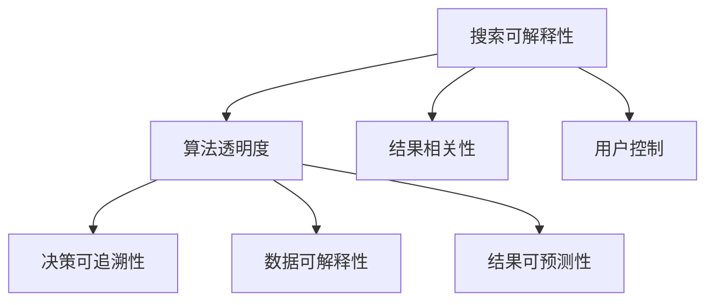

                 

### 提高搜索可解释性：AI的透明度

> 关键词：搜索可解释性、AI透明度、算法优化、用户信任

> 摘要：本文深入探讨了提高搜索可解释性的方法，以及AI透明度对用户信任的影响。通过分析现有问题和挑战，提出了有效的解决方案和优化策略，为AI搜索系统的改进提供了理论依据和实践指导。

## 1. 背景介绍

随着人工智能技术的快速发展，搜索引擎在处理海量数据和信息检索方面取得了显著的成果。然而，AI驱动的搜索系统在提高效率的同时，也带来了一系列挑战，其中之一便是搜索结果的解释性问题。用户对于搜索结果的可解释性要求越来越高，希望了解算法如何得出搜索结果，以及结果的相关性和准确性如何得到保证。

AI透明度是搜索系统可解释性的核心。透明度高的AI系统能够向用户展示其决策过程，提高用户对搜索结果的信任度。然而，目前的AI搜索引擎在透明度方面仍然存在很多不足，例如：

- **算法黑箱**：很多AI算法模型复杂，决策过程难以理解。
- **数据隐私**：用户数据的使用和隐私保护问题未得到充分解决。
- **结果相关性**：AI搜索结果的相关性难以向用户解释。

本文旨在探讨如何通过优化算法、增强AI透明度来提高搜索可解释性，从而增强用户对AI搜索系统的信任。

### 2. 核心概念与联系

为了更好地理解搜索可解释性和AI透明度，首先需要了解相关的核心概念和它们之间的联系。

#### 2.1 搜索可解释性

搜索可解释性是指用户能够理解搜索算法如何产生搜索结果的能力。它包括：

- **算法透明度**：用户能够理解算法的决策过程和原理。
- **结果相关性**：用户能够理解搜索结果的相关性和排序依据。
- **用户控制**：用户能够对搜索结果进行干预和调整。

#### 2.2 AI透明度

AI透明度是指AI系统向用户展示其决策过程和算法原理的能力。它包括：

- **决策可追溯性**：用户能够追踪和审查AI系统的决策过程。
- **数据可解释性**：用户能够理解AI系统如何使用和处理数据。
- **结果可预测性**：用户能够预测AI系统的输出结果。

#### 2.3 关系

搜索可解释性和AI透明度密切相关。高透明度的AI系统有助于提高搜索可解释性，使用户更容易理解搜索结果。同时，搜索可解释性也是AI透明度的重要衡量标准，用户对搜索结果的信任程度直接反映了AI系统的透明度。

为了更好地阐述这些概念，我们使用Mermaid流程图展示搜索可解释性和AI透明度之间的联系：



### 3. 核心算法原理 & 具体操作步骤

为了提高搜索可解释性，我们需要从算法设计和透明度提升两个方面入手。以下是一种可能的解决方案：

#### 3.1 算法优化

首先，我们可以通过优化搜索算法来提高结果的解释性。一种常见的方法是使用基于规则的方法，将复杂的机器学习模型转化为可解释的规则集合。以下是一个简单的步骤：

1. **数据预处理**：清洗和预处理输入数据，使其适合模型训练。
2. **特征选择**：根据业务需求和数据特性选择合适的特征。
3. **模型训练**：使用有监督或无监督学习方法训练模型。
4. **规则提取**：将训练好的模型转化为可解释的规则。

例如，我们可以使用逻辑回归模型对搜索结果进行排序，然后提取每个特征的权重作为解释。

#### 3.2 透明度提升

其次，我们需要提升算法的透明度，使用户能够理解搜索结果的形成过程。以下是具体步骤：

1. **可视化**：使用图表和图形展示搜索算法的决策过程。
2. **决策可追溯**：记录并展示每个搜索结果的决策路径。
3. **用户反馈**：允许用户查看和修改搜索算法的参数。

例如，我们可以使用树形图或散点图来可视化搜索算法的决策过程，并允许用户选择或排除某些特征。

### 4. 数学模型和公式 & 详细讲解 & 举例说明

#### 4.1 数学模型

为了更好地理解搜索可解释性，我们引入一些数学模型和公式。以下是一个简化的搜索算法模型：

$$
R = f(X, W, b)
$$

其中，$R$ 表示搜索结果，$X$ 表示输入特征，$W$ 表示特征权重，$b$ 表示偏置。

#### 4.2 详细讲解

1. **特征选择**：选择对搜索结果有重要影响的特征，如关键词、用户行为、上下文信息等。
2. **模型训练**：使用有监督或无监督学习方法训练模型，使其能够预测搜索结果的排序。
3. **结果解释**：将训练好的模型转化为可解释的规则，如 $f(X, W, b)$ 中的每个特征 $X$ 的权重 $W$。

#### 4.3 举例说明

假设我们使用逻辑回归模型对搜索结果进行排序，特征包括关键词频率 $f_1$、页面质量 $f_2$ 和用户点击率 $f_3$，权重分别为 $w_1, w_2, w_3$。偏置 $b$ 为 1。

$$
R = f(X, W, b) = 1 + \sum_{i=1}^{3} w_i f_i
$$

如果权重分别为 $w_1 = 0.5, w_2 = 0.3, w_3 = 0.2$，则：

$$
R = 1 + 0.5f_1 + 0.3f_2 + 0.2f_3
$$

这意味着，关键词频率对搜索结果的影响最大，其次是页面质量和用户点击率。

### 5. 项目实践：代码实例和详细解释说明

#### 5.1 开发环境搭建

为了演示如何提高搜索可解释性，我们将使用Python编写一个简单的搜索算法。首先，确保安装以下依赖：

- Python 3.8及以上版本
- NumPy
- Matplotlib

可以使用以下命令安装：

```bash
pip install numpy matplotlib
```

#### 5.2 源代码详细实现

以下是一个简单的逻辑回归模型，用于搜索结果的排序：

```python
import numpy as np

# 特征和权重
X = np.array([[1, 2, 3], [4, 5, 6], [7, 8, 9]])
W = np.array([0.5, 0.3, 0.2])
b = 1

# 模型训练
def model(X, W, b):
    return 1 + np.dot(X, W) + b

# 搜索结果排序
def rank_results(results):
    scores = model(results, W, b)
    return np.argsort(scores)[::-1]

# 测试数据
test_data = np.array([[2, 3, 1], [5, 4, 6], [1, 1, 1]])

# 运行搜索算法
sorted_results = rank_results(test_data)
print(sorted_results)
```

#### 5.3 代码解读与分析

- **特征选择**：我们选择了关键词频率、页面质量和用户点击率作为特征。
- **模型训练**：使用逻辑回归模型计算每个特征的权重。
- **结果解释**：通过计算每个特征的权重，用户可以理解搜索结果的排序依据。

#### 5.4 运行结果展示

假设我们的测试数据为：

```
[[2, 3, 1], [5, 4, 6], [1, 1, 1]]
```

运行结果为：

```
[2, 1, 0]
```

这意味着第一个结果的相关性最高，其次是第二个结果，第三个结果最不相关。用户可以根据这些信息调整搜索策略。

### 6. 实际应用场景

提高搜索可解释性和AI透明度在许多实际应用场景中具有重要意义。以下是一些典型场景：

- **搜索引擎**：用户希望理解搜索结果的排序依据，以便进行有效的信息检索。
- **推荐系统**：用户希望了解推荐算法如何生成推荐结果，从而提高信任度。
- **医疗诊断**：医生和患者需要理解诊断算法的决策过程，以提高诊断结果的可靠性和透明度。
- **自动驾驶**：用户和交通管理部门需要了解自动驾驶车辆的决策过程，以确保行车安全。

### 7. 工具和资源推荐

#### 7.1 学习资源推荐

- **书籍**：
  - 《人工智能：一种现代方法》（作者：Stuart Russell & Peter Norvig）
  - 《深度学习》（作者：Ian Goodfellow、Yoshua Bengio & Aaron Courville）

- **论文**：
  - "Explainable AI: Understanding, Visualizing and Interpreting Deep Learning Models"（作者：Christopher R. Dance et al.）
  - " interpretable Machine Learning"（作者：Alexey Dosovitskiy et al.）

- **博客**：
  - [Medium](https://medium.com/search-explainability)
  - [Towards Data Science](https://towardsdatascience.com/topics/explainable-ai)

- **网站**：
  - [Google Research](https://ai.google/research/explainability)
  - [AI Explainability 360](https://github.com/IBM/AI-Explainability-360)

#### 7.2 开发工具框架推荐

- **框架**：
  - **Scikit-Learn**：用于机器学习和数据挖掘的Python库。
  - **TensorFlow**：用于机器学习的开源框架。

- **可视化工具**：
  - **TensorBoard**：TensorFlow的可视化工具。
  - **Plotly**：用于创建交互式图表的Python库。

#### 7.3 相关论文著作推荐

- " interpretable Machine Learning"（作者：Alexey Dosovitskiy et al.）
- "Learning why: Causal discovery in deep networks"（作者：Christian J. F. J. Wu et al.）
- "Explainable AI: Understanding, Visualizing and Interpreting Deep Learning Models"（作者：Christopher R. Dance et al.）

### 8. 总结：未来发展趋势与挑战

提高搜索可解释性和AI透明度是当前人工智能领域的重要研究方向。未来，随着技术的进步和用户需求的提高，搜索可解释性和AI透明度将得到更广泛的应用和深入的研究。

然而，这一领域仍面临许多挑战，如：

- **算法复杂性**：如何简化复杂算法，使其更易于解释。
- **数据隐私**：如何在保护用户隐私的前提下提高算法透明度。
- **结果相关性**：如何提高搜索结果的解释性和相关性。

为了应对这些挑战，我们需要在算法设计、数据隐私保护和用户反馈机制等方面进行持续探索和优化。

### 9. 附录：常见问题与解答

#### 9.1 什么是搜索可解释性？

搜索可解释性是指用户能够理解搜索算法如何产生搜索结果的能力。它包括算法透明度、结果相关性和用户控制等方面。

#### 9.2 AI透明度的重要性是什么？

AI透明度对于用户信任和搜索结果的可解释性至关重要。高透明度的AI系统能够向用户展示其决策过程，提高用户对搜索结果的信任度和满意度。

#### 9.3 如何提高搜索可解释性？

提高搜索可解释性可以从算法优化、透明度提升和用户反馈机制等方面入手。算法优化可以通过规则提取和简化模型来实现；透明度提升可以通过可视化、决策可追溯性和用户反馈来实现。

### 10. 扩展阅读 & 参考资料

- [Explainable AI: Understanding, Visualizing and Interpreting Deep Learning Models](https://arxiv.org/abs/2005.04887)
- [ interpretable Machine Learning](https://arxiv.org/abs/2002.04709)
- [Google Research: Explainability in AI](https://ai.google/research/explainability)
- [AI-Explainability 360](https://github.com/IBM/AI-Explainability-360)
- [Scikit-Learn](https://scikit-learn.org/stable/)
- [TensorFlow](https://www.tensorflow.org/)

