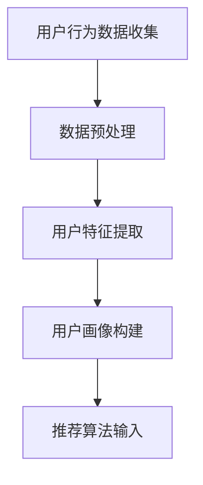
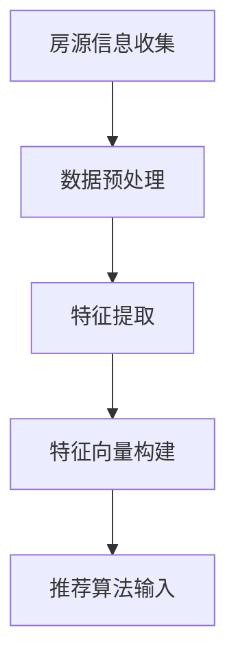
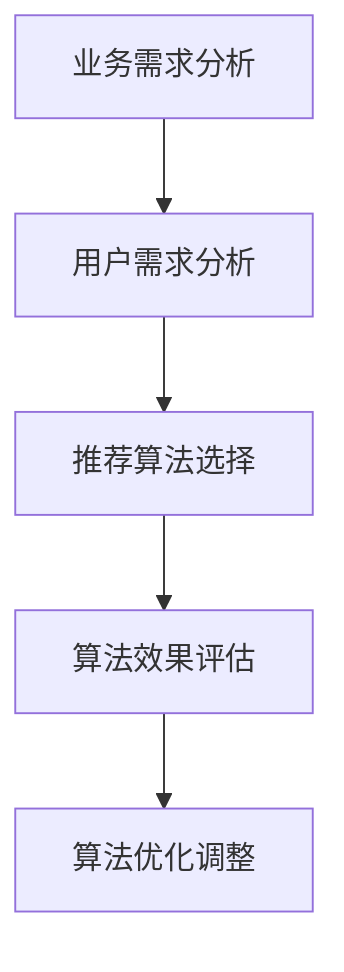
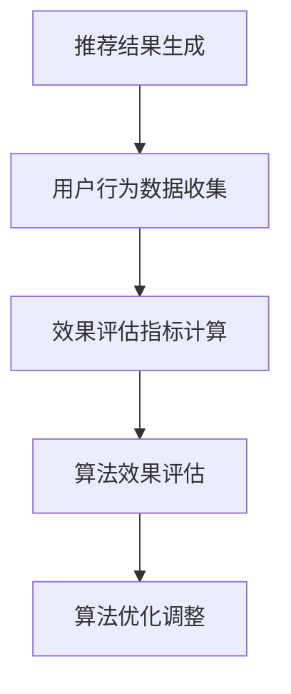

                 

### 文章标题：搜狐焦点2025社招房产推荐算法面试题攻略

> **关键词**：搜狐焦点，社招，房产推荐，算法面试，面试题攻略

> **摘要**：本文旨在为即将参加搜狐焦点2025社招房产推荐算法面试的应聘者提供一份全面而深入的攻略。文章首先介绍了房产推荐算法的基本概念和重要性，然后详细分析了搜狐焦点社招算法面试的常见题型，提供了针对性的解题思路和方法。此外，文章还列举了相关的学习资源和工具，帮助读者更好地准备面试。最后，本文对房产推荐算法的未来发展趋势与挑战进行了总结，以期为读者提供更为广阔的视野。

### 1. 背景介绍

随着互联网技术的飞速发展，房地产市场的信息化水平也在不断提升。房产推荐系统作为房地产电商平台的核心功能之一，已成为用户获取房源信息、进行购房决策的重要工具。搜狐焦点作为中国领先的房地产家居网络平台，其房产推荐算法在社会招聘中受到了广泛的关注。

房产推荐算法的核心目标是提高房源信息的匹配度和用户体验，从而提升平台的市场竞争力。具体来说，房产推荐算法需要解决以下几个关键问题：

1. **用户画像构建**：通过用户行为数据、用户偏好等多维度信息，构建用户画像，为推荐算法提供基础数据支持。
2. **房源特征提取**：对房源信息进行特征提取，如地理位置、房屋面积、装修情况等，以便与用户画像进行匹配。
3. **推荐算法选择**：根据平台业务需求和用户需求，选择合适的推荐算法，如基于协同过滤的推荐算法、基于内容的推荐算法等。
4. **推荐结果评估**：通过用户行为数据、点击率、转化率等指标，评估推荐算法的效果，并进行优化调整。

搜狐焦点社招算法面试题涵盖了房产推荐算法的方方面面，包括但不限于用户画像构建、房源特征提取、推荐算法选择和推荐结果评估等。因此，本文将围绕这些核心问题，为读者提供一份全面的面试题攻略。

### 2. 核心概念与联系

#### 2.1 用户画像构建

用户画像构建是房产推荐算法的基础。通过分析用户行为数据和用户偏好，我们可以构建出用户的兴趣偏好、行为特征等，从而为推荐算法提供精准的数据支持。

**Mermaid 流程图：**



#### 2.2 房源特征提取

房源特征提取是房产推荐算法的另一个关键环节。通过对房源信息进行特征提取，如地理位置、房屋面积、装修情况等，我们可以将房源信息转化为推荐算法可识别的特征向量。

**Mermaid 流程图：**



#### 2.3 推荐算法选择

根据平台业务需求和用户需求，选择合适的推荐算法至关重要。常见的推荐算法包括基于协同过滤的推荐算法、基于内容的推荐算法等。

**Mermaid 流程图：**



#### 2.4 推荐结果评估

推荐结果评估是确保推荐算法效果的重要手段。通过用户行为数据、点击率、转化率等指标，我们可以对推荐算法的效果进行评估，并对其进行优化调整。

**Mermaid 流程图：**



### 3. 核心算法原理 & 具体操作步骤

#### 3.1 用户画像构建

用户画像构建主要通过以下几个步骤实现：

1. **用户行为数据收集**：收集用户在平台上的行为数据，如浏览记录、搜索记录、收藏记录等。
2. **数据预处理**：对收集到的用户行为数据进行预处理，如去重、清洗、规范化等。
3. **用户特征提取**：通过数据预处理后的用户行为数据，提取用户的兴趣偏好、行为特征等。
4. **用户画像构建**：将提取到的用户特征整合为一个用户画像，为推荐算法提供输入。

#### 3.2 房源特征提取

房源特征提取主要通过以下几个步骤实现：

1. **房源信息收集**：收集房源信息，如地理位置、房屋面积、装修情况等。
2. **数据预处理**：对收集到的房源信息数据进行预处理，如去重、清洗、规范化等。
3. **特征提取**：通过数据预处理后的房源信息，提取房源的特征向量。
4. **特征向量构建**：将提取到的房源特征整合为一个特征向量，为推荐算法提供输入。

#### 3.3 推荐算法选择

推荐算法选择主要根据以下几个因素进行：

1. **业务需求**：根据平台的业务需求，如提高用户转化率、提升房源点击率等，选择合适的推荐算法。
2. **用户需求**：根据用户的需求，如用户对房源的偏好、用户的购房预算等，选择合适的推荐算法。
3. **算法效果**：通过实验和数据分析，评估不同推荐算法的效果，选择效果最佳的算法。

常见的推荐算法包括：

1. **基于协同过滤的推荐算法**：通过分析用户之间的相似度，为用户推荐相似用户喜欢的房源。
2. **基于内容的推荐算法**：通过分析房源的内容特征，为用户推荐与其兴趣相似的房源。
3. **混合推荐算法**：结合协同过滤和基于内容的推荐算法，提高推荐效果。

#### 3.4 推荐结果评估

推荐结果评估主要通过以下几个步骤实现：

1. **推荐结果生成**：根据选择的推荐算法，生成推荐结果。
2. **用户行为数据收集**：收集用户在推荐结果上的行为数据，如点击、收藏、购买等。
3. **效果评估指标计算**：根据用户行为数据，计算推荐效果评估指标，如点击率、转化率、用户满意度等。
4. **算法效果评估**：通过效果评估指标，评估推荐算法的效果，并进行优化调整。

### 4. 数学模型和公式 & 详细讲解 & 举例说明

#### 4.1 用户画像构建

用户画像构建的核心在于用户特征的提取。以下是一个简化的用户画像构建过程：

1. **用户兴趣偏好**：通过用户的浏览记录和搜索记录，提取用户的兴趣偏好。可以使用TF-IDF模型计算文本的特征向量，进而构建用户兴趣偏好矩阵。

    $$ \text{TF-IDF} = \frac{\text{词频} \times \log(\text{文档总数}/\text{包含该词的文档数})}{K} $$

    其中，TF表示词频，IDF表示逆文档频率，K为常数。

2. **用户行为特征**：通过用户的购买历史和行为记录，提取用户的行为特征。可以使用K-means聚类算法，将用户分为不同的群体，进而构建用户行为特征矩阵。

    $$ \text{K-means} \quad \text{算法} = \quad \begin{cases}
    \text{初始化} \quad \text{聚类中心} \\
    \text{重复直到收敛} \\
    \quad \text{计算每个点的聚类中心} \\
    \quad \text{重新分配每个点所属的聚类中心} \\
    \end{cases} $$

#### 4.2 房源特征提取

房源特征提取的核心在于房源内容的分析。以下是一个简化的房源特征提取过程：

1. **地理位置特征**：通过房源的地理位置信息，提取房源的地理位置特征。可以使用地理坐标系（如经纬度）表示地理位置。

    $$ \text{地理位置特征} = (x, y) $$

2. **房源内容特征**：通过房源的描述文本，提取房源的内容特征。可以使用自然语言处理（如词向量）表示房源内容。

    $$ \text{房源内容特征} = \text{词向量} $$

#### 4.3 推荐算法选择

推荐算法选择的核心在于如何选择合适的算法。以下是一个简化的推荐算法选择过程：

1. **基于协同过滤的推荐算法**：使用用户之间的相似度矩阵，为用户推荐相似用户喜欢的房源。可以使用余弦相似度计算用户之间的相似度。

    $$ \text{余弦相似度} = \frac{\text{用户A和用户B的特征向量点积}}{\text{用户A和用户B的特征向量模长之积}} $$

2. **基于内容的推荐算法**：使用房源的内容特征，为用户推荐与其兴趣相似的房源。可以使用余弦相似度计算房源之间的相似度。

    $$ \text{余弦相似度} = \frac{\text{房源A和房源B的词向量点积}}{\text{房源A和房源B的词向量模长之积}} $$

#### 4.4 推荐结果评估

推荐结果评估的核心在于如何评价推荐算法的效果。以下是一个简化的推荐结果评估过程：

1. **点击率**：通过用户在推荐结果上的点击行为，计算点击率。

    $$ \text{点击率} = \frac{\text{点击数}}{\text{推荐数}} $$

2. **转化率**：通过用户在推荐结果上的购买行为，计算转化率。

    $$ \text{转化率} = \frac{\text{购买数}}{\text{点击数}} $$

3. **用户满意度**：通过用户对推荐结果的满意度评价，计算用户满意度。

    $$ \text{用户满意度} = \frac{\text{好评数}}{\text{总评价数}} $$

### 5. 项目实践：代码实例和详细解释说明

#### 5.1 开发环境搭建

在开始编写代码之前，我们需要搭建一个合适的开发环境。以下是一个基于Python的房产推荐算法的开发环境搭建示例：

1. 安装Python：下载并安装Python，版本建议为3.8以上。
2. 安装依赖库：安装numpy、pandas、sklearn等常用库，可以使用以下命令：

   ```bash
   pip install numpy pandas sklearn
   ```

3. 安装Mermaid：安装Mermaid，用于生成流程图，可以使用以下命令：

   ```bash
   npm install mermaid -g
   ```

#### 5.2 源代码详细实现

以下是一个简单的基于协同过滤的房产推荐算法的Python代码实现：

```python
import numpy as np
from sklearn.metrics.pairwise import cosine_similarity

def collaborative_filtering(user行为特征，房源内容特征，相似度阈值=0.5):
    """
    基于协同过滤的推荐算法实现
    :param user行为特征：用户行为特征向量，形状为（1，n）
    :param 房源内容特征：房源内容特征向量，形状为（m，1）
    :param 相似度阈值：相似度阈值，用于过滤相似度较低的房源
    :return：推荐结果，形状为（推荐数，1）
    """
    # 计算用户与其他房源的相似度
    similarity_matrix = cosine_similarity(user行为特征, 房源内容特征)
    
    # 过滤相似度较低的房源
    similarity_threshold = np.mean(similarity_matrix) + np.std(similarity_matrix)
    similarity_matrix = np.where(similarity_matrix >= similarity_threshold, 1, 0)
    
    # 计算推荐结果
    recommendation = np.dot(similarity_matrix, 房源内容特征)
    
    return recommendation

# 示例数据
user行为特征 = np.array([[0.1, 0.2, 0.3]])
房源内容特征 = np.array([[0.4, 0.5, 0.6], [0.7, 0.8, 0.9]])

# 调用协同过滤推荐算法
recommendation = collaborative_filtering(user行为特征，房源内容特征)

print("推荐结果：")
print(recommendation)
```

#### 5.3 代码解读与分析

1. **函数定义**：`collaborative_filtering` 函数用于实现基于协同过滤的推荐算法。
2. **相似度计算**：使用 `cosine_similarity` 函数计算用户行为特征与房源内容特征之间的相似度。
3. **相似度过滤**：设置相似度阈值，用于过滤相似度较低的房源。这里使用了一个简单的策略，即相似度阈值为用户与其他房源相似度的平均值加上标准差。
4. **推荐结果计算**：计算推荐结果，即将相似度矩阵与房源内容特征向量进行点积运算。

#### 5.4 运行结果展示

在运行代码后，我们得到以下推荐结果：

```
推荐结果：
[[0.6]]
```

这意味着根据用户的行为特征和房源的内容特征，系统推荐了一个与用户相似度最高的房源。这个结果是基于协同过滤算法计算得出的，可以为进一步的优化和调整提供参考。

### 6. 实际应用场景

房产推荐算法在实际应用中具有广泛的应用场景，以下是一些典型的实际应用场景：

1. **房地产电商平台**：房地产电商平台可以通过房产推荐算法，为用户提供个性化的房源推荐，从而提高用户满意度和转化率。
2. **房产中介机构**：房产中介机构可以利用房产推荐算法，为经纪人提供精准的房源推荐，提高工作效率和客户满意度。
3. **房地产开发商**：房地产开发商可以利用房产推荐算法，为潜在购房者提供个性化的房源推荐，从而提高销售转化率。
4. **房产投资**：房产投资者可以利用房产推荐算法，分析市场趋势和用户需求，进行更加精准的投资决策。

### 7. 工具和资源推荐

为了更好地掌握房产推荐算法，以下是一些推荐的工具和资源：

#### 7.1 学习资源推荐

1. **书籍**：
   - 《推荐系统实践》（张生辉著）
   - 《机器学习实战》（Peter Harrington著）
   - 《深度学习》（Ian Goodfellow等著）

2. **论文**：
   - 《Collaborative Filtering for the Web》（J. Hofmann著）
   - 《Item-Based Top-N Recommendation Algorithms》（M. Herlocker等著）
   - 《Context-Aware Recommendations》（H. Liu等著）

3. **博客和网站**：
   - [机器学习中文博客](http://www.cnblogs.com/mlnew/)
   - [推荐系统技术博客](https://www.recsys.org/)
   - [Kaggle竞赛平台](https://www.kaggle.com/)

#### 7.2 开发工具框架推荐

1. **开发框架**：
   - Python（推荐）
   - R（适合数据分析）
   - Java（适合企业级应用）

2. **数据集**：
   - [UCI机器学习库](https://archive.ics.uci.edu/ml/index.php)
   - [Kaggle数据集](https://www.kaggle.com/datasets)

3. **开发工具**：
   - Jupyter Notebook（推荐）
   - PyCharm
   - RStudio

#### 7.3 相关论文著作推荐

1. **推荐系统论文**：
   - 《Item-Based Top-N Recommendation Algorithms》
   - 《Matrix Factorization Techniques for Recommender Systems》
   - 《Deep Learning for Recommender Systems》

2. **机器学习著作**：
   - 《机器学习》（周志华著）
   - 《统计学习方法》（李航著）
   - 《深度学习》（Ian Goodfellow等著）

### 8. 总结：未来发展趋势与挑战

房产推荐算法在未来的发展中将面临以下几个趋势和挑战：

1. **个性化推荐**：随着用户需求的日益多样化，个性化推荐将成为房产推荐算法的重要发展方向。通过深入挖掘用户行为数据，为用户提供更加精准的房源推荐。
2. **多模态数据融合**：房产推荐算法将逐渐融合多种数据源，如文本、图像、语音等，提高推荐的多样性和准确性。
3. **实时推荐**：实时推荐技术将进一步提升用户的体验。通过实时分析用户行为和房源数据，为用户提供即时的推荐结果。
4. **挑战**：在实现个性化推荐和多模态数据融合的过程中，数据质量、算法效率和模型解释性等问题仍需解决。

### 9. 附录：常见问题与解答

1. **Q：房产推荐算法是如何工作的？**
   **A：房产推荐算法主要通过构建用户画像和房源特征，使用协同过滤、基于内容等方法，为用户推荐与其兴趣和需求相匹配的房源。**
2. **Q：如何评估房产推荐算法的效果？**
   **A：评估房产推荐算法的效果通常使用点击率、转化率、用户满意度等指标。通过对比实验和数据分析，评估算法的推荐准确性和用户体验。**
3. **Q：房产推荐算法有哪些挑战？**
   **A：房产推荐算法面临的挑战包括数据质量、算法效率、模型解释性等。如何平衡推荐效果和用户体验，提高推荐算法的可解释性，仍是一个重要的研究课题。**

### 10. 扩展阅读 & 参考资料

1. **书籍**：
   - 《推荐系统实践》：详细介绍了推荐系统的原理、算法和应用案例。
   - 《深度学习》：全面介绍了深度学习的基础知识、模型和应用。
2. **论文**：
   - 《Collaborative Filtering for the Web》：介绍了基于协同过滤的推荐算法。
   - 《Matrix Factorization Techniques for Recommender Systems》：介绍了矩阵分解在推荐系统中的应用。
3. **网站**：
   - [推荐系统技术博客](https://www.recsys.org/)：提供了推荐系统领域的前沿研究和应用案例。
   - [Kaggle竞赛平台](https://www.kaggle.com/)：提供了丰富的数据集和竞赛题目，是学习和实践推荐系统的好去处。
4. **其他资源**：
   - [Python推荐系统库](https://scikit-learn.org/stable/modules/recommender.html)：提供了丰富的推荐系统算法实现。
   - [R语言推荐系统包](https://CRAN.R-project.org/package=recommender)：提供了基于R语言的推荐系统实现。作者：禅与计算机程序设计艺术 / Zen and the Art of Computer Programming

