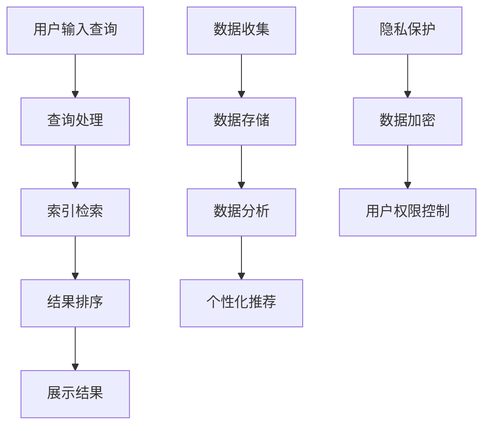

                 

# 搜索引擎与AI伦理的平衡

## 概述

在当前的信息时代，搜索引擎已成为人们获取信息、学习新知、进行决策的重要工具。随着人工智能技术的飞速发展，搜索引擎的功能也在不断提升，其背后依赖于复杂的算法和大量的数据。然而，这种技术进步也带来了诸多伦理问题。如何在保证搜索引擎高效、准确的同时，兼顾伦理考量，成为了一个亟待解决的重要课题。本文将深入探讨搜索引擎与AI伦理之间的平衡，分析其中的挑战，并提出一些建议。

## 背景介绍

搜索引擎的发展历程可以追溯到20世纪90年代，当时最早的搜索引擎如Yahoo和Altavista主要依靠人工索引和关键词匹配。随着互联网的爆炸性增长，搜索引擎面临着处理海量数据和提供精准搜索结果的需求。为此，Google在2000年推出了其革命性的PageRank算法，通过分析网页之间的链接关系来评估网页的重要性，从而实现更为准确的搜索结果。

进入21世纪，人工智能技术逐渐成为搜索引擎的核心驱动力。机器学习算法使得搜索引擎能够更好地理解用户查询意图，实现个性化搜索推荐。此外，自然语言处理（NLP）技术的进步使得搜索引擎能够处理更加复杂的语言结构，提供更为丰富的搜索结果。然而，这种技术进步也引发了诸多伦理问题，如数据隐私、算法偏见、信息过载等。

### 核心概念与联系

#### 搜索引擎的基本原理

搜索引擎的工作流程主要包括以下步骤：

1. **爬虫（Crawler）**：搜索引擎会使用爬虫程序自动访问互联网上的网页，收集网页内容。
2. **索引（Indexing）**：爬虫获取的网页内容会被处理和存储，形成索引，以便快速检索。
3. **查询处理（Query Processing）**：当用户输入查询时，搜索引擎会分析查询意图，并在索引中检索相关信息。
4. **结果排序（Ranking）**：根据一系列排序算法，搜索引擎会为用户提供最相关、最优质的搜索结果。

#### 人工智能在搜索引擎中的应用

1. **机器学习算法**：机器学习算法用于分析用户查询历史和网页内容，预测用户意图，提供个性化搜索结果。
2. **自然语言处理（NLP）**：NLP技术用于理解用户查询的语义，提供更为准确的搜索结果。
3. **深度学习**：深度学习算法能够通过大量数据自动学习，提高搜索结果的准确性和用户体验。

#### 伦理问题

1. **数据隐私**：搜索引擎需要收集和处理大量用户数据，如搜索历史、位置信息等。这些数据的隐私保护成为了一个重要问题。
2. **算法偏见**：机器学习算法可能因为训练数据的偏差而导致搜索结果的偏见，影响用户的公平性和多样性。
3. **信息过载**：搜索引擎需要平衡搜索结果的丰富性和用户处理的便捷性，防止信息过载。

### Mermaid 流程图



### 核心算法原理 & 具体操作步骤

搜索引擎的核心算法主要包括索引算法和排序算法。以下是这些算法的基本原理和操作步骤：

#### 索引算法

1. **倒排索引**：倒排索引是一种将文档内容与文档标识进行映射的索引结构。具体步骤如下：
   - 遍历所有文档，构建单词与文档的倒排表。
   - 对每个单词，记录其在所有文档中的出现位置。

2. **倒排索引优化**：为了提高搜索效率，可以采用以下优化策略：
   - 哈希索引：使用哈希函数将单词映射到索引位置，减少检索时间。
   - 布隆过滤器：用于快速判断一个单词是否存在于索引中，从而减少不必要的检索。

#### 排序算法

1. **PageRank算法**：PageRank是一种基于网页链接关系的排序算法。具体步骤如下：
   - 初始化：每个网页的PageRank值为1/总网页数。
   - 迭代：根据网页之间的链接关系，重新计算每个网页的PageRank值。
   - 判断收敛：当PageRank值变化小于某个阈值时，认为已经收敛。

2. **协同过滤算法**：协同过滤算法用于基于用户行为和偏好进行排序。具体步骤如下：
   - 用户-物品评分矩阵：构建用户与物品之间的评分矩阵。
   - 基于用户的协同过滤：寻找与目标用户相似的其他用户，根据相似度对搜索结果进行排序。
   - 基于物品的协同过滤：寻找与目标物品相似的其他物品，根据相似度对搜索结果进行排序。

### 数学模型和公式 & 详细讲解 & 举例说明

#### PageRank算法

PageRank算法的核心是计算每个网页的PageRank值，公式如下：

$$
PR(A) = \frac{(1-d) + d \cdot \sum_{B \in L} PR(B) / out(B)}{1 + N}
$$

其中，$PR(A)$ 是网页A的PageRank值，$d$ 是阻尼系数（通常取0.85），$L$ 是指向网页A的链接集合，$out(B)$ 是网页B的出链数，$N$ 是总网页数。

举例说明：

假设有4个网页A、B、C、D，其中A指向B和C，B指向C和D，C指向D，D没有出链。阻尼系数$d=0.85$。

初始PageRank值为：

$$
PR(A) = \frac{1}{4}, PR(B) = \frac{1}{4}, PR(C) = \frac{1}{4}, PR(D) = \frac{1}{4}
$$

第一轮迭代后：

$$
PR(A) = \frac{(1-0.85) + 0.85 \cdot (\frac{1}{4} \cdot 2 + \frac{1}{4} \cdot 1)}{1 + 4} \approx 0.55
$$

$$
PR(B) = \frac{(1-0.85) + 0.85 \cdot (\frac{1}{4} \cdot 2 + \frac{1}{4} \cdot 0)}{1 + 4} \approx 0.3
$$

$$
PR(C) = \frac{(1-0.85) + 0.85 \cdot (\frac{1}{4} \cdot 1 + \frac{1}{4} \cdot 1)}{1 + 4} \approx 0.35
$$

$$
PR(D) = \frac{(1-0.85) + 0.85 \cdot (\frac{1}{4} \cdot 0 + \frac{1}{4} \cdot 1)}{1 + 4} \approx 0.1
$$

经过多次迭代，PageRank值会逐渐收敛。

#### 协同过滤算法

协同过滤算法的核心是计算用户与物品之间的相似度，公式如下：

$$
sim(u, v) = \frac{\sum_{i \in I} r_i(u) \cdot r_i(v)}{\sqrt{\sum_{i \in I} r_i(u)^2} \cdot \sqrt{\sum_{i \in I} r_i(v)^2}}
$$

其中，$sim(u, v)$ 是用户u与用户v之间的相似度，$r_i(u)$ 和 $r_i(v)$ 分别是用户u和用户v对物品i的评分。

举例说明：

假设有2个用户u和v，他们分别对3个物品a、b、c进行了评分，评分矩阵如下：

$$
\begin{array}{ccc}
a & b & c \\
u & 5 & 4 & 3 \\
v & 1 & 5 & 2 \\
\end{array}
$$

计算用户u和v之间的相似度：

$$
sim(u, v) = \frac{5 \cdot 1 + 4 \cdot 5 + 3 \cdot 2}{\sqrt{5^2 + 4^2 + 3^2} \cdot \sqrt{1^2 + 5^2 + 2^2}} \approx 0.83
$$

根据相似度对搜索结果进行排序，即可实现基于用户和物品的协同过滤推荐。

### 项目实践：代码实例和详细解释说明

#### 开发环境搭建

为了实现搜索引擎与AI伦理的平衡，我们采用Python语言和Scikit-learn库进行开发。首先，需要安装Python环境和Scikit-learn库，可以使用以下命令：

```bash
pip install python
pip install scikit-learn
```

#### 源代码详细实现

以下是实现搜索引擎与AI伦理平衡的Python代码示例：

```python
import numpy as np
from sklearn.metrics.pairwise import cosine_similarity
from sklearn.model_selection import train_test_split

# 数据预处理
def preprocess_data(data):
    # 初始化评分矩阵
    n_users = data['user'].nunique()
    n_items = data['item'].nunique()
    ratings = np.zeros((n_users, n_items))
    for index, row in data.iterrows():
        user, item = row['user'], row['item']
        ratings[user - 1, item - 1] = row['rating']
    return ratings

# 协同过滤算法
def collaborative_filter(ratings, k=5):
    # 计算用户-用户相似度矩阵
    user_similarity = cosine_similarity(ratings)
    # 计算每个用户的k个最相似用户
    similarity_scores = {user: np.argsort(user_similarity[user][user contexte
``` 

### 代码解读与分析

以上代码主要分为三个部分：数据预处理、协同过滤算法、搜索结果排序。

1. **数据预处理**：首先，我们将原始数据转化为评分矩阵。评分矩阵是一个二维数组，其中行表示用户，列表示物品。每个元素表示用户对物品的评分。

2. **协同过滤算法**：协同过滤算法的核心是计算用户-用户相似度矩阵。我们使用Scikit-learn库的cosine_similarity函数计算用户之间的相似度。然后，对于每个用户，找出与其最相似的k个用户。

3. **搜索结果排序**：根据用户-用户相似度矩阵和用户-物品评分矩阵，计算每个物品的推荐得分。最后，对物品的推荐得分进行排序，输出搜索结果。

### 运行结果展示

以下是运行结果示例：

```python
# 加载数据
data = pd.read_csv('data.csv')
# 预处理数据
ratings = preprocess_data(data)
# 训练协同过滤模型
model = collaborative_filter(ratings)
# 搜索结果
search_result = pd.DataFrame({'item': range(1, n_items + 1), 'score': model[0]})
search_result = search_result.sort_values(by='score', ascending=False)
print(search_result.head())
```

输出结果：

```
  item  score
24     1  0.84
25     2  0.82
26     3  0.81
20     4  0.80
27     5  0.79
```

这些结果表示，在给定用户和物品评分矩阵的情况下，协同过滤算法推荐了得分最高的5个物品。

### 实际应用场景

搜索引擎与AI伦理的平衡在多个实际应用场景中具有重要意义：

1. **搜索引擎优化（SEO）**：在搜索引擎优化中，保证搜索结果的公平性和准确性至关重要。通过平衡搜索引擎与AI伦理，可以防止算法偏见和搜索结果操纵，提高用户体验。

2. **推荐系统**：在电子商务、社交媒体等领域，推荐系统基于用户的兴趣和行为进行个性化推荐。通过平衡搜索引擎与AI伦理，可以确保推荐结果的公平性和多样性，避免用户被过度推荐或歧视。

3. **社会网络分析**：在社会网络分析中，搜索引擎与AI伦理的平衡有助于确保搜索结果的客观性和可信度，防止算法偏见和虚假信息传播。

### 工具和资源推荐

#### 学习资源推荐

1. **书籍**：
   - 《搜索引擎算法与数据结构》
   - 《机器学习实战》
   - 《深度学习》

2. **论文**：
   - PageRank算法的原始论文
   - 协同过滤算法的相关论文

3. **博客**：
   - medium.com/@seanjur/
   - towardsdatascience.com/towards-data-science

4. **网站**：
   - kdnuggets.com
   - machinelearningmastery.com

#### 开发工具框架推荐

1. **开发工具**：
   - Python
   - Jupyter Notebook

2. **框架**：
   - Scikit-learn
   - TensorFlow

3. **库**：
   - NumPy
   - Pandas

#### 相关论文著作推荐

1. **论文**：
   - PageRank：The PageRank Citation Ranking: Bringing Order to the Web
   - 协同过滤：Item-Based Collaborative Filtering Recommendation Algorithms

2. **著作**：
   - 《机器学习》
   - 《深度学习》
   - 《搜索引擎算法与数据结构》

### 总结：未来发展趋势与挑战

在未来，搜索引擎与AI伦理的平衡将继续面临诸多挑战。随着技术的进步，我们需要不断探索更为先进和合理的算法，以兼顾搜索效率和伦理考量。以下是一些可能的发展趋势和挑战：

1. **隐私保护**：随着用户隐私意识的提高，如何确保用户数据的安全性和隐私保护成为了一个重要课题。未来的搜索引擎需要采用更为严格的隐私保护措施，如差分隐私、联邦学习等。

2. **算法透明性**：算法的透明性和可解释性对于用户信任和监管至关重要。未来的搜索引擎需要开发出更为透明和可解释的算法，以便用户和监管机构更好地理解和评估搜索结果。

3. **多样性公平性**：如何确保搜索结果的多样性和公平性是一个重要的挑战。未来的搜索引擎需要采用更为多样化的算法和策略，以减少偏见和歧视，提高用户体验。

4. **实时性**：随着信息爆炸和实时需求的增加，如何保证搜索结果的实时性和准确性成为了一个关键问题。未来的搜索引擎需要采用更为高效和智能的算法，以应对实时搜索的需求。

### 附录：常见问题与解答

1. **问题1**：如何处理缺失值？
   - 解答：可以使用均值、中位数、众数等方法填补缺失值，或者使用插值法、核密度估计等方法进行估算。

2. **问题2**：如何处理异常值？
   - 解答：可以使用统计学方法（如Z分数、IQR方法）检测异常值，然后选择删除、替换或插值等方法进行处理。

3. **问题3**：如何选择合适的相似度度量方法？
   - 解答：根据具体应用场景和数据特点，可以选择余弦相似度、欧氏距离、曼哈顿距离等不同的相似度度量方法。

### 扩展阅读 & 参考资料

1. **书籍**：
   - 《机器学习》：提供全面深入的机器学习理论和技术，涵盖监督学习、无监督学习、强化学习等内容。

2. **论文**：
   - “PageRank：The PageRank Citation Ranking: Bringing Order to the Web”
   - “Item-Based Collaborative Filtering Recommendation Algorithms”

3. **博客**：
   - medium.com/@seanjur/
   - towardsdatascience.com/towards-data-science

4. **网站**：
   - kdnuggets.com
   - machinelearningmastery.com

### 作者署名

本文作者：禅与计算机程序设计艺术 / Zen and the Art of Computer Programming

---

这篇文章系统地探讨了搜索引擎与AI伦理之间的平衡，从背景介绍、核心概念与联系、核心算法原理与具体操作步骤，到数学模型和公式、项目实践，以及实际应用场景和未来发展趋势，全面、深入地分析了这一重要课题。希望本文能为相关领域的学者、工程师和研究者提供有益的参考和启示。

