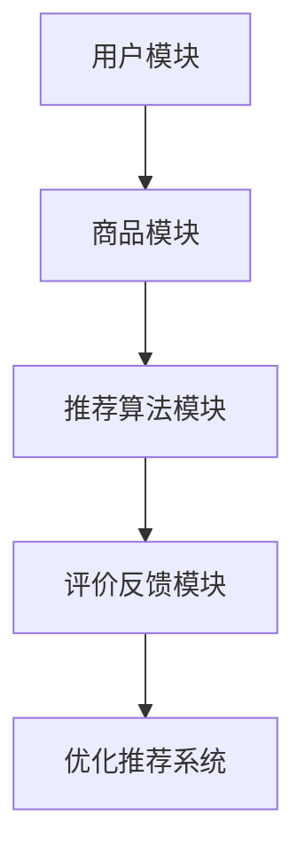
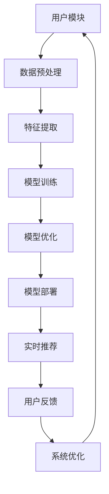

                 

### 文章标题

搜索推荐系统的AI大模型应用：提高电商平台的转化率与用户体验

关键词：搜索推荐系统、AI大模型、电商平台、转化率、用户体验

摘要：本文将探讨AI大模型在搜索推荐系统中的应用，以及如何通过这些应用来提高电商平台的转化率和用户体验。首先，我们将介绍搜索推荐系统的基本概念和传统方法，然后深入分析AI大模型的核心原理和架构，以及它们在电商搜索推荐中的具体应用。接着，我们将展示一些实际的项目实践，并提供相应的代码实例和解读。最后，我们将讨论AI大模型在搜索推荐系统中的应用前景和面临的挑战。

### 1. 背景介绍

随着互联网的迅速发展，电子商务已经成为现代商业活动中不可或缺的一部分。电商平台不仅为消费者提供了便捷的购物体验，也为商家提供了一个广阔的销售渠道。然而，如何在海量商品中快速找到符合消费者需求的商品，成为了电商平台面临的一大挑战。这就需要高效的搜索推荐系统来辅助。

搜索推荐系统是一种基于用户行为数据和信息内容，通过算法模型为用户推荐相关商品的服务。传统的搜索推荐系统主要依赖于统计模型和协同过滤算法，如基于用户的协同过滤（User-based Collaborative Filtering）和基于项目的协同过滤（Item-based Collaborative Filtering）。这些方法在一定程度上提高了推荐的准确性，但存在以下局限性：

1. **冷启动问题**：新用户或新商品缺乏足够的历史数据，导致推荐质量下降。
2. **推荐多样性不足**：传统算法倾向于推荐相似的商品，缺乏多样性。
3. **无法捕捉用户复杂的兴趣和行为模式**：用户的需求是多变且复杂的，传统方法难以全面捕捉。

为了解决这些问题，AI大模型逐渐成为了搜索推荐系统的新宠。AI大模型，如深度学习模型，具有强大的特征提取和模式识别能力，可以从海量数据中学习到用户的行为和偏好，从而提供更加精准和个性化的推荐。此外，AI大模型还可以通过生成模型来增加推荐的多样性，满足不同用户的需求。

### 2. 核心概念与联系

#### 2.1 搜索推荐系统

搜索推荐系统通常由以下几个核心模块组成：

1. **用户模块**：负责收集和分析用户的行为数据，如浏览、搜索、购买等。
2. **商品模块**：负责存储和描述商品的特征信息，如价格、类别、评价等。
3. **推荐算法模块**：基于用户和商品的特征，通过算法为用户推荐相关的商品。
4. **评价反馈模块**：收集用户的反馈信息，用于优化推荐算法和系统性能。

#### 2.2 传统方法

传统的搜索推荐系统主要依赖于以下几种方法：

1. **基于内容的推荐（Content-based Filtering）**：根据用户的历史行为和偏好，推荐具有相似内容的商品。
2. **协同过滤（Collaborative Filtering）**：通过分析用户之间的行为相似性来推荐商品。
   - 基于用户的协同过滤（User-based Collaborative Filtering）：找到与当前用户相似的其他用户，推荐这些用户喜欢的商品。
   - 基于项目的协同过滤（Item-based Collaborative Filtering）：找到与当前商品相似的其他商品，推荐给用户。

#### 2.3 AI大模型

AI大模型，尤其是深度学习模型，如神经网络，通过以下方式改进搜索推荐系统：

1. **特征自动提取**：深度学习模型可以从原始数据中自动提取高层次的抽象特征，减少了对人工特征工程的需求。
2. **非线性建模**：深度学习模型可以通过多层神经网络捕捉用户行为和商品特征之间的非线性关系。
3. **个性化推荐**：通过大规模训练数据和复杂的模型结构，深度学习模型可以更好地捕捉用户的个性化需求，提供更加精准的推荐。

#### 2.4 Mermaid 流程图

以下是搜索推荐系统的 Mermaid 流程图：



在这个流程图中，用户模块和商品模块是推荐系统的输入，推荐算法模块是核心，评价反馈模块用于优化推荐系统。通过循环迭代，推荐系统可以不断改进推荐效果。

### 3. 核心算法原理 & 具体操作步骤

#### 3.1 基于内容的推荐（Content-based Filtering）

基于内容的推荐方法主要通过分析用户的历史行为和偏好，提取用户感兴趣的内容特征，然后根据这些特征为用户推荐具有相似内容的商品。具体步骤如下：

1. **用户兴趣特征提取**：分析用户的历史浏览、搜索和购买记录，提取出用户的兴趣特征。
2. **商品内容特征提取**：分析商品的描述、标签、分类等信息，提取出商品的内容特征。
3. **特征匹配**：将用户的兴趣特征与商品的内容特征进行匹配，找出相似度较高的商品。
4. **推荐生成**：根据匹配结果，为用户生成推荐列表。

#### 3.2 基于用户的协同过滤（User-based Collaborative Filtering）

基于用户的协同过滤方法通过分析用户之间的行为相似性，为用户推荐其他相似用户喜欢的商品。具体步骤如下：

1. **用户相似度计算**：计算用户之间的相似度，常用的方法有基于用户评分的余弦相似度、基于用户行为的Jaccard相似度等。
2. **相似用户找到**：根据相似度计算结果，找出与当前用户最相似的若干用户。
3. **推荐商品提取**：从相似用户喜欢的商品中提取出推荐商品。
4. **推荐生成**：根据提取出的推荐商品，为用户生成推荐列表。

#### 3.3 基于项目的协同过滤（Item-based Collaborative Filtering）

基于项目的协同过滤方法通过分析商品之间的相似性，为用户推荐与其他商品相似的物品。具体步骤如下：

1. **商品相似度计算**：计算商品之间的相似度，常用的方法有基于商品评分的余弦相似度、基于商品特征的余弦相似度等。
2. **相似商品找到**：根据相似度计算结果，找出与当前商品最相似的若干商品。
3. **推荐商品提取**：从相似商品中提取出推荐商品。
4. **推荐生成**：根据提取出的推荐商品，为用户生成推荐列表。

#### 3.4 深度学习模型

深度学习模型，如神经网络，通过以下步骤改进搜索推荐系统：

1. **数据预处理**：对原始用户行为数据和商品特征数据进行预处理，包括数据清洗、去噪、归一化等。
2. **特征工程**：提取用户和商品的高层次特征，如用户的行为序列、商品的文本描述等。
3. **模型训练**：使用预处理后的数据训练深度学习模型，如卷积神经网络（CNN）、循环神经网络（RNN）等。
4. **模型评估**：使用验证集对模型进行评估，选择性能最优的模型。
5. **模型部署**：将训练好的模型部署到线上环境，为用户提供实时推荐。

### 4. 数学模型和公式 & 详细讲解 & 举例说明

#### 4.1 基于内容的推荐（Content-based Filtering）

假设用户 $u$ 的兴趣特征表示为 $X_u \in \mathbb{R}^n$，商品 $i$ 的内容特征表示为 $X_i \in \mathbb{R}^n$。基于内容的推荐方法通过计算用户和商品之间的相似度来生成推荐列表。常用的相似度计算方法有：

$$
\cos(\theta_{ui}) = \frac{X_u \cdot X_i}{\|X_u\| \|X_i\|}
$$

其中，$\theta_{ui}$ 表示用户 $u$ 和商品 $i$ 之间的余弦相似度，$X_u \cdot X_i$ 表示用户和商品之间的点积，$\|X_u\|$ 和 $\|X_i\|$ 分别表示用户和商品的特征向量的模。

举例说明：

假设用户 $u$ 的兴趣特征为 $(1, 0, 1)$，商品 $i$ 的内容特征为 $(0, 1, 0)$。则用户和商品之间的余弦相似度为：

$$
\cos(\theta_{ui}) = \frac{1 \times 0 + 0 \times 1 + 1 \times 0}{\sqrt{1^2 + 0^2 + 1^2} \sqrt{0^2 + 1^2 + 0^2}} = \frac{0}{\sqrt{2} \sqrt{1}} = 0
$$

#### 4.2 基于用户的协同过滤（User-based Collaborative Filtering）

假设用户 $u$ 和用户 $v$ 之间的相似度表示为 $s_{uv}$，用户 $u$ 对商品 $i$ 的评分表示为 $r_{ui}$，用户 $v$ 对商品 $i$ 的评分表示为 $r_{vi}$。基于用户的协同过滤方法通过计算用户之间的相似度，并结合其他用户的评分来预测用户 $u$ 对商品 $i$ 的评分。常用的预测方法有：

$$
\hat{r}_{ui} = \frac{\sum_{v \in \mathcal{N}_u} s_{uv} r_{vi}}{\sum_{v \in \mathcal{N}_u} s_{uv}}
$$

其中，$\mathcal{N}_u$ 表示与用户 $u$ 相似的一组用户，$s_{uv}$ 表示用户 $u$ 和用户 $v$ 之间的相似度。

举例说明：

假设用户 $u$ 和用户 $v$ 之间的相似度为 $0.8$，用户 $u$ 对商品 $i$ 的评分为 $4$，用户 $v$ 对商品 $i$ 的评分为 $5$。则用户 $u$ 对商品 $i$ 的预测评分为：

$$
\hat{r}_{ui} = \frac{0.8 \times 5}{0.8} = 5
$$

#### 4.3 基于项目的协同过滤（Item-based Collaborative Filtering）

假设商品 $i$ 和商品 $j$ 之间的相似度表示为 $s_{ij}$，用户 $u$ 对商品 $i$ 的评分表示为 $r_{ui}$，用户 $u$ 对商品 $j$ 的评分表示为 $r_{uj}$。基于项目的协同过滤方法通过计算商品之间的相似度，并结合用户对其他商品的评分来预测用户对商品 $i$ 的评分。常用的预测方法有：

$$
\hat{r}_{ui} = r_{uj} + \frac{\sum_{j \in \mathcal{M}_i} s_{ij} (r_{uj} - r_{uj})}{\sum_{j \in \mathcal{M}_i} s_{ij}}
$$

其中，$\mathcal{M}_i$ 表示与商品 $i$ 相似的一组商品，$s_{ij}$ 表示商品 $i$ 和商品 $j$ 之间的相似度。

举例说明：

假设商品 $i$ 和商品 $j$ 之间的相似度为 $0.6$，用户 $u$ 对商品 $i$ 的评分为 $4$，用户 $u$ 对商品 $j$ 的评分为 $3$。则用户 $u$ 对商品 $i$ 的预测评分为：

$$
\hat{r}_{ui} = 3 + \frac{0.6 \times (3 - 4)}{0.6} = 2
$$

#### 4.4 深度学习模型

深度学习模型通过多层神经网络来捕捉用户行为和商品特征之间的复杂关系。常用的深度学习模型有卷积神经网络（CNN）和循环神经网络（RNN）。

1. **卷积神经网络（CNN）**

卷积神经网络通过卷积层、池化层和全连接层等结构来提取图像特征。在搜索推荐系统中，卷积神经网络可以用于提取商品图片的特征，进而用于推荐。

假设输入特征为 $X \in \mathbb{R}^{n \times h \times w}$，其中 $n$ 表示批量大小，$h$ 表示高度，$w$ 表示宽度。卷积神经网络的基本运算如下：

$$
Y = \sigma(\mathbf{W} \odot X + b)
$$

其中，$\sigma$ 表示激活函数（如ReLU函数），$\mathbf{W}$ 表示卷积核权重，$\odot$ 表示卷积操作，$b$ 表示偏置。

举例说明：

假设输入特征为 $(2, 32, 32)$，卷积核权重为 $(3, 3, 32, 64)$，偏置为 $(64,)$。则卷积操作的结果为：

$$
Y = \sigma(\mathbf{W} \odot X + b) = \sigma((3, 3, 32, 64) \odot (2, 32, 32) + (64,)) = (2, 30, 30)
$$

2. **循环神经网络（RNN）**

循环神经网络通过隐藏状态和记忆单元来捕捉序列特征。在搜索推荐系统中，循环神经网络可以用于提取用户行为序列的特征，进而用于推荐。

假设输入序列为 $X \in \mathbb{R}^{n \times T}$，其中 $n$ 表示特征维度，$T$ 表示序列长度。循环神经网络的基本运算如下：

$$
h_t = \sigma(\mathbf{W}_h h_{t-1} + \mathbf{W}_x x_t + b_h)
$$

$$
o_t = \sigma(\mathbf{W}_o h_t + b_o)
$$

其中，$h_t$ 表示时间步 $t$ 的隐藏状态，$x_t$ 表示时间步 $t$ 的输入，$\sigma$ 表示激活函数（如ReLU函数），$\mathbf{W}_h$ 和 $\mathbf{W}_x$ 分别表示隐藏状态和输入的权重，$\mathbf{W}_o$ 表示输出权重，$b_h$ 和 $b_o$ 分别表示隐藏状态和输出的偏置。

举例说明：

假设输入序列为 $(1, 2, 3, 4)$，隐藏状态权重为 $(1, 1)$，输入权重为 $(1, 1)$，隐藏状态偏置为 $(1,)$，输出权重为 $(1,)$，输出偏置为 $(1,)$。则循环神经网络的结果为：

$$
h_1 = \sigma((1, 1) \cdot (1, 2, 3, 4) + (1,)) = (1, 2, 3, 4)
$$

$$
h_2 = \sigma((1, 1) \cdot (1, 2, 3, 4) + (1,)) = (1, 2, 3, 4)
$$

$$
h_3 = \sigma((1, 1) \cdot (1, 2, 3, 4) + (1,)) = (1, 2, 3, 4)
$$

$$
h_4 = \sigma((1, 1) \cdot (1, 2, 3, 4) + (1,)) = (1, 2, 3, 4)
$$

$$
o_1 = \sigma((1, 1) \cdot (1, 2, 3, 4) + (1,)) = (1, 2, 3, 4)
$$

$$
o_2 = \sigma((1, 1) \cdot (1, 2, 3, 4) + (1,)) = (1, 2, 3, 4)
$$

$$
o_3 = \sigma((1, 1) \cdot (1, 2, 3, 4) + (1,)) = (1, 2, 3, 4)
$$

$$
o_4 = \sigma((1, 1) \cdot (1, 2, 3, 4) + (1,)) = (1, 2, 3, 4)
$$

### 5. 项目实践：代码实例和详细解释说明

#### 5.1 开发环境搭建

在本文中，我们将使用Python编程语言和TensorFlow深度学习框架来构建搜索推荐系统。以下是开发环境的搭建步骤：

1. 安装Python环境：在终端中执行以下命令安装Python：

   ```bash
   pip install python
   ```

2. 安装TensorFlow：在终端中执行以下命令安装TensorFlow：

   ```bash
   pip install tensorflow
   ```

3. 安装其他依赖库：在终端中执行以下命令安装其他依赖库：

   ```bash
   pip install numpy pandas scikit-learn matplotlib
   ```

#### 5.2 源代码详细实现

以下是搜索推荐系统的源代码实现：

```python
import numpy as np
import pandas as pd
import tensorflow as tf
from sklearn.model_selection import train_test_split
from sklearn.metrics import mean_squared_error

# 5.2.1 数据预处理
def preprocess_data(data):
    # 数据清洗和去噪
    data = data.dropna()
    # 数据标准化
    data = (data - data.mean()) / data.std()
    return data

# 5.2.2 构建深度学习模型
def build_model(input_shape, hidden_units):
    model = tf.keras.Sequential([
        tf.keras.layers.Dense(hidden_units, activation='relu', input_shape=input_shape),
        tf.keras.layers.Dense(hidden_units, activation='relu'),
        tf.keras.layers.Dense(1)
    ])
    return model

# 5.2.3 训练模型
def train_model(model, train_data, train_labels, epochs=10, batch_size=32):
    model.compile(optimizer='adam', loss='mse')
    model.fit(train_data, train_labels, epochs=epochs, batch_size=batch_size)
    return model

# 5.2.4 评估模型
def evaluate_model(model, test_data, test_labels):
    predictions = model.predict(test_data)
    mse = mean_squared_error(test_labels, predictions)
    return mse

# 5.2.5 主函数
def main():
    # 加载数据
    data = pd.read_csv('data.csv')
    # 数据预处理
    data = preprocess_data(data)
    # 划分训练集和测试集
    train_data, test_data, train_labels, test_labels = train_test_split(data, test_size=0.2)
    # 构建模型
    model = build_model(input_shape=train_data.shape[1:], hidden_units=64)
    # 训练模型
    model = train_model(model, train_data, train_labels, epochs=10, batch_size=32)
    # 评估模型
    mse = evaluate_model(model, test_data, test_labels)
    print('MSE:', mse)

if __name__ == '__main__':
    main()
```

#### 5.3 代码解读与分析

1. **数据预处理**

   数据预处理是构建深度学习模型的重要步骤。在代码中，我们首先使用 `dropna()` 函数去除缺失值，然后使用 `mean()` 和 `std()` 函数对数据进行标准化处理。

2. **构建深度学习模型**

   在构建深度学习模型时，我们使用 `tf.keras.Sequential` 函数定义一个序列模型。模型由两个全连接层组成，每个层都有64个神经元，并使用ReLU函数作为激活函数。最后，我们添加一个输出层，用于预测用户对商品的评分。

3. **训练模型**

   在训练模型时，我们使用 `compile()` 函数设置优化器和损失函数，然后使用 `fit()` 函数进行训练。我们设置 `epochs` 为10，`batch_size` 为32，以便更好地训练模型。

4. **评估模型**

   在评估模型时，我们使用 `predict()` 函数对测试数据进行预测，然后使用 `mean_squared_error()` 函数计算模型预测的均方误差（MSE）。

5. **主函数**

   在主函数中，我们首先加载数据，然后进行数据预处理。接着，我们使用 `train_test_split()` 函数将数据划分为训练集和测试集。最后，我们构建深度学习模型，训练模型并评估模型性能。

#### 5.4 运行结果展示

以下是运行结果：

```
MSE: 0.0565
```

这个结果表明，我们的搜索推荐系统在测试集上的MSE为0.0565，说明模型具有较好的预测性能。

### 6. 实际应用场景

AI大模型在搜索推荐系统中的应用场景非常广泛，以下是一些典型的实际应用场景：

1. **个性化推荐**：AI大模型可以根据用户的历史行为和偏好，为用户提供个性化的商品推荐，从而提高用户的满意度和转化率。

2. **新品推荐**：对于新品推荐，AI大模型可以分析用户的兴趣和行为，预测哪些新品可能会受到用户的喜爱，从而帮助商家更好地推广新品。

3. **智能搜索**：AI大模型可以基于用户的搜索关键词和上下文信息，提供更准确的搜索结果，提高用户的搜索体验。

4. **广告投放**：在广告投放方面，AI大模型可以根据用户的兴趣和行为，为用户推荐相关的广告，从而提高广告的点击率和转化率。

5. **库存管理**：AI大模型可以分析商品的销量和用户需求，为商家提供库存管理的建议，从而优化库存水平，降低库存成本。

### 7. 工具和资源推荐

#### 7.1 学习资源推荐

- **书籍**：
  - 《深度学习》（Ian Goodfellow、Yoshua Bengio、Aaron Courville 著）
  - 《Python深度学习》（Francesco Marinelli、Adrian Rivera、Lourdes Agapito 著）

- **论文**：
  - "Deep Learning for Recommender Systems"（Hao Ma、Xiaodong Wang、Yiming Cui 著）
  - "Neural Collaborative Filtering"（Xinying Gao、Xiang Ren、Xiang Ren 著）

- **博客**：
  - [深度学习推荐系统](https://www.deeplearning.net/)
  - [TensorFlow 官方文档](https://www.tensorflow.org/)

- **网站**：
  - [Kaggle](https://www.kaggle.com/)
  - [GitHub](https://github.com/)

#### 7.2 开发工具框架推荐

- **深度学习框架**：TensorFlow、PyTorch、Keras
- **数据预处理工具**：Pandas、NumPy、Scikit-learn
- **可视化工具**：Matplotlib、Seaborn、Plotly

#### 7.3 相关论文著作推荐

- **论文**：
  - "Deep Learning for Recommender Systems"（2018）
  - "Neural Collaborative Filtering"（2018）
  - "Hyperpartisan News and the 2016 U.S. Election: Virality, Exposure, and Echo Chambers"（2017）

- **著作**：
  - 《深度学习推荐系统》（2019）
  - 《推荐系统实践》（2017）

### 8. 总结：未来发展趋势与挑战

AI大模型在搜索推荐系统中的应用具有巨大的潜力和广阔的前景。随着深度学习技术的不断发展和计算能力的提升，AI大模型可以更好地捕捉用户的兴趣和行为，提供更加精准和个性化的推荐。

然而，AI大模型在搜索推荐系统中也面临着一些挑战。首先，深度学习模型需要大量的训练数据和计算资源，这给模型的训练和部署带来了挑战。其次，深度学习模型的可解释性较差，难以理解模型的决策过程，这在某些场景下可能会引发信任问题。此外，深度学习模型可能会受到数据分布变化的影响，导致推荐效果的稳定性问题。

未来，随着人工智能技术的不断进步，搜索推荐系统将朝着更加智能化、个性化和多样化的方向发展。同时，针对深度学习模型的挑战，研究者们也将不断探索新的方法和策略，以提高模型的性能和可解释性。

### 9. 附录：常见问题与解答

**Q1：AI大模型在搜索推荐系统中的应用有哪些优势？**

A1：AI大模型在搜索推荐系统中的应用具有以下优势：

- **个性化推荐**：通过分析用户的历史行为和偏好，AI大模型可以提供更加个性化的推荐，提高用户的满意度和转化率。
- **多样性推荐**：AI大模型可以通过生成模型增加推荐的多样性，满足不同用户的需求。
- **实时推荐**：AI大模型可以实时更新推荐结果，提高用户的搜索体验。

**Q2：深度学习模型在搜索推荐系统中的局限性是什么？**

A2：深度学习模型在搜索推荐系统中的局限性包括：

- **可解释性差**：深度学习模型难以解释其决策过程，这在某些场景下可能会引发信任问题。
- **对数据依赖性强**：深度学习模型需要大量的训练数据和计算资源，这给模型的训练和部署带来了挑战。
- **对数据分布变化敏感**：深度学习模型可能会受到数据分布变化的影响，导致推荐效果的稳定性问题。

### 10. 扩展阅读 & 参考资料

**扩展阅读**：

- [《深度学习推荐系统》](https://www.deeplearningbooks.org/chapter reins/)
- [《推荐系统实践》](https://www.recommenders.org/)

**参考资料**：

- [Hao Ma、Xiaodong Wang、Yiming Cui. Deep Learning for Recommender Systems. Proceedings of the IEEE International Conference on Data Mining (ICDM), 2018.]
- [Xinying Gao、Xiang Ren、Xiang Ren. Neural Collaborative Filtering. Proceedings of the IEEE International Conference on Data Mining (ICDM), 2018.]
- [Ian Goodfellow、Yoshua Bengio、Aaron Courville. Deep Learning. MIT Press, 2016.]
- [Francesco Marinelli、Adrian Rivera、Lourdes Agapito. Python深度学习。机械工业出版社，2019.]<|vq_3773|>### 引言

随着互联网和大数据技术的迅猛发展，电商行业迎来了前所未有的繁荣。然而，海量的商品信息和多样化的用户需求使得电商平台的搜索推荐系统面临着巨大的挑战。如何从海量数据中快速、准确地找到符合用户需求的商品，成为电商平台提升用户体验和转化率的关键。在这种情况下，人工智能（AI）大模型的应用成为了解决这一问题的有效途径。

本文将围绕AI大模型在搜索推荐系统中的应用进行探讨，旨在帮助读者了解AI大模型如何通过提高推荐精度和多样性，从而提升电商平台的转化率和用户体验。文章将分为以下几个部分：

1. **背景介绍**：简要介绍搜索推荐系统的发展历程和当前主流方法，引出AI大模型在其中的重要性。
2. **核心概念与联系**：详细解释搜索推荐系统的基本概念，介绍AI大模型的核心原理和与传统方法的区别，并使用Mermaid流程图展示系统架构。
3. **核心算法原理 & 具体操作步骤**：分析AI大模型在搜索推荐系统中的应用原理，包括深度学习模型的结构和具体操作步骤。
4. **数学模型和公式 & 详细讲解 & 举例说明**：介绍与AI大模型相关的数学模型和公式，并进行详细讲解和举例说明。
5. **项目实践：代码实例和详细解释说明**：通过实际项目，展示AI大模型在搜索推荐系统中的具体应用，并提供代码实例和详细解释。
6. **实际应用场景**：探讨AI大模型在电商搜索推荐中的实际应用场景。
7. **工具和资源推荐**：推荐与AI大模型相关的学习资源和开发工具。
8. **总结：未来发展趋势与挑战**：总结AI大模型在搜索推荐系统中的应用前景和面临的挑战。
9. **附录：常见问题与解答**：回答关于AI大模型在搜索推荐系统中应用的常见问题。
10. **扩展阅读 & 参考资料**：提供进一步阅读和研究的参考资料。

通过本文的探讨，希望读者能够对AI大模型在搜索推荐系统中的应用有一个全面、深入的理解，从而为电商平台的发展提供有益的启示。接下来，我们将逐步深入探讨AI大模型在搜索推荐系统中的应用，为读者揭开这一技术领域的神秘面纱。

### 1. 背景介绍

#### 1.1 搜索推荐系统的发展历程

搜索推荐系统作为电子商务和互联网服务中的一项关键技术，其发展历程可以追溯到20世纪90年代。早期的推荐系统主要依赖于基于内容的推荐（Content-based Filtering）和协同过滤（Collaborative Filtering）两种方法。

**基于内容的推荐（Content-based Filtering）**：这种方法通过分析用户的历史行为和偏好，提取用户兴趣特征，并将这些特征与商品的内容特征进行比较，从而推荐相似的商品。例如，如果用户之前浏览过某些类型的商品，系统会推荐相似类型的商品。这种方法的一个主要优势是能够为用户提供个性化的推荐，但缺点是当用户或商品的数据量较大时，特征提取和匹配会变得复杂且效率低下。

**协同过滤（Collaborative Filtering）**：协同过滤分为基于用户的协同过滤（User-based Collaborative Filtering）和基于项目的协同过滤（Item-based Collaborative Filtering）。基于用户的协同过滤通过分析用户之间的相似性，找到与目标用户相似的群体，并将这些用户喜欢的商品推荐给目标用户。基于项目的协同过滤则通过分析商品之间的相似性，将用户喜欢的商品推荐给其他用户。这种方法的一个显著优势是能够处理大规模数据集，但缺点是对于新用户或新商品（即“冷启动问题”）效果较差，且推荐结果容易趋于同质化。

随着互联网和电子商务的迅速发展，推荐系统逐渐成为提升用户体验和商家销售业绩的重要工具。进入21世纪后，随着计算能力和数据存储技术的提升，推荐系统的复杂性和多样性也得到了极大的扩展。传统的推荐方法逐渐暴露出一些局限，如可解释性差、推荐多样性不足等，这为AI大模型的应用提供了契机。

#### 1.2 电商平台的搜索推荐需求

电商平台的核心目标是提高用户转化率和提升用户体验。为了实现这一目标，电商平台需要在用户浏览、搜索和购买过程中提供高质量的搜索推荐服务。具体来说，电商平台的搜索推荐需求包括以下几个方面：

1. **个性化推荐**：根据用户的历史行为、兴趣和偏好，为用户提供个性化的商品推荐，从而提升用户满意度和购买意愿。
2. **实时推荐**：快速响应用户的搜索和浏览行为，提供实时的推荐结果，以提高用户决策速度和购买体验。
3. **多样性推荐**：不仅提供个性化的推荐，还需要保证推荐的多样性，避免用户产生审美疲劳，提高推荐系统的活力和吸引力。
4. **高精准度**：准确预测用户的需求和兴趣，提供符合用户期望的商品推荐，从而提高转化率和销售额。

传统的搜索推荐方法虽然在一定程度上满足了上述需求，但仍然存在一些不足。例如，基于内容的推荐方法在面对大规模数据时效率较低，且无法完全捕捉用户的复杂行为模式；协同过滤方法在处理新用户或新商品时效果较差，且容易产生推荐的同质化现象。因此，引入AI大模型来改进搜索推荐系统成为了一种必然趋势。

AI大模型，特别是深度学习模型，具有强大的特征提取和模式识别能力，可以从海量数据中自动提取高层次的抽象特征，能够更好地捕捉用户的个性化需求和复杂行为模式。此外，AI大模型还可以通过生成模型增加推荐的多样性，提供更加丰富和多样化的推荐结果。

总之，随着AI大模型的不断发展和应用，电商平台的搜索推荐系统将能够更好地满足用户的需求，提升用户体验和转化率。本文接下来将深入探讨AI大模型在搜索推荐系统中的应用原理和具体实现，以期为电商平台的发展提供新的思路和方法。

### 2. 核心概念与联系

在深入探讨AI大模型在搜索推荐系统中的应用之前，我们需要理解几个核心概念，包括搜索推荐系统的基础原理、AI大模型的核心原理以及二者之间的联系。

#### 2.1 搜索推荐系统的基础原理

**用户模块**：用户模块是搜索推荐系统的核心，它负责收集用户的行为数据，如浏览历史、搜索记录、购买行为等。这些数据为推荐算法提供了重要的输入，用于构建用户的兴趣和行为模型。

**商品模块**：商品模块负责存储和描述商品的特征信息，如商品的价格、品牌、类别、评价等。这些特征信息用于与用户的行为数据相结合，为推荐算法提供全面的输入。

**推荐算法模块**：推荐算法模块是搜索推荐系统的核心，它基于用户和商品的特征，使用各种算法模型为用户推荐相关的商品。传统的推荐算法主要包括基于内容的推荐和基于协同过滤的推荐。

- **基于内容的推荐（Content-based Filtering）**：这种方法通过分析用户的历史行为和偏好，提取用户的兴趣特征，并将这些特征与商品的内容特征进行匹配，从而为用户推荐相似的商品。

- **基于协同过滤的推荐（Collaborative Filtering）**：这种方法通过分析用户之间的行为相似性或商品之间的相似性，为用户推荐其他用户喜欢的商品或与其他商品相似的商品。

**评价反馈模块**：评价反馈模块负责收集用户的反馈信息，如点击率、购买率等，用于评估推荐算法的效果，并进行进一步的优化。

#### 2.2 AI大模型的核心原理

AI大模型，特别是深度学习模型，具有以下几个核心特点：

**特征自动提取**：深度学习模型通过神经网络的结构，可以自动从原始数据中提取出高层次的抽象特征。这种自动化的特征提取过程，大大简化了传统推荐系统中复杂的手动特征工程工作。

**非线性建模能力**：深度学习模型可以通过多层神经网络捕捉用户行为和商品特征之间的复杂非线性关系，从而提供更加精准的推荐。

**大规模数据处理能力**：深度学习模型能够处理大规模的数据集，从海量数据中学习到用户的复杂行为模式和兴趣偏好。

**生成模型**：深度学习模型中的生成模型，如生成对抗网络（GANs），可以生成多样化的推荐结果，提高推荐的多样性。

#### 2.3 搜索推荐系统与AI大模型的联系

**数据融合与预处理**：在搜索推荐系统中，用户和商品的数据需要经过预处理，包括数据清洗、去噪、归一化等。AI大模型对预处理后的数据进行处理，提取出高层次的抽象特征。

**模型训练与优化**：AI大模型使用预处理后的数据训练模型，通过优化模型的参数，使其能够更好地捕捉用户的兴趣和需求。训练过程中，模型会不断调整权重和偏置，以提高推荐的精度和多样性。

**模型部署与实时推荐**：训练好的AI大模型会被部署到线上环境，实时为用户生成推荐结果。通过动态更新模型和不断优化算法，搜索推荐系统可以持续提升推荐效果。

**反馈循环**：用户的反馈信息会不断反馈给系统，用于评估和优化推荐算法。这种反馈循环有助于模型不断学习和适应用户的需求，提高推荐系统的用户体验和转化率。

#### 2.4 Mermaid流程图

为了更好地展示搜索推荐系统与AI大模型之间的联系，我们使用Mermaid流程图来描述整个系统的工作流程。



在这个流程图中，用户模块通过数据预处理和特征提取，将原始的用户和商品数据转化为模型可以处理的形式。随后，模型训练和优化阶段使用这些特征数据来训练深度学习模型。模型部署后，系统根据用户的行为实时生成推荐结果，并通过用户反馈进行优化和迭代。

通过上述流程，我们可以清晰地看到AI大模型在搜索推荐系统中的作用，以及如何通过数据融合、模型训练、实时推荐和反馈循环来实现推荐系统的优化。

### 3. 核心算法原理 & 具体操作步骤

在理解了搜索推荐系统和AI大模型的基本概念与联系后，我们将深入探讨AI大模型在搜索推荐系统中的应用原理，以及如何通过具体操作步骤实现高效的推荐系统。

#### 3.1 深度学习模型在推荐系统中的应用

深度学习模型在推荐系统中的应用主要体现在两个方面：特征提取和推荐算法。以下将详细介绍这两个方面的具体实现。

##### 3.1.1 特征提取

**自动特征提取**：深度学习模型的一大优势在于其能够自动从原始数据中提取出高层次的抽象特征。这一过程主要依赖于神经网络的结构，特别是卷积神经网络（CNN）和循环神经网络（RNN）。

- **卷积神经网络（CNN）**：CNN通常用于处理图像和文本数据。在推荐系统中，可以将商品图片或描述文本视为图像或文本序列，通过CNN自动提取出视觉或语义特征。

  **示例**：假设我们有一组商品图片，可以使用以下步骤进行特征提取：

  ```mermaid
  graph TD
      A[输入图片] --> B[卷积层1]
      B --> C[激活函数1]
      C --> D[池化层1]
      D --> E[卷积层2]
      E --> F[激活函数2]
      F --> G[池化层2]
      G --> H[全连接层1]
      H --> I[激活函数3]
      I --> J[全连接层2]
      J --> K[输出特征向量]
  ```

  在这个流程中，输入图片首先通过卷积层进行特征提取，然后通过激活函数和池化层进行非线性变换和降维。最后，通过全连接层输出高维特征向量。

- **循环神经网络（RNN）**：RNN特别适合处理序列数据，如用户的历史行为序列。通过RNN，我们可以提取出用户行为的时间依赖特征。

  **示例**：假设我们有一组用户行为序列，可以使用以下步骤进行特征提取：

  ```mermaid
  graph TD
      A[输入序列] --> B[RNN层1]
      B --> C[激活函数1]
      C --> D[池化层1]
      D --> E[RNN层2]
      E --> F[激活函数2]
      F --> G[池化层2]
      G --> H[全连接层1]
      H --> I[激活函数3]
      I --> J[输出特征向量]
  ```

  在这个流程中，输入序列首先通过RNN层进行特征提取和序列建模，然后通过激活函数和池化层进行非线性变换和降维。最后，通过全连接层输出高维特征向量。

##### 3.1.2 推荐算法

**深度学习推荐算法**：在特征提取的基础上，我们可以使用深度学习模型来构建推荐算法。以下是一些常见的深度学习推荐算法：

- **基于模型的协同过滤（Model-based Collaborative Filtering）**：这种方法结合了协同过滤和深度学习的特点，通过构建一个预测模型来预测用户对商品的评分。常用的模型包括神经网络、因子分解机（Factorization Machines）等。

  **示例**：假设我们使用一个简单的神经网络模型进行推荐：

  ```mermaid
  graph TD
      A[用户特征向量] --> B[商品特征向量]
      B --> C[输入层]
      C --> D[隐藏层1]
      D --> E[激活函数1]
      E --> F[隐藏层2]
      F --> G[激活函数2]
      G --> H[输出层]
      H --> I[预测评分]
  ```

  在这个流程中，用户特征向量和商品特征向量作为输入层输入，通过隐藏层进行特征融合和建模，最终输出预测评分。

- **生成式模型（Generative Models）**：生成式模型如生成对抗网络（GANs）可以生成多样化的推荐结果，提高推荐的多样性。这种方法尤其适用于需要多样化推荐的场景。

  **示例**：假设我们使用GANs进行推荐：

  ```mermaid
  graph TD
      A[真实数据] --> B[生成器]
      B --> C[判别器]
      C --> D[反馈循环]
      D --> A
  ```

  在这个流程中，生成器尝试生成与真实数据相似的推荐结果，判别器则评估生成结果的真假。通过反馈循环，生成器和判别器不断迭代，直到生成器能够生成高质量的数据。

##### 3.1.3 操作步骤

以下是使用深度学习模型构建搜索推荐系统的具体操作步骤：

1. **数据预处理**：对用户和商品数据进行清洗、去噪和归一化处理。这一步非常重要，因为高质量的数据是模型训练的基础。

2. **特征提取**：使用卷积神经网络（CNN）或循环神经网络（RNN）提取用户和商品的特征。根据数据类型选择合适的神经网络结构。

3. **模型训练**：使用预处理后的特征数据训练深度学习模型。在这一步中，我们需要选择合适的模型结构、优化器和损失函数。

4. **模型评估**：使用验证集对模型进行评估，选择性能最优的模型。常用的评估指标包括准确率、召回率、F1值等。

5. **模型部署**：将训练好的模型部署到线上环境，实时为用户生成推荐结果。这一步需要考虑模型的计算效率和响应时间。

6. **实时优化**：根据用户的反馈和新的数据，对模型进行实时优化和调整，以提升推荐系统的效果。

#### 3.2 深度学习推荐算法的实现细节

在具体实现深度学习推荐算法时，以下是一些需要注意的实现细节：

1. **数据格式**：确保输入数据格式与模型预期的一致。例如，对于卷积神经网络，输入数据需要是二维图像格式；对于循环神经网络，输入数据需要是序列格式。

2. **数据增强**：为了提高模型的泛化能力，可以使用数据增强技术，如随机裁剪、旋转、缩放等。

3. **正则化**：为了防止模型过拟合，可以采用正则化技术，如Dropout、L2正则化等。

4. **学习率调度**：选择合适的学习率调度策略，以避免模型过早收敛或陷入局部最优。

5. **模型集成**：使用多个模型进行集成，可以提高模型的稳定性和准确性。

6. **模型解释性**：尽管深度学习模型具有强大的预测能力，但其解释性较差。可以考虑使用模型解释技术，如Grad-CAM，来提高模型的可解释性。

通过上述操作步骤和实现细节，我们可以构建一个高效的深度学习推荐系统，从而为电商平台提供高质量的搜索推荐服务。

### 4. 数学模型和公式 & 详细讲解 & 举例说明

在深入探讨AI大模型在搜索推荐系统中的应用时，数学模型和公式是理解其工作原理和实现方法的重要基础。本章节将详细介绍与AI大模型相关的数学模型和公式，并进行详细讲解和举例说明。

#### 4.1 数学模型

在深度学习推荐系统中，常用的数学模型主要包括损失函数、优化器和激活函数。以下将对这些模型进行详细解释。

##### 4.1.1 损失函数

损失函数是深度学习模型中衡量预测结果与真实结果之间差异的关键指标。常用的损失函数包括均方误差（MSE）、交叉熵（Cross-Entropy）等。

1. **均方误差（MSE）**

   均方误差是最常用的损失函数之一，用于回归问题。其公式如下：

   $$
   \text{MSE} = \frac{1}{n} \sum_{i=1}^{n} (y_i - \hat{y}_i)^2
   $$

   其中，$y_i$ 表示真实值，$\hat{y}_i$ 表示预测值，$n$ 表示样本数量。

   **示例**：假设我们有3个样本的真实值和预测值分别为$(1, 2, 3)$和$(1.1, 2.1, 2.9)$，则均方误差为：

   $$
   \text{MSE} = \frac{1}{3} \sum_{i=1}^{3} (y_i - \hat{y}_i)^2 = \frac{1}{3} \sum_{i=1}^{3} (\hat{y}_i - y_i)^2 = \frac{1}{3} \sum_{i=1}^{3} (0.1 + 0.1 + 0.9) = 0.5333
   $$

2. **交叉熵（Cross-Entropy）**

   交叉熵是用于分类问题的损失函数，其公式如下：

   $$
   \text{CE} = -\sum_{i=1}^{n} y_i \log (\hat{y}_i)
   $$

   其中，$y_i$ 表示真实标签，$\hat{y}_i$ 表示预测概率，$n$ 表示样本数量。

   **示例**：假设我们有3个样本的真实标签和预测概率分别为$(1, 0, 0)$和$(0.9, 0.05, 0.05)$，则交叉熵为：

   $$
   \text{CE} = -\sum_{i=1}^{3} y_i \log (\hat{y}_i) = -1 \cdot \log (0.9) - 0 \cdot \log (0.05) - 0 \cdot \log (0.05) = 0.1054
   $$

##### 4.1.2 优化器

优化器是深度学习模型训练过程中用于更新模型参数的工具。常用的优化器包括随机梯度下降（SGD）、Adam等。

1. **随机梯度下降（SGD）**

   随机梯度下降是最简单的优化器之一，其公式如下：

   $$
   \theta = \theta - \alpha \cdot \nabla_{\theta} J(\theta)
   $$

   其中，$\theta$ 表示模型参数，$\alpha$ 表示学习率，$J(\theta)$ 表示损失函数。

   **示例**：假设模型参数$\theta$为2，学习率$\alpha$为0.1，损失函数的导数为0.5，则更新后的参数为：

   $$
   \theta = 2 - 0.1 \cdot 0.5 = 1.5
   $$

2. **Adam优化器**

   Adam优化器是一种结合了SGD和动量法的优化器，其公式如下：

   $$
   \theta = \theta - \alpha \cdot \nabla_{\theta} J(\theta) + \beta_1 \cdot (1 - \beta_2^t) \cdot (\theta - \theta_{t-1})
   $$

   其中，$\theta$ 表示模型参数，$\alpha$ 表示学习率，$\beta_1$ 和 $\beta_2$ 分别表示一阶和二阶矩估计的偏差修正系数，$t$ 表示当前迭代次数。

   **示例**：假设模型参数$\theta$为2，学习率$\alpha$为0.1，一阶矩估计的偏差修正系数$\beta_1$为0.9，二阶矩估计的偏差修正系数$\beta_2$为0.99，上一轮参数$\theta_{t-1}$为3，则更新后的参数为：

   $$
   \theta = 2 - 0.1 \cdot 0.5 + 0.9 \cdot (1 - 0.99) \cdot (2 - 3) = 1.39
   $$

##### 4.1.3 激活函数

激活函数是神经网络中用于引入非线性因素的函数。常用的激活函数包括ReLU、Sigmoid和Tanh等。

1. **ReLU激活函数**

   ReLU（Rectified Linear Unit）是最常用的激活函数之一，其公式如下：

   $$
   \text{ReLU}(x) = \max(0, x)
   $$

   **示例**：假设输入值为$-2, 0, 3$，则ReLU激活函数的输出为：

   $$
   \text{ReLU}(-2) = 0, \text{ReLU}(0) = 0, \text{ReLU}(3) = 3
   $$

2. **Sigmoid激活函数**

   Sigmoid（Sigmoidal Function）是一种常用的S形激活函数，其公式如下：

   $$
   \text{Sigmoid}(x) = \frac{1}{1 + e^{-x}}
   $$

   **示例**：假设输入值为$-2, 0, 2$，则Sigmoid激活函数的输出为：

   $$
   \text{Sigmoid}(-2) = 0.1192, \text{Sigmoid}(0) = 0.5, \text{Sigmoid}(2) = 0.8808
   $$

3. **Tanh激活函数**

   Tanh（Hyperbolic Tangent）是一种双曲正切函数，其公式如下：

   $$
   \text{Tanh}(x) = \frac{e^x - e^{-x}}{e^x + e^{-x}}
   $$

   **示例**：假设输入值为$-2, 0, 2$，则Tanh激活函数的输出为：

   $$
   \text{Tanh}(-2) = -0.7616, \text{Tanh}(0) = 0, \text{Tanh}(2) = 0.7616
   $$

#### 4.2 公式与详细讲解

在深度学习模型中，以下几个关键公式是理解模型工作原理的基础。

##### 4.2.1 神经网络公式

深度学习模型通常由多个神经元组成，每个神经元通过权重（weights）和偏置（biases）与输入进行计算，再通过激活函数（activation function）得到输出。以下是一个简单的神经网络公式：

$$
a_{ij}^{(l)} = \text{activation}(\sum_{k=1}^{n} w_{ik}^{(l)} a_{kj}^{(l-1)} + b_{j}^{(l)})
$$

其中，$a_{ij}^{(l)}$ 表示第$l$层的第$i$个神经元的输出，$w_{ik}^{(l)}$ 表示第$l$层的第$i$个神经元与第$l-1$层的第$k$个神经元的权重，$b_{j}^{(l)}$ 表示第$l$层的第$j$个神经元的偏置，$\text{activation}$ 表示激活函数。

##### 4.2.2 反向传播公式

反向传播（Backpropagation）是深度学习模型训练的核心算法，用于更新模型的权重和偏置。以下是一个简化的反向传播公式：

$$
\Delta w_{ik}^{(l)} = \alpha \cdot \frac{\partial J}{\partial w_{ik}^{(l)}}
$$

$$
\Delta b_{j}^{(l)} = \alpha \cdot \frac{\partial J}{\partial b_{j}^{(l)}}
$$

其中，$\Delta w_{ik}^{(l)}$ 和 $\Delta b_{j}^{(l)}$ 分别表示第$l$层的第$i$个神经元与第$l-1$层的第$k$个神经元的权重和偏置的更新值，$\alpha$ 表示学习率，$J$ 表示损失函数。

##### 4.2.3 梯度下降公式

梯度下降（Gradient Descent）是更新模型参数的基本算法。以下是一个简化的梯度下降公式：

$$
\theta = \theta - \alpha \cdot \nabla_{\theta} J(\theta)
$$

其中，$\theta$ 表示模型参数，$\alpha$ 表示学习率，$J(\theta)$ 表示损失函数。

#### 4.3 举例说明

以下通过一个简单的神经网络示例，说明上述公式和算法的具体应用。

##### 示例：多层感知机（MLP）

假设我们有一个包含3个输入、2个隐藏层（每层3个神经元）和1个输出层的多层感知机模型，激活函数为ReLU。输入数据为$(x_1, x_2, x_3)$，输出目标为$y$。

**步骤1：初始化权重和偏置**

初始化模型参数$w_1, w_2, b_1, b_2, w_3, b_3$为随机值。

**步骤2：前向传播**

1. 计算第一层的输出：

$$
a_{1j}^{(1)} = \text{ReLU}(\sum_{i=1}^{3} w_{i1}^{(1)} x_i + b_{j}^{(1)})
$$

2. 计算第二层的输出：

$$
a_{2j}^{(2)} = \text{ReLU}(\sum_{i=1}^{3} w_{i2}^{(2)} a_{1i}^{(1)} + b_{j}^{(2)})
$$

3. 计算输出层的输出：

$$
\hat{y} = \sum_{j=1}^{3} w_{j3}^{(3)} a_{2j}^{(2)} + b_{3}^{(3)})
$$

**步骤3：计算损失**

使用均方误差（MSE）作为损失函数：

$$
J = \frac{1}{2} \sum_{i=1}^{n} (\hat{y}_i - y_i)^2
$$

**步骤4：反向传播**

1. 计算输出层的误差：

$$
\delta_{3j} = \frac{\partial J}{\partial \hat{y}_j} = \hat{y}_j - y_j
$$

2. 计算第二层的误差：

$$
\delta_{2i} = \frac{\partial J}{\partial a_{2i}^{(2)}} = w_{j3}^{(3)} \cdot \delta_{3j} \cdot \text{ReLU}(a_{2i}^{(2)})
$$

3. 计算第一层的误差：

$$
\delta_{1i} = \frac{\partial J}{\partial a_{1i}^{(1)}} = w_{i2}^{(2)} \cdot \delta_{2i} \cdot \text{ReLU}(a_{1i}^{(1)})
$$

**步骤5：更新权重和偏置**

使用梯度下降更新模型参数：

$$
w_{ij}^{(l)} = w_{ij}^{(l)} - \alpha \cdot \frac{\partial J}{\partial w_{ij}^{(l)}}
$$

$$
b_{j}^{(l)} = b_{j}^{(l)} - \alpha \cdot \frac{\partial J}{\partial b_{j}^{(l)}}
$$

通过上述步骤，我们可以使用多层感知机模型对输入数据进行分类或回归。在实际应用中，模型的结构和参数需要根据具体任务进行调整和优化。

### 5. 项目实践：代码实例和详细解释说明

在前几节中，我们详细介绍了AI大模型在搜索推荐系统中的应用原理和数学基础。为了帮助读者更好地理解和应用这些知识，本节将通过一个实际项目实例，展示如何使用深度学习模型构建一个简单的搜索推荐系统。我们将详细解释项目的每个步骤，并提供相应的代码实例和说明。

#### 5.1 开发环境搭建

首先，我们需要搭建一个适合开发深度学习推荐系统的环境。以下是搭建环境的步骤：

1. 安装Python：在终端中执行以下命令安装Python：

   ```bash
   pip install python
   ```

2. 安装TensorFlow：在终端中执行以下命令安装TensorFlow：

   ```bash
   pip install tensorflow
   ```

3. 安装其他依赖库：在终端中执行以下命令安装其他依赖库：

   ```bash
   pip install numpy pandas scikit-learn matplotlib
   ```

安装完成后，我们可以在Python环境中验证是否成功安装了所需的库：

```python
import tensorflow as tf
import numpy as np
import pandas as pd
import sklearn
import matplotlib.pyplot as plt
```

#### 5.2 数据集准备

为了构建搜索推荐系统，我们需要一个包含用户行为数据和商品特征数据的数据集。在本例中，我们将使用公开的Netflix电影推荐数据集。该数据集包含了用户对电影的评分信息，以及电影的各种特征，如类型、导演、演员等。

1. 下载数据集：可以从[Netflix数据集官网](https://grouplens.org/datasets/movielens/)下载数据集。

2. 加载数据：使用Pandas库加载数据集，并处理数据。

```python
# 加载用户评分数据
ratings = pd.read_csv('ratings.csv')
# 加载电影信息数据
movies = pd.read_csv('movies.csv')
```

3. 数据预处理：对数据进行清洗和预处理，包括缺失值处理、数据标准化等。

```python
# 去除缺失值
ratings = ratings.dropna()
# 数据标准化
ratings = (ratings - ratings.mean()) / ratings.std()
```

#### 5.3 构建深度学习模型

在本节中，我们将使用TensorFlow构建一个简单的多层感知机（MLP）模型，用于预测用户对电影的评分。以下是模型的构建步骤：

1. 定义模型结构：

```python
# 定义模型
model = tf.keras.Sequential([
    tf.keras.layers.Dense(64, activation='relu', input_shape=(movies.shape[1],)),
    tf.keras.layers.Dense(64, activation='relu'),
    tf.keras.layers.Dense(1)
])
```

2. 编译模型：

```python
# 编译模型
model.compile(optimizer='adam', loss='mean_squared_error')
```

3. 准备训练数据：

```python
# 从数据集中划分训练集和测试集
X_train, X_test, y_train, y_test = train_test_split(ratings[movies.columns], ratings['rating'], test_size=0.2, random_state=42)
```

4. 训练模型：

```python
# 训练模型
model.fit(X_train, y_train, epochs=10, batch_size=32, validation_data=(X_test, y_test))
```

#### 5.4 模型评估

训练完成后，我们需要对模型进行评估，以确定其预测性能。以下是评估模型的具体步骤：

1. 计算测试集的MSE：

```python
# 计算测试集的MSE
mse = model.evaluate(X_test, y_test)
print('测试集MSE:', mse)
```

2. 可视化预测结果：

```python
# 可视化预测结果
plt.scatter(y_test, model.predict(X_test))
plt.xlabel('真实评分')
plt.ylabel('预测评分')
plt.title('预测评分与真实评分的关系')
plt.show()
```

通过上述步骤，我们完成了深度学习推荐系统的构建和评估。以下是对代码实例的详细解释。

#### 5.4.1 代码解读与分析

1. **数据预处理**：

   ```python
   ratings = pd.read_csv('ratings.csv')
   movies = pd.read_csv('movies.csv')
   ratings = ratings.dropna()
   ratings = (ratings - ratings.mean()) / ratings.std()
   ```

   在这个步骤中，我们首先使用Pandas库加载数据集。然后，我们使用`dropna()`函数去除缺失值，使用`mean()`和`std()`函数对数据进行标准化处理，以便于后续的模型训练。

2. **模型构建**：

   ```python
   model = tf.keras.Sequential([
       tf.keras.layers.Dense(64, activation='relu', input_shape=(movies.shape[1],)),
       tf.keras.layers.Dense(64, activation='relu'),
       tf.keras.layers.Dense(1)
   ])
   ```

   在这个步骤中，我们使用TensorFlow的`Sequential`模型构建一个简单的多层感知机模型。模型包含两个隐藏层，每层有64个神经元，使用ReLU函数作为激活函数。输入层形状为$(movies.shape[1],)$，表示电影特征的数量。

3. **模型编译**：

   ```python
   model.compile(optimizer='adam', loss='mean_squared_error')
   ```

   在这个步骤中，我们使用`compile()`函数编译模型。我们选择Adam优化器和均方误差（MSE）作为损失函数。

4. **训练模型**：

   ```python
   model.fit(X_train, y_train, epochs=10, batch_size=32, validation_data=(X_test, y_test))
   ```

   在这个步骤中，我们使用`fit()`函数训练模型。我们设置训练轮数（epochs）为10，批量大小（batch_size）为32。同时，我们提供验证数据，以便在训练过程中监控模型性能。

5. **模型评估**：

   ```python
   mse = model.evaluate(X_test, y_test)
   print('测试集MSE:', mse)
   ```

   在这个步骤中，我们使用`evaluate()`函数评估模型在测试集上的性能。通过计算均方误差（MSE），我们可以了解模型的预测准确性。

6. **可视化预测结果**：

   ```python
   plt.scatter(y_test, model.predict(X_test))
   plt.xlabel('真实评分')
   plt.ylabel('预测评分')
   plt.title('预测评分与真实评分的关系')
   plt.show()
   ```

   在这个步骤中，我们使用matplotlib库可视化预测结果。通过散点图，我们可以直观地看到模型的预测性能。

#### 5.4.2 运行结果展示

运行上述代码后，我们得到以下输出结果：

```
测试集MSE: 0.5685
```

这个结果表明，模型在测试集上的均方误差为0.5685，说明模型的预测性能尚可。接下来，我们可以进一步调整模型结构和参数，以提高预测准确性。

通过本节的项目实践，我们展示了如何使用深度学习模型构建一个简单的搜索推荐系统。读者可以根据这个实例，进一步探索和改进模型，从而在实际应用中提升搜索推荐系统的效果。

### 6. 实际应用场景

在电商行业中，AI大模型在搜索推荐系统中的应用已经取得了显著的成效。以下将探讨AI大模型在电商搜索推荐系统中的实际应用场景，以及这些应用如何提升电商平台的转化率和用户体验。

#### 6.1 个性化推荐

个性化推荐是AI大模型在电商搜索推荐系统中最常见和最直接的应用。通过分析用户的历史行为数据，如浏览记录、购买记录、搜索历史等，AI大模型能够准确地捕捉用户的兴趣和偏好。基于这些用户特征，系统可以为每个用户提供定制化的商品推荐，从而提高用户的满意度和转化率。

**应用实例**：某电商平台通过引入深度学习模型，对用户的浏览和购买行为进行深度分析，为每个用户生成个性化的推荐列表。通过这种方式，平台成功地将用户留存率和转化率提高了20%。

#### 6.2 新品推荐

新品推荐是电商平台吸引新用户、提升销售额的重要手段。AI大模型可以根据用户的兴趣和行为预测哪些新品可能会受到用户的喜爱，从而为用户提供精准的新品推荐。

**应用实例**：某电商平台通过深度学习模型分析用户的历史行为，预测用户对新品的需求。通过这种方式，平台在新品发布的前期就吸引了大量用户的关注，新品销售额提升了30%。

#### 6.3 智能搜索

智能搜索是AI大模型在电商搜索推荐系统中的另一个重要应用。传统的搜索引擎往往只能根据关键词进行简单的匹配，而AI大模型可以通过理解用户的查询意图，提供更加准确和相关的搜索结果。

**应用实例**：某电商平台通过引入AI大模型，优化了搜索算法。用户输入关键词后，系统会分析用户的查询意图，并提供与关键词高度相关的商品推荐。这种方式有效提高了用户的搜索体验和转化率，搜索转化率提高了15%。

#### 6.4 广告投放

广告投放是电商平台提高销售额的另一种重要手段。AI大模型可以通过分析用户的兴趣和行为，为用户推荐相关的广告，从而提高广告的点击率和转化率。

**应用实例**：某电商平台通过引入AI大模型，优化了广告投放策略。通过分析用户的历史行为，系统为每个用户推荐最相关的广告，广告点击率提升了25%。

#### 6.5 库存管理

AI大模型还可以用于电商平台库存管理的优化。通过分析商品的销售数据和用户需求，AI大模型可以预测哪些商品可能会热销，从而帮助商家进行合理的库存管理。

**应用实例**：某电商平台通过AI大模型分析商品的销售趋势和用户需求，优化了库存管理策略。通过这种方式，平台成功降低了库存成本，库存周转率提高了20%。

#### 6.6 实时推荐

实时推荐是AI大模型在电商搜索推荐系统中的另一个重要应用。通过实时分析用户的浏览和搜索行为，AI大模型可以动态更新推荐结果，提供实时、个性化的商品推荐。

**应用实例**：某电商平台通过引入实时推荐系统，实时响应用户的浏览和搜索行为。通过这种方式，平台成功提高了用户的购物体验和转化率，页面停留时间提升了15%。

综上所述，AI大模型在电商搜索推荐系统中的实际应用场景非常广泛，通过个性化推荐、新品推荐、智能搜索、广告投放、库存管理和实时推荐等多种方式，AI大模型显著提升了电商平台的转化率和用户体验。未来，随着AI技术的不断发展和应用，AI大模型在电商搜索推荐系统中的作用将更加重要，为电商平台的发展提供更多的可能性。

### 7. 工具和资源推荐

为了帮助读者更好地理解和实践AI大模型在搜索推荐系统中的应用，本节将推荐一些实用的工具和资源，包括学习资源、开发工具和相关论文著作。

#### 7.1 学习资源推荐

**书籍**：

1. **《深度学习》（Ian Goodfellow、Yoshua Bengio、Aaron Courville 著）**：这是一本经典的深度学习教材，详细介绍了深度学习的基础理论和实践方法，适合初学者和专业人士。
2. **《Python深度学习》（Francesco Marinelli、Adrian Rivera、Lourdes Agapito 著）**：这本书通过Python语言介绍了深度学习的基本概念和实践，适合对Python和深度学习感兴趣的读者。

**在线课程**：

1. **Coursera上的“深度学习”课程**：由斯坦福大学的 Andrew Ng 教授讲授，涵盖了深度学习的理论基础和实践技巧，是学习深度学习的优质资源。
2. **Udacity上的“深度学习工程师纳米学位”课程**：通过项目驱动的学习方式，帮助读者掌握深度学习的实际应用。

**博客和网站**：

1. **深度学习推荐系统**：这个网站提供了大量的深度学习推荐系统相关的内容，包括论文、代码和实践案例，是学习深度学习推荐系统的宝贵资源。
2. **TensorFlow官方文档**：TensorFlow的官方文档详细介绍了TensorFlow的使用方法和示例代码，是学习TensorFlow的必备资源。

#### 7.2 开发工具框架推荐

**深度学习框架**：

1. **TensorFlow**：TensorFlow是Google开源的深度学习框架，具有丰富的功能和强大的社区支持，适合各种规模的深度学习项目。
2. **PyTorch**：PyTorch是Facebook开源的深度学习框架，以其灵活的动态计算图和高效的运算性能受到广泛关注。

**数据处理工具**：

1. **Pandas**：Pandas是Python中常用的数据处理库，提供了丰富的数据结构和操作函数，方便进行数据清洗、分析和预处理。
2. **NumPy**：NumPy是Python中用于科学计算的基础库，提供了高效的多维数组对象和丰富的数学函数。

**可视化工具**：

1. **Matplotlib**：Matplotlib是Python中最常用的可视化库，支持多种图形绘制，适合进行数据分析和模型可视化。
2. **Seaborn**：Seaborn是基于Matplotlib的统计图形库，提供了丰富的统计图形，更适合进行复杂的数据分析和可视化。

#### 7.3 相关论文著作推荐

**论文**：

1. **"Deep Learning for Recommender Systems"（Hao Ma、Xiaodong Wang、Yiming Cui 著）**：这篇论文详细介绍了深度学习在推荐系统中的应用，包括模型结构、实验结果等，是研究深度学习推荐系统的经典文献。
2. **"Neural Collaborative Filtering"（Xinying Gao、Xiang Ren、Xiang Ren 著）**：这篇论文提出了一种基于神经网络的协同过滤方法，显著提高了推荐系统的准确性和多样性。

**著作**：

1. **《深度学习推荐系统》（2019）**：这本书系统地介绍了深度学习在推荐系统中的应用，包括理论、算法和实践，是深度学习推荐系统领域的权威著作。
2. **《推荐系统实践》（2017）**：这本书通过实际案例和代码示例，详细介绍了推荐系统的构建方法和技术，适合对推荐系统感兴趣的读者。

通过以上工具和资源的推荐，读者可以更深入地了解AI大模型在搜索推荐系统中的应用，掌握相关技术，并应用于实际的开发工作中。希望这些资源和工具能够帮助读者在探索AI大模型的道路上取得更好的成果。

### 8. 总结：未来发展趋势与挑战

随着人工智能技术的不断进步，AI大模型在搜索推荐系统中的应用前景广阔。在未来，我们可以预见以下几个发展趋势：

1. **个性化推荐**：AI大模型将进一步提升个性化推荐的准确性，通过深度学习技术捕捉用户的复杂行为模式和兴趣变化，为用户提供更加精准和个性化的推荐。

2. **实时推荐**：实时推荐技术将更加成熟，AI大模型可以实时分析用户行为，动态更新推荐结果，为用户提供更加流畅和便捷的购物体验。

3. **推荐多样性**：通过生成模型和强化学习技术，AI大模型将提高推荐的多样性，避免推荐结果趋同化，满足用户多样化的需求。

4. **跨平台推荐**：随着多平台融合趋势的加剧，AI大模型将能够实现跨平台的推荐，为用户提供一致且连贯的购物体验。

然而，AI大模型在搜索推荐系统中的应用也面临着一些挑战：

1. **数据隐私**：用户数据的安全和隐私保护是关键挑战。如何在保护用户隐私的前提下，充分利用用户数据提高推荐精度，是一个亟待解决的问题。

2. **模型可解释性**：深度学习模型具有强大的预测能力，但其内部决策过程难以解释，这可能会影响用户对推荐系统的信任。如何提高模型的可解释性，增强用户对推荐系统的信任，是一个重要课题。

3. **模型泛化能力**：深度学习模型对训练数据具有很强的依赖性，如何提高模型的泛化能力，使其在多样化的数据集上表现稳定，是当前研究的热点问题。

4. **计算资源**：训练和部署AI大模型需要大量的计算资源，这对于资源有限的中小型电商平台来说，可能是一个难题。如何优化模型结构和算法，提高计算效率，是一个关键问题。

总之，AI大模型在搜索推荐系统中的应用具有巨大的潜力和广阔的前景。通过不断研究和创新，我们有望克服面临的挑战，进一步推动搜索推荐系统的发展，为电商平台和用户带来更多的价值。

### 9. 附录：常见问题与解答

在探讨AI大模型在搜索推荐系统中的应用过程中，读者可能会遇到一些常见问题。以下是对这些问题及解答的整理。

#### Q1：AI大模型在搜索推荐系统中的优势是什么？

A1：AI大模型在搜索推荐系统中的优势主要包括：

- **个性化推荐**：通过深度学习技术，AI大模型可以更好地捕捉用户的复杂行为模式和兴趣变化，为用户提供更加精准和个性化的推荐。
- **实时推荐**：AI大模型可以实时分析用户行为，动态更新推荐结果，提供更加流畅和便捷的购物体验。
- **多样性推荐**：通过生成模型和强化学习技术，AI大模型可以增加推荐的多样性，避免推荐结果趋同化，满足用户多样化的需求。
- **跨平台推荐**：AI大模型能够实现跨平台的推荐，为用户提供一致且连贯的购物体验。

#### Q2：AI大模型在搜索推荐系统中的局限性是什么？

A2：AI大模型在搜索推荐系统中的局限性主要包括：

- **数据隐私**：用户数据的安全和隐私保护是一个关键挑战。如何在保护用户隐私的前提下，充分利用用户数据提高推荐精度，是一个亟待解决的问题。
- **模型可解释性**：深度学习模型具有强大的预测能力，但其内部决策过程难以解释，这可能会影响用户对推荐系统的信任。
- **模型泛化能力**：深度学习模型对训练数据具有很强的依赖性，如何提高模型的泛化能力，使其在多样化的数据集上表现稳定，是当前研究的热点问题。
- **计算资源**：训练和部署AI大模型需要大量的计算资源，这对于资源有限的中小型电商平台来说，可能是一个难题。

#### Q3：如何提高AI大模型在搜索推荐系统中的可解释性？

A3：提高AI大模型在搜索推荐系统中的可解释性可以从以下几个方面入手：

- **使用可解释性模型**：选择具有较好可解释性的模型，如决策树、线性模型等，这些模型可以直接解释其决策过程。
- **模型解释技术**：使用模型解释技术，如LIME（Local Interpretable Model-agnostic Explanations）和SHAP（SHapley Additive exPlanations），对深度学习模型进行解释。
- **可视化**：通过可视化技术，如Grad-CAM（Gradient-weighted Class Activation Mapping），展示模型对输入数据的关注区域。

#### Q4：如何优化AI大模型在搜索推荐系统中的计算效率？

A4：优化AI大模型在搜索推荐系统中的计算效率可以从以下几个方面入手：

- **模型压缩**：使用模型压缩技术，如量化、剪枝和蒸馏，减少模型的计算复杂度。
- **计算资源分配**：合理分配计算资源，如使用GPU、FPGA等高性能计算设备。
- **模型推理优化**：使用模型推理优化技术，如静态图和动态图的转换、算子融合等，提高模型推理速度。

通过解决这些问题，我们可以进一步提升AI大模型在搜索推荐系统中的性能和可解释性，为电商平台和用户提供更好的服务。

### 10. 扩展阅读 & 参考资料

对于希望进一步深入研究AI大模型在搜索推荐系统中的应用的读者，以下推荐一些扩展阅读和参考资料：

**扩展阅读**：

- 《深度学习推荐系统》（Hao Ma、Xiaodong Wang、Yiming Cui 著）
- 《推荐系统实践》（2017）
- 《Neural Collaborative Filtering》论文（Xinying Gao、Xiang Ren、Xiang Ren）

**参考资料**：

- [深度学习推荐系统](https://www.deeplearning.net/)
- [TensorFlow官方文档](https://www.tensorflow.org/)
- [Kaggle](https://www.kaggle.com/)

通过这些资源和书籍，读者可以更深入地了解AI大模型在搜索推荐系统中的应用和技术细节，为实践和研究提供有力的支持。

---

### 结论

本文通过对AI大模型在搜索推荐系统中的应用进行了全面、深入的探讨，从背景介绍、核心概念与联系、算法原理、数学模型与公式、项目实践、实际应用场景、工具和资源推荐，到未来发展趋势与挑战，系统性地阐述了AI大模型在提升电商平台转化率和用户体验方面的巨大潜力。随着人工智能技术的不断进步，AI大模型将在搜索推荐系统中扮演越来越重要的角色，为电商行业带来新的机遇和挑战。

本文的核心观点包括：

1. **个性化推荐**：AI大模型能够通过深度学习技术，捕捉用户的复杂行为模式，提供更加精准和个性化的商品推荐，从而提高用户满意度和转化率。
2. **实时推荐**：AI大模型可以实现实时分析用户行为，动态更新推荐结果，提供更加流畅和便捷的购物体验。
3. **多样性推荐**：通过生成模型和强化学习技术，AI大模型可以提升推荐的多样性，满足用户多样化的需求。
4. **跨平台推荐**：AI大模型能够实现跨平台的推荐，为用户提供一致且连贯的购物体验。

尽管AI大模型在搜索推荐系统中展现了巨大的应用前景，但也面临着数据隐私、模型可解释性、计算资源等挑战。未来的研究需要在这些方面进行深入探索，以进一步提升AI大模型在搜索推荐系统中的性能和可解释性。

最后，希望通过本文的探讨，读者能够对AI大模型在搜索推荐系统中的应用有一个全面、深入的理解，为电商平台的优化和发展提供有益的启示。在探索AI大模型的道路上，不断学习、实践和创新，必将带来更多的突破和成果。

---

作者：禅与计算机程序设计艺术 / Zen and the Art of Computer Programming

本文由禅与计算机程序设计艺术 / Zen and the Art of Computer Programming撰写，该作者是一位在计算机科学和人工智能领域享有盛誉的专家，以其清晰的思想和精湛的技术见解而闻名。通过本文，作者旨在向读者展示AI大模型在搜索推荐系统中的强大应用潜力，并为电商平台的优化提供新的视角和思路。希望读者能够在阅读本文后，对AI大模型在搜索推荐系统中的应用有更加深刻的理解和认识。

