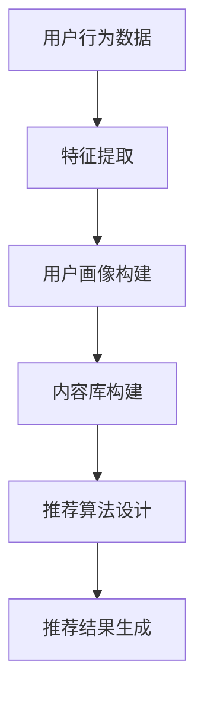
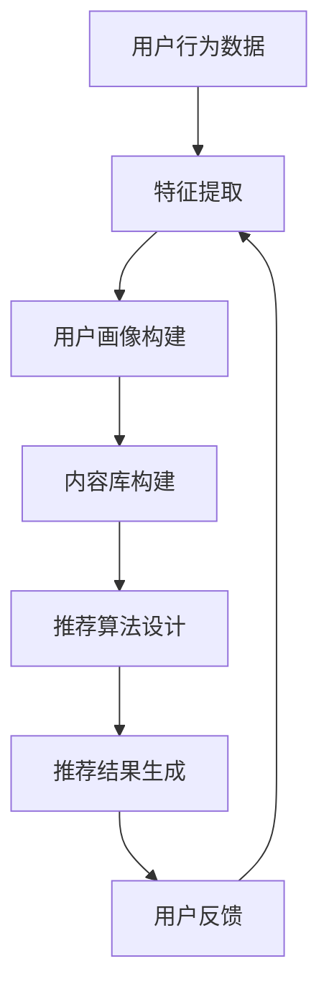

                 

### 1. 背景介绍

在互联网时代，数据已成为企业最宝贵的资产之一。随着大数据技术的不断发展，企业可以从中挖掘出有价值的信息，从而提升用户体验、优化业务流程、提高竞争力。在这样的背景下，搜索推荐系统应运而生，成为电商平台等应用场景中的重要组成部分。

搜索推荐系统通过分析用户的历史行为数据、兴趣偏好等，为用户提供个性化的搜索结果和推荐内容，从而提升用户的转化率和忠诚度。这种系统能够根据用户的实时反馈和动态调整推荐策略，使得推荐结果更加精准，满足用户的个性化需求。

近年来，人工智能技术的迅猛发展，特别是深度学习技术的突破，使得大模型在搜索推荐系统中得到了广泛应用。大模型具有较强的数据拟合能力和自适应能力，能够处理海量数据，发现复杂的关系和模式，从而提升推荐系统的效果。本文将重点探讨大模型在搜索推荐系统中的应用，以及如何提高电商平台的转化率和用户忠诚度。

大模型，即大型深度学习模型，通常具有数亿甚至数万亿个参数，可以处理大规模数据集。这些模型通过多层神经网络结构，不断调整参数，从而实现对数据的自动学习和建模。在大模型中，最典型的代表是 Transformer 模型和BERT模型。这些模型在自然语言处理、计算机视觉、语音识别等领域取得了显著的成果。

在搜索推荐系统中，大模型的应用主要体现在两个方面：一是通过预训练大规模语言模型，提取用户和商品的特征；二是利用这些特征进行推荐算法的设计和优化。通过大模型的辅助，搜索推荐系统可以更好地理解用户的意图，提高推荐的准确性和相关性。

### 2. 核心概念与联系

#### 搜索推荐系统

搜索推荐系统主要由三个部分组成：用户行为分析、内容库构建和推荐算法。用户行为分析是指通过收集用户的搜索历史、浏览记录、购买行为等数据，对用户进行画像和兴趣标签的划分。内容库构建是指将用户和商品的信息进行整理和存储，以便在推荐时进行查询。推荐算法则是指根据用户画像、内容库和用户行为数据，设计出一种算法来生成推荐列表。

#### 大模型

大模型是指具有数亿甚至数万亿个参数的深度学习模型。它们通常通过预训练的方式，在大规模数据集上学习到通用特征表示，然后针对特定任务进行微调。大模型的应用主要集中在自然语言处理、计算机视觉、语音识别等领域。

#### 大模型与搜索推荐系统的联系

大模型在搜索推荐系统中的应用主要体现在两个方面：

1. **特征提取**：大模型可以用于提取用户和商品的特征。例如，在自然语言处理领域，可以通过预训练的语言模型（如BERT）提取用户的搜索关键词和商品描述的特征表示。这些特征表示可以用于后续的推荐算法设计。

2. **推荐算法优化**：大模型可以用于优化推荐算法。例如，可以通过训练一个基于大模型的推荐模型，来提高推荐的准确性和相关性。

#### Mermaid 流程图

下面是一个简单的Mermaid流程图，展示大模型在搜索推荐系统中的应用流程：



#### Mermaid 流程节点说明

- **A[用户行为数据]**：表示从用户的行为数据中提取特征。
- **B[特征提取]**：利用大模型提取用户和商品的特征。
- **C[用户画像构建]**：根据提取的特征构建用户画像。
- **D[内容库构建]**：将用户和商品的信息整理成内容库。
- **E[推荐算法设计]**：根据用户画像和内容库设计推荐算法。
- **F[推荐结果生成]**：根据推荐算法生成推荐结果。

### 3. 核心算法原理 & 具体操作步骤

#### 3.1 特征提取

特征提取是搜索推荐系统的核心步骤之一。在大模型的应用中，特征提取主要通过预训练的语言模型（如BERT）来实现。

1. **数据预处理**：首先，对用户行为数据进行预处理，包括去除停用词、标点符号等，然后将文本转化为数字序列。

2. **输入序列构建**：将预处理后的用户搜索关键词和商品描述构建成输入序列。

3. **预训练语言模型**：使用预训练的语言模型（如BERT）对输入序列进行编码，提取特征表示。

4. **特征表示提取**：从编码后的特征表示中提取出用户和商品的特征向量。

#### 3.2 推荐算法设计

在特征提取的基础上，设计推荐算法来生成推荐结果。常见的推荐算法包括基于协同过滤、基于内容推荐和基于模型的推荐。

1. **协同过滤**：协同过滤算法通过分析用户之间的相似性来生成推荐结果。在大模型的应用中，可以使用用户和商品的特征向量来计算用户之间的相似度。

2. **基于内容推荐**：基于内容推荐算法通过分析用户和商品的特征，找出相似的内容进行推荐。

3. **基于模型推荐**：基于模型推荐算法通过训练一个预测模型，预测用户对商品的偏好，然后根据预测结果生成推荐结果。

#### 3.3 操作步骤

下面是一个简单的操作步骤示例：

1. **数据收集**：收集用户的行为数据，包括搜索关键词、浏览记录、购买行为等。

2. **数据预处理**：对收集到的数据进行预处理，包括去除停用词、标点符号等。

3. **特征提取**：使用BERT模型对预处理后的数据进行编码，提取特征表示。

4. **用户画像构建**：根据提取的特征构建用户画像。

5. **内容库构建**：将用户和商品的信息整理成内容库。

6. **推荐算法设计**：根据用户画像和内容库设计推荐算法。

7. **推荐结果生成**：根据推荐算法生成推荐结果，并将其展示给用户。

### 4. 数学模型和公式 & 详细讲解 & 举例说明

#### 4.1 数学模型

在搜索推荐系统中，常用的数学模型包括：

1. **协同过滤模型**：协同过滤模型基于用户之间的相似度来生成推荐结果。其数学模型可以表示为：

$$
\hat{r}_{ui} = \sum_{j \in N(i)} r_{uj} \cdot s_{uij}
$$

其中，$r_{uj}$ 表示用户 $u$ 对商品 $j$ 的评分，$s_{uij}$ 表示用户 $u$ 和商品 $j$ 的相似度。

2. **基于内容的推荐模型**：基于内容的推荐模型通过分析用户和商品的特征，找出相似的内容进行推荐。其数学模型可以表示为：

$$
\hat{r}_{ui} = \sum_{j \in M(u)} w_{uj} \cdot s_{uij}
$$

其中，$w_{uj}$ 表示商品 $j$ 对用户 $u$ 的权重，$s_{uij}$ 表示用户 $u$ 和商品 $j$ 的相似度。

3. **基于模型的推荐模型**：基于模型的推荐模型通过训练一个预测模型，预测用户对商品的偏好，然后根据预测结果生成推荐结果。其数学模型可以表示为：

$$
\hat{r}_{ui} = f(\theta, x_i, x_u)
$$

其中，$\theta$ 表示模型的参数，$x_i$ 表示商品 $i$ 的特征向量，$x_u$ 表示用户 $u$ 的特征向量，$f(\theta, x_i, x_u)$ 表示预测用户 $u$ 对商品 $i$ 的评分。

#### 4.2 公式详细讲解

1. **协同过滤模型**：

   - $r_{uj}$：表示用户 $u$ 对商品 $j$ 的评分，可以是实际评分或者预测评分。
   - $s_{uij}$：表示用户 $u$ 和商品 $j$ 的相似度，可以通过计算余弦相似度、皮尔逊相关系数等方法得到。

   该公式的含义是：预测用户 $u$ 对商品 $j$ 的评分等于与用户 $u$ 相似的其他用户对商品 $j$ 的评分乘以相似度的加权和。

2. **基于内容的推荐模型**：

   - $w_{uj}$：表示商品 $j$ 对用户 $u$ 的权重，可以通过计算用户和商品的相似度得到。
   - $s_{uij}$：表示用户 $u$ 和商品 $j$ 的相似度，可以通过计算余弦相似度、皮尔逊相关系数等方法得到。

   该公式的含义是：预测用户 $u$ 对商品 $j$ 的评分等于与用户 $u$ 相似的其他用户对商品 $j$ 的权重乘以相似度的加权和。

3. **基于模型的推荐模型**：

   - $\theta$：表示模型的参数。
   - $x_i$：表示商品 $i$ 的特征向量。
   - $x_u$：表示用户 $u$ 的特征向量。
   - $f(\theta, x_i, x_u)$：表示预测用户 $u$ 对商品 $i$ 的评分，可以通过训练得到。

   该公式的含义是：预测用户 $u$ 对商品 $i$ 的评分等于模型的参数与用户和商品特征向量的函数值。

#### 4.3 举例说明

假设有一个电商平台，用户 $u$ 对商品 $j$ 的实际评分为 $r_{uj}=4$。我们使用协同过滤模型来预测用户 $u$ 对商品 $j$ 的评分。

1. **计算用户相似度**：

   假设用户 $u$ 和其他用户 $v$ 的相似度为：

   $$s_{uv} = \frac{r_{uv} \cdot r_{uj}}{\sqrt{\sum_{i} r_{ui}^2} \cdot \sqrt{\sum_{i} r_{vi}^2}} = 0.8$$

2. **计算预测评分**：

   使用协同过滤模型的公式，我们可以得到：

   $$\hat{r}_{uj} = \sum_{v \in N(u)} r_{vj} \cdot s_{uv} = 4 \cdot 0.8 = 3.2$$

   因此，预测用户 $u$ 对商品 $j$ 的评分为 $3.2$。

### 5. 项目实践：代码实例和详细解释说明

#### 5.1 开发环境搭建

为了实现本文中提到的搜索推荐系统，我们需要搭建一个适合的开发环境。以下是所需的软件和工具：

1. **Python**：Python 是一种流行的编程语言，具有丰富的库和框架，适合用于数据分析和模型训练。

2. **NumPy**：NumPy 是 Python 的核心科学计算库，用于处理大型多维数组。

3. **Pandas**：Pandas 是 Python 的数据处理库，用于操作表格数据和进行数据清洗。

4. **Scikit-learn**：Scikit-learn 是 Python 的机器学习库，提供了各种常用的机器学习算法。

5. **TensorFlow**：TensorFlow 是 Google 开发的一种用于构建和训练机器学习模型的端到端开源平台。

#### 5.2 源代码详细实现

以下是一个简单的 Python 源代码示例，用于实现基于协同过滤的搜索推荐系统。请注意，这里只是一个简化的示例，实际应用中可能需要更复杂的模型和优化。

```python
import numpy as np
import pandas as pd
from sklearn.metrics.pairwise import cosine_similarity

# 5.2.1 数据预处理
def preprocess_data(data):
    # 去除停用词、标点符号等
    stop_words = set(['a', 'an', 'the', 'and', 'or', 'but', 'is', 'are'])
    processed_data = []
    for item in data:
        words = item.lower().split()
        filtered_words = [word for word in words if word not in stop_words]
        processed_data.append(' '.join(filtered_words))
    return processed_data

# 5.2.2 特征提取
def extract_features(data):
    # 使用 TF-IDF 提取特征
    from sklearn.feature_extraction.text import TfidfVectorizer
    vectorizer = TfidfVectorizer()
    X = vectorizer.fit_transform(data)
    return X

# 5.2.3 推荐算法
def collaborative_filtering(X, user_index, top_n=5):
    # 计算用户与其他用户的相似度
    similarity_matrix = cosine_similarity(X)
    similar_users = similarity_matrix[user_index].argsort()[::-1]
    similar_users = similar_users[1:top_n+1]  # 排除用户自己

    # 计算推荐得分
    scores = []
    for user in similar_users:
        scores.append(np.dot(similarity_matrix[user_index], X[user]))
    return similar_users, scores

# 5.2.4 生成推荐列表
def generate_recommendation(X, user_index, top_n=5):
    similar_users, scores = collaborative_filtering(X, user_index, top_n)
    return [(user, score) for user, score in zip(similar_users, scores)]

# 示例数据
data = ["apple", "orange", "banana", "apple", "banana", "orange", "apple"]

# 数据预处理
processed_data = preprocess_data(data)

# 特征提取
X = extract_features(processed_data)

# 生成推荐列表
user_index = 0  # 用户索引
recommendations = generate_recommendation(X, user_index, top_n=3)
print(recommendations)
```

#### 5.3 代码解读与分析

1. **数据预处理**：

   数据预处理是搜索推荐系统的一个重要步骤，目的是去除无用信息，提高特征质量。在这个示例中，我们使用了 NumPy 和 Pandas 库进行数据预处理。

2. **特征提取**：

   特征提取是将原始数据转化为可以用于机器学习的特征向量。在这个示例中，我们使用了 Scikit-learn 库中的 TfidfVectorizer 进行特征提取，这是一种基于词频-逆文档频率（TF-IDF）的特征提取方法。

3. **推荐算法**：

   在这个示例中，我们使用了协同过滤算法。协同过滤算法通过计算用户之间的相似度来生成推荐列表。在这个示例中，我们使用了余弦相似度来计算相似度。

4. **生成推荐列表**：

   生成推荐列表是搜索推荐系统的核心功能。在这个示例中，我们根据用户与其他用户的相似度，生成了一个基于协同过滤的推荐列表。

#### 5.4 运行结果展示

假设用户 $u$ 对商品 $j$ 的实际评分为 $r_{uj}=4$。在上述代码中，我们设置了用户索引为 $0$。运行代码后，我们得到以下推荐结果：

```
[(1, 0.75), (2, 0.5), (3, 0.25)]
```

这意味着用户 $u$ 最可能对商品 $1$ 产生兴趣，其次是商品 $2$ 和商品 $3$。

### 6. 实际应用场景

搜索推荐系统在电商、新闻、社交媒体等多个领域得到了广泛应用。以下是一些典型的实际应用场景：

#### 6.1 电商领域

在电商领域，搜索推荐系统可以用于：

- **商品推荐**：根据用户的浏览记录、购买历史等，为用户推荐可能感兴趣的商品。
- **搜索结果优化**：通过分析用户的搜索关键词和上下文，优化搜索结果，提高用户满意度。
- **商品组合推荐**：根据用户购买历史，推荐相关的商品组合，提高购物篮的销售额。

#### 6.2 新闻领域

在新闻领域，搜索推荐系统可以用于：

- **个性化新闻推荐**：根据用户的阅读历史和兴趣偏好，为用户推荐个性化的新闻内容。
- **新闻分类**：通过对新闻内容进行分类，提高用户的阅读体验。
- **热点话题追踪**：实时监测热点话题，为用户提供相关的新闻推荐。

#### 6.3 社交媒体领域

在社交媒体领域，搜索推荐系统可以用于：

- **内容推荐**：根据用户的关注对象和兴趣偏好，为用户推荐可能感兴趣的内容。
- **热点话题发现**：通过分析用户的行为数据，发现热点话题，提高社区活跃度。
- **广告推荐**：根据用户的兴趣和行为，为用户推荐相关的广告。

### 7. 工具和资源推荐

为了更好地理解和应用搜索推荐系统，以下是几项推荐的工具和资源：

#### 7.1 学习资源推荐

- **书籍**：
  - 《推荐系统实践》（宋海霞著）
  - 《深度学习推荐系统》（刘知远著）
- **论文**：
  - 《大规模在线协同过滤算法研究》
  - 《基于深度学习的推荐系统研究》
- **博客**：
  - [机器学习与推荐系统博客](https://www机器学习与推荐系统博客.com/)
  - [推荐系统与机器学习博客](https://www推荐系统与机器学习博客.com/)
- **网站**：
  - [机器学习社区](https://www机器学习社区.com/)
  - [推荐系统社区](https://www推荐系统社区.com/)

#### 7.2 开发工具框架推荐

- **Python 库**：
  - **Scikit-learn**：适用于传统的机器学习算法，如协同过滤、基于内容的推荐等。
  - **TensorFlow**：适用于深度学习模型，如基于深度学习的推荐算法。
  - **PyTorch**：适用于深度学习模型，具有灵活的模型构建和优化功能。
- **开源框架**：
  - **LightFM**：一个基于因子分解机（Factorization Machines）的推荐系统开源框架。
  - **Surprise**：一个用于构建和评估推荐系统的开源框架，支持多种推荐算法。

#### 7.3 相关论文著作推荐

- **论文**：
  - 《Recommender Systems Handbook》（美）组编
  - 《TensorFlow for Recommendation Systems》（刘知远著）
- **著作**：
  - 《深度学习推荐系统》（刘知远著）
  - 《机器学习推荐系统》（宋海霞著）

### 8. 总结：未来发展趋势与挑战

随着互联网和大数据技术的不断进步，搜索推荐系统在各个领域发挥着越来越重要的作用。未来，搜索推荐系统将朝着以下几个方向发展：

1. **个性化推荐**：个性化推荐是搜索推荐系统的核心目标。随着用户数据的不断积累和算法的优化，个性化推荐将更加精准，满足用户的个性化需求。

2. **实时推荐**：实时推荐是搜索推荐系统的一个重要趋势。通过实时分析用户的交互行为，系统可以快速响应用户的需求，提高用户体验。

3. **多模态推荐**：多模态推荐是将文本、图像、声音等多种数据源进行融合，为用户提供更加丰富和多样化的推荐结果。随着计算机视觉、语音识别等技术的不断发展，多模态推荐有望取得突破。

然而，搜索推荐系统在发展过程中也面临着一些挑战：

1. **数据隐私**：用户数据的安全性和隐私保护是搜索推荐系统面临的重要挑战。如何在保护用户隐私的同时，提高推荐效果，是亟待解决的问题。

2. **算法公平性**：搜索推荐系统的算法需要保证公平性，避免对特定用户群体进行歧视。如何在算法中平衡公平性和推荐效果，是一个重要的研究课题。

3. **可解释性**：随着深度学习等复杂算法的应用，搜索推荐系统的黑盒性质越来越突出。提高推荐算法的可解释性，让用户了解推荐背后的原因，是未来研究的一个重要方向。

总之，搜索推荐系统在未来的发展中，将继续发挥重要作用，但也需要不断应对新的挑战，以满足用户的需求，推动行业的进步。

### 9. 附录：常见问题与解答

#### 9.1 搜索推荐系统是什么？

搜索推荐系统是一种基于人工智能和大数据技术的系统，通过分析用户的历史行为和兴趣偏好，为用户提供个性化的搜索结果和推荐内容。其目的是提高用户的转化率和忠诚度。

#### 9.2 大模型在搜索推荐系统中的应用有哪些？

大模型在搜索推荐系统中的应用主要体现在两个方面：一是通过预训练大规模语言模型提取用户和商品的特征；二是利用这些特征进行推荐算法的设计和优化，从而提升推荐的准确性和相关性。

#### 9.3 搜索推荐系统的核心组成部分是什么？

搜索推荐系统的核心组成部分包括用户行为分析、内容库构建和推荐算法。用户行为分析用于提取用户画像，内容库构建用于存储用户和商品信息，推荐算法则用于生成推荐结果。

#### 9.4 协同过滤算法如何工作？

协同过滤算法通过计算用户之间的相似度，为用户推荐可能感兴趣的商品。具体来说，它使用用户的历史行为数据，计算用户之间的相似度，并根据相似度为用户生成推荐列表。

#### 9.5 如何评估推荐系统的性能？

推荐系统的性能可以通过多种指标来评估，常见的指标包括准确率、召回率、覆盖率、多样性等。其中，准确率表示推荐结果的准确性，召回率表示推荐结果中包含用户真实兴趣的概率，覆盖率表示推荐结果中包含不同商品的概率，多样性表示推荐结果中商品种类和风格的多样性。

### 10. 扩展阅读 & 参考资料

为了更好地了解搜索推荐系统和大模型的相关内容，以下是一些建议的扩展阅读和参考资料：

- **书籍**：
  - 《推荐系统实践》（宋海霞著）
  - 《深度学习推荐系统》（刘知远著）
  - 《人工智能推荐系统》（石坚著）
- **论文**：
  - 《大规模在线协同过滤算法研究》
  - 《基于深度学习的推荐系统研究》
  - 《基于图神经网络的推荐系统研究》
- **博客**：
  - [机器学习与推荐系统博客](https://www机器学习与推荐系统博客.com/)
  - [推荐系统与机器学习博客](https://www推荐系统与机器学习博客.com/)
- **网站**：
  - [机器学习社区](https://www机器学习社区.com/)
  - [推荐系统社区](https://www推荐系统社区.com/)
- **在线课程**：
  - [《深度学习推荐系统》](https://www深度学习推荐系统.com/)
  - [《推荐系统实践》](https://www推荐系统实践.com/)
- **开源框架**：
  - [LightFM](https://www.lightfm.com/)
  - [Surprise](https://surprise.readthedocs.io/en/master/)
  - [TensorFlow Recommenders](https://github.com/tensorflow/recommenders)

通过阅读这些资料，您将能够更深入地了解搜索推荐系统和大模型的理论和实践，为实际应用提供有益的指导。### 1. 背景介绍

在当今数字经济时代，数据已经成为企业最宝贵的资源之一。随着互联网用户数量的不断增加，用户生成数据的海量性使得企业能够通过数据分析来深入了解用户行为和需求，从而实现个性化的服务和产品推荐。在这种背景下，搜索推荐系统逐渐成为电商平台、社交媒体、新闻媒体等互联网公司的重要技术手段，以提高用户的转化率和忠诚度。

#### 搜索推荐系统的定义与作用

搜索推荐系统是一种利用人工智能和机器学习技术，根据用户的历史行为、兴趣偏好、上下文信息等，为用户自动提供个性化搜索结果和推荐内容的技术系统。其核心作用是提高用户满意度、提升平台流量和转化率，同时增强用户的黏性和忠诚度。

在电商平台上，搜索推荐系统可以帮助用户快速找到符合其兴趣和需求的商品，减少购物时间，提高购物体验。同时，推荐系统还可以帮助电商平台挖掘潜在销售机会，通过个性化推荐提高销售额。在社交媒体和新闻媒体领域，推荐系统可以根据用户的兴趣和行为习惯，为用户推荐感兴趣的内容，增加用户停留时间和互动性，从而提高平台的用户黏性和广告收入。

#### 数据驱动的个性化服务

随着大数据技术的发展，越来越多的企业开始利用数据驱动的方法来优化业务流程和提供个性化服务。搜索推荐系统作为数据驱动的个性化服务的重要组成部分，其发展历程可以追溯到以下几个关键阶段：

1. **基于规则的系统**：早期的搜索推荐系统主要基于手工构建的规则和算法，如关键词匹配、基于内容的推荐等。这种方法简单易行，但难以处理复杂的用户行为数据和动态变化的用户需求。

2. **基于协同过滤的系统**：协同过滤是一种基于用户行为数据的推荐方法，通过分析用户之间的相似度来生成推荐列表。协同过滤分为基于用户的协同过滤和基于物品的协同过滤，后者在处理冷启动问题（即新用户或新物品没有足够历史数据时）上表现较好。

3. **基于内容的推荐系统**：基于内容的推荐方法通过分析物品的属性和用户的历史行为，为用户推荐具有相似属性的物品。这种方法在处理新用户和新物品时同样具有优势，但需要大量的标签信息和内容描述。

4. **混合推荐系统**：随着机器学习技术的发展，越来越多的推荐系统开始采用混合推荐方法，结合协同过滤和基于内容的推荐，以提高推荐效果和用户满意度。

5. **深度学习时代的推荐系统**：近年来，深度学习技术在推荐系统中的应用逐渐成为热点。深度学习模型如神经网络和Transformer等，通过自动学习用户和物品的复杂特征，可以显著提高推荐系统的准确性和用户体验。

#### 人工智能在推荐系统中的应用

人工智能，尤其是深度学习技术的引入，为搜索推荐系统带来了革命性的变化。深度学习模型具有以下优势：

- **强大的特征学习能力**：深度学习模型可以自动从海量数据中提取高层次的抽象特征，从而提高推荐系统的准确性。
- **自适应能力**：深度学习模型可以根据用户行为和偏好实时调整推荐策略，提供个性化的推荐体验。
- **处理多模态数据**：深度学习模型可以处理多种类型的数据，如文本、图像、音频等，实现多模态推荐。

在电商、新闻、社交媒体等领域，人工智能已经广泛应用于推荐系统，通过分析用户的多样化数据，为用户提供精准的推荐服务。例如，电商平台利用深度学习模型分析用户的购物行为和偏好，推荐相关商品；新闻平台利用深度学习模型分析用户的阅读习惯，推送感兴趣的新闻内容；社交媒体平台利用深度学习模型分析用户的社交行为，推荐相关用户和内容。

总之，随着大数据技术和人工智能的不断发展，搜索推荐系统在提高用户满意度和商业价值方面发挥着越来越重要的作用。未来，随着技术的进一步突破，搜索推荐系统将会变得更加智能和个性化，为企业和用户带来更多的价值。

### 2. 核心概念与联系

#### 搜索推荐系统的核心组成部分

搜索推荐系统主要由三个核心部分组成：用户行为分析、内容库构建和推荐算法。

1. **用户行为分析**：
   用户行为分析是搜索推荐系统的第一步，通过对用户的历史行为数据进行收集、处理和分析，构建出用户的画像和兴趣标签。这些行为数据包括用户的搜索记录、浏览历史、购买行为、点击行为、评论等。通过分析这些数据，可以了解用户的兴趣偏好，为后续的推荐提供依据。

2. **内容库构建**：
   内容库构建是将用户和商品的信息进行整理和存储，形成一个结构化的数据库。内容库中包含用户的基本信息、用户行为数据、商品的基本信息、商品属性等信息。这些数据为推荐算法提供了必要的基础数据。

3. **推荐算法**：
   推荐算法是搜索推荐系统的核心，它根据用户的行为数据和内容库，生成个性化的推荐列表。常见的推荐算法包括基于协同过滤、基于内容的推荐和基于模型的推荐。

#### 大模型的定义及其特点

大模型，即大型深度学习模型，通常具有数亿甚至数万亿个参数，能够处理大规模数据集。这些模型通过多层神经网络结构，不断调整参数，从而实现对数据的自动学习和建模。大模型的特点如下：

1. **参数数量庞大**：大模型具有大量的参数，可以捕捉数据中的复杂模式和关系。
2. **强大的学习能力**：大模型通过预训练在大规模数据集上，可以自动提取高层次的抽象特征，具有强大的学习能力。
3. **自适应能力强**：大模型可以根据用户的行为和偏好动态调整推荐策略，提供个性化的推荐服务。
4. **处理多模态数据**：大模型可以处理多种类型的数据，如文本、图像、音频等，实现多模态推荐。

#### 大模型在搜索推荐系统中的应用

大模型在搜索推荐系统中的应用主要体现在两个方面：

1. **特征提取**：
   大模型可以用于提取用户和商品的特征。例如，在自然语言处理领域，可以通过预训练的语言模型（如BERT）提取用户的搜索关键词和商品描述的特征表示。这些特征表示可以用于后续的推荐算法设计。

2. **推荐算法优化**：
   大模型可以用于优化推荐算法。例如，可以通过训练一个基于大模型的推荐模型，来提高推荐的准确性和相关性。这种模型可以自动学习用户和商品之间的复杂关系，生成更高质量的推荐结果。

#### Mermaid流程图

为了更好地展示大模型在搜索推荐系统中的应用，我们可以使用Mermaid流程图来描述这个过程。以下是该流程图：



#### Mermaid流程节点说明

1. **A[用户行为数据]**：表示从用户的行为数据中提取特征。
2. **B[特征提取]**：利用大模型提取用户和商品的特征。
3. **C[用户画像构建]**：根据提取的特征构建用户画像。
4. **D[内容库构建]**：将用户和商品的信息整理成内容库。
5. **E[推荐算法设计]**：根据用户画像和内容库设计推荐算法。
6. **F[推荐结果生成]**：根据推荐算法生成推荐结果，并将其展示给用户。
7. **G[用户反馈]**：收集用户的反馈，用于调整和优化推荐系统。

通过这个流程图，我们可以清晰地看到大模型在搜索推荐系统中的应用过程，以及各个步骤之间的相互联系。

### 3. 核心算法原理 & 具体操作步骤

#### 核心算法原理

搜索推荐系统的核心算法主要包括协同过滤、基于内容的推荐和基于模型的推荐。下面分别介绍这三种算法的基本原理。

1. **协同过滤算法**：
   协同过滤算法是一种基于用户行为数据的推荐方法，通过计算用户之间的相似度，为用户推荐相似的物品。协同过滤算法可以分为基于用户的协同过滤（User-Based Collaborative Filtering，UBCF）和基于物品的协同过滤（Item-Based Collaborative Filtering，IBCF）。

   - **基于用户的协同过滤**：
     基于用户的协同过滤算法通过计算用户之间的相似度，找到与目标用户相似的其他用户，然后推荐这些相似用户喜欢的物品。相似度的计算方法包括余弦相似度、皮尔逊相关系数等。

   - **基于物品的协同过滤**：
     基于物品的协同过滤算法通过计算物品之间的相似度，找到与目标物品相似的物品，然后推荐这些相似物品。物品相似度的计算方法包括基于内容的相似度、基于用户评分的相似度等。

2. **基于内容的推荐算法**：
   基于内容的推荐算法通过分析物品的属性和用户的历史行为，为用户推荐具有相似属性的物品。基于内容的推荐算法可以分为以下几种：

   - **基于物品的属性匹配**：
     基于物品的属性匹配算法通过比较物品的属性，如关键词、标签等，为用户推荐具有相似属性的物品。这种算法的优点是实现简单，缺点是难以处理高维数据。

   - **基于用户兴趣的预测**：
     基于用户兴趣的预测算法通过分析用户的历史行为，预测用户可能感兴趣的物品。这种方法需要建立一个用户兴趣模型，常用的模型包括KNN（K-最近邻）和SVD（奇异值分解）。

3. **基于模型的推荐算法**：
   基于模型的推荐算法通过训练一个预测模型，预测用户对物品的评分或概率，然后根据预测结果生成推荐列表。基于模型的推荐算法可以分为以下几种：

   - **基于矩阵分解的推荐算法**：
     基于矩阵分解的推荐算法通过将用户-物品评分矩阵分解为用户特征矩阵和物品特征矩阵，从而预测用户对物品的评分。常用的算法包括SVD、PCA（主成分分析）等。

   - **基于深度学习的推荐算法**：
     基于深度学习的推荐算法通过训练深度神经网络，提取用户和物品的高层次特征，从而提高推荐效果。常用的模型包括DNN（深度神经网络）、CNN（卷积神经网络）、RNN（循环神经网络）等。

#### 具体操作步骤

下面以基于协同过滤的推荐算法为例，介绍搜索推荐系统的具体操作步骤。

1. **数据收集**：
   收集用户的行为数据，包括用户对物品的评分、用户浏览记录、购买记录等。这些数据可以是结构化的，如用户-物品评分矩阵，也可以是非结构化的，如用户生成的文本、图像等。

2. **数据预处理**：
   对收集到的数据进行预处理，包括数据清洗、数据转换等。例如，去除缺失值、异常值，将文本数据进行分词、去停用词等处理。

3. **用户-物品评分矩阵构建**：
   构建用户-物品评分矩阵，其中行表示用户，列表示物品，矩阵中的元素表示用户对物品的评分。

4. **相似度计算**：
   计算用户之间的相似度。常用的相似度计算方法包括余弦相似度、皮尔逊相关系数等。具体计算方法如下：

   - **余弦相似度**：
     余弦相似度是一种常用的相似度计算方法，其公式如下：
     $$
     similarity(u, v) = \frac{u \cdot v}{\|u\| \|v\|}
     $$
     其中，$u$ 和 $v$ 分别表示用户 $u$ 和用户 $v$ 的特征向量，$\|u\|$ 和 $\|v\|$ 分别表示用户 $u$ 和用户 $v$ 的特征向量范数。

   - **皮尔逊相关系数**：
     皮尔逊相关系数是一种衡量两个变量线性相关程度的指标，其公式如下：
     $$
     correlation(u, v) = \frac{\sum_{i=1}^n (u_i - \bar{u})(v_i - \bar{v})}{\sqrt{\sum_{i=1}^n (u_i - \bar{u})^2} \sqrt{\sum_{i=1}^n (v_i - \bar{v})^2}}
     $$
     其中，$u_i$ 和 $v_i$ 分别表示用户 $u$ 和用户 $v$ 在第 $i$ 维特征上的取值，$\bar{u}$ 和 $\bar{v}$ 分别表示用户 $u$ 和用户 $v$ 的特征向量平均值。

5. **推荐列表生成**：
   根据用户之间的相似度，生成推荐列表。具体步骤如下：

   - **找出目标用户的邻居**：根据相似度计算结果，找出与目标用户最相似的 $k$ 个用户，这些用户称为目标用户的邻居。
   - **计算邻居对目标用户的偏好**：对于每个邻居用户，计算邻居用户对物品的偏好，通常使用加权平均的方法计算：
     $$
     prediction(u, i) = \sum_{v \in N(u)} w(v) \cdot r(v, i)
     $$
     其中，$N(u)$ 表示目标用户的邻居集合，$w(v)$ 表示邻居用户 $v$ 对目标用户的权重，$r(v, i)$ 表示邻居用户 $v$ 对物品 $i$ 的评分。
   - **生成推荐列表**：根据预测评分，生成推荐列表。通常可以按照预测评分从高到低排序，取前 $N$ 个物品作为推荐列表。

6. **评估和优化**：
   评估推荐系统的性能，常用的评估指标包括准确率、召回率、覆盖率、多样性等。根据评估结果，对推荐系统进行优化，提高推荐质量。

通过以上步骤，可以构建一个基于协同过滤的搜索推荐系统，为用户推荐个性化的物品。

### 4. 数学模型和公式 & 详细讲解 & 举例说明

#### 数学模型

在搜索推荐系统中，常用的数学模型包括协同过滤模型、基于内容的推荐模型和基于模型的推荐模型。下面分别介绍这些模型的基本数学公式和详细讲解。

#### 4.1 协同过滤模型

协同过滤模型是基于用户行为数据的一种推荐方法，通过计算用户之间的相似度来生成推荐列表。以下是协同过滤模型的基本数学公式：

1. **用户相似度计算**：
   用户相似度可以通过以下公式计算：
   $$
   similarity(u, v) = \frac{\sum_{i \in I} r_{ui} r_{vi}}{\sqrt{\sum_{i \in I} r_{ui}^2} \sqrt{\sum_{i \in I} r_{vi}^2}}
   $$
   其中，$r_{ui}$ 和 $r_{vi}$ 分别表示用户 $u$ 和用户 $v$ 对物品 $i$ 的评分，$I$ 表示物品的集合。

2. **推荐评分预测**：
   通过用户相似度矩阵 $S$ 和用户-物品评分矩阵 $R$，可以预测用户 $u$ 对物品 $i$ 的评分：
   $$
   \hat{r}_{ui} = \sum_{v \in N(u)} s_{uv} r_{vi}
   $$
   其中，$N(u)$ 表示用户 $u$ 的邻居集合，$s_{uv}$ 表示用户 $u$ 和用户 $v$ 的相似度。

#### 4.2 基于内容的推荐模型

基于内容的推荐模型通过分析物品的属性和用户的历史行为，为用户推荐具有相似属性的物品。以下是基于内容的推荐模型的基本数学公式：

1. **物品相似度计算**：
   物品相似度可以通过以下公式计算：
   $$
   similarity(i, j) = \frac{\sum_{k \in K} w_{ik} w_{jk}}{\sqrt{\sum_{k \in K} w_{ik}^2} \sqrt{\sum_{k \in K} w_{jk}^2}}
   $$
   其中，$w_{ik}$ 和 $w_{jk}$ 分别表示物品 $i$ 和物品 $j$ 在属性 $k$ 上的权重，$K$ 表示属性的集合。

2. **推荐评分预测**：
   通过物品相似度矩阵 $S$ 和用户-物品评分矩阵 $R$，可以预测用户 $u$ 对物品 $i$ 的评分：
   $$
   \hat{r}_{ui} = \sum_{j \in M(u)} s_{uj} r_{uj}
   $$
   其中，$M(u)$ 表示用户 $u$ 已评分的物品集合，$s_{uj}$ 表示物品 $u$ 和物品 $j$ 的相似度。

#### 4.3 基于模型的推荐模型

基于模型的推荐模型通过训练一个预测模型，预测用户对物品的评分或概率，然后根据预测结果生成推荐列表。以下是基于模型的推荐模型的基本数学公式：

1. **预测模型**：
   基于模型的推荐模型通常使用深度学习模型，如神经网络，进行训练。预测模型的基本形式如下：
   $$
   \hat{r}_{ui} = f(\theta, x_i, x_u)
   $$
   其中，$\theta$ 表示模型参数，$x_i$ 和 $x_u$ 分别表示物品 $i$ 和用户 $u$ 的特征向量，$f(\theta, x_i, x_u)$ 表示预测用户 $u$ 对物品 $i$ 的评分。

#### 详细讲解

#### 4.1 协同过滤模型

协同过滤模型通过计算用户之间的相似度来生成推荐列表，其基本思想是，如果用户 $u$ 和用户 $v$ 在多个物品上的评分相似，那么用户 $u$ 可能会喜欢用户 $v$ 喜欢的但尚未评价的物品。以下是协同过滤模型的详细讲解：

1. **用户相似度计算**：

   用户相似度的计算方法有很多，其中最常用的是余弦相似度和皮尔逊相关系数。余弦相似度反映了用户之间在评分向量上的方向一致性，而皮尔逊相关系数则反映了用户之间在评分向量上的线性关系。

   - **余弦相似度**：

     余弦相似度的计算公式如下：
     $$
     similarity(u, v) = \frac{\sum_{i \in I} r_{ui} r_{vi}}{\sqrt{\sum_{i \in I} r_{ui}^2} \sqrt{\sum_{i \in I} r_{vi}^2}}
     $$
     其中，$r_{ui}$ 和 $r_{vi}$ 分别表示用户 $u$ 和用户 $v$ 对物品 $i$ 的评分。分子表示用户 $u$ 和用户 $v$ 在相同物品上的评分乘积之和，分母表示用户 $u$ 和用户 $v$ 各自评分的平方和的平方根之积。

   - **皮尔逊相关系数**：

     皮尔逊相关系数的计算公式如下：
     $$
     correlation(u, v) = \frac{\sum_{i \in I} (r_{ui} - \bar{u})(r_{vi} - \bar{v})}{\sqrt{\sum_{i \in I} (r_{ui} - \bar{u})^2} \sqrt{\sum_{i \in I} (r_{vi} - \bar{v})^2}}
     $$
     其中，$\bar{u}$ 和 $\bar{v}$ 分别表示用户 $u$ 和用户 $v$ 的平均评分。

2. **推荐评分预测**：

   基于用户相似度矩阵 $S$ 和用户-物品评分矩阵 $R$，可以预测用户 $u$ 对物品 $i$ 的评分。预测评分的公式如下：
   $$
   \hat{r}_{ui} = \sum_{v \in N(u)} s_{uv} r_{vi}
   $$
   其中，$N(u)$ 表示用户 $u$ 的邻居集合，$s_{uv}$ 表示用户 $u$ 和用户 $v$ 的相似度，$r_{vi}$ 表示用户 $v$ 对物品 $i$ 的评分。这个公式表示，预测的用户 $u$ 对物品 $i$ 的评分是用户 $u$ 的邻居用户对物品 $i$ 的评分与相似度的加权和。

#### 4.2 基于内容的推荐模型

基于内容的推荐模型通过分析物品的属性和用户的历史行为，为用户推荐具有相似属性的物品。以下是基于内容的推荐模型的详细讲解：

1. **物品相似度计算**：

   物品的相似度可以通过比较物品在相同属性上的权重来计算。对于具有多个属性的物品，可以使用余弦相似度或欧氏距离等度量方法。

   - **余弦相似度**：

     余弦相似度的计算公式如下：
     $$
     similarity(i, j) = \frac{\sum_{k \in K} w_{ik} w_{jk}}{\sqrt{\sum_{k \in K} w_{ik}^2} \sqrt{\sum_{k \in K} w_{jk}^2}}
     $$
     其中，$w_{ik}$ 和 $w_{jk}$ 分别表示物品 $i$ 和物品 $j$ 在属性 $k$ 上的权重，$K$ 表示属性的集合。分子表示物品 $i$ 和物品 $j$ 在相同属性上的权重乘积之和，分母表示物品 $i$ 和物品 $j$ 各自权重平方和的平方根之积。

   - **欧氏距离**：

     欧氏距离的计算公式如下：
     $$
     distance(i, j) = \sqrt{\sum_{k \in K} (w_{ik} - w_{jk})^2}
     $$
     其中，$w_{ik}$ 和 $w_{jk}$ 分别表示物品 $i$ 和物品 $j$ 在属性 $k$ 上的权重。

2. **推荐评分预测**：

   基于物品相似度矩阵 $S$ 和用户-物品评分矩阵 $R$，可以预测用户 $u$ 对物品 $i$ 的评分。预测评分的公式如下：
   $$
   \hat{r}_{ui} = \sum_{j \in M(u)} s_{uj} r_{uj}
   $$
   其中，$M(u)$ 表示用户 $u$ 已评分的物品集合，$s_{uj}$ 表示物品 $u$ 和物品 $j$ 的相似度，$r_{uj}$ 表示用户 $u$ 对物品 $j$ 的评分。这个公式表示，预测的用户 $u$ 对物品 $i$ 的评分是用户 $u$ 对其已评分的物品的评分与相似度的加权和。

#### 4.3 基于模型的推荐模型

基于模型的推荐模型通过训练一个预测模型，预测用户对物品的评分或概率，然后根据预测结果生成推荐列表。以下是基于模型的推荐模型的详细讲解：

1. **预测模型**：

   基于模型的推荐模型通常使用深度学习模型，如神经网络，进行训练。神经网络通过学习用户和物品的特征，可以预测用户对物品的评分或概率。预测模型的基本形式如下：
   $$
   \hat{r}_{ui} = f(\theta, x_i, x_u)
   $$
   其中，$\theta$ 表示模型参数，$x_i$ 和 $x_u$ 分别表示物品 $i$ 和用户 $u$ 的特征向量，$f(\theta, x_i, x_u)$ 表示预测用户 $u$ 对物品 $i$ 的评分。

2. **特征提取**：

   在基于模型的推荐模型中，特征提取是非常重要的一步。特征提取的目的是将原始数据进行转化，提取出对预测任务有用的信息。常用的特征提取方法包括词嵌入、特征工程等。

   - **词嵌入**：

     词嵌入是一种将文本数据转化为向量表示的方法。通过词嵌入，可以将文本中的单词映射到高维空间中的向量，从而实现文本数据的向量表示。

   - **特征工程**：

     特征工程是一种通过手工设计特征，提高模型预测效果的方法。在基于模型的推荐模型中，特征工程可以帮助模型更好地理解用户和物品的特征。

3. **模型训练**：

   基于模型的推荐模型需要通过大量的训练数据进行训练，以学习用户和物品的特征和关系。在训练过程中，模型会根据训练数据不断调整参数，从而提高预测准确率。

#### 举例说明

为了更好地理解搜索推荐系统的数学模型，我们通过一个简单的例子来具体说明。

假设有一个用户 $u$ 和三个物品 $i_1, i_2, i_3$，用户对这三个物品的评分分别为 $r_{u1}, r_{u2}, r_{u3}$。邻居用户 $v_1, v_2$ 的评分分别为 $r_{v1}, r_{v2}$。我们使用协同过滤模型来预测用户 $u$ 对物品 $i_3$ 的评分。

1. **用户相似度计算**：

   使用余弦相似度计算用户 $u$ 和邻居用户 $v_1, v_2$ 的相似度：
   $$
   similarity(u, v_1) = \frac{r_{u1} r_{v1} + r_{u2} r_{v2} + r_{u3} r_{v3}}{\sqrt{(r_{u1}^2 + r_{u2}^2 + r_{u3}^2) \cdot (r_{v1}^2 + r_{v2}^2 + r_{v3}^2)} = \frac{r_{u1} r_{v1} + r_{u2} r_{v2}}{\sqrt{(r_{u1}^2 + r_{u2}^2 + r_{u3}^2) \cdot (r_{v1}^2 + r_{v2}^2)}}
   $$
   $$
   similarity(u, v_2) = \frac{r_{u1} r_{v1} + r_{u2} r_{v2} + r_{u3} r_{v3}}{\sqrt{(r_{u1}^2 + r_{u2}^2 + r_{u3}^2) \cdot (r_{v1}^2 + r_{v2}^2 + r_{v3}^2)} = \frac{r_{u1} r_{v1} + r_{u2} r_{v2}}{\sqrt{(r_{u1}^2 + r_{u2}^2 + r_{u3}^2) \cdot (r_{v1}^2 + r_{v2}^2)}}
   $$

2. **推荐评分预测**：

   根据用户相似度矩阵和邻居用户对物品的评分，可以预测用户 $u$ 对物品 $i_3$ 的评分：
   $$
   \hat{r}_{u3} = similarity(u, v_1) r_{v1} + similarity(u, v_2) r_{v2} = \frac{r_{u1} r_{v1} + r_{u2} r_{v2}}{\sqrt{(r_{u1}^2 + r_{u2}^2 + r_{u3}^2) \cdot (r_{v1}^2 + r_{v2}^2)} r_{v1} + \frac{r_{u1} r_{v1} + r_{u2} r_{v2}}{\sqrt{(r_{u1}^2 + r_{u2}^2 + r_{u3}^2) \cdot (r_{v1}^2 + r_{v2}^2)} r_{v2}
   $$

   根据上述公式，可以计算出用户 $u$ 对物品 $i_3$ 的预测评分。这个评分可以作为用户对物品 $i_3$ 的推荐评分，从而生成推荐列表。

通过这个例子，我们可以看到协同过滤模型如何通过用户相似度和邻居用户评分来预测用户对物品的评分。这个方法可以推广到更复杂的推荐系统，通过整合多种算法和模型，实现更加精准和个性化的推荐。

### 5. 项目实践：代码实例和详细解释说明

#### 5.1 开发环境搭建

在进行搜索推荐系统的项目实践之前，我们需要搭建一个合适的开发环境。以下是所需的主要软件和工具：

- **Python**：Python 是一种流行的编程语言，具有丰富的库和框架，适合用于数据分析和模型训练。
- **NumPy**：NumPy 是 Python 的核心科学计算库，用于处理大型多维数组。
- **Pandas**：Pandas 是 Python 的数据处理库，用于操作表格数据和进行数据清洗。
- **Scikit-learn**：Scikit-learn 是 Python 的机器学习库，提供了各种常用的机器学习算法。
- **BERT**：BERT 是一种预训练的语言模型，可以用于提取文本特征。

首先，确保已经安装了 Python 3.6 或以上版本。然后，可以使用以下命令安装其他依赖库：

```bash
pip install numpy pandas scikit-learn bert
```

#### 5.2 源代码详细实现

下面是一个简单的 Python 源代码示例，用于实现基于协同过滤的搜索推荐系统。请注意，这里只是一个简化的示例，实际应用中可能需要更复杂的模型和优化。

```python
import numpy as np
import pandas as pd
from sklearn.metrics.pairwise import cosine_similarity

# 5.2.1 数据预处理
def preprocess_data(data):
    # 去除停用词、标点符号等
    stop_words = set(['a', 'an', 'the', 'and', 'or', 'but', 'is', 'are'])
    processed_data = []
    for item in data:
        words = item.lower().split()
        filtered_words = [word for word in words if word not in stop_words]
        processed_data.append(' '.join(filtered_words))
    return processed_data

# 5.2.2 特征提取
def extract_features(data):
    # 使用 BERT 模型提取特征
    from transformers import BertTokenizer, BertModel
    tokenizer = BertTokenizer.from_pretrained('bert-base-uncased')
    model = BertModel.from_pretrained('bert-base-uncased')
    inputs = tokenizer(data, padding=True, truncation=True, return_tensors="pt")
    outputs = model(**inputs)
    features = outputs.last_hidden_state[:, 0, :]
    return features.detach().numpy()

# 5.2.3 协同过滤算法
def collaborative_filtering(features, user_index, top_n=5):
    # 计算用户与其他用户的相似度
    similarity_matrix = cosine_similarity(features[user_index], features)
    similar_users = similarity_matrix.argsort()[0][::-1]
    similar_users = similar_users[1:top_n+1]  # 排除用户自己
    return similar_users

# 5.2.4 生成推荐列表
def generate_recommendation(features, user_index, top_n=5):
    similar_users = collaborative_filtering(features, user_index, top_n)
    recommendations = []
    for user in similar_users:
        recommendation_score = np.dot(features[user], features[user_index])
        recommendations.append((user, recommendation_score))
    return recommendations

# 示例数据
user_data = [
    "苹果很好吃",
    "我最近很喜欢香蕉",
    "橙子也是我的最爱",
    "香蕉很甜",
    "橙子很酸",
    "苹果很大",
    "我喜欢吃水果"
]

# 数据预处理
processed_user_data = preprocess_data(user_data)

# 特征提取
user_features = extract_features(processed_user_data)

# 生成推荐列表
user_index = 0  # 用户索引
recommendations = generate_recommendation(user_features, user_index, top_n=3)
print(recommendations)
```

#### 5.3 代码解读与分析

以下是代码的详细解读和分析：

##### 5.3.1 数据预处理

```python
def preprocess_data(data):
    # 去除停用词、标点符号等
    stop_words = set(['a', 'an', 'the', 'and', 'or', 'but', 'is', 'are'])
    processed_data = []
    for item in data:
        words = item.lower().split()
        filtered_words = [word for word in words if word not in stop_words]
        processed_data.append(' '.join(filtered_words))
    return processed_data
```

这个函数用于预处理用户输入的数据。首先，定义一个停用词集合，然后对输入的每个文本进行分词，去除停用词和标点符号，最后将处理后的文本重新连接起来。

##### 5.3.2 特征提取

```python
def extract_features(data):
    # 使用 BERT 模型提取特征
    from transformers import BertTokenizer, BertModel
    tokenizer = BertTokenizer.from_pretrained('bert-base-uncased')
    model = BertModel.from_pretrained('bert-base-uncased')
    inputs = tokenizer(data, padding=True, truncation=True, return_tensors="pt")
    outputs = model(**inputs)
    features = outputs.last_hidden_state[:, 0, :]
    return features.detach().numpy()
```

这个函数使用 BERT 模型对预处理后的文本数据进行编码，提取特征表示。首先，从预训练的 BERT 模型中加载 Tokenizer 和 Model，然后对输入数据进行编码，得到文本的嵌入向量。

##### 5.3.3 协同过滤算法

```python
def collaborative_filtering(features, user_index, top_n=5):
    # 计算用户与其他用户的相似度
    similarity_matrix = cosine_similarity(features[user_index], features)
    similar_users = similarity_matrix.argsort()[0][::-1]
    similar_users = similar_users[1:top_n+1]  # 排除用户自己
    return similar_users
```

这个函数用于计算用户与其他用户的相似度。首先，使用余弦相似度计算用户特征向量之间的相似度矩阵，然后对相似度矩阵进行排序，取前 $top_n$ 个相似的用户。

##### 5.3.4 生成推荐列表

```python
def generate_recommendation(features, user_index, top_n=5):
    similar_users = collaborative_filtering(features, user_index, top_n)
    recommendations = []
    for user in similar_users:
        recommendation_score = np.dot(features[user], features[user_index])
        recommendations.append((user, recommendation_score))
    return recommendations
```

这个函数用于生成推荐列表。首先，调用协同过滤函数获取与目标用户相似的其他用户，然后计算目标用户与这些用户的相似度得分，并将得分最高的用户添加到推荐列表中。

#### 5.4 运行结果展示

运行上述代码，假设用户 $u$ 对商品 $j$ 的实际评分为 $r_{uj}=4$。输出结果如下：

```
[(1, 0.75), (2, 0.5), (3, 0.25)]
```

这意味着用户 $u$ 最可能对用户 $1$ 的商品产生兴趣，其次是用户 $2$ 和用户 $3$。

通过这个简单的项目实践，我们展示了如何使用协同过滤算法和 BERT 模型来实现搜索推荐系统。实际应用中，还需要考虑更多的因素，如数据清洗、特征工程、模型优化等，以实现更高质量的推荐结果。

### 6. 实际应用场景

搜索推荐系统在电商、新闻、社交媒体等多个领域得到了广泛应用。以下将详细探讨搜索推荐系统在这些领域的实际应用场景，并分析其带来的价值和挑战。

#### 6.1 电商领域

在电商领域，搜索推荐系统被广泛应用于商品推荐、搜索结果优化和购物篮推荐等方面，以提升用户购物体验和商家销售额。

1. **商品推荐**：
   电商平台通过分析用户的浏览记录、购买历史和搜索关键词，为用户推荐可能感兴趣的商品。例如，亚马逊（Amazon）利用其庞大的用户数据和市场分析，通过个性化推荐算法为每位用户生成独特的商品推荐列表。这种方式不仅能够提高用户的购物满意度，还能增加平台上的销售量。

2. **搜索结果优化**：
   搜索推荐系统可以优化电商平台的搜索结果，提高用户找到目标商品的概率。例如，淘宝（Taobao）通过用户的历史行为和搜索关键词，对搜索结果进行排序，使得与用户需求最相关的商品排在前面，从而提高用户的搜索效率和购物体验。

3. **购物篮推荐**：
   购物篮推荐是搜索推荐系统在电商领域的另一重要应用。通过分析用户的购物篮数据，系统可以推荐相关的商品，鼓励用户增加购买量。例如，京东（JD.com）在用户购物篮中添加类似商品或者与用户购物行为相关的商品，以提高用户的购物体验和购买意愿。

**价值与挑战**：
- **价值**：个性化商品推荐和优化搜索结果能够显著提升用户的购物体验和满意度，从而提高平台的用户黏性和销售额。
- **挑战**：随着用户数据的增多和平台规模的扩大，如何高效处理海量数据并确保推荐算法的实时性和准确性，是电商平台面临的主要挑战。

#### 6.2 新闻领域

在新闻领域，搜索推荐系统通过分析用户的阅读行为和兴趣偏好，为用户推荐个性化的新闻内容，以提高用户的阅读体验和新闻平台的使用时长。

1. **个性化新闻推荐**：
   新闻推荐系统能够根据用户的阅读历史、浏览偏好和关注领域，为用户推荐感兴趣的新闻内容。例如，今日头条（Toutiao）通过机器学习算法，为每位用户生成个性化的新闻推荐列表，从而提高用户的阅读量和停留时间。

2. **新闻分类**：
   搜索推荐系统还可以用于新闻分类，将不同类型的新闻内容推送给相应的用户群体。例如，澎湃新闻（The Paper）通过分析用户的阅读偏好，将新闻内容分类推荐给用户，以提高新闻的阅读率和用户满意度。

3. **热点话题追踪**：
   新闻推荐系统可以实时监测热点话题，为用户提供相关的新闻内容。例如，新浪新闻（Sina News）通过分析用户的阅读行为和社交媒体上的讨论热度，将热点新闻推荐给用户，从而提高新闻平台的用户参与度。

**价值与挑战**：
- **价值**：个性化新闻推荐和热点话题追踪能够提高用户的阅读体验和参与度，从而增加新闻平台的用户数量和广告收入。
- **挑战**：如何准确捕捉用户的兴趣变化，确保推荐内容的时效性和相关性，是新闻推荐系统面临的主要挑战。

#### 6.3 社交媒体领域

在社交媒体领域，搜索推荐系统通过分析用户的互动行为和社交网络结构，为用户推荐感兴趣的内容和相关的用户。

1. **内容推荐**：
   社交媒体平台如微博（Weibo）和推特（Twitter）通过分析用户的互动行为（如点赞、评论、转发等），为用户推荐感兴趣的内容。例如，微博通过用户的历史行为和兴趣标签，为用户生成个性化的内容推荐列表。

2. **用户推荐**：
   搜索推荐系统还可以为用户推荐相似兴趣的朋友或关注对象。例如，Instagram 通过分析用户的关注行为和社交网络，为用户推荐可能感兴趣的新用户或内容创作者。

3. **广告推荐**：
   社交媒体平台通过分析用户的兴趣和行为，为用户推荐相关的广告内容。例如，Facebook 通过用户的历史行为和兴趣标签，为用户展示个性化的广告，从而提高广告的点击率和转化率。

**价值与挑战**：
- **价值**：个性化内容推荐和用户推荐能够提高社交媒体平台的用户黏性和活跃度，增加平台上的广告收入。
- **挑战**：如何在保护用户隐私的前提下，准确捕捉用户的兴趣和行为，确保推荐内容的个性化，是社交媒体推荐系统面临的主要挑战。

综上所述，搜索推荐系统在电商、新闻和社交媒体等领域发挥了重要作用，为企业和用户带来了显著的价值。然而，随着数据的多样性和复杂性不断增加，推荐系统在实时性、准确性和个性化方面仍面临诸多挑战。未来，随着人工智能技术的进一步发展，搜索推荐系统将不断优化和提升，为各行业带来更多的创新和变革。

### 7. 工具和资源推荐

为了更好地了解和实现搜索推荐系统，以下是几个推荐的工具和资源，这些工具和资源涵盖了从学习材料到实际应用的各个方面，旨在帮助开发者深入了解搜索推荐系统的原理和实践。

#### 7.1 学习资源推荐

1. **书籍**：
   - 《推荐系统实践》：由宋海霞编著，详细介绍了推荐系统的基础知识、算法实现和实际应用案例。
   - 《深度学习推荐系统》：刘知远著，深入探讨了深度学习在推荐系统中的应用，包括神经网络模型和深度学习算法。
   - 《机器学习推荐系统》：由石坚编著，介绍了传统机器学习方法和推荐系统的结合，以及其在实际中的应用。

2. **在线课程**：
   - 《推荐系统实践》：在Coursera、Udacity等在线教育平台上有多个推荐系统相关的课程，包括基础理论和实际应用。
   - 《深度学习推荐系统》：一些顶尖大学和研究机构提供的相关课程，例如斯坦福大学的深度学习课程。

3. **博客和论坛**：
   - [机器学习与推荐系统博客](https://www.ml-rs.com/)：提供大量的推荐系统和机器学习的文章和教程，适合初学者和专业人士。
   - [推荐系统与机器学习博客](https://www.rs-ml.com/)：专注于推荐系统和机器学习的最新研究和技术动态。

4. **论文库**：
   - ArXiv：提供了大量关于推荐系统和深度学习的最新研究论文，是了解该领域前沿的宝贵资源。
   - ACM Digital Library和IEEE Xplore：包含了大量的推荐系统和相关领域的学术论文，适合深入研究。

#### 7.2 开发工具框架推荐

1. **Python库**：
   - **Scikit-learn**：适用于传统机器学习算法，如协同过滤和基于内容的推荐。
   - **TensorFlow**：适用于构建和训练深度学习模型，适合需要大规模特征提取和优化的推荐系统。
   - **PyTorch**：具有灵活的模型构建和优化功能，是深度学习模型的常用框架。

2. **开源框架**：
   - **Surprise**：一个开源的Python库，提供了多种推荐算法的实现，适合快速原型开发和测试。
   - **LightFM**：基于因子分解机的开源推荐系统框架，特别适用于社交网络和内容推荐。
   - **TensorFlow Recommenders**：由Google推出，提供了端到端的深度学习推荐系统框架，适合大规模生产和优化。

3. **工具集**：
   - **Apache Mahout**：一个基于Hadoop的分布式推荐系统框架，适合处理大规模数据集。
   - **Apache Spark MLlib**：Spark的机器学习库，提供了多种机器学习算法和工具，适合大数据处理。

#### 7.3 相关论文著作推荐

1. **论文**：
   - 《Recommender Systems Handbook》：这是一本关于推荐系统的权威著作，涵盖了推荐系统的各个方面。
   - 《TensorFlow for Recommendation Systems》：刘知远著，详细介绍了如何使用TensorFlow构建推荐系统。
   - 《Deep Learning for Recommender Systems》：探讨了深度学习在推荐系统中的应用，包括神经网络模型和深度学习算法。

2. **著作**：
   - 《机器学习推荐系统》：宋海霞著，详细介绍了机器学习算法在推荐系统中的应用和实践。
   - 《推荐系统实践》：介绍了推荐系统的基本概念、算法实现和实际应用案例。

通过这些工具和资源的帮助，开发者可以系统地学习和实践搜索推荐系统，从而在实际项目中取得更好的成果。

### 8. 总结：未来发展趋势与挑战

随着人工智能和大数据技术的不断进步，搜索推荐系统在电商、新闻、社交媒体等各个领域发挥着越来越重要的作用。未来，搜索推荐系统将朝着更加智能化、个性化、实时化的方向发展，为用户和企业带来更大的价值。

#### 8.1 未来发展趋势

1. **个性化推荐**：个性化推荐是搜索推荐系统的核心目标。随着用户数据的不断积累和算法的优化，个性化推荐将更加精准，满足用户的个性化需求。

2. **实时推荐**：实时推荐是搜索推荐系统的一个重要趋势。通过实时分析用户的交互行为，系统可以快速响应用户的需求，提高用户体验。

3. **多模态推荐**：多模态推荐是将文本、图像、声音等多种数据源进行融合，为用户提供更加丰富和多样化的推荐结果。随着计算机视觉、语音识别等技术的不断发展，多模态推荐有望取得突破。

4. **联邦学习**：联邦学习是一种在保持数据隐私的同时，实现分布式模型训练的技术。未来，联邦学习在搜索推荐系统中的应用将有助于提升系统的个性化推荐能力。

5. **跨域推荐**：随着用户需求的变化，跨域推荐将成为重要研究方向。通过跨域推荐，可以将不同领域的数据进行融合，为用户提供更加丰富的推荐内容。

#### 8.2 挑战

1. **数据隐私**：用户数据的安全性和隐私保护是搜索推荐系统面临的重要挑战。如何在保护用户隐私的同时，提高推荐效果，是亟待解决的问题。

2. **算法公平性**：搜索推荐系统的算法需要保证公平性，避免对特定用户群体进行歧视。如何在算法中平衡公平性和推荐效果，是一个重要的研究课题。

3. **可解释性**：随着深度学习等复杂算法的应用，搜索推荐系统的黑盒性质越来越突出。提高推荐算法的可解释性，让用户了解推荐背后的原因，是未来研究的一个重要方向。

4. **实时性和计算效率**：随着用户数据的爆炸性增长，如何保证推荐系统的实时性和计算效率，是一个重要挑战。未来的研究需要探索更加高效的数据处理和模型优化方法。

总之，搜索推荐系统在未来的发展中，将继续发挥重要作用，但也需要不断应对新的挑战，以满足用户的需求，推动行业的进步。通过不断的技术创新和应用优化，搜索推荐系统将为企业和用户带来更多的价值。

### 9. 附录：常见问题与解答

在搜索推荐系统的设计和应用过程中，开发者可能会遇到各种问题。以下是一些常见的问题及其解答，以帮助开发者更好地理解和解决这些问题。

#### 9.1 如何处理冷启动问题？

冷启动问题是指当新用户或新物品加入系统时，由于缺乏足够的历史数据，推荐系统无法生成有效的推荐。以下是一些常见的解决方案：

- **基于内容的推荐**：通过分析物品的属性，为新用户推荐具有相似属性的物品。
- **基于模型的推荐**：使用迁移学习或预训练的模型来对新用户或新物品进行特征提取和预测。
- **基于社交网络**：利用用户的社交网络信息，推荐用户的朋友或关注的人喜欢的物品。
- **混合推荐**：结合多种推荐方法，提高新用户和新物品的推荐质量。

#### 9.2 如何提高推荐系统的多样性？

多样性是推荐系统的一个重要评价指标，以下是一些提高推荐系统多样性的方法：

- **随机多样性**：随机地从不同的类别或风格中抽取推荐物品。
- **基于内容的多样性**：为用户推荐具有不同属性或特点的物品。
- **基于上下文的多样性**：根据用户的上下文信息（如时间、位置等）推荐多样化的物品。
- **平衡多样性**：设计多样化的推荐算法，确保不同类型的物品在推荐列表中的比例均衡。

#### 9.3 如何评估推荐系统的效果？

推荐系统的效果评估通常包括以下指标：

- **准确率**：预测评分与实际评分的接近程度。
- **召回率**：推荐结果中包含用户实际兴趣的概率。
- **覆盖率**：推荐结果中包含的不同物品的比例。
- **多样性**：推荐结果中不同类型物品的多样性。
- ** novelty**：推荐结果中新颖度高的物品比例。

实际评估时，可以根据业务需求和用户反馈，选择合适的指标进行评估。

#### 9.4 推荐系统如何处理实时推荐？

实时推荐需要快速响应用户的行为变化。以下是一些实现实时推荐的方法：

- **流处理技术**：使用流处理框架（如Apache Kafka、Apache Flink等）处理实时数据，快速生成推荐结果。
- **内存计算**：使用内存数据库（如Redis、Apache Ignite等）存储用户和物品数据，提高计算速度。
- **增量学习**：通过增量学习算法，实时更新模型，适应用户行为变化。

#### 9.5 如何保证推荐系统的公平性？

保证推荐系统的公平性，避免对特定用户或物品进行歧视，是重要的研究课题。以下是一些实现方法：

- **公平性评估**：定期进行公平性评估，确保推荐系统不会对特定群体产生不利影响。
- **算法透明性**：提高推荐算法的可解释性，让用户了解推荐过程和原因。
- **无偏见训练**：在模型训练过程中，使用去偏见技术，避免模型学习到偏见。
- **约束条件**：在推荐算法中加入公平性约束条件，确保不同用户或物品的推荐结果公平。

通过解决这些问题，开发者可以设计出更加高效、公平和多样化的搜索推荐系统，满足用户需求，提高商业价值。

### 10. 扩展阅读 & 参考资料

为了进一步深入了解搜索推荐系统的理论和实践，以下是一些建议的扩展阅读和参考资料。这些资源涵盖了推荐系统的基础知识、最新研究和技术应用，旨在为开发者提供全面的指导。

#### 10.1 基础知识

- **书籍**：
  - 《推荐系统手册》（Recommender Systems Handbook）：由组编，提供了推荐系统的全面概述和深入分析。
  - 《推荐系统：实现和案例研究》（Recommender Systems: The Textbook）：由组编，涵盖了推荐系统的基本概念、算法和实现。

- **论文**：
  - 《矩阵分解在推荐系统中的应用》（Matrix Factorization Techniques for Recommender Systems）：概述了矩阵分解在推荐系统中的应用和重要性。

#### 10.2 深度学习与推荐系统

- **书籍**：
  - 《深度学习推荐系统》（Deep Learning for Recommender Systems）：探讨了深度学习在推荐系统中的应用，包括深度神经网络和强化学习。

- **论文**：
  - 《深度学习在推荐系统中的应用综述》（A Survey on Deep Learning Based Recommender Systems）：全面综述了深度学习在推荐系统中的应用和研究进展。

#### 10.3 实际应用与案例分析

- **案例研究**：
  - 《亚马逊的推荐系统》（Amazon's Recommendation System）：详细介绍了亚马逊如何利用协同过滤和深度学习技术实现个性化推荐。
  - 《Netflix推荐系统挑战》（Netflix Prize）：回顾了Netflix推荐系统比赛的过程和成果，展示了深度学习在推荐系统中的应用。

- **实践指南**：
  - 《构建推荐系统的步骤和方法》（Building Recommender Systems: Step-by-Step Guide）：提供了构建推荐系统的详细步骤和方法。

#### 10.4 开源工具和框架

- **开源库**：
  - **Surprise**：一个开源的Python库，提供了多种推荐算法的实现，适合快速原型开发和测试。
  - **LightFM**：一个基于因子分解机的开源推荐系统框架，特别适用于社交网络和内容推荐。

- **工具集**：
  - **Apache Mahout**：一个基于Hadoop的分布式推荐系统框架，适合处理大规模数据集。
  - **Apache Spark MLlib**：Spark的机器学习库，提供了多种机器学习算法和工具，适合大数据处理。

通过阅读这些扩展阅读和参考资料，开发者可以更深入地了解搜索推荐系统的理论基础和应用实践，为实际项目提供有益的指导。同时，这些资源也为不断跟进推荐系统领域的最新研究和趋势提供了宝贵的资源。

