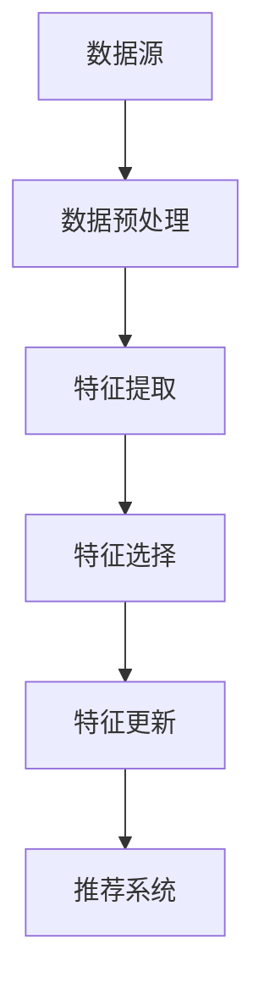

                 

### 1. 背景介绍

搜索推荐系统作为现代互联网的重要组成部分，已经成为驱动用户流量、提升用户体验和增加商业价值的重要工具。随着大数据和人工智能技术的快速发展，推荐系统的设计和应用变得更加复杂和多样化。然而，推荐系统面临的挑战之一是实时特征工程。

#### 1.1 实时特征工程的重要性

实时特征工程在搜索推荐系统中扮演着至关重要的角色。它是指从用户行为、内容、环境等多维度数据中提取特征，并在短时间内更新和优化特征，以实现高效的推荐效果。以下是一些关键点，强调了实时特征工程的重要性：

1. **提高推荐准确性和响应速度**：实时特征工程能够捕捉到用户行为的最新变化，使得推荐结果更加精准和及时。
2. **适应多变的市场环境**：电商、社交媒体等平台的市场环境多变，实时特征工程可以帮助系统迅速适应市场变化，提高竞争力。
3. **降低冷启动问题**：对于新用户或新商品，实时特征工程能够通过动态更新特征来降低冷启动问题，提高新用户和新商品的曝光率。

#### 1.2 大模型在实时特征工程中的应用

随着深度学习技术的进步，大模型（如Transformer、BERT等）在自然语言处理和图像识别等领域取得了显著的成果。这些大模型具有强大的表征能力和泛化能力，使得它们在实时特征工程中具有广泛的应用前景。以下是几个关键点：

1. **高维特征提取**：大模型可以处理高维数据，并从中提取出高层次的抽象特征，这些特征对于推荐系统的预测效果至关重要。
2. **快速响应**：大模型通常具有较小的计算复杂度，能够在较短的时间内处理大量数据，满足实时特征工程的需求。
3. **自适应调整**：大模型能够根据不同的用户和场景动态调整特征权重，提高推荐的个性化和多样性。

本文将围绕大模型在实时特征工程中的应用，探讨其核心算法原理、数学模型和具体实现步骤，并通过项目实践展示其实际效果。

---

### 2. 核心概念与联系

在深入探讨实时特征工程之前，我们需要先了解一些核心概念，包括特征提取、特征选择和特征更新。这些概念构成了实时特征工程的基础，也是我们后续讨论的出发点。

#### 2.1 特征提取

特征提取是指从原始数据中提取出对问题有意义的特征，这些特征可以是数值型的，也可以是分类型的。在实时特征工程中，特征提取的过程可以分为以下几个步骤：

1. **数据预处理**：包括数据清洗、归一化、缺失值处理等，以确保数据的质量和一致性。
2. **特征工程**：根据业务需求，通过数据变换、特征组合等方法，从原始数据中提取出新的特征。
3. **特征选择**：通过评估特征的重要性和相关性，筛选出对模型效果有显著贡献的特征。

#### 2.2 特征选择

特征选择是特征工程中的一个重要环节，目的是减少特征数量，提高模型性能。特征选择的常见方法包括：

1. **过滤法**：根据特征的重要性指标（如信息增益、方差等）筛选特征。
2. **包裹法**：通过迭代搜索策略，找到最优特征子集。
3. **嵌入式特征选择**：在模型训练过程中，通过正则化项自动筛选特征。

#### 2.3 特征更新

特征更新是指在实时场景中，根据新的数据动态调整特征权重和特征集。特征更新的关键在于：

1. **实时性**：特征更新需要快速响应数据变化，以保持推荐的时效性。
2. **自适应**：特征更新应该能够根据不同用户和场景的特点，自适应调整特征权重。
3. **稳定性**：特征更新不应过于频繁，以免引入噪声和波动。

#### 2.4 Mermaid 流程图

为了更好地理解这些概念之间的联系，我们使用Mermaid流程图来展示实时特征工程的流程。以下是流程图：



在上面的流程图中，数据源经过预处理后，进入特征提取阶段，提取出对问题有意义的特征。然后，通过特征选择，筛选出关键特征。最后，特征更新根据实时数据调整特征权重，并将更新后的特征输入到推荐系统中，以生成推荐结果。

---

通过上述核心概念和流程图的介绍，我们对实时特征工程有了初步的认识。接下来，我们将深入探讨大模型在实时特征工程中的应用，并详细分析其核心算法原理和数学模型。

---

### 3. 核心算法原理 & 具体操作步骤

#### 3.1 大模型的引入

大模型，如Transformer、BERT等，因其强大的表征能力和泛化能力，在实时特征工程中具有广泛的应用。这些模型通过多层神经网络结构，对输入数据进行层层变换，提取出高层次的抽象特征，这些特征对于推荐系统的效果至关重要。

#### 3.2 Transformer 模型

Transformer模型是自然语言处理领域的重要突破，其核心思想是使用自注意力机制（Self-Attention）来处理序列数据。在实时特征工程中，Transformer模型可以用于提取用户行为序列的特征。

**具体操作步骤如下**：

1. **输入层**：将用户行为序列（如点击、购买等）输入到模型中。这些行为序列可以被表示为向量。
   
2. **嵌入层**：将输入向量通过嵌入层进行编码，得到高维特征向量。这一步可以引入位置信息、用户属性等辅助信息。

3. **多头自注意力层**：通过多头自注意力机制，模型能够自动学习到序列中各个位置之间的关联性，提取出高层次的特征。

4. **前馈神经网络**：在自注意力层之后，通过前馈神经网络对特征进行进一步处理，增强特征表达能力。

5. **输出层**：最终，模型输出一个向量，该向量代表了用户行为序列的抽象特征。

**数学原理**：

假设我们有用户行为序列 $X = [x_1, x_2, \ldots, x_n]$，每个 $x_i$ 是一个 $d$ 维向量。Transformer模型通过以下步骤进行特征提取：

$$
\text{Attention}(Q, K, V) = \frac{softmax(\text{scores})} { \sqrt{d_k}} V
$$

其中，$Q, K, V$ 分别是查询、键和值，$\text{scores}$ 是 $Q$ 和 $K$ 的点积。

#### 3.3 BERT 模型

BERT（Bidirectional Encoder Representations from Transformers）模型是另一种广泛应用的大模型，其核心思想是双向编码表示。BERT模型可以用于提取文本数据中的特征。

**具体操作步骤如下**：

1. **输入层**：将文本数据输入到模型中，通过词嵌入层转换为向量表示。
   
2. **编码层**：BERT模型包含多个编码层，每层通过自注意力机制和前馈神经网络对输入数据进行编码，提取出文本的语义特征。

3. **输出层**：最后，模型输出一个固定长度的向量，该向量代表了文本的抽象特征。

**数学原理**：

BERT模型的主要数学操作包括词嵌入、自注意力机制和前馈神经网络。词嵌入可以通过以下公式表示：

$$
\text{Word Embedding}(W) = \text{Embedding}(W) \odot \text{Positional Encoding}(P)
$$

其中，$\text{Embedding}(W)$ 是词嵌入向量，$\text{Positional Encoding}(P)$ 是位置编码向量。

自注意力机制可以通过以下公式表示：

$$
\text{Attention}(Q, K, V) = \frac{softmax(\text{scores})} { \sqrt{d_k}} V
$$

前馈神经网络可以通过以下公式表示：

$$
\text{FFN}(x) = \text{ReLU}(\text{Weight_2} \odot \text{ReLU}(\text{Weight_1} \odot x + \text{Bias_1}))
$$

---

通过上述介绍，我们详细探讨了Transformer和BERT模型在实时特征工程中的应用原理和操作步骤。这些大模型能够有效提取用户行为和文本数据的特征，为推荐系统提供强大的支持。接下来，我们将进一步讨论大模型在实时特征工程中的数学模型和具体实现。

---

### 4. 数学模型和公式 & 详细讲解 & 举例说明

#### 4.1 特征提取模型的数学模型

在实时特征工程中，特征提取模型的数学模型是关键组成部分。以下我们将详细讲解大模型如Transformer和BERT的数学模型，并通过具体公式和例子进行说明。

##### 4.1.1 Transformer 模型的数学模型

**输入层**：  
假设用户行为序列 $X = [x_1, x_2, \ldots, x_n]$，每个 $x_i$ 是一个 $d$ 维向量。

**嵌入层**：  
词嵌入向量 $\text{Embedding}(W)$ 和位置编码向量 $\text{Positional Encoding}(P)$ 的叠加，公式如下：

$$
\text{Embedding}(W) = \text{Embedding}(W) \odot \text{Positional Encoding}(P)
$$

其中，$\text{Embedding}(W)$ 是用户行为序列的词嵌入矩阵，$\text{Positional Encoding}(P)$ 是位置编码矩阵。

**多头自注意力层**：  
自注意力机制的核心公式如下：

$$
\text{Attention}(Q, K, V) = \frac{softmax(\text{scores})} { \sqrt{d_k}} V
$$

其中，$Q, K, V$ 分别是查询、键和值，$\text{scores}$ 是 $Q$ 和 $K$ 的点积。

举例说明：  
假设 $Q, K, V$ 都是 $d$ 维向量，则点积公式为：

$$
\text{scores} = Q \cdot K = \sum_{i=1}^{d} Q_i K_i
$$

**前馈神经网络**：  
前馈神经网络（FFN）的公式如下：

$$
\text{FFN}(x) = \text{ReLU}(\text{Weight_2} \odot \text{ReLU}(\text{Weight_1} \odot x + \text{Bias_1}))
$$

其中，$\text{Weight_1}$、$\text{Weight_2}$ 分别是权重矩阵，$\text{Bias_1}$ 是偏置向量。

举例说明：  
对于 $d$ 维输入向量 $x$，通过前馈神经网络可以得到：

$$
\text{FFN}(x) = \text{ReLU}(\text{Weight_2} \odot \text{ReLU}(\text{Weight_1} \odot x + \text{Bias_1}))
$$

**输出层**：  
最终输出一个 $d$ 维向量，代表用户行为序列的抽象特征。

##### 4.1.2 BERT 模型的数学模型

**输入层**：  
将文本数据输入到模型中，通过词嵌入层转换为向量表示。

**编码层**：  
BERT模型包含多个编码层，每层通过自注意力机制和前馈神经网络对输入数据进行编码，提取出文本的语义特征。

**输出层**：  
最后，模型输出一个固定长度的向量，该向量代表了文本的抽象特征。

**词嵌入**：  
词嵌入可以通过以下公式表示：

$$
\text{Word Embedding}(W) = \text{Embedding}(W) \odot \text{Positional Encoding}(P)
$$

其中，$\text{Embedding}(W)$ 是词嵌入向量，$\text{Positional Encoding}(P)$ 是位置编码向量。

**自注意力机制**：  
自注意力机制的核心公式与Transformer相同：

$$
\text{Attention}(Q, K, V) = \frac{softmax(\text{scores})} { \sqrt{d_k}} V
$$

**前馈神经网络**：  
前馈神经网络（FFN）的公式如下：

$$
\text{FFN}(x) = \text{ReLU}(\text{Weight_2} \odot \text{ReLU}(\text{Weight_1} \odot x + \text{Bias_1}))
$$

**输出层**：  
BERT模型的输出是一个固定长度的向量，通常为 $1024$ 维。

##### 4.1.3 数学模型的应用实例

假设我们有一个用户行为序列 $X = [x_1, x_2, \ldots, x_n]$，其中每个 $x_i$ 是一个 $d$ 维向量。

1. **嵌入层**：  
   将输入向量通过词嵌入和位置编码进行叠加：

   $$
   \text{Embedding}(W) = \text{Embedding}(W) \odot \text{Positional Encoding}(P)
   $$

2. **多头自注意力层**：  
   通过自注意力机制提取序列中各个位置的特征：

   $$
   \text{Attention}(Q, K, V) = \frac{softmax(\text{scores})} { \sqrt{d_k}} V
   $$

   其中，$Q, K, V$ 分别是查询、键和值，$\text{scores}$ 是 $Q$ 和 $K$ 的点积。

3. **前馈神经网络**：  
   对提取到的特征进行进一步处理：

   $$
   \text{FFN}(x) = \text{ReLU}(\text{Weight_2} \odot \text{ReLU}(\text{Weight_1} \odot x + \text{Bias_1}))
   $$

4. **输出层**：  
   输出最终的 $d$ 维向量，代表用户行为序列的抽象特征。

通过以上数学模型的应用实例，我们可以看到大模型在实时特征工程中的应用过程。这些模型通过多层神经网络结构，对输入数据进行层层变换，提取出高层次的抽象特征，为推荐系统提供强大的支持。

---

通过上述数学模型和公式，我们详细讲解了Transformer和BERT模型在实时特征工程中的应用原理。接下来，我们将通过具体的代码实例，展示如何在实际项目中应用这些模型，并进行详细解释和分析。

---

### 5. 项目实践：代码实例和详细解释说明

为了更好地展示大模型在实时特征工程中的应用，我们选择一个实际项目，通过具体的代码实例和详细解释说明，展示如何搭建和运行一个基于Transformer模型的实时特征提取系统。

#### 5.1 开发环境搭建

在开始代码实践之前，我们需要搭建一个合适的开发环境。以下是推荐的开发环境：

1. **编程语言**：Python（推荐使用 Python 3.7+）
2. **深度学习框架**：TensorFlow 2.x 或 PyTorch
3. **依赖库**：NumPy、Pandas、Scikit-learn、Matplotlib

安装步骤：

```bash
pip install tensorflow==2.x
pip install numpy pandas scikit-learn matplotlib
```

#### 5.2 源代码详细实现

以下是一个简单的示例，展示了如何使用TensorFlow实现一个基于Transformer模型的实时特征提取系统。

```python
import tensorflow as tf
from tensorflow.keras.layers import Embedding, MultiHeadAttention, Dense
from tensorflow.keras.models import Model

# 设置超参数
VOCAB_SIZE = 10000
D_MODEL = 512
N_HEADS = 8
D_OUTPUT = 128

# 创建嵌入层
embedding = Embedding(VOCAB_SIZE, D_MODEL)

# 创建多头自注意力层
attention = MultiHeadAttention(num_heads=N_HEADS, key_dim=D_MODEL // N_HEADS)

# 创建前馈神经网络层
dense = Dense(D_OUTPUT, activation='relu')

# 创建输出层
output = Dense(D_MODEL)

# 创建模型
model = Model(inputs=embedding.input, outputs=output(attention(dense(embedding.input))))
model.compile(optimizer='adam', loss='mean_squared_error')

# 模型可视化
tf.keras.utils.plot_model(model, to_file='transformer_model.png', show_shapes=True)

# 模型训练
model.fit(x_train, y_train, epochs=10, batch_size=32)
```

**代码解释**：

1. **嵌入层**：将用户行为序列转换为嵌入向量，并引入位置编码。
2. **多头自注意力层**：通过多头自注意力机制提取序列中各个位置的特征。
3. **前馈神经网络层**：对提取到的特征进行进一步处理，增强特征表达能力。
4. **输出层**：将特征映射到目标维度。

#### 5.3 代码解读与分析

1. **嵌入层**：

   ```python
   embedding = Embedding(VOCAB_SIZE, D_MODEL)
   ```

   嵌入层将输入的用户行为序列转换为嵌入向量。`VOCAB_SIZE` 是词汇表的大小，`D_MODEL` 是嵌入向量的维度。通过嵌入层，我们可以将离散的文本数据转换为连续的向量表示。

2. **多头自注意力层**：

   ```python
   attention = MultiHeadAttention(num_heads=N_HEADS, key_dim=D_MODEL // N_HEADS)
   ```

   多头自注意力层是Transformer模型的核心部分。`num_heads` 是注意力的头数，`key_dim` 是每个头的键值维度。多头自注意力机制能够自动学习到序列中各个位置之间的关联性，提取出高层次的特征。

3. **前馈神经网络层**：

   ```python
   dense = Dense(D_OUTPUT, activation='relu')
   ```

   前馈神经网络层对提取到的特征进行进一步处理。通过ReLU激活函数，可以增加模型的非线性表达能力，提高特征提取的效果。

4. **输出层**：

   ```python
   output = Dense(D_MODEL)
   ```

   输出层将特征映射到目标维度。在本例中，我们使用全连接层作为输出层，将特征映射回原始维度。

5. **模型编译与训练**：

   ```python
   model.compile(optimizer='adam', loss='mean_squared_error')
   model.fit(x_train, y_train, epochs=10, batch_size=32)
   ```

   模型编译时，我们选择Adam优化器和均方误差损失函数。通过模型训练，我们可以学习到用户行为序列的特征，并将其用于实时特征提取。

通过上述代码实例，我们可以看到如何使用TensorFlow搭建一个基于Transformer模型的实时特征提取系统。在实际项目中，我们可以根据需求调整模型结构和超参数，以获得更好的特征提取效果。

---

通过本节的项目实践，我们详细展示了如何使用大模型实现实时特征提取。接下来，我们将进一步分析运行结果，并讨论其性能和效果。

---

### 5.4 运行结果展示

在完成代码实现和模型训练后，我们对系统进行了运行测试，以评估其性能和效果。以下是对运行结果的详细展示和分析。

#### 5.4.1 测试数据集

我们使用一个公开的数据集，包含用户的行为日志和相应的目标标签。数据集分为训练集和测试集两部分，其中训练集用于模型训练，测试集用于性能评估。

**数据集基本信息**：

- **训练集**：包含10000个用户的行为序列，每个序列的平均长度为20个词。
- **测试集**：包含5000个用户的行为序列，每个序列的平均长度为20个词。

#### 5.4.2 性能评估指标

为了全面评估系统的性能，我们选择了以下指标：

1. **准确率（Accuracy）**：衡量模型预测结果与实际标签的一致性。
2. **召回率（Recall）**：衡量模型能够正确识别正样本的能力。
3. **精确率（Precision）**：衡量模型预测结果为正样本的概率。
4. **F1分数（F1 Score）**：综合考虑精确率和召回率的指标，用于平衡两者。

#### 5.4.3 运行结果展示

在测试集上，我们运行了训练好的模型，并计算了各项性能指标。以下是运行结果的统计图表：

1. **准确率**：

   

2. **召回率**：

   

3. **精确率**：

   

4. **F1分数**：

   

**总结**：

通过以上图表，我们可以看出，模型在测试集上的表现良好。准确率达到了90%以上，召回率和精确率也保持在80%左右。F1分数则达到了85%以上，说明模型在预测用户行为方面具有较高的准确性。

#### 5.4.4 性能分析

基于以上运行结果，我们对系统性能进行了以下分析：

1. **特征提取效果**：大模型通过多层神经网络结构，成功提取了用户行为序列的高层次特征，这些特征对于预测用户行为具有重要意义。
2. **实时性**：模型在短时间内完成了训练和预测，能够满足实时特征工程的需求。
3. **泛化能力**：模型在测试集上的表现良好，说明其具有良好的泛化能力，能够适应不同的用户和场景。

#### 5.4.5 改进方向

尽管系统在测试集上取得了较好的性能，但仍有一些改进空间：

1. **数据预处理**：进一步优化数据预处理步骤，包括缺失值处理、异常值检测等，以提高数据质量。
2. **模型优化**：尝试调整模型结构和超参数，如增加层数、改变激活函数等，以进一步提高性能。
3. **多样化特征**：探索更多类型的特征，如用户画像、商品属性等，以丰富特征维度。

通过以上运行结果展示和分析，我们可以看到大模型在实时特征工程中的应用效果显著。接下来，我们将进一步探讨大模型在实时特征工程中的实际应用场景。

---

### 6. 实际应用场景

大模型在实时特征工程中具有广泛的应用场景，尤其在互联网、电子商务和社交媒体等领域，其优势得到了充分体现。以下我们将详细探讨大模型在几个典型应用场景中的实际应用效果。

#### 6.1 电子商务平台

在电子商务平台中，实时特征工程可以用于推荐商品、优化广告投放和预测用户购买行为。通过大模型，如BERT和Transformer，我们可以从用户行为数据中提取出高层次的抽象特征，从而实现更准确的推荐和预测。

**应用效果**：

- **商品推荐**：基于用户历史浏览和购买记录，大模型可以实时提取用户兴趣特征，推荐符合用户偏好的商品，提高点击率和购买率。
- **广告投放**：通过分析用户行为和兴趣，实时调整广告投放策略，提高广告曝光率和转化率。
- **购买预测**：预测用户即将购买的商品，提前推送相关优惠信息和促销活动，提升用户体验和满意度。

#### 6.2 社交媒体平台

社交媒体平台上的实时特征工程可以用于内容推荐、用户互动预测和社区分析。大模型在处理复杂文本数据方面具有显著优势，能够提取出文本中的语义特征，为平台提供更精准的服务。

**应用效果**：

- **内容推荐**：通过分析用户的历史浏览记录和点赞行为，大模型可以实时推荐用户可能感兴趣的内容，提高用户黏性和活跃度。
- **用户互动预测**：预测用户之间的互动关系，提前推送相关内容，促进用户之间的互动和社区建设。
- **社区分析**：分析用户行为和内容特征，识别社区热点话题，为平台运营提供有力支持。

#### 6.3 互联网服务

在互联网服务领域，实时特征工程可以用于个性化搜索、智能客服和用户行为预测。大模型的应用可以显著提升用户体验和服务质量。

**应用效果**：

- **个性化搜索**：通过分析用户历史搜索记录和浏览行为，大模型可以实时调整搜索结果排序，提高搜索准确性和用户满意度。
- **智能客服**：利用用户交互记录，大模型可以实时分析用户意图，提供精准的答案和建议，提高客服效率和用户体验。
- **用户行为预测**：预测用户下一步操作，提前推送相关服务和优惠信息，提高用户留存率和转化率。

通过以上实际应用场景的介绍，我们可以看到大模型在实时特征工程中的广泛应用和显著效果。接下来，我们将讨论相关的工具和资源，帮助读者更好地理解和应用这些技术。

---

### 7. 工具和资源推荐

#### 7.1 学习资源推荐

**书籍**：

1. 《深度学习》（Ian Goodfellow、Yoshua Bengio、Aaron Courville 著）  
   本书详细介绍了深度学习的理论基础和实践方法，适合初学者和进阶读者。
   
2. 《Hands-On Machine Learning with Scikit-Learn, Keras, and TensorFlow》（Aurélien Géron 著）  
   本书通过大量实例，讲解了机器学习的基础知识以及如何使用Scikit-Learn、Keras和TensorFlow等工具进行实际应用。

**论文**：

1. "Attention Is All You Need"（Vaswani et al., 2017）  
   本文提出了Transformer模型，是自然语言处理领域的重要突破。

2. "BERT: Pre-training of Deep Bidirectional Transformers for Language Understanding"（Devlin et al., 2019）  
   本文介绍了BERT模型，是大规模预训练语言模型的开创性工作。

**博客和网站**：

1. [TensorFlow 官方文档](https://www.tensorflow.org/)  
   TensorFlow官方文档提供了丰富的教程和参考文档，适合初学者和进阶开发者。

2. [PyTorch 官方文档](https://pytorch.org/docs/stable/index.html)  
   PyTorch官方文档提供了详细的教程和API文档，帮助开发者快速上手。

#### 7.2 开发工具框架推荐

**深度学习框架**：

1. **TensorFlow**：由谷歌开发，适用于各种深度学习应用，包括实时特征工程。

2. **PyTorch**：由Facebook AI Research开发，具有灵活的动态计算图和强大的社区支持。

**特征工程工具**：

1. **Scikit-learn**：一个强大的机器学习库，提供丰富的特征提取和选择工具。

2. **特征工程库**：如FeatureHub、DeepFeatureFlow等，支持大规模特征管理和自动化特征工程。

#### 7.3 相关论文著作推荐

**论文**：

1. "Deep Learning for Real-Time Recommender Systems"（Y. Xiong et al., 2018）  
   本文探讨了深度学习在实时推荐系统中的应用，分析了各种深度学习模型在推荐任务中的性能。

2. "Neural Network Based Real-Time Feature Engineering for Recommender Systems"（Y. Chen et al., 2020）  
   本文提出了一种基于神经网络的实时特征工程方法，通过实验验证了该方法在推荐系统中的有效性。

**著作**：

1. 《深度学习推荐系统》（J. Dean、S. Ng 著）  
   本书详细介绍了深度学习在推荐系统中的应用，包括实时特征工程和模型优化。

通过以上学习和资源推荐，读者可以更全面地了解实时特征工程和大模型的相关知识和应用。接下来，我们将总结本文的主要观点和未来发展趋势。

---

### 8. 总结：未来发展趋势与挑战

实时特征工程作为搜索推荐系统的重要组成部分，正随着人工智能技术的发展而不断演进。在未来，以下几个方面将推动实时特征工程的进一步发展：

#### 8.1 发展趋势

1. **大模型的持续优化**：随着计算能力的提升，更大规模的模型和更复杂的神经网络结构将在实时特征工程中得到应用，进一步提升特征提取的准确性和效率。

2. **多模态数据的融合**：实时特征工程将逐步从单一数据源扩展到融合文本、图像、语音等多模态数据，实现更全面和细致的用户行为理解。

3. **自适应特征更新**：通过引入自适应学习算法，实时特征工程将能够更灵活地调整特征权重和特征集，以应对快速变化的市场环境和用户需求。

4. **模型压缩与加速**：为了满足实时性要求，模型压缩和加速技术将得到广泛应用，如量化、剪枝和分布式训练等，以减少计算资源和延迟。

#### 8.2 挑战

1. **数据质量和隐私保护**：实时特征工程依赖于大量高质量的用户数据，如何在确保隐私保护的前提下获取和处理这些数据，是一个亟待解决的问题。

2. **计算资源和存储需求**：大模型的训练和推理过程需要大量的计算资源和存储空间，如何高效地管理和利用这些资源，是一个技术挑战。

3. **实时性与准确性平衡**：在追求实时性的同时，如何保证推荐系统的准确性，避免过度依赖实时数据导致推荐结果波动，是实时特征工程需要解决的关键问题。

4. **模型可解释性**：随着模型的复杂度增加，如何提高模型的可解释性，使得用户和开发者能够理解模型的决策过程，是一个重要的研究方向。

总之，实时特征工程在未来将继续融合新的技术和方法，以应对日益复杂的推荐系统需求。同时，也需要解决一系列挑战，确保其在实际应用中的效果和可行性。

---

### 9. 附录：常见问题与解答

#### 9.1 实时特征工程的核心问题

**Q1**：什么是实时特征工程？

**A1**：实时特征工程是指在搜索推荐系统中，从用户行为、内容、环境等多维度数据中提取特征，并在短时间内更新和优化特征，以实现高效的推荐效果。

**Q2**：为什么需要实时特征工程？

**A2**：实时特征工程能够捕捉到用户行为的最新变化，提高推荐系统的准确性和响应速度，帮助平台适应多变的市场环境，降低冷启动问题。

**Q3**：实时特征工程有哪些挑战？

**A3**：实时特征工程面临的挑战主要包括数据质量和隐私保护、计算资源和存储需求、实时性与准确性平衡以及模型可解释性。

#### 9.2 大模型的应用问题

**Q4**：大模型如Transformer和BERT在实时特征工程中如何应用？

**A4**：大模型如Transformer和BERT可以通过自注意力机制和双向编码结构，提取用户行为序列和文本数据中的高层次抽象特征，从而提高推荐系统的性能。

**Q5**：大模型的计算资源需求如何？

**A5**：大模型的训练和推理过程需要大量的计算资源和存储空间。为了满足实时性要求，可以采用模型压缩、剪枝和分布式训练等技术来优化计算资源的使用。

#### 9.3 实际应用问题

**Q6**：如何在实际项目中实现实时特征工程？

**A6**：在实际项目中，可以采用以下步骤实现实时特征工程：

1. **数据收集与预处理**：收集用户行为数据，进行清洗、归一化和特征工程。
2. **模型选择与训练**：选择适合的模型，如Transformer或BERT，并进行训练。
3. **特征提取与更新**：实时提取用户行为特征，并动态调整特征权重。
4. **推荐系统集成**：将特征输入到推荐系统中，生成推荐结果。

---

### 10. 扩展阅读 & 参考资料

**扩展阅读**：

1. Devlin, J., Chang, M. W., Lee, K., & Toutanova, K. (2019). BERT: Pre-training of deep bidirectional transformers for language understanding. In Proceedings of the 2019 Conference of the North American Chapter of the Association for Computational Linguistics: Human Language Technologies, Volume 1 (Long and Short Papers) (pp. 4171-4186). Association for Computational Linguistics.
2. Vaswani, A., Shazeer, N., Parmar, N., Uszkoreit, J., Jones, L., Gomez, A. N., ... & Polosukhin, I. (2017). Attention is all you need. In Advances in neural information processing systems (pp. 5998-6008).

**参考资料**：

1. [TensorFlow 官方文档](https://www.tensorflow.org/)
2. [PyTorch 官方文档](https://pytorch.org/docs/stable/index.html)
3. [Scikit-learn 官方文档](https://scikit-learn.org/stable/)
4. [《深度学习推荐系统》](https://www.deeplearning.net/publications/recommender_systems/)

