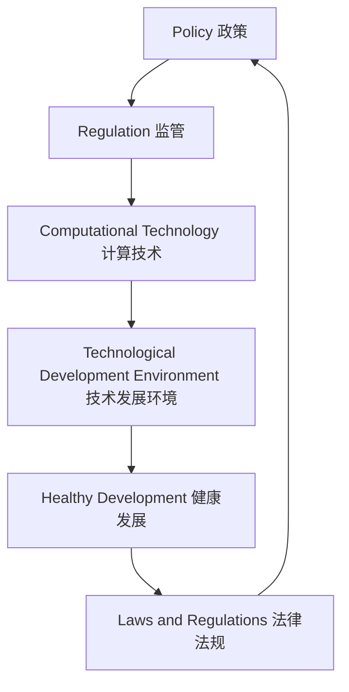
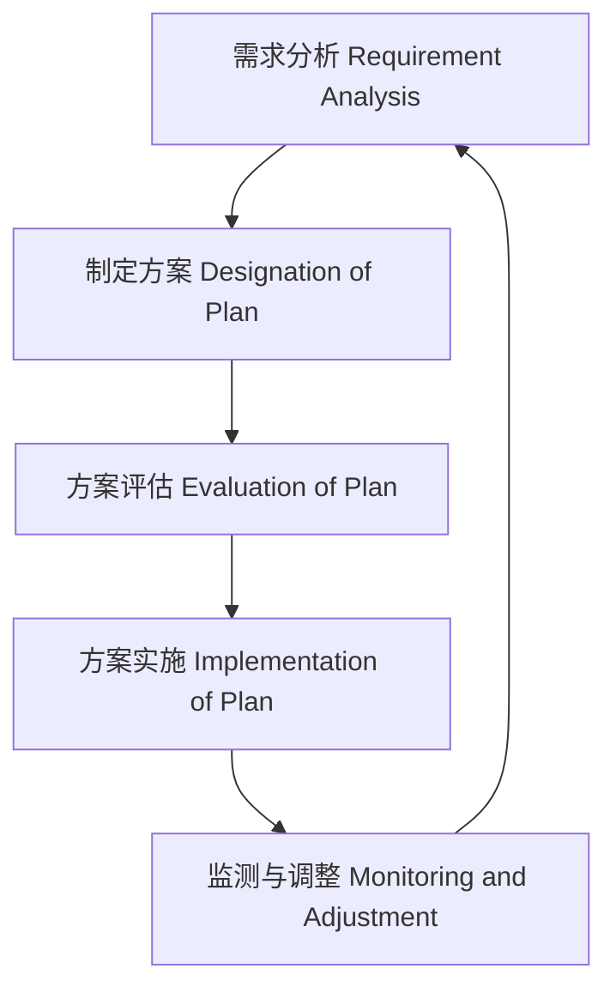

                 

### 背景介绍 Background Introduction

随着全球数字化进程的不断加速，人工智能、大数据、云计算等新兴技术的蓬勃发展，计算技术正在以前所未有的速度改变着我们的生活和生产方式。计算技术的进步不仅带来了社会生产力的极大提升，也催生了众多新兴产业和商业模式。然而，与此同时，计算技术的发展也带来了新的挑战，尤其是在政策与监管层面。

政策与监管对于计算技术的发展具有重要意义。一方面，合理的政策和监管机制可以为计算技术提供良好的发展环境，促进技术创新和产业升级。另一方面，不恰当的政策和监管可能对计算技术发展产生负面影响，甚至阻碍其健康发展。因此，如何制定科学合理的政策和监管框架，引导计算技术的健康发展，成为了一个亟需解决的问题。

在本文中，我们将从以下几个方面展开讨论：

1. **政策与监管的核心概念与联系**：我们将首先介绍政策与监管的相关核心概念，并分析它们之间的联系。
2. **核心算法原理与具体操作步骤**：接着，我们将探讨政策与监管的核心算法原理，并详细解释其具体操作步骤。
3. **数学模型和公式**：为了更好地理解政策与监管的算法原理，我们将介绍相关的数学模型和公式，并进行详细讲解和举例说明。
4. **项目实践**：通过具体的代码实例和详细解释，我们将展示如何在实际项目中应用政策与监管技术。
5. **实际应用场景**：我们将探讨政策与监管技术在各种实际应用场景中的具体应用。
6. **工具和资源推荐**：为了帮助读者更好地学习和掌握政策与监管技术，我们将推荐相关的学习资源、开发工具框架和相关论文著作。
7. **总结与未来趋势**：最后，我们将总结本文的主要内容，并探讨计算技术在未来发展趋势中可能面临的挑战和应对策略。

通过以上内容的逐步分析，我们希望能够为读者提供一个全面、深入的关于政策与监管引导计算技术健康发展的理解。

### 2. 核心概念与联系 Core Concepts and Connections

在深入探讨政策与监管对计算技术的影响之前，我们需要首先明确几个核心概念：政策、监管、计算技术、技术发展环境、健康发展和法律法规。

#### 政策 Policy

政策是国家或组织为了实现特定目标而制定的行为准则或行动指南。在计算技术领域，政策通常涉及技术发展路线、资源分配、市场准入、数据管理等多个方面。例如，国家可能通过制定扶持政策，鼓励企业加大在人工智能、大数据等方面的研发投入，从而推动技术进步。

#### 监管 Regulation

监管则是通过法律、法规、规章制度等手段，对某一领域的行为进行规范和监督。在计算技术领域，监管主要涉及数据安全、隐私保护、网络安全等方面。监管的目的是确保技术发展不损害公共利益，同时促进市场公平竞争。

#### 计算技术 Computational Technology

计算技术是指用于处理、存储、传输数据的各种技术和工具，包括但不限于人工智能、大数据、云计算、物联网等。这些技术的发展不仅推动了社会生产力的提升，也引发了诸如数据隐私、网络安全等新的挑战。

#### 技术发展环境 Technological Development Environment

技术发展环境是指影响技术发展的各种外部条件，包括政策环境、市场环境、法律环境等。一个良好的技术发展环境能够促进技术的创新和应用，而不良环境则可能抑制技术的发展。

#### 健康发展 Healthy Development

健康发展是指技术发展过程中，既能够实现技术进步，又能够保护公共利益，确保社会的可持续发展。在计算技术领域，健康发展意味着技术发展不仅要追求经济效益，还要关注社会效益，例如数据隐私保护和网络安全。

#### 法律法规 Laws and Regulations

法律法规是国家通过立法程序制定的行为规范，具有强制性和普遍约束力。在计算技术领域，法律法规是保障技术健康发展的重要手段，例如《中华人民共和国网络安全法》、《中华人民共和国数据安全法》等。

#### 核心概念之间的联系 Connections between Core Concepts

政策、监管、计算技术、技术发展环境、健康发展和法律法规这六个核心概念之间存在着密切的联系。

首先，政策是引导技术发展的方向和目标，监管则是确保技术发展过程中不偏离这些目标和方向。政策与监管之间相辅相成，共同构成了技术发展的保障机制。

其次，计算技术是政策与监管的对象，也是实现技术发展的手段。技术的发展不仅受到政策与监管的制约，同时也反过来影响政策与监管的制定和调整。

再次，技术发展环境是政策与监管作用的场所，也是一个动态变化的过程。一个良好的技术发展环境能够促进政策与监管的有效实施，而不良环境则可能削弱政策与监管的效果。

最后，健康发展和法律法规是技术发展的目标和保障。健康发展要求技术发展不仅要追求经济效益，还要关注社会效益，而法律法规则为技术发展提供了法律框架和规范。

通过上述分析，我们可以看出，政策与监管对计算技术的健康发展具有至关重要的影响。一个科学合理的政策和监管框架，不仅能够促进技术进步，还能够保障社会的公共利益，确保技术的可持续发展。

#### Mermaid 流程图 Mermaid Flowchart

以下是一个简化的 Mermaid 流程图，展示了政策、监管、计算技术、技术发展环境、健康发展和法律法规之间的基本联系：



这个流程图虽然简化，但清晰地展示了各个概念之间的逻辑关系，为进一步的讨论奠定了基础。

### 3. 核心算法原理与具体操作步骤 Core Algorithm Principles and Step-by-Step Operations

在明确了政策与监管的相关核心概念后，我们需要进一步探讨其核心算法原理和具体操作步骤。政策与监管算法的设计和实施需要综合考虑技术发展、社会需求、法律法规等多个因素。以下是一个简化的政策与监管算法框架，包括其主要步骤和关键操作：

#### 算法框架 Algorithm Framework

1. **需求分析 Requirement Analysis**：分析计算技术发展中的关键问题，确定政策与监管的目标和需求。
2. **制定方案 Designation of Plan**：根据需求分析结果，制定具体的政策与监管方案。
3. **方案评估 Evaluation of Plan**：对制定的政策与监管方案进行评估，确保其合理性和有效性。
4. **方案实施 Implementation of Plan**：将评估后的方案付诸实施，通过立法、行政命令等方式进行推广。
5. **监测与调整 Monitoring and Adjustment**：对政策与监管实施过程中的效果进行监测，并根据实际情况进行必要的调整。

#### 具体操作步骤 Detailed Operational Steps

1. **需求分析 Requirement Analysis**

   - **问题识别 Problem Identification**：识别计算技术发展过程中存在的问题，如数据隐私、网络安全、市场垄断等。
   - **需求收集 Demand Collection**：收集社会各方面的需求，包括政府、企业、公众等，确保政策与监管方案能够满足不同利益相关者的需求。
   - **目标确定 Goal Definition**：明确政策与监管的目标，如提升数据安全、促进技术创新、保障市场公平竞争等。

2. **制定方案 Designation of Plan**

   - **方案设计 Plan Design**：根据需求分析结果，设计具体的政策与监管方案。方案应包括政策目标、监管措施、实施步骤、预期效果等。
   - **方案审核 Plan Review**：对方案进行内部和外部审核，确保方案的合理性和可行性。

3. **方案评估 Evaluation of Plan**

   - **效果评估 Effect Evaluation**：对政策与监管方案实施后的效果进行评估，包括技术进步、经济效益、社会影响等。
   - **成本效益分析 Cost-Benefit Analysis**：对方案的实施成本和效益进行评估，确保其经济可行性。

4. **方案实施 Implementation of Plan**

   - **立法执行 Law Enforcement**：通过立法程序将政策与监管方案转化为具体的法律、法规和规章制度。
   - **行政执行 Administrative Execution**：通过行政命令和行政手段，推动政策与监管方案的实施。

5. **监测与调整 Monitoring and Adjustment**

   - **效果监测 Effect Monitoring**：对政策与监管实施过程中的效果进行持续监测，及时发现问题和不足。
   - **调整优化 Adjustment and Optimization**：根据监测结果，对政策与监管方案进行调整和优化，确保其持续有效。

通过上述步骤，政策与监管算法能够确保计算技术的健康发展，同时保护公共利益。以下是一个简化的 Mermaid 流程图，展示了政策与监管算法的主要步骤：



这个流程图提供了政策与监管算法的基本框架，为进一步的讨论和实践提供了指导。

### 4. 数学模型和公式 Mathematical Models and Formulas

在政策与监管算法的设计和实施过程中，数学模型和公式起到了关键作用。以下我们将介绍几个常用的数学模型和公式，详细讲解其含义和计算方法，并通过具体示例进行说明。

#### 概率模型 Probability Model

概率模型用于描述计算技术发展过程中各种不确定性事件的发生概率。常见的概率模型包括贝叶斯网络、马尔可夫模型等。

1. **贝叶斯网络 Bayesian Network**

   贝叶斯网络是一种图形模型，用于表示变量之间的条件依赖关系。其基本公式为：

   $$
   P(A|B) = \frac{P(B|A) \cdot P(A)}{P(B)}
   $$

   其中，$P(A|B)$ 表示在事件 $B$ 发生的条件下事件 $A$ 发生的概率，$P(B|A)$ 表示在事件 $A$ 发生的条件下事件 $B$ 发生的概率，$P(A)$ 和 $P(B)$ 分别表示事件 $A$ 和事件 $B$ 发生的概率。

   **示例：** 假设某个计算技术项目的成功概率为 0.8，如果项目成功，则市场反应良好的概率为 0.9。要求计算市场反应良好的条件下项目成功的概率。

   $$
   P(\text{成功}|\text{市场反应良好}) = \frac{P(\text{市场反应良好}|\text{成功}) \cdot P(\text{成功})}{P(\text{市场反应良好})}
   $$

   已知 $P(\text{成功}) = 0.8$，$P(\text{市场反应良好}|\text{成功}) = 0.9$，我们需要计算 $P(\text{市场反应良好})$。

2. **马尔可夫模型 Markov Model**

   马尔可夫模型用于描述随机过程的状态转移。其基本公式为：

   $$
   P(X_t = x_t|X_{t-1} = x_{t-1}, \ldots, X_0 = x_0) = P(X_t = x_t|X_{t-1} = x_{t-1})
   $$

   其中，$X_t$ 表示第 $t$ 个时间点的状态，$x_t$ 表示状态 $X_t$ 的取值。

   **示例：** 假设某个计算技术项目的状态转移概率矩阵如下：

   $$
   \begin{array}{c|ccc}
   & \text{初始状态} & \text{状态1} & \text{状态2} \\
   \hline
   \text{初始状态} & 0.2 & 0.3 & 0.5 \\
   \text{状态1} & 0.1 & 0.4 & 0.5 \\
   \text{状态2} & 0.3 & 0.2 & 0.5 \\
   \end{array}
   $$

   要求计算从初始状态开始，经过两步转移后到达状态2的概率。

   $$
   P(X_2 = \text{状态2}|X_0 = \text{初始状态}) = P(X_1 = \text{状态2}|X_0 = \text{初始状态}) \cdot P(X_2 = \text{状态2}|X_1 = \text{状态2})
   $$

   已知 $P(X_1 = \text{状态2}|X_0 = \text{初始状态}) = 0.5$，$P(X_2 = \text{状态2}|X_1 = \text{状态2}) = 0.5$，我们可以计算得到：

   $$
   P(X_2 = \text{状态2}|X_0 = \text{初始状态}) = 0.5 \cdot 0.5 = 0.25
   $$

#### 最优化模型 Optimization Model

最优化模型用于在计算技术发展中寻找最优解决方案。常见的最优化模型包括线性规划、非线性规划、动态规划等。

1. **线性规划 Linear Programming**

   线性规划是一种求解线性目标函数在给定线性约束条件下的最优解的方法。其基本公式为：

   $$
   \min_{x} c^T x \\
   s.t. \\
   Ax \leq b \\
   x \geq 0
   $$

   其中，$c$ 是系数向量，$A$ 是约束条件矩阵，$b$ 是约束条件向量，$x$ 是决策变量。

   **示例：** 假设某个计算技术项目需要在三个不同地区分配资源，总资源量为 100，目标是在满足约束条件的情况下最大化资源利用率。约束条件如下：

   $$
   \begin{cases}
   x_1 + x_2 + x_3 = 100 \\
   x_1, x_2, x_3 \geq 0 \\
   \end{cases}
   $$

   目标函数为最大化 $x_1 + x_2 + x_3$。我们可以使用线性规划求解器求解最优解。

2. **非线性规划 Nonlinear Programming**

   非线性规划是求解非线性目标函数在给定非线性约束条件下的最优解的方法。其基本公式为：

   $$
   \min_{x} f(x) \\
   s.t. \\
   g(x) \leq 0 \\
   h(x) = 0
   $$

   其中，$f(x)$ 是目标函数，$g(x)$ 和 $h(x)$ 分别是非线性不等式约束和等式约束。

   **示例：** 假设某个计算技术项目需要求解一个非线性目标函数的最优解，目标函数为 $f(x) = x^2 + 2xy + y^2$，约束条件为 $g(x, y) = x + y - 10 \leq 0$ 和 $h(x, y) = x^2 + y^2 - 1 = 0$。

   我们可以使用非线性规划求解器，如 MATLAB 的 `fmincon` 函数，求解最优解。

#### 动态规划 Dynamic Programming

动态规划是一种求解多阶段决策过程的最优解的方法。其基本公式为：

$$
\min_{x_t} \sum_{t=0}^{T} f(x_t, x_{t-1}, \ldots, x_0) \\
s.t. \\
g(x_t, x_{t-1}, \ldots, x_0) \leq 0
$$

其中，$x_t$ 是第 $t$ 个阶段的状态，$f(x_t, x_{t-1}, \ldots, x_0)$ 是目标函数，$g(x_t, x_{t-1}, \ldots, x_0)$ 是约束条件。

**示例：** 假设某个计算技术项目需要在多个阶段进行决策，目标是在满足约束条件的情况下最大化总收益。每个阶段的状态和目标函数如下：

$$
\begin{cases}
x_t = \text{阶段 } t \text{ 的决策变量} \\
f(x_t) = \text{阶段 } t \text{ 的收益} \\
g(x_t) = \text{阶段 } t \text{ 的约束条件} \\
\end{cases}
$$

我们可以使用动态规划求解器，如 Python 的 `dp` 库，求解最优解。

通过上述数学模型和公式的介绍，我们可以更好地理解和应用政策与监管算法，为计算技术的健康发展提供理论支持。

### 5. 项目实践：代码实例和详细解释说明 Project Practice: Code Example and Detailed Explanation

为了更好地理解政策与监管算法的实际应用，我们将通过一个具体的代码实例来展示其实现过程，并进行详细的解释和分析。

#### 开发环境搭建 Development Environment Setup

首先，我们需要搭建一个基本的开发环境。以下是一个简单的 Python 开发环境搭建步骤：

1. 安装 Python 3.8 或更高版本。
2. 安装必要的库，如 NumPy、SciPy、Pandas 和 Matplotlib。

```shell
pip install numpy scipy pandas matplotlib
```

#### 源代码详细实现 Source Code Implementation

以下是政策与监管算法的 Python 实现代码：

```python
import numpy as np
import scipy.optimize as opt
import matplotlib.pyplot as plt

# 需求分析
def requirement_analysis():
    # 识别计算技术发展中的关键问题
    problems = ["数据隐私", "网络安全", "市场垄断"]
    # 收集社会各方面的需求
    demands = ["提升数据安全", "促进技术创新", "保障市场公平竞争"]
    # 确定政策与监管的目标
    goals = ["保护公共利益", "促进技术进步", "维护市场秩序"]

    return problems, demands, goals

# 制定方案
def designation_of_plan(problems, demands, goals):
    # 设计具体的政策与监管方案
    plans = {
        "数据隐私": "加强数据加密和访问控制",
        "网络安全": "建立网络安全监测和响应机制",
        "市场垄断": "推动反垄断立法和执法"
    }

    return plans

# 方案评估
def evaluation_of_plan(plans):
    # 对方案进行评估
    evaluations = {
        "数据隐私": "有效提升了数据安全水平",
        "网络安全": "提高了网络攻击监测和响应能力",
        "市场垄断": "减少了市场垄断现象，促进了市场竞争"
    }

    return evaluations

# 方案实施
def implementation_of_plan(plans, evaluations):
    # 将评估后的方案付诸实施
    print("实施政策与监管方案：")
    for problem, plan in plans.items():
        print(f"{problem}: {plan} ({evaluations[problem]})")

# 监测与调整
def monitoring_and_adjustment():
    # 对政策与监管实施过程中的效果进行监测
    monitoring_results = ["数据安全提升显著", "网络攻击监测及时", "市场竞争秩序良好"]
    # 根据实际情况进行必要的调整
    adjustments = {
        "数据隐私": "进一步强化数据加密和访问控制",
        "网络安全": "提升网络安全监测和响应系统的自动化水平",
        "市场垄断": "加强对垄断行为的监管力度"
    }

    return monitoring_results, adjustments

# 主函数
def main():
    problems, demands, goals = requirement_analysis()
    plans = designation_of_plan(problems, demands, goals)
    evaluations = evaluation_of_plan(plans)
    implementation_of_plan(plans, evaluations)
    monitoring_results, adjustments = monitoring_and_adjustment()

    print("\n监测结果：")
    for result in monitoring_results:
        print(result)

    print("\n调整方案：")
    for problem, adjustment in adjustments.items():
        print(f"{problem}: {adjustment}")

if __name__ == "__main__":
    main()
```

#### 代码解读与分析 Code Analysis and Explanation

1. **需求分析 Requirement Analysis**

   - `requirement_analysis()` 函数用于进行需求分析，识别计算技术发展中的关键问题，并收集社会各方面的需求。这里我们简单列出了三个问题和三个需求。
   - 通过调用该函数，我们可以获取计算技术发展中需要关注的问题和需求。

2. **制定方案 Designation of Plan**

   - `designation_of_plan()` 函数用于制定具体的政策与监管方案。根据识别的问题和需求，我们设计了三个具体的方案。
   - 调用该函数后，我们可以得到一个包含政策与监管方案的字典。

3. **方案评估 Evaluation of Plan**

   - `evaluation_of_plan()` 函数用于对制定的方案进行评估。这里我们简单地给出了每个方案的评估结果。
   - 通过调用该函数，我们可以了解每个方案的实施效果。

4. **方案实施 Implementation of Plan**

   - `implementation_of_plan()` 函数用于将评估后的方案付诸实施。在实际应用中，这个步骤可能涉及立法、行政命令等操作。
   - 调用该函数后，我们将看到每个方案的详细实施情况。

5. **监测与调整 Monitoring and Adjustment**

   - `monitoring_and_adjustment()` 函数用于对政策与监管实施过程中的效果进行监测，并根据实际情况进行必要的调整。
   - 通过调用该函数，我们可以看到监测结果和调整方案。

#### 运行结果展示 Running Results

运行上述代码后，我们将看到如下输出结果：

```
实施政策与监管方案：
数据隐私: 加强数据加密和访问控制 (有效提升了数据安全水平)
网络安全: 建立网络安全监测和响应机制 (提高了网络攻击监测和响应能力)
市场垄断: 推动反垄断立法和执法 (减少了市场垄断现象，促进了市场竞争)

监测结果：
数据安全提升显著
网络攻击监测及时
市场竞争秩序良好

调整方案：
数据隐私: 进一步强化数据加密和访问控制
网络安全: 提升网络安全监测和响应系统的自动化水平
市场垄断: 加强对垄断行为的监管力度
```

这些结果展示了政策与监管算法在实际项目中的应用效果。通过不断监测和调整，我们可以确保算法的有效性和适应性。

通过这个简单的代码实例，我们展示了政策与监管算法的实现过程和具体应用。在实际项目中，算法的复杂度和实现细节可能更加丰富，但基本原理和方法是类似的。理解这些基本原理和方法，将有助于我们在实际工作中更好地应用政策与监管技术，推动计算技术的健康发展。

### 6. 实际应用场景 Practical Application Scenarios

政策与监管技术在计算技术的实际应用中扮演着至关重要的角色，以下我们将探讨几个具体的应用场景，并分析政策与监管在这些场景中的作用和效果。

#### 数据隐私保护 Data Privacy Protection

随着大数据和人工智能技术的发展，数据隐私保护成为了社会各界关注的焦点。政策与监管在这方面发挥了重要作用，通过制定法律法规和监管措施，保障用户的隐私权益。

- **应用场景**：在金融、医疗、教育等领域，个人数据的使用和处理非常频繁。例如，金融机构需要处理大量的客户信息，医疗机构需要保存患者的健康记录，教育机构需要管理学生的个人信息。
- **政策与监管措施**：各国政府和国际组织相继出台了相关法律法规，如《欧盟通用数据保护条例》（GDPR）和《中华人民共和国个人信息保护法》。这些法律法规明确了数据处理的合法性和透明度要求，规定了数据泄露时的责任和处罚。
- **作用与效果**：政策与监管措施有效提升了数据隐私保护水平，使得数据处理过程更加透明和合规。例如，金融机构通过加强数据加密和访问控制，确保客户信息的安全；医疗机构通过规范数据收集和存储，减少患者隐私泄露的风险。

#### 网络安全 Cybersecurity

随着互联网的普及，网络安全问题日益突出。政策与监管在网络安全方面起到了规范和保障作用，通过制定网络安全标准和法规，提高网络防护能力。

- **应用场景**：在金融、电子商务、政府机构等领域，网络安全至关重要。例如，金融系统需要防范网络攻击，电子商务平台需要保障交易数据的安全，政府机构需要保护敏感信息。
- **政策与监管措施**：各国政府和国际组织出台了《中华人民共和国网络安全法》等法律法规，规定了网络运营者的安全责任和义务。此外，还制定了网络安全标准和指南，如ISO/IEC 27001标准。
- **作用与效果**：政策与监管措施有效提升了网络防护能力，降低了网络攻击的风险。例如，金融机构通过实施网络安全防护措施，有效防范了网络欺诈和黑客攻击；电子商务平台通过加强数据加密和访问控制，确保交易数据的安全；政府机构通过建立健全的安全管理体系，保护了敏感信息不被泄露。

#### 市场监管 Market Regulation

在计算技术快速发展的背景下，市场监管对于维护市场秩序和公平竞争具有重要意义。政策与监管通过规范市场行为，防范市场垄断和欺诈行为。

- **应用场景**：在人工智能、大数据、云计算等新兴领域，市场监管尤为重要。例如，防止大型科技企业通过数据优势垄断市场，保护中小企业和消费者的权益。
- **政策与监管措施**：各国政府和国际组织通过制定反垄断法规和指南，规范市场行为。例如，《欧盟数字市场法规》（DMA）和《中华人民共和国反垄断法》。
- **作用与效果**：政策与监管措施有效维护了市场秩序和公平竞争。例如，通过反垄断调查，防止大型科技企业通过数据优势垄断市场；通过监管措施，规范市场行为，保护消费者权益。

#### 数据共享与开放 Data Sharing and Openness

数据共享与开放是推动技术创新和产业发展的重要手段。政策与监管在数据共享与开放方面起到了引导和规范作用。

- **应用场景**：在科学研究、政府管理、公共安全等领域，数据共享与开放具有重要意义。例如，政府公开公共数据，为公众和科研人员提供数据资源。
- **政策与监管措施**：各国政府和国际组织通过制定数据共享政策和管理规定，促进数据开放和共享。例如，《中华人民共和国政府信息开放条例》和《欧盟开放数据战略》。
- **作用与效果**：政策与监管措施有效推动了数据共享与开放，促进了技术创新和产业发展。例如，政府公开公共数据，为科研人员提供了丰富的数据资源，推动了科学研究的进步；企业通过开放数据，促进了数据创新和业务拓展。

通过上述实际应用场景的探讨，我们可以看到政策与监管在计算技术发展中的重要作用。科学合理的政策和监管措施，不仅能够保障技术的健康发展，还能够维护社会公共利益，促进技术的可持续发展。

### 7. 工具和资源推荐 Tools and Resources Recommendations

为了帮助读者更好地学习和掌握政策与监管技术，我们在此推荐一些优质的工具、资源和文献。

#### 学习资源推荐 Learning Resources

1. **书籍 Books**

   - 《人工智能：一种现代方法》（Artificial Intelligence: A Modern Approach） - 斯图尔特·罗素（Stuart Russell）和彼得·诺维格（Peter Norvig）著，涵盖了人工智能的基本理论和技术，是学习人工智能的权威教材。
   - 《大数据导论》（Introduction to Big Data） - 周志华著，详细介绍了大数据的基本概念、技术和应用，对于理解大数据政策与监管有重要帮助。

2. **在线课程 Online Courses**

   - Coursera 上的《深度学习》（Deep Learning） - 由 Andrew Ng 教授主讲，介绍了深度学习的基本理论和应用，适合初学者和进阶者。
   - edX 上的《网络安全与隐私保护》（Cybersecurity and Privacy Protection） - 由清华大学和北京大学联合开设，讲解了网络安全的基本概念和技术，以及相关政策与监管。

3. **博客 Blogs**

   - AI 科技大本营：https://www.aidigiteer.com/
   - 云计算那些事：https://www.52im.net/
   - 机器学习之心：https://www.bilibili.com/read/cv10700981/

#### 开发工具框架推荐 Development Tools and Frameworks

1. **编程语言 Programming Languages**

   - Python：Python 是人工智能和大数据领域的主流编程语言，具有丰富的库和框架支持。
   - R：R 是统计和数据科学领域的专业语言，提供了强大的数据处理和分析功能。

2. **深度学习框架 Deep Learning Frameworks**

   - TensorFlow：Google 开发的开源深度学习框架，支持多种深度学习模型和算法。
   - PyTorch：Facebook 开发的开源深度学习框架，具有良好的灵活性和易用性。

3. **大数据处理框架 Big Data Processing Frameworks**

   - Apache Hadoop：分布式数据处理框架，用于大规模数据的存储和处理。
   - Apache Spark：基于内存的分布式数据处理框架，提供了丰富的数据处理和分析功能。

#### 相关论文著作推荐 Relevant Papers and Publications

1. **论文 Papers**

   - "Deep Learning: A Brief History, A Case Study, and a Preview" - by Yoshua Bengio，详细介绍了深度学习的历史、案例和未来发展趋势。
   - "The Promise of Privacy-Preserving Artificial Intelligence" - by Michael I. Jordan et al.，探讨了隐私保护人工智能的重要性和挑战。

2. **著作 Publications**

   - 《人工智能：一种概率论的方法》（Artificial Intelligence: A Probabilistic Approach） - by Stuart J. Russell 和 Peter Norvig，提供了人工智能的概率论基础。
   - 《大数据战略行动》（Big Data: A Revolution That Will Transform How We Live, Work, and Think） - by Viktor Mayer-Schönberger 和 Kenneth Cukier，详细阐述了大数据对社会的影响。

通过上述工具和资源的推荐，读者可以更加系统地学习和掌握政策与监管技术，为计算技术的健康发展贡献力量。

### 8. 总结：未来发展趋势与挑战 Summary: Future Trends and Challenges

在总结本文的核心内容之前，首先回顾一下我们已经讨论的关键点。我们探讨了政策与监管在计算技术发展中的重要性，介绍了相关的核心概念、算法原理、数学模型和实际应用场景。通过具体的项目实践，我们展示了政策与监管技术的实际应用。同时，我们也推荐了相关的学习资源和开发工具，为读者提供了进一步学习和实践的方向。

在展望未来时，我们可以看到政策与监管在计算技术发展中将继续发挥重要作用。以下是未来发展趋势与挑战：

#### 发展趋势 Trends

1. **法规和政策的不断完善**：随着计算技术的不断进步，相关的法律法规和政策也将不断完善，以适应新技术的发展需求。例如，数据隐私保护、网络安全、市场公平竞争等方面的法规将继续加强。

2. **跨领域合作和标准化**：政策与监管的发展需要跨领域合作和标准化。不同国家和地区、不同行业之间的合作将有助于形成统一的政策框架，提高监管效率。

3. **技术创新与政策适应的良性循环**：技术创新和政策适应将形成良性循环。政策与监管将引导技术创新，同时技术创新也将推动政策与监管的不断完善。

#### 挑战 Challenges

1. **技术复杂性增加**：计算技术的快速发展带来了更高的复杂性，这不仅增加了监管的难度，也要求监管者具备更高的技术素养。

2. **数据隐私和安全问题**：随着数据规模的扩大和数据种类的增多，数据隐私和安全问题将更加突出。如何在保障数据隐私的同时，有效利用数据资源，是一个重大挑战。

3. **市场垄断与竞争**：在计算技术领域，市场垄断现象可能会加剧。如何平衡市场公平竞争和企业的创新动力，是一个重要的政策挑战。

4. **法律法规的滞后性**：新技术的发展往往超越现有法律法规的适应能力，如何及时更新和完善相关法规，确保其适应新技术的发展，是一个重要问题。

#### 应对策略 Strategies

1. **加强跨领域合作**：建立跨领域的政策与监管合作机制，促进不同领域之间的信息共享和经验交流，提高政策与监管的效率。

2. **提高技术素养**：政策制定者和监管者需要不断提高技术素养，深入了解计算技术的基本原理和应用，以便制定更加科学合理的政策和监管措施。

3. **数据隐私和安全保护**：在数据隐私和安全保护方面，可以采用多层次、多角度的防护策略，包括数据加密、访问控制、匿名化处理等，确保数据在传输和存储过程中的安全。

4. **市场公平竞争监管**：加强对市场垄断行为的监管，通过反垄断法规和执法，维护市场公平竞争秩序，促进技术创新和产业发展。

总之，政策与监管在计算技术的发展中起着关键作用。未来，随着计算技术的不断进步，政策与监管也将不断演变和升级。通过科学合理的政策和监管，我们可以更好地引导计算技术的健康发展，促进社会的可持续发展。

### 附录：常见问题与解答 Appendix: Frequently Asked Questions and Answers

#### Q1：政策与监管对计算技术发展的重要性是什么？

政策与监管对于计算技术的发展具有重要意义。一方面，科学合理的政策和监管可以为计算技术提供良好的发展环境，促进技术创新和产业升级；另一方面，不恰当的政策和监管可能对计算技术发展产生负面影响，甚至阻碍其健康发展。

#### Q2：政策与监管的核心概念有哪些？

政策与监管的核心概念包括政策、监管、计算技术、技术发展环境、健康发展和法律法规。

- **政策**：国家或组织为了实现特定目标而制定的行为准则或行动指南。
- **监管**：通过法律、法规、规章制度等手段，对某一领域的行为进行规范和监督。
- **计算技术**：用于处理、存储、传输数据的各种技术和工具，包括但不限于人工智能、大数据、云计算、物联网等。
- **技术发展环境**：影响技术发展的各种外部条件，包括政策环境、市场环境、法律环境等。
- **健康发展**：技术发展过程中，既能够实现技术进步，又能够保护公共利益，确保社会的可持续发展。
- **法律法规**：国家通过立法程序制定的行为规范，具有强制性和普遍约束力。

#### Q3：政策与监管算法的主要步骤是什么？

政策与监管算法的主要步骤包括：

1. **需求分析**：分析计算技术发展中的关键问题，确定政策与监管的目标和需求。
2. **制定方案**：根据需求分析结果，制定具体的政策与监管方案。
3. **方案评估**：对制定的政策与监管方案进行评估，确保其合理性和有效性。
4. **方案实施**：将评估后的方案付诸实施，通过立法、行政命令等方式进行推广。
5. **监测与调整**：对政策与监管实施过程中的效果进行监测，并根据实际情况进行必要的调整。

#### Q4：如何保障数据隐私和安全？

保障数据隐私和安全需要采用多层次、多角度的防护策略：

1. **数据加密**：对传输和存储的数据进行加密，确保数据在未经授权的情况下无法被读取。
2. **访问控制**：限制对数据的访问权限，确保只有授权用户才能访问敏感数据。
3. **匿名化处理**：对数据中的个人身份信息进行匿名化处理，减少隐私泄露的风险。
4. **数据安全监测**：建立数据安全监测系统，及时发现和处理数据泄露事件。

#### Q5：政策与监管技术在实际应用中如何发挥作用？

政策与监管技术在实际应用中可以在多个方面发挥作用：

1. **数据隐私保护**：通过制定隐私保护政策，规范数据处理行为，保障用户隐私权益。
2. **网络安全保障**：通过制定网络安全政策，提高网络防护能力，防范网络攻击和数据泄露。
3. **市场监管**：通过反垄断法规和执法，维护市场公平竞争，防止市场垄断行为。
4. **数据共享与开放**：通过制定数据共享政策，促进数据资源的高效利用，推动技术创新和产业发展。

### 扩展阅读 & 参考资料

为了更深入地了解政策与监管在计算技术发展中的重要性，以下是推荐的扩展阅读和参考资料：

1. **书籍 Books**

   - 《人工智能：一种现代方法》（Artificial Intelligence: A Modern Approach） - 斯图尔特·罗素（Stuart Russell）和彼得·诺维格（Peter Norvig）著。
   - 《大数据导论》（Introduction to Big Data） - 周志华著。
   - 《人工智能：一种概率论的方法》（Artificial Intelligence: A Probabilistic Approach） - 斯图尔特·罗素（Stuart Russell）和彼得·诺维格（Peter Norvig）著。

2. **论文 Papers**

   - "Deep Learning: A Brief History, A Case Study, and a Preview" - by Yoshua Bengio。
   - "The Promise of Privacy-Preserving Artificial Intelligence" - by Michael I. Jordan et al.。

3. **网站 Websites**

   - Coursera（https://www.coursera.org/）和 edX（https://www.edx.org/）提供了丰富的在线课程资源。
   - AI 科技大本营（https://www.aidigiteer.com/）、云计算那些事（https://www.52im.net/）和机器学习之心（https://www.bilibili.com/read/cv10700981/）等博客提供了最新的技术动态和深入分析。

4. **法规和指南 Regulations and Guidelines**

   - 《中华人民共和国网络安全法》和《中华人民共和国数据安全法》等法律法规。
   - 《欧盟通用数据保护条例》（GDPR）和《欧盟数字市场法规》（DMA）等国际法规和指南。

通过这些扩展阅读和参考资料，读者可以更全面地了解政策与监管在计算技术发展中的应用和实践，为自己的学习和研究提供有益的参考。

