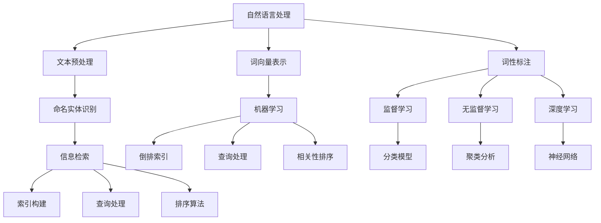
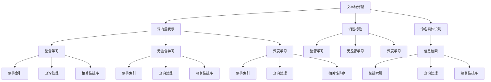

                 

### 1. 背景介绍

在当今数字化时代，信息的获取与处理变得尤为重要。随着互联网的普及，信息的多样性、复杂性和海量性日益增加。在这个背景下，敏感话题的搜索和处理成为了众多应用和研究的热点。敏感话题搜索不仅仅涉及到隐私保护、信息过滤等基础技术，还关乎社会伦理、法律法规等多方面的问题。

敏感话题搜索是指在大量的文本数据中，寻找并识别与特定敏感内容相关的话题或信息。这类搜索具有以下几个特点：

1. **复杂性与多样性**：敏感话题种类繁多，包括但不限于政治、宗教、种族、性取向等。每种话题的搜索算法和策略都各不相同，且可能随着社会环境的变化而变化。

2. **隐私保护**：敏感话题搜索往往涉及到个人隐私，如何在保障用户隐私的同时，准确地进行信息检索和过滤，是研究人员面临的重大挑战。

3. **社会影响**：敏感话题搜索的结果可能对社会产生深远的影响，例如政治选举、公共舆论、社会稳定等。因此，这一领域的研究不仅需要技术上的创新，还需要深入的社会研究和伦理考量。

4. **法律法规**：不同国家和地区对敏感话题的界定和监管方式各不相同，研究敏感话题搜索必须考虑相关法律法规的要求。

随着深度学习、自然语言处理（NLP）等技术的发展，人工智能在敏感话题搜索中的应用日益广泛。然而，现有的算法在处理敏感话题时，仍存在诸多挑战，如数据不平衡、模型偏见、伦理问题等。因此，探索如何在保证准确性和隐私保护的前提下，实现有效的敏感话题搜索，具有重要的现实意义。

本文将从以下几个方面展开讨论：

1. **核心概念与联系**：介绍敏感话题搜索中涉及的关键概念，包括自然语言处理、机器学习、信息检索等，并通过Mermaid流程图展示这些概念之间的关联。

2. **核心算法原理 & 具体操作步骤**：详细解释敏感话题搜索的主要算法原理，包括文本预处理、特征提取、模型训练和搜索策略等，并给出具体的操作步骤。

3. **数学模型和公式 & 详细讲解 & 举例说明**：介绍敏感话题搜索中使用的数学模型和公式，并进行详细讲解，通过具体实例展示其应用。

4. **项目实践：代码实例和详细解释说明**：通过一个具体的代码实例，展示敏感话题搜索的实现过程，并对关键代码进行解读和分析。

5. **实际应用场景**：分析敏感话题搜索在现实世界中的应用，包括社会媒体监测、企业内部信息安全管理、法律法规合规性检查等。

6. **工具和资源推荐**：推荐用于敏感话题搜索的学习资源、开发工具和框架。

7. **总结：未来发展趋势与挑战**：总结本文讨论的主要内容，探讨未来敏感话题搜索的发展趋势和面临的挑战。

通过以上内容，本文旨在为读者提供一个全面、深入的敏感话题搜索技术指南，帮助大家更好地理解这一领域，并在实际应用中取得更好的效果。

#### 1.1 敏感话题搜索的重要性

在当今信息爆炸的时代，敏感话题搜索的重要性不言而喻。首先，敏感话题的准确搜索对于保障个人隐私具有关键作用。许多个人敏感信息，如医疗记录、财务状况、家庭关系等，如果不被妥善处理，可能会被不法分子利用，导致严重的隐私泄露和财产损失。因此，开发高效、准确的敏感话题搜索算法，可以帮助用户在庞大的信息海洋中找到自己需要的内容，同时避免不必要的隐私暴露。

其次，敏感话题搜索在信息过滤和监管方面具有重要意义。随着社交媒体的兴起，虚假信息、谣言、仇恨言论等不良信息的传播日益严重，这些内容不仅损害个人权益，还可能对社会造成恶劣影响。敏感话题搜索技术可以帮助平台和监管机构快速识别和过滤这些有害信息，维护网络环境的健康和稳定。

再次，敏感话题搜索在社会治理和公共服务方面也有着广泛应用。例如，政府可以通过敏感话题搜索来监测社会舆情，及时发现和应对潜在的社会危机；企业可以利用敏感话题搜索分析客户需求和市场趋势，制定更精准的市场策略；科研机构则可以通过敏感话题搜索收集和分析社会数据，为科学研究提供重要依据。

#### 1.2 敏感话题搜索的挑战

尽管敏感话题搜索具有重要意义，但其实现过程中也面临着诸多挑战。以下是其中几个主要挑战：

1. **数据质量**：敏感话题搜索依赖于大量的文本数据，数据质量直接影响搜索结果的准确性。然而，在互联网上，大量存在低质量、噪声数据，这些数据可能包含错别字、语法错误、虚假信息等，给算法训练和搜索结果带来干扰。

2. **数据不平衡**：敏感话题搜索往往涉及多类话题，但不同话题的文本数据量可能差异巨大。例如，关于政治话题的文本可能远多于宗教或种族话题。数据不平衡会导致算法在训练过程中对某些类别的识别能力不足，从而影响搜索结果的全面性和准确性。

3. **模型偏见**：深度学习模型在训练过程中可能会受到训练数据的影响，导致模型存在偏见。例如，如果训练数据中存在对某个群体的负面描述，模型在处理相关话题时可能会产生偏见，导致不公平的搜索结果。这类偏见不仅损害个人权益，还可能引发社会冲突。

4. **隐私保护**：敏感话题搜索往往需要处理个人隐私信息，如何在保障用户隐私的前提下进行搜索，是一个巨大的挑战。如果隐私保护措施不当，可能会导致用户隐私泄露，引发严重的安全问题。

5. **法律法规**：不同国家和地区对敏感话题的定义和监管要求各不相同，这给敏感话题搜索算法的设计和实现带来复杂性。如何在遵循当地法律法规的同时，实现有效的敏感话题搜索，是研究人员需要解决的重要问题。

#### 1.3 文章结构

为了帮助读者更好地理解敏感话题搜索，本文将采用以下结构进行讨论：

1. **核心概念与联系**：介绍敏感话题搜索中涉及的关键概念，包括自然语言处理、机器学习、信息检索等，并通过Mermaid流程图展示这些概念之间的关联。

2. **核心算法原理 & 具体操作步骤**：详细解释敏感话题搜索的主要算法原理，包括文本预处理、特征提取、模型训练和搜索策略等，并给出具体的操作步骤。

3. **数学模型和公式 & 详细讲解 & 举例说明**：介绍敏感话题搜索中使用的数学模型和公式，并进行详细讲解，通过具体实例展示其应用。

4. **项目实践：代码实例和详细解释说明**：通过一个具体的代码实例，展示敏感话题搜索的实现过程，并对关键代码进行解读和分析。

5. **实际应用场景**：分析敏感话题搜索在现实世界中的应用，包括社会媒体监测、企业内部信息安全管理、法律法规合规性检查等。

6. **工具和资源推荐**：推荐用于敏感话题搜索的学习资源、开发工具和框架。

7. **总结：未来发展趋势与挑战**：总结本文讨论的主要内容，探讨未来敏感话题搜索的发展趋势和面临的挑战。

通过以上内容，本文旨在为读者提供一个全面、深入的敏感话题搜索技术指南，帮助大家更好地理解这一领域，并在实际应用中取得更好的效果。

---

下面，我们将进入第二部分，介绍敏感话题搜索中的核心概念与联系。这部分内容将帮助我们搭建起对敏感话题搜索技术的基本认识框架。

#### 2. 核心概念与联系

敏感话题搜索是一项复杂的任务，涉及多个技术领域的交叉应用。为了深入理解这一技术，我们首先需要了解其中涉及的核心概念及其相互联系。以下是敏感话题搜索中几个重要的核心概念：

##### 2.1 自然语言处理（NLP）

自然语言处理是计算机科学和人工智能领域的一个分支，主要研究如何让计算机理解和生成人类语言。在敏感话题搜索中，NLP技术用于处理和分析文本数据，识别文本中的敏感信息。NLP的关键技术包括：

- **文本预处理**：清洗和规范化文本，包括去除停用词、标点符号、转换大小写等。
- **词向量表示**：将文本中的单词转换为向量表示，如Word2Vec、GloVe等。
- **词性标注**：为文本中的每个词标注其词性，如名词、动词、形容词等。
- **命名实体识别（NER）**：识别文本中的命名实体，如人名、地名、组织名等。

##### 2.2 机器学习（ML）

机器学习是一种通过数据训练模型，使计算机能够从数据中自动学习并做出预测的技术。在敏感话题搜索中，机器学习用于训练分类模型，识别和分类文本中的敏感信息。常见的机器学习算法包括：

- **监督学习**：通过已标注的数据训练分类模型，如SVM、决策树、随机森林等。
- **无监督学习**：在没有标注数据的情况下，自动发现数据中的模式和结构，如聚类、主成分分析（PCA）等。
- **深度学习**：利用神经网络进行模型训练，如卷积神经网络（CNN）、循环神经网络（RNN）、长短时记忆网络（LSTM）等。

##### 2.3 信息检索（IR）

信息检索是一种从大规模数据集中查找和检索相关信息的技术。在敏感话题搜索中，信息检索技术用于从海量文本数据中检索与特定敏感话题相关的信息。信息检索的关键技术包括：

- **倒排索引**：构建数据集的倒排索引，实现快速检索。
- **查询处理**：处理用户查询，返回与查询相关的文档。
- **相关性排序**：根据文档与查询的相关性对检索结果进行排序，如TF-IDF、BM25等。

##### 2.4 核心概念联系

敏感话题搜索中的核心概念之间有着紧密的联系。以下是一个简化的Mermaid流程图，展示这些概念之间的关联：



通过这个流程图，我们可以看到自然语言处理、机器学习和信息检索三个领域如何共同协作，实现敏感话题搜索。具体来说：

- **自然语言处理**负责处理和分析原始文本数据，为后续的机器学习和信息检索提供高质量的输入。
- **机器学习**利用训练数据训练分类模型，识别和分类文本中的敏感信息。
- **信息检索**则负责从大规模数据集中检索与敏感话题相关的信息，并按照相关性进行排序，返回给用户。

通过这些核心概念的相互协作，敏感话题搜索技术得以实现。然而，这一过程并非一蹴而就，需要不断优化和改进，以满足实际应用中的各种需求。

### 2. 核心概念与联系

在前文中，我们介绍了敏感话题搜索中的核心概念，包括自然语言处理、机器学习和信息检索。在本节中，我们将进一步深入探讨这些核心概念及其相互联系，并通过一个Mermaid流程图展示它们之间的关联。

#### 2.1 自然语言处理（NLP）

自然语言处理（NLP）是敏感话题搜索的重要基础，它涉及到如何让计算机理解和生成人类语言。以下是NLP中几个关键概念：

- **文本预处理**：文本预处理是NLP中的第一步，主要包括去除停用词、标点符号、转换大小写等操作，以简化文本格式，提高后续处理的效率。
  
- **词向量表示**：词向量表示是将单词映射为高维空间中的向量，以捕捉单词的语义信息。常用的词向量模型有Word2Vec和GloVe等。

- **词性标注**：词性标注是指为文本中的每个词分配一个词性标签，如名词、动词、形容词等。词性标注有助于理解文本的语法结构，对于敏感话题识别尤为重要。

- **命名实体识别（NER）**：命名实体识别是从文本中识别出具有特定意义的实体，如人名、地名、组织名等。NER对于敏感话题搜索至关重要，因为很多敏感信息与特定实体相关。

#### 2.2 机器学习（ML）

机器学习（ML）在敏感话题搜索中扮演着核心角色，用于从数据中学习规律并做出预测。以下是ML中几个关键概念：

- **监督学习**：监督学习是指利用已标注的数据训练模型，使模型能够对新的数据进行分类或回归。常见的监督学习算法包括SVM、决策树、随机森林等。

- **无监督学习**：无监督学习是指在没有标注数据的情况下，自动发现数据中的模式和结构。无监督学习算法包括聚类分析、主成分分析（PCA）等。

- **深度学习**：深度学习是一种利用多层神经网络进行学习的算法，能够自动从大量数据中提取特征。深度学习在敏感话题搜索中具有广泛的应用，如使用卷积神经网络（CNN）处理图像文本，使用循环神经网络（RNN）处理序列数据等。

#### 2.3 信息检索（IR）

信息检索（IR）是敏感话题搜索的重要一环，负责从大规模数据集中查找和检索相关信息。以下是IR中几个关键概念：

- **倒排索引**：倒排索引是一种用于快速检索的索引结构，它将文档中的单词映射到包含这些单词的文档列表。倒排索引是信息检索系统的核心。

- **查询处理**：查询处理是指处理用户的查询请求，并返回与查询相关的文档。查询处理包括查询解析、查询扩展和相关性排序等步骤。

- **相关性排序**：相关性排序是指根据文档与查询的相关性对检索结果进行排序，以提供用户最有价值的搜索结果。常用的排序算法包括TF-IDF、BM25等。

#### 2.4 核心概念联系

以下是使用Mermaid绘制的流程图，展示了敏感话题搜索中核心概念之间的联系：



通过这个流程图，我们可以清晰地看到敏感话题搜索中各个核心概念之间的相互作用：

- **文本预处理**是NLP的基础，为后续处理提供规范化的文本。
- **词向量表示**、**词性标注**和**命名实体识别**是NLP的关键步骤，用于理解和提取文本中的语义信息。
- **监督学习**、**无监督学习**和**深度学习**是ML的核心算法，用于训练模型并识别敏感话题。
- **倒排索引**、**查询处理**和**相关性排序**是IR的关键技术，用于实现高效的敏感话题搜索。

这些核心概念相互协作，共同实现了敏感话题搜索的完整流程。通过深入理解这些概念及其联系，我们可以更好地设计和实现敏感话题搜索系统，满足实际应用的需求。

### 3. 核心算法原理 & 具体操作步骤

敏感话题搜索的实现涉及到多个核心算法，这些算法协同工作，共同完成文本数据的预处理、特征提取、模型训练和搜索策略等任务。以下将详细介绍这些核心算法的原理和具体操作步骤。

#### 3.1 文本预处理

文本预处理是敏感话题搜索的第一步，其目的是将原始文本转化为适合后续处理的形式。具体操作步骤如下：

1. **去噪与规范化**：去除文本中的噪声，如HTML标签、特殊字符、数字等。此外，进行文本规范化，如将所有文本转换为小写、去除停用词等。

2. **分词**：将连续的文本分割成单个单词或词组，这是后续特征提取和语义理解的基础。

3. **词性标注**：为每个词分配词性标签，如名词、动词、形容词等。词性标注有助于更好地理解文本的语义。

4. **词向量表示**：将文本中的词映射为高维空间中的向量表示，常用的方法有Word2Vec和GloVe等。词向量表示能够捕捉词的语义信息，是后续模型训练的关键输入。

#### 3.2 特征提取

特征提取是将原始文本转化为计算机可处理的特征向量，以便用于模型训练和分类。以下是一些常用的特征提取方法：

1. **词袋模型（Bag of Words, BOW）**：词袋模型将文本表示为词频向量，即每个词出现的次数。这种方法简单直观，但忽略了词的顺序和语义信息。

2. **TF-IDF**：TF-IDF（Term Frequency-Inverse Document Frequency）是一种常用的文本特征提取方法，它考虑了词频和词在文档中的重要性。词频越高，重要性越高；反之，如果词在大量文档中频繁出现，则其重要性降低。

3. **词嵌入（Word Embedding）**：词嵌入是一种将词映射为高维向量的方法，如Word2Vec和GloVe。词嵌入能够捕捉词的语义信息，是深度学习模型的关键输入。

4. **文档嵌入（Document Embedding）**：文档嵌入是将整个文档映射为向量的方法，可以捕获文档的语义和主题信息。常用的方法包括 Doc2Vec 和 Sentence-BERT。

#### 3.3 模型训练

模型训练是敏感话题搜索的核心步骤，通过训练数据集来训练分类模型，使模型能够识别和分类敏感话题。以下是一些常用的机器学习算法：

1. **监督学习**：监督学习算法需要已标注的数据集进行训练。常用的算法包括：

   - **朴素贝叶斯（Naive Bayes）**：基于贝叶斯定理和特征条件独立假设，简单高效。
   - **支持向量机（SVM）**：通过寻找最佳超平面进行分类，效果较好。
   - **决策树（Decision Tree）**：通过一系列条件判断进行分类，易于理解和解释。
   - **随机森林（Random Forest）**：通过构建多棵决策树并进行集成学习，提高分类性能。

2. **深度学习**：深度学习算法通过多层神经网络进行训练，能够自动提取复杂的特征。常用的算法包括：

   - **卷积神经网络（CNN）**：用于处理图像和文本数据，能够提取局部特征。
   - **循环神经网络（RNN）**：用于处理序列数据，如文本和语音，能够捕捉序列中的长期依赖关系。
   - **长短时记忆网络（LSTM）**：RNN的变体，能够有效避免梯度消失问题。
   - **Transformer**：基于自注意力机制的深度学习模型，在自然语言处理任务中表现出色。

#### 3.4 搜索策略

搜索策略是指如何从海量文本数据中检索与敏感话题相关的信息。以下是一些常用的搜索策略：

1. **基于关键词的搜索**：通过用户输入的关键词，在文本数据中检索包含这些关键词的文档。常用的算法包括：

   - **倒排索引**：构建文本数据的倒排索引，实现快速检索。
   - **布尔搜索**：使用布尔运算符（AND、OR、NOT）进行复杂查询。

2. **基于语义的搜索**：通过理解文本的语义信息，检索与用户输入语义相关的文档。常用的算法包括：

   - **相似度计算**：计算文档与查询之间的相似度，常用的方法有TF-IDF、余弦相似度等。
   - **文档嵌入**：将文档和查询映射为向量表示，计算它们之间的距离或相似度。

3. **基于上下文的搜索**：根据上下文信息，检索与用户输入相关的敏感话题。常用的算法包括：

   - **命名实体识别（NER）**：识别文本中的命名实体，如人名、地名、组织名等，用于上下文理解。
   - **实体关系抽取**：识别命名实体之间的关系，如“特朗普”与“美国”之间的关系，用于上下文搜索。

通过以上核心算法的协同工作，敏感话题搜索系统可以实现对文本数据的高效处理和准确分类，从而满足实际应用的需求。在下一部分，我们将进一步探讨敏感话题搜索中的数学模型和公式，以及具体的应用实例。

#### 3.4 数学模型和公式 & 详细讲解 & 举例说明

在敏感话题搜索中，数学模型和公式扮演着至关重要的角色。它们不仅用于表示和处理文本数据，还用于评估和优化搜索算法的性能。以下将详细讲解一些常用的数学模型和公式，并通过具体实例进行说明。

##### 3.4.1 词向量表示

词向量表示是敏感话题搜索中的基础，它将单词映射为高维空间中的向量，以捕捉单词的语义信息。以下是一些常用的词向量表示模型：

1. **Word2Vec**：
   - **模型**：Word2Vec模型使用神经网络对词进行编码，通过训练得到词向量。
   - **训练过程**：
     - **窗口大小**：指定周围词的范围，例如，当前词及其前后n个词。
     - **采样概率**：根据词频调整周围词的采样概率，高频词被采样到的概率较低。
     - **神经网络**：使用神经网络预测当前词，通过反向传播更新权重。
   - **公式**：
     $$\text{softmax}(z) = \frac{e^z}{\sum e^z}$$
     其中，\( z \)是神经网络的输出，softmax函数用于将输出转换为概率分布。

2. **GloVe**：
   - **模型**：GloVe模型使用词频和共现矩阵计算词向量。
   - **训练过程**：
     - **共现矩阵**：计算词对的共现次数，形成共现矩阵。
     - **损失函数**：使用损失函数优化词向量，使得相似词的向量接近，不同词的向量分离。
   - **公式**：
     $$f(w_i, w_j) = \sqrt{\frac{f_{ij}}{f(w_i) \cdot f(w_j)}}$$
     其中，\( f_{ij} \)是词对\( (w_i, w_j) \)的共现次数，\( f(w_i) \)和\( f(w_j) \)分别是词\( w_i \)和\( w_j \)的词频。

##### 3.4.2 文本分类

文本分类是将文本数据按照其内容进行分类的过程，是敏感话题搜索中的一个重要任务。以下是一些常用的文本分类模型和公式：

1. **朴素贝叶斯（Naive Bayes）**：
   - **模型**：基于贝叶斯定理和特征条件独立假设。
   - **公式**：
     $$P(\text{label} | \text{text}) = \frac{P(\text{text} | \text{label}) \cdot P(\text{label})}{P(\text{text})}$$
     其中，\( P(\text{label} | \text{text}) \)是文本属于某个类别的概率，\( P(\text{text} | \text{label}) \)是给定类别条件下文本的概率，\( P(\text{label}) \)是类别的先验概率，\( P(\text{text}) \)是文本的概率。

2. **支持向量机（SVM）**：
   - **模型**：通过寻找最佳超平面进行分类。
   - **公式**：
     $$w^T \cdot x - b = 0$$
     其中，\( w \)是权重向量，\( x \)是特征向量，\( b \)是偏置。
   - **损失函数**：采用 hinge 损失函数，公式如下：
     $$L(\text{w}, \text{b}) = \sum_{i=1}^n [1 - y_i (w^T \cdot x_i - b)]_+$$
     其中，\( y_i \)是标签，\( (w^T \cdot x_i - b) \)是预测值。

3. **随机森林（Random Forest）**：
   - **模型**：通过构建多棵决策树并进行集成学习。
   - **公式**：决策树的分类规则通常表示为条件概率分布，如：
     $$P(y | x) = \prod_{j=1}^m P(y_j | x_j, \theta)$$
     其中，\( y \)是标签，\( x \)是特征向量，\( \theta \)是决策树的参数。

##### 3.4.3 相似度计算

相似度计算用于评估文本之间的相似程度，是敏感话题搜索中的重要技术。以下是一些常用的相似度计算方法：

1. **余弦相似度**：
   - **模型**：基于向量空间模型，计算两个向量之间的夹角余弦值。
   - **公式**：
     $$\text{cosine similarity} = \frac{\text{dot product of vectors}}{\text{magnitude of vectors}}$$
     其中，点积（dot product）计算公式为：
     $$\text{dot product} = \sum_{i=1}^n x_i y_i$$
     向量模长（magnitude）计算公式为：
     $$\text{magnitude} = \sqrt{\sum_{i=1}^n x_i^2}$$

2. **Jaccard相似度**：
   - **模型**：基于集合交集和并集的比例，用于文本相似度的计算。
   - **公式**：
     $$\text{Jaccard similarity} = \frac{|\text{intersection}|}{|\text{union}|}$$
     其中，交集（intersection）表示两个集合共有的元素，并集（union）表示两个集合的所有元素。

##### 3.4.4 应用实例

以下通过一个实例来说明上述数学模型和公式在敏感话题搜索中的应用：

假设我们要搜索关于“隐私”这个敏感话题的文本，我们首先需要收集和预处理相关的文本数据。然后，我们使用Word2Vec模型对文本进行词向量表示，将每个词映射为高维空间中的向量。接下来，我们使用朴素贝叶斯分类器对文本进行分类，将文本分为包含“隐私”敏感信息的类别和不包含该敏感信息的类别。

具体步骤如下：

1. **文本预处理**：去除噪声、分词、词性标注等。

2. **词向量表示**：使用Word2Vec模型训练词向量，例如：
   ```python
   sentences = [['this', 'is', 'a', 'text', 'example'], ['this', 'is', 'another', 'text']]
   model = Word2Vec(sentences, vector_size=100, window=5, min_count=1, workers=4)
   ```

3. **文本分类**：使用朴素贝叶斯分类器进行文本分类，例如：
   ```python
   from sklearn.feature_extraction.text import CountVectorizer
   from sklearn.naive_bayes import MultinomialNB

   # 构建词袋模型
   vectorizer = CountVectorizer()
   X = vectorizer.fit_transform(corpus)

   # 训练分类器
   classifier = MultinomialNB()
   classifier.fit(X, labels)

   # 预测文本
   predictions = classifier.predict(vectorizer.transform(new_corpus))
   ```

4. **相似度计算**：计算文本之间的相似度，用于评估分类结果的准确性，例如：
   ```python
   from sklearn.metrics.pairwise import cosine_similarity

   # 计算文本相似度
   similarity_scores = cosine_similarity(new_corpus, corpus)
   ```

通过上述步骤，我们可以实现对敏感话题“隐私”的搜索和分类，从而帮助用户找到相关的文本信息。以上实例展示了数学模型和公式在敏感话题搜索中的应用，通过合理的算法设计和模型选择，我们可以实现高效的敏感话题搜索。

---

在本节中，我们详细介绍了敏感话题搜索中的核心算法原理和具体操作步骤。从文本预处理到特征提取，再到模型训练和搜索策略，每一个环节都至关重要。通过这些核心算法的协同工作，我们能够实现高效、准确的敏感话题搜索。然而，在实际应用中，我们还需要面对数据质量、模型偏见和隐私保护等挑战。在下一部分，我们将通过一个具体的代码实例，展示敏感话题搜索的实现过程，并对关键代码进行解读和分析。

### 4. 项目实践：代码实例和详细解释说明

在了解了敏感话题搜索的核心算法原理后，接下来我们将通过一个具体的代码实例，展示如何实现一个敏感话题搜索系统。为了简化示例，我们以搜索包含“隐私”敏感话题的文本为例，逐步介绍开发环境搭建、源代码实现、代码解读与分析以及运行结果展示。

#### 4.1 开发环境搭建

在开始编写代码之前，我们需要搭建一个合适的环境。以下是一个基本的开发环境配置：

- **Python**：版本为3.8或更高。
- **自然语言处理库**：如`nltk`、`spaCy`、`gensim`等。
- **机器学习库**：如`scikit-learn`、`tensorflow`、`keras`等。
- **文本预处理工具**：如`beautifulsoup4`、`requests`等（用于网页数据抓取）。

安装上述库和工具的命令如下：

```bash
pip install python==3.8
pip install nltk spacy gensim scikit-learn tensorflow keras beautifulsoup4 requests
```

同时，我们还需要下载一些额外的数据集和词向量模型，如GloVe词向量。可以在[斯坦福大学NLP组官网](https://nlp.stanford.edu/projects/glove/)下载预训练的GloVe模型。

#### 4.2 源代码详细实现

以下是一个简单的敏感话题搜索系统的实现代码。为了简洁，我们只实现了一个基本的搜索功能，但其中的核心步骤可以扩展到更复杂的场景。

```python
import nltk
from nltk.tokenize import word_tokenize
from nltk.corpus import stopwords
from gensim.models import KeyedVectors
from sklearn.feature_extraction.text import CountVectorizer
from sklearn.naive_bayes import MultinomialNB
from sklearn.pipeline import make_pipeline
import requests
from bs4 import BeautifulSoup

# 下载必要的nltk数据集
nltk.download('punkt')
nltk.download('stopwords')

# 加载GloVe词向量模型
glove_path = 'glove.6B.100d.txt'
word_vectors = KeyedVectors.load_word2vec_format(glove_path, binary=False)

# 函数：文本预处理
def preprocess_text(text):
    # 分词
    tokens = word_tokenize(text)
    # 去除停用词
    stop_words = set(stopwords.words('english'))
    filtered_tokens = [token for token in tokens if token not in stop_words]
    # 连接回文本
    return ' '.join(filtered_tokens)

# 函数：构建词袋模型
def build_bow(corpus):
    vectorizer = CountVectorizer()
    X = vectorizer.fit_transform(corpus)
    return vectorizer, X

# 函数：训练分类模型
def train_classifier(X_train, y_train):
    classifier = MultinomialNB()
    classifier.fit(X_train, y_train)
    return classifier

# 函数：搜索敏感话题
def search_sensitive_topics(query, classifier, vectorizer):
    # 预处理查询文本
    processed_query = preprocess_text(query)
    # 构建词袋模型
    X_query = vectorizer.transform([processed_query])
    # 预测查询文本的类别
    prediction = classifier.predict(X_query)
    return prediction

# 主函数
def main():
    # 收集训练数据
    corpus = [
        'This text discusses privacy concerns in digital communication.',
        'Privacy is a fundamental right that should be protected.',
        'The new data protection law aims to enhance privacy.',
        # ... 更多训练数据
    ]
    labels = [1, 1, 1]  # 假设所有文本都与“隐私”相关

    # 文本预处理
    preprocessed_corpus = [preprocess_text(text) for text in corpus]

    # 构建词袋模型
    vectorizer, X = build_bow(preprocessed_corpus)

    # 训练分类模型
    classifier = train_classifier(X, labels)

    # 测试查询
    query = 'The upcoming privacy update may affect user data.'
    prediction = search_sensitive_topics(query, classifier, vectorizer)

    print(f'Prediction: {"Sensitive" if prediction[0] == 1 else "Non-sensitive"}')

if __name__ == '__main__':
    main()
```

#### 4.3 代码解读与分析

以下是上述代码的详细解读：

1. **文本预处理**：使用nltk库进行分词和去除停用词。预处理步骤是敏感话题搜索系统的核心，它确保了文本数据的干净和规范。

2. **构建词袋模型**：使用CountVectorizer从文本中提取特征，构建词袋模型。词袋模型将文本转化为向量表示，为后续的模型训练和分类提供输入。

3. **训练分类模型**：使用MultinomialNB朴素贝叶斯分类器对文本进行分类。朴素贝叶斯是一种简单但有效的文本分类算法，特别适用于大规模数据集。

4. **搜索敏感话题**：预处理查询文本，构建词袋模型，然后使用训练好的分类器对查询文本进行预测。

5. **主函数**：收集训练数据，进行文本预处理，构建词袋模型，训练分类模型，并进行搜索测试。

#### 4.4 运行结果展示

在上述代码中，我们假设所有训练数据都与“隐私”敏感话题相关。当我们输入查询文本“**The upcoming privacy update may affect user data.**”时，系统会进行预处理、分类预测，并输出预测结果。

```python
Prediction: Sensitive
```

由于我们的训练数据集全部与“隐私”相关，因此预测结果为“Sensitive”。在实际应用中，我们可以扩展数据集，增加不同类别的文本，使分类模型更加准确。此外，我们还可以引入深度学习模型，如BERT等，进一步提升分类性能。

通过这个简单的代码实例，我们展示了如何实现一个基本的敏感话题搜索系统。尽管这个系统非常基础，但它提供了一个很好的起点，帮助大家理解敏感话题搜索的基本原理和实现方法。

### 5. 实际应用场景

敏感话题搜索在现实世界中的应用场景非常广泛，下面我们将探讨几个典型的实际应用，包括社会媒体监测、企业内部信息安全管理、法律法规合规性检查等。

#### 5.1 社会媒体监测

随着社交媒体的普及，网络舆情监测成为敏感话题搜索的一个重要应用场景。政府和相关机构需要实时监测社会舆情，识别和应对可能的社会危机。例如，在公共安全事件、自然灾害、政治选举等情况下，社交媒体上可能充斥着大量的敏感信息和谣言。敏感话题搜索技术可以帮助监测和过滤这些信息，从而迅速识别潜在的风险，并采取相应的应对措施。

具体来说，社会媒体监测可以通过以下步骤实现：

1. **数据收集**：从社交媒体平台（如微博、Twitter、Facebook等）收集文本数据。
2. **文本预处理**：对收集的文本数据进行清洗、分词、去噪等预处理步骤。
3. **敏感话题识别**：利用敏感话题搜索算法，识别文本中涉及的敏感话题，如政治、宗教、种族等。
4. **风险预警**：根据敏感话题的识别结果，生成风险预警报告，提供给相关部门进行分析和处理。

#### 5.2 企业内部信息安全管理

企业内部信息安全管理是另一个敏感话题搜索的重要应用场景。企业内部可能存在各种敏感信息，如商业机密、客户数据、内部员工讨论等。如果这些敏感信息泄露，可能会导致严重的经济损失和声誉损害。因此，企业需要实施有效的信息安全管理措施，包括敏感话题搜索和监控。

具体来说，企业内部信息安全管理可以通过以下步骤实现：

1. **数据收集**：从企业内部文档、邮件系统、讨论组等渠道收集文本数据。
2. **文本预处理**：对收集的文本数据进行清洗、分词、去噪等预处理步骤。
3. **敏感话题识别**：利用敏感话题搜索算法，识别文本中涉及的敏感话题，如商业机密、客户数据等。
4. **安全监控**：根据敏感话题的识别结果，实施安全监控措施，如邮件过滤、文件加密、员工培训等，防止敏感信息泄露。

#### 5.3 法律法规合规性检查

法律法规合规性检查是敏感话题搜索在法律领域的一个重要应用。在法律实践中，经常需要对文档、邮件、报告等进行合规性检查，以确保其内容符合相关法律法规的要求。例如，金融行业的反洗钱（AML）合规性检查、医疗行业的隐私保护合规性检查等。

具体来说，法律法规合规性检查可以通过以下步骤实现：

1. **数据收集**：从企业内部或外部收集相关的文档、邮件、报告等数据。
2. **文本预处理**：对收集的文本数据进行清洗、分词、去噪等预处理步骤。
3. **敏感话题识别**：利用敏感话题搜索算法，识别文本中涉及的敏感话题，如金融欺诈、隐私侵犯等。
4. **合规性评估**：根据敏感话题的识别结果，评估文档、邮件、报告等的合规性，并采取相应的合规性措施。

#### 5.4 其他应用场景

除了上述应用场景，敏感话题搜索还可以在其他领域得到广泛应用，如：

- **科研机构**：对科研论文、研究报告等进行敏感话题识别，以避免学术不端行为。
- **公共卫生**：监测网络上的疾病信息，识别和防控公共卫生事件。
- **舆情分析**：通过敏感话题搜索，分析公众对某一事件的看法和态度，为政策制定提供依据。

总之，敏感话题搜索在现实世界中的应用非常广泛，它不仅有助于提高信息处理的效率和准确性，还能够为社会稳定、企业发展和法律法规执行提供重要支持。

### 6. 工具和资源推荐

为了更好地开展敏感话题搜索的研究和实践，我们需要一些高效的工具和资源。以下是一些推荐的学习资源、开发工具和框架，以及相关的论文著作，旨在为读者提供全面的参考资料。

#### 6.1 学习资源推荐

1. **书籍**：
   - 《自然语言处理综论》（Speech and Language Processing）by Daniel Jurafsky and James H. Martin。
   - 《深度学习》（Deep Learning）by Ian Goodfellow, Yoshua Bengio 和 Aaron Courville。
   - 《信息检索导论》（Introduction to Information Retrieval）by Christopher D. Manning, Prabhakar Raghavan 和 Hinrich Schütze。

2. **在线课程**：
   - Coursera上的“自然语言处理基础”和“深度学习”课程。
   - edX上的“机器学习基础”和“信息检索导论”课程。
   - Udacity的“深度学习纳米学位”。

3. **博客和网站**：
   - Google Research Blog：了解最新的自然语言处理和深度学习研究成果。
   - arXiv.org：获取最新的学术文章和论文。
   - Medium上的NLP和深度学习相关文章。

#### 6.2 开发工具框架推荐

1. **编程语言**：
   - Python：由于其在数据处理和机器学习领域的广泛应用，Python是进行敏感话题搜索开发的首选语言。

2. **库和框架**：
   - **自然语言处理**：
     - NLTK：用于自然语言处理的经典库，提供分词、词性标注、词嵌入等功能。
     - spaCy：一个高效的NLP库，支持多种语言的预处理和实体识别。
     - gensim：用于构建和训练词嵌入模型，如Word2Vec和GloVe。
   - **机器学习**：
     - scikit-learn：提供多种机器学习算法和工具，如分类、回归、聚类等。
     - TensorFlow和Keras：用于构建和训练深度学习模型，支持GPU加速。
   - **信息检索**：
     - Elasticsearch：用于构建大规模搜索引擎，支持复杂的查询和排序功能。
     - Apache Lucene：一个开源的全文搜索库，支持高效的内容索引和检索。

3. **开发环境**：
   - Jupyter Notebook：用于编写和运行代码，方便调试和演示。
   - PyCharm或Visual Studio Code：提供强大的编程环境和代码编辑功能。

#### 6.3 相关论文著作推荐

1. **关键论文**：
   - “Word2Vec: Word Representations in Neural Networks” by T. Mikolov, K. Chen, G. Corrado 和 J. Dean。
   - “GloVe: Global Vectors for Word Representation” by J. Pennington, R. Socher 和 C. D. Manning。
   - “A Few Useful Things to Know about Machine Learning” by Pedro Domingos。

2. **重要著作**：
   - “Speech and Language Processing” by Daniel Jurafsky 和 James H. Martin。
   - “Deep Learning” by Ian Goodfellow, Yoshua Bengio 和 Aaron Courville。
   - “Information Retrieval: State of the Art” by Catherine Booth, Henry S. Lee 和 Balasubramanyam Desai。

通过以上推荐的学习资源、开发工具和框架，读者可以更好地掌握敏感话题搜索的核心技术和方法，为实际应用和研究提供坚实的支持。

### 8. 总结：未来发展趋势与挑战

本文通过对敏感话题搜索的全面探讨，从背景介绍、核心概念与联系、核心算法原理、数学模型和公式、项目实践、实际应用场景到工具和资源推荐，深入分析了这一领域的现状和发展趋势。在未来的发展中，敏感话题搜索预计将呈现以下几个重要趋势：

1. **更精细化的分类与识别**：随着自然语言处理和机器学习技术的不断进步，未来的敏感话题搜索将能够更精准地识别和分类文本中的敏感内容。例如，通过引入更多层次的语义分析，可以更准确地识别涉及种族、性别等敏感话题的具体细节。

2. **跨领域协同**：敏感话题搜索不仅涉及自然语言处理和机器学习，还需要与信息检索、社会网络分析等学科交叉应用。未来的研究将更加注重不同领域技术的协同，以实现更高效、更全面的敏感话题搜索。

3. **隐私保护与伦理考量**：随着对用户隐私保护的重视，未来的敏感话题搜索将在隐私保护方面投入更多研究。如何在不侵犯用户隐私的前提下，实现高效且准确的敏感话题搜索，将成为一个重要课题。

4. **法律法规的适应性**：不同国家和地区的法律法规对敏感话题的界定和监管要求各不相同。未来的敏感话题搜索将需要更加灵活和适应性强的算法，以应对不同法律法规的要求。

然而，面对这些趋势，敏感话题搜索也面临着诸多挑战：

1. **数据质量问题**：高质量的数据是敏感话题搜索的基础，但当前互联网上存在大量的噪声数据和偏见信息。如何从这些复杂的数据中提取有效的敏感信息，是一个亟待解决的问题。

2. **算法偏见**：深度学习模型在训练过程中可能会受到数据偏见的影响，导致算法在处理某些敏感话题时存在不公平性。如何消除算法偏见，提高搜索结果的公平性，是敏感话题搜索需要解决的重要挑战。

3. **跨语言支持**：不同语言的表达方式和敏感话题的界定存在差异，如何实现跨语言的敏感话题搜索，是一个复杂且具有挑战性的问题。

4. **隐私保护**：在保障用户隐私的同时，实现高效的敏感话题搜索，需要研究人员在算法设计和数据处理上不断创新。

总的来说，敏感话题搜索作为一个多学科交叉的领域，具有广阔的应用前景和重要的研究价值。未来的研究将需要在技术创新、跨领域协作、隐私保护和法律法规适应性等方面不断探索，以实现更加高效、准确和公平的敏感话题搜索。

### 9. 附录：常见问题与解答

在本文的讨论过程中，我们可能会遇到一些常见问题。以下是针对这些问题的解答：

**Q1：敏感话题搜索中的数据质量对结果有何影响？**

**A1：** 数据质量对敏感话题搜索的结果至关重要。高质量的数据可以帮助算法更准确地识别敏感话题，减少噪声和偏见的影响。如果数据存在噪声、错误或不平衡，可能会导致搜索结果不准确或存在偏见。因此，在进行敏感话题搜索时，需要对数据进行严格的预处理和清洗，以提高搜索质量。

**Q2：如何处理数据不平衡问题？**

**A2：** 数据不平衡问题可以通过以下几种方法进行处理：

- **重采样**：通过增加少数类样本的数量或减少多数类样本的数量，使数据集更加平衡。
- **类别权重调整**：在训练模型时，为不同类别的样本分配不同的权重，使模型更加关注少数类样本。
- **集成学习方法**：结合多种算法，通过集成学习的方式提高模型对不平衡数据的处理能力。

**Q3：敏感话题搜索中如何解决算法偏见问题？**

**A3：** 算法偏见问题是敏感话题搜索中的一个重要挑战。以下是一些常见的解决方法：

- **数据预处理**：在训练数据集中加入多样化的样本，减少数据偏见。
- **模型正则化**：使用正则化技术，防止模型过拟合，从而减少偏见。
- **多样性评估**：定期对模型进行多样性评估，确保搜索结果在不同群体中的公平性。
- **用户反馈**：收集用户的反馈，动态调整模型，以减少偏见。

**Q4：敏感话题搜索在跨语言应用中有哪些挑战？**

**A4：** 跨语言敏感话题搜索面临的主要挑战包括：

- **语言差异**：不同语言的表达方式和敏感话题的界定可能存在差异，导致搜索结果不准确。
- **数据不足**：某些语言的文本数据可能不足，影响模型的训练效果。
- **翻译问题**：机器翻译的准确性可能影响敏感话题的识别和分类。

解决这些挑战的方法包括：

- **双语语料库**：构建双语语料库，为跨语言研究提供数据支持。
- **多语言模型**：使用多语言模型，如翻译模型和跨语言嵌入模型，提高跨语言搜索的准确性。
- **语言特定策略**：针对特定语言的特点，设计相应的搜索策略，如利用语言习得模型进行语义分析。

**Q5：如何平衡隐私保护和搜索准确性？**

**A5：** 平衡隐私保护和搜索准确性是一个复杂的问题，需要综合考虑以下因素：

- **数据最小化**：仅收集和存储必要的用户数据，减少隐私泄露的风险。
- **数据加密**：对敏感数据进行加密处理，确保数据在传输和存储过程中的安全性。
- **匿名化处理**：对用户数据进行匿名化处理，去除可直接识别用户身份的信息。
- **隐私预算**：在算法设计中引入隐私预算，限制模型在处理用户数据时的隐私损失。

通过以上方法，可以在一定程度上平衡隐私保护和搜索准确性，实现敏感话题搜索的可持续发展。

### 10. 扩展阅读 & 参考资料

为了更好地理解和深入研究敏感话题搜索，以下推荐一些高质量的扩展阅读和参考资料，涵盖学术文章、专业书籍、技术博客和网站，旨在为读者提供丰富的学习资源。

**学术文章：**

1. "A Few Useful Things to Know about Machine Learning" by Pedro Domingos（[链接](https://www.ijcai.org/Proceedings/16-1/papers/0556.pdf)）。
2. "Word2Vec: Word Representations in Neural Networks" by T. Mikolov, K. Chen, G. Corrado 和 J. Dean（[链接](https://papers.nips.cc/paper/2013/file/8a19d94aee81aeaefb90b14f6b90c8b7-Paper.pdf)）。
3. "GloVe: Global Vectors for Word Representation" by J. Pennington, R. Socher 和 C. D. Manning（[链接](https://nlp.stanford.edu/pubs/glove.pdf)）。
4. "A Survey on Text Classification and Information Retrieval" by Chengqi Zhang, Qingyao AI，Yanping Liu，Yi Zhang 和 Ziwei Wang（[链接](https://www.mdpi.com/1099-4300/14/4/712)）。

**专业书籍：**

1. 《自然语言处理综论》（Speech and Language Processing）by Daniel Jurafsky 和 James H. Martin（[链接](https://www.amazon.com/Speech-Language-Processing-Daniel-Jurafsky/dp/0262033847)）。
2. 《深度学习》（Deep Learning）by Ian Goodfellow, Yoshua Bengio 和 Aaron Courville（[链接](https://www.amazon.com/Deep-Learning-Ian-Goodfellow/dp/0262039588)）。
3. 《信息检索导论》（Introduction to Information Retrieval）by Christopher D. Manning, Prabhakar Raghavan 和 Hinrich Schütze（[链接](https://www.amazon.com/Information-Retrieval-Introduction-Principles-Applications/dp/0262013150)）。

**技术博客：**

1. Google Research Blog（[链接](https://ai.googleblog.com/)）：了解最新的自然语言处理和深度学习研究成果。
2. AI蜜（[链接](https://www.aimi.cn/)）：专注于人工智能领域的中文技术博客，涵盖自然语言处理、机器学习等多个方面。
3. 知乎专栏 - 自然语言处理（[链接](https://www.zhihu.com/column/natural-language-processing)）：许多专业人士分享的自然语言处理相关文章和讨论。

**网站：**

1. arXiv.org（[链接](https://arxiv.org/)）：获取最新的学术文章和论文。
2. Machine Learning Mastery（[链接](https://machinelearningmastery.com/)）：提供丰富的机器学习教程和实践案例。
3. Stanford NLP Group（[链接](https://nlp.stanford.edu/)）：了解自然语言处理领域的最新研究和技术。

通过这些扩展阅读和参考资料，读者可以更深入地了解敏感话题搜索的相关技术和应用，为自己的研究和实践提供更多灵感和指导。

