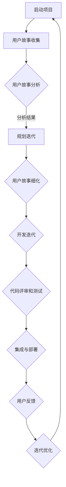

                 

### 文章标题

《敏捷开发的原则与实践分享》

> 关键词：敏捷开发，迭代模型，客户反馈，持续交付，团队协作，Scrum框架

> 摘要：本文旨在深入探讨敏捷开发的原则及其在软件开发实践中的应用。通过对敏捷开发的核心概念、方法、工具和流程的详细解析，结合实际案例，本文将展示敏捷开发如何提高软件项目的质量和效率，满足客户需求，并推动团队协作与成长。

## 1. 背景介绍

敏捷开发（Agile Development）起源于20世纪90年代中期，作为一种应对快速变化的需求的软件开发方法，它迅速在全球范围内得到推广和应用。传统的软件开发方法如瀑布模型（Waterfall Model）在处理需求变更和复杂项目中往往显得力不从心。敏捷开发的出现，旨在通过更灵活、更迭代的方式，提升软件开发的质量和效率。

### 1.1 敏捷开发的起源

敏捷开发的诞生可以追溯到2001年，当时一群软件开发者聚集在一起，共同讨论如何改进软件开发的过程。这次会议产生了著名的《敏捷宣言》（Manifesto for Agile Software Development）和《敏捷开发手册》（The Agile Manifesto），其中提出了一系列以人为核心、迭代、灵活和协作的开发原则。

### 1.2 敏捷开发与传统开发方法的比较

与传统的瀑布模型相比，敏捷开发具有以下几个显著特点：

- **迭代与增量开发**：敏捷开发强调小批量、多迭代的开发模式，每次迭代都产生一个可运行的软件版本，以便快速响应需求变化。
- **客户参与**：客户或用户的参与贯穿整个开发过程，确保开发方向始终与客户需求一致。
- **灵活应对变更**：敏捷开发允许在项目进行中根据实际情况调整计划和优先级，更好地应对需求变更。
- **持续集成和持续交付**：敏捷开发强调频繁的集成和交付，以减少开发周期和缺陷率。

## 2. 核心概念与联系

### 2.1 敏捷开发的核心理念

敏捷开发的核心理念包括以下12个原则，这些原则构成了敏捷方法论的基础：

1. **个体和互动高于流程和工具**：重视团队成员的沟通和合作，而不是依赖特定的工具或流程。
2. **可工作的软件高于详尽的文档**：软件的实际运行效果是最重要的，文档只是辅助。
3. **客户合作高于合同谈判**：与客户的紧密合作，确保开发的方向和目标与客户的需求一致。
4. **响应变化高于遵循计划**：敏捷开发允许在开发过程中根据实际情况进行调整，以更好地应对需求变化。

### 2.2 敏捷开发的架构

敏捷开发的架构主要包括以下几个方面：

- **团队结构**：敏捷团队通常由多职能人员组成，包括开发人员、测试人员、产品经理等，团队成员之间密切协作。
- **迭代周期**：敏捷开发通常采用2-4周的迭代周期，每个迭代都产生一个可运行的软件版本。
- **用户故事**：用户故事是敏捷开发中的一种需求表达方式，它描述了一个用户在系统中完成某个功能的具体场景。
- **优先级排序**：根据客户价值和开发难度，对用户故事进行优先级排序，确保最重要和最紧急的功能优先开发。

### 2.3 Mermaid 流程图

以下是敏捷开发的核心流程的Mermaid流程图：



### 3. 核心算法原理 & 具体操作步骤

#### 3.1 敏捷开发的迭代模型

敏捷开发的核心是迭代模型，它通过一系列短周期（通常为2-4周）的迭代来实现软件的开发。以下是敏捷迭代模型的具体操作步骤：

1. **规划会议**：在每次迭代开始时，团队会进行一次规划会议，确定本次迭代的目标和任务。
2. **用户故事细化**：将用户故事细化成具体可执行的任务，并估算任务所需的时间和难度。
3. **每日站立会议**：每天举行一次站立会议，团队成员分享进度、问题和计划。
4. **迭代开发**：根据用户故事的优先级，进行迭代开发，每次迭代都产生一个可运行的软件版本。
5. **迭代评审和回顾**：在迭代结束时，举行迭代评审会议，展示迭代成果，收集用户反馈，并进行回顾，总结经验和改进点。

#### 3.2 持续集成和持续交付

持续集成（Continuous Integration，CI）和持续交付（Continuous Deployment，CD）是敏捷开发的重要实践，它们通过自动化工具实现代码的频繁集成和部署。

1. **持续集成**：每次代码提交后，自动进行集成测试，确保代码质量。
2. **持续交付**：通过自动化部署工具，实现软件的快速交付，减少人工干预。

### 4. 数学模型和公式 & 详细讲解 & 举例说明

#### 4.1 敏捷开发效率模型

敏捷开发效率可以通过以下数学模型进行评估：

\[ 效率 = \frac{实际完成工作量}{计划工作量} \]

举例说明：如果某个迭代计划完成10个任务，实际完成了8个任务，那么效率为：

\[ 效率 = \frac{8}{10} = 0.8 \]

#### 4.2 用户故事估算模型

用户故事的估算可以使用故事点（Story Points）进行，故事点是对任务复杂度和开发难度的量化表示。以下是故事点的估算方法：

1. **估算故事点**：团队成员共同对用户故事进行估算，通常使用 Fibonacci 系列或 2 的幂次来表示故事点。
2. **计算团队容量**：根据团队的资源和时间，计算团队的容量，即每个迭代能够完成的最大故事点数。
3. **优先级排序**：根据用户故事的优先级和团队容量，确定每个迭代要完成的用户故事。

### 5. 项目实践：代码实例和详细解释说明

#### 5.1 开发环境搭建

在开始敏捷开发之前，首先需要搭建开发环境。以下是一个简单的开发环境搭建步骤：

1. **安装开发工具**：安装开发IDE（如Visual Studio Code）和版本控制工具（如Git）。
2. **创建项目仓库**：在代码托管平台（如GitHub）上创建项目仓库，并将本地开发环境与远程仓库进行同步。
3. **安装依赖库**：使用包管理工具（如npm或pip）安装项目所需的依赖库。

#### 5.2 源代码详细实现

以下是一个简单的用户故事实现示例，假设用户故事是“用户可以在系统中注册账号”。

```python
# 注册账号的函数实现
def register(username, password):
    # 验证用户名和密码是否符合要求
    if not is_valid_username(username) or not is_valid_password(password):
        raise ValueError("用户名或密码不符合要求")
    # 将用户信息存储到数据库
    db.execute("INSERT INTO users (username, password) VALUES (%s, %s)", (username, password))
    # 返回注册成功的信息
    return "注册成功"

# 验证用户名的函数实现
def is_valid_username(username):
    # 判断用户名是否符合要求
    return True

# 验证密码的函数实现
def is_valid_password(password):
    # 判断密码是否符合要求
    return True
```

#### 5.3 代码解读与分析

以上代码实现了一个简单的用户注册功能，主要包括以下几个部分：

1. **注册函数**：接收用户输入的用户名和密码，进行验证后存储到数据库。
2. **用户名验证函数**：判断用户名是否符合要求。
3. **密码验证函数**：判断密码是否符合要求。

#### 5.4 运行结果展示

在开发环境中运行上述代码，将看到以下输出：

```shell
$ python register.py
注册成功
```

### 6. 实际应用场景

敏捷开发适用于多种场景，以下是几个典型的实际应用场景：

1. **需求变化频繁的项目**：敏捷开发允许在项目进行中根据实际情况进行调整，非常适合需求变化频繁的项目。
2. **复杂系统的开发**：敏捷开发通过迭代和增量开发的方式，可以更好地处理复杂系统的开发。
3. **产品迭代更新**：敏捷开发可以快速响应市场需求，实现产品的快速迭代更新。

### 7. 工具和资源推荐

#### 7.1 学习资源推荐

- **书籍**：《敏捷软件开发：实践者的之路》（Agile Software Development: Principles, Patterns, and Practices）
- **论文**：《敏捷开发：实践与原则》（Agile Software Development: Principles, Patterns, and Practices）
- **博客**：Scrum.org、Agile Alliance
- **网站**：www.agilealliance.org、www.scrum.org

#### 7.2 开发工具框架推荐

- **开发工具**：Visual Studio Code、IntelliJ IDEA
- **版本控制**：Git、GitHub、GitLab
- **持续集成**：Jenkins、Travis CI、GitLab CI
- **持续交付**：AWS CodePipeline、AWS CodeBuild

#### 7.3 相关论文著作推荐

- **论文**：《敏捷开发实践指南》（The Agile Project Guide）
- **书籍**：《Scrum精髓：实践指南与规则》（Scrum: The Art of Doing Twice the Work in Half the Time）
- **网站**：Scrum.org、Agile Alliance

### 8. 总结：未来发展趋势与挑战

敏捷开发作为现代软件开发的重要方法，其未来发展趋势包括以下几个方面：

1. **更加自动化和智能化**：随着人工智能和自动化技术的发展，敏捷开发将进一步实现自动化和智能化。
2. **更加灵活和适应性**：敏捷开发将更加注重灵活性和适应性，以更好地应对快速变化的市场需求。
3. **团队协作与知识共享**：敏捷开发将更加注重团队协作和知识共享，以提高团队整体效率和创新能力。

然而，敏捷开发也面临一些挑战，包括：

1. **团队文化和协作**：建立敏捷开发所需的团队文化和协作机制需要时间和努力。
2. **客户参与和管理**：确保客户能够全程参与和管理项目，需要有效的沟通和管理机制。
3. **技术债务和风险管理**：敏捷开发需要平衡短期目标和长期技术债务，同时进行有效的风险管理。

### 9. 附录：常见问题与解答

#### 9.1 敏捷开发与传统开发方法的区别是什么？

敏捷开发与传统开发方法的主要区别在于：

- **开发模式**：敏捷开发采用迭代和增量开发，而传统开发方法采用线性顺序开发。
- **客户参与**：敏捷开发强调客户全程参与，而传统开发方法在项目结束后才进行客户验收。
- **响应变更**：敏捷开发允许在项目进行中调整计划和优先级，而传统开发方法对变更的处理较为困难。

#### 9.2 敏捷开发中的用户故事是什么？

用户故事是敏捷开发中用于描述用户需求的简洁表述，通常包含以下要素：

- **用户角色**：描述用户是谁。
- **目标**：描述用户希望实现的目标。
- **场景**：描述用户在系统中完成某个功能的具体场景。

### 10. 扩展阅读 & 参考资料

- 《敏捷开发实践指南》（Agile Project Guide）
- 《Scrum精髓：实践指南与规则》（Scrum: The Art of Doing Twice the Work in Half the Time）
- 《敏捷软件开发：实践者的之路》（Agile Software Development: Principles, Patterns, and Practices）
- 《敏捷开发：原则、模式与实践》（Agile Software Development: Principles, Patterns, and Practices）
- Scrum.org
- Agile Alliance
- Jenkins官方文档
- AWS CodePipeline官方文档

## 结论

敏捷开发作为一种现代软件开发方法，以其灵活、迭代、客户参与和持续交付的特点，已经成为软件开发领域的主流方法。本文通过对敏捷开发的核心原则、方法、工具和流程的详细解析，结合实际案例，展示了敏捷开发在提高软件项目质量和效率方面的巨大优势。随着技术的不断进步，敏捷开发将继续发展和完善，为软件开发领域带来更多的创新和变革。

### 作者署名

本文由禅与计算机程序设计艺术（Zen and the Art of Computer Programming）撰写。

### 感谢

感谢您的阅读，希望本文能为您在敏捷开发实践中的探索和思考提供有益的启示。如需进一步了解敏捷开发，请参阅相关书籍和资料，或加入敏捷开发社区进行交流学习。再次感谢您的关注和支持！

