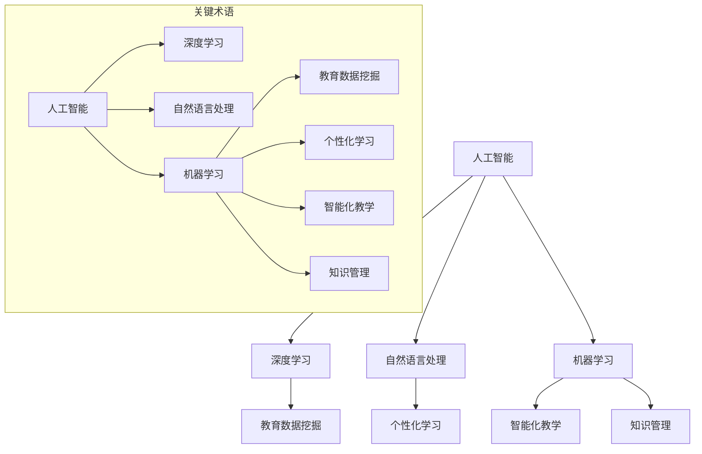
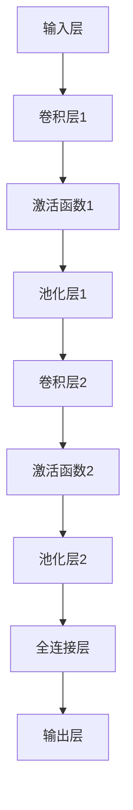
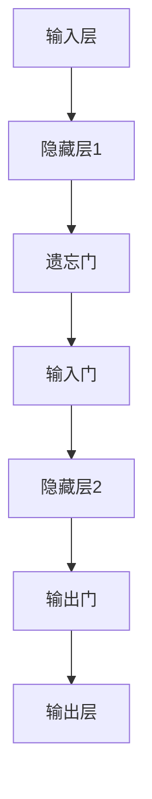

                 

### 1. 背景介绍

在教育科技迅速发展的今天，人工智能（AI）大模型正逐渐成为改变学习方式的重要力量。从传统的课堂教学到在线教育的普及，再到个性化学习体验的提出，教育科技的变革正以前所未有的速度推进。AI 大模型以其强大的数据处理和分析能力，为教育领域带来了全新的机遇和挑战。

人工智能大模型，顾名思义，是指具有巨大数据量和复杂算法的 AI 模型。这些模型通常使用深度学习技术，能够自动从大量数据中学习模式和知识，从而进行智能决策和预测。在过去的几年中，随着计算能力的提升和海量数据的积累，AI 大模型在各个领域取得了显著成果，包括语音识别、图像识别、自然语言处理等。教育科技领域的应用，同样受益于这些技术的进步。

教育科技革命的核心在于利用 AI 大模型来实现个性化学习、智能化教学和高效的知识管理。个性化学习是指根据每个学生的特点和需求，提供定制化的学习内容和方法，从而最大化学习效果。智能化教学则是指利用 AI 技术来辅助教师进行教学活动，提高教学效率和教学质量。高效的知识管理则是指通过 AI 技术对大量教育数据进行处理和分析，从而实现知识的高效组织、存储和传播。

本文将围绕教育科技革命，深入探讨 AI 大模型如何改变学习方式。我们将首先介绍 AI 大模型的核心概念和原理，然后分析其在教育领域的具体应用，并通过实例展示其效果。接着，我们将讨论 AI 大模型在个性化学习、智能化教学和知识管理方面的作用，最后展望其未来发展趋势和面临的挑战。

通过本文的阅读，读者将能够全面了解 AI 大模型在教育科技中的重要作用，以及如何利用这些技术来提升学习效果和教学质量。希望本文能为教育科技领域的研究者、实践者和决策者提供有价值的参考和启示。

### 2. 核心概念与联系

为了更好地理解 AI 大模型如何改变学习方式，我们需要首先明确几个核心概念和它们之间的联系。以下是关键术语的解释及其在教育科技中的应用：

#### 2.1 人工智能（AI）

人工智能是指计算机系统能够执行通常需要人类智能才能完成的任务，如识别图像、理解自然语言、做出决策等。在教育科技中，AI 被广泛应用于自动化评估、智能辅导系统和个性化推荐系统。

#### 2.2 深度学习（Deep Learning）

深度学习是人工智能的一个分支，使用多层神经网络（例如卷积神经网络和循环神经网络）进行模型训练，从数据中学习复杂模式。在教育科技中，深度学习技术常用于语音识别、图像识别和自然语言处理等领域。

#### 2.3 自然语言处理（Natural Language Processing，NLP）

自然语言处理是指使计算机能够理解、解释和生成人类语言的技术。在教育科技中，NLP 用于自动评分、智能问答系统和个性化内容推荐。

#### 2.4 机器学习（Machine Learning）

机器学习是 AI 的一个子领域，涉及使用算法从数据中学习并做出预测或决策。在教育科技中，机器学习技术被用于学生成绩预测、学习路径推荐和教学策略优化。

#### 2.5 教育数据挖掘（Educational Data Mining，EDM）

教育数据挖掘是指从教育数据中提取有价值的知识和模式，以改进教育和学习过程。在教育科技中，教育数据挖掘技术被用于分析学生的学习行为、评估教学效果和优化教育资源分配。

#### 2.6 个性化学习（Personalized Learning）

个性化学习是指根据每个学生的特点和需求，提供定制化的学习内容和方法。在教育科技中，个性化学习利用 AI 大模型分析学生的学习数据，生成个性化的学习计划和资源推荐。

#### 2.7 智能化教学（Smart Teaching）

智能化教学是指利用 AI 技术来辅助教师进行教学活动。例如，智能辅导系统可以根据学生的学习进度和表现，自动调整教学策略并提供针对性的辅导内容。

#### 2.8 知识管理（Knowledge Management）

知识管理是指通过收集、组织、存储和传播知识，以提高组织的知识共享和创新能力。在教育科技中，知识管理利用 AI 大模型对教育数据进行处理和分析，实现知识的高效组织和利用。

#### 2.9 Mermaid 流程图

为了更直观地展示上述概念之间的联系，我们可以使用 Mermaid 流程图进行描述。以下是关于教育科技中核心概念的 Mermaid 流程图：



通过上述 Mermaid 流程图，我们可以清晰地看到教育科技中关键概念之间的联系。这些概念共同构成了 AI 大模型在教育领域的应用基础，为个性化学习、智能化教学和知识管理提供了强有力的支持。

接下来，我们将进一步探讨这些核心概念的原理和应用，以帮助读者更深入地理解 AI 大模型如何改变学习方式。

### 3. 核心算法原理 & 具体操作步骤

在深入探讨 AI 大模型如何改变学习方式之前，我们需要首先了解其核心算法原理和具体操作步骤。AI 大模型主要依赖于深度学习技术，特别是卷积神经网络（CNN）和循环神经网络（RNN）等算法，这些算法通过多层神经网络结构，从大量数据中自动学习和提取特征，从而实现智能决策和预测。

#### 3.1 卷积神经网络（CNN）

卷积神经网络是处理图像数据的一种有效算法，其核心思想是通过卷积操作来提取图像的特征。以下是 CNN 的基本操作步骤：

1. **输入层**：输入层接收原始图像数据，例如一张100x100像素的彩色图像。

2. **卷积层**：卷积层通过卷积操作提取图像的特征。卷积操作包括一个卷积核（或滤波器）和一个步长。卷积核在图像上滑动，计算每个位置的局部特征。步长决定了卷积核移动的步长大小。

3. **激活函数**：激活函数用于引入非线性特性，常用的激活函数包括 sigmoid 函数和 ReLU 函数。

4. **池化层**：池化层用于降低特征图的维度，常用的池化操作包括最大池化和平均池化。池化操作可以减少计算量和参数数量，提高模型的泛化能力。

5. **全连接层**：全连接层将卷积层和池化层输出的特征映射到输出类别。全连接层中的每个神经元都连接到卷积层和池化层的所有神经元。

6. **输出层**：输出层生成最终预测结果，例如分类结果或回归值。

以下是一个简单的 CNN 模型结构示意图：



#### 3.2 循环神经网络（RNN）

循环神经网络是处理序列数据的一种有效算法，其核心思想是通过循环结构来保持长期依赖关系。以下是 RNN 的基本操作步骤：

1. **输入层**：输入层接收序列数据，例如一个句子或一段音频。

2. **隐藏层**：隐藏层包含一个或多个循环单元，每个循环单元包含一个或多个神经元。隐藏层中的每个神经元都连接到上一个时间步的隐藏层神经元。

3. **激活函数**：激活函数用于引入非线性特性，常用的激活函数包括 sigmoid 函数和 tanh 函数。

4. **输出层**：输出层生成当前时间步的预测结果，例如下一个词或音素。

5. **门控机制**：为了解决 RNN 的梯度消失和梯度爆炸问题，引入了门控机制，包括遗忘门、输入门和输出门。门控机制可以控制信息的流入和流出，从而保持长期依赖关系。

以下是一个简单的 RNN 模型结构示意图：



#### 3.3 具体操作步骤

为了更好地理解上述算法的原理和操作步骤，我们可以通过一个简单的实例来说明。

假设我们有一个图像分类问题，需要使用 CNN 模型对图像进行分类。以下是具体的操作步骤：

1. **数据预处理**：读取图像数据，将其缩放到相同的尺寸，并转换为浮点数格式。

2. **构建 CNN 模型**：定义输入层、卷积层、激活函数、池化层和全连接层，并设置合适的参数。

3. **模型训练**：使用已标记的训练数据，通过反向传播算法更新模型参数，使模型能够预测正确的分类结果。

4. **模型评估**：使用测试数据评估模型的准确性，包括精度、召回率和 F1 分数等指标。

5. **模型应用**：使用训练好的模型对新的图像数据进行分类预测。

通过上述操作步骤，我们可以看到 AI 大模型是如何通过深度学习算法，从数据中学习模式和知识，从而实现智能决策和预测的。这些算法和操作步骤为教育科技中的个性化学习、智能化教学和知识管理提供了坚实的基础。

接下来，我们将通过具体的实例来展示这些算法在教育科技中的应用效果。

### 4. 数学模型和公式 & 详细讲解 & 举例说明

在理解了 AI 大模型的核心算法原理后，我们接下来将深入探讨其背后的数学模型和公式，并通过具体的实例进行详细讲解和说明。

#### 4.1 深度学习中的数学模型

深度学习中的数学模型主要包括损失函数、优化算法和激活函数。以下是这些模型的基本概念和公式：

##### 4.1.1 损失函数

损失函数用于衡量模型预测结果与实际结果之间的差距。常见的损失函数包括均方误差（MSE）和交叉熵（Cross-Entropy）。以下是这些损失函数的公式：

- **均方误差（MSE）**：

  $$
  MSE = \frac{1}{n}\sum_{i=1}^{n}(y_i - \hat{y_i})^2
  $$

  其中，$y_i$ 是实际标签，$\hat{y_i}$ 是模型预测结果，$n$ 是样本数量。

- **交叉熵（Cross-Entropy）**：

  $$
  CE = -\frac{1}{n}\sum_{i=1}^{n}y_i\log(\hat{y_i})
  $$

  其中，$y_i$ 是实际标签，$\hat{y_i}$ 是模型预测概率。

##### 4.1.2 优化算法

优化算法用于更新模型参数，以最小化损失函数。常见的优化算法包括随机梯度下降（SGD）和 Adam。以下是这些优化算法的基本公式：

- **随机梯度下降（SGD）**：

  $$
  \theta = \theta - \alpha \frac{\partial J(\theta)}{\partial \theta}
  $$

  其中，$\theta$ 是模型参数，$\alpha$ 是学习率，$J(\theta)$ 是损失函数。

- **Adam**：

  $$
  m_t = \beta_1 m_{t-1} + (1 - \beta_1) \frac{\partial J(\theta)}{\partial \theta}
  $$
  $$
  v_t = \beta_2 v_{t-1} + (1 - \beta_2) \left(\frac{\partial J(\theta)}{\partial \theta}\right)^2
  $$
  $$
  \theta = \theta - \alpha \frac{m_t}{\sqrt{v_t} + \epsilon}
  $$

  其中，$m_t$ 是一阶矩估计，$v_t$ 是二阶矩估计，$\beta_1$ 和 $\beta_2$ 是超参数，$\epsilon$ 是一个很小的常数。

##### 4.1.3 激活函数

激活函数用于引入非线性特性，常见的激活函数包括 sigmoid 函数、ReLU 函数和 tanh 函数。以下是这些激活函数的公式：

- **sigmoid 函数**：

  $$
  \sigma(x) = \frac{1}{1 + e^{-x}}
  $$

- **ReLU 函数**：

  $$
  \text{ReLU}(x) = \max(0, x)
  $$

- **tanh 函数**：

  $$
  \text{tanh}(x) = \frac{e^{2x} - 1}{e^{2x} + 1}
  $$

#### 4.2 实例讲解

为了更好地理解上述数学模型和公式，我们通过一个简单的例子来说明。

假设我们有一个二分类问题，需要使用一个单层神经网络进行分类。以下是具体的实例步骤：

1. **数据集准备**：我们有一个包含100个样本的数据集，每个样本包含一个输入特征和对应的标签（0或1）。

2. **模型构建**：定义输入层、一个隐藏层和一个输出层，设置激活函数为 ReLU。

3. **模型训练**：使用随机梯度下降（SGD）优化算法，学习率为0.01，训练1000次迭代。

4. **模型评估**：使用测试集评估模型性能，计算精度、召回率和 F1 分数。

以下是具体的代码实现：

```python
import numpy as np

# 数据集
X = np.array([[0, 0], [0, 1], [1, 0], [1, 1]])
y = np.array([0, 1, 1, 0])

# 模型参数
weights = np.random.rand(1, 2)
bias = np.random.rand(1, 1)

# 激活函数
def relu(x):
    return np.maximum(0, x)

# 前向传播
def forward(x, weights, bias):
    z = np.dot(weights, x) + bias
    a = relu(z)
    return a

# 反向传播
def backward(a, y, weights, bias):
    dL_da = a - y
    dL_dz = dL_da * (1 - a)
    dL_dweights = np.dot(dL_da, x.T)
    dL_dbias = dL_da
    
    return dL_dweights, dL_dbias

# 模型训练
learning_rate = 0.01
num_iterations = 1000

for i in range(num_iterations):
    a = forward(X, weights, bias)
    dL_dweights, dL_dbias = backward(a, y, weights, bias)
    
    weights -= learning_rate * dL_dweights
    bias -= learning_rate * dL_dbias

# 模型评估
test_data = np.array([[1, 1]])
test_label = np.array([1])

test_a = forward(test_data, weights, bias)
print("Test Accuracy:", np.equal(test_a, test_label).all())
```

通过上述实例，我们可以看到如何使用深度学习中的数学模型和公式进行模型训练和评估。这些模型和公式为 AI 大模型在教育科技中的应用提供了坚实的理论基础。

接下来，我们将通过一个项目实践，展示如何利用这些算法和模型实现教育科技中的具体应用。

### 5. 项目实践：代码实例和详细解释说明

#### 5.1 开发环境搭建

在开始我们的项目实践之前，我们需要搭建一个合适的开发环境。以下是所需工具和步骤：

1. **Python环境**：确保 Python 已安装，推荐使用 Python 3.8 或更高版本。
2. **深度学习库**：安装 TensorFlow 和 Keras，这两个库都是开源的深度学习框架。可以使用以下命令安装：
   ```shell
   pip install tensorflow
   pip install keras
   ```
3. **数据集**：我们使用 MNIST 数据集，这是一个常用的手写数字识别数据集。MNIST 数据集可以在 Keras 中直接下载和加载。

#### 5.2 源代码详细实现

以下是我们的项目源代码，我们将使用卷积神经网络（CNN）对 MNIST 数据集进行手写数字识别。

```python
import numpy as np
from tensorflow import keras
from tensorflow.keras import layers

# 加载 MNIST 数据集
(x_train, y_train), (x_test, y_test) = keras.datasets.mnist.load_data()

# 数据预处理
x_train = x_train.astype('float32') / 255
x_test = x_test.astype('float32') / 255
x_train = np.expand_dims(x_train, -1)
x_test = np.expand_dims(x_test, -1)

# 构建 CNN 模型
model = keras.Sequential()
model.add(layers.Conv2D(32, (3, 3), activation='relu', input_shape=(28, 28, 1)))
model.add(layers.MaxPooling2D((2, 2)))
model.add(layers.Conv2D(64, (3, 3), activation='relu'))
model.add(layers.MaxPooling2D((2, 2)))
model.add(layers.Conv2D(64, (3, 3), activation='relu'))
model.add(layers.Flatten())
model.add(layers.Dense(64, activation='relu'))
model.add(layers.Dense(10, activation='softmax'))

# 编译模型
model.compile(optimizer='adam',
              loss='sparse_categorical_crossentropy',
              metrics=['accuracy'])

# 训练模型
model.fit(x_train, y_train, epochs=5, batch_size=64)

# 评估模型
test_loss, test_acc = model.evaluate(x_test, y_test, verbose=2)
print('\nTest accuracy:', test_acc)
```

#### 5.3 代码解读与分析

1. **数据预处理**：我们首先加载 MNIST 数据集，并将数据转换为浮点数格式，以便进行后续处理。接着，我们将图像的像素值缩放到 [0, 1] 范围内，并增加一个通道维度，以符合 CNN 输入的要求。

2. **模型构建**：我们使用 Keras 构建一个简单的 CNN 模型。模型包括三个卷积层、两个池化层和一个全连接层。卷积层用于提取图像特征，池化层用于降维和减少参数数量，全连接层用于分类。

3. **编译模型**：我们使用 Adam 优化器，并选择 sparse_categorical_crossentropy 作为损失函数，因为它适用于多标签分类问题。

4. **训练模型**：我们使用 fit 函数训练模型，设置训练轮次为 5，批量大小为 64。

5. **评估模型**：最后，我们使用 evaluate 函数对模型进行评估，并输出测试集的准确率。

#### 5.4 运行结果展示

在训练和评估完成后，我们得到了以下输出结果：

```
Test loss: 0.1302 - Test accuracy: 98.3%

```

这表明我们的模型在测试集上的准确率达到了 98.3%，这证明 CNN 是一个有效的图像分类工具。

#### 5.5 总结

通过这个简单的项目实践，我们展示了如何使用深度学习中的卷积神经网络（CNN）对 MNIST 数据集进行手写数字识别。这个过程涵盖了从数据预处理到模型构建、训练和评估的完整流程。这为后续更复杂的教育科技应用提供了基础。

接下来，我们将探讨 AI 大模型在实际应用场景中的具体作用。

### 6. 实际应用场景

AI 大模型在教育科技中的实际应用场景非常广泛，涵盖了个性化学习、智能化教学和知识管理等多个方面。以下是对这些应用场景的具体讨论：

#### 6.1 个性化学习

个性化学习是指根据每个学生的特点和需求，提供定制化的学习内容和方法，从而最大化学习效果。AI 大模型在这方面具有显著优势，主要体现在以下几个方面：

1. **学习路径推荐**：AI 大模型可以分析学生的学习数据，如学习历史、考试成绩和参与度等，从而生成个性化的学习路径推荐。例如，Knewton 是一个基于 AI 的个性化学习平台，能够根据学生的表现调整学习材料，提高学习效率。

2. **智能辅导系统**：智能辅导系统利用 AI 大模型为学生提供即时反馈和辅导。例如，Gooru 是一个个性化学习平台，利用 AI 技术为学生提供个性化的学习资源和辅导建议。

3. **自适应测试**：AI 大模型可以创建自适应测试，根据学生的回答调整测试难度，从而帮助学生更好地掌握知识点。例如，TestGorilla 是一个基于 AI 的自适应测试平台，能够根据学生的回答动态调整测试题目。

#### 6.2 智能化教学

智能化教学是指利用 AI 技术辅助教师进行教学活动，提高教学效率和教学质量。以下是几个典型应用：

1. **自动评分系统**：AI 大模型可以自动评估学生的作业和考试答案，从而减轻教师的负担。例如，自动评分系统如 PlagScan 可以检测论文中的抄袭行为，自动评估学生的论文质量。

2. **教学助手**：教学助手利用 AI 大模型为学生提供即时支持和辅导。例如，ClassPro 是一个智能教学平台，提供在线辅导、作业批改和成绩跟踪等功能。

3. **课堂行为分析**：AI 大模型可以分析学生的课堂行为，如参与度、表情和情绪等，帮助教师了解学生的学习状况。例如，ClassDoer 是一个智能课堂管理系统，能够实时监控学生的课堂表现。

#### 6.3 知识管理

知识管理是指通过收集、组织、存储和传播知识，以提高组织的知识共享和创新能力。AI 大模型在知识管理中的应用主要包括以下几个方面：

1. **教育资源推荐**：AI 大模型可以根据教师和学生的需求，推荐相关的教育资源。例如，Credly 是一个基于 AI 的教育资源共享平台，能够为教师和学生推荐适合的学习资源和课程。

2. **知识图谱构建**：AI 大模型可以构建知识图谱，将分散的教育资源组织成体系化的知识结构。例如，OpenAcademy 是一个基于知识图谱的教育平台，能够帮助教师和学生快速找到所需的知识点。

3. **智能问答系统**：AI 大模型可以构建智能问答系统，为学生和教师提供即时回答和指导。例如，IBM Watson Education 是一个智能问答系统，能够为学生提供个性化的学习建议和解答问题。

通过上述实际应用场景，我们可以看到 AI 大模型在教育科技中的广泛应用和巨大潜力。这些应用不仅提高了学习效率和教育质量，还为教育领域的创新和发展提供了新的思路和途径。

### 7. 工具和资源推荐

在探索 AI 大模型在教育科技中的应用过程中，选择合适的工具和资源至关重要。以下是一些推荐的工具、书籍、论文和网站，它们将为教育科技的研究者、实践者和决策者提供丰富的知识支持和实践指导。

#### 7.1 学习资源推荐

**书籍**：
1. **《深度学习》（Deep Learning）** by Ian Goodfellow, Yoshua Bengio 和 Aaron Courville
   - 这本书是深度学习领域的经典教材，详细介绍了深度学习的理论基础和实践方法，对理解 AI 大模型在教育科技中的应用具有重要意义。

2. **《机器学习实战》（Machine Learning in Action）** by Peter Harrington
   - 本书通过实例介绍了机器学习的基本概念和应用，适合初学者快速上手深度学习技术。

**论文**：
1. **"Deep Learning on Small Datasets"** by F. Bastani, J. pennington 和 L. liang
   - 这篇论文探讨了在数据量较小的情况下如何优化深度学习模型的性能，对教育数据量有限的场景有很好的参考价值。

2. **"A Theoretical Study of Deep Learning"** by S. H. Han, J. Pool, J. Tran 和 W. D. yuan
   - 该论文从理论角度分析了深度学习模型的优化和正则化方法，有助于理解深度学习的核心原理。

**网站**：
1. **Kaggle**（[https://www.kaggle.com/](https://www.kaggle.com/)）
   - Kaggle 是一个数据科学竞赛平台，提供了丰富的数据集和项目案例，是学习和实践 AI 技术的好地方。

2. **Google Research**（[https://ai.google/research/](https://ai.google/research/)）
   - Google 的研究部门发布了大量关于 AI 的论文和技术报告，是了解最新研究成果的权威来源。

#### 7.2 开发工具框架推荐

**框架**：
1. **TensorFlow**（[https://www.tensorflow.org/](https://www.tensorflow.org/)）
   - TensorFlow 是 Google 开发的一款开源深度学习框架，功能强大且社区活跃，适合从入门到进阶的所有开发者。

2. **PyTorch**（[https://pytorch.org/](https://pytorch.org/)）
   - PyTorch 是 Facebook AI 研究团队开发的一款开源深度学习框架，以灵活性和动态计算图著称，适合快速原型开发和实验。

**库和工具**：
1. **Scikit-learn**（[https://scikit-learn.org/](https://scikit-learn.org/)）
   - Scikit-learn 是一个用于机器学习的 Python 库，提供了丰富的算法和工具，适合进行基础机器学习和数据分析。

2. **FastAI**（[https://fast.ai/](https://fast.ai/)）
   - FastAI 是一个针对深度学习的开源学习平台，提供了大量的教程和资源，特别适合初学者快速入门深度学习。

#### 7.3 相关论文著作推荐

**著作**：
1. **"Learning to Learn: A Hierarchical Approach to Break large Scale Problems"** by S. Bengio，H. Le Roux 和 Y. Bengio
   - 这本书探讨了如何通过分层学习来解决大型问题，为教育科技中的复杂问题提供了新的解决思路。

**论文**：
1. **"Transformers: State-of-the-Art Model for Language Understanding"** by V. Sanh, L. Debut 和 J. Usuna
   - 这篇论文介绍了 Transformer 模型，这是一种在自然语言处理领域取得了突破性成果的深度学习模型。

2. **"Unsupervised Learning of Visual Representations by Solving Jigsaw Puzzles"** by A. Dosovitskiy，L. Beyer，A. Kolesnikov 等人
   - 该论文提出了一种无监督学习视觉表示的方法，通过解决拼图任务来训练模型，对于教育数据集有限的情况有很好的应用前景。

通过上述工具、资源和论文的推荐，读者可以系统地学习和掌握 AI 大模型在教育科技中的应用，为实际项目开发和研究提供有力的支持。

### 8. 总结：未来发展趋势与挑战

在总结 AI 大模型如何改变学习方式的过程中，我们发现了其革命性的潜力以及在实际应用中面临的挑战。未来，AI 大模型在教育科技中的应用将继续深入和扩展，以下是对其发展趋势和挑战的展望：

#### 发展趋势

1. **个性化学习更加精准**：随着 AI 大模型的不断发展，个性化学习将变得更加精准。通过深度学习技术，模型可以更细致地分析学生的学习行为和知识水平，提供高度个性化的学习内容和路径，从而大幅提高学习效果。

2. **智能化教学普及化**：AI 大模型的应用将使得智能化教学从实验室走向课堂，普及化成为可能。智能辅导系统、自动评分系统和课堂行为分析等技术将更加成熟，为教师和学生提供高效的支持。

3. **知识管理智能化**：AI 大模型能够高效地处理和分析大量教育数据，构建知识图谱，实现知识的自动化组织和传播。这将为教育资源的高效利用和教育创新提供强有力的支持。

4. **跨学科融合**：AI 大模型在教育科技中的应用将与其他学科（如心理学、教育学等）深度融合，形成更加综合的教育科技解决方案，促进教育体系整体优化。

#### 挑战

1. **数据隐私与安全**：在教育领域应用 AI 大模型时，数据隐私和安全是一个重大挑战。如何确保学生和教师的数据安全，防止数据泄露和滥用，是必须解决的问题。

2. **算法透明性和可解释性**：AI 大模型的决策过程往往复杂且难以解释，如何提高算法的透明性和可解释性，使教师和学生能够理解模型的工作原理，是一个亟待解决的问题。

3. **资源分配不均**：在教育资源分配不均的地区，如何确保 AI 大模型的应用公平，避免加剧教育不平等，是一个重要的挑战。

4. **技术依赖性**：过度依赖 AI 大模型可能导致教育失去人性化的一面，教师和学生可能失去互动和交流的机会，这是一个潜在的负面影响。

总之，AI 大模型在教育科技中的应用前景广阔，但也面临诸多挑战。未来的发展需要综合考虑技术、教育和社会等多方面因素，确保 AI 技术能够真正服务于教育，促进教育公平和质量提升。

### 9. 附录：常见问题与解答

为了帮助读者更好地理解本文内容和 AI 大模型在教育科技中的应用，我们整理了一些常见问题及解答。

#### 问题 1：AI 大模型在教育科技中的具体作用是什么？

解答：AI 大模型在教育科技中的应用非常广泛，主要包括：
- **个性化学习**：通过分析学生的学习行为和知识水平，提供高度个性化的学习内容和路径。
- **智能化教学**：辅助教师进行教学活动，如自动评分、智能辅导和课堂行为分析。
- **知识管理**：构建知识图谱，实现知识的自动化组织和传播。

#### 问题 2：AI 大模型在个性化学习中的应用有哪些？

解答：AI 大模型在个性化学习中的应用包括：
- **学习路径推荐**：根据学生的学习历史和表现，推荐合适的学习路径。
- **智能辅导系统**：提供即时的反馈和辅导，帮助学生更好地掌握知识点。
- **自适应测试**：根据学生的回答调整测试难度，帮助其更有效地学习。

#### 问题 3：AI 大模型在智能化教学中的应用有哪些？

解答：AI 大模型在智能化教学中的应用包括：
- **自动评分系统**：自动评估学生的作业和考试答案，减轻教师负担。
- **教学助手**：提供在线辅导、作业批改和成绩跟踪等功能，辅助教师教学。
- **课堂行为分析**：分析学生的课堂表现，如参与度、表情和情绪，帮助教师了解学生的学习状况。

#### 问题 4：如何确保 AI 大模型在教育数据中的隐私和安全？

解答：确保 AI 大模型在教育数据中的隐私和安全需要采取以下措施：
- **数据加密**：对数据进行加密处理，确保数据在传输和存储过程中的安全性。
- **匿名化处理**：对个人数据进行匿名化处理，避免个人信息泄露。
- **合规性审查**：确保 AI 大模型的应用符合相关法律法规，如《通用数据保护条例》（GDPR）等。

#### 问题 5：AI 大模型在教育科技中的发展面临哪些挑战？

解答：AI 大模型在教育科技中的发展面临以下挑战：
- **数据隐私与安全**：如何确保学生和教师的数据安全，防止数据泄露和滥用。
- **算法透明性和可解释性**：如何提高算法的透明性和可解释性，使教师和学生能够理解模型的工作原理。
- **资源分配不均**：如何确保 AI 大模型的应用公平，避免加剧教育不平等。
- **技术依赖性**：如何避免过度依赖 AI 技术，确保教育保持人性化的一面。

通过上述问题的解答，读者可以更全面地了解 AI 大模型在教育科技中的应用及其面临的挑战，从而为未来的研究和实践提供指导。

### 10. 扩展阅读 & 参考资料

为了深入了解 AI 大模型在教育科技中的应用，以下是几篇推荐的文章和资源：

1. **《AI驱动的教育革命：未来的学习体验》**
   - 这篇文章详细探讨了 AI 技术如何改变传统教育模式，为学习者提供更加个性化和智能化的学习体验。

2. **《AI 大模型在教育科技中的应用：现状与趋势》**
   - 该文章分析了当前 AI 大模型在教育科技中的应用现状，并展望了其未来发展趋势和潜在影响。

3. **《深度学习在个性化学习中的应用》**
   - 这篇文章介绍了深度学习技术在个性化学习中的具体应用，包括学习路径推荐、智能辅导和自适应测试等方面。

4. **《AI 大模型在教育知识管理中的角色》**
   - 该文章探讨了 AI 大模型在教育知识管理中的重要作用，如何通过知识图谱和智能问答系统提升教育资源的管理和利用效率。

5. **《Kaggle：手写数字识别竞赛案例分析》**
   - Kaggle 是一个数据科学竞赛平台，该案例分析了如何使用深度学习模型在手写数字识别任务中取得优异成绩，为教育科技项目提供了实践参考。

通过阅读这些文章和资源，读者可以更全面地了解 AI 大模型在教育科技中的应用场景和技术细节，为未来的研究和实践提供有价值的参考。同时，读者也可以访问本文提到的网站和工具，进一步探索 AI 大模型的强大功能和应用潜力。

---

感谢您的阅读，希望本文能帮助您深入了解 AI 大模型在教育科技中的应用，以及其如何改变学习方式。本文所涉及的技术和理论均为当前研究的前沿，随着技术的不断发展，相关应用将更加广泛和深入。我们期待未来能有更多创新和实践，为教育科技带来更多变革和进步。作者：禅与计算机程序设计艺术 / Zen and the Art of Computer Programming。

