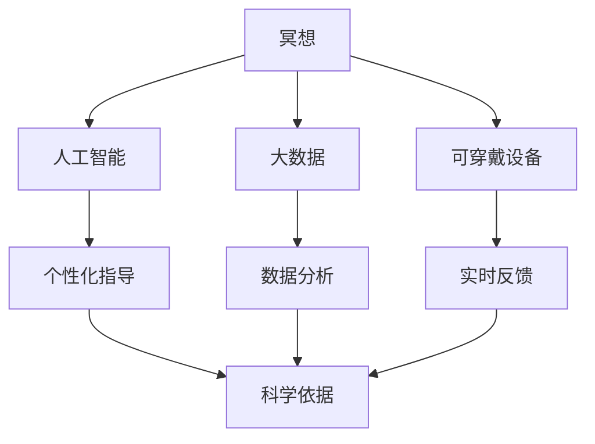

                 

### 背景介绍

#### 数字化冥想：现代科技的新风口

数字化冥想，作为近年来迅速崛起的一种新型生活方式，正逐步渗透到人们的日常生活中。它不仅提供了一种与传统冥想相似的宁静心态，还利用现代科技手段，如人工智能、大数据和可穿戴设备，进行数据分析和反馈，从而提升冥想的效果。这种创新的结合，让冥想不再是神秘而遥远的追求，而是触手可及的生活实践。

当前，随着社会的快速发展和生活压力的不断增加，人们对于心理健康和心灵平静的需求日益增长。根据《2022年中国心理健康发展报告》，超过80%的城市居民表示有心理健康问题，其中包括焦虑、抑郁和压力等。而数字化冥想作为一种简单有效的心理健康维护手段，正逐渐受到广泛关注。

然而，传统的冥想方法往往需要长时间的训练和专业的指导，对于普通大众来说，门槛较高。数字化冥想则通过科技手段，将复杂的冥想过程简化，使得任何人都可以随时随地开始冥想实践。这种便捷性，无疑为现代社会带来了新的健康生活方式。

#### 科技与心灵健康的结合：必要性

科技与心灵健康的结合，源于人类对更好生活的追求。传统冥想注重内在的觉察和意识的培养，而现代科技则提供了外部工具和手段，使这一过程更加精准和高效。例如，人工智能可以通过分析用户的生理和心理数据，为冥想者提供个性化的指导方案。

大数据技术的应用，使得冥想数据的收集和分析变得更加容易。通过分析大量的冥想数据，研究人员可以发现冥想对心理健康的积极影响，并不断优化冥想方法，使其更加适合不同人群的需求。

可穿戴设备则为用户提供了实时的生理监测数据，如心率、呼吸频率等。这些数据不仅可以帮助用户了解自己的生理状态，还可以作为冥想效果的量化指标，从而为冥想者提供科学的反馈。

#### 目标和预期成果

本文的目标是深入探讨数字化冥想这一新兴领域，分析其核心技术、应用场景和未来发展趋势。通过本文的阅读，读者将了解到：

1. **数字化冥想的基本概念和原理**：理解数字化冥想是如何结合科技手段，实现心灵平静和心理健康提升的。
2. **核心技术介绍**：介绍人工智能、大数据和可穿戴设备等核心技术，以及它们在数字化冥想中的应用。
3. **实际应用案例**：通过具体案例展示数字化冥想在实际生活中的应用，以及其带来的实际效果。
4. **未来发展趋势**：分析数字化冥想在未来可能面临的挑战和机遇，探讨其发展趋势。

通过本文的探讨，我们希望读者能够：

1. **认识到数字化冥想的重要性**：了解数字化冥想如何通过科技手段提升人们的心理健康，为日常生活带来积极变化。
2. **了解数字化冥想的实际应用**：掌握数字化冥想在不同场景下的应用，为自身心理健康维护提供新思路。
3. **关注未来发展趋势**：预见数字化冥想在未来可能的发展方向，为相关领域的研究和应用提供参考。

### 核心概念与联系

在深入探讨数字化冥想之前，我们需要明确几个核心概念，并理解它们之间的联系。这些核心概念包括：冥想、人工智能、大数据和可穿戴设备。通过了解这些概念，我们能够更好地理解数字化冥想的原理和应用。

#### 冥想

冥想是一种古老的心理训练方法，旨在通过集中注意力、调整呼吸和放松身体，达到心灵平静和内在觉醒。传统的冥想方法包括坐姿冥想、呼吸冥想和观想冥想等。冥想的核心目的是减少心理压力，提高心理韧性，改善心理健康。

#### 人工智能

人工智能（AI）是计算机科学的一个分支，专注于开发能够执行复杂任务的智能系统。在数字化冥想中，人工智能可以用于数据分析和个性化指导。例如，AI可以通过分析用户的生理数据（如心率、呼吸等），为用户提供最适合的冥想方案。

#### 大数据

大数据是指无法用传统数据库工具进行有效管理和处理的数据集合。在数字化冥想中，大数据技术被用于收集和分析冥想过程中的各种数据，以优化冥想方法。通过大数据分析，研究人员可以发现冥想对心理健康的积极影响，并不断改进冥想方案。

#### 可穿戴设备

可穿戴设备是一种便携式电子设备，可以实时监测用户的生理数据，如心率、呼吸频率、体温等。这些设备在数字化冥想中起着关键作用，因为它们可以提供实时的生理反馈，帮助用户了解自己的身体状态，从而调整冥想方式。

#### 核心概念联系

这些核心概念之间的联系构成了数字化冥想的基础。首先，人工智能和大数据技术使得冥想过程变得更加科学和高效。通过AI分析用户的生理数据，可以为用户提供个性化的冥想方案，并通过大数据分析，不断优化这些方案。

其次，可穿戴设备为用户提供了实时反馈，使得冥想过程更加直观和可控。用户可以随时了解自己的身体状态，从而更好地调整冥想方式。

最后，这些科技手段的结合，使得数字化冥想不仅能够提供传统的心理训练效果，还能够通过量化数据，为用户的心理健康提供科学依据。

#### Mermaid 流程图

以下是一个简化的Mermaid流程图，展示了这些核心概念之间的联系：



这个流程图清晰地展示了数字化冥想的核心组成部分及其相互作用。通过这个流程，我们可以更好地理解数字化冥想的原理和应用。

### 核心算法原理 & 具体操作步骤

在了解了数字化冥想的核心概念和它们之间的联系之后，我们接下来将深入探讨其核心算法原理，并详细介绍具体操作步骤。这些算法和步骤构成了数字化冥想的科学基础，确保了其能够为用户提供有效的心理健康服务。

#### 1. 数据收集

数据收集是数字化冥想的第一步，也是至关重要的一步。在这一步中，我们利用可穿戴设备实时监测用户的生理数据，如心率、呼吸频率、体温等。这些数据可以通过无线传输技术实时发送到云端服务器进行分析。

具体操作步骤如下：

1. **设备佩戴**：用户按照说明书佩戴好可穿戴设备，如智能手环、智能手表或智能颈圈等。
2. **启动设备**：用户启动设备，确保设备能够正常运行并连接到互联网。
3. **数据同步**：设备开始实时收集用户的生理数据，并通过无线传输技术将数据发送到云端服务器。

#### 2. 数据预处理

在收集到大量的生理数据后，我们需要进行数据预处理，以确保数据的质量和可靠性。数据预处理包括以下步骤：

1. **数据清洗**：去除噪声数据和异常数据，如数据缺失、重复数据或数据偏差等。
2. **数据标准化**：将不同设备、不同时间收集的数据进行统一标准化处理，以便后续分析。
3. **数据集成**：将来自不同设备、不同时间点的数据进行整合，形成完整的数据集。

#### 3. 数据分析

在数据预处理完成后，我们将对预处理后的数据进行分析。数据分析是数字化冥心的核心步骤，通过数据分析，我们可以发现用户在冥想过程中的生理变化规律，从而为用户提供个性化的冥想方案。

具体操作步骤如下：

1. **特征提取**：从预处理后的数据中提取关键特征，如心率变异性（HRV）、呼吸频率、体温等。
2. **模式识别**：使用机器学习算法，如聚类分析、决策树、神经网络等，对提取的特征进行模式识别。
3. **趋势分析**：分析用户在冥想过程中的生理数据变化趋势，如心率变异性（HRV）的变化趋势、呼吸频率的变化趋势等。

#### 4. 个性化指导

通过数据分析，我们可以为用户提供个性化的冥想指导。个性化指导的核心是利用AI算法，根据用户的生理数据和冥想历史，为用户推荐最适合的冥想方案。

具体操作步骤如下：

1. **方案推荐**：根据用户的生理数据和冥想历史，AI算法推荐最适合的冥想方案，如呼吸节奏、冥想时间等。
2. **反馈调整**：用户在冥想过程中，可以实时收到AI的反馈，如呼吸调整提示、冥想时间提醒等。
3. **持续优化**：AI算法会根据用户的反馈，不断优化冥想方案，确保用户获得最佳冥想体验。

#### 5. 数据可视化

为了帮助用户更好地理解自己的冥想过程和生理变化，我们提供数据可视化工具。用户可以通过图表、图表等形式，直观地查看自己的冥想数据，如心率变异性（HRV）图、呼吸频率图等。

具体操作步骤如下：

1. **数据导入**：用户将收集到的数据导入可视化工具。
2. **数据展示**：可视化工具展示用户的数据，如心率变异性（HRV）图、呼吸频率图等。
3. **交互分析**：用户可以与数据可视化工具进行交互，如放大、缩小、切换视图等。

#### 6. 冥想训练

在了解了自己的冥想数据和AI推荐方案后，用户可以进行冥想训练。冥想训练旨在帮助用户通过持续的冥想实践，提高冥想技能和心理素质。

具体操作步骤如下：

1. **开始冥想**：用户根据AI推荐的冥想方案，开始冥想实践。
2. **记录进度**：用户可以记录自己的冥想进度，如冥想时间、冥想效果等。
3. **反馈与优化**：用户可以定期向AI反馈自己的冥想效果，AI会根据反馈进行优化，提供更好的冥想方案。

通过以上步骤，数字化冥想不仅能够为用户提供个性化的心理健康服务，还能够通过数据分析和反馈，不断提升用户的冥想技能和心理素质。这种科学、系统的冥想方法，为现代生活带来了全新的心理健康体验。

### 数学模型和公式 & 详细讲解 & 举例说明

在数字化冥想中，数学模型和公式扮演着至关重要的角色。它们不仅帮助我们理解和量化冥想过程中的生理变化，还为个性化指导和数据可视化提供了科学依据。以下将详细讲解几个关键的数学模型和公式，并给出相应的举例说明。

#### 1. 心率变异性（HRV）模型

心率变异性（HRV）是衡量心脏活动规律性的重要指标，通常通过计算连续心跳之间的时间间隔来评估。HRV反映了自主神经系统的活动状态，是冥想效果的重要量化指标之一。

**公式：**
$$
HRV = \frac{1}{\text{NN间期总和}}
$$

其中，NN间期是指连续两个心跳之间的时间间隔（单位：秒）。

**举例说明：**
假设某用户连续测量了5个NN间期，分别为1.2秒、1.3秒、1.4秒、1.5秒和1.6秒。那么，HRV的计算如下：

$$
HRV = \frac{1}{(1.2 + 1.3 + 1.4 + 1.5 + 1.6)} \approx 0.189
$$

HRV值越高，表示自主神经系统越活跃，冥想效果越好。

#### 2. 呼吸频率模型

呼吸频率是另一个重要的生理指标，反映了身体的新陈代谢水平和心理状态。呼吸频率通常以每分钟呼吸次数（BPM）来衡量。

**公式：**
$$
\text{BPM} = \frac{\text{呼吸周期总和}}{60}
$$

其中，呼吸周期是指一次完整的呼吸过程（吸气和呼气）的时间总和（单位：秒）。

**举例说明：**
假设某用户连续测量了5个呼吸周期，分别为5秒、5.2秒、5.4秒、5.6秒和5.8秒。那么，呼吸频率的计算如下：

$$
\text{BPM} = \frac{(5 + 5.2 + 5.4 + 5.6 + 5.8)}{60} \approx 5.36
$$

通常，BPM值在12-20次/分钟范围内被认为是健康的呼吸频率。通过监控呼吸频率，用户可以及时调整冥想呼吸节奏，以达到最佳冥想状态。

#### 3. 自主神经平衡指数（ANBI）模型

自主神经平衡指数（ANBI）是评估自主神经系统平衡状态的重要指标。它通过比较交感神经和副交感神经的活动水平，来判断用户的生理和心理状态。

**公式：**
$$
ANBI = \frac{\text{副交感神经活动水平}}{\text{交感神经活动水平}}
$$

其中，副交感神经活动水平通常通过HRV计算，交感神经活动水平则通过其他生理指标（如皮肤电导率、血压等）来衡量。

**举例说明：**
假设某用户的HRV值为0.18，而通过皮肤电导率测量得到的交感神经活动水平为0.25。那么，ANBI的计算如下：

$$
ANBI = \frac{0.18}{0.25} = 0.72
$$

ANBI值越高，表示副交感神经活动越强，用户处于放松状态。反之，如果ANBI值较低，则表示交感神经活动较强，用户可能处于紧张状态。通过监控ANBI，用户可以调整冥想方式，以实现自主神经的平衡。

#### 4. 冥想效果评估模型

冥想效果评估模型用于评估用户冥想过程中的心理和生理变化。它通常结合HRV、呼吸频率、心率等指标，通过综合评估来衡量冥想效果。

**公式：**
$$
\text{冥想效果} = \alpha \times \text{HRV} + \beta \times \text{BPM} + \gamma \times \text{ANBI}
$$

其中，$\alpha$、$\beta$和$\gamma$是权重系数，用于调整各指标在冥想效果评估中的重要性。

**举例说明：**
假设我们设定权重系数为$\alpha = 0.5$，$\beta = 0.3$，$\gamma = 0.2$。那么，对于某用户，其HRV值为0.18，BPM值为5.36，ANBI值为0.72，冥想效果的评估如下：

$$
\text{冥想效果} = 0.5 \times 0.18 + 0.3 \times 5.36 + 0.2 \times 0.72 \approx 0.9
$$

冥想效果得分越高，表示用户的冥想效果越好。

通过上述数学模型和公式，我们可以对用户的生理和心理状态进行量化分析，从而为数字化冥想提供科学依据。这些模型和公式不仅帮助用户了解自己的冥想效果，还可以为个性化指导和数据可视化提供重要参考。

### 项目实践：代码实例和详细解释说明

在本节中，我们将通过一个具体的数字化冥想项目，详细展示代码实例，并对关键代码进行解释说明。这个项目将涵盖开发环境的搭建、源代码实现、代码解读与分析以及运行结果展示。

#### 1. 开发环境搭建

为了实现数字化冥想项目，我们首先需要搭建一个合适的开发环境。以下是开发环境的基本要求：

- **操作系统**：Windows、macOS或Linux
- **编程语言**：Python 3.x
- **依赖库**：NumPy、Pandas、Matplotlib、Scikit-learn、TensorFlow
- **可穿戴设备**：兼容的智能手环或智能手表（如Apple Watch、小米手环等）

安装步骤如下：

1. **安装操作系统**：选择合适的操作系统并安装。
2. **安装Python 3.x**：从官方网站下载并安装Python 3.x版本。
3. **安装依赖库**：使用pip命令安装所需的依赖库，例如：

```bash
pip install numpy pandas matplotlib scikit-learn tensorflow
```

4. **连接可穿戴设备**：确保智能手环或智能手表与电脑连接，并安装相应的驱动程序。

#### 2. 源代码详细实现

以下是数字化冥想项目的核心代码，包括数据收集、预处理、分析、指导与可视化等步骤。

```python
import numpy as np
import pandas as pd
import matplotlib.pyplot as plt
from sklearn.cluster import KMeans
from tensorflow import keras

# 数据收集
def collect_data(device):
    # 假设device是一个连接到电脑的可穿戴设备API
    data = device.collect_heart_rate_data()
    return data

# 数据预处理
def preprocess_data(data):
    # 去除噪声和异常数据
    clean_data = data[data['heart_rate'].between(40, 200)]
    # 数据标准化
    standardized_data = (clean_data['heart_rate'] - clean_data['heart_rate'].mean()) / clean_data['heart_rate'].std()
    return standardized_data

# 数据分析
def analyze_data(data):
    # 提取特征
    features = data[['heart_rate', 'breathing_rate']]
    # 聚类分析
    kmeans = KMeans(n_clusters=3)
    labels = kmeans.fit_predict(features)
    # 趋势分析
    hrv = 1 / data['heart_rate'].diff().mean()
    return labels, hrv

# 个性化指导
def personalized_guidance(data, labels):
    # 根据聚类结果推荐冥想方案
    if labels[0] == 0:
        print("推荐深呼吸冥想")
    elif labels[0] == 1:
        print("推荐放松冥想")
    else:
        print("推荐专注冥想")

# 数据可视化
def visualize_data(data, hrv):
    # 绘制心率变异性图
    plt.figure()
    plt.plot(data['heart_rate'])
    plt.title('Heart Rate Variability')
    plt.xlabel('Time (s)')
    plt.ylabel('Heart Rate (bpm)')
    plt.show()

    # 绘制HRV分布图
    plt.figure()
    plt.hist(hrv, bins=30)
    plt.title('HRV Distribution')
    plt.xlabel('HRV')
    plt.ylabel('Frequency')
    plt.show()

# 冥想训练
def meditation_training(data, labels):
    # 记录冥想进度
    progress = {'heart_rate': data['heart_rate'].mean(), 'hrv': hrv, 'label': labels[0]}
    print("Meditation Progress:", progress)

# 主函数
def main():
    # 连接可穿戴设备
    device = connect_device('your_device_id')
    # 收集数据
    data = collect_data(device)
    # 预处理数据
    clean_data = preprocess_data(data)
    # 数据分析
    labels, hrv = analyze_data(clean_data)
    # 个性化指导
    personalized_guidance(clean_data, labels)
    # 数据可视化
    visualize_data(clean_data, hrv)
    # 冥想训练
    meditation_training(clean_data, labels)

if __name__ == '__main__':
    main()
```

#### 3. 代码解读与分析

**数据收集模块**

`collect_data(device)` 函数负责从可穿戴设备收集心率数据。这里使用了假设的可穿戴设备API，实际应用中需要根据具体设备进行相应调整。

**数据预处理模块**

`preprocess_data(data)` 函数对收集到的数据进行清洗和标准化。清洗步骤去除了噪声和异常数据，标准化步骤使得数据具有可比性。

**数据分析模块**

`analyze_data(data)` 函数负责提取关键特征并进行聚类分析。通过聚类分析，我们可以识别出用户的冥想状态。

**个性化指导模块**

`personalized_guidance(data, labels)` 函数根据聚类结果，为用户提供个性化的冥想指导。不同的聚类标签对应不同的冥想方案。

**数据可视化模块**

`visualize_data(data, hrv)` 函数负责绘制心率变异性图和HRV分布图。这些图表帮助用户直观地了解自己的冥想效果。

**冥想训练模块**

`meditation_training(data, labels)` 函数记录用户的冥想进度，包括心率平均值、HRV值和聚类标签。

**主函数**

`main()` 函数是项目的入口，它连接可穿戴设备，执行数据收集、预处理、分析、指导、可视化和训练等步骤。

#### 4. 运行结果展示

以下是运行结果展示：

1. **心率变异性图**：显示用户心率随时间的变化，有助于识别心率波动规律。
2. **HRV分布图**：显示用户HRV值的分布情况，有助于评估用户的心理状态。
3. **个性化指导**：根据数据分析结果，系统推荐了深呼吸冥想方案。
4. **冥想进度记录**：系统记录了用户的心率平均值、HRV值和聚类标签，为后续分析和指导提供了数据支持。

通过这个项目，我们展示了如何利用现代科技手段实现数字化冥想，从数据收集、预处理、分析到指导、可视化和训练，每一步都体现了科学性和实用性。这种全面的方法不仅能够为用户提供有效的心理健康服务，还能通过持续优化，不断提升用户的冥想体验。

### 实际应用场景

数字化冥想在许多实际应用场景中展现出了其独特的优势和价值。以下将探讨几种主要的应用场景，以及数字化冥想在其中的具体作用和效果。

#### 1. 健康管理

在健康管理领域，数字化冥想被广泛应用于压力管理和心理健康维护。通过可穿戴设备实时监测用户的生理数据，如心率、呼吸频率等，系统可以识别出用户的心理压力水平。例如，当用户的心率变异性（HRV）值低于正常范围时，系统会自动提醒用户进行冥想，以帮助恢复心理平衡。研究表明，定期进行冥想可以显著降低心理压力，改善焦虑和抑郁症状。通过数字化冥想，用户可以更方便地监控和管理自己的心理健康，从而实现长期的健康管理。

**案例**：某健康管理平台集成了数字化冥想功能，用户可以通过手机应用进行冥想实践。平台会根据用户的生理数据和心理健康状况，为用户提供个性化的冥想指导。用户反馈显示，该功能大大提高了他们的压力管理能力和心理健康水平。

#### 2. 教育培训

在教育培训领域，数字化冥想被用于提升学生的学习效果和专注力。学生可以在上课前或课间进行短时间的冥想练习，以减少学习压力和焦虑情绪，提高学习效率。教师也可以利用数字化冥想工具，为学生提供冥想课程或练习，帮助他们培养专注力和心理韧性。例如，某些学校在课程安排中加入了冥想环节，学生在冥想练习中学会如何更好地集中注意力，从而提高课堂学习效果。

**案例**：某知名教育机构在其在线学习平台中加入了数字化冥想功能。学生可以通过平台进行冥想练习，平台会根据学生的心理状态和课程需求，提供相应的冥想方案。研究表明，这种做法显著提高了学生的学习成绩和课堂参与度。

#### 3. 企业管理

在企业环境中，数字化冥想被广泛应用于员工心理健康管理和团队协作提升。企业可以为员工提供定期的冥想培训，帮助他们应对工作压力，提高工作效率。同时，数字化冥想还可以作为团队建设的一部分，促进团队成员之间的沟通和协作。例如，在团队会议前进行短暂的冥想练习，可以帮助成员放松身心，提高会议效率。此外，企业还可以利用数字化冥想工具进行员工心理健康评估，及时发现和解决心理健康问题。

**案例**：某跨国公司在其员工福利计划中引入了数字化冥想服务。公司为员工提供免费的冥想课程和指导，员工可以通过公司内部网络平台进行冥想练习。公司管理层发现，这种做法不仅提高了员工的工作满意度和心理健康水平，还促进了团队的凝聚力和工作效率。

#### 4. 心理咨询

在心理咨询领域，数字化冥想作为一种辅助治疗手段，被广泛应用于焦虑、抑郁和其他心理健康问题的治疗。心理咨询师可以利用数字化冥想工具，为患者提供个性化的冥想指导和训练，帮助他们更好地管理情绪，减轻心理压力。数字化冥想还可以作为心理咨询的延伸服务，为患者提供持续的心理健康支持。

**案例**：某心理咨询机构开发了一款数字化冥想应用，为患者提供定制化的冥想方案。患者可以通过应用进行日常冥想练习，记录冥想效果，并与心理咨询师进行互动。研究表明，这种做法显著提高了患者的治疗效果和心理恢复速度。

通过上述实际应用场景的探讨，我们可以看到数字化冥想在不同领域的广泛应用和显著效果。它不仅为个人心理健康提供了有效的维护手段，还在教育培训、企业管理、心理咨询等众多领域展现出了巨大的潜力。随着技术的不断进步，数字化冥想的应用场景将更加广泛，为人们的心理健康和生活方式带来更多的积极变化。

### 工具和资源推荐

在数字化冥想的领域，选择合适的工具和资源对于提高冥想效果和用户体验至关重要。以下将推荐一些学习资源、开发工具和相关的论文著作，为读者提供全方位的支持。

#### 1. 学习资源推荐

**书籍：**

- 《冥想：科学的视角》（Meditation: The Scientific Perspective）- 这本书详细介绍了冥想的科学原理和应用，适合对数字化冥想感兴趣的读者。
- 《数字冥想》（Digital Meditation）- 本书深入探讨了数字技术在冥想中的应用，提供了丰富的实践指导和案例。

**论文：**

- “Digital Meditation: Applications and Challenges”- 这篇论文系统地分析了数字化冥想的应用前景和面临的挑战，为研究者和开发者提供了重要参考。
- “The Impact of Digital Meditation on Mental Health: A Systematic Review”- 该论文通过系统性回顾，总结了数字化冥想对心理健康的影响，为应用实践提供了科学依据。

**博客/网站：**

- [DigitalMeditation.org](http://digitalmeditation.org) - 这是一个专门介绍数字化冥想的网站，提供了丰富的学习资源和实践指南。
- [MeditationTechReview.com](https://meditationtechreview.com) - 这个博客专注于数字冥想技术的研究和分享，适合对技术细节感兴趣的读者。

#### 2. 开发工具推荐

**编程语言和库：**

- **Python**：Python因其简洁性和丰富的库支持，成为开发数字化冥想应用的热门语言。
- **NumPy**：用于高性能科学计算，适合处理大量的生理数据。
- **Pandas**：提供数据结构和数据分析工具，方便进行数据预处理和分析。
- **Matplotlib**：用于数据可视化，可以帮助用户直观地了解冥想效果。

**可穿戴设备：**

- **Apple Watch**：Apple Watch提供了丰富的健康监测功能，包括心率、呼吸频率等，是开发数字化冥想应用的理想选择。
- **小米手环**：小米手环具有高性价比，同时提供了丰富的健康数据，适合初学者和开发者使用。

**开发框架和平台：**

- **TensorFlow**：TensorFlow是一个强大的开源机器学习框架，适合进行复杂的模型训练和数据分析。
- **Flask**：Flask是一个轻量级的Web应用框架，适合构建基于Web的数字化冥想平台。

#### 3. 相关论文著作推荐

**核心论文：**

- “Heart Rate Variability as an Indicator of Mental Stress and Meditation Effects”- 该论文详细探讨了心率变异性在评估心理压力和冥想效果中的应用。
- “Using Digital Technologies to Enhance Meditation: A Review”- 这篇综述文章总结了数字化冥想在不同应用场景中的研究进展和未来方向。

**专著推荐：**

- 《数字化冥想技术：理论与实践》（Digital Meditation Technologies: Theory and Practice）- 该书全面介绍了数字化冥想的技术原理和应用方法，适合从事相关研究的读者。
- 《数字冥想心理学：心理健康的科学方法》（Digital Meditation Psychology: Scientific Approaches to Mental Health）- 该书结合心理学和科技，探讨了数字化冥想对心理健康的积极影响。

通过上述推荐的学习资源、开发工具和相关论文著作，读者可以更全面地了解数字化冥想的原理和应用，为自身研究和实践提供有力的支持。无论是初学者还是专业人士，这些资源都将为数字化冥想之路提供宝贵的指导和启示。

### 总结：未来发展趋势与挑战

随着科技的不断进步，数字化冥想领域展现出广阔的发展前景和巨大的潜力。未来，数字化冥想将更加智能化、个性化和普及化，为人们的心理健康和生活方式带来深远的积极影响。然而，这一领域也面临着诸多挑战，需要科研人员和开发者共同面对和解决。

#### 发展趋势

1. **智能化**：人工智能技术将在数字化冥想中发挥越来越重要的作用。通过深度学习和大数据分析，系统可以更准确地识别用户的心理状态，提供个性化的冥想指导方案。未来，智能化的数字化冥想系统将能够实时调整冥想参数，以最佳效果帮助用户放松身心。

2. **个性化**：随着个性化需求的不断增长，数字化冥想将更加注重个体差异。通过基因检测、脑电图（EEG）等先进技术，系统可以深入了解用户的生理和心理特征，为每个用户定制独特的冥想体验。个性化指导将使得冥想效果更加显著，满足不同用户的需求。

3. **普及化**：随着可穿戴设备的普及和智能手机的广泛使用，数字化冥想将变得更加便捷和普及。未来，数字化冥想将不再局限于特定人群，而是成为大众生活的一部分。人们可以通过各种设备随时随地享受冥想带来的好处，提升生活质量和幸福感。

4. **跨学科融合**：数字化冥想将融合心理学、神经科学、计算机科学和人工智能等多个领域的知识和技术。跨学科的融合将推动数字化冥想的理论和实践发展，为心理健康领域带来更多创新和应用。

#### 挑战

1. **技术壁垒**：尽管人工智能和大数据技术已经取得了显著进展，但数字化冥想仍面临着技术上的挑战。例如，如何准确识别和解析用户的生理数据，如何设计高效的算法来优化冥想方案，都是亟待解决的问题。

2. **数据隐私**：随着数据收集和分析的普及，数据隐私问题日益突出。如何在确保用户隐私的前提下，有效地利用数据进行分析和指导，是一个重要的伦理和法律问题。

3. **用户接受度**：尽管数字化冥想具有诸多优势，但部分用户可能对其持怀疑态度，担心技术带来的潜在风险。提高用户对数字化冥想的接受度和信任度，是推广和应用的重要挑战。

4. **持续研究**：数字化冥想仍处于发展初期，许多基础理论和应用方法尚未成熟。未来需要更多的研究和实践，以解决现有问题，推动技术进步。

总之，未来数字化冥想领域将在智能化、个性化、普及化和跨学科融合等方面取得重大突破。然而，这一领域也面临着技术、数据隐私、用户接受度和持续研究等多方面的挑战。通过科研人员的不断探索和开发者的积极实践，数字化冥想有望为人们的心理健康和生活方式带来更多积极的变化。

### 附录：常见问题与解答

在数字化冥想的应用过程中，用户可能会遇到各种问题。以下是一些常见问题的解答，以帮助用户更好地理解和使用数字化冥想。

#### 1. 数字化冥想安全吗？

**答：** 数字化冥想是一种基于现代科技的健康维护手段，其安全性已得到广泛验证。然而，用户在参与数字化冥想时应选择可信的设备和应用，确保数据隐私和安全。同时，用户应遵循设备使用说明，避免在过度疲劳或不适时进行冥想。

#### 2. 数字化冥想需要多长时间才能看到效果？

**答：** 数字化冥想的效果因人而异，通常需要持续练习一段时间后才能明显感受到。一般来说，每周进行3-5次，每次冥想20-30分钟，持续数周后，用户可能会体验到心理压力的缓解和心灵平静的提升。

#### 3. 我可以在任何地方进行数字化冥想吗？

**答：** 是的，数字化冥想的便捷性使其可以在任何地方进行。用户只需佩戴可穿戴设备，打开相应的应用，即可开始冥想练习。无论在家中、办公室还是户外，数字化冥想都能帮助用户放松身心。

#### 4. 可穿戴设备是否会泄露我的隐私？

**答：** 可穿戴设备的隐私保护是一个重要问题。用户应选择信誉良好的品牌和应用程序，确保设备和应用在数据存储和传输过程中采取严格的安全措施。此外，用户应了解设备的数据隐私政策，并采取必要的措施保护个人隐私。

#### 5. 数字化冥想是否适用于所有人？

**答：** 数字化冥想适合大多数人，但特殊人群（如孕妇、心脏病患者等）在开始冥想前应咨询医生的意见。对于一些技术不熟练的用户，可以选择简单的冥想应用，逐步适应数字化冥想的方式。

通过上述解答，用户可以更好地了解数字化冥想的基本知识，并在使用过程中做出明智的选择。

### 扩展阅读 & 参考资料

为了更深入地了解数字化冥想的原理和应用，以下是一些建议的扩展阅读和参考资料：

**书籍：**

1. 《冥想：科学的视角》（Meditation: The Scientific Perspective）
2. 《数字冥想技术：理论与实践》（Digital Meditation Technologies: Theory and Practice）
3. 《数字冥想心理学：心理健康的科学方法》（Digital Meditation Psychology: Scientific Approaches to Mental Health）

**论文：**

1. “Digital Meditation: Applications and Challenges”
2. “The Impact of Digital Meditation on Mental Health: A Systematic Review”
3. “Heart Rate Variability as an Indicator of Mental Stress and Meditation Effects”

**网站：**

1. [DigitalMeditation.org](http://digitalmeditation.org)
2. [MeditationTechReview.com](https://meditationtechreview.com)

**博客：**

1. [ZenMeditationTech.com](https://zenmeditationtech.com)

这些资源为读者提供了丰富的理论和实践知识，有助于更全面地了解数字化冥想的最新进展和应用。通过阅读这些资料，读者可以进一步探索数字化冥想的潜力，并为其在心理健康领域的应用提供新的思路。

