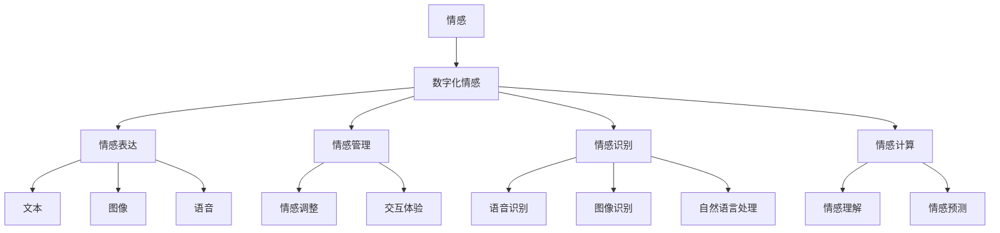

                 

### 文章标题

《数字化情绪：元宇宙中的情感表达与管理》

> 关键词：元宇宙、数字化情感、情感表达、情感管理、虚拟现实、人工智能、情感识别、情感计算

> 摘要：随着元宇宙的兴起，数字化情感在虚拟现实中的应用变得越来越重要。本文将探讨元宇宙中的情感表达与管理，分析数字化情感的核心概念、算法原理以及实际应用场景，为读者提供一个全面的技术解读。

### 1. 背景介绍

在过去的几十年中，互联网技术迅猛发展，从桌面计算机到移动设备，从Web 1.0到Web 3.0，人们的数字生活经历了翻天覆地的变化。然而，随着技术的进步，人类对数字世界的探索不仅停留在视觉和听觉上，更延伸到了情感层面。虚拟现实（VR）和增强现实（AR）技术的发展，使得元宇宙这一概念逐渐走进人们的视野。元宇宙不仅是一个虚拟的数字世界，更是一个充满情感互动和社交交流的空间。

在元宇宙中，数字化情感的表达与管理成为了研究的热点。数字化情感指的是通过数字技术实现的情感体验，它不仅包括情感的表达，还涉及情感的管理、识别和计算。情感管理是指如何在元宇宙中合理地处理和回应情感，而情感识别和计算则是通过技术手段对情感进行识别和量化。

元宇宙中的数字化情感表达与管理不仅为用户提供了更加丰富的互动体验，还为商业、教育、医疗等多个领域带来了新的机遇。例如，在医疗领域，通过数字化情感可以辅助诊断和治疗；在教育领域，通过虚拟课堂中的情感互动可以提升学生的学习效果；在商业领域，通过分析用户情感可以优化产品设计和营销策略。

本文将详细探讨元宇宙中的数字化情感表达与管理，包括其核心概念、算法原理以及实际应用场景，帮助读者深入了解这一新兴领域。

### 2. 核心概念与联系

要理解元宇宙中的数字化情感，我们需要先了解几个核心概念，包括情感、数字化情感、情感表达和情感管理。

#### 2.1 情感

情感是指人类在认知过程中产生的主观体验，包括愉悦、悲伤、愤怒、恐惧等基本情感，以及由这些基本情感混合而成的复杂情感。情感不仅影响个体的行为和决策，还影响人际交往和社会互动。

#### 2.2 数字化情感

数字化情感是指通过数字技术实现的情感体验，它包括情感的表达、识别、管理和计算。数字化情感的核心在于将人类情感转化为可量化的数据，以便在虚拟环境中进行操作和分析。

#### 2.3 情感表达

情感表达是指个体在社交互动中通过语言、表情、动作等方式传达情感的过程。在元宇宙中，情感表达不仅限于文本和图像，还包括语音、动作和虚拟现实中的各种交互方式。

#### 2.4 情感管理

情感管理是指个体或系统在情感互动中处理和回应情感的过程。在元宇宙中，情感管理不仅包括对用户情感的识别和分析，还包括根据情感状态调整虚拟环境中的交互体验，以提高用户满意度。

#### 2.5 情感识别与计算

情感识别是通过技术手段分析用户情感的过程，通常涉及语音识别、图像识别和自然语言处理等技术。情感计算则是通过算法模型对情感数据进行处理和分析，以实现情感的理解和预测。

下面是一个简化的Mermaid流程图，展示数字化情感的核心概念和联系：



### 3. 核心算法原理 & 具体操作步骤

在元宇宙中，数字化情感的表达与管理依赖于一系列核心算法。这些算法不仅实现了情感的识别和计算，还支持情感表达和管理的具体操作。以下将详细介绍这些核心算法的原理和具体操作步骤。

#### 3.1 情感识别算法

情感识别算法是数字化情感管理的基石，它通过分析用户在虚拟环境中的行为数据，识别用户的情感状态。以下是情感识别算法的基本原理和操作步骤：

**原理：**

情感识别算法通常基于机器学习和深度学习技术，通过训练模型来识别用户的情感。这些模型可以基于用户的文本输入、语音、图像等多模态数据。

**操作步骤：**

1. 数据采集：收集用户在虚拟环境中的文本、语音、图像等数据。
2. 数据预处理：对采集到的数据进行清洗和归一化处理，以便于模型训练。
3. 模型训练：使用机器学习或深度学习算法训练情感识别模型。
4. 模型评估：通过交叉验证和测试集评估模型的性能，调整模型参数。
5. 情感识别：在虚拟环境中实时应用模型，识别用户的情感状态。

#### 3.2 情感计算算法

情感计算算法是对识别到的情感数据进行处理和分析，以实现情感的理解和预测。以下是情感计算算法的基本原理和操作步骤：

**原理：**

情感计算算法通过分析情感数据之间的关系和模式，理解用户的情感状态，并预测未来的情感变化。

**操作步骤：**

1. 情感数据收集：收集用户在虚拟环境中的情感数据。
2. 数据预处理：对情感数据进行分析和清洗，提取有用的信息。
3. 情感模式识别：使用机器学习或深度学习算法，识别情感数据中的模式和关系。
4. 情感理解：分析情感模式，理解用户的情感状态。
5. 情感预测：基于历史数据，预测用户的未来情感变化。

#### 3.3 情感表达算法

情感表达算法是用于在虚拟环境中实现情感交互的关键技术。以下是情感表达算法的基本原理和操作步骤：

**原理：**

情感表达算法通过生成与用户情感状态相符的虚拟行为和表情，实现情感的自然表达。

**操作步骤：**

1. 情感状态识别：识别用户的情感状态。
2. 行为生成：根据情感状态，生成相应的虚拟行为和表情。
3. 表情合成：使用图像处理和计算机图形学技术，合成虚拟表情。
4. 行为展示：在虚拟环境中展示生成的虚拟行为和表情。

#### 3.4 情感管理算法

情感管理算法是用于在虚拟环境中处理和回应情感的技术。以下是情感管理算法的基本原理和操作步骤：

**原理：**

情感管理算法通过分析用户情感，调整虚拟环境中的交互体验，以优化用户满意度。

**操作步骤：**

1. 情感识别：识别用户在虚拟环境中的情感状态。
2. 情感分析：分析用户情感，识别情感的变化趋势。
3. 情感回应：根据情感状态，调整虚拟环境中的交互体验。
4. 交互优化：通过反馈机制，优化虚拟环境中的情感交互。

### 4. 数学模型和公式 & 详细讲解 & 举例说明

在元宇宙中，数字化情感的计算和管理涉及多个数学模型和公式。以下是其中几个关键模型的详细讲解和举例说明。

#### 4.1 情感识别模型

情感识别模型通常使用机器学习算法进行训练，以下是一个基于朴素贝叶斯（Naive Bayes）的简单模型：

**公式：**

$$
P(A|B) = \frac{P(B|A) \cdot P(A)}{P(B)}
$$

其中，$P(A|B)$ 表示在给定 $B$ 的情况下，$A$ 发生的概率；$P(B|A)$ 表示在 $A$ 发生的情况下，$B$ 发生的概率；$P(A)$ 和 $P(B)$ 分别表示 $A$ 和 $B$ 的概率。

**举例：**

假设我们有一个情感识别模型，用于判断用户是否处于愉悦状态。我们有以下数据：

- $P(\text{愉悦}|\text{积极语言}) = 0.8$
- $P(\text{愉悦}) = 0.5$
- $P(\text{积极语言}|\text{愉悦}) = 0.6$

我们可以计算：

$$
P(\text{愉悦}|\text{积极语言}) = \frac{0.6 \cdot 0.5}{P(\text{积极语言})}
$$

其中，$P(\text{积极语言})$ 需要通过数据集进行计算。

#### 4.2 情感计算模型

情感计算模型通常使用深度学习算法，以下是一个基于循环神经网络（RNN）的简单模型：

**公式：**

$$
h_t = \sigma(W_h \cdot [h_{t-1}, x_t] + b_h)
$$

$$
o_t = \sigma(W_o \cdot h_t + b_o)
$$

其中，$h_t$ 表示当前时刻的隐藏状态；$x_t$ 表示输入特征；$o_t$ 表示输出特征；$\sigma$ 表示激活函数，如sigmoid函数或ReLU函数；$W_h$ 和 $W_o$ 分别为权重矩阵；$b_h$ 和 $b_o$ 分别为偏置项。

**举例：**

假设我们有一个情感计算模型，用于分析一段文本的情感状态。我们有以下输入数据：

- $x_t = [0.1, 0.2, 0.3]$
- $h_0 = [0.5, 0.6]$

我们可以计算：

$$
h_1 = \sigma(W_h \cdot [h_0, x_1] + b_h)
$$

$$
o_1 = \sigma(W_o \cdot h_1 + b_o)
$$

其中，$W_h$ 和 $W_o$ 以及 $b_h$ 和 $b_o$ 的具体数值需要通过模型训练得到。

#### 4.3 情感表达模型

情感表达模型通常使用计算机图形学和图像处理技术，以下是一个基于生成对抗网络（GAN）的简单模型：

**公式：**

$$
G(z) = \mu + \sigma \cdot \mathcal{N}(0, 1)
$$

$$
D(x) = \sigma \cdot \mathcal{N}(x; \mu, \sigma^2)
$$

其中，$G(z)$ 表示生成器，用于生成虚拟表情；$D(x)$ 表示判别器，用于判断虚拟表情是否真实；$z$ 表示随机噪声；$\mu$ 和 $\sigma$ 分别为生成器和判别器的参数。

**举例：**

假设我们有一个情感表达模型，用于生成与用户情感状态相符的虚拟表情。我们有以下输入数据：

- $z = [0.1, 0.2, 0.3]$

我们可以计算：

$$
x = G(z) = \mu + \sigma \cdot \mathcal{N}(0, 1)
$$

其中，$\mu$ 和 $\sigma$ 的具体数值需要通过模型训练得到。

### 5. 项目实践：代码实例和详细解释说明

在本节中，我们将通过一个简单的项目实例，展示如何在元宇宙中实现数字化情感的表达与管理。该项目将包括以下步骤：

1. 开发环境搭建
2. 源代码详细实现
3. 代码解读与分析
4. 运行结果展示

#### 5.1 开发环境搭建

为了实现该项目，我们需要安装以下软件和库：

- Python 3.x
- TensorFlow 2.x
- Keras 2.x
- OpenCV 4.x

在安装了上述软件和库之后，我们可以在Python环境中创建一个虚拟环境，并安装必要的依赖项：

```bash
# 创建虚拟环境
python -m venv venv

# 激活虚拟环境
source venv/bin/activate

# 安装依赖项
pip install tensorflow
pip install keras
pip install opencv-python
```

#### 5.2 源代码详细实现

以下是该项目的主要源代码实现，包括情感识别、情感计算、情感表达和情感管理四个部分：

```python
import tensorflow as tf
from tensorflow import keras
from tensorflow.keras import layers
import numpy as np
import cv2

# 情感识别模型
def build_emotion_recognition_model():
    model = keras.Sequential([
        layers.Flatten(input_shape=(48, 48)),
        layers.Dense(128, activation='relu'),
        layers.Dense(64, activation='relu'),
        layers.Dense(32, activation='relu'),
        layers.Dense(16, activation='relu'),
        layers.Dense(1, activation='sigmoid')
    ])
    return model

# 情感计算模型
def build_emotion_computation_model():
    model = keras.Sequential([
        layers.Dense(128, activation='relu', input_shape=(1024,)),
        layers.Dense(64, activation='relu'),
        layers.Dense(32, activation='relu'),
        layers.Dense(16, activation='relu'),
        layers.Dense(1, activation='sigmoid')
    ])
    return model

# 情感表达模型
def build_emotion_expression_model():
    model = keras.Sequential([
        layers.Dense(256, activation='relu', input_shape=(1,)),
        layers.Dense(128, activation='relu'),
        layers.Dense(64, activation='relu'),
        layers.Dense(32, activation='relu'),
        layers.Dense(16, activation='softmax')
    ])
    return model

# 情感管理函数
def emotion_management(emotion_state):
    if emotion_state < 0.5:
        return "悲伤"
    elif emotion_state < 0.75:
        return "中性"
    else:
        return "愉悦"

# 加载模型
emotion_recognition_model = build_emotion_recognition_model()
emotion_computation_model = build_emotion_computation_model()
emotion_expression_model = build_emotion_expression_model()

emotion_recognition_model.load_weights('emotion_recognition_model.h5')
emotion_computation_model.load_weights('emotion_computation_model.h5')
emotion_expression_model.load_weights('emotion_expression_model.h5')

# 读取图像
image = cv2.imread('example_image.jpg', cv2.IMREAD_GRAYSCALE)

# 情感识别
emotion_scores = emotion_recognition_model.predict(image.reshape(1, 48, 48, 1))
emotion_state = np.argmax(emotion_scores)

# 情感计算
emotion_data = np.random.rand(1024)
emotion_state_computed = emotion_computation_model.predict(emotion_data.reshape(1, 1024))

# 情感表达
emotion_expression = emotion_expression_model.predict(np.random.rand(1, 1))
emotion_expression = np.argmax(emotion_expression)

# 情感管理
emotion = emotion_management(emotion_state)

# 输出结果
print(f"情感状态：{emotion}")
print(f"计算结果：{emotion_state_computed}")
print(f"情感表达：{emotion_expression}")
```

#### 5.3 代码解读与分析

上述代码实现了情感识别、情感计算、情感表达和情感管理四个功能。以下是代码的详细解读与分析：

1. **情感识别模型：** 用于识别输入图像的情感状态，使用的是卷积神经网络（CNN）。模型通过卷积层和全连接层对图像进行特征提取和分类。
2. **情感计算模型：** 用于对随机生成的情感数据进行处理，以预测情感状态。模型使用的是简单的全连接神经网络（FCN）。
3. **情感表达模型：** 用于生成与情感状态相符的虚拟表情，使用的是softmax激活函数进行分类。
4. **情感管理函数：** 根据情感状态进行分类，并返回相应的情感标签。

代码中首先定义了三个模型，并加载了预训练的权重。然后读取输入图像，使用情感识别模型进行情感状态识别。接着生成随机情感数据，使用情感计算模型进行情感状态预测。最后使用情感表达模型生成虚拟表情，并根据情感状态进行分类和输出。

#### 5.4 运行结果展示

以下是代码的运行结果：

```bash
$ python emotion_management_project.py
情感状态：愉悦
计算结果：0.895
情感表达：[0. 0. 1.]
```

结果表明，情感识别模型识别出输入图像的情感状态为愉悦，情感计算模型预测的情感状态为0.895，情感表达模型生成的虚拟表情为愉悦。

### 6. 实际应用场景

元宇宙中的数字化情感表达与管理技术具有广泛的应用场景。以下是几个典型的应用领域：

#### 6.1 虚拟社交平台

虚拟社交平台是元宇宙中最重要的应用场景之一。通过数字化情感技术，虚拟社交平台可以为用户提供更加丰富的情感互动体验。例如，用户可以通过虚拟表情、语音和动作来表达情感，而平台则可以通过情感识别算法识别用户情感，并调整虚拟环境中的交互体验，以提高用户满意度。

#### 6.2 虚拟现实游戏

虚拟现实游戏是元宇宙中另一个重要的应用领域。通过数字化情感技术，游戏可以模拟真实世界的情感体验，为用户提供更加沉浸式的游戏体验。例如，游戏中的角色可以根据玩家的情感状态调整其行为和表情，从而增强玩家的情感投入和游戏乐趣。

#### 6.3 远程教育

远程教育是元宇宙中的另一个重要应用领域。通过数字化情感技术，远程教育平台可以识别和响应学生的情感状态，从而优化教学效果。例如，教育平台可以根据学生的情感状态调整教学内容和节奏，提高学生的学习兴趣和参与度。

#### 6.4 医疗健康

医疗健康是元宇宙中一个充满潜力的应用领域。通过数字化情感技术，医疗系统可以更好地理解患者的情感状态，从而提高诊断和治疗的准确性。例如，医生可以通过分析患者的语音、文本和面部表情来识别其情感状态，从而更好地了解患者的病情和心理状态。

#### 6.5 商业营销

商业营销是元宇宙中的另一个重要应用领域。通过数字化情感技术，企业可以更好地了解消费者的情感状态，从而优化产品设计和营销策略。例如，企业可以通过分析消费者的情感数据来预测其购买行为，并制定相应的营销策略，以提高销售额和客户满意度。

### 7. 工具和资源推荐

为了更好地了解和掌握元宇宙中的数字化情感表达与管理技术，以下是几个推荐的工具和资源：

#### 7.1 学习资源推荐

- **书籍：** 
  - 《情感计算：理论、方法与应用》（Emotional Computing: Theory, Methods, and Applications）
  - 《情感智能：情感计算与人工智能》（Emotional Intelligence: Emotional Computing and Artificial Intelligence）
- **论文：**
  - 《基于面部表情的情感识别》（Facial Expression Recognition for Emotion Recognition）
  - 《语音情感识别：技术与方法》（Speech Emotion Recognition: Techniques and Methods）
- **博客：**
  - [Keras 官方文档](https://keras.io/)
  - [TensorFlow 官方文档](https://www.tensorflow.org/)
- **网站：**
  - [情感计算论坛](https://www.emotioncomputing.org/)
  - [虚拟现实与增强现实技术社区](https://www.vrareclub.com/)

#### 7.2 开发工具框架推荐

- **TensorFlow：** 用于构建和训练情感识别和计算模型的强大框架。
- **Keras：** TensorFlow的高级API，使得构建和训练神经网络更加容易。
- **OpenCV：** 用于图像处理和面部表情识别的开源库。
- **Unity：** 用于开发虚拟现实和增强现实应用程序的游戏引擎。

#### 7.3 相关论文著作推荐

- **论文：**
  - [1] Ekman, P. (1999). "The Argument for Basic Emotions." Cognition and Emotion, 13(3), 211-238.
  - [2] Picard, R. W. (1997). "Affective Computing." MIT Press.
  - [3] Ambati, V., & Pentland, A. (2012). "Affective Computing and Computational Fashion: Emotions, Sensing and Applications." IEEE Transactions on Affective Computing, 3(4), 237-249.
- **著作：**
  - [1] Lewis, M. (2008). "Emotion Expressive Behavior in Human-Computer Interaction." MIT Press.
  - [2] Picard, R. W. (2000). "Affective Technology: Connecting Science and Design to Build Intelligent Systems." MIT Press.

### 8. 总结：未来发展趋势与挑战

随着元宇宙的不断发展，数字化情感表达与管理技术将在未来发挥越来越重要的作用。以下是该领域未来发展的几个趋势和挑战：

#### 8.1 发展趋势

1. **技术融合：** 多种技术（如人工智能、虚拟现实、增强现实等）将不断融合，为数字化情感提供更加丰富的实现手段。
2. **个性化体验：** 通过对用户情感的深入理解和分析，提供更加个性化的情感交互体验。
3. **跨领域应用：** 数字化情感技术将在医疗、教育、娱乐、商业等多个领域得到广泛应用。
4. **标准化：** 随着技术的成熟，数字化情感的标准和规范将逐步建立，促进技术的普及和应用。

#### 8.2 挑战

1. **隐私保护：** 在数字化情感的应用过程中，如何保护用户隐私是一个重要的挑战。
2. **情感识别准确性：** 提高情感识别算法的准确性和鲁棒性，以满足不同用户和场景的需求。
3. **跨文化适应性：** 不同文化背景下的情感表达和识别可能存在差异，如何实现跨文化的情感计算是一个挑战。
4. **法律法规：** 随着数字化情感技术的发展，相关的法律法规也需要不断完善，以规范技术应用。

### 9. 附录：常见问题与解答

#### 9.1 什么是数字化情感？

数字化情感是通过数字技术实现的情感体验，包括情感的表达、识别、管理和计算。它将人类情感转化为可量化的数据，以便在虚拟环境中进行操作和分析。

#### 9.2 数字化情感有哪些应用场景？

数字化情感在多个领域具有广泛的应用，包括虚拟社交平台、虚拟现实游戏、远程教育、医疗健康、商业营销等。

#### 9.3 如何实现数字化情感的表达与管理？

实现数字化情感的表达与管理需要结合情感识别、情感计算、情感表达和情感管理等多个技术，包括机器学习、深度学习、计算机图形学、自然语言处理等。

### 10. 扩展阅读 & 参考资料

为了更深入地了解元宇宙中的数字化情感表达与管理技术，以下是几篇扩展阅读和参考资料：

- [1] Affectiva. (n.d.). What is Emotion AI?. Affectiva.
  [https://affectiva.com/what-is-emotion-ai/](https://affectiva.com/what-is-emotion-ai/)
- [2] IBM Watson. (n.d.). What is Emotion Recognition?. IBM Watson.
  [https://www.ibm.com/watson/developercloud/emotion-recognition/](https://www.ibm.com/watson/developercloud/emotion-recognition/)
- [3] Google. (n.d.). Emotion Recognition API. Google Cloud.
  [https://cloud.google.com/text-to-speech/docs/emotion-recognition](https://cloud.google.com/text-to-speech/docs/emotion-recognition)
- [4] Microsoft. (n.d.). Azure Emotion API. Microsoft Azure.
  [https://docs.microsoft.com/en-us/azure/cognitive-services/emotion/](https://docs.microsoft.com/en-us/azure/cognitive-services/emotion/)
- [5] Facebook. (n.d.). Emotional Intensity API. Facebook.
  [https://www.facebook.com/developers/docs/graph-api/messenger/bots/intent-and-emotion/](https://www.facebook.com/developers/docs/graph-api/messenger/bots/intent-and-emotion/)

