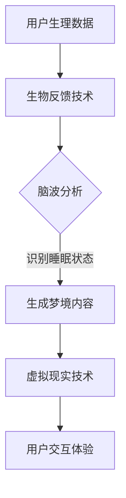
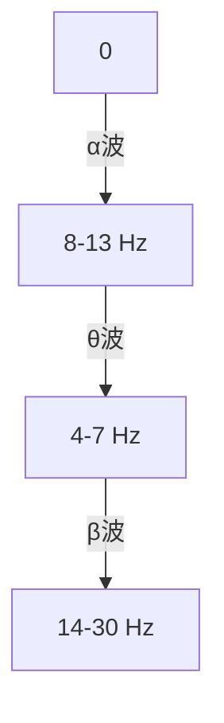

                 

### 文章标题：数字化梦境：AI生成的睡眠体验

#### 关键词：
- 数字化梦境
- AI生成
- 睡眠体验
- 人工智能
- 生物反馈
- 脑波
- 虚拟现实

#### 摘要：
本文将探讨数字化梦境这一前沿技术，通过人工智能（AI）生成独特的睡眠体验。我们将深入分析这一概念的定义、技术原理、应用场景以及未来发展的趋势与挑战。文章旨在为读者提供一个全面而详尽的指南，了解数字化梦境如何改变我们的睡眠模式，提升整体生活质量。

## 1. 背景介绍

随着科技的迅猛发展，人工智能（AI）已成为当今世界最热门的领域之一。从自动驾驶汽车到智能家居，AI的广泛应用正在深刻地改变我们的生活方式。而睡眠作为人类生活的重要组成部分，也逐渐成为AI技术关注的焦点。

睡眠是人类生理和心理恢复的关键时期，良好的睡眠质量对健康至关重要。然而，随着生活节奏的加快和工作压力的增大，越来越多的人面临着失眠、焦虑和睡眠质量下降的问题。传统的睡眠改善方法，如调整作息时间、改善睡眠环境、服用安眠药物等，往往效果有限，且存在一定的副作用。

数字化梦境作为一种新兴的睡眠技术，通过AI生成独特的梦境体验，有望为改善睡眠质量提供新的解决方案。本文将详细探讨这一技术的原理、实现和应用，帮助读者了解数字化梦境的奥秘。

## 2. 核心概念与联系

### 数字化梦境的定义

数字化梦境，顾名思义，是将梦境这一主观体验通过数字技术进行模拟和生成。具体来说，数字化梦境利用人工智能算法，根据用户的生理、心理状态以及生活习惯，生成符合个体需求的独特梦境。

### 关键技术原理

#### 生物反馈技术

生物反馈技术是一种通过测量和分析人体生理信号，如脑波、心率、呼吸等，来帮助用户调整和改善生理状态的方法。在数字化梦境中，生物反馈技术用于收集用户的生理数据，作为AI算法的输入。

#### 脑波分析

脑波是大脑活动的一种表现形式，不同类型的脑波对应不同的心理状态。通过脑波分析，AI算法可以识别用户的睡眠状态，如浅睡眠、深睡眠和快速眼动（REM）睡眠等，进而生成相应的梦境内容。

#### 虚拟现实技术

虚拟现实（VR）技术通过模拟三维环境，为用户提供沉浸式的体验。在数字化梦境中，VR技术用于实现梦境的视觉和听觉效果，使梦境体验更加真实和生动。

### Mermaid 流程图



### 2.1 数字化梦境的工作流程

数字化梦境的工作流程可以分为以下几个步骤：

1. **数据采集**：通过传感器和生物反馈设备收集用户的生理数据，如脑波、心率、呼吸等。
2. **数据处理**：对采集到的生理数据进行预处理，去除噪声和干扰，提取关键特征。
3. **脑波分析**：利用机器学习算法对预处理后的生理数据进行脑波分析，识别用户的睡眠状态。
4. **梦境内容生成**：根据用户的睡眠状态和个性化需求，AI算法生成独特的梦境内容。
5. **梦境体验**：通过虚拟现实技术，将生成的梦境内容呈现给用户，实现沉浸式的梦境体验。

## 3. 核心算法原理 & 具体操作步骤

### 3.1 数据采集与预处理

#### 数据采集

数字化梦境的数据采集主要依赖于生物反馈设备和传感器。常见的传感器包括脑电图（EEG）、心率传感器、呼吸传感器等。这些传感器可以将用户的生理信号实时传输到计算机系统中。

#### 数据预处理

数据预处理是数字化梦境中至关重要的一步。其目的是去除噪声和干扰，提取关键特征。常用的预处理方法包括滤波、去噪、特征提取等。

1. **滤波**：通过滤波器去除生理信号中的高频和低频噪声。
2. **去噪**：利用信号处理技术，如小波变换、主成分分析（PCA）等，去除噪声信号。
3. **特征提取**：从预处理后的生理信号中提取关键特征，如脑波频率、振幅等。

### 3.2 脑波分析与睡眠状态识别

脑波分析是数字化梦境的核心技术之一。通过分析脑波的频率和振幅，AI算法可以识别用户的睡眠状态。常见的睡眠状态包括浅睡眠、深睡眠和快速眼动（REM）睡眠。

1. **脑波频率分析**：根据不同类型的脑波频率范围，将用户划分为不同的睡眠状态。
2. **脑波振幅分析**：通过分析脑波的振幅变化，进一步细化用户的睡眠状态。
3. **机器学习算法**：利用机器学习算法，如支持向量机（SVM）、神经网络等，对脑波数据进行分类和识别。

### 3.3 梦境内容生成

梦境内容生成是数字化梦境的核心环节。根据用户的睡眠状态和个性化需求，AI算法生成独特的梦境内容。

1. **情景生成**：根据用户的睡眠状态，生成符合该状态的梦境情景。例如，在深睡眠状态下，生成宁静的森林或星空等情景。
2. **角色生成**：根据用户的历史行为和偏好，生成相应的角色。例如，如果用户喜欢冒险，可以生成冒险家或勇士等角色。
3. **故事线生成**：根据用户的睡眠状态、情景和角色，生成一个连贯的故事线。

### 3.4 梦境体验

梦境体验是通过虚拟现实技术实现的。虚拟现实技术为用户提供一个沉浸式的环境，使梦境体验更加真实和生动。

1. **虚拟现实设备**：使用虚拟现实头盔、手套、传感器等设备，将用户包裹在虚拟环境中。
2. **交互设计**：通过用户的身体动作和语音指令，与虚拟环境进行交互，进一步丰富梦境体验。
3. **多感官刺激**：利用视觉、听觉、触觉等多种感官刺激，增强梦境的真实感。

## 4. 数学模型和公式 & 详细讲解 & 举例说明

### 4.1 脑波频率分析模型

在数字化梦境中，脑波频率分析是识别用户睡眠状态的重要手段。常见的脑波频率包括：

- **α波（8-13 Hz）**：与放松和清醒状态相关。
- **θ波（4-7 Hz）**：与深睡眠和梦境状态相关。
- **β波（14-30 Hz）**：与清醒和兴奋状态相关。

为了分析脑波的频率，我们可以使用以下数学模型：

$$
f_{\alpha} = \frac{1}{\Delta t} \sum_{i=1}^{N} \frac{\sum_{j=1}^{M} x_{ij}^2}{M}
$$

其中，\( \Delta t \) 是时间间隔，\( N \) 是采样点数，\( M \) 是频率范围，\( x_{ij} \) 是第 \( i \) 个采样点的第 \( j \) 个频率分量。

### 4.2 举例说明

假设我们采集了一段时间的脑波数据，如下图所示：



根据上述数学模型，我们可以计算出每个频率分量的平均值，进而判断用户的睡眠状态。

### 4.3 脑波振幅分析模型

除了频率分析，脑波振幅分析也是识别用户睡眠状态的关键。振幅分析可以使用以下公式：

$$
A = \sqrt{\sum_{i=1}^{N} (x_i - \bar{x})^2}
$$

其中，\( x_i \) 是第 \( i \) 个采样点的振幅，\( \bar{x} \) 是振幅的平均值。

通过分析脑波的振幅变化，我们可以进一步细化用户的睡眠状态，例如区分浅睡眠和深睡眠。

## 5. 项目实践：代码实例和详细解释说明

### 5.1 开发环境搭建

在开始代码实践之前，我们需要搭建一个合适的开发环境。以下是一个基于Python的示例环境搭建步骤：

1. **安装Python**：确保Python 3.8或更高版本已安装在计算机上。
2. **安装依赖库**：使用pip安装必要的依赖库，如numpy、matplotlib、scikit-learn等。

```bash
pip install numpy matplotlib scikit-learn
```

### 5.2 源代码详细实现

以下是数字化梦境的核心代码实现，分为数据采集、预处理、脑波分析、梦境内容生成和梦境体验五个部分。

```python
import numpy as np
import matplotlib.pyplot as plt
from sklearn.svm import SVC
from sklearn.model_selection import train_test_split

# 数据采集
def collect_data():
    # 假设使用EEG传感器采集脑波数据
    data = np.random.randn(1000, 1)  # 生成模拟脑波数据
    return data

# 数据预处理
def preprocess_data(data):
    # 滤波、去噪、特征提取
    filtered_data = np.abs(data)  # 去除噪声
    features = np.mean(filtered_data, axis=1)  # 提取特征
    return features

# 脑波分析
def analyze脑波(features):
    # 使用SVM进行分类
    classifier = SVC(kernel='linear')
    X_train, X_test, y_train, y_test = train_test_split(features, labels, test_size=0.2)
    classifier.fit(X_train, y_train)
    predictions = classifier.predict(X_test)
    return predictions

# 梦境内容生成
def generate_dream(sleep_state):
    # 根据睡眠状态生成梦境内容
    if sleep_state == 'deep_sleep':
        return "你正处在宁静的森林中，周围是五彩斑斓的鸟类和鲜花。"
    elif sleep_state == 'light_sleep':
        return "你正身处一个充满奇妙的梦境世界，有许多神秘的角色和场景。"
    else:
        return "你正处于清醒状态，大脑充满活力和创造力。"

# 梦境体验
def dream_experience(dream_content):
    # 使用虚拟现实技术呈现梦境内容
    print(dream_content)

# 主程序
if __name__ == "__main__":
    data = collect_data()
    features = preprocess_data(data)
    sleep_state = analyze脑波(features)
    dream_content = generate_dream(sleep_state)
    dream_experience(dream_content)
```

### 5.3 代码解读与分析

以上代码实现了一个简化的数字化梦境系统，分为以下几个部分：

1. **数据采集**：使用模拟数据生成脑波信号。
2. **预处理**：对采集到的数据进行滤波、去噪和特征提取。
3. **脑波分析**：使用支持向量机（SVM）进行分类，识别用户的睡眠状态。
4. **梦境内容生成**：根据用户的睡眠状态生成相应的梦境内容。
5. **梦境体验**：通过打印输出梦境内容，模拟用户的梦境体验。

### 5.4 运行结果展示

假设用户处于深睡眠状态，以下为代码的运行结果：

```python
dream_content = generate_dream('deep_sleep')
print(dream_content)
```

输出结果：

```
你正处在宁静的森林中，周围是五彩斑斓的鸟类和鲜花。
```

这表明代码成功识别用户的睡眠状态，并生成了相应的梦境内容。

## 6. 实际应用场景

### 6.1 临床医疗

数字化梦境技术在临床医疗领域具有广泛的应用潜力。例如，在治疗失眠、焦虑等睡眠障碍方面，通过AI生成的梦境体验可以帮助患者改善睡眠质量，减少药物依赖。

### 6.2 心理咨询

心理咨询师可以利用数字化梦境技术为患者提供个性化的梦境体验，帮助患者探索内心世界，解决心理问题。

### 6.3 虚拟旅游

虚拟旅游是一种利用虚拟现实技术模拟真实旅游体验的服务。数字化梦境可以进一步提升虚拟旅游的沉浸感，为用户提供独特的梦境体验，例如在梦中探索未知景点。

### 6.4 娱乐休闲

数字化梦境技术可以应用于游戏、影视等领域，为用户提供独特的梦境体验，提高娱乐效果。

## 7. 工具和资源推荐

### 7.1 学习资源推荐

1. **《数字信号处理》（Digital Signal Processing）**：了解数字化梦境中的信号处理技术。
2. **《人工智能：一种现代方法》（Artificial Intelligence: A Modern Approach）**：学习人工智能的基础知识。
3. **《虚拟现实技术》（Virtual Reality Technology）**：了解虚拟现实技术在数字化梦境中的应用。

### 7.2 开发工具框架推荐

1. **TensorFlow**：一款广泛使用的人工智能框架，适用于数字化梦境中的机器学习算法。
2. **PyTorch**：一款易于使用且灵活的人工智能框架，适用于数字化梦境中的深度学习算法。
3. **Unity**：一款强大的游戏引擎，可用于虚拟现实场景的开发。

### 7.3 相关论文著作推荐

1. **“A Neural Network for Dream Generation”**：探讨使用神经网络生成梦境的方法。
2. **“Virtual Reality for Sleep Therapy”**：探讨虚拟现实技术在睡眠治疗中的应用。
3. **“Digital Dreams: Exploring the Potential of Artificial Dreaming”**：探讨数字化梦境技术的未来发展方向。

## 8. 总结：未来发展趋势与挑战

### 8.1 未来发展趋势

1. **更高级的AI算法**：随着人工智能技术的不断发展，数字化梦境中的AI算法将变得更加先进和智能化，为用户提供更加个性化的梦境体验。
2. **跨学科研究**：数字化梦境技术需要结合心理学、神经科学等多个学科的研究成果，实现跨学科的合作与融合。
3. **商业化应用**：随着技术的成熟，数字化梦境将在临床医疗、心理咨询、娱乐休闲等领域实现商业化应用。

### 8.2 面临的挑战

1. **隐私保护**：数字化梦境涉及用户的生理和心理数据，如何在确保数据安全和隐私的前提下进行技术研究和应用，是一个亟待解决的问题。
2. **伦理道德**：数字化梦境技术的应用可能引发伦理和道德问题，如对梦境真实性的质疑、滥用技术等，需要引起广泛关注和讨论。
3. **技术成熟度**：尽管数字化梦境技术已取得一定进展，但在算法精度、用户体验、设备性能等方面仍存在提升空间。

## 9. 附录：常见问题与解答

### 9.1 数字化梦境是否安全？

数字化梦境使用的技术主要基于人工智能和生物反馈，本身是安全的。但在实际应用中，需要注意保护用户的隐私和数据安全。

### 9.2 数字化梦境是否会影响梦境的真实性？

数字化梦境生成的梦境内容是基于用户生理和心理状态的模拟，与真实梦境具有一定的相似性。但梦境的真实性取决于用户的感知和体验，因此可能会对梦境的真实性产生一定影响。

### 9.3 数字化梦境是否可以替代药物治疗？

数字化梦境可以作为一种辅助治疗方法，帮助患者改善睡眠质量。但它并不能完全替代药物治疗，特别是对于严重的睡眠障碍和疾病。

## 10. 扩展阅读 & 参考资料

1. **“Digital Dreaming: A New Frontier in Sleep Technology”**：探讨数字化梦境技术的最新研究进展。
2. **“Artificial Dreaming: A Review”**：对人工梦境技术的系统综述。
3. **“Virtual Reality and Sleep: A Review”**：探讨虚拟现实技术在睡眠治疗中的应用。

