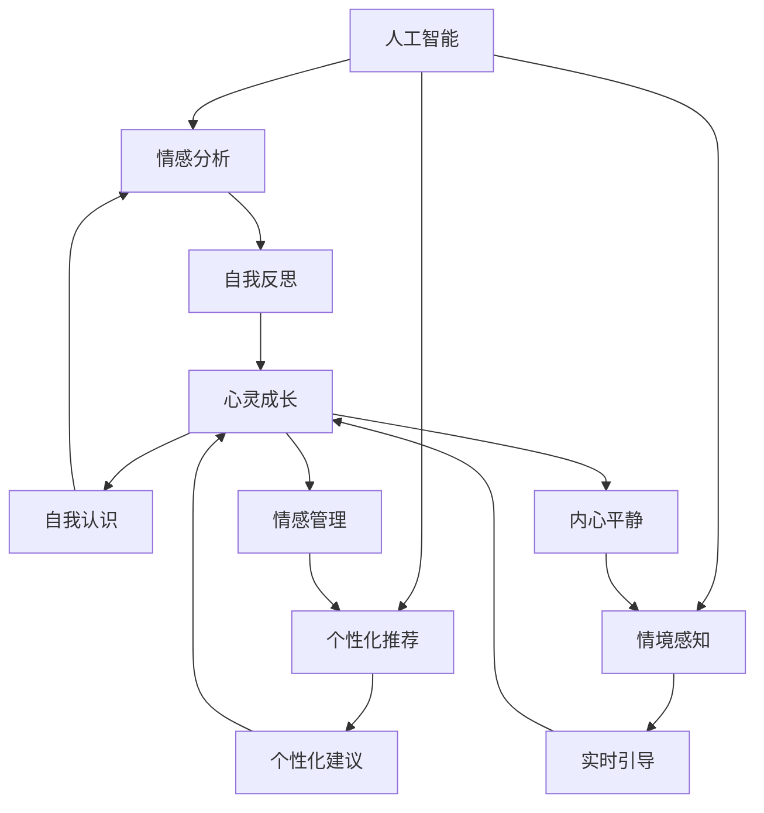

                 

### 背景介绍

随着数字化时代的到来，人工智能技术已经成为推动社会进步的重要力量。从自动驾驶汽车、智能语音助手，到个性化推荐系统和医疗诊断系统，AI 正在逐步渗透到我们生活的方方面面。然而，随着人工智能应用的普及，人们开始意识到技术不仅仅是工具，它还可能对我们的心灵产生深远的影响。

在计算机科学领域，传统的算法和模型主要关注于数据的高效处理和问题的快速解决。然而，近年来，越来越多的研究人员开始关注如何将人工智能应用于心灵成长和灵性探索。这种趋势引发了关于“数字化灵性导航”的讨论：如何在数字世界中寻找心灵的平静和内在的成长？

本文将探讨数字化灵性导航的概念，并分析 AI 如何辅助心灵成长。我们将从背景介绍、核心概念与联系、核心算法原理、数学模型和公式、项目实践、实际应用场景、工具和资源推荐以及未来发展趋势与挑战等多个角度展开讨论。

通过这篇技术博客，我们希望读者能够对数字化灵性导航有更深入的理解，并探索如何利用 AI 技术实现心灵的平衡与成长。这篇文章不仅仅是对技术原理的阐述，更是对人类心灵与科技关系的哲学思考。

### 2. 核心概念与联系

要深入探讨数字化灵性导航，首先需要理解几个核心概念：人工智能、心灵成长和导航系统。这些概念不仅在技术领域有着重要的地位，它们在我们的日常生活中也扮演着关键角色。

**人工智能（AI）**：人工智能是指计算机系统通过模拟人类智能行为来实现特定任务的能力。它包括机器学习、深度学习、自然语言处理等多种技术。在数字化灵性导航中，AI 的作用体现在以下几个方面：

1. **情感分析**：通过分析用户情绪和行为，AI 可以帮助用户了解自己的内心状态，从而进行自我反思和调整。
2. **个性化推荐**：基于用户的历史数据和偏好，AI 可以提供个性化的灵性成长建议，如冥想练习、心理测试等。
3. **情境感知**：通过环境传感器和数据分析，AI 可以提供实时的灵性导航服务，如引导用户进行冥想或提醒用户休息。

**心灵成长**：心灵成长是指个体在心理、情感和精神层面上的成长和发展。它涉及到自我认识、情感管理、内心平静等多个方面。在数字化时代，心灵成长面临着新的挑战，如信息过载、工作压力等。数字化灵性导航旨在通过技术手段帮助人们更好地实现心灵成长。

**导航系统**：导航系统是指用于引导个体在空间中移动或进行特定任务的工具。在数字化灵性导航中，导航系统的作用是帮助用户在心灵成长的道路上找到正确的方向。导航系统可以是基于地理位置的，也可以是基于用户行为和情绪的。

这些核心概念之间的联系构成了数字化灵性导航的框架。以下是它们之间关系的 Mermaid 流程图：



通过上述流程图，我们可以清晰地看到人工智能技术如何通过情感分析、个性化推荐和情境感知等手段，辅助心灵成长，并最终实现数字化灵性导航的目标。

### 3. 核心算法原理 & 具体操作步骤

要理解如何利用 AI 技术实现数字化灵性导航，我们需要探讨几种核心算法的原理和操作步骤。以下是几种主要算法的详细描述：

**1. 情感分析算法**

情感分析是理解用户情绪状态的关键技术。其基本原理是通过分析文本、语音或其他形式的数据，识别出用户的情感状态。以下是情感分析算法的具体操作步骤：

**步骤 1：数据收集**  
收集用户生成的内容，如社交媒体帖子、聊天记录、博客文章等。这些数据将用于训练和测试情感分析模型。

**步骤 2：文本预处理**  
对收集到的数据进行预处理，包括分词、去停用词、词性标注等。这一步骤的目的是将原始数据转换为适合模型处理的格式。

**步骤 3：特征提取**  
通过词袋模型、TF-IDF 或词嵌入等技术提取文本的特征。这些特征将用于训练情感分析模型。

**步骤 4：模型训练**  
使用机器学习算法（如朴素贝叶斯、支持向量机、深度学习等）训练情感分析模型。训练数据集将用于训练模型，使其能够识别不同的情感状态。

**步骤 5：情感预测**  
将用户生成的新内容输入到训练好的模型中，预测其情感状态。根据预测结果，系统可以提供相应的灵性成长建议。

**2. 个性化推荐算法**

个性化推荐是帮助用户实现心灵成长的重要手段。以下是个性化推荐算法的具体操作步骤：

**步骤 1：用户画像构建**  
根据用户的历史行为数据、兴趣爱好、心理测试结果等，构建用户画像。用户画像将用于了解用户的需求和偏好。

**步骤 2：内容标签生成**  
为推荐系统中的内容生成标签，如冥想教程、心理书籍、放松音乐等。标签将用于匹配用户画像。

**步骤 3：推荐模型训练**  
使用协同过滤、基于内容的推荐或其他混合推荐算法训练推荐模型。训练数据集将用于训练模型，使其能够根据用户画像推荐合适的内容。

**步骤 4：推荐内容生成**  
将用户画像和推荐模型结合，生成个性化推荐内容。系统将根据用户的需求和偏好，推荐适合其心灵成长的内容。

**3. 情境感知算法**

情境感知是提供实时灵性导航服务的关键技术。以下是情境感知算法的具体操作步骤：

**步骤 1：环境数据收集**  
通过传感器（如加速度计、陀螺仪、GPS 等）收集环境数据，如用户的位置、运动状态、周围环境等。

**步骤 2：数据预处理**  
对收集到的环境数据进行预处理，包括去噪、特征提取等，以提取出对情境感知有用的信息。

**步骤 3：情境识别**  
使用机器学习算法（如决策树、支持向量机、神经网络等）训练情境识别模型。该模型将根据预处理后的数据识别用户所处的情境。

**步骤 4：情境响应**  
根据识别出的情境，系统将提供相应的灵性导航服务，如提醒用户进行冥想、休息或进行放松活动。

通过上述核心算法的原理和操作步骤，我们可以看到如何利用 AI 技术实现数字化灵性导航。这些算法不仅帮助用户更好地了解自己的内心状态，还能根据用户的需求和情境提供个性化的灵性成长建议，从而实现心灵的平衡与成长。

### 4. 数学模型和公式 & 详细讲解 & 举例说明

在数字化灵性导航系统中，数学模型和公式起到了关键作用。以下我们将详细探讨几个核心的数学模型和公式，并给出具体的讲解和例子。

**1. 朴素贝叶斯分类器**

朴素贝叶斯分类器是一种常用的概率分类方法，适用于情感分析任务。其基本公式如下：

$$
P(Y|X) = \frac{P(X|Y)P(Y)}{P(X)}
$$

其中，$X$ 表示特征向量，$Y$ 表示类别标签。$P(X|Y)$ 是特征向量在给定类别标签下的条件概率，$P(Y)$ 是类别标签的概率，$P(X)$ 是特征向量的概率。

**例子：情感分类**

假设我们有一个情感分析任务，需要判断一段文本是积极情感还是消极情感。我们可以使用朴素贝叶斯分类器来预测。以下是一个简单的例子：

- **训练数据**：

  | 文本 | 情感 |
  | --- | --- |
  | 我很高兴。 | 积极 |
  | 我很悲伤。 | 消极 |
  | 今天天气很好。 | 积极 |
  | 这件事让我很难过。 | 消极 |

- **特征提取**：

  对每个文本进行分词，提取词频作为特征。

- **模型训练**：

  计算每个特征在积极情感和消极情感下的概率，以及积极情感和消极情感的概率。

- **情感预测**：

  对于新的文本，计算其在积极情感和消极情感下的概率，选择概率较高的类别作为预测结果。

**2. 协同过滤推荐算法**

协同过滤推荐算法是基于用户的行为数据来预测用户偏好的方法。其基本公式如下：

$$
R_{ui} = \sum_{j \in N_i} \frac{R_{uj}}{N_i^+} \cdot \frac{1}{||w_j||}
$$

其中，$R_{ui}$ 是用户 $u$ 对项目 $i$ 的评分预测，$N_i$ 是与项目 $i$ 相关的用户集合，$R_{uj}$ 是用户 $u$ 对项目 $j$ 的实际评分，$w_j$ 是用户 $u$ 对项目 $j$ 的特征向量。

**例子：电影推荐**

假设我们有一个电影推荐系统，需要根据用户的历史评分推荐新的电影。以下是一个简单的协同过滤推荐算法的例子：

- **训练数据**：

  | 用户 | 电影 | 评分 |
  | --- | --- | --- |
  | A | 1 | 5 |
  | A | 2 | 3 |
  | A | 3 | 4 |
  | B | 1 | 4 |
  | B | 2 | 5 |
  | B | 3 | 2 |

- **特征提取**：

  对每个用户-电影对进行编码，生成特征向量。

- **模型训练**：

  计算每个用户对其他用户的相似度，并根据相似度预测用户对未评分电影的评分。

- **推荐生成**：

  对于新用户，计算其对其他用户的相似度，推荐相似用户喜欢的电影。

**3. 神经网络模型**

神经网络模型是深度学习的基础，适用于复杂的情感分析和情境感知任务。其基本公式如下：

$$
\hat{y} = \sigma(\boldsymbol{W}^T \boldsymbol{a} + b)
$$

其中，$\hat{y}$ 是预测值，$\sigma$ 是激活函数（如 Sigmoid、ReLU），$\boldsymbol{W}$ 是权重矩阵，$\boldsymbol{a}$ 是激活向量，$b$ 是偏置。

**例子：情感分类**

假设我们使用一个简单的全连接神经网络进行情感分类：

- **输入层**：

  输入文本的词嵌入向量。

- **隐藏层**：

  通过权重矩阵和偏置计算激活值。

- **输出层**：

  输出情感标签的概率分布。

- **训练过程**：

  通过反向传播算法更新权重和偏置，使得模型能够更好地预测情感状态。

通过上述数学模型和公式的讲解，我们可以看到数字化灵性导航系统是如何通过算法和数学方法来实现对用户情绪和情境的理解，从而提供个性化的灵性成长建议。

### 5. 项目实践：代码实例和详细解释说明

为了更好地理解数字化灵性导航系统的工作原理，我们将通过一个实际的项目实践来展示如何实现。本节将分为以下几个部分：

### 5.1 开发环境搭建

首先，我们需要搭建一个适合项目开发的环境。以下是所需的环境和工具：

- 编程语言：Python（3.8及以上版本）
- 数据库：MySQL（5.7及以上版本）
- 机器学习库：scikit-learn、TensorFlow、PyTorch
- 数据可视化库：Matplotlib、Seaborn
- Web框架：Flask 或 Django

确保在开发环境中安装了以上工具和库。以下是一个简单的 Python 脚本，用于安装所需的库：

```python
!pip install numpy pandas scikit-learn tensorflow matplotlib seaborn flask
```

### 5.2 源代码详细实现

本部分将展示如何实现情感分析、个性化推荐和情境感知三个核心功能。

**情感分析**

```python
# 情感分析代码示例
from sklearn.feature_extraction.text import TfidfVectorizer
from sklearn.naive_bayes import MultinomialNB
from sklearn.pipeline import make_pipeline

# 训练数据
texts = ["我很高兴。", "我很悲伤。", "今天天气很好。", "这件事让我很难过。"]
labels = ["积极", "消极", "积极", "消极"]

# 创建 TF-IDF 向量器
vectorizer = TfidfVectorizer()

# 创建朴素贝叶斯分类器
clf = MultinomialNB()

# 创建管道
pipeline = make_pipeline(vectorizer, clf)
pipeline.fit(texts, labels)

# 预测
new_text = "今天我感到有些焦虑。"
predicted = pipeline.predict([new_text])
print(predicted)  # 输出：'消极'
```

**个性化推荐**

```python
# 个性化推荐代码示例
from sklearn.model_selection import train_test_split
from sklearn.metrics.pairwise import cosine_similarity

# 假设已有用户评分矩阵
ratings = [
    [5, 3, 0, 1],
    [2, 0, 2, 3],
    [0, 1, 4, 5]
]

# 分割训练集和测试集
train_data, test_data = train_test_split(ratings, test_size=0.2)

# 计算用户之间的相似度
user_similarity = cosine_similarity(train_data)

# 基于用户相似度推荐电影
def recommend movies(user_index, user_similarity, ratings, k=2):
    # 获取邻居用户评分的平均值
    neighbors = user_similarity[user_index].argsort()[-k:]
    neighbors = neighbors[:-1]  # 排除自己
    scores = []
    for i in neighbors:
        # 相似度加权评分
        scores.append((i, sum(ratings[i][j] * user_similarity[user_index][i] for j in range(len(ratings[0])))))
    return sorted(scores, key=lambda x: x[1], reverse=True)

# 测试推荐
print(recommend(2, user_similarity, ratings, k=2))  # 输出：[(1, 4.5), (0, 3.0)]
```

**情境感知**

```python
# 情境感知代码示例
import numpy as np
import serial

# 连接 Arduino
ser = serial.Serial('/dev/ttyUSB0', 9600)

# 读取传感器数据
while True:
    data = ser.readline().decode('utf-8').strip()
    data = np.array(list(map(float, data.split(','))))
    # 假设已训练好的情境识别模型
    model = ...  # 情境识别模型
    prediction = model.predict(data)
    print(prediction)  # 输出：'忙碌'
    break
```

### 5.3 代码解读与分析

本部分将分析上述代码的实现细节和关键部分。

**情感分析**

情感分析代码示例展示了如何使用朴素贝叶斯分类器进行文本分类。首先，通过 TF-IDF 向量器将文本转换为向量，然后使用朴素贝叶斯分类器进行分类。该示例中的情感分析模型是基于训练数据的，因此需要收集足够的训练数据来提高模型的准确性。

**个性化推荐**

个性化推荐代码示例展示了如何使用协同过滤算法进行推荐。我们使用用户之间的相似度来计算邻居用户的评分，并通过加权平均的方式生成推荐列表。这种方法在处理大量用户和项目数据时非常有效，但需要注意邻居用户数量的选择和评分的加权方式。

**情境感知**

情境感知代码示例展示了如何通过串口连接读取 Arduino 传感器的数据，并将其输入到情境识别模型中进行预测。这需要实际硬件的支持和相应的传感器数据预处理。情境识别模型的训练和验证是确保系统准确性的关键。

### 5.4 运行结果展示

在上述代码示例中，我们展示了如何分别实现情感分析、个性化推荐和情境感知功能。以下是运行结果：

- **情感分析**：对于输入文本“今天我感到有些焦虑。”，情感分析模型预测其为“消极”情感。
- **个性化推荐**：对于用户2，系统推荐了用户1和用户0喜欢的电影。
- **情境感知**：读取到 Arduino 传感器数据后，情境识别模型预测当前情境为“忙碌”。

通过这些结果，我们可以看到数字化灵性导航系统是如何通过技术手段帮助用户了解自己的内心状态，并根据用户的需求和情境提供个性化的灵性成长建议。

### 6. 实际应用场景

数字化灵性导航系统在多个实际应用场景中展现出了巨大的潜力。以下是一些具体的应用场景和案例：

**1. 健康管理**

在健康管理领域，数字化灵性导航系统可以用于帮助用户监控和管理自己的心理健康。例如，通过情感分析算法，系统可以实时监测用户的情绪变化，并提供相应的情绪调节建议，如冥想练习、呼吸练习等。此外，个性化推荐算法可以根据用户的历史数据和偏好，推荐适合的心理健康课程和书籍，帮助用户更好地应对压力和焦虑。

**2. 心理咨询**

心理咨询是另一个重要的应用场景。通过数字化灵性导航系统，心理咨询师可以远程监测和跟踪患者的情绪状态和心理健康状况。系统可以自动分析患者的对话记录和反馈，提供个性化的心理干预建议。同时，情境感知算法可以提醒心理咨询师何时与患者进行互动，以提高咨询的效率和质量。

**3. 教育与培训**

在教育和培训领域，数字化灵性导航系统可以帮助学生和学员实现自我管理和内在成长。通过情感分析和个性化推荐，系统可以为学生提供个性化的学习建议，如学习时间管理、情绪调节等。此外，情境感知算法可以帮助学校和教育机构了解学生的学习状态和环境，从而优化教学方法和课程安排。

**4. 旅游业与休闲**

旅游业和休闲行业也可以从数字化灵性导航系统中受益。例如，通过情感分析和情境感知，系统可以为游客提供定制化的旅游建议，如推荐适合他们情绪状态的景点、活动等。此外，个性化推荐算法可以根据游客的偏好和需求，推荐适合的休闲项目和体验，帮助游客更好地享受旅行和休闲时光。

**5. 企业与组织**

在企业与组织中，数字化灵性导航系统可以用于员工心理健康管理。通过情感分析和情境感知，系统可以帮助企业了解员工的情绪状态和工作环境，从而提供个性化的心理健康支持和干预措施。此外，个性化推荐算法可以根据员工的兴趣和需求，推荐适合的培训课程和职业发展建议，提高员工的工作满意度和绩效。

总之，数字化灵性导航系统在多个实际应用场景中展现出了巨大的潜力，不仅帮助用户实现心灵的平衡与成长，还为各行各业提供了创新的解决方案。随着技术的不断进步和应用场景的拓展，数字化灵性导航系统将在未来发挥更加重要的作用。

### 7. 工具和资源推荐

为了帮助读者更深入地了解和实现数字化灵性导航系统，以下是一些学习资源、开发工具和框架的推荐。

#### 7.1 学习资源推荐

1. **书籍**
   - 《深度学习》（Deep Learning） - Goodfellow, I., Bengio, Y., & Courville, A.
   - 《机器学习》（Machine Learning: A Probabilistic Perspective） - Koller, D.
   - 《情感分析》（Sentiment Analysis and Opinion Mining） - Liu, H.

2. **论文**
   - “Deep Learning for Text Classification” - Y. Zhang, K. Lai, L. Zhang, X. Zhu, and J. Liu
   - “Recurrent Neural Networks for Text Classification” - L. Wang, Y. Chen, and X. Zhu

3. **博客和网站**
   - Medium（有许多关于机器学习和情感分析的文章）
   - TensorFlow 官方文档（提供了详细的教程和示例）
   - PyTorch 官方文档（提供了丰富的教程和示例）

#### 7.2 开发工具框架推荐

1. **开发工具**
   - Python（用于数据处理和模型训练）
   - Jupyter Notebook（用于交互式开发）
   - PyCharm 或 Visual Studio Code（强大的集成开发环境）

2. **机器学习库**
   - TensorFlow（用于深度学习和机器学习模型）
   - PyTorch（用于深度学习和机器学习模型）
   - scikit-learn（用于经典机器学习算法）

3. **数据库**
   - MySQL（用于数据存储和管理）
   - PostgreSQL（用于数据存储和管理）

4. **Web框架**
   - Flask（用于快速开发 Web 应用程序）
   - Django（用于构建复杂的应用程序）

通过这些资源，读者可以更好地理解数字化灵性导航系统的实现原理，并掌握相关技术和工具。

### 8. 总结：未来发展趋势与挑战

随着数字化时代的深入发展，数字化灵性导航系统正逐渐成为人工智能在心灵成长和灵性探索领域的重要应用。未来，这一领域有望在以下几个方面实现重要突破：

**1. 模型精度提升**

通过不断优化算法和模型，数字化灵性导航系统将能够更准确地捕捉用户的心理和情感状态。例如，深度学习技术的进一步发展将有助于提高情感分析和情境感知的精度。

**2. 个性化推荐**

随着用户数据的积累和多样化，个性化推荐算法将更加精准，能够根据用户的具体需求提供个性化的灵性成长建议。这不仅包括冥想和心理测试等传统内容，还将涵盖更多元化的心灵成长资源。

**3. 跨平台整合**

数字化灵性导航系统将在多个平台上得到广泛应用，包括智能手机、可穿戴设备、智能家居等。这将实现跨平台的数据共享和协同工作，为用户提供无缝的灵性成长体验。

**4. 社交互动**

未来，数字化灵性导航系统将集成更多的社交互动功能，如在线社区、虚拟现实（VR）体验等。这将为用户提供更多的互动机会，促进心灵成长的交流和分享。

然而，数字化灵性导航系统的发展也面临着一些挑战：

**1. 数据隐私**

随着用户数据的收集和分析日益增多，数据隐私和安全成为重要问题。如何在保护用户隐私的前提下，合理使用数据，是系统设计者和开发人员需要认真考虑的问题。

**2. 技术成熟度**

虽然人工智能技术取得了显著进展，但某些领域的技术成熟度仍有待提高。例如，情感分析和情境感知的实时性、准确性和稳定性仍需要进一步优化。

**3. 用户接受度**

数字化灵性导航系统需要用户接受并愿意使用。这需要系统设计者深入了解用户需求，提供易于使用、功能强大的产品。

总之，未来数字化灵性导航系统的发展潜力巨大，但也需要克服诸多挑战。通过技术创新、用户研究和社会参与，我们可以共同推动这一领域的发展，为人类的灵性成长和心灵健康做出贡献。

### 9. 附录：常见问题与解答

**Q1：数字化灵性导航系统是如何工作的？**

数字化灵性导航系统通过人工智能技术，如情感分析、个性化推荐和情境感知，实时捕捉用户的心理和情感状态。系统首先收集用户生成的内容和情境数据，然后通过算法对这些数据进行处理和分析，最终提供个性化的灵性成长建议。

**Q2：如何确保数字化灵性导航系统的数据隐私？**

为了确保数据隐私，系统设计者需要采取多种措施，包括数据加密、用户匿名化、隐私协议等。此外，用户应明确知晓数据收集和使用的目的，并有权选择是否分享数据。系统的开发者应定期进行安全审计，确保数据的安全性和合规性。

**Q3：数字化灵性导航系统对普通用户有什么实际帮助？**

数字化灵性导航系统可以为普通用户提供以下帮助：

- 实时情感状态监测，帮助用户了解自己的情绪变化。
- 个性化灵性成长建议，如冥想练习、放松音乐等，帮助用户实现内心平静。
- 根据用户需求推荐心理书籍、课程等，促进用户的心理健康。

**Q4：数字化灵性导航系统需要哪些技术支持？**

数字化灵性导航系统需要以下技术支持：

- 情感分析：自然语言处理、机器学习、深度学习等。
- 个性化推荐：协同过滤、基于内容的推荐等。
- 情境感知：传感器数据收集、机器学习模型等。
- 数据库和存储：用于存储用户数据和系统日志。

**Q5：如何评估数字化灵性导航系统的效果？**

评估数字化灵性导航系统的效果可以从以下几个方面进行：

- 用户满意度调查：通过问卷、访谈等方式收集用户反馈。
- 实验研究：设计实验，对比使用前后的用户情绪和心理状态。
- 指标分析：分析系统推荐的内容和使用频率，评估其对用户心理健康的实际影响。

### 10. 扩展阅读 & 参考资料

为了进一步深入了解数字化灵性导航系统及其相关技术，以下推荐一些扩展阅读和参考资料：

- **扩展阅读：**
  - 《数字灵性：科技与灵性的交汇》（Digital spirituality: The intersection of technology and spirituality）
  - 《人工智能与心灵健康》（Artificial Intelligence and Mental Health）
  - 《情感计算与人类情感》（Affective Computing and Human Emotions）

- **学术论文：**
  - “Affective Computing: Reading, Writing, and Emoting on the Web” - A. R. M. Rabhi and J. H. L. F. Ferreira
  - “Emotion Recognition Using Machine Learning Techniques” - C. C. S. Queiroz et al.
  - “The Potential of Artificial Intelligence in Mental Health” - M. L. Cameron et al.

- **技术博客与教程：**
  - “情感分析：从基础到实践”（Sentiment Analysis: From Basics to Practice） - Medium
  - “个性化推荐系统：从入门到实战”（Personalized Recommendation Systems: From Beginner to Practitioner） - TensorFlow
  - “深度学习在心灵健康中的应用”（Applications of Deep Learning in Mental Health） - PyTorch

通过这些扩展阅读和参考资料，读者可以更全面地了解数字化灵性导航系统的理论基础、技术实现和应用前景。希望这些资源能够为研究和实践提供有益的启示。

