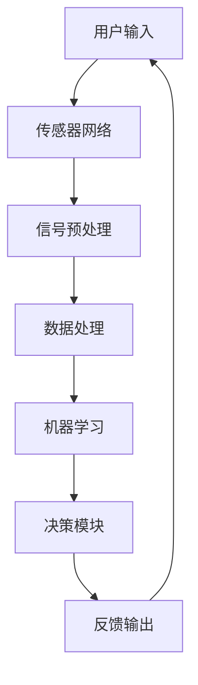

                 

### 背景介绍

#### 什么是数字化第六感

在当今高速发展的信息技术时代，数字化第六感（Digital Sixth Sense）正成为人们日常生活中不可或缺的一部分。所谓的数字化第六感，是指通过先进的人工智能技术和传感器技术，使人能够超越传统的五官感知，获取和解读周围环境中的各种信息。这一概念并非遥不可及，而是已经深入到我们的日常生活之中，例如智能手机的GPS定位、语音识别助手、智能家居控制系统等，都是数字化第六感的具体体现。

#### 人工智能与数字化第六感的关系

人工智能（Artificial Intelligence，简称AI）是数字化第六感的核心技术之一。AI技术通过对海量数据的处理和分析，能够实现从感知、理解到决策的自动化，从而大大提升人类对复杂环境的适应能力。在数字化第六感的实现过程中，人工智能承担了信息收集、处理、传输和反馈的重要角色。例如，通过AI算法分析摄像头捕捉到的图像，可以识别行人、车辆等目标，进而实现智能交通管理；通过语音识别技术，可以将人类的语音指令转换为机器指令，实现智能语音交互。

#### 历史发展

数字化第六感的概念起源于20世纪90年代，当时计算机科学和人工智能领域的研究者开始探索如何将人类的感官能力数字化。随着传感器技术的进步、计算能力的提升以及数据存储和传输技术的优化，数字化第六感逐渐从理论走向实践。21世纪初，移动互联网和物联网的兴起，使得数字化第六感的应用场景进一步扩展，从最初的研究实验室走向了普通人的生活。

#### 当前现状

当前，数字化第六感已经在多个领域得到广泛应用，如智能家居、智能医疗、自动驾驶、智能安防等。例如，智能家居系统可以通过传感器实时监测家中的环境参数，如温度、湿度、烟雾等，并根据设定的规则自动调整家中的设备，如空调、加湿器、烟雾报警器等，以提高居住的舒适度和安全性。在智能医疗领域，AI技术可以辅助医生进行诊断和治疗，通过分析患者的病历、基因数据等，提供个性化的治疗方案。自动驾驶技术的发展，使得数字化第六感在交通领域发挥越来越重要的作用，通过传感器和AI算法，车辆可以实时感知道路状况，实现自动驾驶。

#### 未来趋势

随着人工智能技术的不断进步，数字化第六感在未来将会变得更加普及和智能化。一方面，人工智能算法的优化和计算能力的提升，将使得数字化第六感的精度和效率进一步提高；另一方面，新型传感器技术的发展，将使得人类能够感知到更多以前无法感知的信息。例如，未来可能会出现能够感知电磁波、红外线等非可见光的传感器，进一步扩展人类的感知能力。此外，随着5G、6G等新一代通信技术的推广，数字化第六感的实时性和稳定性将得到大幅提升，使其在更多场景中得到应用。

总之，数字化第六感是人工智能技术与传感器技术相结合的产物，它正以前所未有的速度和规模改变着我们的生活。理解数字化第六感的发展历程、现状和未来趋势，对于我们把握科技发展的脉搏，迎接智能时代的到来具有重要意义。

### 核心概念与联系

#### 数字化第六感的核心概念

数字化第六感（Digital Sixth Sense）涉及到多个核心概念，这些概念相互关联，共同构成了数字化第六感的技术基础。以下是几个关键概念及其关系：

1. **传感器**：传感器是数字化第六感的感知器官，它们能够将物理信号（如光线、声音、温度、湿度等）转换为电信号。这些电信号可以被数字化处理，从而供计算机或其他电子设备使用。

2. **数据处理**：通过传感器收集到的数据需要经过处理，包括滤波、放大、模数转换等步骤，以便进行后续的分析和解读。

3. **机器学习**：机器学习是一种人工智能技术，它能够通过分析大量数据，从中学习和提取规律。在数字化第六感中，机器学习算法用于识别模式、预测行为和生成决策。

4. **自然语言处理**：自然语言处理（Natural Language Processing，简称NLP）是一种让计算机理解和生成人类语言的技术。NLP在数字化第六感中用于处理人类的语音指令和文本输入。

5. **传感器融合**：传感器融合是将多个传感器的数据结合起来，以获得更全面、准确的感知信息。通过传感器融合，可以克服单一传感器的局限性，提高系统的整体感知能力。

#### 数字化第六感的架构

为了更好地理解数字化第六感的工作原理，我们可以将其架构分解为几个关键模块，并用Mermaid流程图来展示各模块之间的关系。



**流程说明：**

1. **用户输入**：用户通过语音、手势或其他方式向系统输入指令或需求。
2. **传感器网络**：系统中的传感器网络开始工作，收集用户所处环境中的各种物理信号。
3. **信号预处理**：收集到的信号需要经过滤波、放大、模数转换等预处理步骤，以便进行后续分析。
4. **数据处理**：预处理后的信号进入数据处理模块，进行去噪、特征提取等处理。
5. **机器学习**：利用机器学习算法对处理后的数据进行模式识别、预测分析等操作，生成决策。
6. **决策模块**：根据机器学习模块的输出结果，系统生成具体的操作指令或反馈信息。
7. **反馈输出**：最终的决策结果以语音、文字、图像等形式反馈给用户，完成一次闭环。

#### 核心概念之间的相互作用

传感器网络的数据收集和处理模块是数字化第六感的基础，没有高质量的传感器数据，后续的机器学习和决策就失去了依据。机器学习模块则通过分析大量的历史数据，不断优化算法，提高系统的准确性和鲁棒性。自然语言处理模块在处理用户输入时发挥了关键作用，使得系统能够理解和执行人类的指令。传感器融合技术则通过结合多种传感器的数据，提高了系统的整体感知能力。

总的来说，数字化第六感的核心概念和技术之间紧密相连，共同构成了一个高效、智能的感知系统。通过逐步理解和掌握这些概念和技术，我们可以更好地应对智能时代带来的挑战和机遇。

### 核心算法原理 & 具体操作步骤

#### 机器学习算法的核心原理

机器学习是数字化第六感中至关重要的技术之一，其核心原理是通过训练模型来学习数据中的规律，并利用这些规律进行预测和决策。以下是几种常用的机器学习算法及其工作原理：

1. **决策树（Decision Tree）**：
   决策树是一种常用的分类算法，它通过一系列的判断条件将数据分割成多个子集，并最终得到一个分类结果。决策树的核心是节点分裂准则，如信息增益（Information Gain）和基尼不纯度（Gini Impurity）。

2. **支持向量机（Support Vector Machine，SVM）**：
   支持向量机是一种强大的分类和回归算法，它通过寻找数据中的最优分割超平面，使得分类边界具有最大的间隔。SVM的核心是求解二次规划问题，以找到最优的超平面。

3. **神经网络（Neural Network）**：
   神经网络是一种模仿生物神经系统的计算模型，它通过多层神经元之间的连接和激活函数，实现从输入到输出的映射。神经网络的训练过程通常涉及反向传播算法，以调整网络权重，最小化损失函数。

4. **聚类算法（Clustering Algorithm）**：
   聚类算法用于将数据点分为多个组，使得同组内的数据点之间相似度较高，而不同组之间的数据点相似度较低。常见的聚类算法包括K-means、层次聚类（Hierarchical Clustering）等。

#### 机器学习算法的操作步骤

下面以K-means聚类算法为例，详细说明机器学习算法的具体操作步骤：

1. **初始化**：
   选择K个初始聚类中心，这些中心点可以随机选择，也可以通过某种算法（如K-means++）来优化初始选择。

2. **分配数据点**：
   将数据集中的每个数据点分配给最近的聚类中心，计算每个数据点到各个聚类中心的距离，通常使用欧氏距离或曼哈顿距离等。

3. **更新聚类中心**：
   根据当前分配的数据点，重新计算每个聚类中心的位置，即将所有分配给同一聚类中心的数据点的平均值作为新的聚类中心。

4. **迭代更新**：
   重复步骤2和步骤3，直到聚类中心不再发生显著变化，或者达到预定的迭代次数。

5. **评估聚类结果**：
   使用某种评价指标（如平方误差、轮廓系数等）来评估聚类结果的质量。

#### 数字化第六感中的具体应用

在数字化第六感中，机器学习算法被广泛应用于多个方面：

1. **环境监测**：
   通过传感器收集环境数据，如温度、湿度、噪音等，使用聚类算法将数据点分为不同的组，以识别异常情况或特定事件。

2. **语音识别**：
   使用神经网络对语音信号进行特征提取和分类，将语音转换为文本或命令。

3. **手势识别**：
   通过摄像头捕捉到手部的运动，使用机器学习算法识别手势，实现人与机器的交互。

4. **智能推荐**：
   根据用户的历史行为数据，如浏览记录、购买习惯等，使用推荐算法为用户推荐感兴趣的内容或商品。

通过上述核心算法原理和具体操作步骤，我们可以看到机器学习在数字化第六感中扮演了重要角色。这些算法不仅提高了系统的感知能力和智能化水平，还为实现多种实际应用提供了技术支持。

### 数学模型和公式 & 详细讲解 & 举例说明

#### K-means聚类算法的数学模型

K-means聚类算法是一种经典的聚类方法，其核心在于将数据点分配到K个簇中，使得每个簇内部的数据点之间的距离尽可能小，而不同簇之间的距离尽可能大。以下是K-means聚类算法的数学模型及其推导过程：

1. **目标函数**：
   K-means算法的目标是最小化目标函数，即：
   $$
   J(\mu) = \sum_{i=1}^K \sum_{x \in S_i} ||x - \mu_i||^2
   $$
   其中，$J(\mu)$ 是目标函数，$\mu_i$ 是第 $i$ 个聚类中心的坐标，$S_i$ 是属于第 $i$ 个簇的数据点的集合，$||x - \mu_i||^2$ 表示数据点 $x$ 与聚类中心 $\mu_i$ 的欧氏距离的平方。

2. **聚类中心的更新规则**：
   聚类中心的更新规则如下：
   $$
   \mu_i = \frac{1}{|S_i|} \sum_{x \in S_i} x
   $$
   其中，$|S_i|$ 表示属于第 $i$ 个簇的数据点的数量。

3. **数据点的分配规则**：
   数据点的分配规则如下：
   对于每个数据点 $x$，计算它与每个聚类中心 $\mu_i$ 的距离，并将其分配到最近的聚类中心所代表的簇中。

#### 具体讲解

1. **初始化聚类中心**：
   K-means算法首先需要选择K个初始聚类中心。一种常用的方法是通过随机选择K个数据点作为初始聚类中心，另一种方法是通过K-means++算法来优化初始聚类中心的选择。

2. **数据点分配**：
   将每个数据点分配到最近的聚类中心所代表的簇中。具体步骤如下：
   - 对于每个数据点 $x$，计算它与每个聚类中心 $\mu_i$ 的距离，选择距离最小的聚类中心作为该数据点的簇归属。
   - 更新每个聚类中心的位置，使其成为所有属于该聚类中心的数据点的平均位置。

3. **迭代更新**：
   重复上述步骤，直到聚类中心不再发生显著变化，或者达到预定的迭代次数。

4. **评估聚类结果**：
   使用某种评价指标（如平方误差、轮廓系数等）来评估聚类结果的质量。

#### 举例说明

假设我们有如下数据集：

$$
\{(x_1, y_1), (x_2, y_2), \ldots, (x_n, y_n)\}
$$

其中，每个数据点的坐标为 $(x_i, y_i)$。我们希望将这组数据点分为两个簇。

1. **初始化聚类中心**：
   假设我们随机选择了两个聚类中心 $(\mu_1, \mu_2)$，分别为 $(x_1, y_1)$ 和 $(x_2, y_2)$。

2. **数据点分配**：
   对于每个数据点 $(x_i, y_i)$，计算它与两个聚类中心的距离，选择距离最小的聚类中心作为该数据点的簇归属。例如，对于数据点 $(x_3, y_3)$，计算其与两个聚类中心的距离如下：
   $$
   d((x_3, y_3), (\mu_1, \mu_2)) = \sqrt{(x_3 - x_1)^2 + (y_3 - y_1)^2}
   $$
   $$
   d((x_3, y_3), (\mu_2, \mu_2)) = \sqrt{(x_3 - x_2)^2 + (y_3 - y_2)^2}
   $$
   假设 $d((x_3, y_3), (\mu_1, \mu_2)) < d((x_3, y_3), (\mu_2, \mu_2))$，则将 $(x_3, y_3)$ 分配到第一个簇。

3. **更新聚类中心**：
   根据新的分配结果，更新聚类中心的位置。例如，对于第一个聚类中心 $(\mu_1, \mu_2)$，其新位置为：
   $$
   \mu_1 = \frac{x_1 + x_3}{2}, \quad \mu_2 = \frac{y_1 + y_3}{2}
   $$

4. **迭代更新**：
   重复上述步骤，直到聚类中心不再发生显著变化。

5. **评估聚类结果**：
   使用平方误差作为评价指标：
   $$
   J(\mu) = \sum_{i=1}^2 \sum_{x \in S_i} ||x - \mu_i||^2
   $$
   其中，$S_1$ 和 $S_2$ 分别是两个簇的数据点集合。

通过上述步骤，我们可以使用K-means聚类算法将数据点分为两个簇。在实际应用中，可以根据具体的数据集和需求，调整聚类中心的初始化方法、数据点的分配规则以及迭代终止条件等参数，以达到最佳的聚类效果。

### 项目实践：代码实例和详细解释说明

#### 开发环境搭建

要实践数字化第六感中的机器学习算法，我们需要搭建一个合适的开发环境。以下是所需的软件和工具：

1. **操作系统**：Ubuntu 20.04或更高版本。
2. **编程语言**：Python 3.8或更高版本。
3. **机器学习库**：Scikit-learn、NumPy、Pandas。
4. **数据分析库**：Matplotlib、Seaborn。
5. **版本控制工具**：Git。

安装步骤：

1. 更新系统软件包：
   $$
   sudo apt update && sudo apt upgrade
   $$

2. 安装Python和pip：
   $$
   sudo apt install python3 python3-pip
   $$

3. 安装所需库：
   $$
   pip3 install scikit-learn numpy pandas matplotlib seaborn
   $$

4. 配置虚拟环境（可选）：
   $$
   python3 -m venv venv
   source venv/bin/activate
   $$

#### 源代码详细实现

以下是K-means聚类算法的Python实现，包括数据准备、模型训练和结果分析等步骤。

```python
# 导入所需库
import numpy as np
import pandas as pd
import matplotlib.pyplot as plt
from sklearn.cluster import KMeans
from sklearn.datasets import make_blobs

# 创建模拟数据集
X, y = make_blobs(n_samples=300, centers=4, cluster_std=0.60, random_state=0)

# 使用KMeans聚类算法
kmeans = KMeans(n_clusters=4, random_state=0)
kmeans.fit(X)

# 获取聚类结果
labels = kmeans.labels_
centroids = kmeans.cluster_centers_

# 可视化聚类结果
plt.figure(figsize=(10, 7))
colors = ['r', 'g', 'b', 'y']
for i in range(4):
    plt.scatter(X[labels == i], X[labels == i], s=100, c=colors[i], label=f'Cluster {i}')
plt.scatter(centroids[:, 0], centroids[:, 1], s=200, c='yellow', marker='s', edgecolor='black', label='Centroids')
plt.title('K-means Clustering')
plt.xlabel('Feature 1')
plt.ylabel('Feature 2')
plt.legend()
plt.show()
```

#### 代码解读与分析

1. **数据准备**：
   使用Scikit-learn的`make_blobs`函数创建一个包含300个数据点的模拟数据集，其中包含4个簇。

2. **模型训练**：
   使用`KMeans`类创建K-means聚类模型，设置`n_clusters`为4，表示要分为4个簇。使用`fit`方法训练模型，将数据集X作为输入。

3. **结果分析**：
   - 获取聚类结果标签`labels`，表示每个数据点所属的簇。
   - 获取聚类中心`centroids`，表示每个簇的中心位置。

4. **可视化**：
   使用Matplotlib绘制聚类结果，其中不同颜色的点表示不同的簇，黄色的星形标记表示聚类中心。

#### 运行结果展示

运行上述代码后，会生成一个可视化图表，展示K-means聚类算法在模拟数据集上的聚类结果。图表中，每个簇通过不同颜色的点表示，聚类中心用黄色的星形标记标注。通过可视化结果，我们可以直观地看到K-means算法如何将数据点划分为4个簇，并确定每个簇的中心位置。

### 实际应用场景

数字化第六感在现代社会的多个领域都展现了其强大的应用潜力，以下是一些具体的应用场景及其案例：

#### 智能家居

智能家居系统通过数字化第六感技术，实现了对家庭环境的全面感知和控制。例如，智能温控系统可以根据室内外温度、湿度等环境参数自动调节空调、加湿器等设备，以提供最舒适的居住环境。同时，智能安防系统通过摄像头和传感器实时监测家庭安全，一旦检测到异常情况，如非法入侵或火灾等，系统会立即发出警报，并通知家庭成员或相关部门。

**案例**：亚马逊的Alexa智能助手，通过语音识别和自然语言处理技术，实现了对家庭设备的远程控制和自动化操作，如调节灯光、调节温度、播放音乐等。

#### 智能医疗

在智能医疗领域，数字化第六感技术被广泛应用于诊断、治疗和患者管理。例如，通过可穿戴设备，医生可以实时监测患者的生理参数，如心率、血压、血糖等，并利用机器学习算法进行分析，提前发现潜在的健康问题。此外，智能诊断系统可以通过分析影像资料（如X光、CT、MRI等），辅助医生进行疾病诊断。

**案例**：IBM Watson健康平台，通过人工智能技术，对海量医学文献、病例数据进行分析，为医生提供诊断建议和治疗方案，显著提高了医疗服务的效率和质量。

#### 自动驾驶

自动驾驶技术依赖于数字化第六感，通过传感器和AI算法实时感知道路状况、行人行为等，实现车辆的自主导航和驾驶。自动驾驶系统能够在复杂的交通环境中做出迅速、准确的决策，从而减少交通事故、提高交通效率。

**案例**：特斯拉的自动驾驶系统，通过摄像头、雷达和超声波传感器等设备，实现车辆的自动驾驶功能，包括自动泊车、车道保持、自动导航等。

#### 智能安防

智能安防系统通过数字化第六感技术，实现对公共区域、企业园区、住宅小区等的全面监控和预警。例如，智能监控系统能够通过视频分析技术，自动识别异常行为，如盗窃、斗殴等，并立即发出警报，同时将视频记录上传到云端进行分析和存储。

**案例**：海康威视的智能安防系统，通过视频分析技术，实现了对城市交通、公共场所、金融机构等的安全监控，有效提升了安全防范能力。

#### 智能制造

在智能制造领域，数字化第六感技术通过实时监测生产线上的各种参数，如温度、压力、振动等，对生产过程进行优化和调控，从而提高生产效率和产品质量。例如，通过传感器和AI算法，可以对机器设备的运行状态进行实时监控和故障预测，预防设备故障和停机。

**案例**：西门子的智能制造解决方案，通过数字化第六感技术，实现了对生产线的全面监控和优化，提高了生产效率和产品质量。

总之，数字化第六感技术已经在智能家居、智能医疗、自动驾驶、智能安防和智能制造等多个领域得到广泛应用，并且随着人工智能和传感器技术的不断进步，其应用前景将更加广阔。

### 工具和资源推荐

#### 学习资源推荐

1. **书籍**：
   - 《机器学习实战》（Peter Harrington）：系统地介绍了机器学习的基础理论和实践应用，适合初学者入门。
   - 《深度学习》（Ian Goodfellow、Yoshua Bengio、Aaron Courville）：全面讲解了深度学习的基础知识和技术，是深度学习的经典教材。
   - 《Python机器学习》（Sebastian Raschka）：详细介绍了如何在Python中使用Scikit-learn等机器学习库进行数据分析和模型构建。

2. **论文**：
   - “K-Means Clustering: A Review” by Charu Aggarwal：对K-means聚类算法进行了全面的综述，包括算法的原理、优化方法和应用场景。
   - “Deep Learning” by Yann LeCun、Yoshua Bengio、Geoffrey Hinton：这是一篇关于深度学习的经典综述论文，涵盖了深度学习的发展历程、关键技术及其应用。

3. **博客**：
   - [Medium上的机器学习博客](https://towardsdatascience.com/)：提供了大量的机器学习相关文章和案例，适合新手学习和实践。
   - [AI科技大本营](https://aistudio.cn/)：涵盖了人工智能、机器学习、深度学习等多个领域的文章，内容丰富且实用。

4. **网站**：
   - [Coursera](https://www.coursera.org/)：提供了多门机器学习和深度学习相关的在线课程，包括基础理论和实践操作。
   - [Kaggle](https://www.kaggle.com/)：一个数据科学竞赛平台，提供了大量的数据集和竞赛项目，适合提升实践能力。

#### 开发工具框架推荐

1. **开发环境**：
   - **Python**：Python是机器学习和数据科学领域的首选语言，拥有丰富的库和工具，如NumPy、Pandas、Matplotlib等。
   - **Jupyter Notebook**：Jupyter Notebook是一个交互式计算平台，可以方便地编写和运行Python代码，非常适合数据分析和模型构建。

2. **机器学习库**：
   - **Scikit-learn**：Scikit-learn是一个强大的机器学习库，提供了丰富的算法和工具，适用于各种机器学习任务。
   - **TensorFlow**：TensorFlow是一个开源的深度学习框架，由谷歌开发，适用于构建和训练复杂的深度学习模型。

3. **数据处理库**：
   - **Pandas**：Pandas是一个数据处理库，提供了强大的数据结构和数据分析工具，非常适合进行数据预处理和分析。
   - **NumPy**：NumPy是一个基础的科学计算库，提供了多维数组对象和丰富的数学函数，是数据科学领域的基石。

4. **可视化工具**：
   - **Matplotlib**：Matplotlib是一个强大的可视化库，可以生成各种类型的图表，非常适合数据分析和模型可视化。
   - **Seaborn**：Seaborn是基于Matplotlib的一个高级可视化库，提供了丰富的内置主题和样式，使得数据可视化更加美观和直观。

通过这些学习和开发资源的推荐，读者可以系统地学习和掌握数字化第六感及其相关技术，为未来的科研和工程实践打下坚实的基础。

### 总结：未来发展趋势与挑战

#### 发展趋势

随着人工智能技术和传感器技术的不断发展，数字化第六感在未来将会迎来更加广泛和深入的应用。以下是一些发展趋势：

1. **更高的感知精度**：新型传感器技术，如量子传感器和柔性传感器，将进一步提升人类对环境的感知能力，使得数字化第六感更加精准和可靠。

2. **跨领域的融合应用**：数字化第六感技术将在智能家居、智能医疗、自动驾驶、智能安防等多个领域实现更深度的融合应用，推动整个社会的智能化进程。

3. **实时性和高效性的提升**：随着5G、6G等新一代通信技术的推广，数字化第六感的实时性和高效性将得到显著提升，为实时决策和智能交互提供更强大的支持。

4. **个人化与定制化**：数字化第六感将根据个人用户的需求和行为数据，提供更加个性化和定制化的服务，提升用户体验。

5. **伦理和法律规范**：随着数字化第六感技术的广泛应用，伦理和法律规范也将不断完善，确保技术的合理、合规使用，保护个人隐私和信息安全。

#### 面临的挑战

尽管数字化第六感技术前景广阔，但其在实际应用过程中也面临一些挑战：

1. **数据隐私和安全**：数字化第六感依赖于大规模的数据收集和分析，如何确保用户数据的安全和隐私成为一大挑战。需要制定严格的数据保护措施和法律法规，确保数据的合法、合规使用。

2. **算法透明度和可解释性**：随着机器学习算法在数字化第六感中的应用日益广泛，如何提高算法的透明度和可解释性，使其更易于被用户理解和接受，是一个亟待解决的问题。

3. **技术标准和互操作性**：不同厂商和平台之间的技术标准和互操作性不足，可能会限制数字化第六感技术的广泛应用。需要制定统一的技术标准和接口规范，促进不同系统之间的互操作。

4. **算法偏见和公平性**：机器学习算法在训练过程中可能会引入偏见，导致算法的输出结果不公平。如何消除算法偏见，确保算法的公平性和公正性，是一个重要的研究方向。

5. **资源消耗和能耗**：传感器和计算设备的广泛部署需要大量的计算资源和能源，如何降低系统的资源消耗和能耗，是实现大规模应用的重要课题。

总之，数字化第六感技术的发展既充满机遇，也面临挑战。通过不断推进技术创新、完善法律法规、提升用户体验，我们可以更好地应对这些挑战，推动数字化第六感技术向更广阔的应用场景迈进。

### 附录：常见问题与解答

#### 问题1：数字化第六感是如何工作的？

**解答**：数字化第六感通过传感器网络收集环境中的物理信号，如光线、声音、温度、湿度等，这些信号被转换为电信号，并通过数据处理模块进行预处理。随后，使用机器学习算法对预处理后的信号进行分析和解读，从而实现超感知能力，例如环境监测、智能交互等。

#### 问题2：数字化第六感与人工智能的关系是什么？

**解答**：数字化第六感是人工智能技术的一个重要应用领域。人工智能通过算法模型处理和解析传感器数据，使得系统具备了超越传统五官感知的能力，从而实现智能化感知和决策。可以说，人工智能是数字化第六感的核心技术支撑。

#### 问题3：数字化第六感在哪些领域有应用？

**解答**：数字化第六感在智能家居、智能医疗、自动驾驶、智能安防和智能制造等多个领域都有广泛应用。例如，智能家居中的智能温控、智能安防系统，智能医疗中的健康监测、疾病诊断，自动驾驶中的车辆感知与导航等。

#### 问题4：数字化第六感是否会侵犯个人隐私？

**解答**：数字化第六感在数据收集和处理过程中可能会涉及到个人隐私问题。为了保护个人隐私，需要采取严格的数据保护措施，如数据加密、匿名化处理、隐私计算等。同时，也需要制定相应的法律法规，确保数字化第六感技术的合理和合规使用。

#### 问题5：如何评估数字化第六感的性能？

**解答**：数字化第六感的性能评估通常包括准确率、响应时间、稳定性等多个方面。例如，通过计算算法的准确率来评估其识别和预测能力，通过响应时间来评估系统的实时性，通过稳定性来评估系统在长时间运行中的表现。

### 扩展阅读 & 参考资料

#### **书籍推荐**

1. **《机器学习》（周志华著）**：详细介绍了机器学习的基本概念、方法和算法，适合初学者和进阶者阅读。
2. **《深度学习》（花轮嘉彌著）**：全面讲解了深度学习的基础知识和应用，是深度学习领域的经典著作。
3. **《Python数据科学手册》（Jake VanderPlas著）**：涵盖了数据科学中的各个方面，包括数据预处理、数据可视化、机器学习等。

#### **论文推荐**

1. **“Deep Learning” by Yann LeCun、Yoshua Bengio、Geoffrey Hinton**：深度学习的经典综述论文，对深度学习的发展历程、关键技术及其应用进行了全面的梳理。
2. **“K-Means Clustering: A Review” by Charu Aggarwal**：对K-means聚类算法的原理、优化方法和应用场景进行了详细的综述。

#### **网站推荐**

1. **[Kaggle](https://www.kaggle.com/)**：提供了大量的数据集和竞赛项目，是数据科学和机器学习实践者学习的好去处。
2. **[Medium](https://towardsdatascience.com/)**：发布了大量关于数据科学和机器学习的文章，适合学习和交流。
3. **[AI科技大本营](https://aistudio.cn/)**：提供了丰富的AI相关资源和文章，涵盖了多个领域的前沿技术和发展动态。

#### **在线课程推荐**

1. **[Coursera](https://www.coursera.org/)**：提供了多门机器学习和深度学习的在线课程，包括基础理论、实践操作等。
2. **[edX](https://www.edx.org/)**：提供了由全球知名大学和机构开设的在线课程，包括人工智能、计算机科学等多个领域。

通过阅读这些书籍、论文和在线课程，读者可以更深入地了解数字化第六感及其相关技术，为自己的学习和实践提供有益的参考和指导。

