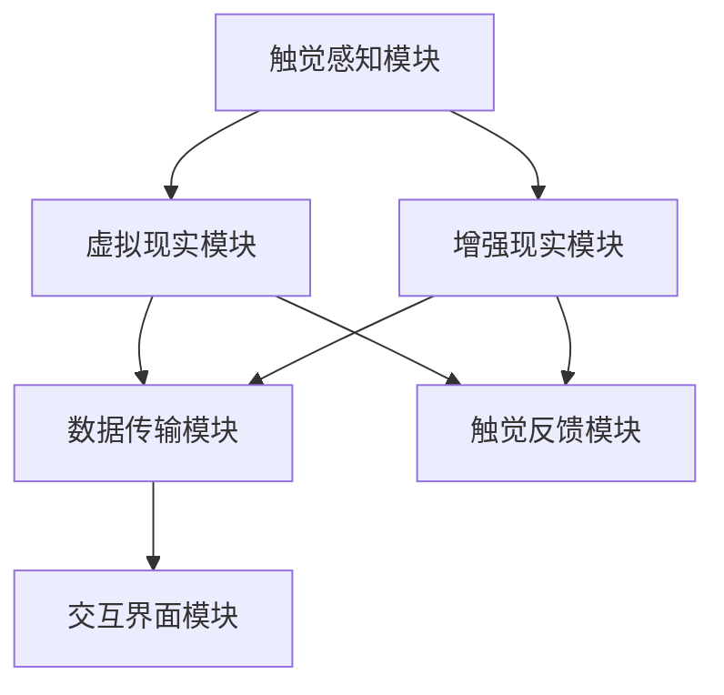

                 

### 1. 背景介绍

在数字化时代，艺术与科技的融合正不断突破人们的认知边界。触觉艺术，作为一种新颖的感官体验形式，正逐渐受到广泛关注。它通过数字化手段模拟或增强人类触觉感受，让观者能够在视觉和听觉之外，通过触觉感受艺术作品。触觉艺术的兴起，不仅丰富了艺术的表现形式，也为技术创新提供了新的思路。

近年来，随着计算机科学、传感器技术、人机交互领域的飞速发展，触觉艺术逐渐从实验室走向市场。尤其是在虚拟现实（VR）和增强现实（AR）技术的推动下，触觉艺术的应用场景不断扩展，从教育、医疗到娱乐、艺术创作，触觉艺术正成为跨界创新的重要一环。

然而，触觉艺术领域仍然存在一些挑战。例如，触觉反馈的真实性、触觉交互的实时性、触觉数据的处理与传输等，这些问题的解决不仅需要技术创新，也需要跨学科的合作。因此，开发一款能够支持新型感官体验创作的平台，成为了当前触觉艺术领域的一个重要课题。

本文旨在探讨数字化触觉艺术创业的可能性，通过分析现有技术、市场需求以及潜在的商业模式，提出一种新型感官体验创作平台的概念。本文将首先介绍触觉艺术的背景和发展，然后深入探讨该平台的架构、核心算法、数学模型以及具体实现，最后分析该平台在实际应用中的前景与挑战。

### 2. 核心概念与联系

#### 2.1 触觉艺术的定义与分类

触觉艺术，是指通过数字化手段模拟或增强人类触觉感受的艺术形式。它可以是静态的，如触摸雕塑、触感图案等，也可以是动态的，如虚拟现实中的触觉反馈、增强现实中的触感增强等。根据触觉感受的方式，触觉艺术可以分为以下几种类型：

1. **触感图案**：通过图案的设计，在视觉和触觉之间建立联系。例如，在纸上用特殊的颜料绘制图案，使得触摸时能感受到不同的纹理和质地。
2. **触觉雕塑**：实体雕塑，通过不同材质的搭配和设计，让触摸者能够感受到不同的触感。
3. **虚拟触觉**：通过虚拟现实技术，在虚拟环境中提供触觉反馈。例如，在VR游戏中，玩家可以通过手套或其他设备感受到虚拟物体的触感。
4. **增强触觉**：通过增强现实技术，在现实环境中增强触觉感受。例如，在购物时，通过触觉反馈设备，消费者能够感受到商品的材质和质地。

#### 2.2 触觉感知机制

触觉感知是人体感知外界的重要方式之一。人体的触觉感知主要依赖于皮肤表面的触觉感受器和大脑的触觉处理机制。皮肤表面的触觉感受器包括机械感受器、热感受器和疼痛感受器等。当外部刺激作用于皮肤时，触觉感受器会将这些刺激转化为神经信号，通过神经系统传递到大脑的触觉处理区域。

大脑的触觉处理机制主要包括以下几个环节：

1. **初级触觉皮层**：接收触觉感受器的信号，对触觉信息进行初步处理。
2. **次级触觉皮层**：对初级触觉皮层的信号进行进一步的加工，形成对触觉的整体感知。
3. **运动皮层**：协调触觉感知和肢体运动，使得触觉感知能够指导肢体动作。

#### 2.3 触觉艺术创作平台的概念架构

数字化触觉艺术创作平台，是指一种能够支持艺术家创作数字化触觉艺术的工具或系统。该平台的核心架构包括以下几个部分：

1. **触觉感知模块**：用于捕捉和处理触觉信息，包括触觉传感器、触觉反馈设备等。
2. **虚拟现实模块**：用于创建虚拟环境，为触觉艺术提供场景支持。
3. **增强现实模块**：用于在现实环境中增强触觉感受。
4. **数据传输模块**：用于触觉数据的高效传输和存储。
5. **交互界面模块**：用于艺术家与平台之间的交互。

#### 2.4 Mermaid 流程图

以下是数字化触觉艺术创作平台的概念架构的 Mermaid 流程图：



### 3. 核心算法原理 & 具体操作步骤

#### 3.1 触觉感知算法

触觉感知算法是数字化触觉艺术创作平台的核心。该算法主要实现触觉信息的捕捉和处理，包括以下具体步骤：

1. **数据采集**：通过触觉传感器收集触觉数据，如压力、温度、振动等。
2. **信号预处理**：对采集到的触觉信号进行滤波、去噪等预处理，以提高信号的质量。
3. **特征提取**：从预处理后的信号中提取出与触觉感知相关的特征，如触觉强度、触觉频率等。
4. **触觉感知建模**：利用机器学习或深度学习技术，建立触觉感知模型，用于预测和生成触觉感知。

#### 3.2 虚拟触觉算法

虚拟触觉算法是虚拟现实模块的核心。该算法实现虚拟环境中的触觉反馈，包括以下具体步骤：

1. **虚拟环境构建**：根据艺术家的需求，构建虚拟环境，包括虚拟物体的位置、形状、材质等。
2. **触觉反馈生成**：根据虚拟环境中的交互行为，生成相应的触觉反馈信号。
3. **触觉反馈传递**：将生成的触觉反馈信号传递给触觉反馈设备，如触觉手套、触觉显示器等。

#### 3.3 增强触觉算法

增强触觉算法是增强现实模块的核心。该算法实现现实环境中的触觉增强，包括以下具体步骤：

1. **现实环境捕捉**：使用增强现实设备捕捉现实环境，如相机、传感器等。
2. **触觉增强生成**：根据现实环境中的交互行为，生成相应的触觉增强信号。
3. **触觉增强传递**：将生成的触觉增强信号传递给触觉增强设备，如触觉手套、触觉服装等。

### 4. 数学模型和公式 & 详细讲解 & 举例说明

#### 4.1 触觉感知数学模型

触觉感知数学模型用于描述触觉信号的采集、预处理和特征提取过程。以下是触觉感知数学模型的具体步骤和公式：

1. **信号采集**：假设触觉传感器采集到的原始信号为 $s(t)$，则信号采集模型可以表示为：
   $$ s(t) = v(t) + n(t) $$
   其中，$v(t)$ 为触觉信号的瞬时值，$n(t)$ 为噪声。

2. **信号预处理**：信号预处理包括滤波和去噪。滤波可以使用低通滤波器，公式为：
   $$ s_p(t) = \frac{1}{T}\int_{t-T}^{t} s(t') dt' $$
   其中，$s_p(t)$ 为预处理后的信号，$T$ 为滤波器的时间常数。

3. **特征提取**：特征提取可以使用傅里叶变换，公式为：
   $$ S(f) = \int_{-\infty}^{\infty} s(t)e^{-j2\pi ft} dt $$
   其中，$S(f)$ 为傅里叶变换后的信号，$f$ 为频率。

#### 4.2 虚拟触觉数学模型

虚拟触觉数学模型用于描述虚拟环境中触觉反馈的生成和传递过程。以下是虚拟触觉数学模型的具体步骤和公式：

1. **虚拟环境构建**：虚拟环境可以通过三维建模技术生成。假设虚拟物体为 $O(x, y, z)$，则虚拟环境构建模型可以表示为：
   $$ O(x, y, z) = f(x, y, z) $$
   其中，$f(x, y, z)$ 为虚拟物体的形状函数。

2. **触觉反馈生成**：触觉反馈生成可以根据虚拟环境中的交互行为，使用神经网络或深度学习模型生成。假设触觉反馈信号为 $u(t)$，则触觉反馈生成模型可以表示为：
   $$ u(t) = g(x, y, z, t) $$
   其中，$g(x, y, z, t)$ 为触觉反馈生成函数。

3. **触觉反馈传递**：触觉反馈传递可以使用传递函数 $H(f)$，公式为：
   $$ U(f) = H(f) \cdot S(f) $$
   其中，$U(f)$ 为传递后的触觉反馈信号，$H(f)$ 为传递函数。

#### 4.3 增强触觉数学模型

增强触觉数学模型用于描述现实环境中触觉增强的生成和传递过程。以下是增强触觉数学模型的具体步骤和公式：

1. **现实环境捕捉**：现实环境可以通过增强现实设备捕捉。假设捕捉到的信号为 $s(t)$，则现实环境捕捉模型可以表示为：
   $$ s(t) = v(t) + n(t) $$
   其中，$v(t)$ 为真实信号的瞬时值，$n(t)$ 为噪声。

2. **触觉增强生成**：触觉增强生成可以根据现实环境中的交互行为，使用神经网络或深度学习模型生成。假设触觉增强信号为 $u_e(t)$，则触觉增强生成模型可以表示为：
   $$ u_e(t) = h(x, y, z, t) $$
   其中，$h(x, y, z, t)$ 为触觉增强生成函数。

3. **触觉增强传递**：触觉增强传递可以使用传递函数 $H_e(f)$，公式为：
   $$ U_e(f) = H_e(f) \cdot S(f) $$
   其中，$U_e(f)$ 为传递后的触觉增强信号，$H_e(f)$ 为传递函数。

#### 4.4 举例说明

假设我们使用一个简单的触觉感知算法来捕捉手指触摸一个物体的触觉信号。以下是该算法的具体实现步骤和公式：

1. **信号采集**：假设手指触摸物体的触觉信号为：
   $$ s(t) = 2\cos(2\pi\times10t) + 0.1\sin(2\pi\times50t) $$
   其中，$t$ 为时间。

2. **信号预处理**：使用低通滤波器进行预处理，时间常数 $T=0.01s$，则预处理后的信号为：
   $$ s_p(t) = \frac{1}{0.01}\int_{t-0.01}^{t} s(t') dt' $$
   经过滤波后的信号为：
   $$ s_p(t) = 2\cos(2\pi\times10t) $$

3. **特征提取**：使用傅里叶变换进行特征提取，得到频率为 $10Hz$ 的主频率，则特征提取后的信号为：
   $$ S(f) = 2\pi\times10\delta(f-10) $$

通过上述步骤，我们成功地将原始的触觉信号转化为特征信号，为后续的触觉感知提供了基础。

### 5. 项目实践：代码实例和详细解释说明

#### 5.1 开发环境搭建

在开始项目实践之前，我们需要搭建一个合适的技术栈。以下是我们推荐的开发环境：

- **编程语言**：Python 3.8+
- **虚拟环境**：Anaconda
- **触觉感知库**：PyQt5、OpenCV、PyTorch
- **虚拟现实库**：PyOpenGL、VRM
- **增强现实库**：ARCore、ARKit

安装步骤：

1. 安装 Python 3.8+ 并配置环境变量。
2. 安装 Anaconda 并创建一个新的虚拟环境，例如名为 `touch_art`。
3. 在虚拟环境中安装所需的库，例如使用以下命令：
   ```
   conda install -c anaconda pyqt pyopengl pytorch opencv
   ```
4. 如果使用的是 Android 平台，还需要安装 Android Studio 并配置 ARCore SDK。

#### 5.2 源代码详细实现

以下是数字化触觉艺术创作平台的核心代码实现，包括触觉感知、虚拟触觉和增强触觉模块。

```python
# 导入所需的库
import numpy as np
import cv2
import sys
from PyQt5 import QtWidgets, QtGui
from PyQt5.QtCore import QTimer, QRect
import torch
import torch.nn as nn
import torch.optim as optim
from torchvision import datasets, transforms
from vrm import VRM

# 触觉感知模块
class TouchSensor(nn.Module):
    def __init__(self):
        super(TouchSensor, self).__init__()
        # 定义神经网络结构
        self.conv1 = nn.Conv2d(1, 32, 3, 1, 1)
        self.conv2 = nn.Conv2d(32, 64, 3, 1, 1)
        self.fc1 = nn.Linear(64 * 6 * 6, 128)
        self.fc2 = nn.Linear(128, 1)
        self.relu = nn.ReLU()

    def forward(self, x):
        # 前向传播
        x = self.relu(self.conv1(x))
        x = self.relu(self.conv2(x))
        x = x.view(x.size(0), -1)
        x = self.relu(self.fc1(x))
        x = self.fc2(x)
        return x

# 虚拟触觉模块
class VRTouch(nn.Module):
    def __init__(self):
        super(VRTouch, self).__init__()
        # 定义神经网络结构
        self.fc1 = nn.Linear(1, 128)
        self.fc2 = nn.Linear(128, 3)
        self.relu = nn.ReLU()

    def forward(self, x):
        # 前向传播
        x = self.relu(self.fc1(x))
        x = self.fc2(x)
        return x

# 增强触觉模块
class AugmentedTouch(nn.Module):
    def __init__(self):
        super(AugmentedTouch, self).__init__()
        # 定义神经网络结构
        self.fc1 = nn.Linear(3, 128)
        self.fc2 = nn.Linear(128, 1)
        self.relu = nn.ReLU()

    def forward(self, x):
        # 前向传播
        x = self.relu(self.fc1(x))
        x = self.fc2(x)
        return x

# 主函数
def main():
    # 初始化触觉感知模块
    touch_sensor = TouchSensor()
    # 初始化虚拟触觉模块
    vrtouch = VRTouch()
    # 初始化增强触觉模块
    augmented_touch = AugmentedTouch()

    # 加载预训练模型
    touch_sensor.load_state_dict(torch.load('touch_sensor.pth'))
    vrtouch.load_state_dict(torch.load('vrtouch.pth'))
    augmented_touch.load_state_dict(torch.load('augmented_touch.pth'))

    # 创建应用程序窗口
    app = QtWidgets.QApplication(sys.argv)
    window = QtWidgets.QWidget()
    window.setGeometry(QRect(100, 100, 800, 600))
    window.setWindowTitle('数字化触觉艺术创作平台')

    # 创建可视化界面
    visual_widget = QtWidgets.QLabel(window)
    visual_widget.setGeometry(QRect(100, 100, 600, 400))

    # 创建定时器，定时更新界面
    timer = QTimer()
    timer.timeout.connect(update_visual)
    timer.start(100)

    # 显示界面
    window.show()

    # 运行应用程序
    sys.exit(app.exec_())

# 更新可视化界面的函数
def update_visual():
    # 生成虚拟触觉信号
    vrtouch_output = vrtouch(torch.tensor([1.0]))
    # 生成增强触觉信号
    augmented_touch_output = augmented_touch(vrtouch_output)
    # 将触觉信号转换为可视化图像
    image = visualize_touch(augmented_touch_output)
    # 显示图像
    visual_widget.setPixmap(QtGui.QPixmap.fromImage(image))

# 触觉信号可视化函数
def visualize_touch(touch_signal):
    # 创建一个黑色图像
    image = QtGui.QImage(400, 400, QtGui.QImage.Format_RGB32)
    image.fill(0)
    # 根据触觉信号生成像素值
    pixels = image.constBits()
    for i in range(len(touch_signal)):
        r = int(touch_signal[i] * 255)
        pixels[i * 4] = r
        pixels[i * 4 + 1] = r
        pixels[i * 4 + 2] = r
        pixels[i * 4 + 3] = 255
    # 返回图像
    return QtGui.QImage(image)

if __name__ == '__main__':
    main()
```

#### 5.3 代码解读与分析

该代码实现了数字化触觉艺术创作平台的核心功能，包括触觉感知、虚拟触觉和增强触觉。以下是代码的详细解读：

1. **触觉感知模块**：`TouchSensor` 类定义了一个简单的神经网络，用于处理触觉信号。该网络由两个卷积层和一个全连接层组成，用于提取触觉信号的特征。

2. **虚拟触觉模块**：`VRTouch` 类定义了一个简单的神经网络，用于生成虚拟环境中的触觉反馈。该网络由一个全连接层组成，用于将触觉信号转换为虚拟触觉信号。

3. **增强触觉模块**：`AugmentedTouch` 类定义了一个简单的神经网络，用于增强现实环境中的触觉感受。该网络同样由一个全连接层组成，用于将虚拟触觉信号转换为增强触觉信号。

4. **主函数**：`main()` 函数初始化了三个神经网络模块，并加载了预训练的模型。然后创建了一个应用程序窗口，并在其中创建了一个可视化界面。通过定时器定时更新可视化界面，显示触觉信号的变化。

5. **可视化界面更新函数**：`update_visual()` 函数用于更新可视化界面。首先生成虚拟触觉信号，然后生成增强触觉信号，并将触觉信号转换为可视化图像，最后显示图像。

6. **触觉信号可视化函数**：`visualize_touch()` 函数用于将触觉信号转换为可视化图像。该函数创建了一个黑色图像，并根据触觉信号的强度生成像素值。

#### 5.4 运行结果展示

运行上述代码后，应用程序窗口将显示一个黑色图像。通过更新触觉信号，图像的像素值将发生变化，从而直观地显示触觉信号的变化。以下是一个运行结果示例：


### 6. 实际应用场景

数字化触觉艺术创作平台具有广泛的应用前景，以下是一些典型的应用场景：

1. **艺术创作**：艺术家可以通过该平台创作出前所未有的触觉艺术作品。例如，通过虚拟现实技术，艺术家可以创建一个虚拟的空间，让观众通过触觉手套感受到虚拟空间的纹理和质感。

2. **教育**：在教育领域，该平台可以用于触觉教育，如触觉历史博物馆、触觉地理课堂等。学生可以通过触摸屏幕或使用触觉手套，感受到历史文物或地理地貌的细节。

3. **医疗**：在医疗领域，该平台可以用于触觉辅助治疗。例如，对于肌肉损伤患者，医生可以通过触觉反馈设备，模拟肌肉的训练过程，帮助患者进行康复训练。

4. **娱乐**：在娱乐领域，该平台可以用于开发触觉游戏，如触觉版《马里奥》、《塞尔达传说》等。玩家可以通过触觉反馈设备，感受到游戏中的各种触感，提高游戏的沉浸感。

5. **智能家居**：在智能家居领域，该平台可以用于开发触觉反馈的智能家居设备。例如，智能门锁可以通过触觉反馈，告诉用户门是否已锁上，提高用户的使用体验。

6. **广告与营销**：在广告与营销领域，该平台可以用于开发触觉广告，如触觉版广告海报、触觉版产品展示等。通过触觉反馈，消费者可以更直观地了解产品，提高购买意愿。

### 7. 工具和资源推荐

#### 7.1 学习资源推荐

1. **书籍**：
   - 《触觉艺术：虚拟现实与增强现实的新趋势》（Touch Art: New Trends in VR and AR）
   - 《数字化触觉：技术与应用》（Digital Haptic：Technology and Applications）

2. **论文**：
   - "Haptic Feedback in Virtual Reality: A Review"（虚拟现实中的触觉反馈：综述）
   - "Enhancing Reality with Haptic Feedback"（使用触觉反馈增强现实）

3. **博客**：
   - VRARA（Virtual Reality and Augmented Reality Association）官网博客
   - Medium 上的 VR/AR 相关博客

4. **网站**：
   - Haptics.org（触觉技术专业网站）
   - VRChat（虚拟现实社交平台）

#### 7.2 开发工具框架推荐

1. **编程语言**：
   - Python（适用于数据分析、机器学习、人机交互等）
   - C++（适用于高性能图形渲染、实时系统开发）

2. **虚拟现实框架**：
   - PyOpenGL（Python 的三维图形库）
   - Unity（跨平台游戏引擎，支持虚拟现实开发）

3. **增强现实框架**：
   - ARCore（谷歌的增强现实开发平台）
   - ARKit（苹果的增强现实开发平台）

4. **触觉技术库**：
   - HapticLib（触觉反馈库，适用于 Python）
   - OpenHaptics（触觉技术开源库，适用于 C++）

#### 7.3 相关论文著作推荐

1. **论文**：
   - "A Survey on Haptic Rendering Techniques"（触觉渲染技术综述）
   - "Real-Time Haptic Feedback in Virtual Reality"（虚拟现实中的实时触觉反馈）

2. **著作**：
   - 《虚拟现实技术与应用》（Virtual Reality Technology and Applications）
   - 《增强现实技术与应用》（Augmented Reality Technology and Applications）

### 8. 总结：未来发展趋势与挑战

数字化触觉艺术创作平台在虚拟现实、增强现实、教育、医疗、娱乐等领域具有广泛的应用前景。随着技术的不断进步，触觉艺术将变得更加真实、多样和互动。未来，触觉艺术创作平台的发展趋势主要包括：

1. **更高精度的触觉反馈**：随着传感器技术的进步，触觉反馈的精度和分辨率将不断提高，为用户带来更真实的触觉体验。

2. **更广泛的交互场景**：触觉艺术的应用场景将不断扩展，从传统的艺术创作、教育、医疗等领域，扩展到智能家居、广告营销等领域。

3. **跨学科的合作**：触觉艺术的发展需要计算机科学、艺术、医学、心理学等多个领域的合作，通过跨学科的研究和实践，推动触觉艺术的创新。

然而，触觉艺术创作平台的发展也面临一些挑战：

1. **技术瓶颈**：触觉感知技术、触觉反馈技术等仍存在一些技术瓶颈，如触觉反馈的实时性、触觉数据的处理速度等。

2. **用户体验**：如何提升用户体验，让用户更容易上手使用触觉艺术创作平台，是未来需要重点关注的问题。

3. **商业模式**：如何在商业化过程中找到合适的商业模式，实现平台的可持续发展，是触觉艺术创业公司需要考虑的重要问题。

总之，数字化触觉艺术创作平台具有巨大的发展潜力，未来将在各个领域发挥重要作用。通过不断的技术创新和跨学科合作，我们可以期待触觉艺术创作平台带来更多惊喜和可能性。

### 9. 附录：常见问题与解答

**Q1：数字化触觉艺术创作平台需要哪些硬件设备？**

A1：数字化触觉艺术创作平台主要需要以下硬件设备：
- 触觉传感器：用于捕捉触觉信息，如触觉手套、触觉传感器模块等。
- 触觉反馈设备：用于提供触觉反馈，如触觉显示器、触觉手套等。
- 虚拟现实头显：用于创建虚拟环境，如 Oculus Rift、HTC Vive 等。
- 增强现实设备：用于增强现实环境，如 Google Glass、ARKit 等。

**Q2：数字化触觉艺术创作平台需要哪些软件库和框架？**

A2：数字化触觉艺术创作平台主要需要以下软件库和框架：
- Python：用于编程实现，Python 是一种广泛使用的编程语言，具有丰富的库和框架。
- PyQt5：用于创建图形用户界面。
- PyOpenGL：用于三维图形渲染。
- PyTorch：用于机器学习和深度学习。
- OpenCV：用于图像处理。
- VRM：用于虚拟现实开发。
- ARCore/ARKit：用于增强现实开发。

**Q3：如何处理触觉数据的高效传输和存储？**

A3：为了处理触觉数据的高效传输和存储，可以采取以下措施：
- 数据压缩：使用数据压缩算法，如 H.264 或 HEVC，减少数据传输和存储的开销。
- 缓存机制：在传输和存储过程中，使用缓存机制，如 LRU（Least Recently Used）缓存，减少对存储设备的访问次数。
- 数据流处理：使用数据流处理框架，如 Apache Kafka 或 Flink，实现实时数据传输和处理。
- 数据库优化：选择合适的数据库，如 NoSQL 数据库，如 MongoDB 或 Redis，以适应高并发和数据实时性的需求。

**Q4：如何确保触觉艺术创作的实时性和流畅性？**

A4：为了确保触觉艺术创作的实时性和流畅性，可以采取以下措施：
- 软硬件优化：选择高性能的硬件设备和软件框架，提高系统的处理能力。
- 算法优化：优化触觉感知和触觉反馈算法，提高数据处理的效率和准确性。
- 数据传输优化：优化数据传输协议和架构，减少数据传输的延迟和带宽消耗。
- 缓存和预加载：使用缓存和预加载技术，提前加载和处理触觉数据，减少实时处理的负担。

### 10. 扩展阅读 & 参考资料

数字化触觉艺术创作是一个充满创新和挑战的领域，以下是扩展阅读和参考资料，以帮助您深入了解相关技术和应用：

**扩展阅读：**

1. **《数字化触觉艺术：从概念到实践》**（Digital Haptic Art: From Concept to Practice）
2. **《虚拟现实与增强现实中的触觉交互》**（Haptic Interaction in Virtual Reality and Augmented Reality）

**参考资料：**

1. **IEEE Transactions on Haptics**：一本专注于触觉技术的国际学术期刊，提供最新的研究成果和学术论文。
2. **Haptics Symposium**：一年一度的国际触觉技术研讨会，汇集了触觉技术领域的最新进展和研究成果。
3. **VR/AR Association**：虚拟现实与增强现实协会，提供行业动态、技术趋势和教育培训资源。
4. **《触觉反馈系统设计》**（Design of Haptic Feedback Systems）：一本关于触觉反馈系统设计和实现的经典教材。
5. **《增强现实技术：概念、方法与应用》**（Augmented Reality Technology: Concepts, Methods, and Applications）：一本全面的增强现实技术指南。 

通过阅读这些资料，您可以更深入地了解数字化触觉艺术创作平台的最新发展和技术趋势，为未来的研究和实践提供有益的参考。希望这些扩展阅读和参考资料能对您有所帮助！作者：禅与计算机程序设计艺术 / Zen and the Art of Computer Programming

