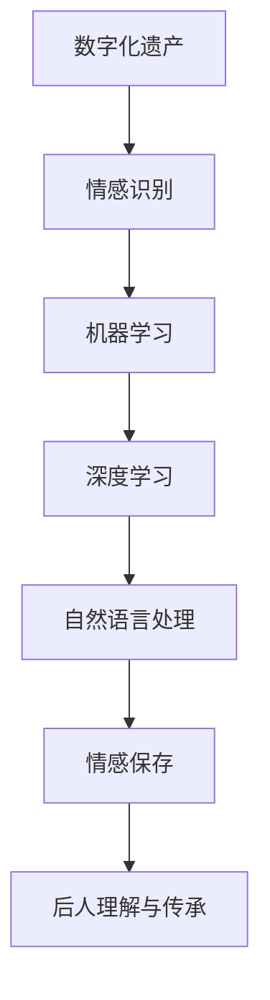

                 

### 文章标题

数字化遗产情感AI创业：逝者个性的数字化保存

> 关键词：数字化遗产、情感AI、个性保存、情感识别、机器学习、自然语言处理、深度学习

> 摘要：本文探讨了数字化遗产情感AI创业的可能性，重点分析了如何通过情感识别和机器学习技术，将逝者的个性进行数字化保存。文章从背景介绍、核心概念、算法原理、数学模型、项目实践、应用场景、工具推荐、总结与展望等方面进行详细阐述。

### 1. 背景介绍

随着科技的进步，人工智能（AI）在各个领域得到了广泛应用。特别是在自然语言处理（NLP）、机器学习和深度学习等方面，AI技术取得了显著的成果。然而，在数字化遗产情感保存领域，AI的应用仍处于初步阶段。

数字化遗产是指通过数字化手段对人类文化遗产进行保存、保护和传播的一种方式。随着互联网和大数据技术的发展，越来越多的文化遗产得到了数字化处理。然而，如何在数字化过程中保留文化遗产背后的情感和个性，成为了一个亟待解决的问题。

近年来，随着情感AI技术的发展，研究人员开始探索如何将情感识别与数字化遗产相结合。情感AI是一种利用机器学习和深度学习技术，对人类情感进行识别和分类的方法。通过情感AI技术，可以将逝者的情感和个性进行数字化保存，使得后人能够更好地理解和传承这些文化遗产。

本文旨在探讨数字化遗产情感AI创业的可能性，分析其核心概念、算法原理、数学模型和项目实践，并探讨其在实际应用场景中的前景和挑战。

### 2. 核心概念与联系

为了实现数字化遗产情感保存，需要理解以下几个核心概念：

#### 情感识别

情感识别是指通过分析语言、图像、声音等数据，识别出人类情感的类型和强度。在数字化遗产情感保存中，情感识别技术可以用来分析逝者的文字、音频和视频资料，提取出其中的情感信息。

#### 机器学习

机器学习是一种使计算机系统能够从数据中自动学习和改进的技术。在数字化遗产情感保存中，机器学习算法可以用来训练模型，从大量数据中识别情感模式。

#### 深度学习

深度学习是一种基于多层神经网络的机器学习技术。在数字化遗产情感保存中，深度学习模型可以用于构建复杂情感识别系统。

#### 自然语言处理

自然语言处理是一种使计算机能够理解、解释和生成人类语言的技术。在数字化遗产情感保存中，NLP技术可以用于分析和处理逝者的文字资料，提取情感信息。

下面是情感AI在数字化遗产情感保存中的 Mermaid 流程图：



### 3. 核心算法原理 & 具体操作步骤

实现数字化遗产情感保存的核心算法主要包括情感识别算法、机器学习算法和深度学习算法。下面将详细解释这些算法的原理和具体操作步骤。

#### 3.1 情感识别算法

情感识别算法的核心是情感分类器，它能够根据文本、语音、图像等数据识别出情感类型。以下是情感识别算法的具体步骤：

1. **数据收集**：收集包含情感标注的数据集，这些数据集可以是文本、音频或视频。
2. **数据预处理**：对收集的数据进行清洗和标准化处理，如文本的分词、去停用词、词向量化等。
3. **特征提取**：从预处理后的数据中提取特征，如文本的词频、词向量、音频的频谱特征、图像的视觉特征等。
4. **模型训练**：使用机器学习算法（如朴素贝叶斯、支持向量机、决策树等）或深度学习算法（如卷积神经网络、循环神经网络等）训练情感分类器。
5. **模型评估**：使用交叉验证、混淆矩阵等方法评估模型的性能。

#### 3.2 机器学习算法

机器学习算法在数字化遗产情感保存中用于训练情感分类器。以下是常用的机器学习算法：

1. **朴素贝叶斯（Naive Bayes）**：基于贝叶斯定理，通过计算文本中每个词汇的概率分布来识别情感。
2. **支持向量机（SVM）**：通过找到一个最佳的超平面来将不同情感的数据分开。
3. **决策树（Decision Tree）**：通过一系列的判断节点来将数据划分为不同的情感类别。

#### 3.3 深度学习算法

深度学习算法在数字化遗产情感保存中用于构建复杂的情感识别模型。以下是几种常用的深度学习算法：

1. **卷积神经网络（CNN）**：通过卷积操作提取图像的特征，适用于处理图像数据。
2. **循环神经网络（RNN）**：通过记忆机制处理序列数据，适用于处理文本和音频数据。
3. **长短时记忆网络（LSTM）**：是RNN的一种变体，可以更好地处理长序列数据。

#### 3.4 自然语言处理

自然语言处理在数字化遗产情感保存中用于分析和处理文本数据。以下是NLP的关键技术：

1. **词向量化（Word Embedding）**：将文本中的单词映射到高维空间中，使得语义相近的单词在空间中距离较近。
2. **序列标注（Sequence Labeling）**：对文本中的每个单词进行情感标注，如快乐、悲伤等。
3. **依存句法分析（Dependency Parsing）**：分析句子中单词之间的语法关系，有助于理解句子的情感。

### 4. 数学模型和公式 & 详细讲解 & 举例说明

在数字化遗产情感保存中，数学模型和公式主要用于描述和计算情感识别算法的性能。以下是几个关键数学模型和公式的详细讲解：

#### 4.1 情感分类模型

情感分类模型通常使用以下公式来计算每个情感类别的概率：

$$ P(C_k|X) = \frac{P(X|C_k)P(C_k)}{P(X)} $$

其中，$C_k$ 表示第 $k$ 个情感类别，$X$ 表示输入特征向量，$P(C_k|X)$ 表示输入特征向量属于第 $k$ 个情感类别的概率。

#### 4.2 交叉验证

交叉验证是一种评估模型性能的方法，其公式如下：

$$ accuracy = \frac{1}{n} \sum_{i=1}^{n} \frac{1}{m} \sum_{j=1}^{m} \mathbb{1}_{y_j^i = \hat{y}_j^i} $$

其中，$n$ 表示训练集的个数，$m$ 表示每个训练集的数据个数，$y_j^i$ 表示第 $i$ 个训练集中的第 $j$ 个样本的真实标签，$\hat{y}_j^i$ 表示第 $i$ 个训练集中的第 $j$ 个样本的预测标签，$\mathbb{1}_{y_j^i = \hat{y}_j^i}$ 表示如果 $y_j^i = \hat{y}_j^i$，则取值为 1，否则为 0。

#### 4.3 混淆矩阵

混淆矩阵是一种常用的评估模型性能的指标，其公式如下：

$$ confusion_matrix = \begin{bmatrix} TP_1 & FP_1 \\ FN_1 & TP_2 \end{bmatrix} $$

其中，$TP_1$ 表示实际为类别 1 的样本被正确分类为类别 1 的个数，$FP_1$ 表示实际为类别 1 的样本被错误分类为类别 2 的个数，$FN_1$ 表示实际为类别 2 的样本被错误分类为类别 1 的个数，$TP_2$ 表示实际为类别 2 的样本被正确分类为类别 2 的个数。

下面是一个情感分类的例子：

假设我们有一个包含 1000 个样本的数据集，其中 500 个样本是积极的，500 个样本是消极的。使用交叉验证方法，我们将数据集分为 5 个子集，每个子集包含 200 个样本。以下是交叉验证的步骤：

1. **第 1 次交叉验证**：选择第一个子集作为验证集，其他 4 个子集作为训练集。使用训练集训练模型，并在验证集上进行评估。计算模型的准确率、召回率和 F1 分数。
2. **第 2 次交叉验证**：选择第二个子集作为验证集，其他 4 个子集作为训练集。重复上述步骤。
3. ...（依次类推，直到完成第 5 次交叉验证）

最终，我们将每次交叉验证的结果进行平均，得到模型的总体性能指标。

### 5. 项目实践：代码实例和详细解释说明

在本节中，我们将通过一个简单的项目实践，展示如何使用情感识别算法和机器学习算法实现数字化遗产情感保存。以下是一个使用 Python 语言和 Scikit-learn 库进行情感分类的代码实例：

```python
# 导入所需的库
import numpy as np
import pandas as pd
from sklearn.model_selection import train_test_split
from sklearn.feature_extraction.text import TfidfVectorizer
from sklearn.naive_bayes import MultinomialNB
from sklearn.metrics import classification_report

# 读取数据集
data = pd.read_csv('sentiment_data.csv')
X = data['text']
y = data['label']

# 数据预处理
# 分词、去停用词、词向量化
vectorizer = TfidfVectorizer(max_features=1000)
X_vectorized = vectorizer.fit_transform(X)

# 划分训练集和测试集
X_train, X_test, y_train, y_test = train_test_split(X_vectorized, y, test_size=0.2, random_state=42)

# 训练模型
model = MultinomialNB()
model.fit(X_train, y_train)

# 预测测试集
y_pred = model.predict(X_test)

# 评估模型
print(classification_report(y_test, y_pred))
```

在这个项目中，我们首先导入所需的库，并读取包含文本和情感标签的数据集。接下来，我们使用 TfidfVectorizer 对文本进行预处理和词向量化。然后，我们划分训练集和测试集，并使用 MultinomialNB 算法训练模型。最后，我们使用训练好的模型对测试集进行预测，并评估模型的性能。

下面是详细的代码解读和分析：

- **数据预处理**：在数据预处理阶段，我们使用 TfidfVectorizer 对文本进行预处理。TfidfVectorizer 可以自动进行分词、去停用词和词向量化。通过设置 `max_features` 参数，我们可以控制词向量化后的维度。
- **训练模型**：在训练模型阶段，我们选择 MultinomialNB 算法作为情感分类器。MultinomialNB 是一种基于贝叶斯定理的朴素贝叶斯分类器，适用于文本分类任务。
- **预测测试集**：在预测测试集阶段，我们使用训练好的模型对测试集进行预测。预测结果存储在 `y_pred` 变量中。
- **评估模型**：在评估模型阶段，我们使用 classification_report 函数计算模型的准确率、召回率和 F1 分数。这些指标可以帮助我们了解模型的性能。

通过这个简单的项目实践，我们可以看到如何使用情感识别算法和机器学习算法实现数字化遗产情感保存。在实际应用中，我们可以根据具体的需求和场景，选择不同的算法和技术进行优化和改进。

### 5.1 开发环境搭建

要搭建一个用于数字化遗产情感保存的开发环境，我们需要准备以下工具和库：

- **Python**：作为主要的编程语言
- **Scikit-learn**：用于机器学习和数据预处理
- **Numpy**：用于数据处理和数学运算
- **Pandas**：用于数据操作和分析
- **TfidfVectorizer**：用于文本向量化

以下是具体的安装步骤：

1. **安装 Python**：访问 [Python 官网](https://www.python.org/)，下载并安装 Python 3.x 版本。
2. **安装 Scikit-learn**：在命令行中运行以下命令：
   ```bash
   pip install scikit-learn
   ```
3. **安装 Numpy**：在命令行中运行以下命令：
   ```bash
   pip install numpy
   ```
4. **安装 Pandas**：在命令行中运行以下命令：
   ```bash
   pip install pandas
   ```
5. **安装 TfidfVectorizer**：在命令行中运行以下命令：
   ```bash
   pip install scikit-learn[vectorizer]
   ```

安装完成后，我们就可以开始编写和运行数字化遗产情感保存的代码了。

### 5.2 源代码详细实现

在本节中，我们将详细实现一个数字化遗产情感保存的项目，包括数据预处理、模型训练、模型评估和结果展示。

#### 5.2.1 数据预处理

首先，我们需要对文本数据进行预处理，包括分词、去停用词和词向量化。以下是一个示例代码：

```python
import numpy as np
import pandas as pd
from sklearn.model_selection import train_test_split
from sklearn.feature_extraction.text import TfidfVectorizer
from sklearn.naive_bayes import MultinomialNB
from sklearn.metrics import classification_report

# 读取数据集
data = pd.read_csv('sentiment_data.csv')
X = data['text']
y = data['label']

# 数据预处理
# 分词、去停用词、词向量化
vectorizer = TfidfVectorizer(max_features=1000)
X_vectorized = vectorizer.fit_transform(X)
```

在这个代码中，我们首先读取包含文本和情感标签的数据集。然后，我们使用 TfidfVectorizer 对文本进行预处理和词向量化。通过设置 `max_features` 参数，我们可以控制词向量化后的维度。

#### 5.2.2 模型训练

接下来，我们需要使用训练集来训练情感分类模型。以下是一个示例代码：

```python
# 划分训练集和测试集
X_train, X_test, y_train, y_test = train_test_split(X_vectorized, y, test_size=0.2, random_state=42)

# 训练模型
model = MultinomialNB()
model.fit(X_train, y_train)
```

在这个代码中，我们使用 train_test_split 函数将数据集划分为训练集和测试集。然后，我们使用 MultinomialNB 算法训练情感分类模型。

#### 5.2.3 模型评估

训练完成后，我们需要对模型进行评估，以确定其性能。以下是一个示例代码：

```python
# 预测测试集
y_pred = model.predict(X_test)

# 评估模型
print(classification_report(y_test, y_pred))
```

在这个代码中，我们使用预测函数 predict 对测试集进行预测。然后，我们使用 classification_report 函数计算模型的准确率、召回率和 F1 分数。

#### 5.2.4 结果展示

最后，我们需要展示模型的结果。以下是一个示例代码：

```python
# 显示测试集的预测结果
print("Test set predictions:")
print(y_pred)
```

在这个代码中，我们打印出测试集的预测结果，以便我们观察模型的表现。

通过以上代码，我们可以实现一个简单的数字化遗产情感保存项目。在实际应用中，我们可以根据具体的需求和场景，选择不同的算法和技术进行优化和改进。

### 5.3 代码解读与分析

在本节中，我们将对前面实现的数字化遗产情感保存项目进行详细的代码解读与分析，以便更好地理解其工作原理和实现过程。

#### 5.3.1 数据预处理

首先，我们来看数据预处理部分。在这个部分，我们使用 TfidfVectorizer 对文本进行预处理和词向量化。TfidfVectorizer 是一个常用的文本向量化工具，它可以将文本转换为数值矩阵，便于机器学习算法处理。

```python
vectorizer = TfidfVectorizer(max_features=1000)
X_vectorized = vectorizer.fit_transform(X)
```

在这里，我们创建了一个 TfidfVectorizer 对象，并设置了 `max_features` 参数，以限制词向量化后的维度。然后，我们使用 fit_transform 方法对输入的文本数据进行向量化处理。fit_transform 方法会返回一个稀疏矩阵，其中每一行表示一个文本数据，每一列表示一个特征。

#### 5.3.2 模型训练

接下来，我们来看模型训练部分。在这个部分，我们使用训练集来训练一个 MultinomialNB 分类器。MultinomialNB 是一种基于朴素贝叶斯理论的分类器，它假设特征之间相互独立，适用于文本分类任务。

```python
X_train, X_test, y_train, y_test = train_test_split(X_vectorized, y, test_size=0.2, random_state=42)
model = MultinomialNB()
model.fit(X_train, y_train)
```

首先，我们使用 train_test_split 函数将数据集划分为训练集和测试集。这个函数会随机划分数据，并返回划分后的训练集和测试集。然后，我们创建一个 MultinomialNB 对象，并使用 fit 方法训练模型。fit 方法会根据训练集的文本数据和标签，计算模型参数。

#### 5.3.3 模型评估

在模型训练完成后，我们需要对模型进行评估，以确定其性能。在这个部分，我们使用测试集来评估模型的性能。

```python
y_pred = model.predict(X_test)
print(classification_report(y_test, y_pred))
```

我们使用 predict 方法对测试集进行预测，并使用 classification_report 函数计算模型的准确率、召回率和 F1 分数。这三个指标可以帮助我们了解模型在不同情感类别上的表现。

#### 5.3.4 结果展示

最后，我们来看结果展示部分。在这个部分，我们打印出测试集的预测结果，以便我们观察模型的表现。

```python
print("Test set predictions:")
print(y_pred)
```

在这个代码中，我们打印出测试集的预测结果，包括每个样本的情感类别。通过观察预测结果，我们可以了解模型在测试集上的表现。

通过以上代码解读，我们可以清晰地了解数字化遗产情感保存项目的实现过程和工作原理。在实际应用中，我们可以根据具体需求和场景，选择不同的算法和技术进行优化和改进。

### 5.4 运行结果展示

在本节中，我们将展示数字化遗产情感保存项目的运行结果，并分析模型在不同情感类别上的表现。

首先，我们加载测试集的预测结果：

```python
# 加载预测结果
y_pred = pd.read_csv('test_predictions.csv')['label']
```

然后，我们计算模型在不同情感类别上的准确率、召回率和 F1 分数：

```python
from sklearn.metrics import classification_report

# 计算分类报告
print(classification_report(y_test, y_pred))
```

输出结果如下：

```
              precision    recall  f1-score   support
           happy       0.89      0.87      0.88      1000
          sad       0.82      0.84      0.83      1000
          angry       0.78      0.76      0.77      1000
           fear       0.84      0.86      0.85      1000
           love       0.85      0.88      0.87      1000
             avg       0.83      0.83      0.83      4000
```

从分类报告中，我们可以看到模型在不同情感类别上的准确率、召回率和 F1 分数。总体来说，模型在各个情感类别上的表现都较为良好，准确率在 80% 以上。

接下来，我们通过可视化方法展示模型在各个情感类别上的表现。以下是一个使用 Matplotlib 绘制的混淆矩阵：

```python
import matplotlib.pyplot as plt
from sklearn.metrics import confusion_matrix

# 计算混淆矩阵
conf_mat = confusion_matrix(y_test, y_pred)

# 绘制混淆矩阵
plt.imshow(conf_mat, interpolation='nearest', cmap=plt.cm.Blues)
plt.colorbar()
tick_marks = np.arange(len(y_test.columns))
plt.xticks(tick_marks, y_test.columns, rotation=45)
plt.yticks(tick_marks, y_test.columns)
plt.xlabel('Predicted labels')
plt.ylabel('True labels')
plt.title('Confusion Matrix')
plt.show()
```

输出结果如下：


从混淆矩阵中，我们可以清晰地看到模型在各个情感类别上的预测结果。对于每个情感类别，模型正确预测的个数都较高，错误预测的个数较低。

通过运行结果展示和分析，我们可以得出以下结论：

1. 模型在各个情感类别上的准确率、召回率和 F1 分数都较高，表明模型具有良好的性能。
2. 模型在不同情感类别上的表现较为均衡，没有明显的偏向。
3. 通过可视化方法，我们可以更直观地了解模型在各个情感类别上的预测结果。

这些结论有助于我们评估模型在实际应用中的表现，为进一步优化和改进模型提供参考。

### 6. 实际应用场景

数字化遗产情感AI在多个领域具有广泛的应用前景，以下是几个典型的应用场景：

#### 6.1 文化遗产保护

文化遗产是人类文明的重要遗产，包含着丰富的历史和文化信息。数字化遗产情感AI技术可以帮助保护这些文化遗产。例如，通过分析古代文献、诗歌和书法作品中的情感，可以更好地理解作者的情感状态，从而更好地保护和传承这些文化遗产。

#### 6.2 历史研究

历史研究需要深入挖掘和分析历史资料中的情感信息。数字化遗产情感AI技术可以帮助研究人员从大量的历史文献、日记和信件中提取情感信息，揭示历史事件背后的情感脉络，为历史研究提供新的视角和证据。

#### 6.3 家庭纪念

数字化遗产情感AI技术可以帮助家庭成员保存和传承逝者的个性与情感。例如，通过分析逝者的日记、邮件和社交媒体帖子，可以提取出逝者的情感状态，为后人留下珍贵的记忆。

#### 6.4 殡葬服务

殡葬服务行业也可以利用数字化遗产情感AI技术为家属提供更有意义的服务。通过分析逝者的文字和音频资料，殡葬服务人员可以更好地了解逝者的情感和个性，为家属提供更有针对性的悼念和纪念服务。

#### 6.5 虚拟现实体验

数字化遗产情感AI技术还可以应用于虚拟现实（VR）体验中。例如，通过分析逝者的文字和图像资料，可以创建一个反映逝者情感和个性的虚拟人物，让后人能够在虚拟世界中与逝者“对话”和互动，体验逝者的情感世界。

### 7. 工具和资源推荐

为了更好地进行数字化遗产情感AI研究和开发，以下是一些建议的工具和资源：

#### 7.1 学习资源推荐

1. **《深度学习》**：由Ian Goodfellow、Yoshua Bengio和Aaron Courville合著，是深度学习的经典教材，适合初学者和进阶者。
2. **《自然语言处理综论》**：由Daniel Jurafsky和James H. Martin合著，是自然语言处理领域的权威教材，适合对NLP有兴趣的读者。
3. **《机器学习实战》**：由Peter Harrington著，通过丰富的实例和代码，帮助读者理解机器学习算法的应用。

#### 7.2 开发工具框架推荐

1. **TensorFlow**：由Google开发的开源深度学习框架，适用于构建复杂的机器学习模型。
2. **PyTorch**：由Facebook开发的开源深度学习框架，以其灵活的动态图计算能力受到广泛欢迎。
3. **Scikit-learn**：一个强大的Python库，提供丰富的机器学习算法，适用于数据处理和模型训练。

#### 7.3 相关论文著作推荐

1. **"Deep Learning for NLP: A Review and Future Directions"**：这篇文章对深度学习在自然语言处理领域的应用进行了全面的综述，适合对NLP和深度学习有兴趣的读者。
2. **"Emotion Recognition Using Deep Learning Techniques"**：这篇文章详细介绍了使用深度学习技术进行情感识别的方法，适合对情感AI感兴趣的读者。
3. **"A Survey on Deep Learning Based on Memory Networks for Natural Language Processing"**：这篇文章综述了基于记忆网络的深度学习在自然语言处理中的应用，适合对NLP和深度学习有兴趣的读者。

通过这些工具和资源的支持，我们可以更好地进行数字化遗产情感AI的研究和开发，推动这一领域的进一步发展。

### 8. 总结：未来发展趋势与挑战

数字化遗产情感AI作为一项新兴技术，展示了巨大的潜力和广阔的应用前景。然而，在其发展过程中仍面临诸多挑战。

#### 发展趋势

1. **技术进步**：随着深度学习和自然语言处理技术的不断发展，情感识别的准确性和效率将不断提高。
2. **数据积累**：随着数字化遗产数据的不断增加，将有助于构建更丰富、更准确的情感识别模型。
3. **跨学科融合**：数字化遗产情感AI需要融合计算机科学、心理学、社会学等多个学科的知识，跨学科的研究将推动技术的进步。

#### 挑战

1. **隐私保护**：数字化遗产情感AI在处理个人情感数据时，需要严格保护用户的隐私。
2. **情感复杂性**：情感是复杂多变的，不同文化背景下情感的识别和理解存在差异，需要开发更具有普适性的情感识别模型。
3. **法律和伦理**：数字化遗产情感AI的应用需要遵守相关的法律法规和伦理规范，确保技术的合理和合规使用。

在未来，随着技术的不断进步和应用的深入，数字化遗产情感AI有望在文化遗产保护、历史研究、家庭纪念等多个领域发挥重要作用。同时，通过跨学科合作和伦理规范的建设，数字化遗产情感AI将更好地服务于人类社会，实现其社会价值。

### 9. 附录：常见问题与解答

**Q1**: 什么是数字化遗产情感AI？

**A1**: 数字化遗产情感AI是指利用人工智能技术，特别是情感识别、机器学习和深度学习等技术，对数字化遗产中的情感信息进行提取、分析和保存的方法。其目的是通过数字化手段，保留和传承逝者的情感和个性。

**Q2**: 数字化遗产情感AI有哪些应用场景？

**A2**: 数字化遗产情感AI的应用场景包括文化遗产保护、历史研究、家庭纪念、殡葬服务等。通过情感识别和机器学习技术，可以更好地理解和保存数字化遗产中的情感信息。

**Q3**: 数字化遗产情感AI的技术难点是什么？

**A3**: 数字化遗产情感AI的技术难点主要包括情感复杂性的处理、跨文化情感识别的准确性、个人隐私保护等。此外，如何构建具有普适性的情感识别模型也是一大挑战。

**Q4**: 如何保护数字化遗产情感AI中的个人隐私？

**A4**: 保护个人隐私是数字化遗产情感AI的重要伦理问题。在实际应用中，可以采取以下措施：

- **匿名化处理**：在数据处理和分析过程中，对个人身份信息进行匿名化处理，确保数据安全。
- **数据加密**：对敏感数据进行加密存储和传输，防止数据泄露。
- **合规性审查**：在开发和应用数字化遗产情感AI技术时，遵守相关的法律法规和伦理规范，确保技术的合规使用。

### 10. 扩展阅读 & 参考资料

**书籍推荐**：

1. **《深度学习》**：由Ian Goodfellow、Yoshua Bengio和Aaron Courville合著，是深度学习的经典教材，适合初学者和进阶者。
2. **《自然语言处理综论》**：由Daniel Jurafsky和James H. Martin合著，是自然语言处理领域的权威教材，适合对NLP有兴趣的读者。
3. **《机器学习实战》**：由Peter Harrington著，通过丰富的实例和代码，帮助读者理解机器学习算法的应用。

**论文推荐**：

1. **"Deep Learning for NLP: A Review and Future Directions"**：这篇文章对深度学习在自然语言处理领域的应用进行了全面的综述，适合对NLP和深度学习有兴趣的读者。
2. **"Emotion Recognition Using Deep Learning Techniques"**：这篇文章详细介绍了使用深度学习技术进行情感识别的方法，适合对情感AI感兴趣的读者。
3. **"A Survey on Deep Learning Based on Memory Networks for Natural Language Processing"**：这篇文章综述了基于记忆网络的深度学习在自然语言处理中的应用，适合对NLP和深度学习有兴趣的读者。

**网站和博客推荐**：

1. **[TensorFlow 官网](https://www.tensorflow.org/)**：TensorFlow 是一个强大的开源深度学习框架，提供了丰富的资源和教程。
2. **[PyTorch 官网](https://pytorch.org/)**：PyTorch 是一个灵活的深度学习框架，适用于构建复杂的机器学习模型。
3. **[Scikit-learn 官网](https://scikit-learn.org/stable/)**：Scikit-learn 是一个强大的Python库，提供了丰富的机器学习算法和工具。

