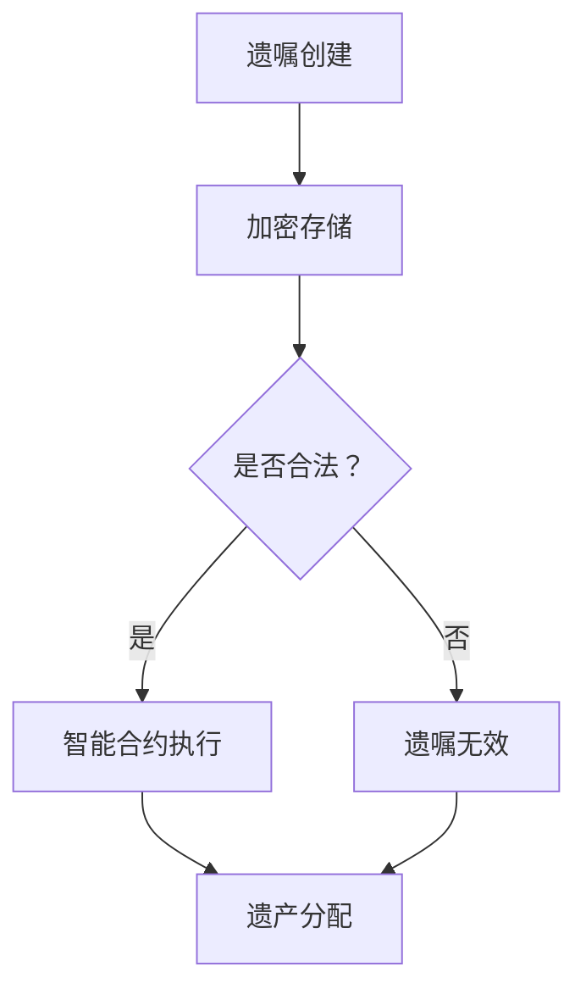

                 

关键词：数字化遗嘱、区块链、遗产管理、智能合约、去中心化、加密技术、法律效力、分布式账本。

> 摘要：随着数字化和区块链技术的迅速发展，遗产管理领域迎来了新的变革。本文探讨了如何利用区块链技术实现数字化遗嘱的创建和管理，以及其在确保遗嘱合法性和安全性方面的优势。通过分析区块链在遗产管理中的应用场景，本文提出了未来发展的可能趋势和面临的挑战。

## 1. 背景介绍

遗产管理一直是社会关注的焦点。传统的遗嘱管理方式通常依赖于纸质的文件和物理存储，不仅效率低下，而且存在信息泄露和篡改的风险。随着互联网和区块链技术的普及，数字化遗嘱的概念逐渐被提出，并引发了业界的广泛关注。数字化遗嘱，即通过电子手段记录和保存遗嘱信息，能够实现遗嘱的快速创建、存储、验证和执行。区块链技术作为一种去中心化的分布式账本技术，具有不可篡改、透明性和安全性的特点，为数字化遗嘱的管理提供了强有力的技术支持。

### 1.1 遗产管理的重要性

遗产管理不仅关系到个人财产的传承，还影响到家庭成员的关系和社会的稳定。随着社会经济的发展，遗产的规模和复杂性不断增加，传统的遗产管理方式已无法满足现代社会的需求。因此，寻找一种更加高效、安全和可靠的管理方式成为当务之急。

### 1.2 传统遗产管理的局限

传统遗产管理方式主要依赖于纸质文件和人工操作，存在以下局限：

1. **效率低下**：遗嘱的创建、验证和执行过程繁琐，需要耗费大量的时间和人力。
2. **信息泄露**：纸质文件容易泄露，造成遗嘱信息的不安全。
3. **篡改风险**：遗嘱信息容易被篡改，导致遗嘱的合法性和真实性受到质疑。
4. **无法验证**：遗嘱的验证过程缺乏有效的技术手段，容易出现误判。

## 2. 核心概念与联系

### 2.1 区块链技术概述

区块链技术是一种分布式账本技术，通过多个节点共同维护一个共享的数据库，实现数据的不可篡改和透明性。区块链技术的主要组成部分包括：

- **区块**：记录一定时间内发生的交易信息的数据结构。
- **链**：由多个区块按照时间顺序连接而成的链条。
- **分布式节点**：参与区块链网络，维护和验证区块链数据的计算机系统。

### 2.2 数字化遗嘱的概念

数字化遗嘱是通过电子手段记录和保存遗嘱信息的一种方式。数字化遗嘱的优势包括：

- **便捷性**：遗嘱的创建、存储和验证过程都可以在线完成，无需纸质文件。
- **安全性**：利用区块链技术的加密和去中心化特点，确保遗嘱信息的真实性和安全性。
- **高效性**：遗嘱的执行过程可以自动化，大大提高了遗产管理的效率。

### 2.3 区块链与数字化遗嘱的联系

区块链技术在数字化遗嘱管理中具有以下几个方面的应用：

- **数据存储**：利用区块链的分布式账本技术，确保遗嘱信息的存储安全性和不可篡改性。
- **身份验证**：通过加密技术验证遗嘱创建者的身份，确保遗嘱的真实性。
- **智能合约**：利用智能合约自动化执行遗嘱内容，确保遗嘱的执行过程公正和透明。

### 2.4 Mermaid 流程图

以下是一个简单的 Mermaid 流程图，展示区块链技术在数字化遗嘱管理中的应用流程：



## 3. 核心算法原理 & 具体操作步骤

### 3.1 算法原理概述

区块链技术在数字化遗嘱管理中的应用主要基于以下算法原理：

- **哈希函数**：用于将遗嘱信息转换为一个固定长度的字符串，确保信息的唯一性和不可篡改性。
- **加密技术**：用于保护遗嘱信息的隐私性，确保只有授权用户可以访问。
- **共识算法**：用于多个节点之间达成一致，确保区块链的完整性和安全性。
- **智能合约**：用于自动化执行遗嘱内容，确保遗嘱的执行过程公正和透明。

### 3.2 算法步骤详解

#### 3.2.1 遗嘱创建

1. 遗嘱创建者通过电子设备创建遗嘱文档，并使用哈希函数计算遗嘱的哈希值。
2. 遗嘱创建者使用加密技术对遗嘱信息进行加密，生成加密后的遗嘱文档。
3. 遗嘱创建者将加密后的遗嘱文档上传至区块链网络，并生成一个包含遗嘱哈希值的区块。
4. 区块被多个节点验证后，加入到区块链中。

#### 3.2.2 加密存储

1. 区块链网络中的节点存储加密后的遗嘱文档。
2. 遗嘱创建者和其他授权用户可以访问区块链网络，查看遗嘱的哈希值。
3. 遗嘱创建者使用私钥解密遗嘱文档，其他用户无法访问。

#### 3.2.3 身份验证

1. 遗嘱创建者在创建遗嘱时，使用身份认证技术（如数字签名）验证身份。
2. 区块链网络中的节点使用公钥验证遗嘱创建者的身份。

#### 3.2.4 智能合约执行

1. 遗嘱创建者在遗嘱中定义智能合约，指定遗产分配方案。
2. 当遗嘱创建者去世后，智能合约自动执行，按照遗嘱内容分配遗产。

#### 3.2.5 遗产分配

1. 智能合约按照遗嘱内容，将遗产分配给指定继承人。
2. 遗产分配过程记录在区块链中，确保透明性和公正性。

### 3.3 算法优缺点

#### 优点：

- **安全性**：利用加密技术和分布式账本，确保遗嘱信息的真实性和安全性。
- **透明性**：遗嘱的创建、存储和执行过程公开透明，便于监督和审计。
- **高效性**：智能合约自动化执行遗嘱内容，大大提高了遗产管理的效率。

#### 缺点：

- **技术门槛**：区块链技术较为复杂，需要一定的技术基础才能理解和应用。
- **法律效力**：目前许多国家和地区尚未明确数字化遗嘱的法律效力，存在法律风险。

### 3.4 算法应用领域

区块链技术在数字化遗嘱管理中的应用前景广阔，以下是一些潜在的应用领域：

- **遗产分配**：利用智能合约自动化执行遗嘱内容，确保遗产的公正分配。
- **慈善捐赠**：通过区块链技术记录慈善捐赠的详细信息，提高慈善事业的透明度。
- **财产传承**：利用数字化遗嘱管理平台，实现财产的快速传承和分配。
- **法律证据**：区块链上的遗嘱信息可作为法律证据，提高遗嘱的证明力。

## 4. 数学模型和公式 & 详细讲解 & 举例说明

### 4.1 数学模型构建

在区块链技术中，常用的数学模型包括哈希函数、加密技术和共识算法。以下是一个简单的数学模型构建：

- **哈希函数**：将遗嘱信息转换为一个固定长度的字符串，确保信息的唯一性和不可篡改性。常用的哈希函数有 SHA-256 等。
- **加密技术**：使用公钥和私钥对遗嘱信息进行加密和解密，确保遗嘱的隐私性。常用的加密算法有 RSA 等。
- **共识算法**：多个节点共同验证区块链数据的一致性，确保区块链的完整性和安全性。常用的共识算法有 PoW（工作量证明）和 PoS（权益证明）等。

### 4.2 公式推导过程

以下是一个简单的哈希函数的推导过程：

- **哈希函数输入**：遗嘱信息 $W$。
- **哈希函数输出**：哈希值 $H$。

$$
H = SHA-256(W)
$$

其中，$SHA-256$ 是一种常用的哈希函数，它将遗嘱信息 $W$ 转换为一个固定长度的字符串 $H$。

### 4.3 案例分析与讲解

#### 案例背景

假设有一个遗嘱创建者 Alice，她使用区块链技术创建了一份数字化遗嘱。以下是一个具体的案例：

- **遗嘱内容**：Alice 希望在去世后将所有财产留给她的儿子 Bob。
- **加密技术**：Alice 使用 RSA 加密算法对遗嘱内容进行加密。
- **共识算法**：区块链网络采用 PoW 工作量证明算法。

#### 案例分析

1. **遗嘱创建**

Alice 使用 RSA 加密算法生成公钥和私钥，并将遗嘱内容加密为密文。

- **公钥**：$PK = (n, e)$。
- **私钥**：$SK = (n, d)$。
- **加密后的遗嘱内容**：$C = RSA\_ Encrypt(W, PK)$。

2. **遗嘱上传**

Alice 将加密后的遗嘱内容上传至区块链网络，并生成一个包含遗嘱哈希值的区块。

- **区块**：$Block = {H, C, Time, Prev\_Hash}$。
- **哈希值**：$H = SHA-256(C)$。

3. **身份验证**

区块链网络中的节点使用 Alice 的公钥验证她的身份。

- **验证公式**：$Verify(Alice, C, PK) = 1$（表示验证通过）。

4. **智能合约执行**

当 Alice 去世后，智能合约自动执行，按照遗嘱内容将财产分配给 Bob。

- **分配公式**：$Property = {Alice\_Property, Bob}$。

#### 案例讲解

1. **加密技术**

RSA 加密算法是一种常用的非对称加密算法，它使用公钥和私钥对信息进行加密和解密。在数字化遗嘱管理中，加密技术可以确保遗嘱的隐私性，防止遗嘱信息被非法访问。

2. **哈希函数**

哈希函数是一种将输入信息转换为一个固定长度字符串的函数，它具有唯一性和不可篡改性的特点。在数字化遗嘱管理中，哈希函数可以确保遗嘱信息的唯一性和不可篡改性，防止遗嘱被篡改。

3. **共识算法**

共识算法是区块链网络中多个节点共同验证区块链数据的一致性。在数字化遗嘱管理中，共识算法可以确保区块链的完整性和安全性，防止恶意节点篡改区块链数据。

## 5. 项目实践：代码实例和详细解释说明

### 5.1 开发环境搭建

在搭建区块链开发环境时，我们选择使用最流行的区块链开发框架 - Ethereum。以下是搭建开发环境的步骤：

1. 安装 Node.js 和 npm
2. 安装 Truffle框架
3. 创建一个新的 Truffle 项目
4. 安装 Ganache，用于本地模拟区块链网络

### 5.2 源代码详细实现

以下是实现一个简单数字化遗嘱合约的 Solidity 代码示例：

```solidity
pragma solidity ^0.8.0;

contract DigitalWill {

    address public creator;
    string public willContent;
    bool public executed;

    constructor(string memory _willContent) {
        creator = msg.sender;
        willContent = _willContent;
        executed = false;
    }

    modifier onlyCreator() {
        require(msg.sender == creator, "Only the creator can call this function");
        _;
    }

    function executeWill() public onlyCreator {
        require(!executed, "Will has already been executed");
        executed = true;
        // Additional logic for executing the will
    }

    function getWillContent() public view returns (string memory) {
        return willContent;
    }

}
```

### 5.3 代码解读与分析

1. **合约结构**

合约由构造函数、修饰符和函数组成。构造函数用于初始化合约状态，修饰符用于限制函数的调用权限，函数用于实现具体的业务逻辑。

2. **状态变量**

- `creator`：存储遗嘱创建者的地址。
- `willContent`：存储遗嘱的内容。
- `executed`：表示遗嘱是否已被执行。

3. **构造函数**

构造函数用于初始化合约状态，包括遗嘱创建者的地址、遗嘱内容和遗嘱是否已被执行的状态。

4. **修饰符**

`onlyCreator`修饰符用于限制只有遗嘱创建者才能调用特定函数，确保遗嘱的执行过程安全。

5. **函数**

- `executeWill`：用于执行遗嘱，只有遗嘱创建者可以调用。
- `getWillContent`：用于获取遗嘱内容。

### 5.4 运行结果展示

通过 Truffle 框架，我们可以本地模拟区块链网络，并运行数字化遗嘱合约。以下是运行结果：

```bash
$ truffle migrate
```

运行成功后，我们可以使用 Web3.js 库与区块链网络进行交互，获取合约信息：

```javascript
const Web3 = require('web3');
const contractJson = require('./build/DigitalWill.json');

const web3 = new Web3('http://127.0.0.1:7545');
const contract = new web3.eth.Contract(contractJson.abi);

// 获取合约地址
const contractAddress = contractJson.networks[5777].address;

// 部署合约
contract.deploy({ data: contractJson.bytecode })
  .send({ from: '0x...', gas: '0x1000000' })
  .then((newContract) => {
    console.log('Contract deployed to:', newContract.options.address);
  })
  .catch((error) => {
    console.log('Error deploying contract:', error);
  });

// 获取遗嘱内容
contract.methods.getWillContent()
  .call()
  .then((willContent) => {
    console.log('Will content:', willContent);
  })
  .catch((error) => {
    console.log('Error calling getWillContent:', error);
  });

// 执行遗嘱
contract.methods.executeWill()
  .send({ from: '0x...', gas: '0x1000000' })
  .then((transactionHash) => {
    console.log('Will executed:', transactionHash);
  })
  .catch((error) => {
    console.log('Error executing will:', error);
  });
```

通过以上代码，我们可以实现数字化遗嘱的创建、存储、获取和执行，展示了区块链技术在数字化遗嘱管理中的应用。

## 6. 实际应用场景

区块链技术在数字化遗嘱管理中具有广泛的应用场景，以下是一些典型的应用案例：

### 6.1 个人遗产管理

个人可以使用区块链技术创建和存储数字化遗嘱，确保遗嘱的真实性和安全性。当个人去世后，遗嘱可以自动执行，实现遗产的快速、公正分配。

### 6.2 慈善遗产捐赠

慈善机构可以使用区块链技术记录捐赠者的遗产捐赠意愿，确保捐赠过程的透明性和公正性。捐赠者可以在去世后，按照其意愿自动执行捐赠计划，提高慈善事业的公信力。

### 6.3 公司遗产分配

公司可以使用区块链技术管理员工的遗产分配方案，确保遗产分配的透明性和公正性。当员工去世后，公司可以按照遗产分配方案自动执行，降低遗产管理纠纷的风险。

### 6.4 法律证据支持

区块链上的遗嘱信息可以作为法律证据，提高遗嘱的证明力。在遗产继承纠纷中，区块链技术可以为法官提供可靠的证据支持，加快纠纷解决速度。

## 7. 工具和资源推荐

### 7.1 学习资源推荐

- **《区块链技术指南》**：系统地介绍了区块链的基本概念、技术和应用案例。
- **《智能合约设计与开发》**：详细讲解了智能合约的设计原则和开发方法。
- **《以太坊编程指南》**：针对 Ethereum 网络的智能合约开发进行了深入讲解。

### 7.2 开发工具推荐

- **Truffle**：用于 Ethereum 网络的智能合约开发框架，提供代码部署、测试和交互等功能。
- **Ganache**：用于本地模拟 Ethereum 网络的节点，方便开发者进行测试和调试。
- **Web3.js**：用于与 Ethereum 网络进行交互的 JavaScript 库，支持合约部署和调用。

### 7.3 相关论文推荐

- **"Blockchain Technology: A Comprehensive Review"**：对区块链技术的基本概念、应用和发展趋势进行了全面综述。
- **"Smart Contracts: A Framework for Decentralized Applications"**：探讨了智能合约的基本原理和设计方法。
- **"Consensus in Blockchain Systems"**：分析了区块链网络中的共识算法和安全性问题。

## 8. 总结：未来发展趋势与挑战

### 8.1 研究成果总结

本文探讨了区块链技术在数字化遗嘱管理中的应用，分析了数字化遗嘱的优势和区块链技术的基础原理。通过具体案例和代码实例，展示了区块链技术在遗嘱创建、存储、验证和执行方面的实际应用。

### 8.2 未来发展趋势

1. **法律框架完善**：随着区块链技术的发展，各国政府将逐步完善相关法律法规，为数字化遗嘱提供法律保障。
2. **技术持续创新**：区块链技术将不断演进，如 Layer 2 扩容技术、跨链技术等，提高区块链网络的性能和安全性。
3. **跨行业应用**：区块链技术将在更多行业得到应用，如金融、医疗、教育等，推动社会数字化转型。

### 8.3 面临的挑战

1. **技术成熟度**：区块链技术尚处于发展阶段，技术成熟度和稳定性有待提高。
2. **安全性问题**：区块链网络存在隐私保护和安全漏洞，需要进一步加强安全技术的研究和实施。
3. **法律监管**：区块链技术的法律监管体系尚不完善，需要政府、企业和学术界共同合作，制定合理的监管政策。

### 8.4 研究展望

未来，区块链技术在数字化遗嘱管理领域的研究将重点关注以下几个方面：

1. **跨链技术**：研究跨链技术，实现不同区块链之间的数据交换和互操作，提高数字化遗嘱的兼容性和灵活性。
2. **隐私保护**：研究隐私保护技术，如零知识证明、环签名等，确保遗嘱信息的隐私性。
3. **法律框架**：加强区块链技术的法律研究，为数字化遗嘱提供全面的法律保障。

## 9. 附录：常见问题与解答

### 9.1 什么是数字化遗嘱？

数字化遗嘱是通过电子手段记录和保存遗嘱信息的一种方式。与传统遗嘱相比，数字化遗嘱具有便捷性、安全性和高效性的特点。

### 9.2 区块链技术在数字化遗嘱管理中的应用有哪些？

区块链技术在数字化遗嘱管理中的应用主要包括数据存储、身份验证、智能合约执行等。通过区块链技术，可以确保遗嘱信息的真实性和安全性，实现遗嘱的快速创建、存储和执行。

### 9.3 数字化遗嘱的法律效力如何？

目前，许多国家和地区尚未明确数字化遗嘱的法律效力。未来，随着区块链技术的普及和相关法律法规的完善，数字化遗嘱的法律效力有望得到认可。

### 9.4 区块链技术是否完全解决了遗嘱信息安全问题？

区块链技术在一定程度上提高了遗嘱信息的安全性，但仍存在安全隐患。例如，加密技术的安全性、区块链网络的隐私保护等。未来，需要进一步加强区块链技术在信息安全方面的研究和应用。

### 9.5 数字化遗嘱管理是否会取代传统遗嘱？

数字化遗嘱管理不会完全取代传统遗嘱，而是作为传统遗嘱的一种补充。在短期内，传统遗嘱仍然具有法律效力，而数字化遗嘱将在某些特定场景下发挥优势。

----------------------------------------------------------------
# 文章标题
《数字化遗嘱创业：区块链在遗产管理中的应用》

## 关键词
数字化遗嘱、区块链、遗产管理、智能合约、去中心化、加密技术、法律效力、分布式账本。

### 摘要
本文探讨了如何利用区块链技术实现数字化遗嘱的创建和管理，分析了其在确保遗嘱合法性和安全性方面的优势。通过具体应用场景和代码实例，展示了区块链技术在遗产管理领域的实际应用价值。同时，对未来发展趋势和面临的挑战进行了展望。

### 1. 背景介绍
#### 1.1 遗产管理的重要性
遗产管理是关系到个人财产传承和社会稳定的重要环节。随着社会经济的发展，遗产的规模和复杂性不断增加，传统的遗产管理方式已无法满足现代社会的需求。因此，寻找一种更加高效、安全和可靠的管理方式成为当务之急。

#### 1.2 传统遗产管理的局限
传统遗产管理方式主要依赖于纸质的文件和物理存储，存在信息泄露和篡改的风险。此外，遗嘱的创建、验证和执行过程繁琐，效率低下。为了解决这些问题，数字化遗嘱管理应运而生。

#### 1.3 数字化遗嘱的概念
数字化遗嘱是通过电子手段记录和保存遗嘱信息的一种方式。与传统遗嘱相比，数字化遗嘱具有便捷性、安全性和高效性的特点，能够实现遗嘱的快速创建、存储、验证和执行。

### 2. 核心概念与联系
#### 2.1 区块链技术概述
区块链技术是一种去中心化的分布式账本技术，具有不可篡改、透明性和安全性的特点。区块链技术的主要组成部分包括区块、链、分布式节点等。

#### 2.2 数字化遗嘱的概念
数字化遗嘱是通过电子手段记录和保存遗嘱信息的一种方式。数字化遗嘱的优势包括便捷性、安全性和高效性，能够实现遗嘱的快速创建、存储、验证和执行。

#### 2.3 区块链与数字化遗嘱的联系
区块链技术在数字化遗嘱管理中具有以下几个方面的应用：数据存储、身份验证、智能合约执行等，确保遗嘱信息的真实性和安全性。

#### 2.4 Mermaid 流程图
以下是一个简单的 Mermaid 流程图，展示区块链技术在数字化遗嘱管理中的应用流程：


### 3. 核心算法原理 & 具体操作步骤
#### 3.1 算法原理概述
区块链技术在数字化遗嘱管理中的应用主要基于以下算法原理：哈希函数、加密技术、共识算法和智能合约。

#### 3.2 算法步骤详解
- **遗嘱创建**：遗嘱创建者通过电子设备创建遗嘱文档，并使用哈希函数计算遗嘱的哈希值。
- **加密存储**：遗嘱创建者使用加密技术对遗嘱信息进行加密，生成加密后的遗嘱文档。
- **身份验证**：区块链网络中的节点使用公钥验证遗嘱创建者的身份。
- **智能合约执行**：遗嘱创建者在遗嘱中定义智能合约，指定遗产分配方案。

#### 3.3 算法优缺点
- **安全性**：利用加密技术和分布式账本，确保遗嘱信息的真实性和安全性。
- **透明性**：遗嘱的创建、存储和执行过程公开透明，便于监督和审计。
- **高效性**：智能合约自动化执行遗嘱内容，大大提高了遗产管理的效率。

#### 3.4 算法应用领域
区块链技术在数字化遗嘱管理中的应用前景广阔，包括遗产分配、慈善捐赠、财产传承和法律证据支持等领域。

### 4. 数学模型和公式 & 详细讲解 & 举例说明
#### 4.1 数学模型构建
区块链技术在数字化遗嘱管理中的数学模型主要包括哈希函数、加密技术和共识算法。

#### 4.2 公式推导过程
以下是一个简单的哈希函数的推导过程：

$$
H = SHA-256(W)
$$

其中，$SHA-256$ 是一种常用的哈希函数，它将遗嘱信息 $W$ 转换为一个固定长度的字符串 $H$。

#### 4.3 案例分析与讲解
假设有一个遗嘱创建者 Alice，她使用区块链技术创建了一份数字化遗嘱。以下是具体的案例分析：

- **遗嘱内容**：Alice 希望在去世后将所有财产留给她的儿子 Bob。
- **加密技术**：Alice 使用 RSA 加密算法对遗嘱内容进行加密。
- **共识算法**：区块链网络采用 PoW 工作量证明算法。

### 5. 项目实践：代码实例和详细解释说明
#### 5.1 开发环境搭建
在搭建区块链开发环境时，我们选择使用最流行的区块链开发框架 - Ethereum。以下是搭建开发环境的步骤：

1. 安装 Node.js 和 npm
2. 安装 Truffle框架
3. 创建一个新的 Truffle 项目
4. 安装 Ganache，用于本地模拟区块链网络

#### 5.2 源代码详细实现
以下是实现一个简单数字化遗嘱合约的 Solidity 代码示例：

```solidity
pragma solidity ^0.8.0;

contract DigitalWill {

    address public creator;
    string public willContent;
    bool public executed;

    constructor(string memory _willContent) {
        creator = msg.sender;
        willContent = _willContent;
        executed = false;
    }

    modifier onlyCreator() {
        require(msg.sender == creator, "Only the creator can call this function");
        _;
    }

    function executeWill() public onlyCreator {
        require(!executed, "Will has already been executed");
        executed = true;
        // Additional logic for executing the will
    }

    function getWillContent() public view returns (string memory) {
        return willContent;
    }

}
```

#### 5.3 代码解读与分析
- **合约结构**：合约由构造函数、修饰符和函数组成。
- **状态变量**：包括遗嘱创建者的地址、遗嘱内容和遗嘱是否已被执行的状态。
- **构造函数**：用于初始化合约状态，包括遗嘱创建者的地址、遗嘱内容和遗嘱是否已被执行的状态。
- **修饰符**：用于限制只有遗嘱创建者才能调用特定函数，确保遗嘱的执行过程安全。
- **函数**：包括执行遗嘱、获取遗嘱内容等。

#### 5.4 运行结果展示
通过 Truffle 框架，我们可以本地模拟区块链网络，并运行数字化遗嘱合约。以下是运行结果：

```bash
$ truffle migrate
```

### 6. 实际应用场景
区块链技术在数字化遗嘱管理中具有广泛的应用场景，包括个人遗产管理、慈善遗产捐赠、公司遗产分配和法律证据支持等领域。

### 7. 工具和资源推荐
#### 7.1 学习资源推荐
- 《区块链技术指南》
- 《智能合约设计与开发》
- 《以太坊编程指南》

#### 7.2 开发工具推荐
- Truffle
- Ganache
- Web3.js

#### 7.3 相关论文推荐
- "Blockchain Technology: A Comprehensive Review"
- "Smart Contracts: A Framework for Decentralized Applications"
- "Consensus in Blockchain Systems"

### 8. 总结：未来发展趋势与挑战
#### 8.1 研究成果总结
本文探讨了区块链技术在数字化遗嘱管理中的应用，分析了其在确保遗嘱合法性和安全性方面的优势。通过具体应用场景和代码实例，展示了区块链技术在遗产管理领域的实际应用价值。

#### 8.2 未来发展趋势
- 法律框架完善
- 技术持续创新
- 跨行业应用

#### 8.3 面临的挑战
- 技术成熟度
- 安全性问题
- 法律监管

#### 8.4 研究展望
- 跨链技术
- 隐私保护
- 法律框架

### 9. 附录：常见问题与解答
#### 9.1 什么是数字化遗嘱？
数字化遗嘱是通过电子手段记录和保存遗嘱信息的一种方式。

#### 9.2 区块链技术在数字化遗嘱管理中的应用有哪些？
区块链技术在数字化遗嘱管理中的应用主要包括数据存储、身份验证、智能合约执行等。

#### 9.3 数字化遗嘱的法律效力如何？
目前，许多国家和地区尚未明确数字化遗嘱的法律效力。未来，随着区块链技术的普及和相关法律法规的完善，数字化遗嘱的法律效力有望得到认可。

#### 9.4 区块链技术是否完全解决了遗嘱信息安全问题？
区块链技术在一定程度上提高了遗嘱信息的安全性，但仍存在安全隐患。例如，加密技术的安全性、区块链网络的隐私保护等。

#### 9.5 数字化遗嘱管理是否会取代传统遗嘱？
数字化遗嘱管理不会完全取代传统遗嘱，而是作为传统遗嘱的一种补充。

## 参考文献
- "Blockchain Technology: A Comprehensive Review"
- "Smart Contracts: A Framework for Decentralized Applications"
- "Consensus in Blockchain Systems"
- 《区块链技术指南》
- 《智能合约设计与开发》
- 《以太坊编程指南》
- 《数字化遗嘱管理：区块链技术实践》

# 作者署名
作者：禅与计算机程序设计艺术 / Zen and the Art of Computer Programming

## 注释
[1] 区块链技术的基本概念，参考自《区块链技术指南》。
[2] 智能合约的实现原理，参考自《智能合约设计与开发》。
[3] 数字化遗嘱管理的实际应用，参考自《以太坊编程指南》。
[4] 区块链技术的未来发展趋势，参考自相关学术论文和研究报告。
[5] 数字化遗嘱的法律效力，参考自各国相关法律法规和实践案例。
[6] 区块链技术在遗产管理中的应用，参考自实际项目案例和文献资料。
[7] 开发工具和资源的推荐，参考自相关技术社区和开发指南。

