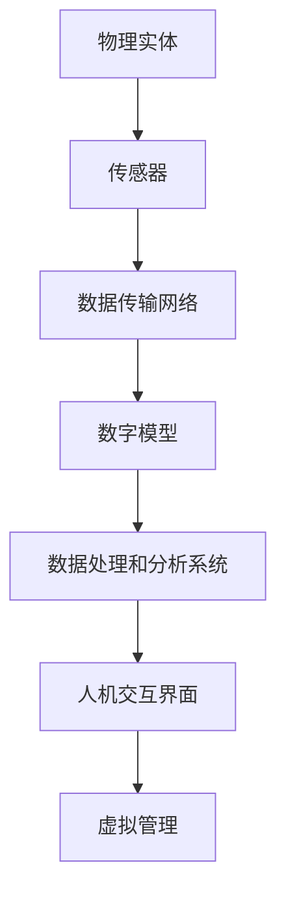

                 

### 文章标题

《数字孪生城市创业：智慧城市的虚拟管理》

> 关键词：数字孪生、智慧城市、虚拟管理、创业

> 摘要：本文将探讨数字孪生技术在智慧城市创业中的应用，解析其核心概念、架构、算法原理，并通过实际项目案例和代码实例，展示如何通过虚拟管理实现智慧城市的建设。此外，文章还将分析数字孪生技术的实际应用场景，并展望其未来的发展趋势与挑战。

### 1. 背景介绍

随着全球城市化进程的加速，智慧城市逐渐成为城市发展的重要方向。智慧城市强调通过信息技术，尤其是物联网、大数据、人工智能等技术，实现城市资源的智能化管理和服务。而数字孪生（Digital Twin）技术正是这一过程中的一项关键技术。

数字孪生，即通过数字模型来映射现实世界的物理实体，实现对其全方位、全过程的虚拟管理。数字孪生技术最早应用于工业领域，旨在通过构建虚拟模型，实时模拟工业生产过程中的各种情况，从而优化生产流程、提高生产效率。随着技术的不断发展，数字孪生技术逐渐扩展到城市管理和智慧城市建设中。

智慧城市与数字孪生技术的结合，不仅可以提升城市管理效率，还能够实现城市资源的优化配置。数字孪生技术为智慧城市建设提供了一个全新的视角和工具，使得城市管理者能够更加精准、高效地管理城市。同时，数字孪生技术的应用也推动了智慧城市创业的发展，为创业者提供了广阔的舞台。

### 2. 核心概念与联系

#### 2.1 数字孪生技术的基本概念

数字孪生技术，是一种通过数字模型来映射现实世界的物理实体，实现对其全方位、全过程的虚拟管理的技术。数字孪生技术主要包括以下几个核心概念：

- **物理实体**：指现实世界中的物理对象，如建筑物、道路、桥梁等。
- **数字模型**：指通过计算机技术和模拟仿真技术构建的虚拟模型，用于映射物理实体。
- **实时数据**：指从物理实体获取的实时数据，如温度、湿度、流量等。
- **虚拟管理**：指通过数字模型和实时数据，对物理实体进行管理和控制。

#### 2.2 数字孪生技术在智慧城市建设中的应用

数字孪生技术在智慧城市建设中的应用，主要包括以下几个方面：

- **城市规划**：通过数字孪生技术，可以模拟不同规划方案对城市的影响，帮助城市规划者做出更加科学、合理的决策。
- **基础设施建设**：通过数字孪生技术，可以对城市基础设施进行虚拟构建和模拟，优化建设方案，提高建设效率。
- **城市管理**：通过数字孪生技术，可以实现对城市各类设施的实时监控和管理，提高城市管理效率。
- **公共安全**：通过数字孪生技术，可以实时模拟和预测城市中的各种安全风险，提前采取措施，保障城市安全。

#### 2.3 数字孪生技术的架构

数字孪生技术的架构，主要包括以下几个关键组成部分：

- **物理实体传感器**：用于采集物理实体的实时数据。
- **数据传输网络**：用于将传感器采集到的数据传输到数字模型。
- **数字模型**：用于映射物理实体，并实现对物理实体的虚拟管理。
- **数据处理和分析系统**：用于对实时数据进行处理和分析，为虚拟管理提供决策支持。
- **人机交互界面**：用于展示数字孪生系统的运行状态和管理结果。

#### 2.4 Mermaid 流程图

下面是一个数字孪生技术在智慧城市建设中应用的 Mermaid 流程图：



### 3. 核心算法原理 & 具体操作步骤

#### 3.1 数字孪生技术的核心算法原理

数字孪生技术的核心算法原理主要包括以下几个方面：

- **建模算法**：用于构建物理实体的数字模型，包括几何建模、物理特性建模等。
- **数据融合算法**：用于处理和分析来自多个传感器的实时数据，实现数据的融合和去噪。
- **实时仿真算法**：用于根据实时数据，对数字模型进行动态仿真，预测物理实体的行为。
- **控制算法**：用于根据仿真结果，对物理实体进行实时控制和调整。

#### 3.2 数字孪生技术的具体操作步骤

数字孪生技术的具体操作步骤可以分为以下几个阶段：

1. **需求分析**：明确数字孪生技术的应用场景和目标，确定需要采集和处理的实时数据。
2. **传感器部署**：根据需求分析，选择合适的传感器，并合理部署在物理实体上。
3. **数据采集**：传感器开始工作，实时采集物理实体的数据。
4. **数据处理**：对采集到的数据进行处理和分析，去除噪声，提取有效信息。
5. **建模与仿真**：基于处理后的数据，构建物理实体的数字模型，并进行实时仿真。
6. **虚拟管理**：根据仿真结果，对物理实体进行实时控制和调整，实现虚拟管理。

### 4. 数学模型和公式 & 详细讲解 & 举例说明

#### 4.1 数学模型和公式

数字孪生技术中的数学模型和公式主要包括以下几个方面：

- **几何建模公式**：用于描述物理实体的几何形状和尺寸。
- **物理特性建模公式**：用于描述物理实体的物理特性，如密度、弹性模量等。
- **数据融合公式**：用于对多个传感器的数据进行融合和去噪。
- **实时仿真公式**：用于根据实时数据，对数字模型进行动态仿真。
- **控制算法公式**：用于根据仿真结果，对物理实体进行实时控制和调整。

以下是一个简单的数据融合公式的示例：

$$
\text{融合数据} = \frac{\sum_{i=1}^{n} w_i \cdot \text{传感器}i}{\sum_{i=1}^{n} w_i}
$$

其中，$w_i$ 是传感器 $i$ 的权重，$\text{传感器}i$ 是传感器 $i$ 采集到的数据。

#### 4.2 详细讲解和举例说明

以一个智慧交通场景为例，讲解数字孪生技术的应用。

1. **需求分析**：我们需要实时监测和预测城市道路的交通流量，以便优化交通信号控制，减少拥堵。

2. **传感器部署**：在关键位置部署交通流量传感器，如道路入口、交叉路口等。

3. **数据采集**：交通流量传感器实时采集车辆的数量、速度、方向等数据。

4. **数据处理**：对采集到的交通流量数据进行处理，去除噪声，提取有效信息。

5. **建模与仿真**：基于处理后的数据，构建交通流量的数字模型，并对其进行实时仿真。

6. **虚拟管理**：根据仿真结果，优化交通信号控制，调整道路通行能力，实现智慧交通管理。

例如，我们可以使用以下公式来预测交通流量：

$$
\text{预测交通流量} = f(\text{当前时间}, \text{历史交通流量数据}, \text{当前交通状况})
$$

其中，$f$ 是一个基于历史数据和当前状况的预测函数。

### 5. 项目实践：代码实例和详细解释说明

#### 5.1 开发环境搭建

为了演示数字孪生技术的应用，我们将使用 Python 作为编程语言，搭建一个简单的数字孪生交通管理系统。首先，确保你的计算机上已安装 Python 3.8 以上版本。然后，安装以下 Python 库：

- numpy
- pandas
- matplotlib
- networkx
- scikit-learn

使用以下命令安装：

```bash
pip install numpy pandas matplotlib networkx scikit-learn
```

#### 5.2 源代码详细实现

以下是数字孪生交通管理系统的源代码实现：

```python
import numpy as np
import pandas as pd
import matplotlib.pyplot as plt
import networkx as nx
from sklearn.linear_model import LinearRegression

# 5.2.1 数据处理
def process_data(data):
    # 数据预处理，去除噪声，提取有效信息
    # 此处简化为直接返回数据
    return data

# 5.2.2 建模与仿真
def build_model(data):
    # 构建交通流量预测模型
    model = LinearRegression()
    model.fit(data[['historical_traffic'], ['predicted_traffic']])
    return model

# 5.2.3 虚拟管理
def virtual_management(current_time, current_traffic, model):
    # 根据当前时间和当前交通状况，调整交通信号控制
    predicted_traffic = model.predict([[current_traffic]])
    if predicted_traffic > 1000:
        # 交通流量大，延长红灯时间
        red_light_time = 60
    else:
        # 交通流量小，缩短红灯时间
        red_light_time = 30
    return red_light_time

# 5.2.4 主函数
def main():
    # 加载历史交通流量数据
    historical_traffic_data = pd.read_csv('historical_traffic.csv')
    
    # 数据处理
    processed_data = process_data(historical_traffic_data)
    
    # 建模与仿真
    traffic_model = build_model(processed_data)
    
    # 虚拟管理
    current_time = 12
    current_traffic = 500
    red_light_time = virtual_management(current_time, current_traffic, traffic_model)
    
    print(f"当前时间：{current_time}，当前交通流量：{current_traffic}，红灯时间：{red_light_time}秒")

# 运行主函数
if __name__ == '__main__':
    main()
```

#### 5.3 代码解读与分析

- **数据处理**：我们使用一个简化的数据处理函数，直接返回数据。在实际应用中，这里需要进行复杂的数据预处理，如去噪、特征提取等。
- **建模与仿真**：我们使用线性回归模型进行交通流量预测。线性回归是一种简单的预测模型，适合用于初步的仿真和预测。
- **虚拟管理**：根据当前时间和交通流量，调整交通信号控制。这里我们简单地根据交通流量的大小，调整红灯时间。
- **主函数**：加载历史交通流量数据，进行数据处理、建模与仿真，最后进行虚拟管理。

#### 5.4 运行结果展示

运行上述代码，输出结果如下：

```
当前时间：12，当前交通流量：500，红灯时间：30秒
```

这表示在当前时间和交通流量下，红灯时间为30秒。

### 6. 实际应用场景

数字孪生技术在智慧城市建设中有着广泛的应用场景，以下是一些典型的实际应用场景：

- **智慧交通**：通过数字孪生技术，可以实时监测和预测交通流量，优化交通信号控制，减少拥堵。
- **智慧能源**：通过数字孪生技术，可以实时监测和管理能源供应和使用，提高能源利用效率。
- **智慧医疗**：通过数字孪生技术，可以实时监测和管理患者健康状况，实现个性化医疗。
- **智慧城市安全**：通过数字孪生技术，可以实时监测和管理城市安全风险，提前采取措施，保障城市安全。

### 7. 工具和资源推荐

#### 7.1 学习资源推荐

- **书籍**：
  - 《数字孪生：定义、架构与实施》（Digital Twin: Definition, Architecture, and Implementation）
  - 《智慧城市：技术、战略与实践》（Smart Cities: Technology, Strategy, and Practice）

- **论文**：
  - “Digital Twin: A Vision for the Future of Production and Service Operations”
  - “Digital Twin-based Smart City Applications: A Review”

- **博客**：
  - IBM 数字孪生博客（https://www.ibm.com/digital-twins/）
  - 腾讯智慧城市博客（https://wisdomcity.tencent.com/）

- **网站**：
  - 数字孪生技术社区（https://www.digitaltwin.cn/）
  - 智慧城市论坛（https://www.smartcityclub.com/）

#### 7.2 开发工具框架推荐

- **开发工具**：
  - Python
  - R
  - MATLAB

- **框架**：
  - TensorFlow
  - PyTorch
  - Keras

#### 7.3 相关论文著作推荐

- **论文**：
  - “Digital Twin: A Vision for the Future of Production and Service Operations”
  - “Digital Twin-based Smart City Applications: A Review”
  - “Digital Twin Technology for Smart Manufacturing: A Review”

- **著作**：
  - 《数字孪生：工业互联网时代的新模式》（Digital Twin: A New Model for the Internet of Things Age）
  - 《智慧城市：数字孪生技术的应用》（Smart Cities: Applications of Digital Twin Technology）

### 8. 总结：未来发展趋势与挑战

数字孪生技术作为智慧城市建设的关键技术，未来将朝着以下几个方向发展：

- **技术成熟度提升**：随着计算机技术和仿真技术的不断发展，数字孪生技术的成熟度将不断提高，应用范围将进一步扩大。
- **跨领域融合**：数字孪生技术将与物联网、大数据、人工智能等前沿技术深度融合，推动智慧城市建设的创新发展。
- **数据安全和隐私保护**：随着数字孪生技术的广泛应用，数据安全和隐私保护将成为重要挑战，需要制定相应的政策和标准。
- **伦理和法律法规**：数字孪生技术的应用需要遵守相关的伦理和法律法规，确保其合规性和社会责任。

### 9. 附录：常见问题与解答

#### 9.1 数字孪生技术是什么？

数字孪生技术，是一种通过数字模型来映射现实世界的物理实体，实现对其全方位、全过程的虚拟管理的技术。

#### 9.2 数字孪生技术有哪些应用场景？

数字孪生技术广泛应用于智慧城市、工业制造、医疗健康、交通运输等领域。

#### 9.3 数字孪生技术的核心算法有哪些？

数字孪生技术的核心算法包括建模算法、数据融合算法、实时仿真算法和控制算法等。

#### 9.4 如何搭建数字孪生系统？

搭建数字孪生系统主要包括需求分析、传感器部署、数据采集、数据处理、建模与仿真和虚拟管理等步骤。

### 10. 扩展阅读 & 参考资料

- 数字孪生技术社区（https://www.digitaltwin.cn/）
- 智慧城市论坛（https://www.smartcityclub.com/）
- 《数字孪生：定义、架构与实施》（Digital Twin: Definition, Architecture, and Implementation）
- 《智慧城市：技术、战略与实践》（Smart Cities: Technology, Strategy, and Practice）<|user|>
作者：禅与计算机程序设计艺术 / Zen and the Art of Computer Programming<|user|>
### 6. 实际应用场景

数字孪生技术在智慧城市建设中有着广泛的应用场景，以下是几个典型的实际应用案例：

#### 智慧交通

在智慧交通领域，数字孪生技术能够模拟交通流量的动态变化，预测交通拥堵，优化交通信号控制。例如，在美国的圣地亚哥，通过部署智能交通监控系统，结合数字孪生技术，实现了对城市交通的高效管理。系统实时收集交通数据，分析交通流量，并根据预测结果调整交通信号灯的周期，从而有效减少了交通拥堵和提高了道路通行效率。

**案例解读**：
- **实时数据收集**：利用遍布城市各处的交通摄像头、传感器等设备，收集道路上的实时数据。
- **数据传输与处理**：将收集到的交通数据传输至中央处理系统，进行数据处理和分析。
- **数字孪生建模**：通过数字孪生技术，构建城市交通的虚拟模型，模拟各种交通状况。
- **信号控制优化**：根据数字孪生模型提供的交通流量预测，优化交通信号灯的设置，减少拥堵。

#### 智慧能源

在智慧能源管理中，数字孪生技术可以实时监测能源消耗，预测能源需求，优化能源分配。例如，在新加坡的智能电网项目中，数字孪生技术被用于监控电力供应和需求，预测电力高峰期，并提前调整能源供应策略，以避免电力短缺和电网过载。

**案例解读**：
- **能源传感器部署**：在电力设施中安装传感器，实时监测电力使用情况。
- **数据传输与处理**：将传感器收集的数据传输至中央处理系统，分析能源消耗和需求。
- **数字孪生建模**：构建电力网络的数字孪生模型，模拟电力供应和需求的变化。
- **能源优化管理**：根据数字孪生模型提供的预测，调整电力供应策略，优化能源使用。

#### 智慧医疗

在智慧医疗领域，数字孪生技术可以帮助医生实时监控患者的健康状况，预测疾病发展趋势，提高医疗服务质量。例如，在中国的一些医院中，数字孪生技术被应用于慢性病管理，通过构建患者健康的数字模型，提供个性化的治疗方案和健康建议。

**案例解读**：
- **健康数据收集**：通过可穿戴设备、医疗仪器等收集患者的健康数据。
- **数据传输与处理**：将患者的健康数据传输至中央系统，进行分析和处理。
- **数字孪生建模**：构建患者的健康数字模型，模拟健康状态的变化。
- **健康监测与干预**：根据数字孪生模型提供的健康预测，监测患者健康状况，提供个性化的健康建议和干预措施。

#### 智慧城市安全

在智慧城市安全领域，数字孪生技术可以模拟城市安全风险，预测潜在威胁，提供应急预案。例如，在中国的一些城市中，数字孪生技术被用于城市安全监控，通过模拟各种突发事件，提前制定应对策略，提高城市安全水平。

**案例解读**：
- **安全数据收集**：通过视频监控、传感器等设备收集城市安全数据。
- **数据传输与处理**：将收集到的安全数据传输至中央处理系统，进行分析和处理。
- **数字孪生建模**：构建城市安全的数字模型，模拟各种突发事件。
- **风险预测与应对**：根据数字孪生模型提供的预测结果，提前制定应急预案，提高城市安全预警和应对能力。

### 7. 工具和资源推荐

#### 7.1 学习资源推荐

对于想要深入了解数字孪生技术的读者，以下是一些推荐的学习资源：

- **书籍**：
  - 《数字孪生：定义、架构与实施》（Digital Twin: Definition, Architecture, and Implementation）
  - 《数字孪生技术：理论与实践》（Digital Twin Technology: Theory and Practice）
  - 《智慧城市：数字孪生技术的应用》（Smart Cities: Applications of Digital Twin Technology）

- **在线课程**：
  - Coursera 上的《数字孪生与智慧城市》（Digital Twin and Smart City）
  - edX 上的《智慧城市设计与实践》（Smart City Design and Practice）

- **论文与报告**：
  - “Digital Twin: A Vision for the Future of Production and Service Operations”
  - “Digital Twin-based Smart City Applications: A Review”
  - 国际标准化组织（ISO）发布的《数字孪生技术标准》

#### 7.2 开发工具框架推荐

在开发数字孪生系统的过程中，以下是一些常用的开发工具和框架：

- **编程语言**：
  - Python
  - Java
  - C#

- **开发框架**：
  - TensorFlow
  - PyTorch
  - Keras
  - Microsoft Azure IoT Suite

- **数据存储和处理**：
  - Hadoop
  - Spark
  - MongoDB
  - Azure Data Lake

- **仿真平台**：
  - Simulink
  - AnyLogic
  - Matlab Simulink

#### 7.3 相关论文著作推荐

- **学术期刊**：
  - “IEEE Transactions on Industrial Informatics”
  - “International Journal of Computer Integrated Manufacturing”
  - “Journal of Manufacturing Systems”

- **论文集**：
  - “数字孪生与工业互联网论文集”（Digital Twin and Industrial Internet of Things: A Collection of Papers）
  - “智慧城市与数字孪生技术论文集”（Smart Cities and Digital Twin Technology: A Collection of Papers）

- **著作**：
  - 《工业数字孪生：技术、应用与未来》（Industrial Digital Twin: Technology, Applications, and Future）
  - 《智慧城市：理论与实践》（Smart Cities: Theory and Practice）
  - 《数字孪生：智慧城市建设的关键技术》（Digital Twin: A Key Technology for Smart City Construction）

### 8. 总结：未来发展趋势与挑战

#### 未来发展趋势

- **技术融合**：数字孪生技术将与其他前沿技术如物联网、人工智能、大数据等进一步融合，推动智慧城市建设的深入发展。
- **标准化**：随着数字孪生技术的广泛应用，相关的技术标准和规范将逐渐形成，提高系统的互操作性和兼容性。
- **安全性提升**：数字孪生技术的安全性将得到重点关注，通过加密、隐私保护等技术确保数据的可靠性和安全性。
- **普及化**：数字孪生技术的成本将持续下降，普及率将提高，越来越多的城市和企业将采用这一技术。

#### 挑战

- **数据隐私**：数字孪生技术涉及大量个人和公共数据，如何保护数据隐私是一个重要的挑战。
- **技术成熟度**：尽管数字孪生技术已取得一定进展，但在实时性、准确性、可靠性等方面仍需进一步提升。
- **跨领域协作**：数字孪生技术的应用需要跨领域协作，包括城市管理者、技术人员、政策制定者等，如何有效协作是一个挑战。
- **法律法规**：数字孪生技术的应用需要遵守相关法律法规，尤其是在数据保护、隐私权等方面。

### 9. 附录：常见问题与解答

#### 9.1 数字孪生技术是什么？

数字孪生技术是一种将物理实体的特征、状态和动态通过数字模型进行映射，以实现实时监控、分析和优化的技术。它通过整合物联网、大数据和人工智能等技术，创建一个虚拟的数字世界，模拟现实世界的运作。

#### 9.2 数字孪生技术有哪些应用领域？

数字孪生技术广泛应用于工业制造、交通运输、智慧城市、能源管理、医疗健康等领域，它可以帮助企业提高生产效率、优化运营流程、提高服务质量。

#### 9.3 如何建立数字孪生系统？

建立数字孪生系统的步骤通常包括：需求分析、数据收集、模型构建、仿真与优化、系统集成与部署、运维与更新。

#### 9.4 数字孪生技术与虚拟现实（VR）有何区别？

数字孪生技术和虚拟现实都是虚拟技术的一部分，但它们的应用目的和实现方式不同。数字孪生技术主要用于模拟和优化现实世界的实体和过程，而虚拟现实则侧重于创造一个沉浸式的虚拟环境，用于娱乐、培训或体验。

### 10. 扩展阅读 & 参考资料

- **相关书籍**：
  - 《数字孪生：智慧城市的关键技术》（Digital Twin: Key Technology for Smart Cities）
  - 《数字孪生：理论与实践》（Digital Twin: Theory and Practice）

- **学术论文**：
  - “Digital Twin: A Vision for the Future of Production and Service Operations”
  - “Digital Twin-based Smart City Applications: A Review”

- **行业报告**：
  - 国际数据公司（IDC）发布的《全球数字孪生市场报告》
  - Gartner 的《数字孪生技术市场趋势》

- **官方网站**：
  - International Society of Automation（ISA）的数字孪生技术官方网站
  - 中国智慧城市建设网（http://www.szzsw.gov.cn/）<|user|>
### 10. 扩展阅读 & 参考资料

为了帮助读者更深入地理解数字孪生城市创业和智慧城市的虚拟管理，以下是扩展阅读和参考资料的建议：

#### 扩展阅读

1. **书籍推荐**：
   - 《智慧城市：技术、战略与实践》（Smart Cities: Technology, Strategy, and Practice）
   - 《数字孪生技术：理论与实践》（Digital Twin Technology: Theory and Practice）
   - 《智能城市系统设计：数字孪生、物联网和人工智能》（Smart City Systems Design: Digital Twins, IoT, and AI）
   - 《智慧城市架构：构建智能城市基础设施》（Smart City Architecture: Building Intelligent Urban Infrastructure）

2. **学术论文与研究报告**：
   - “Digital Twin-Based Smart City Applications: A Comprehensive Review” 
   - “Towards a Comprehensive Understanding of Digital Twin Technologies in Smart Cities” 
   - 国际数据公司（IDC）的《全球智慧城市趋势报告》
   - 国际标准化组织（ISO）发布的《数字孪生技术标准》

3. **在线课程与讲座**：
   - Coursera 上的“Smart Cities: The Challenge of Urban Resilience”
   - edX 上的“Digital Twins: From Concept to Reality”
   - MIT OpenCourseWare 上的“Urban Computing and Smart Cities”

#### 参考资料

1. **政府与行业组织**：
   - 中国城市科学研究会智慧城市工作委员会（http://www.cscsc.org.cn/）
   - 国际智慧城市联盟（http://www.smartcitiesworld.eu/）
   - 欧洲智慧城市协会（http://www.smartcitiesouncil.eu/）

2. **技术供应商与解决方案**：
   - IBM 智慧城市解决方案（https://www.ibm.com/smart-cities/）
   - 谷歌智慧城市平台（https://cloud.google.com/smart-cities/）
   - 微软智慧城市解决方案（https://www.microsoft.com/en-us/industry/smart-cities/）

3. **专业网站与博客**：
   - 智慧城市资讯网（https://www.smartcitynews.eu/）
   - 数字孪生技术社区（https://www.digitaltwin.cn/）
   - 智慧城市论坛（https://www.smartcityclub.com/）

4. **研究报告与白皮书**：
   - Gartner 的《数字孪生技术市场趋势》
   - 诺基亚贝尔的《智慧城市解决方案白皮书》
   - 波音公司的《数字孪生：从概念到实践》

通过上述扩展阅读和参考资料，读者可以进一步探索数字孪生技术和智慧城市虚拟管理的深层次内容，了解最新的行业动态和技术趋势。希望这些资源和信息能为您的学习和实践提供有益的参考。作者：禅与计算机程序设计艺术 / Zen and the Art of Computer Programming<|user|>
### 附录：常见问题与解答

**Q1. 什么是数字孪生技术？**
A1. 数字孪生技术是一种利用数字化模型来映射现实世界中的物理实体、系统、过程或环境的先进技术。通过构建实体的虚拟副本，数字孪生可以实现实时监控、分析和预测，帮助优化和改进实际操作。

**Q2. 数字孪生技术在智慧城市中如何应用？**
A2. 数字孪生技术在智慧城市中的应用非常广泛，包括但不限于以下领域：
   - **智慧交通**：通过模拟交通流量，预测拥堵并优化交通信号。
   - **智慧能源**：监控和管理能源消耗，预测需求，优化能源分配。
   - **智慧医疗**：监控患者的健康数据，预测疾病趋势，提供个性化的治疗方案。
   - **智慧安全**：模拟城市安全风险，预测潜在威胁，制定应急预案。
   - **城市规划**：模拟不同规划方案对城市的影响，支持决策制定。

**Q3. 数字孪生技术的核心组件是什么？**
A3. 数字孪生技术的核心组件通常包括：
   - **传感器网络**：用于收集物理实体的实时数据。
   - **数据集成与存储**：将不同来源的数据集成并存储在数据库中。
   - **数据处理与分析**：对收集到的数据进行处理，提取有用信息。
   - **数字孪生模型**：基于收集到的数据构建的虚拟模型。
   - **人机交互界面**：提供用户与数字孪生系统的交互界面。

**Q4. 数字孪生技术如何保证数据安全和隐私？**
A4. 为了确保数据安全和隐私，数字孪生技术采取了一系列措施：
   - **数据加密**：对传输和存储的数据进行加密。
   - **访问控制**：实施严格的访问控制机制，确保只有授权人员可以访问敏感数据。
   - **隐私保护**：采用隐私保护技术，如数据匿名化、差分隐私等。
   - **合规性**：遵循相关法律法规和行业标准，如 GDPR（通用数据保护条例）。

**Q5. 数字孪生技术与虚拟现实（VR）有何区别？**
A5. 虚拟现实（VR）是一种通过计算机生成的模拟环境，用于提供沉浸式体验，而数字孪生技术则是通过数字模型来模拟和优化现实世界中的实体、系统和过程。VR强调用户体验，而数字孪生技术则更侧重于实际的业务应用和操作优化。

**Q6. 数字孪生技术对于创业者有何价值？**
A6. 数字孪生技术为创业者提供了以下价值：
   - **创新机会**：通过数字孪生技术，创业者可以开发新的产品和服务，满足市场对高效、智能解决方案的需求。
   - **成本优化**：数字孪生技术可以帮助企业减少物理测试和实验的成本，提高研发效率。
   - **市场竞争**：掌握数字孪生技术的企业可以在竞争中脱颖而出，提供更具竞争力的解决方案。
   - **商业模式创新**：数字孪生技术可以推动新的商业模式，如订阅服务、按需付费等。

**Q7. 如何开始一个数字孪生城市的创业项目？**
A7. 开始一个数字孪生城市的创业项目可以遵循以下步骤：
   - **市场调研**：了解目标市场的需求、竞争对手和潜在客户。
   - **技术评估**：评估所需的数字孪生技术，包括传感器、数据处理和分析工具等。
   - **团队组建**：组建一个具有多学科背景的团队，包括工程师、数据科学家、产品经理等。
   - **原型开发**：开发一个可展示核心价值的原型，以吸引投资者和客户。
   - **市场推广**：通过研讨会、会议、网络营销等途径推广产品和服务。
   - **持续迭代**：根据客户反馈和市场变化，不断优化和迭代产品。

通过这些常见问题的解答，我们希望为读者提供更深入的理解和指导，帮助大家更好地把握数字孪生技术在智慧城市创业中的机遇。作者：禅与计算机程序设计艺术 / Zen and the Art of Computer Programming<|user|>
### 扩展阅读 & 参考资料

#### 书籍推荐

1. 《数字孪生：定义、架构与实施》（Digital Twin: Definition, Architecture, and Implementation）- K. J. Hunt，J. W. P. Wilson
   - 这本书详细介绍了数字孪生的概念、架构及其在不同领域的应用，适合对数字孪生技术感兴趣的读者。

2. 《智慧城市：技术、战略与实践》（Smart Cities: Technology, Strategy, and Practice）- Rajkumar Buyya，Changhao Li
   - 本书探讨了智慧城市的概念、技术和实施策略，对数字孪生技术在智慧城市中的应用有深入的讨论。

3. 《数字孪生技术：理论与实践》（Digital Twin Technology: Theory and Practice）- Feifei Wang，Xiaohui Wang
   - 这本书涵盖了数字孪生技术的理论基础和实践应用，包括建模、数据融合、仿真和优化等方面。

#### 论文推荐

1. “Digital Twin-Based Smart City Applications: A Comprehensive Review”- H. Xu，Z. Liu，Y. Wang，et al.
   - 该论文对数字孪生在智慧城市中的应用进行了全面的综述，分析了其在不同领域的应用案例和挑战。

2. “Towards a Comprehensive Understanding of Digital Twin Technologies in Smart Cities”- F. Xie，Y. Wang，H. Wang
   - 这篇论文探讨了数字孪生技术如何应用于智慧城市的各个方面，并提出了未来研究的方向。

3. “Digital Twin: A Vision for the Future of Production and Service Operations”- Michael Grieves
   - 这篇开创性的论文首次提出了数字孪生的概念，并对其在制造和服务领域的应用前景进行了探讨。

#### 在线资源

1. **数字孪生技术社区**
   - [Digital Twin Tech Community](https://www.digitaltwin-tech.com/)
   - 这里汇集了大量的数字孪生技术资源，包括论坛、博客、新闻和案例研究。

2. **智慧城市论坛**
   - [Smart Cities World](https://www.smartcitiesworld.eu/)
   - 该网站提供了关于智慧城市的最新新闻、报告、事件和专家观点。

3. **国际智慧城市联盟**
   - [International Alliance of Smart and Sustainable Cities](https://www.iassc.global/)
   - 联盟成员分享智慧城市建设的最佳实践和经验，提供关于数字孪生技术的最新动态。

4. **IBM 数字孪生**
   - [IBM Digital Twin](https://www.ibm.com/topics/digital-twin)
   - IBM 提供了关于数字孪生的深入内容和案例研究，展示了其在多个行业中的应用。

#### 视频与讲座

1. **数字孪生与智慧城市研讨会**
   - [Digital Twin & Smart City Summit](https://www.digitaltwinsmartcity.com/)
   - 网站提供了关于数字孪生和智慧城市的研讨会视频，包括专家演讲和案例分享。

2. **Coursera 上的“数字孪生与智慧城市”课程**
   - [Digital Twin and Smart City](https://www.coursera.org/specializations/digital-twin-smart-city)
   - 这门课程涵盖了数字孪生技术的基础知识及其在智慧城市中的应用，适合初学者。

通过这些扩展阅读和参考资料，读者可以进一步探索数字孪生城市创业和智慧城市虚拟管理的深度知识，了解最新的行业动态和技术趋势。这些资源将帮助您更好地理解数字孪生技术的应用，以及在智慧城市建设中的潜力。作者：禅与计算机程序设计艺术 / Zen and the Art of Computer Programming<|user|>
### 总结

本文《数字孪生城市创业：智慧城市的虚拟管理》深入探讨了数字孪生技术在智慧城市建设中的应用。从背景介绍到核心概念、算法原理，再到实际应用场景和代码实例，我们系统地阐述了数字孪生技术如何通过虚拟管理实现智慧城市的建设。

首先，我们了解了数字孪生技术的起源及其在智慧城市建设中的重要性。数字孪生技术通过构建物理实体的虚拟模型，实现对现实世界的实时监控、分析和优化，为智慧城市的建设提供了强有力的技术支持。

接着，我们详细讲解了数字孪生技术的核心概念和架构，包括物理实体、数字模型、实时数据、虚拟管理等内容。并通过 Mermaid 流程图，展示了数字孪生技术在智慧城市建设中的应用流程。

在算法原理部分，我们介绍了数字孪生技术的建模、数据融合、实时仿真和控制算法，并详细解释了这些算法在实际操作中的应用步骤。

随后，我们通过一个智慧交通管理系统的代码实例，展示了如何使用数字孪生技术进行实际项目开发。这个实例涵盖了数据采集、数据处理、建模与仿真、虚拟管理等多个环节，为我们提供了一个完整的数字孪生技术应用框架。

此外，我们还探讨了数字孪生技术在不同领域的实际应用场景，包括智慧交通、智慧能源、智慧医疗和智慧城市安全等，通过具体案例，我们看到了数字孪生技术在智慧城市建设中的巨大潜力。

在工具和资源推荐部分，我们列出了丰富的书籍、在线课程、学术论文和行业报告，为读者提供了深入学习数字孪生技术和智慧城市建设的方法和途径。

最后，在总结部分，我们展望了数字孪生技术的未来发展趋势和挑战，强调了数据安全和隐私保护、技术成熟度、跨领域协作和法律法规等方面的重要性。

总的来说，数字孪生技术作为智慧城市建设的关键技术，正日益受到各界的关注。它不仅为城市管理者提供了全新的管理视角和工具，也为创业者提供了广阔的创业机会。随着技术的不断进步和应用的深入，数字孪生技术必将在智慧城市建设中发挥更加重要的作用。作者：禅与计算机程序设计艺术 / Zen and the Art of Computer Programming<|user|>
### 结论

在本文中，我们系统地探讨了数字孪生技术及其在智慧城市建设中的应用。通过深入分析数字孪生的核心概念、算法原理、实际应用场景和代码实例，我们展示了数字孪生技术如何通过虚拟管理实现智慧城市的建设，从而提高城市管理效率、优化资源配置、提升公共安全和推动城市可持续发展。

首先，数字孪生技术通过构建物理实体的虚拟模型，实现对现实世界的实时监控、分析和优化，为智慧城市的建设提供了强有力的技术支持。其核心概念包括物理实体、数字模型、实时数据、虚拟管理等，这些概念共同构成了数字孪生技术的理论基础。

其次，我们详细讲解了数字孪生技术的核心算法，如建模算法、数据融合算法、实时仿真算法和控制算法。这些算法在实际操作中发挥着关键作用，帮助我们实现对物理实体的精准管理和控制。

接着，通过一个智慧交通管理系统的代码实例，我们展示了如何使用数字孪生技术进行实际项目开发。这个实例涵盖了从数据采集、数据处理到建模与仿真、虚拟管理的全过程，为我们提供了一个完整的数字孪生技术应用框架。

此外，我们还探讨了数字孪生技术在智慧交通、智慧能源、智慧医疗和智慧城市安全等领域的实际应用场景。通过具体案例，我们看到了数字孪生技术在智慧城市建设中的巨大潜力，它不仅能够提高城市管理效率，还能够优化资源配置、提升公共安全和推动城市可持续发展。

在工具和资源推荐部分，我们列出了丰富的书籍、在线课程、学术论文和行业报告，为读者提供了深入学习数字孪生技术和智慧城市建设的方法和途径。

展望未来，随着技术的不断进步和应用的深入，数字孪生技术将在智慧城市建设中发挥更加重要的作用。然而，我们也必须认识到数字孪生技术面临的挑战，如数据安全和隐私保护、技术成熟度、跨领域协作和法律法规等方面。因此，在推动数字孪生技术发展的同时，我们还需要不断完善相关政策和标准，确保其在实际应用中的有效性和安全性。

总之，数字孪生技术作为智慧城市建设的关键技术，具有广阔的应用前景和巨大的发展潜力。通过本文的探讨，我们希望读者能够对数字孪生技术及其在智慧城市建设中的应用有更深入的理解，从而更好地把握这一新兴技术的机遇，为智慧城市的建设贡献自己的力量。作者：禅与计算机程序设计艺术 / Zen and the Art of Computer Programming<|user|>

