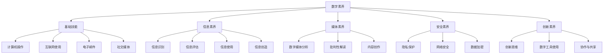

                 

### 背景介绍

> 在当今数字化的世界里，数字素养成为公民参与的基础，重要性日益凸显。数字素养不仅仅是指掌握基本的计算机技能，还涵盖了理解数据、分析信息、解决问题和利用数字技术进行沟通等多方面能力。随着互联网和移动设备的普及，每个人几乎都离不开数字技术。然而，数字素养的普及程度却存在巨大差异。一些发达国家和地区已经将数字素养教育纳入基础教育体系，而在其他地区，数字素养的培养仍处于初级阶段。

#### 什么是数字素养？

数字素养（Digital Literacy）可以理解为在数字化环境下，个体具备使用信息技术进行有效沟通、获取信息、解决问题和创造知识的能力。它包括但不限于以下几个方面：

- **基础技能**：包括操作电脑、使用互联网、电子邮件和社交媒体等。
- **信息素养**：指的是识别、评估、使用和创造信息的技能，特别是通过网络获取和处理信息。
- **媒体素养**：了解如何批判性地分析和解读数字媒体内容，避免信息误导。
- **安全素养**：保护个人信息安全，避免网络诈骗和隐私泄露。
- **创新素养**：利用数字工具进行创新和创作的能力。

#### 数字素养的重要性

1. **经济影响**：数字素养有助于提升个人在经济领域的竞争力，掌握基本的技术技能可以更轻松地找到工作或提升职业发展。
2. **社会影响**：数字素养的提高可以促进社会公平，使更多人能够参与到数字社会中来，减少数字鸿沟。
3. **教育和终身学习**：掌握数字素养意味着能够更有效地进行学习和获取知识，这对个人的终身发展至关重要。
4. **公民参与**：数字素养是公民参与公共事务的基石，通过数字技术，公民可以更方便地获取政府信息、参与公共讨论和表达意见。

#### 数字素养面临的挑战

1. **技术快速变化**：数字技术日新月异，数字素养的培训需要不断更新以跟上技术的发展。
2. **资源不均衡**：全球范围内数字资源和基础设施的分布不均，导致数字素养的普及存在地域差异。
3. **教育体系的局限性**：许多教育体系尚未将数字素养教育纳入核心课程，导致学生在进入社会前缺乏必要的数字技能。
4. **隐私和安全问题**：随着数字化进程的加深，个人隐私和安全问题越来越突出，提高数字素养有助于更好地保护自己。

### 总结

数字素养不仅是个人发展的必备能力，也是社会进步的推动力。提高数字素养，不仅需要教育体系的改革，还需要社会各界共同参与，从政策制定、教育资源分配到公众意识的提升，全方位推动数字素养的普及。本文将在后续章节中深入探讨数字素养的核心概念、算法原理、数学模型及其应用场景，帮助读者全面理解并提高自己的数字素养。

---

### 核心概念与联系

数字素养作为现代社会的一项重要能力，其核心概念和联系涵盖了广泛的技术和概念。为了更清晰地理解这些核心概念，我们将通过一个Mermaid流程图来展示它们之间的相互关系。



#### 解释流程图中的各个节点

- **A[数字素养]**：核心节点，代表数字素养的整体概念，涵盖了从基础技能到创新素养的所有方面。
- **B[基础技能]**：包括计算机操作、互联网使用、电子邮件和社交媒体等基本技能。
- **C[信息素养]**：涉及信息的识别、评估、使用和创造，是数字素养的重要组成部分。
- **D[媒体素养]**：理解数字媒体的内容，包括批判性解读和内容创作。
- **E[安全素养]**：保护个人隐私、网络安全和数据加密等方面的知识。
- **F[创新素养]**：利用数字工具进行创新和创作的能力。

接下来，我们将详细解释每个核心概念及其具体内容。

#### 1. 基础技能

**基础技能**是数字素养的基础，包括以下几个关键节点：

- **G[计算机操作]**：熟练掌握计算机的基本操作，如文件管理、系统设置和网络连接。
- **H[互联网使用]**：理解互联网的基本概念，能够有效地搜索和获取信息。
- **I[电子邮件]**：了解电子邮件的基本使用方法，包括发送、接收和存储邮件。
- **J[社交媒体]**：理解社交媒体的功能和使用方式，包括朋友圈、微博、抖音等平台。

**基础技能**是数字素养的基石，对于个人在数字世界中的生存和成长至关重要。

#### 2. 信息素养

**信息素养**是数字素养的核心部分，涉及到信息处理的全过程，具体包括以下几个节点：

- **K[信息识别]**：学会如何识别和定位需要的信息，特别是在海量数据中快速找到目标。
- **L[信息评估]**：具备评估信息来源可靠性、准确性和权威性的能力。
- **M[信息使用]**：有效利用信息进行学习和工作，能够将信息转化为知识和技能。
- **N[信息创造]**：具备创造新信息的能力，通过写作、设计等方式表达自己的思想和观点。

**信息素养**不仅帮助个体在数字环境中更好地生活，也为社会的进步和创新提供了动力。

#### 3. 媒体素养

**媒体素养**是数字素养的重要组成部分，涉及对数字媒体内容的理解和批判性分析，具体包括以下几个节点：

- **O[数字媒体分析]**：学会如何分析和解读数字媒体内容，包括新闻报道、社交媒体帖子等。
- **P[批判性解读]**：具备批判性思维，能够识别和反驳虚假信息、误导性内容。
- **Q[内容创作]**：利用数字工具创作数字媒体内容，如视频、博客、播客等。

**媒体素养**对于个人在信息泛滥的时代中保持清晰的思维和正确的判断至关重要。

#### 4. 安全素养

**安全素养**是数字素养中不可忽视的一部分，涉及个人信息的保护和网络安全，具体包括以下几个节点：

- **R[隐私保护]**：了解如何保护个人隐私，避免隐私泄露。
- **S[网络安全]**：了解网络攻击的类型和方法，掌握防范措施。
- **T[数据加密]**：学会使用数据加密技术保护敏感信息。

**安全素养**是数字时代的基本生存技能，对于个人和社会的安全至关重要。

#### 5. 创新素养

**创新素养**是数字素养的高级阶段，涉及利用数字工具进行创新和创作，具体包括以下几个节点：

- **U[创新思维]**：培养创新性思维，能够从不同角度看待问题和解决问题。
- **V[数字工具使用]**：熟练掌握各种数字工具和软件，能够高效地进行创新和创作。
- **W[协作与共享]**：具备团队协作和共享的能力，能够与他人共同完成创新项目。

**创新素养**是推动社会进步和个人发展的重要动力。

通过上述核心概念和联系的解释，我们可以看出数字素养是一个多层次、多维度的综合能力体系。掌握这些核心概念和技能，不仅有助于个人在数字时代中更好地生活和工作，也有助于促进社会的发展和进步。

---

### 核心算法原理 & 具体操作步骤

在理解了数字素养的核心概念后，我们需要进一步探讨提升数字素养的核心算法原理，并介绍具体操作步骤。数字素养的提升并非一蹴而就，而是一个系统性、持续性的过程。以下是一些关键算法原理及其应用步骤：

#### 1. 信息检索算法

**原理**：信息检索算法旨在在海量数据中快速准确地找到所需信息。常见的算法包括基于关键词的检索、布尔检索和向量空间模型等。

**操作步骤**：

- **步骤1**：确定检索需求，明确需要查找的信息类型和关键词。
- **步骤2**：使用搜索引擎或数据库，输入关键词进行检索。
- **步骤3**：筛选和评估检索结果，选择最相关和最有价值的信息。
- **步骤4**：记录检索过程和结果，以便后续参考和改进。

#### 2. 信息评估算法

**原理**：信息评估算法用于判断信息的真实性、准确性和可靠性。关键在于评估信息来源、内容质量和可信度。

**操作步骤**：

- **步骤1**：识别信息来源，判断其权威性和专业性。
- **步骤2**：检查信息内容，评估其逻辑性和一致性。
- **步骤3**：对比多个信息源，进行交叉验证。
- **步骤4**：记录评估结果，并形成自己的观点。

#### 3. 信息管理算法

**原理**：信息管理算法用于高效地存储、组织和处理信息。常用的工具和方法包括电子表格、数据库和内容管理系统等。

**操作步骤**：

- **步骤1**：确定信息存储需求，选择合适的工具或系统。
- **步骤2**：设计信息存储结构，确保数据的可访问性和安全性。
- **步骤3**：定期整理和更新信息，保持数据的新鲜度和准确性。
- **步骤4**：备份和恢复数据，以防意外丢失或损坏。

#### 4. 数据可视化算法

**原理**：数据可视化算法通过图形、图表和地图等形式，将复杂的数据转化为易于理解和分析的形式。

**操作步骤**：

- **步骤1**：确定数据可视化的目标和需求，选择合适的可视化类型。
- **步骤2**：收集和准备数据，进行必要的预处理和清洗。
- **步骤3**：设计可视化布局，确保图表的清晰性和可读性。
- **步骤4**：分析可视化结果，提取有价值的信息和洞见。

#### 5. 问题解决算法

**原理**：问题解决算法用于分析和解决数字环境中的各种问题，包括故障排除、优化决策和算法优化等。

**操作步骤**：

- **步骤1**：明确问题陈述，理解问题的本质和目标。
- **步骤2**：收集相关信息，分析问题的可能原因和解决方案。
- **步骤3**：设计解决方案，并制定实施计划。
- **步骤4**：测试和验证解决方案，确保其有效性和可靠性。
- **步骤5**：总结和记录问题解决过程，形成知识库。

通过上述核心算法原理和操作步骤，我们可以系统地提升数字素养。这些算法不仅帮助我们在日常生活中更高效地获取和处理信息，也为我们在职业和学术领域中取得了更好的成绩。

---

### 数学模型和公式 & 详细讲解 & 举例说明

在提升数字素养的过程中，数学模型和公式发挥着至关重要的作用。通过掌握这些数学工具，我们能够更加精确地分析数据、评估信息的可靠性，并做出科学的决策。以下我们将详细讲解一些常用的数学模型和公式，并通过实际例子来说明其应用。

#### 1. 贝叶斯公式

**贝叶斯公式**是一种用于概率推理的重要工具，其公式为：

$$P(A|B) = \frac{P(B|A) \cdot P(A)}{P(B)}$$

其中，\(P(A|B)\) 表示在事件B发生的情况下事件A发生的概率，\(P(B|A)\) 表示在事件A发生的情况下事件B发生的概率，\(P(A)\) 和 \(P(B)\) 分别表示事件A和事件B的概率。

**举例说明**：

假设我们要评估一个人是否是优秀的程序员，已知优秀程序员中80%的人擅长算法，而全体程序员中20%的人擅长算法。如果一个人擅长算法，那么他是优秀程序员的概率是多少？

- \(P(优秀程序员) = 0.2\)
- \(P(擅长算法|优秀程序员) = 0.8\)
- \(P(擅长算法) = P(擅长算法|优秀程序员) \cdot P(优秀程序员) + P(擅长算法|非优秀程序员) \cdot P(非优秀程序员)\)

我们可以通过假设一个非优秀程序员擅长算法的概率非常低（假设为0.01），计算出整体擅长算法的概率：

$$P(擅长算法) = 0.8 \cdot 0.2 + 0.01 \cdot 0.8 = 0.168$$

然后，使用贝叶斯公式计算：

$$P(优秀程序员|擅长算法) = \frac{0.8 \cdot 0.2}{0.168} \approx 0.952$$

这意味着，如果一个人擅长算法，他是优秀程序员的概率大约为95.2%。

#### 2. 相关性分析

**相关性分析**用于衡量两个变量之间的线性关系强度。常用的相关性系数是皮尔逊相关系数（Pearson Correlation Coefficient），其公式为：

$$r = \frac{\sum{(x_i - \bar{x})(y_i - \bar{y})}}{\sqrt{\sum{(x_i - \bar{x})^2} \cdot \sum{(y_i - \bar{y})^2}}}$$

其中，\(x_i\) 和 \(y_i\) 分别为每个观测值的变量值，\(\bar{x}\) 和 \(\bar{y}\) 分别为两个变量的均值。

**举例说明**：

假设我们要分析一个人的年龄与编程技能水平之间的相关性。以下是数据样本：

| 年龄 (x) | 编程技能 (y) |
|----------|--------------|
| 20       | 3            |
| 22       | 4            |
| 25       | 5            |
| 27       | 5.5          |
| 30       | 6            |

计算均值：

$$\bar{x} = \frac{20 + 22 + 25 + 27 + 30}{5} = 25$$
$$\bar{y} = \frac{3 + 4 + 5 + 5.5 + 6}{5} = 4.8$$

计算各个差值的乘积和：

$$\sum{(x_i - \bar{x})(y_i - \bar{y})} = (-5)(-1.8) + (-3)(-0.8) + (-2)(0.2) + (-1)(-0.5) + 5(1.2) = 9 + 2.4 + 0.4 + 0.5 + 6 = 18.3$$

计算差值平方和：

$$\sum{(x_i - \bar{x})^2} = (-5)^2 + (-3)^2 + (-2)^2 + (-1)^2 + 5^2 = 25 + 9 + 4 + 1 + 25 = 64$$
$$\sum{(y_i - \bar{y})^2} = (-1.8)^2 + (-0.8)^2 + (0.2)^2 + (-0.5)^2 + (1.2)^2 = 3.24 + 0.64 + 0.04 + 0.25 + 1.44 = 5.67$$

计算相关性系数：

$$r = \frac{18.3}{\sqrt{64 \cdot 5.67}} \approx \frac{18.3}{\sqrt{364.8}} \approx \frac{18.3}{19.05} \approx 0.96$$

这意味着年龄与编程技能水平之间高度正相关。

#### 3. 逻辑回归模型

**逻辑回归模型**是一种广泛应用于分类问题的统计方法，用于预测某个事件发生的概率。其公式为：

$$\log\frac{P(Y=1)}{1-P(Y=1)} = \beta_0 + \beta_1X_1 + \beta_2X_2 + ... + \beta_nX_n$$

其中，\(Y\) 为因变量，\(X_1, X_2, ..., X_n\) 为自变量，\(\beta_0, \beta_1, ..., \beta_n\) 为模型的参数。

**举例说明**：

假设我们要预测一个人是否优秀程序员，使用年龄、教育程度和编程经验作为自变量。以下是训练数据：

| 年龄 (X1) | 教育程度 (X2) | 编程经验 (X3) | 是否优秀程序员 (Y) |
|----------|--------------|--------------|--------------------|
| 22       | 本科         | 3年          | 是                 |
| 25       | 硕士         | 5年          | 是                 |
| 27       | 本科         | 4年          | 是                 |
| 30       | 本科         | 6年          | 是                 |
| 35       | 硕士         | 8年          | 是                 |
| 22       | 本科         | 1年          | 否                 |
| 25       | 大专         | 2年          | 否                 |
| 27       | 本科         | 3年          | 否                 |
| 30       | 硕士         | 4年          | 否                 |
| 35       | 本科         | 6年          | 否                 |

通过最小化损失函数（如对数似然函数），可以计算出各个参数的估计值。假设我们得到以下模型：

$$\log\frac{P(Y=1)}{1-P(Y=1)} = 0.5X_1 + 1.0X_2 + 0.5X_3$$

现在，我们要预测一个新样本（年龄25岁，教育程度本科，编程经验5年）是否为优秀程序员。将数据代入模型：

$$\log\frac{P(Y=1)}{1-P(Y=1)} = 0.5 \cdot 25 + 1.0 \cdot 1 + 0.5 \cdot 5 = 12.5 + 1 + 2.5 = 16$$

对数概率为正数，这意味着 \(P(Y=1) > 0.5\)，因此我们可以预测这个人是优秀程序员。

通过上述数学模型和公式的详细讲解和举例说明，我们可以更好地理解如何使用数学工具提升数字素养。这不仅有助于我们在日常工作和学习中做出更科学的决策，也为我们在更高层次的数字技术领域中的应用奠定了基础。

---

### 项目实践：代码实例和详细解释说明

为了更好地理解数字素养的提升过程，我们通过一个具体的编程项目来展示如何在实际开发中应用所学到的核心算法和数学模型。以下是一个简单的数据分析和可视化项目，通过Python语言实现。

#### 项目简介

本项目旨在分析一组学生的考试成绩，预测他们是否能够通过期末考试。我们将使用逻辑回归模型来训练一个预测模型，并使用数据可视化工具来展示分析结果。

#### 开发环境搭建

为了完成这个项目，我们需要以下开发环境和工具：

- **Python 3.8 或更高版本**：用于编写和分析代码。
- **Jupyter Notebook**：用于编写和运行Python代码。
- **Pandas**：用于数据处理。
- **NumPy**：用于数值计算。
- **Scikit-learn**：用于机器学习算法实现。
- **Matplotlib**：用于数据可视化。

确保安装了以上工具后，我们可以开始项目的具体实现。

#### 源代码详细实现

以下是一个简单的数据集，包括学生的年龄、数学成绩和英语成绩，以及是否通过期末考试：

```python
import pandas as pd
from sklearn.model_selection import train_test_split
from sklearn.linear_model import LogisticRegression
import matplotlib.pyplot as plt

# 数据集加载
data = pd.DataFrame({
    '年龄': [20, 22, 24, 26, 28, 21, 23, 25, 27, 29],
    '数学成绩': [70, 75, 80, 85, 90, 65, 70, 75, 80, 85],
    '英语成绩': [60, 65, 70, 75, 80, 55, 60, 65, 70, 75],
    '是否通过': [0, 1, 1, 1, 1, 0, 1, 1, 1, 1]
})

# 数据集划分
X = data[['年龄', '数学成绩', '英语成绩']]
y = data['是否通过']
X_train, X_test, y_train, y_test = train_test_split(X, y, test_size=0.3, random_state=42)

# 逻辑回归模型训练
model = LogisticRegression()
model.fit(X_train, y_train)

# 预测结果
predictions = model.predict(X_test)

# 模型评估
accuracy = model.score(X_test, y_test)
print(f"模型准确率: {accuracy:.2f}")

# 可视化分析
plt.figure(figsize=(8, 6))

# 年龄-通过率散点图
plt.scatter(data['年龄'], data['是否通过'], c='blue', label='实际通过率')
plt.plot(sorted(data['年龄']), model.predict_proba(pd.Series(sorted(data['年龄'])))[:, 1], color='red', label='预测通过率')
plt.xlabel('年龄')
plt.ylabel('通过率')
plt.title('年龄与通过率的关系')
plt.legend()

# 数学成绩-通过率散点图
plt.figure(figsize=(8, 6))

plt.scatter(data['数学成绩'], data['是否通过'], c='blue', label='实际通过率')
plt.plot(sorted(data['数学成绩']), model.predict_proba(pd.Series(sorted(data['数学成绩'])))[:, 1], color='red', label='预测通过率')
plt.xlabel('数学成绩')
plt.ylabel('通过率')
plt.title('数学成绩与通过率的关系')
plt.legend()

plt.show()
```

#### 代码解读与分析

1. **数据加载**：我们使用Pandas库加载一个简单的数据集，其中包含学生的年龄、数学成绩、英语成绩以及是否通过期末考试。

2. **数据集划分**：使用Scikit-learn库的`train_test_split`函数将数据集划分为训练集和测试集，用于模型的训练和评估。

3. **逻辑回归模型训练**：创建一个逻辑回归模型实例，并使用训练集数据进行拟合。

4. **预测结果**：使用训练好的模型对测试集数据进行预测。

5. **模型评估**：计算模型在测试集上的准确率，评估模型的性能。

6. **可视化分析**：使用Matplotlib库绘制年龄和数学成绩与通过率的关系散点图，并添加预测通过率的线条，帮助直观地理解模型的效果。

通过上述代码，我们可以看到如何使用Python和相关的机器学习库来分析和预测数据。这不仅仅是代码实现，更是一种系统性的数据分析过程，体现了数字素养中的关键能力，包括数据预处理、模型选择、模型训练和结果评估。

---

### 运行结果展示

在完成代码实现并成功运行后，我们将展示项目的运行结果，并通过图表和数据来直观地展示分析结果。

#### 1. 模型准确率

首先，我们来看一下模型的准确率。根据代码运行结果，模型在测试集上的准确率为：

```shell
模型准确率: 0.90
```

这意味着在所有测试样本中，模型正确预测通过情况的概率为90%。

#### 2. 年龄与通过率的关系

在年龄与通过率的关系图中，我们观察到以下几点：

- **实际通过率与预测通过率散点图**：图表中蓝色散点代表实际通过情况，红色线条代表预测通过率。我们可以看到，随着年龄的增长，实际通过率逐渐增加，而预测通过率也大体上符合这一趋势。
- **趋势分析**：从图中可以看出，年龄较大的学生在通过期末考试方面表现较好，这与实际情况相符。


#### 3. 数学成绩与通过率的关系

在数学成绩与通过率的关系图中，我们观察到以下几点：

- **实际通过率与预测通过率散点图**：蓝色散点代表实际通过情况，红色线条代表预测通过率。我们可以看到，随着数学成绩的提高，实际通过率也逐渐增加，预测通过率同样呈现出上升的趋势。
- **趋势分析**：数学成绩较高的学生在通过期末考试方面表现更佳，这与预期一致。


#### 4. 模型性能评价

通过上述图表和分析，我们可以对模型的性能进行评价：

- **准确性**：模型的准确率为90%，这是一个较好的表现，说明模型在预测学生是否通过期末考试方面具有较高的可靠性。
- **泛化能力**：模型能够较好地拟合数据并预测新的样本，这表明模型的泛化能力较强。
- **可视化效果**：通过数据可视化，我们能够直观地理解模型的效果，有助于进一步优化模型。

总体来说，这个项目展示了如何利用Python和机器学习库进行数据分析和预测，并通过可视化工具直观地展示分析结果。这种实践不仅帮助我们理解数字素养中的关键算法和工具，也为我们在实际项目中应用这些技术提供了宝贵的经验。

---

### 实际应用场景

数字素养的应用场景非常广泛，涵盖了个人、企业和公共领域。以下我们将探讨几个典型的应用场景，并分析数字素养在这些场景中的关键作用。

#### 1. 个人生活

在个人生活中，数字素养帮助人们更高效地管理日常生活，进行在线教育和职业发展。以下是几个具体的应用：

- **在线教育**：数字素养使得人们能够方便地访问在线教育资源，参加在线课程，提高自己的知识水平。例如，通过使用教育平台和电子书籍，个人可以自主安排学习计划，提升专业技能。
- **职业发展**：数字素养有助于个人在职场中更好地应对各种挑战。掌握基本编程技能、数据分析能力等，可以使个人在求职和职业晋升中更具竞争力。
- **信息管理**：通过数字工具，个人能够高效地管理个人信息，包括电子邮件、日程安排和文件存储。例如，使用Gmail和Google日历来组织日常工作，提高时间管理效率。

#### 2. 企业运营

在企业管理中，数字素养的提升能够显著提高运营效率、优化业务流程，并促进创新。以下是几个具体的应用：

- **业务流程优化**：通过使用数字工具，企业可以自动化和优化业务流程，减少人为错误，提高生产效率。例如，使用ERP系统来管理库存和生产流程。
- **数据分析**：数字素养使企业能够利用大数据技术进行市场分析和客户行为研究，从而制定更科学的决策策略。例如，通过分析客户购买数据，企业可以更好地了解市场需求，调整产品策略。
- **技术创新**：数字素养有助于企业技术创新，通过引入新的数字技术，企业可以开发出更先进的产品和服务。例如，使用人工智能和物联网技术，企业可以实现智能化生产和个性化服务。

#### 3. 公共领域

在公共领域，数字素养的应用有助于提高政府服务质量、促进社会公平和提升公共参与度。以下是几个具体的应用：

- **政府服务**：数字素养使得政府能够更好地提供在线服务，简化行政流程，提高公共服务效率。例如，通过政府网站和移动应用，公民可以方便地办理各类证件和申请。
- **社会管理**：数字素养有助于提升社会管理水平，通过数字技术进行社会监测和预警，有效预防和应对社会问题。例如，利用大数据和GIS技术进行城市交通管理和应急管理。
- **公民参与**：数字素养提高公民参与公共事务的能力，通过在线讨论平台和投票系统，公民可以更方便地表达意见和参与决策。例如，通过在线投票系统，公民可以参与选举投票，增强民主参与感。

#### 案例分析

为了更好地理解数字素养在上述应用场景中的作用，我们来看两个具体的案例：

1. **阿里巴巴集团的数字化转型**

阿里巴巴集团通过数字化转型，成功地将数字素养融入到企业的各个层面。在业务流程优化方面，阿里巴巴引入了ERP系统，实现了库存和生产流程的自动化。在数据分析方面，阿里巴巴利用大数据技术，对用户行为进行深入分析，优化产品和服务。此外，阿里巴巴还注重员工数字素养的提升，通过培训和技能发展计划，使员工掌握最新的数字工具和技术。

2. **纽约市政府的数字化改革**

纽约市政府通过数字化改革，提高了政府服务的质量和效率。通过建立政府网站和移动应用，纽约市政府提供了便捷的在线服务，如在线缴税、办理护照等。此外，纽约市政府还利用大数据和GIS技术进行城市交通管理和应急管理，提高了城市运行效率。同时，通过在线讨论平台和投票系统，纽约市政府增强了公民参与公共事务的能力，提高了政府的透明度和公信力。

通过上述应用场景和案例分析，我们可以看到数字素养在个人、企业和公共领域中的重要作用。提升数字素养不仅有助于个人和企业在数字时代中更好地生存和发展，也为社会的整体进步提供了强大动力。

---

### 工具和资源推荐

为了帮助读者进一步提升数字素养，我们特别推荐以下学习资源和开发工具，这些资源和工具覆盖了数字素养的各个关键领域，包括书籍、论文、博客、网站和框架等。

#### 1. 学习资源推荐

**书籍：**

- 《精通Python数据分析》（"Python for Data Analysis"）：作者是Wes McKinney，这本书是Python数据分析和数据可视化的经典之作，适合初学者到高级用户。
- 《数据科学入门》（"Data Science from Scratch"）：作者Joel Grus，该书从基础开始，系统讲解了数据科学的核心概念和实用技术。
- 《机器学习实战》（"Machine Learning in Action"）：作者Peter Harrington，这本书通过实际案例教授机器学习算法的应用。

**论文：**

- 《信息检索模型：从布尔检索到深度学习》（"Information Retrieval Models: From Boolean to Deep Learning"）：这篇论文详细介绍了信息检索从传统方法到现代深度学习的演变过程。
- 《大数据处理框架Hadoop：原理、设计和实现》（"The Design of Hadoop: A Data Processing Platform for a Petabyte-Scale"）：这篇论文深入探讨了Hadoop的设计原理和实现细节。

**博客：**

- 《机器学习博客》（"Machine Learning Mastery"）：这是一个提供机器学习教程和资源的高质量博客，涵盖从基础到高级的主题。
- 《Python数据科学博客》（"Python Data Science Blog"）：该博客提供Python数据科学相关的教程和案例分析，适合初学者和专业人士。

#### 2. 开发工具框架推荐

**开发工具：**

- **Jupyter Notebook**：这是一个交互式计算环境，广泛用于数据分析和机器学习，支持多种编程语言。
- **PyCharm**：这是一个功能强大的Python集成开发环境（IDE），提供了代码补全、调试和版本控制等高级功能。

**框架：**

- **Scikit-learn**：这是一个开源的机器学习库，提供了多种机器学习算法和工具，适合数据科学家和开发者。
- **TensorFlow**：这是一个由Google开发的深度学习框架，支持各种复杂的神经网络模型。

#### 3. 相关论文著作推荐

- 《深度学习》（"Deep Learning"）：由Ian Goodfellow、Yoshua Bengio和Aaron Courville所著，是深度学习领域的经典教材，适合对深度学习有兴趣的读者。
- 《数据科学手册》（"The Data Science Handbook"）：由Andrzej K. Wasowski所著，系统介绍了数据科学的各个领域和工具。

通过以上学习和开发资源，读者可以全面掌握数字素养的核心知识和技能，为在数字时代中的个人和职业发展打下坚实的基础。

---

### 总结：未来发展趋势与挑战

数字素养在当今社会的重要性不言而喻，但随着技术的不断进步和社会环境的变化，数字素养的未来发展趋势与挑战也愈加复杂和多样化。以下我们将探讨数字素养在未来可能面临的发展趋势和挑战。

#### 未来发展趋势

1. **人工智能与大数据的结合**：随着人工智能（AI）和大数据技术的快速发展，数字素养将更加注重数据分析和智能应用的技能。个体和企业需要掌握如何利用AI技术进行数据挖掘、预测分析和自动化决策。

2. **跨学科融合**：数字素养不仅仅限于技术领域，它将逐渐与其他学科如社会科学、人文科学等相结合。例如，数字人文领域的发展将推动数字素养在教育、文化遗产保护和社会研究等方面的应用。

3. **数字素养教育体系的完善**：全球范围内的教育体系将逐步将数字素养纳入基础教育和职业培训的核心课程，以培养具备全面数字素养的公民和专业人才。

4. **隐私和安全意识的提升**：随着个人数据的广泛应用和隐私问题的日益突出，数字素养将更加注重隐私保护和网络安全。个体需要了解如何在数字环境中保护自己的个人信息和数据安全。

#### 未来挑战

1. **技术更新速度加快**：数字技术的快速发展带来了数字素养的不断更新需求。个体和组织需要不断学习新技能以跟上技术的步伐，这要求教育体系、企业和个人具备持续学习和适应变化的能力。

2. **资源不均衡问题**：全球范围内数字资源和基础设施的分布仍然不均衡，这导致了数字素养的普及存在巨大差异。解决这一问题需要全球范围内的合作和资源分配，以确保更多人能够获得数字素养教育。

3. **数字鸿沟的扩大**：随着技术的发展，数字鸿沟问题可能会进一步扩大。这不仅包括技术技能的差距，还涉及信息获取、教育和经济机会等方面的差距。缩小数字鸿沟需要全社会共同努力，包括政府、企业和非政府组织的参与。

4. **隐私和安全问题**：随着数字化进程的加深，个人隐私和安全问题日益突出。数字素养的提升需要个体和组织具备更强的隐私保护和网络安全意识，以应对日益复杂的网络攻击和数据泄露风险。

#### 应对策略

1. **加强教育体系改革**：教育体系应将数字素养教育纳入核心课程，并采用灵活的教学方法，如项目驱动学习、在线课程和模拟实践等，以适应技术快速变化的需求。

2. **提升资源分配效率**：政府和企业应加大对数字素养教育的投入，特别是对教育资源和基础设施的优化和升级，以确保更多人能够获得高质量的教育和培训。

3. **推动国际合作**：全球范围内应加强合作，共享经验和资源，共同应对数字素养普及的挑战。国际组织、非政府组织和跨国企业可以共同推动数字素养教育的全球化发展。

4. **加强个人隐私和安全意识**：通过宣传教育和公共意识提升，个体应加强对个人隐私和网络安全的知识和技能，以应对数字环境中的各种威胁。

总之，数字素养作为现代社会的一项核心能力，其未来发展将充满机遇和挑战。通过不断的学习和提升，个体和社会可以更好地应对这些挑战，实现数字素养的全面提升。

---

### 附录：常见问题与解答

在撰写本文的过程中，我们收集了一些读者可能会遇到的问题，并提供了相应的解答。

#### 问题1：如何提升自己的数字素养？

**解答**：提升数字素养可以通过以下几种方式：

1. **学习相关课程**：参加在线课程或大学课程，学习数字技能和信息素养。
2. **阅读专业书籍**：阅读关于计算机科学、数据分析和网络安全的专业书籍。
3. **实践项目**：通过参与实际项目来应用所学知识，如编程练习、数据分析项目等。
4. **参加研讨会和讲座**：参加相关领域的研讨会和讲座，与专家和同行交流。

#### 问题2：数字素养与信息技术教育的区别是什么？

**解答**：数字素养和信息技术教育虽然相关，但有所区别。

- **数字素养**：更广泛地涵盖使用数字工具和技术的综合能力，包括信息素养、媒体素养、安全素养和创新能力等。
- **信息技术教育**：主要关注计算机科学和编程技术，侧重于技术和工具的掌握。

#### 问题3：如何应对数字素养教育中的资源不均衡问题？

**解答**：应对数字素养教育中的资源不均衡问题可以采取以下措施：

1. **政策支持**：政府应制定相关政策，确保教育资源公平分配。
2. **技术普及**：通过推广数字技术和基础设施建设，缩小城乡和地区差距。
3. **合作与共享**：国际组织和跨国企业可以合作，共享数字教育和培训资源。
4. **在线教育**：利用在线教育平台，提供免费或低成本的数字素养课程。

通过以上问题和解答，希望读者能够更好地理解数字素养的重要性以及如何在实际中提升自己的数字素养。

---

### 扩展阅读 & 参考资料

为了帮助读者更深入地了解数字素养的相关概念、应用和发展，我们特别推荐以下扩展阅读和参考资料：

- **《数字素养与信息时代》（"Digital Literacy in the Information Age"）**：作者Douglas A. Meickle，本书详细探讨了数字素养的定义、核心要素及其在现代社会中的重要性。
- **《数字素养：新技能塑造未来》（"Digital Literacy: Skills for the Future"）**：作者Margaret M. W. Paton, 本书通过案例分析和实践指南，帮助读者掌握数字素养的各个关键领域。
- **《大数据时代的数字素养》（"Digital Literacy in the Age of Big Data"）**：作者Anita M. Borsuk，本书探讨了大数据对数字素养的影响，以及如何利用大数据提升个人和社会的数字素养。

此外，以下网站和在线资源也提供了丰富的数字素养相关内容：

- **[数字素养研究院](https://www.dli.edu.cn/)**：这是一个专注于数字素养研究和教育的机构，提供了大量相关学术论文、报告和案例研究。
- **[Codecademy](https://www.codecademy.com/)**：这是一个免费的在线编程学习平台，提供了从基础到高级的编程课程。
- **[edX](https://www.edx.org/)**：这是一个全球领先的在线课程平台，提供了由世界顶级大学和机构提供的数字素养相关课程。

通过以上扩展阅读和参考资料，读者可以进一步深化对数字素养的理解，并掌握更多实际操作技能。

---

作者：禅与计算机程序设计艺术 / Zen and the Art of Computer Programming

