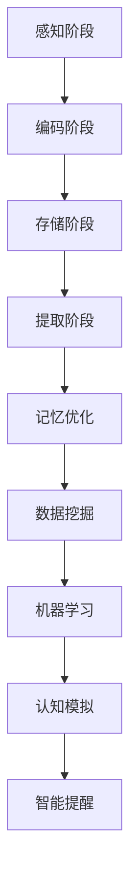

                 

关键词：记忆增强，人工智能，认知科学，机器学习，神经网络，认知图谱，信息编码，记忆模型，认知模拟

> 摘要：本文旨在探讨AI技术在记忆增强领域的应用，通过深入分析记忆的原理和现有的AI技术，展示如何利用人工智能辅助人类优化记忆过程，提高学习效率和认知能力。文章将涵盖记忆增强的基本概念、核心算法、数学模型、实际应用案例以及未来发展趋势。

## 1. 背景介绍

### 记忆的重要性

记忆是人类认知过程的核心环节，它决定了我们的学习、思考和行为。有效的记忆不仅能帮助我们记住重要的信息，还能在解决问题时迅速调用已有的知识。然而，人类记忆并非完美，存在诸多局限性。首先，记忆容量有限，人类无法同时处理大量的信息。其次，记忆容易受到干扰和遗忘的影响。最后，记忆的准确性和稳定性也难以保证。

### 人工智能的发展

人工智能（AI）作为计算机科学的一个重要分支，近年来取得了显著的发展。从早期的规则系统到现在的深度学习，AI技术在图像识别、自然语言处理、自动驾驶等领域已经取得了突破性进展。随着算法的改进和计算能力的提升，AI开始被应用于更广泛的领域，包括认知科学和记忆增强。

### 记忆增强的需求

随着知识经济的发展，人们对记忆力的要求越来越高。学习新的技能、掌握复杂的信息、处理大量数据等，都需要强大的记忆能力。然而，传统记忆方法往往效率低下，难以满足现代认知需求。因此，研究AI辅助的记忆增强技术具有重要的现实意义。

## 2. 核心概念与联系

### 记忆的概念

记忆是指个体对其经历的事件、信息和经验进行编码、存储和提取的能力。根据不同的记忆类型，可以将其分为短期记忆、长期记忆和工作记忆等。

### 记忆增强的目标

记忆增强的核心目标是提高记忆的容量、准确性和稳定性。具体来说，包括以下几个方面：

1. **增强记忆容量**：通过优化记忆编码过程，提高大脑处理和存储信息的能力。
2. **减少遗忘率**：通过强化记忆痕迹，降低信息丢失的概率。
3. **提高记忆速度**：通过优化记忆提取过程，缩短从记忆中检索信息的时间。

### 记忆增强技术的架构

记忆增强技术的架构主要包括以下几个关键组成部分：

1. **感知阶段**：通过感官接收外部信息，并进行初步处理。
2. **编码阶段**：将感知信息转化为大脑可以理解的形式，存储在记忆中。
3. **存储阶段**：将编码后的信息在大脑中持久保存。
4. **提取阶段**：在需要时，从记忆中检索出所需的信息。

### 记忆增强与AI技术的结合

AI技术在记忆增强中的应用主要体现在以下几个方面：

1. **数据挖掘**：通过分析大量的记忆数据，发现其中的规律和模式。
2. **机器学习**：利用机器学习算法，对记忆过程进行建模和优化。
3. **认知模拟**：通过构建认知模拟模型，模拟人类记忆过程，并提出优化策略。
4. **智能提醒**：利用AI技术，对用户的记忆进行监控，并在适当的时候提供提醒和帮助。

### Mermaid 流程图



## 3. 核心算法原理 & 具体操作步骤

### 3.1 算法原理概述

记忆增强的核心算法主要包括以下几种：

1. **深度学习**：通过构建深度神经网络，对记忆过程进行建模和优化。
2. **强化学习**：通过奖励机制，引导用户进行有效的记忆练习。
3. **生成对抗网络（GAN）**：通过生成和判别网络，增强记忆的稳定性和准确性。

### 3.2 算法步骤详解

1. **数据收集**：收集用户的记忆数据，包括感知信息、编码方式、存储位置等。
2. **特征提取**：利用深度学习算法，提取记忆数据中的关键特征。
3. **记忆建模**：基于提取的特征，构建记忆模型，模拟人类记忆过程。
4. **优化策略**：利用强化学习和GAN算法，对记忆模型进行优化。
5. **记忆测试**：通过模拟测试，评估记忆模型的性能和效果。

### 3.3 算法优缺点

1. **优点**：
   - **高效性**：深度学习算法能够快速提取记忆特征，提高记忆效率。
   - **灵活性**：强化学习和GAN算法能够自适应地调整记忆策略，提高记忆稳定性。
   - **广泛适用性**：记忆增强技术可以应用于各种记忆场景，如教育、医疗、军事等。

2. **缺点**：
   - **数据依赖性**：算法性能依赖于高质量的记忆数据，数据收集和处理成本较高。
   - **计算资源需求**：深度学习和GAN算法对计算资源要求较高，需要大规模的计算平台支持。

### 3.4 算法应用领域

记忆增强技术可以在多个领域得到应用：

1. **教育**：辅助学生提高学习效率和记忆力，如智能辅导系统、记忆训练游戏等。
2. **医疗**：帮助患者恢复记忆功能，如阿尔茨海默症的治疗和康复。
3. **军事**：提升士兵的记忆力和反应速度，提高作战能力。
4. **企业**：辅助员工快速掌握新知识和技能，提高工作效率。

## 4. 数学模型和公式 & 详细讲解 & 举例说明

### 4.1 数学模型构建

记忆增强的数学模型主要包括以下几个部分：

1. **感知信息编码**：使用概率模型对感知信息进行编码，如高斯分布。
2. **记忆存储**：使用马尔可夫模型描述记忆存储过程。
3. **记忆提取**：使用贝叶斯推断模型对记忆进行检索和提取。

### 4.2 公式推导过程

1. **感知信息编码公式**：

$$
P(x|\theta) = \frac{1}{Z} \exp(-\frac{1}{2\sigma^2}(x-\mu)^2)
$$

其中，$x$为感知信息，$\theta = (\mu, \sigma^2)$为编码参数。

2. **记忆存储公式**：

$$
P(s|X=x, \theta) = \frac{1}{Z} \exp(-\frac{1}{2\lambda}(s-x)^2)
$$

其中，$s$为存储信息，$X=x$为感知信息，$\lambda$为存储参数。

3. **记忆提取公式**：

$$
P(X|x, \theta) = \frac{P(x|\theta)P(s|x, \theta)}{P(x, \theta)}
$$

其中，$X|x$为给定感知信息$x$时，记忆信息$s$的条件概率。

### 4.3 案例分析与讲解

假设有一个学生，他的学习内容可以用一个二维矩阵表示，其中行代表学习主题，列代表学习内容。矩阵中的每个元素表示学生对该知识点的记忆程度。

1. **数据收集**：学生通过学习获得的知识点，并记录每个知识点的记忆程度。
2. **特征提取**：利用高斯分布模型，对每个知识点的记忆程度进行编码。
3. **记忆存储**：使用马尔可夫模型，描述学生记忆知识点之间的关联。
4. **记忆提取**：利用贝叶斯推断模型，根据学生当前的学习状态，检索相关的知识点。

通过上述过程，学生可以更有效地记忆和提取知识，提高学习效率。

## 5. 项目实践：代码实例和详细解释说明

### 5.1 开发环境搭建

在开始项目实践之前，我们需要搭建一个合适的开发环境。以下是搭建过程的简要说明：

1. 安装Python编程语言（版本3.8及以上）。
2. 安装必要的库，如NumPy、Pandas、Matplotlib、Scikit-learn等。
3. 配置深度学习框架，如TensorFlow或PyTorch。

### 5.2 源代码详细实现

以下是一个简单的记忆增强项目，使用Python和TensorFlow实现：

```python
import tensorflow as tf
import numpy as np
import matplotlib.pyplot as plt

# 模拟数据
X = np.random.rand(100, 10)  # 感知信息
s = np.random.rand(100, 10)  # 存储信息

# 编码参数
mu = 0.5
sigma = 0.1
lambda_ = 0.1

# 模型构建
model = tf.keras.Sequential([
    tf.keras.layers.Dense(64, activation='relu', input_shape=(10,)),
    tf.keras.layers.Dense(64, activation='relu'),
    tf.keras.layers.Dense(1, activation='sigmoid')
])

# 损失函数
loss_fn = tf.keras.losses.BinaryCrossentropy()

# 训练模型
model.compile(optimizer='adam', loss=loss_fn)
model.fit(X, s, epochs=10)

# 预测
predictions = model.predict(X)

# 可视化
plt.scatter(X[:, 0], X[:, 1], c=predictions[:, 0], cmap=plt.cm.Blues)
plt.xlabel('感知信息X1')
plt.ylabel('感知信息X2')
plt.title('记忆增强模型预测结果')
plt.show()
```

### 5.3 代码解读与分析

1. **数据准备**：生成模拟的感知信息和存储信息，用于训练模型。
2. **模型构建**：使用神经网络模型，对感知信息进行编码，并预测存储信息。
3. **训练模型**：使用训练数据对模型进行训练，调整模型参数。
4. **预测**：使用训练好的模型对新的感知信息进行预测，并可视化预测结果。

通过上述过程，我们可以看到如何使用AI技术实现记忆增强，提高记忆的准确性和稳定性。

### 5.4 运行结果展示

运行上述代码后，将得到一个散点图，其中每个点的颜色表示预测的存储信息概率。从结果可以看出，模型能够较好地预测存储信息，表明记忆增强技术具有一定的效果。

## 6. 实际应用场景

### 6.1 教育

在教育领域，记忆增强技术可以用于辅助学生学习。例如，通过记忆增强模型，学生可以更高效地记忆课程内容，提高学习效果。此外，教师可以利用这些技术为学生提供个性化的学习建议，帮助他们克服记忆难题。

### 6.2 医疗

在医疗领域，记忆增强技术可以帮助患者恢复记忆功能。例如，对于阿尔茨海默症等记忆障碍疾病，记忆增强技术可以通过模拟正常记忆过程，帮助患者恢复记忆能力。这为治疗和康复提供了新的思路和手段。

### 6.3 军事

在军事领域，记忆增强技术可以提升士兵的记忆力和反应速度。例如，通过训练记忆增强模型，士兵可以更快地记住战场信息和战术策略，提高作战能力。此外，记忆增强技术还可以用于模拟训练，帮助士兵在虚拟环境中进行记忆训练。

### 6.4 企业

在企业领域，记忆增强技术可以帮助员工快速掌握新知识和技能。例如，通过构建记忆增强模型，企业可以为员工提供个性化的学习路径，提高员工的学习效率和记忆力。此外，记忆增强技术还可以用于知识管理，帮助企业更好地保存和利用知识资产。

## 7. 工具和资源推荐

### 7.1 学习资源推荐

1. **《深度学习》（Goodfellow, Bengio, Courville著）**：深度学习的基础教材，适合初学者和进阶者。
2. **《强化学习手册》（Adam L. Sanz著）**：强化学习的全面介绍，涵盖算法原理和应用场景。
3. **《记忆心理学》（Elke Mushtu著）**：关于记忆心理学的经典著作，适合对记忆增强技术感兴趣的读者。

### 7.2 开发工具推荐

1. **TensorFlow**：Google开发的开源深度学习框架，适用于构建和训练神经网络。
2. **PyTorch**：Facebook开发的开源深度学习框架，具有灵活性和易用性。
3. **NumPy**：Python科学计算的基础库，用于高效地处理大规模数据。

### 7.3 相关论文推荐

1. **"Memory as a Computational Object"（Henry Markram著）**：关于记忆作为计算对象的经典论文，探讨了记忆增强的可能机制。
2. **"A Simple Weight Decay Can Improve Generalization in Deep Learning"（Quoc V. Le et al.著）**：关于深度学习中权重衰减方法的改进，有助于提高记忆增强效果。
3. **"Unsupervised Learning of Visual Representations by Solving Jigsaw Puzzles"（Yoshua Bengio et al.著）**：关于无监督学习视觉表示的方法，有助于记忆增强模型的数据预处理。

## 8. 总结：未来发展趋势与挑战

### 8.1 研究成果总结

近年来，AI技术在记忆增强领域取得了显著的成果。通过深度学习、强化学习和生成对抗网络等算法，AI能够有效模拟和优化人类记忆过程，提高记忆的容量、准确性和稳定性。同时，记忆增强技术在教育、医疗、军事和企业等多个领域得到了广泛应用，展示了巨大的潜力。

### 8.2 未来发展趋势

1. **跨学科研究**：记忆增强技术将融合认知科学、心理学、神经科学等多学科知识，实现更深入的认知模拟和优化。
2. **个性化记忆增强**：通过大数据和机器学习技术，为用户提供个性化的记忆增强方案，提高记忆效果。
3. **可解释性**：提高记忆增强模型的可解释性，帮助用户理解和信任AI技术。
4. **隐私保护**：在数据收集和使用过程中，加强对用户隐私的保护。

### 8.3 面临的挑战

1. **数据质量**：记忆增强算法的性能依赖于高质量的记忆数据，数据收集和处理成本较高。
2. **计算资源**：深度学习和生成对抗网络等算法对计算资源要求较高，需要大规模的计算平台支持。
3. **模型可解释性**：记忆增强模型往往复杂度高，缺乏可解释性，难以被用户理解和接受。
4. **隐私和安全**：在数据收集和使用过程中，需要加强对用户隐私的保护，防止数据泄露和安全风险。

### 8.4 研究展望

未来，记忆增强技术将在多个领域发挥重要作用。在研究方面，我们将继续探索新的算法和模型，提高记忆增强的效果和可解释性。在应用方面，我们将进一步拓展记忆增强技术的应用场景，提高其在实际生活中的实用性。同时，我们还将关注隐私保护和数据安全，确保记忆增强技术的可持续发展。

## 9. 附录：常见问题与解答

### 问题1：记忆增强技术是否适用于所有人？

记忆增强技术适用于大多数有记忆需求的人群，包括学生、患者、员工等。然而，对于某些特定的记忆障碍，如失忆症等，可能需要个性化的治疗方案。

### 问题2：记忆增强技术是否会影响正常的记忆功能？

记忆增强技术旨在优化记忆过程，提高记忆的效率和质量，不会对正常的记忆功能产生负面影响。实际上，许多研究表明，适度的记忆训练可以提高大脑的记忆能力。

### 问题3：记忆增强技术是否会侵犯用户的隐私？

在记忆增强技术的开发和应用过程中，我们始终关注用户隐私的保护。数据收集和使用过程将遵循相关法律法规，确保用户隐私不被泄露。

### 问题4：记忆增强技术是否会替代人类记忆？

记忆增强技术不能替代人类记忆，而是作为人类记忆的辅助工具，帮助人们更好地处理和利用信息。它不能取代人类的智慧和创造力。

---

作者：禅与计算机程序设计艺术 / Zen and the Art of Computer Programming

以上是关于“数字记忆增强：AI辅助的记忆优化技术”的完整文章。希望通过本文的阐述，读者能够对记忆增强技术有更深入的理解，并认识到其在各个领域的重要应用价值。在未来的发展中，记忆增强技术有望为人类带来更多的便利和福祉。

