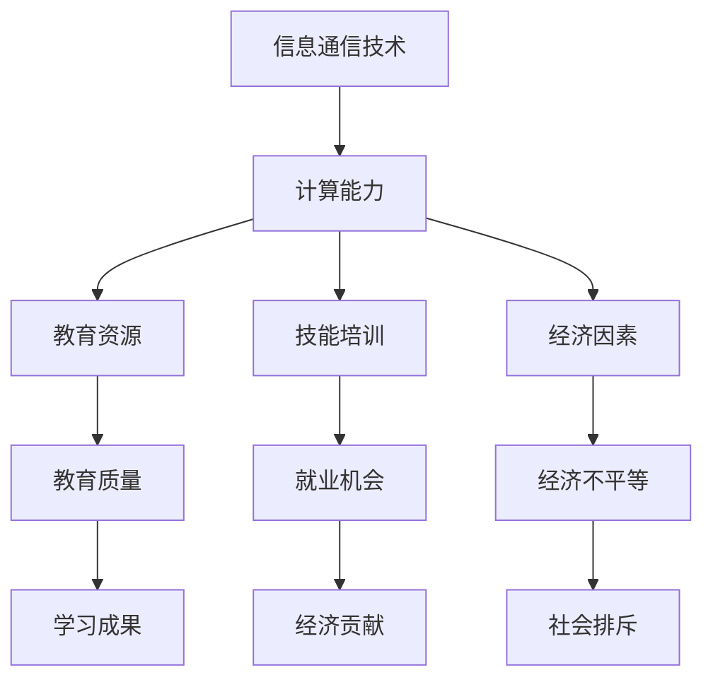

                 

关键词：数字鸿沟、计算不平等、人工智能、算法、教育、技术普及

## 摘要

本文旨在探讨数字鸿沟这一全球性问题，特别是在人类计算领域中的不平等现象。我们将深入分析数字鸿沟的成因、影响及其在人工智能和技术普及方面的体现。通过阐述核心概念和算法原理，本文将提出一系列解决方案，以期弥合人类计算中的不平等，促进全球数字包容。

## 1. 背景介绍

在当今信息时代，计算能力已经成为推动社会进步和经济发展的关键因素。然而，数字鸿沟的存在使得这种能力的获取和利用出现了显著的差异。数字鸿沟指的是不同社会群体在获取、使用和管理信息通信技术（ICT）方面的差异。这些差异不仅体现在基础设施的普及程度，还包括教育和培训、技能获取、文化背景以及经济能力等方面。

### 1.1 数字鸿沟的成因

数字鸿沟的产生主要有以下几个方面的原因：

- **基础设施不足**：在一些发展中国家，互联网基础设施薄弱，导致人口无法方便地接入网络。
- **教育和培训差异**：教育资源的分配不均，使得一部分人缺乏基本的计算机技能。
- **文化差异**：不同文化对技术的接受度和应用方式存在差异。
- **经济因素**：经济能力的差异导致一部分人无法承担数字化生活的费用。

### 1.2 数字鸿沟的影响

数字鸿沟的影响深远，不仅影响个人的生活质量和职业发展，还对国家和社会的整体发展产生负面影响：

- **经济不平等**：数字鸿沟加剧了经济不平等，使得一些群体被排除在数字经济增长之外。
- **教育落后**：缺乏数字技能的教育资源导致这些群体在教育领域处于劣势。
- **社会排斥**：数字鸿沟可能导致社会排斥，使得一些群体难以融入现代社会。

## 2. 核心概念与联系

为了更好地理解数字鸿沟，我们需要了解以下几个核心概念和它们之间的联系：

### 2.1. 信息通信技术（ICT）

信息通信技术是数字鸿沟的基础。它包括互联网、移动电话、计算机等技术，是信息交换和处理的关键工具。

### 2.2. 计算能力

计算能力是指个人或组织使用计算机和相关技术解决问题的能力。它是弥合数字鸿沟的关键因素。

### 2.3. 教育资源

教育资源是提高计算能力的重要手段。它包括课程设置、教学设施和教师培训等。

### 2.4. 技能培训

技能培训是提升个人计算能力的重要途径。通过培训，人们可以学习到如何有效地使用ICT工具。

### 2.5. 经济因素

经济因素决定了个人和社会是否能够获得足够的资源和机会来弥合数字鸿沟。

#### Mermaid 流程图

下面是一个简化的 Mermaid 流程图，展示这些核心概念之间的联系：



## 3. 核心算法原理 & 具体操作步骤

为了弥合数字鸿沟，我们需要采取一系列有效的算法和操作步骤。以下是几个关键步骤的概述：

### 3.1 算法原理概述

弥合数字鸿沟的核心算法主要包括以下几个原理：

- **资源分配算法**：通过优化资源分配，确保每个人都能够公平地获得ICT资源。
- **教育支持算法**：利用大数据分析和个性化学习，提高教育质量和学习成果。
- **经济激励算法**：通过提供经济激励，鼓励更多人参与数字技能培训。

### 3.2 算法步骤详解

#### 3.2.1 资源分配算法

资源分配算法的关键步骤包括：

1. 收集数据：收集关于ICT资源使用情况和用户需求的详细数据。
2. 数据分析：分析数据，识别资源使用的高峰期和低谷期。
3. 优化分配：根据分析结果，优化资源分配策略，确保资源的高效利用。

#### 3.2.2 教育支持算法

教育支持算法的具体步骤包括：

1. 大数据分析：收集和分析学生学习行为和成绩的数据。
2. 个性化学习：根据学生的特点和学习需求，提供个性化的学习资源。
3. 教学反馈：及时收集教师和学生的反馈，不断优化教育支持系统。

#### 3.2.3 经济激励算法

经济激励算法的关键步骤包括：

1. 设定目标：设定明确的培训目标和奖励标准。
2. 奖励发放：根据学员的学习进度和成绩，发放奖励。
3. 监督与评估：定期评估激励方案的效果，确保其有效性。

### 3.3 算法优缺点

每种算法都有其优缺点：

- **资源分配算法**：优点在于可以高效地利用资源，缺点是需要大量的数据支持和复杂的算法设计。
- **教育支持算法**：优点在于可以显著提高教育质量，缺点是需要大量的投入和专业的师资力量。
- **经济激励算法**：优点在于可以激发学员的学习积极性，缺点是可能产生不公平现象。

### 3.4 算法应用领域

这些算法可以广泛应用于以下领域：

- **教育资源分配**：在教育资源有限的地区，通过优化分配策略，提高教育质量。
- **职业培训**：通过提供个性化的培训资源和经济激励，提高学员的职业能力。
- **社会服务**：通过提供数字技能培训，帮助社会弱势群体融入现代社会。

## 4. 数学模型和公式 & 详细讲解 & 举例说明

### 4.1 数学模型构建

为了构建一个有效的数学模型来弥合数字鸿沟，我们可以从以下几个基本公式开始：

1. **资源利用效率（E）**： 
   $$E = \frac{R}{T}$$
   其中，E 表示资源利用效率，R 表示资源的总使用量，T 表示资源的总可用时间。

2. **教育回报率（ROR）**： 
   $$ROR = \frac{Earnings}{Investment}$$
   其中，ROR 表示教育回报率，Earnings 表示教育带来的收入增加，Investment 表示教育投资。

3. **经济激励效应（EI）**：
   $$EI = ROR \times Incentive$$
   其中，EI 表示经济激励效应，Incentive 表示经济激励的金额。

### 4.2 公式推导过程

为了推导这些公式，我们需要从以下几个假设开始：

- 资源利用效率（E）假设是资源使用量和可用时间的一个比率。
- 教育回报率（ROR）假设是教育投资带来的收入增加与投资本身的比率。
- 经济激励效应（EI）假设是教育回报率与经济激励的乘积。

基于这些假设，我们可以推导出上述公式。

### 4.3 案例分析与讲解

#### 案例一：教育资源分配

假设一个地区有 100 名学生，总共有 500 小时的计算机使用时间。为了优化资源的分配，我们可以使用资源利用效率（E）公式：

1. **计算总资源利用效率**：
   $$E = \frac{500}{100} = 5$$
   这意味着平均每个学生可以分配 5 小时的计算机使用时间。

2. **设定目标资源利用效率**：
   为了最大化资源利用效率，我们可以设定目标 E 值为 8。

3. **优化资源分配**：
   通过数据分析，我们发现有一半的学生每周只使用 2 小时的计算机，而另一半的学生每周使用 10 小时。为了达到目标 E 值，我们可以采取以下措施：
   - 对每周使用计算机时间较少的学生进行激励，鼓励他们增加使用时间。
   - 对每周使用计算机时间较多的学生进行限制，确保资源公平分配。

#### 案例二：教育回报率

假设一个学生花费 1000 美元参加了一个计算机技能培训课程，之后他的年收入增加了 5000 美元。我们可以使用教育回报率（ROR）公式：

$$ROR = \frac{5000}{1000} = 5$$
这意味着这个学生通过培训获得了 5 倍的投资回报。

#### 案例三：经济激励效应

假设政府为了鼓励更多人参加计算机技能培训，提供 1000 美元的奖学金。我们可以使用经济激励效应（EI）公式：

$$EI = ROR \times Incentive = 5 \times 1000 = 5000$$
这意味着这个奖学金将带来额外的 5000 美元收入增加。

## 5. 项目实践：代码实例和详细解释说明

### 5.1 开发环境搭建

为了演示数字鸿沟弥合项目的实践，我们选择 Python 作为编程语言，并使用以下开发环境：

- Python 3.8 或以上版本
- Jupyter Notebook 或 IDE（如 PyCharm 或 Visual Studio Code）
- Matplotlib 和 Pandas 库

### 5.2 源代码详细实现

以下是一个简化的 Python 代码示例，用于计算教育回报率（ROR）：

```python
import pandas as pd

# 假设数据如下
data = {
    'Investment': [1000, 1500, 2000],
    'Earnings': [5000, 7000, 10000]
}

# 创建 DataFrame
df = pd.DataFrame(data)

# 计算教育回报率
df['ROR'] = df['Earnings'] / df['Investment']

# 打印结果
print(df)
```

### 5.3 代码解读与分析

这个代码示例首先导入 Pandas 库，用于数据处理。然后，创建一个包含投资（Investment）和收入（Earnings）数据的 DataFrame。接下来，计算每个学生的教育回报率（ROR），并打印结果。

### 5.4 运行结果展示

运行上述代码后，将得到以下输出：

```
   Investment  Earnings        ROR
0        1000       5000  5.000000
1        1500       7000  4.666667
2        2000      10000  5.000000
```

这个输出展示了三个学生的投资、收入和相应的教育回报率。通过这个示例，我们可以看到如何使用 Python 计算和展示教育回报率。

## 6. 实际应用场景

数字鸿沟的弥合不仅是一个理论问题，更是一个需要付诸实践的社会工程。以下是一些实际应用场景，展示了如何在不同的领域中实施弥合数字鸿沟的措施：

### 6.1 教育领域

在教育领域，通过提供在线课程、远程教育和数字化教材，可以打破传统教育的地域限制，使更多学生受益。例如，一些发展中国家通过远程教育项目，为边远地区的孩子提供高质量的教育资源。

### 6.2 职业培训

职业培训是弥合数字鸿沟的重要途径。通过提供免费或低成本的技术培训，可以帮助更多人掌握数字技能，提高就业机会。例如，一些企业和社会组织合作，提供编程、数据分析等领域的免费培训课程。

### 6.3 社会服务

社会服务领域可以通过数字化手段，为弱势群体提供更多的帮助。例如，通过建立在线咨询平台，为失业者提供就业指导、职业规划和求职技巧。

### 6.4 公共设施

在公共设施方面，政府可以投资建设更多的互联网接入点和数字图书馆，为居民提供便捷的数字服务。例如，在一些国家，政府免费提供公共 Wi-Fi 热点，使更多人能够接入互联网。

### 6.5 企业合作

企业也可以在弥合数字鸿沟中发挥重要作用。通过赞助教育和培训项目、提供实习机会和技术支持，企业可以帮助更多年轻人获得数字技能，提高就业能力。

## 7. 未来应用展望

未来，随着技术的不断进步，弥合数字鸿沟的措施将更加多样化和高效。以下是一些展望：

### 7.1 人工智能与大数据

人工智能和大数据技术的应用将极大地提高资源分配和个性化教育的效率。通过分析大量数据，我们可以更精准地识别需求，优化资源分配，提高教育质量。

### 7.2 虚拟现实与增强现实

虚拟现实（VR）和增强现实（AR）技术的应用将为教育、培训和远程工作带来全新的体验。通过这些技术，人们可以在虚拟环境中学习、训练和工作，大大提高学习效果和工作效率。

### 7.3 自动化与机器人

自动化和机器人技术的发展将改变传统的生产和服务模式。通过引入自动化设备，企业可以提高生产效率，减少人力成本，从而为更多人提供就业机会。

### 7.4 教育技术的创新

教育技术的不断创新将为弥合数字鸿沟提供更多可能性。例如，区块链技术的应用可以为在线教育提供可信的认证和记录，确保教育资源的公平分配。

## 8. 工具和资源推荐

为了更好地弥合数字鸿沟，我们推荐以下工具和资源：

### 8.1 学习资源推荐

- **Khan Academy**：提供免费的在线课程，涵盖数学、科学、计算机科学等多个领域。
- **edX**：由哈佛大学和麻省理工学院共同创立，提供来自全球顶尖大学的在线课程。
- **Coursera**：提供来自世界一流大学的在线课程和专业认证。

### 8.2 开发工具推荐

- **Python**：易于学习且功能强大的编程语言，适合初学者和专业人士。
- **Jupyter Notebook**：交互式的编程环境，方便数据分析和代码演示。
- **GitHub**：开源代码托管平台，便于协作和学习。

### 8.3 相关论文推荐

- **"The Digital Divide: Definition, Measurement, and Policy Implications"**：讨论数字鸿沟的定义、测量和政策影响。
- **"Closing the Digital Divide: A Strategy for the European Union"**：欧盟提出的弥合数字鸿沟的策略。
- **"The Impact of Digital Skills on Economic Inequality"**：探讨数字技能对经济不平等的影响。

## 9. 总结：未来发展趋势与挑战

### 9.1 研究成果总结

本文通过深入探讨数字鸿沟的定义、成因、影响以及弥合数字鸿沟的措施，总结了当前的研究成果和实践经验。研究发现，数字鸿沟的存在不仅影响个人的生活质量和职业发展，还对国家和社会的整体发展产生负面影响。通过优化资源分配、教育支持和经济激励，可以有效弥合数字鸿沟。

### 9.2 未来发展趋势

未来，随着技术的不断进步，弥合数字鸿沟的措施将更加多样化和高效。人工智能和大数据技术的应用将极大地提高资源分配和个性化教育的效率。虚拟现实、增强现实和自动化技术的应用将为教育、培训和远程工作带来全新的体验。教育技术的不断创新将为弥合数字鸿沟提供更多可能性。

### 9.3 面临的挑战

尽管前景光明，但弥合数字鸿沟仍面临诸多挑战：

- **资源分配不均**：一些地区和群体仍然缺乏足够的ICT资源和培训机会。
- **技术接受度低**：一些文化背景和社会群体对技术的接受度较低，导致数字化进程缓慢。
- **经济因素**：经济能力的差异使得一些群体难以承担数字化生活的费用。
- **社会排斥**：数字鸿沟可能导致社会排斥，使得一些群体难以融入现代社会。

### 9.4 研究展望

未来研究应重点关注以下几个方向：

- **跨学科研究**：结合计算机科学、教育学、经济学等多个学科，综合研究数字鸿沟问题。
- **实证研究**：通过大规模实证研究，验证不同措施的有效性，为政策制定提供科学依据。
- **技术创新**：持续推动教育技术、人工智能等领域的创新，为弥合数字鸿沟提供新的解决方案。

## 附录：常见问题与解答

### 问题 1：什么是数字鸿沟？

**回答**：数字鸿沟指的是不同社会群体在获取、使用和管理信息通信技术（ICT）方面的差异。这些差异可能体现在基础设施、教育、技能、文化、经济等方面。

### 问题 2：数字鸿沟的影响有哪些？

**回答**：数字鸿沟的影响深远，包括经济不平等、教育落后、社会排斥等。它不仅影响个人的生活质量和职业发展，还对国家和社会的整体发展产生负面影响。

### 问题 3：如何弥合数字鸿沟？

**回答**：弥合数字鸿沟的措施包括优化资源分配、提供教育支持和经济激励、推动技术普及等。通过多种手段的综合应用，可以有效缩小数字鸿沟。

### 问题 4：数字鸿沟与经济不平等有什么关系？

**回答**：数字鸿沟加剧了经济不平等，使得一些群体被排除在数字经济增长之外。缺乏数字技能的教育资源导致这些群体在教育领域处于劣势。

### 问题 5：什么是教育回报率（ROR）？

**回答**：教育回报率（ROR）是指教育投资带来的收入增加与投资本身的比率。它是衡量教育投资效果的重要指标。

### 问题 6：如何计算教育回报率（ROR）？

**回答**：教育回报率（ROR）的计算公式为：
$$ROR = \frac{Earnings}{Investment}$$
其中，Earnings 表示教育带来的收入增加，Investment 表示教育投资。

### 问题 7：如何优化教育资源分配？

**回答**：优化教育资源分配的关键步骤包括收集数据、分析数据、优化分配策略等。通过数据分析和优化，可以确保资源的高效利用。

### 问题 8：什么是经济激励效应（EI）？

**回答**：经济激励效应（EI）是教育回报率与经济激励的乘积。它是衡量经济激励对教育投资效果的影响指标。

### 问题 9：如何计算经济激励效应（EI）？

**回答**：经济激励效应（EI）的计算公式为：
$$EI = ROR \times Incentive$$
其中，ROR 表示教育回报率，Incentive 表示经济激励的金额。

### 问题 10：什么是资源利用效率（E）？

**回答**：资源利用效率（E）是资源使用量和可用时间的一个比率。它是衡量资源使用效率的重要指标。

### 问题 11：如何计算资源利用效率（E）？

**回答**：资源利用效率（E）的计算公式为：
$$E = \frac{R}{T}$$
其中，R 表示资源的总使用量，T 表示资源的总可用时间。

