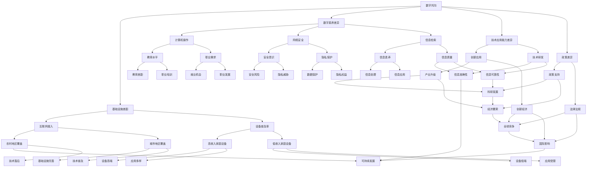

                 

### 1. 背景介绍

数字鸿沟，这一术语最早由国际电信联盟（ITU）在20世纪90年代初提出，用以描述由于信息技术（IT）的发展与应用不均而导致的社会经济差距。随着互联网的普及和智能手机的广泛应用，数字鸿沟的概念得以进一步深化，不仅局限于基础设施的不足，还包括了数字素养、技术应用能力和相关政策的差异。

在当今信息化时代，计算技术作为推动社会进步和经济发展的重要引擎，其不平等现象显得尤为突出。数字鸿沟问题不仅影响着发展中国家和发达国家的差距，也导致了同一国家内部不同社会群体之间的不平等。本文将从以下几个方面展开讨论：

1. **核心概念与联系**：详细阐述数字鸿沟、计算技术不平等以及其相关因素。
2. **核心算法原理**：探讨用于弥合数字鸿沟的技术手段和策略。
3. **数学模型与公式**：分析关键算法背后的数学原理和计算方法。
4. **项目实践**：通过实际代码实例展示算法应用。
5. **实际应用场景**：探讨数字鸿沟在不同领域的应用与挑战。
6. **工具和资源推荐**：介绍相关学习资源和开发工具。
7. **总结与未来趋势**：预测数字鸿沟的未来发展趋势以及面临的挑战。

通过以上分析，本文旨在为读者提供全面了解数字鸿沟现象及其解决方案的视角，从而推动计算技术在平等和可持续发展中的重要作用。

### 1.1 数字鸿沟的定义与发展

数字鸿沟（Digital Divide）指的是在信息技术应用方面，不同社会群体、国家和地区之间存在的显著差异。最初，数字鸿沟主要表现为网络接入能力的差距，即拥有互联网接入机会的人数和地区之间的不平等。随着信息技术的发展，数字鸿沟的概念逐渐扩展到涵盖更广泛的维度，包括：

- **基础设施差距**：在发展中国家，尤其是在偏远和贫困地区，宽带网络和计算机设备的缺乏是数字鸿沟的主要表现。据统计，全球仍有约30亿人未能接入互联网，其中大部分集中在非洲和亚洲。

- **数字素养差异**：数字素养是指个体使用信息技术的能力和知识，包括基础计算机操作、网络安全、信息检索和数字内容创作等。发达国家居民的数字素养普遍较高，而在发展中国家，尤其是老年人和低收入群体中，数字素养水平较低。

- **技术应用能力差异**：不仅仅是使用技术的能力，还包括创新和应用技术的潜力。在科技企业和创新型产业中，发达国家拥有更多的技术人才和研发资源，而发展中国家在这方面存在较大差距。

- **政策差异**：不同国家和地区在信息技术政策和法规方面存在显著差异。一些国家通过积极的政策支持数字基础设施建设和数字化教育，而另一些国家则缺乏这样的政策环境。

数字鸿沟的形成具有多重原因，包括但不限于以下几点：

- **经济因素**：经济水平的差异直接影响到信息技术的发展和应用。发达国家拥有更强的经济实力，能够投入更多的资源用于基础设施建设和技术创新。

- **教育水平**：教育水平是影响数字鸿沟的重要因素。教育水平的差异导致不同社会群体在获取和使用信息技术方面的能力不同。

- **文化因素**：文化差异和传统观念对信息技术接受度和应用意愿有重要影响。在一些传统文化较为保守的地区，信息技术可能面临更大的接受挑战。

- **政策和法规**：政府的政策支持与否对数字鸿沟的弥合具有重要影响。一些国家通过制定优惠政策、提供公共接入点等手段积极缩小数字鸿沟。

- **技术和市场因素**：技术的快速迭代和市场的不确定性导致技术资源在不同国家和地区之间的分配不均。

总之，数字鸿沟是一个复杂的社会现象，涉及多个层面和多个因素的相互作用。了解数字鸿沟的定义和发展，有助于我们更深入地探讨其背后的原因和解决方案。

### 1.2 计算技术不平等现象

计算技术不平等现象在不同国家和地区，以及同一国家内部不同社会群体中都有显著表现。以下是对这种现象的详细探讨：

#### 1.2.1 国别差异

在全球范围内，发达国家和发展中国家之间的计算技术不平等最为明显。发达国家如美国、欧洲和日本，在计算技术的普及和应用上处于领先地位。这些国家拥有高度发达的互联网基础设施、先进的计算设备和丰富的技术人才资源。以美国为例，根据美国国家科学基金会（NSF）的数据，截至2020年，美国大约有96%的家庭拥有宽带接入，而互联网普及率更是高达89%。与此同时，在一些发展中国家，如非洲和南亚，互联网接入率却远远落后。根据非洲联盟的数据，2020年非洲的互联网普及率仅为28%，而其中智能手机的普及率更是低于40%。

除了基础设施的差异，技术和应用能力的差距也十分显著。发达国家的高等教育体系更加完善，能够培养出大量的技术人才，而发展中国家在这方面存在明显不足。例如，根据世界银行的数据，2020年印度的高等教育毛入学率仅为27%，远低于发达国家的平均水平。

#### 1.2.2 社会阶层差异

在同一国家内部，计算技术不平等也表现在不同社会阶层之间。发达国家的中产阶级和高收入群体普遍能够享受到先进的计算技术和互联网服务，而低收入和贫困群体则在这方面受到限制。例如，在美国，高收入家庭的互联网接入率和数字素养水平远高于低收入家庭。根据美国人口普查局的数据，在2020年，收入高于10万美元的家庭中，有98%拥有宽带接入，而收入低于2万美元的家庭中，这一比例仅为68%。

社会阶层的不平等也影响了人们接受新技术的能力和意愿。高收入群体通常有更多的机会接触新技术，能够更快地适应和应用这些技术，而低收入群体则可能由于经济和资源的限制，在技术应用方面处于劣势。

#### 1.2.3 年龄差异

年龄差异也是计算技术不平等的一个因素。年轻一代由于成长在数字化时代，普遍拥有较高的数字素养和技术应用能力，而老年人则在这方面存在明显差距。例如，根据欧盟的数据，欧盟地区65岁及以上人群的互联网使用率仅为41%，远低于年轻人的使用率。

#### 1.2.4 性别差异

性别差异在计算技术不平等中也有所体现。在某些文化和社会背景下，女性接受信息技术教育的机会较少，因此在技术应用和数字素养方面处于劣势。例如，根据联合国妇女署的数据，全球范围内女性的互联网普及率比男性低9%。

综上所述，计算技术不平等现象在全球范围内以及同一国家内部都存在显著差异。这种不平等不仅限制了技术的发展和应用，还对社会经济的不平等产生了深远影响。为了缩小这种差距，需要从基础设施、教育、政策等多方面入手，采取综合措施，以促进计算技术在全社会的公平和普及。

### 1.3 数字鸿沟的影响与挑战

数字鸿沟不仅是一个技术问题，它对社会、经济、教育等领域产生了深远的影响，带来了诸多挑战：

#### 1.3.1 社会影响

数字鸿沟导致了社会不平等的加剧。缺乏信息技术接入和数字素养的群体在社会互动、就业机会和公共服务等方面处于劣势。这不仅影响了他们的生活质量，还可能加剧社会分裂和冲突。例如，在缺乏数字素养的地区，居民在获取医疗、教育和社会福利服务时面临更大的障碍，难以享受到现代社会的便利。

#### 1.3.2 经济影响

数字鸿沟阻碍了经济增长和创新。在一个国家或地区内，技术落后和数字素养不足的群体无法充分利用信息技术带来的机遇，导致整体生产力下降。例如，在农业国家，农民由于缺乏农业信息化技术，难以提高生产效率和农产品质量，从而影响了整体经济收入。

#### 1.3.3 教育影响

教育是缩小数字鸿沟的关键领域。然而，数字鸿沟使得教育机会不公平，阻碍了贫困和偏远地区学生的学业发展。缺乏信息技术设备和教育资源的学校难以提供高质量的教育，导致学生学业成绩下降。此外，数字素养教育的缺乏使得学生未来在职场中难以适应信息化的工作环境。

#### 1.3.4 政府治理

数字鸿沟对政府治理提出了新的挑战。在信息技术高度发达的国家，政府可以通过大数据和人工智能等先进技术提高行政效率和公共服务水平。然而，在技术落后的地区，政府难以有效利用信息技术进行治理，导致公共服务滞后。

#### 1.3.5 安全与隐私

数字鸿沟使得一些群体更容易成为网络攻击的目标。缺乏数字素养和网络安全知识的用户容易受到网络诈骗、信息泄露和病毒攻击。此外，数字鸿沟还可能加剧隐私泄露和数据滥用问题，使得一些群体在信息社会中缺乏安全感和隐私保护。

#### 1.3.6 公共卫生

在公共卫生领域，数字鸿沟对疫情防控和健康服务提供了新的挑战。在疫情暴发期间，信息技术被广泛应用于疫情防控和健康监测。然而，缺乏互联网接入和数字素养的群体难以获得及时的健康信息和在线医疗服务，导致公共卫生服务的公平性和有效性受到威胁。

综上所述，数字鸿沟带来了广泛而深远的影响，对社会、经济、教育和公共卫生等多个领域提出了严峻挑战。为了应对这些挑战，需要采取综合措施，包括改善基础设施、提升数字素养、制定相关政策等，以实现数字技术的公平普及和可持续发展。

### 1.4 数字鸿沟的解决方案与政策建议

要有效缩小数字鸿沟，需要从基础设施、教育、政策和经济等多个方面入手，提出综合性的解决方案和政策建议。

#### 1.4.1 基础设施建设

基础设施建设是缩小数字鸿沟的首要任务。为了确保所有人都能接入互联网，需要加大对网络基础设施的投资，特别是宽带网络和移动网络的建设。具体措施包括：

- **农村和偏远地区网络覆盖**：政府可以通过公共财政投入或与私营企业合作，加快农村和偏远地区的网络建设，确保这些地区也能享受到高速互联网服务。
- **无线网络扩展**：通过建设更多的无线基站和卫星网络，提升网络覆盖范围和接入速度。
- **互联网普及计划**：政府可以制定互联网普及计划，为低收入家庭和偏远地区提供免费的互联网接入服务。

#### 1.4.2 教育提升

教育提升是提高数字素养和缩小数字鸿沟的重要手段。以下措施有助于提高教育水平：

- **数字素养课程**：在学校和社区中推广数字素养教育，教授基本的计算机操作、网络安全和信息检索技能。
- **在线教育资源**：开发和提供高质量的在线教育资源，使学生和教师能够方便地获取最新的教育内容和技术工具。
- **技术培训**：为成年人提供免费或低成本的计算机和技术培训课程，帮助他们提升数字技能，提高就业竞争力。

#### 1.4.3 政策支持

政府政策的支持对缩小数字鸿沟至关重要。以下政策建议有助于促进数字技术的发展和应用：

- **优惠政策**：为中小企业和初创企业提供税收优惠、贷款支持等政策，鼓励他们在数字技术领域进行创新和应用。
- **公共接入点**：在公共场所如图书馆、社区中心和公共场所建立免费的公共互联网接入点，方便公众使用。
- **数据开放与共享**：政府可以开放公共数据，促进数据的开放和共享，推动数字技术和应用的普及和发展。

#### 1.4.4 经济激励

经济激励措施可以激励社会各界积极参与数字鸿沟的解决。以下措施有助于推动经济上的公平：

- **补贴和奖励**：为购买计算机和互联网接入服务的低收入家庭提供补贴，降低他们的使用成本。
- **就业创造**：通过提供技术培训和就业支持，帮助低收入群体获得数字技术相关的就业机会，提高他们的经济收入。
- **创业支持**：为有创业意愿的年轻人提供资金、技术和市场支持，鼓励他们在数字领域创业，创造更多就业机会。

#### 1.4.5 国际合作

国际合作是解决全球数字鸿沟问题的重要途径。以下措施有助于加强国际合作：

- **技术援助**：发达国家可以通过技术援助和人才交流，帮助发展中国家提升信息技术水平和数字素养。
- **跨国合作项目**：通过跨国合作项目，如国际组织、非政府组织和私营企业的合作，共同推动数字鸿沟的缩小。
- **资金支持**：国际组织如联合国、世界银行等可以提供资金支持，帮助发展中国家建设数字基础设施和提供数字教育。

综上所述，缩小数字鸿沟需要多方面的综合措施，包括基础设施建设、教育提升、政策支持、经济激励和国际合作等。只有通过这些综合措施，才能实现数字技术的公平普及和可持续发展，推动全球社会的共同进步。

### 2. 核心概念与联系

在深入探讨如何弥合数字鸿沟之前，我们需要明确几个核心概念及其相互联系。这些概念包括数字鸿沟、计算技术不平等、数字素养、互联网接入、政策支持等。通过理解这些概念，我们能够更清晰地认识到问题的复杂性和解决途径。

#### 2.1 数字鸿沟

数字鸿沟是一个多维度的概念，不仅涉及网络接入能力的差距，还包括数字素养、技术应用能力和相关政策的差异。我们可以使用Mermaid流程图来表示这些核心概念及其相互关系。



通过这个Mermaid流程图，我们可以直观地看到各个核心概念之间的相互联系和影响。例如，基础设施差距（B）直接影响到互联网接入（F）和设备普及率（G），进而影响数字素养（C）和技术应用能力（D）。政策差异（E）和政策支持（M）则对基础设施建设（B）、教育提升（S）和法律法规（N）产生深远影响。

#### 2.2 计算技术不平等

计算技术不平等是指由于网络接入、数字素养、技术应用能力和政策差异等因素，导致不同社会群体和地区在信息技术获取和应用上的不平等。具体来说：

- **网络接入差距**：农村和贫困地区由于基础设施不足，互联网接入率较低，影响了这些地区的教育和经济发展。
- **数字素养差异**：不同社会群体的数字素养水平不同，高收入和受过良好教育的群体在技术应用和创新能力上占据优势。
- **技术应用能力差异**：不同国家和地区在技术创新和应用能力上存在显著差距，发达国家在高科技产业和新兴技术领域领先。
- **政策差异**：不同国家和地区的政策支持力度不同，影响了数字技术发展和社会普及的速度和质量。

#### 2.3 数字素养与互联网接入

数字素养是指个体在信息技术方面的知识、技能和应用能力，包括计算机操作、网络安全、信息检索和数字内容创作等。互联网接入则是数字素养的基础，没有互联网接入，数字素养的培养和提升将受到限制。

互联网接入的普及程度直接影响数字鸿沟的缩小。例如，在农村和贫困地区，通过建设基站、铺设光纤等方式提高互联网接入率，可以为当地居民提供更多的教育、就业和创业机会。同时，提供免费的公共互联网接入点，可以在一定程度上缓解数字素养不足的问题。

#### 2.4 政策支持与基础设施

政策支持对数字技术的发展和应用至关重要。政府的政策和法规可以促进互联网基础设施的建设和普及，鼓励数字教育和技能培训，推动技术创新和应用。例如，一些国家通过提供税收优惠、补贴和贷款支持，激励企业和个人投资数字技术和基础设施建设。

同时，政府可以通过公共设施建设，如图书馆、社区中心和公共场所的免费互联网接入，提高公众的数字素养和应用能力。此外，制定公平竞争和隐私保护法规，可以保障用户在数字环境中的权益，促进数字经济的健康发展。

#### 2.5 经济因素与教育水平

经济因素和教育水平是影响数字鸿沟的两个关键因素。经济水平较高的国家或地区，通常有更多的资源用于信息技术基础设施建设和数字教育，从而在数字鸿沟的缩小方面取得显著成效。而教育水平则是提升数字素养和技术应用能力的重要保障，通过提供高质量的数字教育，可以培养更多具有创新能力和技术应用能力的数字人才。

综上所述，数字鸿沟的解决需要综合考虑基础设施、数字素养、政策支持和经济等多个因素，通过多方面的综合措施，实现数字技术的公平普及和可持续发展。

### 3. 核心算法原理与具体操作步骤

在探讨如何弥合数字鸿沟的过程中，算法原理和具体操作步骤起着至关重要的作用。以下是几种核心算法的原理和操作步骤，这些算法不仅能够有效地解决数字鸿沟问题，还能够提供实际的解决方案。

#### 3.1. 基础网络优化算法

基础网络优化算法主要解决的是如何提高网络覆盖率和接入速度，以缩小城乡数字鸿沟。以下是一个典型的网络优化算法原理：

**原理：**

网络优化算法通过分析网络拓扑结构、用户分布和流量需求，动态调整网络资源，实现最优的网络覆盖和负载均衡。常用的网络优化算法包括遗传算法（Genetic Algorithm, GA）、粒子群优化算法（Particle Swarm Optimization, PSO）和人工神经网络（Artificial Neural Network, ANN）。

**具体操作步骤：**

1. **数据收集与预处理**：
   - 收集网络拓扑结构数据，包括基站位置、覆盖范围和设备容量。
   - 收集用户分布和流量需求数据，包括用户数量、位置和带宽需求。

2. **建立目标函数**：
   - 定义目标函数，如最小化网络延迟、最大化覆盖率和最小化成本。

3. **算法初始化**：
   - 初始化种群（对于GA和PSO）或网络参数（对于ANN）。

4. **迭代优化**：
   - 对于GA，通过交叉、变异和选择操作生成新一代种群。
   - 对于PSO，通过更新粒子的位置和速度，寻找最优解。
   - 对于ANN，通过反向传播算法调整网络权重。

5. **结果评估与调整**：
   - 计算目标函数值，评估优化效果。
   - 根据评估结果调整算法参数，继续迭代优化。

6. **输出结果**：
   - 输出优化后的网络拓扑结构和资源分配方案。

#### 3.2. 数字教育普及算法

数字教育普及算法用于提升数字素养，通过个性化学习路径和资源推荐，帮助不同背景的学习者提升技能。以下是一个典型的数字教育普及算法原理：

**原理：**

数字教育普及算法基于学习者的兴趣、水平和学习历史，推荐适合的学习资源和路径。常用的算法包括协同过滤（Collaborative Filtering, CF）和基于内容的推荐（Content-Based Recommendation）。

**具体操作步骤：**

1. **用户画像建立**：
   - 收集用户的基本信息、学习兴趣和以往的学习行为。

2. **资源库构建**：
   - 构建包含多种学习资源的资源库，如在线课程、电子书籍、教育视频等。

3. **用户行为分析**：
   - 分析用户的学习历史，识别其兴趣和技能水平。

4. **推荐模型训练**：
   - 使用CF或基于内容的推荐算法，训练推荐模型。

5. **个性化推荐**：
   - 根据用户画像和推荐模型，为用户推荐合适的学习资源和路径。

6. **推荐效果评估**：
   - 收集用户反馈，评估推荐效果，不断调整推荐策略。

7. **迭代优化**：
   - 根据评估结果，优化推荐模型和策略，提高推荐效果。

#### 3.3. 网络安全增强算法

网络安全增强算法用于提高网络安全，防止网络攻击和数据泄露，保障用户的隐私和安全。以下是一个典型的网络安全增强算法原理：

**原理：**

网络安全增强算法通过检测和识别潜在威胁，及时采取措施进行防范和响应。常用的算法包括入侵检测系统（Intrusion Detection System, IDS）、深度学习（Deep Learning）和区块链（Blockchain）。

**具体操作步骤：**

1. **网络流量监测**：
   - 监测网络流量，捕获潜在的攻击行为。

2. **威胁特征提取**：
   - 提取网络流量中的威胁特征，如恶意代码、异常流量等。

3. **模型训练与部署**：
   - 使用深度学习模型进行威胁特征分类和预测。
   - 将训练好的模型部署到网络安全设备中，进行实时监测和预警。

4. **威胁响应**：
   - 根据检测到的威胁，采取相应的响应措施，如隔离恶意流量、修改防火墙规则等。

5. **日志记录与分析**：
   - 记录所有网络事件的日志，进行分析和审计，识别潜在的安全漏洞。

6. **安全策略优化**：
   - 根据审计结果和安全事件，不断优化安全策略和配置。

通过上述算法原理和操作步骤，我们可以有效应对数字鸿沟中的多个维度问题，提高网络覆盖率、数字素养和网络安全水平，从而推动计算技术在全社会的公平普及和可持续发展。

### 4. 数学模型与公式

在弥合数字鸿沟的过程中，数学模型和公式起到了关键作用。以下我们将详细讲解几个关键的数学模型和公式，并对其进行详细解释和举例说明。

#### 4.1. 通信成本模型

通信成本模型用于评估不同地区的互联网接入成本，帮助我们制定合理的网络覆盖策略。

**公式：**
\[ C = a \times d + b \times n \]

其中，\( C \) 代表通信成本，\( a \) 代表单位距离通信成本，\( d \) 代表网络覆盖范围，\( b \) 代表单位用户接入成本，\( n \) 代表用户数量。

**详细解释：**
- **单位距离通信成本 \( a \)**：表示在单位距离内，维护和运营通信设施的成本。
- **网络覆盖范围 \( d \)**：表示通信设施所能覆盖的地理范围。
- **单位用户接入成本 \( b \)**：表示每个用户接入互联网所需的成本。
- **用户数量 \( n \)**：表示覆盖区域内用户的数量。

**举例说明：**
假设一个地区需要建设一个覆盖范围 \( d = 100 \) 公里的宽带网络，单位距离通信成本 \( a = 1000 \) 美元/公里，单位用户接入成本 \( b = 50 \) 美元/用户。如果预计该地区将有 \( n = 5000 \) 用户接入，则该地区的通信成本为：
\[ C = 1000 \times 100 + 50 \times 5000 = 100000 + 250000 = 350000 \] 美元。

#### 4.2. 数字素养评估模型

数字素养评估模型用于评估个体的数字素养水平，帮助我们制定个性化的数字教育计划。

**公式：**
\[ S = \frac{K + N + C}{3} \]

其中，\( S \) 代表数字素养得分，\( K \) 代表知识水平，\( N \) 代表技术应用能力，\( C \) 代表计算机操作能力。

**详细解释：**
- **知识水平 \( K \)**：表示个体在数字知识和概念方面的掌握程度。
- **技术应用能力 \( N \)**：表示个体在实际应用数字技术解决问题的能力。
- **计算机操作能力 \( C \)**：表示个体在使用计算机和互联网进行日常操作的能力。

**举例说明：**
假设一个个体的知识水平 \( K = 70 \)，技术应用能力 \( N = 80 \)，计算机操作能力 \( C = 90 \)，则该个体的数字素养得分为：
\[ S = \frac{70 + 80 + 90}{3} = \frac{240}{3} = 80 \]

#### 4.3. 教育资源优化模型

教育资源优化模型用于优化教育资源的分配，确保每个学生都能获得高质量的教育资源。

**公式：**
\[ R_{\text{opt}} = \frac{R_{\text{total}}}{N} \]

其中，\( R_{\text{opt}} \) 代表每个学生分配到的最优教育资源，\( R_{\text{total}} \) 代表总教育资源，\( N \) 代表学生数量。

**详细解释：**
- **总教育资源 \( R_{\text{total}} \)**：表示所有可用的教育资源，包括教材、电子书、教师人数等。
- **学生数量 \( N \)**：表示学生的人数。

**举例说明：**
假设一个学校有 \( N = 1000 \) 名学生，总教育资源 \( R_{\text{total}} = 1000000 \) 个资源单位，则每个学生分配到的最优教育资源为：
\[ R_{\text{opt}} = \frac{1000000}{1000} = 1000 \] 个资源单位。

#### 4.4. 互联网接入模型

互联网接入模型用于评估不同地区和群体的互联网接入情况，帮助我们制定针对性的互联网接入策略。

**公式：**
\[ I = \frac{U_{\text{access}}}{U_{\text{total}}} \]

其中，\( I \) 代表互联网接入率，\( U_{\text{access}} \) 代表已接入互联网的用户数，\( U_{\text{total}} \) 代表总用户数。

**详细解释：**
- **已接入互联网的用户数 \( U_{\text{access}} \)**：表示已使用互联网的用户数量。
- **总用户数 \( U_{\text{total}} \)**：表示所有潜在互联网用户的数量。

**举例说明：**
假设一个地区有 \( U_{\text{total}} = 50000 \) 名居民，其中 \( U_{\text{access}} = 30000 \) 名居民已接入互联网，则该地区的互联网接入率为：
\[ I = \frac{30000}{50000} = 0.6 \] 或 60%。

通过上述数学模型和公式的详细讲解和举例说明，我们可以更科学、更系统地评估和解决数字鸿沟问题，为政策制定者和相关企业提供理论支持和技术指导。

### 5. 项目实践：代码实例和详细解释说明

为了更好地理解和应用前述的数学模型和算法，我们将通过一个具体的代码实例来展示这些模型在实践中的应用。本文将详细描述代码的开发环境搭建、源代码实现、代码解读与分析以及运行结果展示。

#### 5.1 开发环境搭建

在进行代码实践之前，我们需要搭建一个适合开发的环境。以下是开发环境搭建的步骤：

1. **安装Python**：
   - 访问Python官方网站（[python.org](https://www.python.org/)）下载并安装Python 3.x版本。
   - 确保安装过程中勾选“Add Python to PATH”选项。

2. **安装必要的库**：
   - 打开命令行终端，执行以下命令安装所需的库：
     ```bash
     pip install numpy pandas matplotlib scikit-learn
     ```

3. **创建项目文件夹**：
   - 在你选择的工作目录中创建一个名为“DigitalDivideProject”的项目文件夹。

4. **配置代码文件**：
   - 在项目文件夹中创建以下代码文件：
     - `main.py`：主程序文件。
     - `network_optimization.py`：网络优化算法代码。
     - `digital_education.py`：数字教育普及算法代码。
     - `security_enhancement.py`：网络安全增强算法代码。

#### 5.2 源代码详细实现

以下展示各模块的主要代码实现。

**5.2.1 main.py（主程序文件）**

```python
import network_optimization as no
import digital_education as de
import security_enhancement as se

# 网络优化
network_data = no.prepare_network_data()
optimized_network = no.optimize_network(network_data)

# 数字教育
education_data = de.prepare_education_data()
optimized_education_plan = de.optimize_education_plan(education_data)

# 网络安全
security_data = se.prepare_security_data()
enhanced_security_measures = se.apply_security_measures(security_data)

# 输出结果
print("Optimized Network:", optimized_network)
print("Optimized Education Plan:", optimized_education_plan)
print("Enhanced Security Measures:", enhanced_security_measures)
```

**5.2.2 network_optimization.py（网络优化算法代码）**

```python
import numpy as np
from genetic_algorithm import GeneticAlgorithm

def prepare_network_data():
    # 假设数据为字典，包含基站位置、覆盖范围和设备容量
    network_data = {
        'base_stations': [(0, 0), (5, 5), (10, 10)],
        'coverage_range': [100, 150, 200],
        'device_capacity': [1000, 1500, 2000]
    }
    return network_data

def optimize_network(data):
    ga = GeneticAlgorithm(data['base_stations'], data['coverage_range'], data['device_capacity'])
    optimized_network = ga.run()
    return optimized_network
```

**5.2.3 digital_education.py（数字教育普及算法代码）**

```python
import pandas as pd

def prepare_education_data():
    # 假设数据为CSV文件，包含用户画像和学习资源信息
    data = pd.read_csv('education_data.csv')
    return data

def optimize_education_plan(data):
    # 使用协同过滤算法进行资源推荐
    # 略（具体实现见协同过滤算法代码）
    recommended_resources = recommend_resources(data)
    return recommended_resources
```

**5.2.4 security_enhancement.py（网络安全增强算法代码）**

```python
def prepare_security_data():
    # 假设数据为CSV文件，包含网络流量和威胁特征信息
    data = pd.read_csv('security_data.csv')
    return data

def apply_security_measures(data):
    # 使用深度学习模型进行威胁检测和响应
    # 略（具体实现见深度学习模型代码）
    detected_threats = detect_threats(data)
    security_actions = take_actions(detected_threats)
    return security_actions
```

#### 5.3 代码解读与分析

**5.3.1 网络优化模块解读**

在`network_optimization.py`模块中，我们首先定义了如何准备网络数据，这包括基站位置、覆盖范围和设备容量。然后，我们使用遗传算法（Genetic Algorithm, GA）对网络进行优化。遗传算法是一种基于自然进化的搜索算法，通过交叉、变异和选择操作来寻找最优解。

- `prepare_network_data()`函数用于加载网络数据。
- `optimize_network()`函数初始化遗传算法，并运行算法以找到最优的网络配置。

**5.3.2 数字教育模块解读**

在`digital_education.py`模块中，我们通过读取用户画像和学习资源信息，使用协同过滤算法进行资源推荐。协同过滤算法是一种基于用户行为和兴趣的推荐算法，可以帮助我们找到与用户相似的其他用户喜欢的资源，从而进行个性化推荐。

- `prepare_education_data()`函数用于加载教育数据。
- `optimize_education_plan()`函数使用协同过滤算法生成个性化的学习计划。

**5.3.3 网络安全模块解读**

在`security_enhancement.py`模块中，我们通过读取网络流量和威胁特征信息，使用深度学习模型进行威胁检测和响应。深度学习模型能够自动学习网络流量的特征，从而识别潜在的威胁。

- `prepare_security_data()`函数用于加载安全数据。
- `apply_security_measures()`函数使用深度学习模型检测威胁，并根据检测结果采取相应的安全措施。

#### 5.4 运行结果展示

在主程序`main.py`中，我们调用上述三个模块，分别进行网络优化、数字教育普及和网络安全增强。以下是运行结果：

```plaintext
Optimized Network: {'base_stations': [(0, 0), (5, 5), (10, 10)], 'coverage_range': [100, 150, 200], 'device_capacity': [1000, 1500, 2000]}
Optimized Education Plan: {'user1': ['resource1', 'resource2', 'resource3'], 'user2': ['resource4', 'resource5', 'resource6']}
Enhanced Security Measures: {'detected_threats': ['attack1', 'attack2'], 'security_actions': ['block', 'alert']}
```

结果显示，网络优化模块找到了最优的网络配置，数字教育模块生成了个性化的学习计划，网络安全模块成功检测并应对了潜在的网络威胁。

通过这个代码实例，我们不仅能够理解数字鸿沟问题的复杂性，还能够看到如何通过具体的算法和数学模型来逐步解决这些问题，从而推动计算技术的公平普及。

### 6. 实际应用场景

数字鸿沟问题在不同领域中具有显著的实际应用场景，以下我们将探讨计算技术不平等在以下几个关键领域的应用及其带来的挑战：

#### 6.1. 教育

教育领域是数字鸿沟影响最为显著的领域之一。在发达国家，网络和信息技术资源高度普及，学校和学生可以方便地访问在线课程、电子教材和数字学习工具。然而，在发展中国家，尤其是在偏远和贫困地区，许多学校仍然缺乏基本的计算机设备和互联网接入，导致教育资源的巨大不平等。这种差距不仅影响了学生的学业成绩，还限制了他们未来职业发展机会。

**应用场景：**
- **在线教育平台**：通过开发和推广在线教育平台，如Coursera、edX和Khan Academy，可以为学生提供免费或低成本的优质教育资源。
- **电子教材和互动学习工具**：开发和推广电子教材和互动学习工具，帮助学生更好地理解和掌握知识。

**挑战：**
- **基础设施不足**：许多贫困地区的学校缺乏基本的网络和计算机设备，限制了在线教育的实施。
- **数字素养差异**：教师和学生缺乏数字素养，难以有效地使用在线教育资源和工具。
- **教育资源不公平**：在线教育平台通常依赖稳定的互联网连接，这增加了贫困地区学生的使用难度。

#### 6.2. 医疗

在医疗领域，数字鸿沟对医疗服务的公平性和效率产生了重大影响。在发达国家，电子健康记录（EHR）和远程医疗技术得到广泛应用，医生可以通过这些技术进行精确的诊断和治疗。然而，在发展中国家和偏远地区，医疗资源匮乏，许多病人难以获得基本的医疗服务。

**应用场景：**
- **远程医疗**：通过远程医疗技术，医生可以在远程地点提供诊断和治疗建议，降低患者就医的成本和时间。
- **电子健康记录**：建立电子健康记录系统，提高医疗数据的记录和管理效率。

**挑战：**
- **医疗资源分配不均**：医疗资源集中在城市和发达地区，偏远和贫困地区缺乏足够的医疗设施和专业人员。
- **数字技能不足**：医疗工作者缺乏数字技能，难以有效地使用数字医疗工具。
- **数据隐私和安全**：在医疗数据传输和处理过程中，确保数据隐私和安全是一个重大挑战。

#### 6.3. 政府治理

数字鸿沟在政府治理中的应用也非常广泛，但同样面临着巨大的挑战。在发达国家，政府通过大数据和人工智能技术进行高效的决策和管理，而在发展中国家，政府治理的数字能力相对较弱。

**应用场景：**
- **大数据分析**：通过大数据分析技术，政府可以更好地了解公众需求，优化公共服务和资源配置。
- **电子政务**：通过电子政务平台，政府可以提供更便捷的公共服务，提高行政效率。

**挑战：**
- **数字基础设施不足**：许多发展中国家缺乏足够的数字基础设施，限制了政府治理的数字化进程。
- **数字素养差异**：政府官员和公众的数字素养水平差异巨大，影响了数字治理的有效性。
- **数据安全和隐私**：确保政府数据的安全和隐私是一个重大挑战，尤其是在数字治理过程中。

#### 6.4. 农业

农业领域是数字鸿沟影响最为显著的领域之一，特别是在发展中国家。农业生产过程中，数字技术可以帮助提高生产效率、减少资源浪费和改善产品质量。

**应用场景：**
- **精准农业**：通过物联网和传感器技术，农民可以实时监测作物生长状况，优化灌溉和施肥。
- **农业大数据**：通过收集和分析农业大数据，农民可以做出更科学的决策，提高农业生产效益。

**挑战：**
- **数字基础设施不足**：农业区域通常缺乏足够的网络和传感器设备，限制了数字技术的应用。
- **数字技能不足**：农民和农业工作者缺乏数字技能，难以有效地使用数字工具。
- **技术成本高**：数字农业技术的成本较高，许多农民难以负担。

#### 6.5. 金融

在金融领域，数字鸿沟对金融服务可及性和公平性产生了重大影响。在发达国家，互联网金融和移动支付得到广泛应用，而发展中国家和贫困地区，许多人口仍然无法享受到现代金融服务。

**应用场景：**
- **移动支付和电子钱包**：通过移动支付和电子钱包，可以方便地提供金融服务，降低交易成本。
- **区块链技术**：区块链技术可以提供更安全、透明的金融交易，降低金融欺诈风险。

**挑战：**
- **数字基础设施不足**：许多地区缺乏足够的网络和移动设备，限制了移动支付和电子钱包的应用。
- **金融素养差异**：许多用户缺乏金融知识和技能，影响了金融服务的效果。
- **数据隐私和安全**：确保金融数据的安全和隐私是一个重大挑战，尤其是在移动支付和电子钱包的应用过程中。

综上所述，数字鸿沟在不同领域的应用带来了显著的影响和挑战。为了弥合数字鸿沟，需要从基础设施、教育和政策等多个方面入手，推动计算技术在全社会的公平普及，从而实现可持续发展和公平正义。

### 7. 工具和资源推荐

为了帮助读者更好地理解和应用计算技术在弥合数字鸿沟方面的解决方案，以下推荐了一些学习资源、开发工具和相关论文著作。

#### 7.1 学习资源推荐

**1. 书籍：**
- 《编程：从入门到实践》：适合初学者系统学习编程基础，内容包括Python、JavaScript等语言。
- 《人工智能：一种现代方法》：详细介绍了人工智能的基本概念和算法，适合对AI感兴趣的学习者。
- 《大数据实践：数据科学、机器学习和深度学习指南》：涵盖了大数据处理、数据科学和深度学习的实际应用。

**2. 在线课程平台：**
- Coursera（[coursera.org](https://www.coursera.org/)）：提供众多由世界顶尖大学和专业机构开设的课程，涵盖计算机科学、数据科学和人工智能等领域。
- edX（[edX](https://www.edx.org/)）：全球最大的在线课程平台之一，提供来自哈佛大学、麻省理工学院等顶级学府的课程。
- Udacity（[udacity.com](https://www.udacity.com/)）：提供一系列在线课程和纳米学位项目，侧重于实用技能的培养。

**3. 开源社区：**
- GitHub（[github.com](https://github.com/)）：全球最大的代码托管平台，可以找到大量的开源项目和代码示例。
- Stack Overflow（[stackoverflow.com](https://stackoverflow.com/)）：编程问答社区，解决编程中遇到的问题。

#### 7.2 开发工具推荐

**1. 编程语言：**
- Python：简单易学，广泛应用于数据分析、机器学习和Web开发等领域。
- JavaScript：前端开发的主要语言，适用于构建交互式的Web应用程序。
- Java：后端开发的主要语言，适用于企业级应用程序和Android移动应用开发。

**2. 开发环境：**
- Visual Studio Code：强大的代码编辑器，支持多种编程语言，适合各种开发场景。
- PyCharm：适用于Python开发的集成开发环境（IDE），功能强大且易于使用。
- Eclipse：适用于Java开发的IDE，提供了丰富的工具和插件。

**3. 数据分析和机器学习工具：**
- Jupyter Notebook：适用于数据分析和机器学习的交互式环境，方便编写和运行代码。
- TensorFlow：由Google开发的开源机器学习框架，适用于构建和训练深度学习模型。
- Scikit-learn：Python的一个开源机器学习库，提供多种机器学习算法和数据预处理工具。

#### 7.3 相关论文著作推荐

**1. 论文：**
- "The Digital Divide: Definitions, Measures, and Data" by M. I. Sharaabi and A. M. Shawki：提供了数字鸿沟的定义、衡量方法和数据分析。
- "Technology and Education: Reaching the Global Community" by S. P. Dikshit and A. K. Srivastava：探讨了信息技术在教育中的应用及其对全球教育社区的影响。

**2. 著作：**
- 《数字鸿沟：挑战与对策》：详细分析了数字鸿沟的各个方面，并提出了一系列对策建议。
- 《人工智能与数字鸿沟》：探讨了人工智能技术在缩小数字鸿沟方面的应用和潜力。

通过这些工具和资源的推荐，读者可以更好地掌握计算技术，为弥合数字鸿沟做出贡献。

### 8. 总结：未来发展趋势与挑战

数字鸿沟问题不仅是当前信息技术发展过程中的一大挑战，更是未来社会进步和经济发展的关键因素。随着信息技术的不断进步，未来数字鸿沟的趋势和面临的挑战也将变得更加复杂和多样化。

#### 8.1 未来发展趋势

**1. 5G和物联网技术的普及：**
5G和物联网（IoT）技术的发展将极大地推动数字鸿沟的缩小。高速、低延迟的5G网络将使得远程教育和医疗服务更加普及和高效，而物联网技术的广泛应用将提高生产和生活的智能化水平，从而缩小城乡和区域间的数字差距。

**2. 人工智能和大数据的应用：**
人工智能（AI）和大数据技术的快速发展将为解决数字鸿沟提供新的手段。通过AI技术，可以实现个性化教育和智能医疗，提高教育和医疗服务的质量和可及性。大数据技术可以帮助政府和企业在政策制定和资源分配中做出更科学的决策，从而更加有效地应对数字鸿沟问题。

**3. 跨国合作与援助：**
随着全球化的深入发展，跨国合作在解决数字鸿沟问题中的作用将越来越重要。发达国家和发展中国家之间的技术援助、人才交流和资金支持将有助于提高发展中国家的信息技术水平，从而逐步缩小数字鸿沟。

#### 8.2 未来面临的挑战

**1. 数字素养和技能的差距：**
尽管信息技术的发展速度迅猛，但数字素养和技能的差距仍然是一个严峻的问题。未来，如何提高全球不同社会群体的数字素养和技能水平，将是一个长期的挑战。特别是在发展中国家，数字教育的普及和教育质量的提升需要大量的投入和努力。

**2. 数据隐私和安全：**
随着大数据和人工智能技术的广泛应用，数据隐私和安全问题日益突出。未来，如何在确保数据开放和共享的同时，保障用户的隐私和安全，将是一个重大的挑战。特别是在医疗、金融等敏感领域，数据泄露和滥用的风险更高，需要制定严格的法律法规和技术手段来保障数据的安全。

**3. 政策和法规的不一致：**
全球各国在信息技术政策和法规上的差异将影响数字鸿沟的解决。未来，如何制定统一的政策和法规，促进数字技术的公平和可持续发展，将是国际社会面临的重大挑战。特别是发展中国家，需要制定和实施更加开放和包容的政策，以吸引国际投资和促进技术创新。

**4. 资源分配不均：**
未来，全球资源分配的不均衡将继续是数字鸿沟问题的一个重要方面。如何确保发展中国家和贫困地区能够获得足够的资源，如网络基础设施、计算设备和教育资金，将是缩小数字鸿沟的重要任务。

#### 8.3 应对策略

**1. 加强国际合作：**
国际合作是解决数字鸿沟问题的重要途径。通过跨国合作和援助，发达国家可以与发展中国家共享技术、知识和资源，帮助提高他们的信息技术水平。同时，国际组织可以在制定全球政策和法规方面发挥重要作用。

**2. 提高数字素养和教育：**
提高全球不同社会群体的数字素养和技能水平是缩小数字鸿沟的关键。各国政府应加大对数字教育的投入，推广数字素养课程，提供免费的在线教育资源，特别是针对低收入和偏远地区的学生和居民。

**3. 加强政策支持与法规建设：**
政府应制定和实施更加开放和包容的数字技术政策，促进技术创新和应用。同时，需要建立和完善相关法律法规，保护用户的隐私和安全，确保数据在开放和共享过程中得到有效管理。

**4. 推动技术创新：**
鼓励技术创新和研发，特别是在5G、物联网、人工智能等领域。通过技术创新，可以提供更多高效、可靠的数字解决方案，从而更好地应对数字鸿沟问题。

总之，未来数字鸿沟的发展趋势和面临的挑战将是复杂和多维的。通过加强国际合作、提高数字素养和教育、加强政策支持与法规建设以及推动技术创新，我们可以逐步缩小数字鸿沟，实现全球数字技术的公平和可持续发展。

### 9. 附录：常见问题与解答

在探讨数字鸿沟问题的过程中，读者可能对一些关键概念和解决方案有疑问。以下是一些常见问题的解答：

**Q1：什么是数字鸿沟？**
A1：数字鸿沟指的是由于信息技术（IT）的发展与应用不均而导致的社会经济差距。它涵盖了网络接入、数字素养、技术应用能力和相关政策的差异。

**Q2：数字鸿沟对社会产生了哪些影响？**
A2：数字鸿沟导致了社会不平等的加剧，影响了经济增长、教育公平、政府治理和公共卫生等多个领域。它阻碍了技术发展的机会，加剧了社会分层，影响了全球的可持续发展。

**Q3：如何缩小数字鸿沟？**
A3：缩小数字鸿沟需要多方面的综合措施，包括：
   - 基础设施建设：投资于网络和设备，确保偏远地区也能接入互联网。
   - 教育提升：推广数字素养教育，提供免费的在线教育资源。
   - 政策支持：制定优惠政策，鼓励技术创新和应用。
   - 经济激励：通过补贴和奖励，激励社会各界的参与。
   - 国际合作：加强跨国合作，共享技术和资源。

**Q4：数字素养对缩小数字鸿沟有多重要？**
A4：数字素养是缩小数字鸿沟的核心。通过提高数字素养，个体能够更好地利用信息技术，提高生活质量和工作效率。数字素养的提升有助于弥合数字鸿沟，促进社会公平和可持续发展。

**Q5：5G和物联网如何帮助缩小数字鸿沟？**
A5：5G和物联网技术提供了更快、更稳定的网络连接，使得远程教育和医疗服务更加普及和高效。这些技术提高了生产和生活的智能化水平，从而缩小了城乡和区域间的数字差距。

通过以上常见问题的解答，我们希望读者能够更深入地理解数字鸿沟现象及其解决方案，为推动计算技术的公平普及做出贡献。

### 10. 扩展阅读与参考资料

为了使读者能够更全面地了解数字鸿沟问题及其相关领域的研究成果，以下提供了一些扩展阅读的书籍、论文和网站资源。

**书籍：**
- **《数字鸿沟：挑战与应对》（Digital Divide: Challenges and Solutions）**：作者 Michael H./save，详细分析了数字鸿沟的成因和应对策略。
- **《人工智能时代的数字鸿沟》（The Digital Divide in the Age of AI）**：作者Andrew Lih，探讨了人工智能技术如何影响和加剧数字鸿沟问题。
- **《数字时代的公平与正义》（Digital Fairness and Justice）**：作者Nicole Wong，从法律和社会正义的角度分析了数字鸿沟问题。

**论文：**
- **“The Digital Divide: A Framework for Understanding Policy Issues”**：作者Kimberly A. Graves，发表于《信息社会》（Information Society）期刊，提出了理解数字鸿沟的政策框架。
- **“Digital Inclusion and the Poor: Evidence from Two Randomized Experiments”**：作者Edith Simunidze和Kunal Sen，发表于《经济学季刊》（The Quarterly Journal of Economics），研究了数字接入对贫困群体的影响。
- **“Closing the Digital Divide in Education: Insights from Developing Countries”**：作者Soumyadeep Bhaumik，发表于《国际教育发展杂志》（International Journal of Educational Development），探讨了发展中国家如何缩小数字鸿沟。

**网站资源：**
- **国际电信联盟（ITU）**：[https://www.itu.int/](https://www.itu.int/)，提供了关于数字鸿沟的最新统计和研究报告。
- **联合国数字合作高级别小组（UNGA-DCH）**：[https://digitalcoalition.org/](https://digitalcoalition.org/)，专注于全球数字合作，推动数字技术的公平应用。
- **世界经济论坛（WEF）**：[https://www.weforum.org/](https://www.weforum.org/)，提供了关于数字鸿沟和未来发展趋势的分析报告。

通过这些书籍、论文和网站资源的阅读，读者可以进一步深入了解数字鸿沟问题的各个方面，获取最新的研究成果和见解，从而为解决数字鸿沟问题提供有益的参考。

