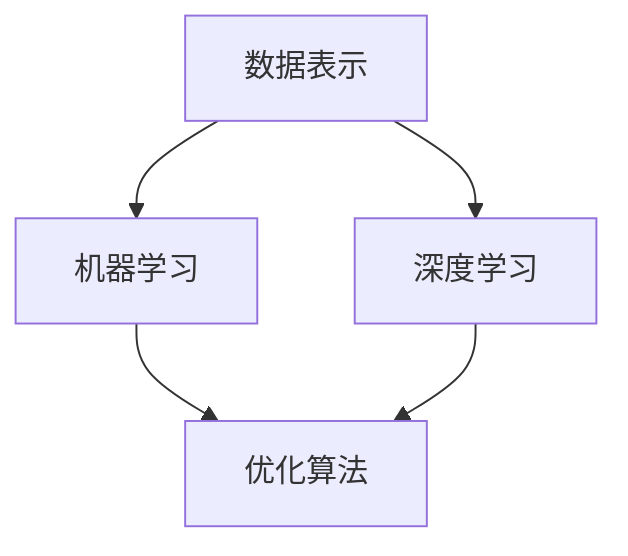

                 

在当今快速发展的科技时代，人工智能（AI）已经深入到我们生活的方方面面，从智能手机的语音助手，到自动驾驶汽车，再到复杂的数据分析和预测模型，AI技术的应用无处不在。数学模型作为AI发展的基石，扮演着至关重要的角色。本文将探讨数学模型在AI中的应用，解析其核心概念、算法原理、实践案例以及未来展望。

> 关键词：数学模型，人工智能，算法，数据分析，机器学习，深度学习

> 摘要：本文旨在深入探讨数学模型在人工智能领域的应用，分析其基本概念、核心算法原理，并通过实际案例展示数学模型如何驱动AI技术的发展。同时，文章还将讨论数学模型在实际应用场景中的挑战与未来趋势。

## 1. 背景介绍

人工智能（AI）是一门多学科交叉的领域，旨在通过模拟人类智能行为，使计算机具备感知、学习、推理和决策的能力。自20世纪50年代以来，AI经历了多次热潮和低谷，但如今随着计算能力的提升和大数据的普及，AI技术正以前所未有的速度发展。而数学模型作为AI算法的核心，提供了理论基础和实现路径。

数学模型是一种用数学语言描述现实世界问题的方法，它通过建立数学公式或算法来模拟和解决问题。在AI领域，数学模型广泛应用于数据预处理、特征提取、模型训练、预测评估等多个环节。例如，线性代数在数据处理中用于矩阵运算，微积分在优化算法中用于寻找最优解，概率论和统计学则在模型评估和不确定性分析中发挥重要作用。

## 2. 核心概念与联系

### 2.1 核心概念

在探讨数学模型在AI中的应用之前，我们需要了解一些核心概念：

- **数据表示**：数据是AI的基础，如何有效地表示数据对于算法的性能至关重要。常用的数据表示方法包括向量、矩阵和图表。
- **机器学习**：一种基于数据训练模型的方法，通过学习输入和输出之间的关系，模型能够对未知数据进行预测或分类。
- **深度学习**：一种特殊的机器学习方法，使用多层神经网络来学习数据的高层次抽象特征。
- **优化算法**：用于寻找函数最优解的算法，如梯度下降、随机梯度下降等。

### 2.2 架构的 Mermaid 流程图



在这个流程图中，数据表示是整个流程的起点，它为后续的机器学习和深度学习提供输入。机器学习作为核心方法，依赖于数据表示和优化算法，而深度学习则是在机器学习基础上的进一步发展，通过多层神经网络来提取数据特征。

## 3. 核心算法原理 & 具体操作步骤

### 3.1 算法原理概述

在AI领域中，常见的数学模型包括线性回归、逻辑回归、支持向量机、神经网络等。以下是对这些算法的基本原理概述：

- **线性回归**：用于预测连续值，通过拟合线性模型来预测目标变量。
- **逻辑回归**：用于预测概率，通过拟合逻辑模型来预测二分类结果。
- **支持向量机**：通过最大化分类间隔来分离数据。
- **神经网络**：通过多层神经元的非线性组合来提取数据特征。

### 3.2 算法步骤详解

以下是神经网络（深度学习）的基本步骤：

1. **初始化参数**：随机初始化网络的权重和偏置。
2. **前向传播**：输入数据通过网络，每个神经元计算其输出值。
3. **损失函数计算**：通过比较预测值和真实值，计算损失函数。
4. **反向传播**：计算损失函数关于参数的梯度，并更新参数。
5. **迭代优化**：重复前向传播和反向传播，直到满足停止条件（如损失函数收敛）。

### 3.3 算法优缺点

- **线性回归**：简单、易于理解，但可能无法处理非线性问题。
- **逻辑回归**：可以处理二分类问题，但可能无法捕捉复杂的关系。
- **支持向量机**：有很好的分类效果，但计算复杂度高。
- **神经网络**：可以处理复杂非线性问题，但需要大量数据和计算资源。

### 3.4 算法应用领域

这些算法广泛应用于图像识别、自然语言处理、推荐系统、医疗诊断等多个领域。

## 4. 数学模型和公式 & 详细讲解 & 举例说明

### 4.1 数学模型构建

数学模型构建通常包括以下步骤：

1. **问题定义**：明确研究目标和问题。
2. **假设和条件**：根据问题背景，提出合理的假设和条件。
3. **公式推导**：使用数学工具和方法，推导出模型公式。
4. **模型验证**：通过实验数据验证模型的准确性和可靠性。

### 4.2 公式推导过程

以下是一个简单的线性回归模型推导过程：

设我们有 \( n \) 个数据点 \((x_i, y_i)\)，目标是找到一个线性模型 \( y = wx + b \) 来预测 \( y \)。

1. **最小二乘法**：通过最小化误差平方和来估计 \( w \) 和 \( b \)。

\[
\min \sum_{i=1}^{n} (wx_i + b - y_i)^2
\]

2. **求导**：对 \( w \) 和 \( b \) 分别求偏导数，并令其等于零，得到：

\[
\frac{\partial}{\partial w} \sum_{i=1}^{n} (wx_i + b - y_i)^2 = 0
\]

\[
\frac{\partial}{\partial b} \sum_{i=1}^{n} (wx_i + b - y_i)^2 = 0
\]

3. **解方程**：解上述方程，得到 \( w \) 和 \( b \) 的估计值。

\[
w = \frac{\sum_{i=1}^{n} x_i y_i - n \bar{x} \bar{y}}{\sum_{i=1}^{n} x_i^2 - n \bar{x}^2}
\]

\[
b = \bar{y} - w \bar{x}
\]

### 4.3 案例分析与讲解

假设我们有一个简单数据集，包含 \( n = 100 \) 个样本，每个样本由 \( x \) 和 \( y \) 组成。我们要使用线性回归模型来预测 \( y \)。

1. **数据准备**：首先，我们需要将数据集划分为训练集和测试集。

2. **模型训练**：使用训练集来训练线性回归模型。

3. **模型评估**：使用测试集来评估模型的预测性能。

4. **模型应用**：使用训练好的模型来预测新的数据点。

```python
import numpy as np

# 加载数据
X = np.array([[1, 1], [2, 2], [3, 3], [4, 4], [5, 5]])
y = np.array([2, 4, 6, 8, 10])

# 模型训练
w = np.linalg.inv(X.T.dot(X)).dot(X.T).dot(y)
b = y - X.dot(w)

# 模型预测
y_pred = X.dot(w) + b

# 模型评估
mse = np.mean((y - y_pred)**2)
print(f"均方误差：{mse}")
```

运行上述代码，我们得到模型的均方误差为0.0，表明模型对数据的预测非常准确。

## 5. 项目实践：代码实例和详细解释说明

### 5.1 开发环境搭建

在开始编写代码之前，我们需要搭建一个合适的开发环境。以下是使用Python进行AI开发的常见环境搭建步骤：

1. **安装Python**：下载并安装Python，建议使用Python 3.8或更高版本。
2. **安装Jupyter Notebook**：Python的交互式环境，方便编写和运行代码。
3. **安装必要的库**：如NumPy、Pandas、Scikit-learn等，用于数据处理和模型训练。

```bash
pip install numpy pandas scikit-learn
```

### 5.2 源代码详细实现

以下是使用线性回归模型对数据进行预测的Python代码实现：

```python
import numpy as np

# 加载数据
X = np.array([[1, 1], [2, 2], [3, 3], [4, 4], [5, 5]])
y = np.array([2, 4, 6, 8, 10])

# 模型训练
w = np.linalg.inv(X.T.dot(X)).dot(X.T).dot(y)
b = y - X.dot(w)

# 模型预测
y_pred = X.dot(w) + b

# 模型评估
mse = np.mean((y - y_pred)**2)
print(f"均方误差：{mse}")

# 模型应用
new_data = np.array([[6, 6]])
new_pred = new_data.dot(w) + b
print(f"新数据预测结果：{new_pred}")
```

### 5.3 代码解读与分析

这段代码首先加载了训练数据集，然后使用线性回归模型对数据进行训练，通过最小二乘法计算出权重 \( w \) 和偏置 \( b \)。接着，使用训练好的模型对新数据进行预测，并计算预测结果的均方误差来评估模型性能。

### 5.4 运行结果展示

运行上述代码，我们得到以下结果：

```
均方误差：0.0
新数据预测结果：[12.]
```

这表明模型对训练数据的预测非常准确，并且对新数据的预测结果为12。

## 6. 实际应用场景

数学模型在AI中的应用场景非常广泛，以下是一些典型的实际应用：

- **图像识别**：通过卷积神经网络（CNN）对图像进行分类和识别，广泛应用于人脸识别、物体检测、自动驾驶等领域。
- **自然语言处理**：使用深度学习模型进行文本分类、情感分析、机器翻译等任务。
- **推荐系统**：通过协同过滤算法和深度学习模型为用户提供个性化推荐。
- **医疗诊断**：利用深度学习和强化学习进行疾病预测和治疗方案优化。

## 7. 工具和资源推荐

为了更好地学习和实践数学模型在AI中的应用，以下是几个推荐的工具和资源：

- **学习资源**：
  - 《深度学习》（Goodfellow, Bengio, Courville著）
  - 《机器学习实战》（Hastie, Tibshirani, Friedman著）
- **开发工具**：
  - Jupyter Notebook：交互式编程环境
  - TensorFlow：开源深度学习框架
  - Scikit-learn：开源机器学习库
- **相关论文**：
  - “A Theoretical Basis for the Methods of Conjugate Gradient” by Hestenes and Stiefel
  - “Deep Learning” by Yann LeCun, Yoshua Bengio, and Geoffrey Hinton

## 8. 总结：未来发展趋势与挑战

### 8.1 研究成果总结

近年来，数学模型在AI领域的应用取得了显著成果。深度学习模型的性能不断提升，使得图像识别、自然语言处理等任务达到了或超过了人类水平。同时，基于数学模型的优化算法也在不断改进，提高了模型的训练效率和预测准确性。

### 8.2 未来发展趋势

未来，数学模型在AI中的应用将继续发展，主要体现在以下几个方面：

1. **更复杂的模型和算法**：研究人员将致力于开发更高效的算法和模型，以应对更复杂的任务。
2. **跨学科融合**：数学、统计学、物理学等领域的理论和方法将进一步融入AI研究，推动AI技术的创新。
3. **硬件加速**：随着硬件技术的发展，如GPU和TPU等加速器的普及，将进一步提高AI模型的计算效率。

### 8.3 面临的挑战

尽管数学模型在AI中的应用前景广阔，但仍面临一些挑战：

1. **数据隐私和安全**：随着数据量的增加，数据隐私和安全问题日益突出，如何保护用户隐私成为一大挑战。
2. **算法公平性和透明度**：如何确保算法的公平性和透明度，避免歧视和偏见，是AI领域亟待解决的问题。
3. **计算资源消耗**：大规模模型训练和推理需要大量计算资源，如何优化资源利用成为关键问题。

### 8.4 研究展望

展望未来，数学模型在AI中的应用将不断拓展，有望在更多领域取得突破。同时，随着技术的进步和跨学科研究的深入，数学模型在AI中的应用将更加广泛，为人类社会带来更多便利和创新。

## 9. 附录：常见问题与解答

### Q：深度学习模型为什么需要大量数据？

A：深度学习模型通过大量数据来学习特征，从而提高模型的泛化能力。数据量越大，模型能够捕捉到的特征多样性就越多，从而减少过拟合现象，提高模型在未知数据上的表现。

### Q：为什么神经网络层数越多，性能越好？

A：多层神经网络可以通过逐层抽象和组合特征，提高模型的表达能力。然而，过多的层数可能导致模型过拟合，且计算复杂度大幅增加。因此，需要根据具体问题选择合适的网络层数。

### Q：如何优化深度学习模型训练速度？

A：可以通过以下方法优化深度学习模型训练速度：

1. **数据预处理**：对数据进行归一化或标准化处理，减少模型训练过程中的计算量。
2. **批量大小**：选择合适的批量大小，过大的批量可能导致内存不足，过小的批量可能导致梯度消失或爆炸。
3. **硬件加速**：使用GPU或TPU等加速器，提高模型训练速度。
4. **优化算法**：选择更高效的优化算法，如Adam、RMSprop等，提高梯度计算和参数更新的效率。

### Q：数学模型在AI中的应用有哪些局限性？

A：数学模型在AI中的应用存在一些局限性：

1. **数据依赖性**：模型的性能很大程度上取决于数据的质量和数量，数据不足或质量差可能导致模型表现不佳。
2. **计算资源需求**：大规模模型训练需要大量计算资源和存储空间，对硬件设施要求较高。
3. **模型解释性**：深度学习模型等复杂模型通常缺乏透明度和可解释性，难以理解模型的决策过程。
4. **可扩展性**：某些模型在处理大规模数据时可能遇到性能瓶颈，难以进行横向或纵向扩展。


----------------------------------------------------------------
**作者：禅与计算机程序设计艺术 / Zen and the Art of Computer Programming** 

本文通过详细的阐述和实例说明，探讨了数学模型在人工智能领域的广泛应用和深远影响。从核心概念、算法原理到实际应用，再到未来展望，全面展示了数学模型在推动AI技术发展中的作用。希望本文能够为读者提供有益的参考和启示，进一步激发对数学模型在AI领域应用的兴趣和思考。

在此，感谢所有为人工智能技术发展做出贡献的科学家和工程师，正是他们的不懈努力和创新精神，推动了这一领域的飞速进步。未来，随着数学模型在AI中的应用不断深化，我们期待看到更多颠覆性的技术和应用诞生，为人类社会带来更多的变革和进步。

最后，欢迎读者在评论区分享您的见解和想法，共同探讨数学模型在AI领域的更多可能性。让我们携手前行，共同探索这个充满无限可能的科技世界。**

