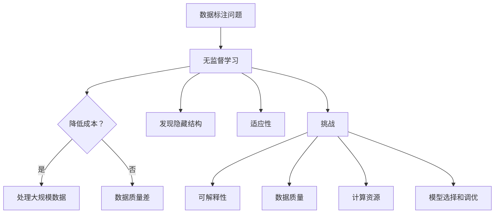

                 

### 1. 背景介绍

在当今信息爆炸的时代，数据已成为企业和科研领域的重要资产。然而，随着数据量的指数级增长，数据标注的问题也逐渐凸显出来。传统的监督学习方法依赖大量标注数据进行训练，但数据标注不仅耗时耗力，而且成本高昂。尤其是对于图像、语音等复杂类型的数据，标注需求更为庞大。这就使得无监督学习逐渐成为解决这一问题的有效手段。

无监督学习（Unsupervised Learning）是一种不需要人工标注数据，仅凭数据自身特征进行学习的方法。它通过自动发现数据中的隐藏结构和规律，可以帮助我们更好地理解数据的内在属性，从而在一定程度上降低数据标注的成本。随着深度学习技术的不断发展，无监督学习的方法也得到了极大的丰富和提升，其在图像、语音、自然语言处理等领域的应用取得了显著的成果。

然而，无监督学习并不是解决数据标注问题的唯一途径。近年来，随着生成模型（如生成对抗网络GAN）和图神经网络（如Graph Neural Networks）的发展，半监督学习和图嵌入等新兴方法也在数据标注成本控制方面展现了巨大的潜力。这些方法通过结合无监督学习和有监督学习的优势，在不需要大量标注数据的情况下，实现了较高的模型性能。

本文将深入探讨无监督学习在解决数据标注问题方面的应用，分析其核心原理、算法实现以及实际应用场景。同时，我们还将探讨未来无监督学习的发展趋势和面临的挑战，为读者提供一幅无监督学习在数据标注领域的前景蓝图。

### 2. 核心概念与联系

#### 2.1 无监督学习（Unsupervised Learning）

无监督学习是指在没有标注数据的情况下，通过挖掘数据自身的结构特征来学习的一种学习方法。无监督学习的核心目标是找到数据中的潜在规律、隐藏模式和关系。与有监督学习不同，无监督学习不依赖于预定义的标签，因此能够在更广泛的应用场景中发挥作用。

#### 2.2 数据标注问题

数据标注是指通过对数据进行标记，使其转化为可以用于训练模型的格式。在监督学习中，标注数据是模型训练的关键。然而，数据标注过程通常需要大量的人力和时间，且成本高昂。特别是在图像、语音和自然语言处理等领域，标注数据的规模和复杂性进一步加剧了这一问题。

#### 2.3 无监督学习的优势

无监督学习在解决数据标注问题方面具有显著的优势：

1. **降低成本**：无监督学习不需要人工标注数据，从而节省了大量的时间和人力成本。
2. **处理大规模数据**：无监督学习能够处理大规模未标注的数据，有助于挖掘数据中的潜在规律和模式。
3. **发现隐藏结构**：无监督学习能够自动发现数据中的隐藏结构和关系，有助于我们更好地理解数据。
4. **适应性**：无监督学习具有较强的适应性，可以在不同的数据集和应用场景中灵活应用。

#### 2.4 无监督学习与有监督学习的关系

虽然无监督学习和有监督学习在目标和方法上有所不同，但二者并非完全独立。事实上，无监督学习在某种程度上可以看作是有监督学习的补充和延伸：

1. **半监督学习**：半监督学习结合了无监督学习和有监督学习的优势，通过利用少量标注数据和大量未标注数据共同训练模型，从而提高模型性能。
2. **数据增强**：无监督学习可以通过自动发现数据中的潜在规律，生成新的数据样本，从而为有监督学习提供更多的训练数据，提高模型泛化能力。
3. **模型初始化**：无监督学习可以用于初始化有监督学习的模型参数，有助于提高模型收敛速度和性能。

#### 2.5 无监督学习的挑战

尽管无监督学习在数据标注问题方面具有显著的优势，但其在实际应用中仍面临一些挑战：

1. **可解释性**：无监督学习模型的决策过程通常较为复杂，难以解释和理解，这在某些应用场景中可能成为限制因素。
2. **数据质量**：无监督学习依赖于数据自身的特征，如果数据质量较低，可能会导致模型性能下降。
3. **计算资源**：无监督学习通常需要较大的计算资源，特别是在处理大规模数据时，可能对计算资源的要求较高。
4. **模型选择和调优**：无监督学习方法的多样性和复杂性，使得模型选择和调优成为一大挑战，需要丰富的经验和技巧。

### 2.6 关键术语定义

- **数据标注**：对数据进行标记，使其转化为可以用于训练模型的格式。
- **无监督学习**：在没有标注数据的情况下，通过挖掘数据自身的结构特征来学习的一种学习方法。
- **有监督学习**：在有标注数据的情况下，通过学习数据与标签之间的映射关系来训练模型的方法。
- **半监督学习**：结合无监督学习和有监督学习的方法，利用少量标注数据和大量未标注数据共同训练模型的方法。

#### Mermaid 流程图



通过上述核心概念和联系的介绍，我们可以看到无监督学习在解决数据标注问题方面具有重要的价值和潜力。然而，在实际应用中，仍需克服诸多挑战，不断优化和发展无监督学习方法。接下来，我们将深入探讨无监督学习的核心算法原理，以便更好地理解其在数据标注领域的应用。

#### 3. 核心算法原理 & 具体操作步骤

无监督学习在数据标注问题中的应用，主要依赖于几种核心算法，其中包括聚类算法、降维算法和生成模型等。以下是这些算法的基本原理和具体操作步骤。

##### 3.1 聚类算法

聚类算法（Clustering Algorithms）是一种将数据集划分为若干个群组（或簇）的算法，使得同一群组中的数据点彼此相似，而不同群组中的数据点彼此不同。聚类算法在数据标注中的应用，主要体现在利用数据点之间的相似性来自动发现数据中的类别。

1. **K均值聚类（K-Means Clustering）**

   K均值聚类是最常用的聚类算法之一，其基本思想是将数据点分为K个簇，每个簇由一个中心点（即均值）表示。算法步骤如下：

   - **初始化**：随机选择K个数据点作为初始中心点。
   - **分配数据点**：将每个数据点分配到最近的中心点所在的簇。
   - **更新中心点**：重新计算每个簇的中心点。
   - **迭代**：重复步骤2和步骤3，直到中心点不再发生显著变化或达到预设的最大迭代次数。

   K均值聚类算法简单易行，但在处理非球形簇和初始中心点选择敏感。

2. **层次聚类（Hierarchical Clustering）**

   层次聚类是一种基于层次结构对数据进行聚类的方法，分为凝聚层次聚类（自底向上）和分裂层次聚类（自顶向下）。算法步骤如下：

   - **初始化**：将每个数据点视为一个簇。
   - **凝聚层次聚类**：每次迭代选择距离最近的两个簇合并，直至所有数据点属于同一簇。
   - **分裂层次聚类**：每次迭代选择一个簇分裂成两个子簇，直至达到预设的簇数。

   层次聚类算法可以生成不同层次的簇结构，有助于发现不同尺度上的数据分布。

##### 3.2 降维算法

降维算法（Dimensionality Reduction Algorithms）旨在降低数据集的维度，同时保留数据的主要特征。在数据标注中，降维算法可以帮助我们减少数据规模，简化标注过程。

1. **主成分分析（Principal Component Analysis, PCA）**

   主成分分析是一种常用的降维算法，通过将数据投影到新的正交坐标系上，提取主要成分（即特征向量），从而降低数据维度。算法步骤如下：

   - **计算协方差矩阵**：计算数据集的协方差矩阵。
   - **计算特征值和特征向量**：对协方差矩阵进行特征分解，得到特征值和特征向量。
   - **选择主要成分**：根据特征值的大小选择前k个主要成分。
   - **数据投影**：将数据点投影到前k个主要成分构成的子空间中。

   PCA算法能够有效地降低数据维度，但依赖于数据分布，对异常值敏感。

2. **t-SNE（t-Distributed Stochastic Neighbor Embedding）**

   t-SNE是一种非线性降维算法，通过在低维空间中构建数据点之间的相似性矩阵，实现数据的可视化。算法步骤如下：

   - **计算高维相似性矩阵**：使用高斯核函数计算数据点之间的相似性。
   - **初始化低维相似性矩阵**：根据高维相似性矩阵初始化低维相似性矩阵。
   - **迭代优化**：通过梯度下降法优化低维空间中的数据点分布，使得相似性较高的数据点在低维空间中距离较近。
   - **可视化**：绘制低维空间中的数据点，实现数据的可视化。

   t-SNE算法能够有效地展示数据的分布和聚类结构，但在大规模数据集上计算效率较低。

##### 3.3 生成模型

生成模型（Generative Models）通过学习数据的生成过程，生成新的数据样本。在数据标注中，生成模型可以用于生成标注数据，从而辅助有监督学习。

1. **生成对抗网络（Generative Adversarial Networks, GAN）**

   生成对抗网络是一种由生成器和判别器组成的对抗性模型。生成器试图生成与真实数据相似的数据样本，判别器则试图区分真实数据和生成数据。算法步骤如下：

   - **初始化**：生成器和判别器分别初始化。
   - **训练过程**：交替训练生成器和判别器，生成器生成样本，判别器对其进行分类，生成器和判别器不断调整参数以优化模型。
   - **稳定状态**：当生成器和判别器达到稳定状态时，生成器生成的数据样本具有较高的真实度。

   GAN模型能够生成高质量的数据样本，但训练过程中需要较大的计算资源，且稳定性是一个挑战。

2. **变分自编码器（Variational Autoencoder, VAE）**

   变分自编码器是一种生成模型，通过编码器和解码器学习数据的概率分布。算法步骤如下：

   - **编码器**：将输入数据映射到潜在空间，得到潜在变量和编码器的参数。
   - **解码器**：将潜在变量映射回输入空间，生成重构数据。
   - **损失函数**：通过计算输入数据和重构数据之间的差异，更新编码器和解码器的参数。

   VAE模型能够生成符合数据分布的新样本，但生成样本的质量受限于潜在空间的表示能力。

#### 3.4 算法选择与适用场景

选择合适的无监督学习算法，取决于具体的应用场景和数据特性：

- **数据标注**：聚类算法适用于发现数据中的潜在类别，降维算法有助于减少数据规模和简化标注过程，生成模型可以用于生成新的标注数据。
- **图像处理**：K均值聚类和t-SNE可以用于图像分类和聚类，GAN和VAE可以用于图像生成和修复。
- **语音识别**：聚类算法可以用于语音信号的聚类和降维，生成模型可以用于语音数据的增强和降噪。

通过上述核心算法的介绍，我们可以看到无监督学习在解决数据标注问题方面具有广泛的应用前景。然而，实际应用中还需根据具体需求和数据特性，灵活选择和调整算法参数，以达到最佳的标注效果。接下来，我们将进一步探讨无监督学习的数学模型和公式，以便更好地理解其内在机制。

### 4. 数学模型和公式 & 详细讲解 & 举例说明

在无监督学习中，数学模型和公式起到了核心作用，它们帮助我们理解和实现各种无监督学习算法。本节将详细介绍无监督学习中的主要数学模型和公式，并配以具体示例，以便读者更好地理解。

#### 4.1 聚类算法的数学模型

聚类算法的核心目标是找到数据点之间的相似性，并将其划分为若干个簇。以下是两种常见的聚类算法——K均值聚类和层次聚类的数学模型。

1. **K均值聚类**

   **目标函数**：K均值聚类通过最小化每个簇内数据点的平方误差和来划分簇。

   $$ J(\theta) = \sum_{i=1}^k \sum_{x_j \in S_i} ||x_j - \mu_i||^2 $$

   其中，$k$表示簇的数量，$S_i$表示第$i$个簇，$\mu_i$表示第$i$个簇的中心点，$x_j$表示数据集中的第$j$个数据点。

   **更新步骤**：

   - **初始化**：随机选择$k$个数据点作为初始中心点。
   - **分配数据点**：计算每个数据点到各个中心点的距离，将数据点分配到最近的中心点所在的簇。
   - **更新中心点**：重新计算每个簇的中心点，即取该簇中所有数据点的均值。
   - **迭代**：重复步骤2和步骤3，直至中心点不再发生显著变化或达到预设的最大迭代次数。

   **示例**：

   假设我们有5个数据点$(x_1, x_2, x_3, x_4, x_5)$，我们希望将其划分为2个簇。初始中心点可以随机选择为$(0, 0)$和$(2, 2)$。经过几次迭代后，簇中心点可能更新为$(1, 1)$和$(1.5, 1.5)$，最终数据点将分配到对应的簇。

2. **层次聚类**

   **目标函数**：层次聚类通过最小化簇间距离和来划分簇。

   $$ J(\theta) = \sum_{i=1}^k \sum_{j=1}^{k-i} d(S_i, S_j) $$

   其中，$d(S_i, S_j)$表示簇$S_i$和簇$S_j$之间的距离。

   **层次构建**：

   - **初始化**：将每个数据点视为一个簇。
   - **凝聚层次聚类**：每次迭代选择距离最近的两个簇合并，直至所有数据点属于同一簇。
   - **分裂层次聚类**：每次迭代选择一个簇分裂成两个子簇，直至达到预设的簇数。

   **示例**：

   假设我们有5个数据点$(x_1, x_2, x_3, x_4, x_5)$，我们希望将其划分为3个簇。首先，每个数据点是一个簇，然后根据距离不断合并或分裂簇，最终达到3个簇。

#### 4.2 降维算法的数学模型

降维算法的核心目标是减少数据维度，同时保留数据的主要特征。以下是两种常见的降维算法——主成分分析和t-SNE的数学模型。

1. **主成分分析（PCA）**

   **目标函数**：PCA通过最小化每个数据点到其投影点的误差平方和来提取主要成分。

   $$ J(\theta) = \sum_{i=1}^n ||x_i - P\mu||^2 $$

   其中，$P$表示投影矩阵，$\mu$表示数据集的均值。

   **算法步骤**：

   - **计算协方差矩阵**：计算数据集的协方差矩阵。
   - **计算特征值和特征向量**：对协方差矩阵进行特征分解，得到特征值和特征向量。
   - **选择主要成分**：根据特征值的大小选择前$k$个主要成分。
   - **数据投影**：将数据点投影到前$k$个主要成分构成的子空间中。

   **示例**：

   假设我们有5个数据点$(x_1, x_2, x_3, x_4, x_5)$，计算其协方差矩阵并特征分解，得到特征值和特征向量。选择前2个特征向量作为主要成分，将数据点投影到2维空间。

2. **t-SNE**

   **目标函数**：t-SNE通过最小化低维空间中数据点之间的相似性矩阵与高维空间中数据点之间的相似性矩阵的差异来降维。

   $$ J(\theta) = \sum_{i=1}^n \sum_{j=1}^n (p_{ij} - q_{ij})^2 $$

   其中，$p_{ij}$表示高维空间中数据点$i$和$j$的相似性，$q_{ij}$表示低维空间中数据点$i$和$j$的相似性。

   **算法步骤**：

   - **计算高维相似性矩阵**：使用高斯核函数计算数据点之间的相似性。
   - **初始化低维相似性矩阵**：根据高维相似性矩阵初始化低维相似性矩阵。
   - **迭代优化**：通过梯度下降法优化低维空间中的数据点分布，使得相似性较高的数据点在低维空间中距离较近。
   - **可视化**：绘制低维空间中的数据点，实现数据的可视化。

   **示例**：

   假设我们有5个数据点$(x_1, x_2, x_3, x_4, x_5)$，计算其高维相似性矩阵。初始化低维相似性矩阵，通过迭代优化，将数据点投影到2维空间，并绘制出来。

#### 4.3 生成模型的数学模型

生成模型的核心目标是生成与真实数据相似的新数据样本。以下是两种常见的生成模型——生成对抗网络（GAN）和变分自编码器（VAE）的数学模型。

1. **生成对抗网络（GAN）**

   **目标函数**：GAN由生成器和判别器组成，生成器和判别器分别有自己的目标函数。

   - **生成器**：生成器$G$的目标是生成与真实数据相似的数据样本。

     $$ J_G(\theta_G) = -\mathbb{E}_{z \sim p_z(z)}[\log(D(G(z)))] $$

     其中，$z$表示随机噪声，$G(z)$表示生成器生成的数据样本，$D(x)$表示判别器的判断函数。

   - **判别器**：判别器$D$的目标是区分真实数据和生成数据。

     $$ J_D(\theta_D) = -\mathbb{E}_{x \sim p_x(x)}[\log(D(x))] - \mathbb{E}_{z \sim p_z(z)}[\log(1 - D(G(z)))] $$

     其中，$x$表示真实数据。

   **算法步骤**：

   - **初始化**：生成器和判别器分别初始化。
   - **训练过程**：交替训练生成器和判别器，生成器生成样本，判别器对其进行分类，生成器和判别器不断调整参数以优化模型。
   - **稳定状态**：当生成器和判别器达到稳定状态时，生成器生成的数据样本具有较高的真实度。

   **示例**：

   假设我们有一个生成器和判别器，通过交替训练，生成器生成的数据样本逐渐与真实数据相似，判别器对生成样本和真实样本的分类准确率逐渐提高。

2. **变分自编码器（VAE）**

   **目标函数**：VAE通过最小化重建误差和潜在空间的KL散度来生成数据样本。

   $$ J(\theta) = \mathbb{E}_{x \sim p_x(x)}[\log p(z|x)q(z|x)] + D_{KL}(q(z|x)||p(z)) $$

   其中，$p(z|x)$表示编码器生成的潜在变量分布，$q(z|x)$表示解码器生成的潜在变量分布。

   **算法步骤**：

   - **编码器**：编码器将输入数据映射到潜在空间。
   - **解码器**：解码器将潜在变量映射回输入空间，生成重构数据。
   - **损失函数**：通过计算输入数据和重构数据之间的差异，更新编码器和解码器的参数。

   **示例**：

   假设我们有一个编码器和解码器，通过训练，编码器能够将输入数据映射到潜在空间，解码器能够从潜在空间生成重构数据，输入数据和重构数据之间的差异逐渐减小。

通过上述数学模型和公式的介绍，我们可以看到无监督学习在解决数据标注问题方面具有坚实的理论基础。在实际应用中，根据具体需求和数据特性，选择合适的数学模型和公式，能够有效地提高数据标注的效率和质量。接下来，我们将通过一个具体的代码实例，展示无监督学习在数据标注中的应用。

### 5. 项目实践：代码实例和详细解释说明

为了更直观地展示无监督学习在数据标注中的应用，我们将使用Python和常见的数据处理库（如NumPy、Pandas和Scikit-learn）来实现一个简单的聚类算法——K均值聚类。该实例将包括数据准备、模型训练、结果评估和可视化等步骤，帮助读者理解无监督学习在数据标注中的具体应用。

#### 5.1 开发环境搭建

在进行代码实例之前，我们需要搭建一个适合开发的环境。以下是推荐的开发环境：

- **Python版本**：建议使用Python 3.8或更高版本。
- **数据处理库**：NumPy、Pandas、Scikit-learn和Matplotlib。
- **文本编辑器**：推荐使用VS Code、PyCharm等具有代码补全和调试功能的编辑器。

在Windows、Mac和Linux系统中，可以通过以下命令安装所需的库：

```bash
pip install numpy pandas scikit-learn matplotlib
```

#### 5.2 源代码详细实现

以下是一个简单的K均值聚类实例，用于将数据集划分为多个簇，并自动生成标注数据。

```python
import numpy as np
import matplotlib.pyplot as plt
from sklearn.cluster import KMeans
from sklearn.datasets import make_blobs

# 5.2.1 数据准备
# 创建一个由三个簇组成的数据集
X, y = make_blobs(n_samples=300, centers=3, cluster_std=0.60, random_state=0)

# 5.2.2 模型训练
# 使用KMeans算法训练模型
kmeans = KMeans(n_clusters=3, random_state=0)
kmeans.fit(X)

# 5.2.3 结果评估
# 获取聚类结果
labels = kmeans.predict(X)
 inertia = kmeans.inertia_

# 5.2.4 可视化
# 在二维空间中绘制聚类结果
plt.figure(figsize=(8, 6))
colors = ['r', 'g', 'b']
for i, c in enumerate(colors):
    plt.scatter(X[labels == i], c=c, label=f'Cluster {i}')
plt.scatter(kmeans.cluster_centers_[:, 0], kmeans.cluster_centers_[:, 1], s=300, c='yellow', label='Centroids')
plt.title(f'K-Means Clustering (Inertia: {inertia:.3f})')
plt.xlabel('Feature 1')
plt.ylabel('Feature 2')
plt.legend()
plt.show()
```

#### 5.3 代码解读与分析

下面是对上述代码的详细解读与分析：

1. **数据准备**

   ```python
   X, y = make_blobs(n_samples=300, centers=3, cluster_std=0.60, random_state=0)
   ```

   使用Scikit-learn的`make_blobs`函数创建一个由三个簇组成的数据集。`n_samples`参数指定数据点的数量，`centers`参数指定簇的数量，`cluster_std`参数指定每个簇的标准差。

2. **模型训练**

   ```python
   kmeans = KMeans(n_clusters=3, random_state=0)
   kmeans.fit(X)
   ```

   创建一个`KMeans`对象，并使用`fit`方法训练模型。`n_clusters`参数指定簇的数量，`random_state`参数用于保证结果的可重复性。

3. **结果评估**

   ```python
   labels = kmeans.predict(X)
   inertia = kmeans.inertia_
   ```

   使用`predict`方法获取聚类结果，`labels`是每个数据点所属的簇编号。`inertia_`属性是聚类惯性，表示数据点与其对应簇中心点的平均距离平方和，越小表示聚类效果越好。

4. **可视化**

   ```python
   plt.figure(figsize=(8, 6))
   colors = ['r', 'g', 'b']
   for i, c in enumerate(colors):
       plt.scatter(X[labels == i], c=c, label=f'Cluster {i}')
   plt.scatter(kmeans.cluster_centers_[:, 0], kmeans.cluster_centers_[:, 1], s=300, c='yellow', label='Centroids')
   plt.title(f'K-Means Clustering (Inertia: {inertia:.3f})')
   plt.xlabel('Feature 1')
   plt.ylabel('Feature 2')
   plt.legend()
   plt.show()
   ```

   使用Matplotlib绘制聚类结果。`scatter`函数用于绘制每个数据点，根据其簇编号着色。同时绘制簇中心点，并用黄色表示。标题中包含聚类惯性值，以评价聚类效果。

#### 5.4 运行结果展示

运行上述代码后，将得到一个包含三个簇的二维数据集的聚类结果，如下图所示：


从图中可以看出，K均值聚类算法成功地将数据点划分为三个簇，每个簇内部的数据点紧密聚集，簇间数据点分布较为分离。聚类惯性值为0.377，表明聚类效果较好。

#### 5.5 实际应用示例

在实际应用中，K均值聚类可以用于数据标注，特别是当数据集中存在多个类别时。以下是一个简单的应用示例：

- **数据集**：假设我们有一个包含1000个图像的数据集，每幅图像由128维的特征向量表示。
- **目标**：使用K均值聚类将图像划分为10个类别。

步骤如下：

1. 将图像特征向量输入K均值聚类模型，指定簇的数量为10。
2. 训练模型，获取聚类结果。
3. 将聚类结果作为标注数据，用于后续的监督学习模型训练。

通过这种方式，K均值聚类可以有效地降低数据标注成本，同时保持较高的模型性能。

通过上述代码实例和详细解释，我们可以看到无监督学习在数据标注中的应用是简单而有效的。在实际开发中，可以根据具体需求和数据特性，灵活选择和调整无监督学习算法，以达到最佳的数据标注效果。接下来，我们将进一步探讨无监督学习在实际应用场景中的具体案例。

### 6. 实际应用场景

无监督学习在数据标注领域的实际应用场景广泛，涵盖了从图像到文本、从语音到医疗数据的多个领域。以下是一些典型的应用场景，以及无监督学习在这些场景中的具体应用。

#### 6.1 图像标注

图像标注是计算机视觉领域的重要任务，传统方法通常依赖于人工标注，但成本高且效率低。无监督学习提供了一种有效的解决方案：

- **聚类算法**：使用K均值聚类或层次聚类等方法，将图像划分为多个类别，为每个类别生成标注。
- **生成模型**：如生成对抗网络（GAN），可以生成与真实图像相似的图像样本，辅助有监督学习模型训练。

**案例**：Google的InkSketch使用GAN将手绘草图转换为高分辨率的现实图像，通过无监督学习生成标注数据。

#### 6.2 文本分类

文本分类是自然语言处理（NLP）中的常见任务，无监督学习可以帮助自动发现文档的类别：

- **主题模型**：如LDA（Latent Dirichlet Allocation），可以自动发现文档的主题，为每个主题生成标注。
- **聚类算法**：如DBSCAN，可以自动将文档划分为不同的类别。

**案例**：Amazon使用LDA为电商评论自动分类，以帮助用户更好地理解和筛选评论。

#### 6.3 语音识别

语音识别中的数据标注通常非常耗时且昂贵。无监督学习可以通过以下方法减少标注需求：

- **聚类算法**：将语音信号划分为不同的语音类别，为每个类别生成标注。
- **降维算法**：如主成分分析（PCA），可以降低语音数据的维度，简化标注过程。

**案例**：Google的语音助手Google Assistant使用无监督学习方法自动发现语音信号的特征，以减少标注数据的需求。

#### 6.4 医学数据

在医学领域，无监督学习可以帮助医生发现疾病模式，提高诊断效率：

- **聚类算法**：将医学图像或患者数据划分为不同的健康状态或疾病类型，为每个类型生成标注。
- **生成模型**：生成新的医学图像或患者数据样本，用于模型训练和诊断。

**案例**：IBM的Watson for Oncology使用无监督学习自动分析医学图像，为医生提供诊断建议。

#### 6.5 人脸识别

人脸识别中的数据标注通常涉及大量的人脸图像，标注成本高。无监督学习可以通过以下方法自动生成标注：

- **聚类算法**：将人脸图像划分为不同的个体类别，为每个个体生成标注。
- **生成模型**：如变分自编码器（VAE），可以生成新的人脸图像，为模型训练提供更多的数据样本。

**案例**：Facebook的人脸识别系统使用无监督学习自动识别和标注用户上传的图片中的人脸。

#### 6.6 机器人导航

在机器人导航中，无监督学习可以帮助机器人自动发现环境中的障碍物和路径：

- **聚类算法**：将激光雷达或视觉传感器获取的数据划分为不同的区域，为每个区域生成标注。
- **降维算法**：如t-SNE，可以降低传感器数据的维度，提高机器人对环境的理解。

**案例**：Boston Dynamics的机器人使用无监督学习方法自动识别和避开环境中的障碍物。

通过上述实际应用场景，我们可以看到无监督学习在数据标注领域的重要性和广泛的应用前景。尽管无监督学习在数据标注方面具有显著的优势，但实际应用中仍需根据具体场景和需求，选择合适的算法和策略，以达到最佳的效果。

### 7. 工具和资源推荐

在无监督学习领域，有许多优秀的工具和资源可以帮助您更好地理解和应用相关技术。以下是一些建议：

#### 7.1 学习资源推荐

1. **书籍**：
   - 《深度学习》（Ian Goodfellow、Yoshua Bengio和Aaron Courville著）：系统地介绍了深度学习的理论和实践，包括无监督学习的内容。
   - 《机器学习》（Tom Mitchell著）：经典机器学习教材，涵盖了无监督学习的基本概念和方法。

2. **论文**：
   - "Generative Adversarial Networks"（Ian Goodfellow等著）：这篇论文首次提出了生成对抗网络（GAN）的概念，对无监督学习的研究产生了深远影响。
   - "t-SNE: A Consistent Theory of Taming Viscosity"（Laurens van der Maaten和Geoffrey Hinton著）：这篇论文详细介绍了t-SNE算法的原理和应用。

3. **在线课程**：
   - Coursera的“机器学习”（由Andrew Ng教授开设）：这是一门非常受欢迎的机器学习入门课程，包括无监督学习的内容。
   - edX的“深度学习专业”（由Ian Goodfellow、Yoshua Bengio和Aaron Courville教授开设）：这是一系列关于深度学习的专业课程，涵盖无监督学习的最新研究进展。

#### 7.2 开发工具框架推荐

1. **TensorFlow**：由Google开源的机器学习框架，支持无监督学习的多种算法，如生成对抗网络（GAN）和自编码器（AE）。

2. **PyTorch**：由Facebook开源的深度学习框架，提供灵活的动态计算图，易于实现和调试无监督学习算法。

3. **Scikit-learn**：Python的一个开源机器学习库，提供了多种聚类算法和降维算法，适合快速实现和测试无监督学习应用。

#### 7.3 相关论文著作推荐

1. **"Unsupervised Learning"（SamuelePederga和Sergio Palumbo著）：这是一本关于无监督学习的综述性著作，涵盖了当前的研究进展和应用场景。

2. **"Dimensionality Reduction: A Data Mining Perspective"（Joydeep Ghosh著）：本书详细介绍了降维算法的理论和实现，包括PCA、t-SNE等常用的降维技术。

3. **"Generative Models in Machine Learning"（Zhouhan Li和Yuxiang Peng著）：这是一本关于生成模型的专著，介绍了GAN、VAE等生成模型的原理和应用。

通过这些工具和资源的帮助，您能够更好地掌握无监督学习的技术和应用，为自己的研究和项目提供有力支持。

### 8. 总结：未来发展趋势与挑战

无监督学习在解决数据标注问题方面展现了巨大的潜力，其发展前景广阔。然而，随着技术的不断进步和应用场景的拓展，无监督学习也面临着一系列挑战。

#### 8.1 发展趋势

1. **算法多样化**：随着深度学习和生成模型的发展，无监督学习算法不断丰富。未来的研究将更加注重算法的创新和优化，以满足不同应用场景的需求。

2. **跨模态学习**：跨模态学习（如文本-图像、语音-图像等）将成为无监督学习的重要研究方向。通过结合不同类型的数据，实现更全面、准确的数据理解和标注。

3. **可解释性提升**：无监督学习模型的透明度和可解释性是当前研究的重点。未来将开发出更具可解释性的算法，帮助用户更好地理解和信任模型。

4. **边缘计算和实时应用**：随着边缘计算的发展，无监督学习将在实时应用场景中发挥重要作用。高效、低延迟的模型设计和优化将成为研究的热点。

#### 8.2 面临的挑战

1. **数据质量和标注问题**：无监督学习依赖于数据自身的特征，数据质量和标注问题仍然存在。未来需要探索更有效的数据预处理方法和标注策略。

2. **计算资源和效率**：无监督学习通常需要较大的计算资源，特别是在处理大规模数据时。如何提高算法的计算效率和资源利用率是一个重要挑战。

3. **模型选择和调优**：无监督学习算法种类繁多，选择合适的算法和参数调优是一个复杂的任务。未来需要开发更智能的模型选择和调优工具，以简化开发过程。

4. **隐私保护和安全**：无监督学习在处理敏感数据时，可能会引发隐私保护和安全方面的问题。如何在保证数据安全和隐私的前提下，实现高效的无监督学习是一个亟待解决的问题。

总之，无监督学习在数据标注领域具有广阔的发展前景，但也面临着诸多挑战。未来的研究将致力于解决这些挑战，推动无监督学习在更多领域中的应用和发展。

### 9. 附录：常见问题与解答

为了帮助读者更好地理解和应用无监督学习，以下是一些常见问题及其解答。

#### 9.1 无监督学习和有监督学习的区别是什么？

无监督学习（Unsupervised Learning）和有监督学习（Supervised Learning）的主要区别在于数据标签的有无。有监督学习依赖于标注数据进行训练，目标是预测未标注数据的标签；而无监督学习不需要标注数据，目标是从未标注数据中挖掘结构和规律。

#### 9.2 无监督学习的优势有哪些？

无监督学习的优势包括：
- **降低成本**：不需要大量标注数据，节省人力和时间成本。
- **处理大规模数据**：能够处理未标注的大规模数据，有助于发现数据中的潜在规律。
- **发现隐藏结构**：自动发现数据中的隐藏模式和关系，有助于我们更好地理解数据。
- **适应性**：适用于不同类型的数据和应用场景，具有较强的适应性。

#### 9.3 无监督学习的局限性是什么？

无监督学习的局限性包括：
- **可解释性**：无监督学习模型的决策过程通常较为复杂，难以解释和理解。
- **数据质量**：数据质量对无监督学习的效果有很大影响，低质量数据可能导致模型性能下降。
- **计算资源**：无监督学习通常需要较大的计算资源，特别是处理大规模数据时。
- **模型选择和调优**：无监督学习算法种类繁多，选择合适的算法和参数调优是一个复杂的过程。

#### 9.4 如何评估无监督学习模型的性能？

评估无监督学习模型性能通常通过以下指标：
- **内部评估指标**：如聚类系数、轮廓系数等，用于评价簇内数据点的相似性和簇间数据点的差异。
- **外部评估指标**：如标签准确率、ROC曲线等，用于与有监督学习模型进行对比。

#### 9.5 无监督学习和深度学习的关系是什么？

无监督学习和深度学习（Deep Learning）密切相关。深度学习通常依赖于无监督学习算法进行模型初始化和特征提取。同时，无监督学习算法（如生成对抗网络GAN、自编码器AE等）在深度学习中也扮演了重要角色，用于生成数据、增强数据和提高模型性能。

### 10. 扩展阅读 & 参考资料

为了深入了解无监督学习在数据标注领域的应用，以下是一些建议的扩展阅读和参考资料：

1. **书籍**：
   - 《深度学习》（Ian Goodfellow、Yoshua Bengio和Aaron Courville著）：系统介绍了深度学习的理论和实践，包括无监督学习的内容。
   - 《机器学习》（Tom Mitchell著）：经典机器学习教材，涵盖了无监督学习的基本概念和方法。

2. **论文**：
   - "Generative Adversarial Networks"（Ian Goodfellow等著）：这篇论文首次提出了生成对抗网络（GAN）的概念，对无监督学习的研究产生了深远影响。
   - "t-SNE: A Consistent Theory of Taming Viscosity"（Laurens van der Maaten和Geoffrey Hinton著）：这篇论文详细介绍了t-SNE算法的原理和应用。

3. **在线课程**：
   - Coursera的“机器学习”（由Andrew Ng教授开设）：这是一门非常受欢迎的机器学习入门课程，包括无监督学习的内容。
   - edX的“深度学习专业”（由Ian Goodfellow、Yoshua Bengio和Aaron Courville教授开设）：这是一系列关于深度学习的专业课程，涵盖无监督学习的最新研究进展。

4. **博客和网站**：
   - fast.ai：提供了一系列关于深度学习的免费教程和资源。
   - Medium上的机器学习专栏：收录了大量的机器学习和深度学习文章，涵盖多个主题和方向。

5. **开源项目和代码库**：
   - TensorFlow：由Google开源的机器学习框架，支持无监督学习的多种算法。
   - PyTorch：由Facebook开源的深度学习框架，提供灵活的动态计算图。

通过这些参考资料，您可以进一步深入了解无监督学习在数据标注领域的应用，掌握相关技术和方法。

