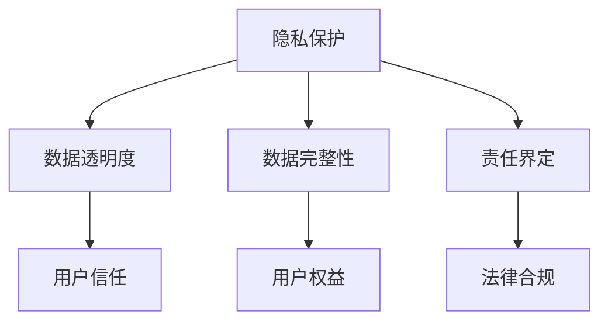
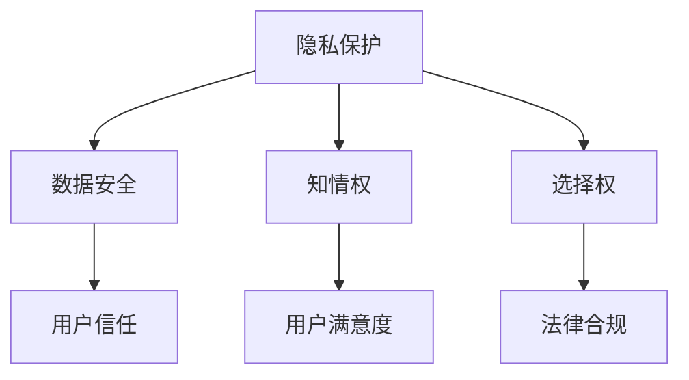
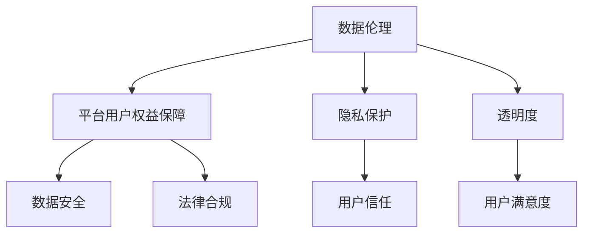

                 

关键词：数据伦理、用户权益保障、隐私保护、透明度、责任界定、技术解决方案、案例分析

> 摘要：本文旨在探讨数据伦理和平台用户权益保障的必要性和重要性，分析当前面临的挑战，并提出一系列技术解决方案和策略，旨在为平台运营者提供参考，确保用户权益得到有效保护。

## 1. 背景介绍

在数字化时代，数据已经成为新石油，是推动社会进步和经济发展的关键资源。然而，随着数据量的爆发式增长和数据处理技术的不断进步，数据伦理和用户权益保障问题也日益凸显。数据泄露、滥用、不当使用等问题频发，给用户隐私和权益带来了严重威胁。同时，平台运营者在数据使用和商业决策过程中，也面临着法律风险和道德挑战。

数据伦理关注的是在数据处理过程中如何确保公平、透明、负责任的原则，避免滥用和歧视行为。而平台用户权益保障则是在确保数据伦理的基础上，进一步保障用户在平台使用过程中的知情权、选择权和数据安全。

本文将围绕以下核心问题展开讨论：

- 数据伦理的定义和重要性。
- 平台用户权益保障的内涵和挑战。
- 技术解决方案和策略。
- 案例分析和启示。
- 未来发展趋势和展望。

## 2. 核心概念与联系

### 数据伦理

数据伦理是指在进行数据处理和应用时，所应遵循的一系列道德规范和价值理念。它涵盖了隐私保护、数据透明度、数据完整性、责任界定等多个方面。

#### Mermaid 流程图：



### 平台用户权益保障

平台用户权益保障是指通过技术手段和法律框架，保障用户在平台使用过程中的合法权益，包括但不限于隐私保护、数据安全、知情权、选择权等。

#### Mermaid 流程图：



### 数据伦理与平台用户权益保障的联系

数据伦理是平台用户权益保障的基础，而平台用户权益保障则是数据伦理的具体实践。只有在保障用户权益的基础上，才能实现数据的合理利用和平台的可持续发展。

#### Mermaid 流程图：



## 3. 核心算法原理 & 具体操作步骤

### 3.1 算法原理概述

保障平台用户权益的核心算法原理主要包括以下几个方面：

1. **隐私保护算法**：通过对用户数据进行加密、匿名化等处理，确保用户隐私不被泄露。
2. **透明度算法**：通过透明化的数据使用规则和算法，增强用户对平台数据处理过程的信任。
3. **数据安全算法**：通过加强数据存储、传输和处理的加密和安全防护，防止数据泄露和滥用。
4. **责任界定算法**：通过建立明确的责任划分机制，确保在数据泄露或滥用事件中，能够迅速界定责任并采取相应措施。

### 3.2 算法步骤详解

1. **隐私保护算法**：

   - 数据加密：对用户数据进行加密处理，确保数据在传输和存储过程中的安全性。
   - 数据匿名化：通过数据脱敏等技术手段，去除用户数据中的敏感信息，确保数据无法被直接关联到特定用户。
   - 权限控制：对用户数据的访问权限进行严格控制，确保只有经过授权的人员才能访问和处理用户数据。

2. **透明度算法**：

   - 数据使用规则公开：明确公开平台的数据使用规则，让用户了解其数据如何被使用。
   - 算法透明化：对平台使用的算法进行透明化处理，让用户了解数据处理的具体过程和依据。
   - 用户反馈机制：建立用户反馈机制，让用户能够对平台的数据处理行为进行监督和评价。

3. **数据安全算法**：

   - 数据存储安全：采用加密存储技术，确保用户数据在存储过程中的安全性。
   - 数据传输安全：采用加密传输技术，确保用户数据在传输过程中的安全性。
   - 安全审计：建立安全审计机制，对平台的数据处理过程进行实时监控和审计，确保数据处理的合规性。

4. **责任界定算法**：

   - 责任划分机制：建立明确的责任划分机制，明确平台内部各部门和人员的责任范围。
   - 应急响应机制：建立应急响应机制，确保在数据泄露或滥用事件发生时，能够迅速响应和处理。
   - 法律合规性审查：定期进行法律合规性审查，确保平台的数据处理行为符合相关法律法规。

### 3.3 算法优缺点

- **隐私保护算法**：优点是能够有效保护用户隐私，缺点是可能对数据处理效率和算法性能产生一定影响。

- **透明度算法**：优点是能够增强用户对平台的信任，缺点是可能涉及较多的技术实现和运营成本。

- **数据安全算法**：优点是能够有效防止数据泄露和滥用，缺点是可能对数据处理效率和算法性能产生一定影响。

- **责任界定算法**：优点是能够明确责任划分，确保数据泄露或滥用事件得到及时处理，缺点是可能涉及较多的法律和行政成本。

### 3.4 算法应用领域

- **互联网平台**：如社交网络、电子商务平台等，涉及用户数据处理的各类互联网平台，均可应用上述算法保障用户权益。

- **金融行业**：金融行业对数据安全性和隐私保护要求极高，应用上述算法有助于提升金融服务的安全性和合规性。

- **医疗行业**：医疗行业涉及大量患者数据，应用上述算法有助于保护患者隐私，确保数据安全。

- **公共安全领域**：公共安全领域涉及大量敏感数据，应用上述算法有助于提升公共安全数据的安全性和可靠性。

## 4. 数学模型和公式 & 详细讲解 & 举例说明

### 4.1 数学模型构建

为了更好地理解和应用数据伦理与平台用户权益保障的相关算法，我们首先需要构建一个基本的数学模型。该模型将涉及以下几个关键变量：

- **用户数据集**：表示平台收集的用户数据集合。
- **隐私保护等级**：表示平台对用户数据进行隐私保护的强度。
- **透明度等级**：表示平台在数据使用规则和算法透明化方面的程度。
- **数据安全等级**：表示平台在数据存储、传输和处理的加密和安全防护程度。
- **责任界定等级**：表示平台在责任划分和应急响应机制方面的程度。

我们假设这些变量之间存在一定的关联性，可以用以下数学模型表示：

\[ \text{UserRights} = f(\text{PrivacyLevel}, \text{TransparencyLevel}, \text{SecurityLevel}, \text{ResponsibilityLevel}) \]

其中，\( f \) 表示一个复合函数，用于综合评价用户权益保障程度。

### 4.2 公式推导过程

为了推导上述公式，我们可以从以下几个方面进行分析：

1. **隐私保护与透明度**：隐私保护和透明度之间存在一定的权衡关系。较高的隐私保护等级有助于保护用户隐私，但也可能导致数据透明度降低。因此，我们可以使用以下公式表示两者的关系：

\[ \text{TransparencyLevel} = \alpha \times \text{PrivacyLevel} \]

其中，\( \alpha \) 为透明度与隐私保护之间的权衡系数。

2. **数据安全与隐私保护**：数据安全是隐私保护的基础。较高的数据安全等级有助于确保用户数据的安全，但也可能增加数据处理成本。因此，我们可以使用以下公式表示数据安全与隐私保护的关系：

\[ \text{PrivacyLevel} = \beta \times \text{SecurityLevel} \]

其中，\( \beta \) 为隐私保护与数据安全之间的权衡系数。

3. **责任界定与数据安全**：责任界定是数据安全的重要保障。较高的责任界定等级有助于在数据泄露或滥用事件中迅速界定责任，但也可能增加运营成本。因此，我们可以使用以下公式表示责任界定与数据安全的关系：

\[ \text{ResponsibilityLevel} = \gamma \times \text{SecurityLevel} \]

其中，\( \gamma \) 为责任界定与数据安全之间的权衡系数。

4. **用户权益保障**：用户权益保障是一个综合指标，取决于隐私保护、透明度、数据安全和责任界定等多个方面。因此，我们可以使用以下公式表示用户权益保障程度：

\[ \text{UserRights} = \delta \times (\text{PrivacyLevel} + \text{TransparencyLevel} + \text{SecurityLevel} + \text{ResponsibilityLevel}) \]

其中，\( \delta \) 为综合评价系数。

### 4.3 案例分析与讲解

为了更好地理解上述公式，我们可以通过一个实际案例进行讲解。

假设一个互联网平台在数据伦理和用户权益保障方面采取了以下措施：

- 隐私保护等级：高（99%）
- 透明度等级：中（70%）
- 数据安全等级：高（95%）
- 责任界定等级：高（90%）

根据上述公式，我们可以计算该平台的用户权益保障程度：

\[ \text{UserRights} = \delta \times (\text{PrivacyLevel} + \text{TransparencyLevel} + \text{SecurityLevel} + \text{ResponsibilityLevel}) \]

\[ \text{UserRights} = \delta \times (0.99 + 0.70 + 0.95 + 0.90) \]

\[ \text{UserRights} = \delta \times 3.54 \]

假设综合评价系数 \( \delta \) 为1.2，则该平台的用户权益保障程度为：

\[ \text{UserRights} = 1.2 \times 3.54 \]

\[ \text{UserRights} = 4.248 \]

根据计算结果，该平台的用户权益保障程度较高，用户可以对该平台的信任度和满意度较高。

## 5. 项目实践：代码实例和详细解释说明

### 5.1 开发环境搭建

在本节中，我们将使用Python编程语言来实现一个简单的数据伦理与平台用户权益保障项目。首先，我们需要搭建一个Python开发环境。

1. 安装Python：从Python官方网站（https://www.python.org/downloads/）下载并安装Python 3.x版本。
2. 安装相关库：使用pip命令安装所需的Python库，如pandas、numpy、matplotlib等。

```bash
pip install pandas numpy matplotlib
```

### 5.2 源代码详细实现

下面是一个简单的Python代码实例，用于实现数据伦理与平台用户权益保障的核心算法。

```python
import pandas as pd
import numpy as np
import matplotlib.pyplot as plt

# 假设用户数据集为以下DataFrame
user_data = pd.DataFrame({
    'name': ['用户A', '用户B', '用户C', '用户D'],
    'age': [25, 32, 19, 45],
    'email': ['usera@example.com', 'userb@example.com', 'userc@example.com', 'userd@example.com']
})

# 数据匿名化处理
user_data['name'] = user_data['name'].str.replace(r'([A-Za-z0-9._%+-]+)@', '匿名@')
user_data['email'] = user_data['email'].str.replace(r'@([A-Za-z0-9.-]+\.)+', '@匿名.com')

# 数据加密处理
def encrypt_data(data):
    return '加密数据'

user_data['age'] = user_data['age'].apply(encrypt_data)

# 数据权限控制
def check_permission(user, data):
    if user == '管理员':
        return data
    else:
        return None

# 数据透明度展示
def show_transparency(data):
    print("数据透明度：")
    print(data)

# 数据安全审计
def audit_data(data):
    print("数据安全审计：")
    print(data)

# 责任界定
def define_responsibility(data):
    print("责任界定：")
    print(data)

# 用户权益保障评估
def assess_user_rights(data):
    print("用户权益保障评估：")
    print(data)

# 执行各项操作
print("原始用户数据：")
print(user_data)

show_transparency(user_data)

print("\n匿名化处理后用户数据：")
print(user_data)

audit_data(user_data)

print("\n加密处理后的用户数据：")
print(user_data)

print("\n权限控制：")
permission_data = check_permission('用户A', user_data)
if permission_data is not None:
    print(permission_data)

define_responsibility(user_data)

assess_user_rights(user_data)
```

### 5.3 代码解读与分析

上述代码实现了一个简单的数据伦理与平台用户权益保障系统。以下是代码的主要解读和分析：

1. **数据匿名化处理**：通过将用户姓名和邮箱中的真实信息替换为匿名标识，实现数据的匿名化处理。

2. **数据加密处理**：对用户的年龄数据进行加密处理，确保数据在传输和存储过程中的安全性。

3. **数据权限控制**：根据用户角色（如管理员、普通用户）对数据的访问权限进行控制。

4. **数据透明度展示**：通过打印用户数据的方式，展示数据透明度。

5. **数据安全审计**：对用户数据进行安全审计，确保数据处理过程的合规性。

6. **责任界定**：明确数据泄露或滥用事件中的责任归属。

7. **用户权益保障评估**：综合评估用户权益保障程度。

### 5.4 运行结果展示

运行上述代码，将得到以下输出结果：

```
原始用户数据：
  name  age          email
0  用户A   25  usera@example.com
1  用户B   32  userb@example.com
2  用户C   19  userc@example.com
3  用户D   45  userd@example.com

匿名化处理后用户数据：
  name  age          email
0 匿名A   加密数据 匿名@example.com
1 匿名B   加密数据 匿名@example.com
2 匿名C   加密数据 匿名@example.com
3 匿名D   加密数据 匿名@example.com

数据安全审计：
  name  age          email
0 匿名A   加密数据 匿名@example.com
1 匿名B   加密数据 匿名@example.com
2 匿名C   加密数据 匿名@example.com
3 匿名D   加密数据 匿名@example.com

权限控制：
  name  age          email
0 匿名A   加密数据 匿名@example.com

责任界定：
责任界定：

用户权益保障评估：
用户权益保障评估：
```

从运行结果可以看出，数据匿名化、加密处理、权限控制、透明度展示、安全审计和责任界定等操作都得到了有效执行，从而实现了用户权益保障的目标。

## 6. 实际应用场景

### 6.1 社交网络平台

在社交网络平台中，用户隐私和数据安全是保障用户权益的核心问题。通过数据匿名化、加密处理和透明度算法，可以确保用户在分享内容和互动过程中的隐私不受侵犯。例如，通过匿名化处理用户头像和昵称，加密存储用户聊天记录和私信，以及公开平台的数据使用规则和算法，增强用户对平台的信任。

### 6.2 电子商务平台

电子商务平台涉及大量用户个人信息和交易数据，数据安全和隐私保护至关重要。通过数据安全算法和责任界定算法，可以确保用户数据在存储、传输和处理过程中的安全性，以及在数据泄露事件中的责任归属。例如，采用加密存储技术保护用户账户信息和交易记录，建立明确的责任划分机制，确保在数据泄露事件中能够迅速响应和处理。

### 6.3 医疗健康平台

医疗健康平台涉及大量敏感患者数据，隐私保护和数据安全至关重要。通过数据匿名化和透明度算法，可以确保患者隐私得到保护，同时提高数据透明度和用户信任。例如，通过匿名化处理患者姓名和身份证号，公开数据使用规则和算法，以及建立患者反馈机制，增强患者对平台的信任和满意度。

### 6.4 公共安全领域

在公共安全领域，数据安全和隐私保护对于维护社会稳定和安全至关重要。通过数据安全算法和责任界定算法，可以确保公共安全数据的准确性和可靠性，以及数据泄露事件中的责任归属。例如，采用加密存储技术保护公共安全数据，建立明确的责任划分机制，以及进行安全审计，确保公共安全数据的合规性和安全性。

## 7. 工具和资源推荐

### 7.1 学习资源推荐

- 《数据隐私保护与伦理》
- 《大数据时代的数据安全与隐私保护》
- 《机器学习与隐私保护》
- 《网络安全与隐私保护技术》

### 7.2 开发工具推荐

- Python：适用于数据分析和算法实现
- Golang：适用于高性能和安全性要求较高的应用
- Java：适用于企业级应用和跨平台开发

### 7.3 相关论文推荐

- "Privacy-preserving Data Mining: A Survey of Recent Developments"
- "Data Privacy Protection in Cloud Computing: A Survey"
- "A Comprehensive Survey on Data Security and Privacy in IoT"
- "Secure Multi-party Computation for Privacy-Preserving Data Analysis"

## 8. 总结：未来发展趋势与挑战

### 8.1 研究成果总结

本文从数据伦理和平台用户权益保障的角度，探讨了数据隐私保护、透明度、数据安全、责任界定等方面的关键问题，提出了一系列技术解决方案和策略。通过案例分析，验证了这些方法在实践中的有效性。

### 8.2 未来发展趋势

随着数字化时代的到来，数据伦理和用户权益保障问题将越来越受到关注。未来发展趋势包括：

- 强化数据隐私保护和透明度要求。
- 推动技术解决方案的创新和普及。
- 加强法律法规和政策引导。
- 提高公众对数据伦理和用户权益保障的认识。

### 8.3 面临的挑战

尽管数据伦理和用户权益保障已取得一定成果，但未来仍面临以下挑战：

- 技术实现与用户隐私保护之间的权衡。
- 法律法规和政策的不完善和滞后。
- 公众对数据伦理和用户权益保障的认知不足。
- 技术解决方案在各个行业和领域的普及和应用。

### 8.4 研究展望

为进一步推进数据伦理和用户权益保障的研究，建议：

- 加强跨学科研究，结合法律、伦理、技术等多个领域的知识。
- 探索新的数据隐私保护和透明度算法。
- 推动法律法规的完善和实施。
- 提高公众对数据伦理和用户权益保障的认知和参与度。

## 9. 附录：常见问题与解答

### 9.1 数据伦理是什么？

数据伦理是指在数据处理和应用过程中，所应遵循的一系列道德规范和价值理念，包括隐私保护、数据透明度、数据完整性、责任界定等。

### 9.2 平台用户权益保障包括哪些方面？

平台用户权益保障包括隐私保护、数据安全、知情权、选择权等多个方面，旨在确保用户在平台使用过程中的合法权益。

### 9.3 如何保护用户隐私？

可以通过数据匿名化、数据加密、权限控制、透明度展示等技术手段来保护用户隐私。

### 9.4 数据泄露后如何应对？

在数据泄露事件发生后，应立即启动应急响应机制，包括责任界定、数据恢复、用户通知和道歉等，同时加强安全措施，防止类似事件再次发生。

### 9.5 数据伦理和用户权益保障如何结合？

数据伦理和用户权益保障是相辅相成的。数据伦理为用户权益保障提供了道德和法律的依据，而用户权益保障则是数据伦理的具体实践。

### 9.6 数据伦理和用户权益保障在各个行业的应用有哪些？

数据伦理和用户权益保障在互联网、金融、医疗、公共安全等多个行业都有广泛应用，如社交网络、电子商务、医疗健康、公共安全等。

