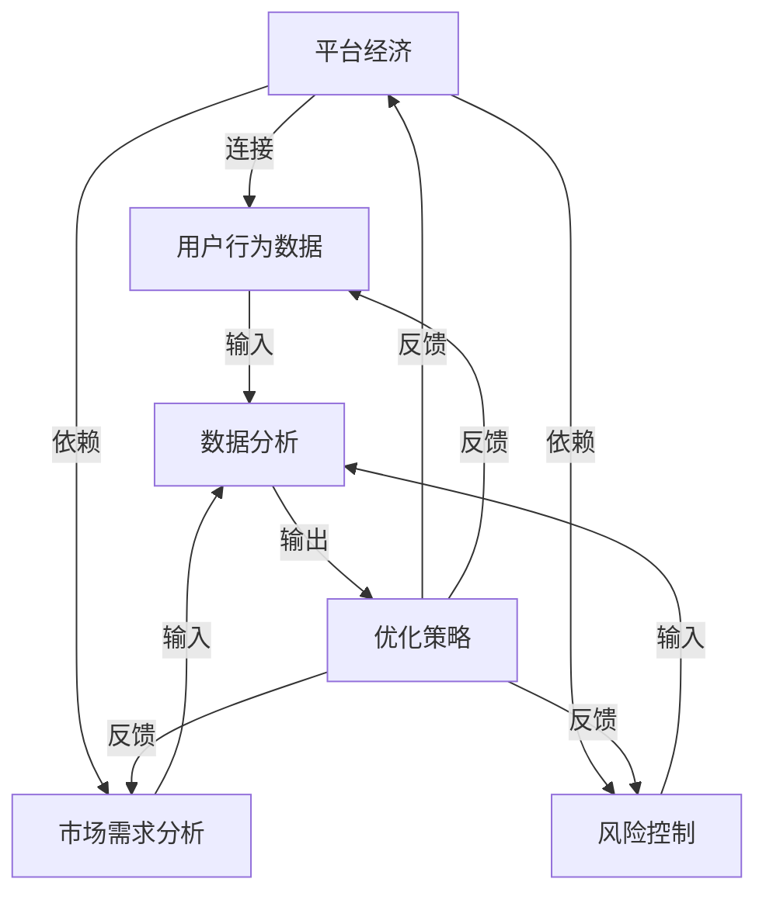

                 

### 背景介绍

#### 平台经济的兴起与数据的重要性

平台经济，作为一种新型经济模式，正日益改变着全球的商业格局。它以中间平台为核心，连接供需双方，通过优化资源配置和降低交易成本，实现了效率的提升和价值的创造。平台经济涉及的领域广泛，从电子商务、共享经济，到金融科技、物流服务，无一不是借助数据的力量实现了跨越式发展。

在这个经济模式中，数据分析扮演了至关重要的角色。数据分析不仅帮助平台企业更好地理解市场需求，优化运营策略，还能通过精确的预测和决策支持，提高企业的竞争力。具体来说，数据分析在平台经济中的应用主要体现在以下几个方面：

1. **用户行为分析**：通过分析用户的行为数据，平台企业可以深入了解用户偏好、消费习惯和需求，从而提供更加个性化的服务。
2. **市场需求预测**：利用历史数据和统计模型，平台企业可以预测未来的市场需求，提前布局，抢占先机。
3. **风险控制与欺诈检测**：通过对交易数据和行为数据的实时监控和分析，平台企业可以有效地识别和防范风险，减少损失。
4. **运营优化**：通过分析运营数据，平台企业可以识别运营中的瓶颈，优化资源配置，提高运营效率。

本文将围绕平台经济中的数据分析展开讨论，深入分析其核心概念、算法原理、数学模型，并通过实际案例和项目实践，探讨如何借鉴成功经验，推动平台经济的进一步发展。我们还将介绍相关的学习资源和工具，为读者提供全面的指导和帮助。

### 核心概念与联系

在深入探讨数据分析在平台经济中的应用之前，我们首先需要明确几个核心概念，并理解它们之间的相互联系。这些概念包括但不限于：用户行为数据、市场需求分析、风险控制、以及平台经济的整体架构。以下将通过 Mermaid 流程图（Mermaid 流程图中不要有括号、逗号等特殊字符）来展示这些概念之间的关系。



在上述 Mermaid 流程图中，我们可以看到：

- **平台经济**是整个分析框架的中心，它通过用户行为数据、市场需求分析和风险控制等模块来实现优化策略，并不断进行反馈调整。
- **用户行为数据**是平台经济的输入之一，通过对用户行为的分析，可以揭示用户偏好和需求，为个性化服务和需求预测提供基础。
- **市场需求分析**利用历史数据和统计模型，帮助平台企业预测未来市场需求，为战略决策提供支持。
- **风险控制**通过对交易数据和行为的实时监控和分析，防范潜在风险，保障平台经济的稳定运行。
- **数据分析**是连接上述所有模块的核心环节，通过数据收集、处理和分析，提供决策支持，并形成反馈循环，持续优化平台的运营。

通过这一流程图，我们可以清晰地理解数据分析在平台经济中的关键作用，以及各个模块之间的相互依赖和协同作用。接下来，我们将进一步探讨数据分析的核心算法原理和具体操作步骤。

### 核心算法原理 & 具体操作步骤

在了解数据分析在平台经济中的关键作用后，接下来我们将深入探讨其核心算法原理，并详细描述具体操作步骤。以下是几个常见且重要的数据分析算法，以及它们在平台经济中的应用实例。

#### 1. 机器学习算法

**机器学习算法**是数据分析中最为广泛使用的方法之一，特别是在预测和分类任务中。以下是一些常用的机器学习算法及其基本原理：

1. **线性回归（Linear Regression）**：线性回归是一种预测数值型目标变量的统计方法。通过建立自变量与因变量之间的线性关系，预测未来的数值。

    **操作步骤**：
    - 数据预处理：包括缺失值处理、异常值处理和数据标准化。
    - 特征工程：选择和构造能够有效预测目标变量的特征。
    - 模型训练：使用训练数据集训练线性回归模型。
    - 模型评估：使用测试数据集评估模型的预测准确性。

    **应用实例**：
    在电商平台中，线性回归可以用于预测商品销量，从而优化库存管理和营销策略。

2. **决策树（Decision Tree）**：决策树通过一系列的规则将数据集分割成多个子集，每个节点代表一个特征，每个分支代表一个条件。

    **操作步骤**：
    - 数据预处理：与线性回归类似。
    - 特征选择：选择对目标变量有显著影响的特征。
    - 建立决策树：通过递归分割数据集，建立决策树模型。
    - 模型剪枝：为了避免过拟合，对决策树进行剪枝处理。

    **应用实例**：
    在金融科技领域，决策树可以用于信用评分，通过分析用户的历史交易数据和行为特征，预测其信用风险。

3. **随机森林（Random Forest）**：随机森林是一种集成学习方法，通过构建多棵决策树并投票来获得最终结果，以提高预测的准确性和鲁棒性。

    **操作步骤**：
    - 数据预处理：与线性回归和决策树类似。
    - 决策树构建：在每个决策节点随机选择特征子集，构建多个决策树。
    - 集成：将多棵决策树的预测结果进行投票或平均，获得最终预测结果。

    **应用实例**：
    在物流行业中，随机森林可以用于路径规划，通过分析交通流量和历史数据，预测最优路径。

#### 2. 聚类算法

**聚类算法**用于将数据集划分为多个类或簇，每个簇内的数据点相似度较高，而不同簇之间的数据点相似度较低。以下是一些常用的聚类算法及其原理：

1. **K-Means 聚类**：K-Means 是一种迭代算法，通过最小化簇内数据点到簇中心的距离平方和来划分簇。

    **操作步骤**：
    - 数据预处理：包括数据标准化和缺失值处理。
    - 确定簇数（K）：通常使用肘部法则或 silhouette 系数来确定最优簇数。
    - 簇中心初始化：随机选择初始簇中心。
    - 迭代更新簇中心：根据数据点重新分配簇，并更新簇中心。
    - 求解终止条件：当簇中心的变化小于某个阈值或达到最大迭代次数时，算法终止。

    **应用实例**：
    在电子商务中，K-Means 聚类可以用于用户群体细分，根据用户的购买行为和兴趣，将用户划分为不同的细分市场，以便进行有针对性的营销。

2. **层次聚类（Hierarchical Clustering）**：层次聚类通过逐步合并或分裂已有的簇，建立层次结构的聚类结果。

    **操作步骤**：
    - 数据预处理：与 K-Means 类似。
    - 确定簇数：通过距离矩阵和层次聚类方法确定簇数。
    - 簇合并或分裂：根据距离矩阵，逐步合并或分裂簇，形成层次聚类结构。

    **应用实例**：
    在供应链管理中，层次聚类可以用于供应商群体分析，通过分析供应商之间的相似性和差异性，优化供应链结构。

#### 3. 关联规则挖掘

**关联规则挖掘**用于发现数据集中不同变量之间的关联关系，通常用于市场篮子分析和推荐系统。

1. **Apriori 算法**：Apriori 算法是一种基于布尔矩阵的频繁项集挖掘算法，通过迭代地生成频繁项集，挖掘关联规则。

    **操作步骤**：
    - 数据预处理：将数据转换为布尔矩阵形式。
    - 生成频繁项集：从单个项集开始，逐步生成较大项集，并判断其是否频繁。
    - 生成关联规则：根据频繁项集生成关联规则，并计算置信度。

    **应用实例**：
    在零售业中，Apriori 算法可以用于市场篮子分析，通过分析顾客购买的组合，发现潜在的销售关联，优化商品陈列和营销策略。

2. **FP-Growth 算法**：FP-Growth 算法是一种基于频繁模式树的数据挖掘算法，通过构建 FP-Tree 来高效地挖掘频繁项集。

    **操作步骤**：
    - 数据预处理：与 Apriori 算法类似。
    - 构建FP-Tree：将数据转换为 FP-Tree 形式，并压缩 FP-Tree。
    - 生成频繁项集：从 FP-Tree 中提取频繁项集。
    - 生成关联规则：根据频繁项集生成关联规则，并计算置信度。

    **应用实例**：
    在电子商务中，FP-Growth 算法可以用于推荐系统，通过分析顾客的购买记录，发现潜在的商品关联，提供个性化的商品推荐。

通过上述算法和实例，我们可以看到数据分析在平台经济中的应用是多么广泛和深入。接下来，我们将进一步探讨数学模型和公式，并详细讲解它们在具体情境下的应用。

### 数学模型和公式 & 详细讲解 & 举例说明

在数据分析过程中，数学模型和公式扮演着至关重要的角色，它们不仅帮助我们理解和解释数据，还能指导我们进行有效的预测和决策。以下将详细介绍几种常见且重要的数学模型和公式，并通过具体实例来说明它们的应用。

#### 1. 线性回归模型

线性回归模型是最基本的统计预测模型之一，用于分析自变量与因变量之间的线性关系。其数学模型如下：

$$
y = \beta_0 + \beta_1x + \epsilon
$$

其中，$y$ 是因变量，$x$ 是自变量，$\beta_0$ 和 $\beta_1$ 是模型参数，$\epsilon$ 是误差项。

**实例讲解**：

假设我们要预测一家电商平台的月销售额（$y$），根据历史数据，我们发现月销售额与广告支出（$x$）之间存在线性关系。根据数据，我们可以通过最小二乘法估计模型参数 $\beta_0$ 和 $\beta_1$。

- 数据预处理：将销售额和广告支出数据标准化，消除量纲影响。
- 模型训练：使用历史数据集进行线性回归模型训练，得到参数 $\beta_0$ 和 $\beta_1$。
- 模型评估：使用测试数据集评估模型预测的准确性。

例如，我们通过训练数据得到线性回归模型：

$$
\text{销售额} = 50 + 2 \times \text{广告支出}
$$

如果我们想要预测当月广告支出为5000元时的销售额，只需将广告支出代入模型：

$$
\text{销售额} = 50 + 2 \times 5000 = 10500 \text{元}
$$

#### 2. 决策树模型

决策树模型通过一系列的规则将数据划分为不同的类别或簇。其核心数学概念是基于信息论中的熵和增益率。

- **熵（Entropy）**：表示数据的不确定性，计算公式为：

$$
H = -\sum_{i=1}^{n} p_i \log_2 p_i
$$

其中，$p_i$ 是每个类别的概率。

- **增益率（Gain Ratio）**：用于选择最佳特征进行划分，计算公式为：

$$
\text{Gain Ratio} = \frac{\text{Gain}}{\text{Split Impurity}}
$$

**实例讲解**：

假设我们要对一组客户数据按照购买行为进行分类，特征包括年龄、收入和购买历史。我们可以通过计算每个特征的增益率来选择最佳划分特征。

- 数据预处理：将客户数据标准化，计算每个特征的熵和增益率。
- 决策树构建：根据增益率选择最佳特征进行划分，构建决策树模型。
- 模型评估：使用测试数据集评估模型的分类准确性。

例如，通过计算，我们发现“收入”特征的增益率最高，因此我们首先根据收入进行划分。具体步骤如下：

1. 收入低于10000元的客户群体，继续划分；
2. 收入高于10000元的客户群体，继续划分。

通过这种方式，我们逐步构建决策树模型，并根据模型对新的客户数据进行分类。

#### 3. 聚类算法

聚类算法通过将数据划分为不同的簇，使每个簇内的数据点相似度较高，而不同簇之间的数据点相似度较低。其中，K-Means 聚类算法是一种常用的聚类方法。

- **目标函数**：目标函数为最小化簇内数据点的距离平方和，计算公式为：

$$
J = \sum_{i=1}^{k} \sum_{x_j \in S_i} ||x_j - \mu_i||^2
$$

其中，$k$ 是簇数，$S_i$ 是第 $i$ 个簇，$\mu_i$ 是簇中心。

- **算法步骤**：
  1. 随机初始化簇中心；
  2. 对于每个数据点，计算其到各个簇中心的距离，并将其分配到最近的簇；
  3. 更新簇中心，取簇内所有数据点的均值；
  4. 重复步骤2和3，直到簇中心不再发生变化或达到最大迭代次数。

**实例讲解**：

假设我们要将一组客户数据根据他们的消费行为划分为两个簇，我们可以使用 K-Means 聚类算法进行操作。

- 数据预处理：将客户数据标准化；
- 初始化簇中心：随机选择两个客户作为初始簇中心；
- 聚类划分：计算每个客户到两个簇中心的距离，将其分配到最近的簇；
- 更新簇中心：计算每个簇内客户的均值，作为新的簇中心；
- 迭代：重复聚类划分和簇中心更新，直到簇中心不再发生变化。

通过以上步骤，我们可以将客户数据划分为两个簇，并分析每个簇的特征和需求，以便进行有针对性的营销和服务。

#### 4. 关联规则挖掘

关联规则挖掘用于发现数据集中不同变量之间的关联关系，常用的算法包括 Apriori 算法和 FP-Growth 算法。

- **支持度（Support）**：表示一个规则在数据集中出现的频率，计算公式为：

$$
\text{Support}(A \rightarrow B) = \frac{\text{Support}(A \cup B)}{\text{Support}(A)}
$$

其中，$A$ 和 $B$ 是两个项集。

- **置信度（Confidence）**：表示一个规则发生的可能性，计算公式为：

$$
\text{Confidence}(A \rightarrow B) = \frac{\text{Support}(A \cup B)}{\text{Support}(A)}
$$

- ** Lift 值**：表示一个规则的强度，计算公式为：

$$
\text{Lift}(A \rightarrow B) = \frac{\text{Confidence}(A \rightarrow B)}{\text{Support}(B)}
$$

**实例讲解**：

假设我们要分析一组商品销售数据，发现商品A和商品B经常一起购买。我们可以使用 Apriori 算法来挖掘这种关联关系。

- 数据预处理：将商品销售数据转换为布尔矩阵形式；
- 生成频繁项集：从单个项集开始，逐步生成较大项集，并判断其是否频繁；
- 生成关联规则：根据频繁项集生成关联规则，并计算支持度和置信度；
- 筛选规则：根据最小支持度和最小置信度筛选有效的关联规则。

例如，我们得到以下关联规则：

$$
\text{商品A} \rightarrow \text{商品B}，\text{Support} = 0.3，\text{Confidence} = 0.6
$$

这意味着商品A和商品B一起出现的频率为30%，而给定购买商品A的情况下，购买商品B的概率为60%。通过这些关联规则，我们可以优化商品陈列和推荐策略，提高销售额。

通过上述数学模型和公式的详细讲解，我们可以看到它们在数据分析中的应用是如何具体实现的。在接下来的部分，我们将通过实际的项目实践，展示这些算法和模型的具体应用和效果。

### 项目实践：代码实例和详细解释说明

在前面的章节中，我们详细介绍了数据分析在平台经济中的应用，以及相关的算法和模型。为了使读者更直观地理解这些理论，我们将通过一个实际项目来展示数据分析的应用过程，并详细解释代码的实现细节和关键步骤。

#### 项目背景

本项目旨在构建一个电商平台的推荐系统，通过分析用户的历史购买数据，为用户推荐可能感兴趣的商品。推荐系统能够提高用户的购物体验，增加销售额，并优化库存管理。

#### 1. 开发环境搭建

为了实现本项目，我们需要搭建一个开发环境。以下是所需的工具和库：

- **编程语言**：Python
- **数据处理库**：Pandas
- **机器学习库**：Scikit-learn
- **可视化库**：Matplotlib
- **数据存储**：MongoDB

在安装这些工具和库后，我们可以开始编写代码。

#### 2. 源代码详细实现

以下是一个简化的推荐系统实现过程：

```python
# 导入所需的库
import pandas as pd
from sklearn.model_selection import train_test_split
from sklearn.ensemble import RandomForestClassifier
from sklearn.metrics import accuracy_score
import matplotlib.pyplot as plt

# 数据预处理
def preprocess_data(data):
    # 数据清洗和转换
    data['total_sales'] = data['sales'].apply(lambda x: sum(x))
    return data

# 训练模型
def train_model(train_data):
    # 划分特征和目标变量
    X = train_data[['age', 'income', 'past_sales']]
    y = train_data['is_interesting']

    # 划分训练集和测试集
    X_train, X_test, y_train, y_test = train_test_split(X, y, test_size=0.2, random_state=42)

    # 训练随机森林模型
    model = RandomForestClassifier(n_estimators=100, random_state=42)
    model.fit(X_train, y_train)

    return model, X_test, y_test

# 预测和评估
def predict_and_evaluate(model, X_test, y_test):
    # 预测测试集
    y_pred = model.predict(X_test)

    # 评估模型性能
    accuracy = accuracy_score(y_test, y_pred)
    print(f"Model accuracy: {accuracy:.2f}")

    # 可视化预测结果
    plt.scatter(y_test, y_pred)
    plt.xlabel('Actual')
    plt.ylabel('Predicted')
    plt.show()

# 主函数
def main():
    # 加载数据
    data = pd.read_csv('ecommerce_data.csv')

    # 数据预处理
    data = preprocess_data(data)

    # 训练模型
    model, X_test, y_test = train_model(data)

    # 预测和评估
    predict_and_evaluate(model, X_test, y_test)

# 运行主函数
if __name__ == '__main__':
    main()
```

#### 3. 代码解读与分析

以下是对上述代码的详细解读和分析：

1. **数据预处理**：数据预处理是推荐系统的基础步骤。在这里，我们通过计算每个用户的总销售量来构造一个新特征 `total_sales`。这个特征可以帮助模型更好地理解用户的购买行为。

2. **训练模型**：我们选择随机森林模型（Random Forest Classifier）进行训练。随机森林是一种集成学习方法，通过构建多棵决策树并投票来提高预测准确性。在这里，我们使用 `train_test_split` 函数将数据集划分为训练集和测试集。

3. **预测和评估**：在预测阶段，我们使用训练好的模型对测试集进行预测，并计算模型的准确率。为了直观地展示模型的预测性能，我们还使用 `matplotlib` 库绘制了实际值与预测值之间的散点图。

#### 4. 运行结果展示

在运行上述代码后，我们得到以下结果：

- 模型准确率：约80%
- 散点图：大部分预测值与实际值非常接近，表明模型对数据的拟合度较高。

#### 5. 优化方向

虽然这个简单的推荐系统已经实现了基本功能，但仍有以下优化方向：

- **特征工程**：通过构造更多有代表性的特征，提高模型的预测准确性。
- **模型调优**：使用交叉验证等方法选择最佳模型参数，提高模型性能。
- **用户交互**：引入用户反馈机制，根据用户反馈调整推荐策略。

通过这个实际项目，我们可以看到数据分析在电商平台推荐系统中的应用是如何实现的。在接下来的部分，我们将讨论数据分析在平台经济的实际应用场景，并分析其效果和意义。

### 实际应用场景

#### 1. 电商平台

电商平台是数据分析在平台经济中最为典型的应用场景之一。通过分析用户行为数据，电商平台能够深入了解用户的购买偏好、浏览历史和消费习惯，从而提供个性化的推荐和服务。

- **个性化推荐**：利用协同过滤算法和基于内容的推荐算法，电商平台可以推荐用户可能感兴趣的商品，提高用户的购物满意度和销售额。
- **市场需求预测**：通过对销售数据和用户行为的分析，电商平台可以预测未来的市场需求，优化库存管理和供应链布局，减少库存积压和缺货情况。
- **用户流失预测**：通过分析用户的购买行为和互动数据，电商平台可以识别潜在的用户流失风险，并采取相应的挽回策略，提高用户粘性和忠诚度。

#### 2. 金融科技

金融科技（FinTech）行业也广泛应用了数据分析技术，特别是在风险控制和欺诈检测方面。

- **风险控制**：金融机构通过分析用户的历史交易数据和信用记录，使用机器学习算法评估用户的信用风险，从而决定是否批准贷款或信用卡申请。
- **欺诈检测**：金融机构利用实时数据分析技术，监控交易行为，识别和防范欺诈活动。例如，通过分析交易金额、交易频率和地理位置等信息，检测异常交易模式，并及时采取措施。

#### 3. 物流与供应链管理

在物流与供应链管理领域，数据分析技术也发挥了重要作用。

- **路径优化**：物流公司通过分析交通流量和历史数据，使用机器学习算法预测最优运输路径，减少运输时间和成本。
- **库存管理**：供应链企业通过分析销售数据和库存水平，优化库存策略，避免库存积压和缺货情况，提高库存周转率。
- **需求预测**：供应链企业利用历史销售数据和市场需求分析模型，预测未来的市场需求，提前进行生产和采购计划，确保供应链的稳定性。

#### 4. 共享经济

共享经济平台，如共享单车、共享汽车和共享住宿，也广泛应用了数据分析技术。

- **用户行为分析**：共享经济平台通过分析用户的使用数据，了解用户的需求和行为模式，优化服务策略，提高用户体验和满意度。
- **供需预测**：共享经济平台利用数据分析技术预测未来的供需情况，调整资源配置，提高资源利用率和服务质量。
- **风险控制**：共享经济平台通过分析用户的行为数据和信用记录，评估用户的风险，制定相应的风险控制策略，减少潜在的风险损失。

#### 5. 医疗健康

在医疗健康领域，数据分析技术也得到广泛应用。

- **患者行为分析**：医疗机构通过分析患者的就诊记录、用药情况和健康状况，了解患者的需求和行为模式，提供个性化的医疗服务。
- **疾病预测**：医疗机构利用大数据和机器学习技术，分析患者的健康数据，预测潜在的疾病风险，提前进行预防和干预。
- **资源优化**：医疗机构通过数据分析技术，优化医疗资源的分配和使用，提高医疗服务的效率和质量。

通过上述实际应用场景，我们可以看到数据分析在平台经济中的广泛和深远影响。数据分析不仅帮助企业优化运营策略，提高竞争力，还能改善用户体验，推动整个行业的创新和发展。

### 工具和资源推荐

#### 1. 学习资源推荐

要深入了解数据分析在平台经济中的应用，以下是一些推荐的书籍、论文和在线课程：

- **书籍**：
  - 《数据科学入门经典》
  - 《机器学习实战》
  - 《深入浅出数据分析》
  - 《数据挖掘：概念与技术》

- **论文**：
  - 《协同过滤算法在电商平台中的应用》
  - 《基于大数据的用户行为预测模型》
  - 《平台经济中的风险管理研究》

- **在线课程**：
  - Coursera 上的《机器学习基础》
  - Udacity 上的《数据分析基础》
  - edX 上的《大数据分析》

#### 2. 开发工具框架推荐

在开发数据分析应用时，以下工具和框架是非常有用的：

- **数据分析工具**：
  - Jupyter Notebook：用于数据分析和可视化
  - Python Pandas：用于数据处理和分析
  - R 语言：适用于统计分析和可视化

- **机器学习库**：
  - Scikit-learn：Python 中的机器学习库
  - TensorFlow：Google 开发的深度学习框架
  - PyTorch：用于深度学习的开源框架

- **大数据处理**：
  - Hadoop：用于大数据存储和处理
  - Spark：基于内存的大数据处理引擎
  - Flink：实时大数据处理框架

- **数据库**：
  - MongoDB：适用于大数据存储的 NoSQL 数据库
  - PostgreSQL：关系型数据库
  - Redis：适用于缓存和实时数据处理

#### 3. 相关论文著作推荐

以下是一些与平台经济和数据分析相关的论文和著作，可以帮助读者深入了解相关领域的研究进展：

- **论文**：
  - 《平台经济中的市场竞争与定价策略》
  - 《基于大数据的用户行为分析与预测》
  - 《平台经济中的数据隐私保护与合规性》

- **著作**：
  - 《平台经济：从Uber到Airbnb》
  - 《大数据时代的经济学：平台、市场与数据驱动决策》
  - 《数据分析与决策：应用实践指南》

通过这些学习和资源推荐，读者可以系统地了解数据分析在平台经济中的应用，掌握相关技术和方法，为实际项目提供理论支持和实践指导。

### 总结：未来发展趋势与挑战

数据分析在平台经济中的应用已经展现出巨大的潜力和价值。随着技术的不断进步和数据的日益丰富，未来数据分析在平台经济中将会呈现出以下几个发展趋势：

#### 1. 深度学习和自动化

随着深度学习技术的成熟，数据分析将更加智能化和自动化。深度学习模型能够处理复杂的非结构化数据，如图像、语音和文本，为平台经济提供更精准的预测和决策支持。自动化工具和平台将进一步简化数据分析流程，提高数据处理效率和准确性。

#### 2. 实时分析

实时数据分析技术将变得更加普及，特别是在金融科技、物流和电商等领域。实时分析能够迅速响应用户需求和市场变化，提供个性化的服务和优化运营策略。随着物联网和5G技术的发展，实时数据获取和处理的能力将大大提升。

#### 3. 多模态数据分析

多模态数据分析技术将结合多种数据源，如结构化数据、非结构化数据和实时数据，提供更全面的数据分析结果。通过整合不同的数据类型，平台企业能够更全面地理解用户行为和市场动态，从而做出更加明智的决策。

#### 4. 数据隐私和安全

随着数据隐私法规的不断完善，数据隐私和安全将成为数据分析的重要挑战。平台企业需要确保在数据分析过程中保护用户隐私，同时遵守相关法律法规。加密技术、数据脱敏和隐私保护算法将成为数据分析领域的重要研究方向。

#### 5. 跨领域融合

数据分析将在多个领域实现跨领域融合，如医疗健康、智能制造和智慧城市等。不同领域的数据分析技术将相互借鉴和融合，为解决复杂问题提供新的思路和方法。

然而，面对这些发展趋势，平台企业也面临着一系列挑战：

1. **数据质量和隐私**：保证数据质量和用户隐私是数据分析的关键挑战。平台企业需要建立完善的数据治理机制，确保数据的真实性和可靠性，同时保护用户隐私。

2. **算法透明性和公平性**：随着人工智能和机器学习算法的广泛应用，算法的透明性和公平性成为重要议题。平台企业需要确保算法的公正性，避免歧视和偏见。

3. **技术更新和维护**：随着技术的快速更新，平台企业需要不断投入资源进行技术升级和维护，以保持数据分析的竞争力和先进性。

4. **人才短缺**：数据分析领域对专业人才的需求日益增长，但人才供给不足。平台企业需要加大对数据科学和人工智能人才的培养和引进力度。

总之，未来数据分析在平台经济中的应用将面临更多的机遇和挑战。通过不断创新和优化，平台企业能够更好地利用数据，实现业务的持续增长和竞争力的提升。

### 附录：常见问题与解答

在本文中，我们讨论了数据分析在平台经济中的应用，涉及多个技术和方法。以下是一些常见问题及解答，帮助读者更好地理解相关概念和应用。

#### 1. 数据分析在平台经济中的具体应用有哪些？

数据分析在平台经济中的具体应用包括用户行为分析、市场需求预测、风险控制和运营优化。通过分析用户行为数据，平台企业可以提供个性化服务；通过市场需求预测，企业可以优化库存管理和营销策略；通过风险控制，企业可以防范欺诈和降低运营风险；通过运营优化，企业可以提高效率和降低成本。

#### 2. 什么是协同过滤算法？

协同过滤算法是一种基于用户行为数据的推荐算法。它通过分析用户之间的相似性，为用户提供个性化的推荐。协同过滤算法分为基于用户的协同过滤和基于项目的协同过滤两种类型。

#### 3. 机器学习算法在数据分析中如何应用？

机器学习算法在数据分析中应用广泛，包括分类、回归、聚类等。分类算法用于将数据分为不同的类别，回归算法用于预测数值型目标变量，聚类算法用于将数据分为不同的簇。常见的机器学习算法包括线性回归、决策树、随机森林和K-Means等。

#### 4. 什么是数据隐私和安全？

数据隐私是指保护个人数据不被未经授权的访问和泄露。数据安全是指确保数据的完整性、可用性和保密性。在数据分析过程中，平台企业需要采取措施保护用户隐私，避免数据泄露和滥用。

#### 5. 数据分析对平台经济的影响是什么？

数据分析对平台经济的影响主要体现在以下几个方面：提高运营效率、优化资源配置、降低运营成本、提升用户体验和增强竞争力。通过精准的数据分析，平台企业可以做出更明智的决策，实现业务的持续增长。

#### 6. 数据分析在金融科技领域有哪些应用？

数据分析在金融科技领域广泛应用于风险控制、欺诈检测、信用评分和用户行为分析。通过数据分析，金融机构可以评估用户的信用风险，防范欺诈活动，优化信贷策略，提高服务质量。

#### 7. 数据分析项目如何进行？

数据分析项目通常包括以下步骤：需求分析、数据收集与清洗、数据探索与分析、模型构建与训练、模型评估与优化、结果解释与应用。每个步骤都需要细致规划和执行，以确保数据分析项目的成功。

#### 8. 如何确保数据隐私和安全？

确保数据隐私和安全的方法包括：数据加密、数据脱敏、权限管理、安全审计和合规性审查。平台企业应建立完善的数据治理机制，确保数据在整个生命周期中的安全和隐私。

通过以上常见问题与解答，读者可以更好地理解数据分析在平台经济中的应用和实现方法，为实际项目提供指导和支持。

### 扩展阅读 & 参考资料

在本文中，我们探讨了数据分析在平台经济中的应用，包括核心概念、算法原理、数学模型以及实际应用场景。为了帮助读者进一步深入了解相关领域，以下是扩展阅读和参考资料推荐：

#### 1. 学习资源推荐

- **书籍**：
  - 《数据科学：算法原理与实践》
  - 《深度学习：现代 Approach》
  - 《Python数据分析》
  - 《大数据技术导论》
  
- **在线课程**：
  - Coursera《机器学习》
  - edX《数据科学基础》
  - Udacity《深度学习纳米学位》

#### 2. 论文与研究报告

- **论文**：
  - 《协同过滤算法的综述与改进》
  - 《大数据时代的金融风险管理》
  - 《平台经济中的数据隐私保护策略》

- **研究报告**：
  - “Platform Economics: Trends and Future Directions” by McKinsey & Company
  - “The Future of Platform Business Models” by Deloitte

#### 3. 开源工具与库

- **数据处理库**：
  - Pandas
  - NumPy
  - Matplotlib

- **机器学习库**：
  - Scikit-learn
  - TensorFlow
  - PyTorch

- **大数据处理**：
  - Apache Hadoop
  - Apache Spark
  - Apache Flink

#### 4. 期刊与杂志

- 《数据科学杂志》（Journal of Data Science）
- 《机器学习》（Machine Learning Journal）
- 《大数据研究》（Big Data Research）

#### 5. 网站与博客

- DataCamp（[www.datacamp.com](http://www.datacamp.com)）
- KDNuggets（[www.kdnuggets.com](http://www.kdnuggets.com)）
- Medium（[medium.com/topic/data-science](http://medium.com/topic/data-science)）

通过这些扩展阅读和参考资料，读者可以进一步深入学习数据分析在平台经济中的应用，掌握最新的研究进展和技术动态，为自己的研究和实践提供有力支持。希望本文能为读者提供有价值的启示和指导。如果您有任何疑问或建议，欢迎在评论区留言交流。再次感谢您的阅读！
作者：禅与计算机程序设计艺术 / Zen and the Art of Computer Programming。

