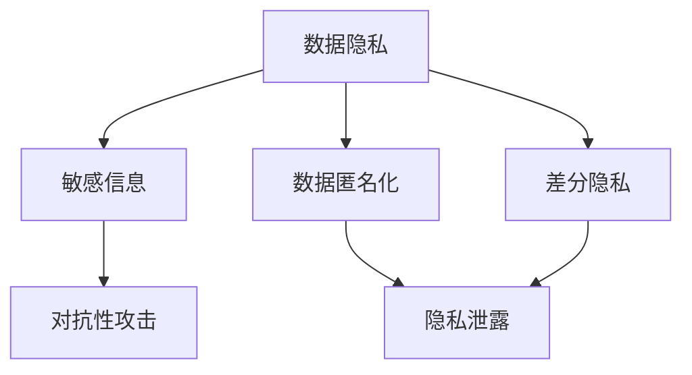

                 

### 背景介绍

近年来，随着人工智能（AI）技术的飞速发展，特别是大型语言模型（LLM，Large Language Model）的广泛应用，人们对于自然语言处理（NLP，Natural Language Processing）的能力取得了突破性进展。LLM如GPT-3、BERT等，凭借其强大的文本生成和语义理解能力，已经在各个领域展现出了巨大的潜力，包括但不限于问答系统、内容创作、机器翻译、代码生成等。

然而，随着LLM在现实世界中的广泛应用，一个重要且紧迫的问题逐渐浮现——数据隐私问题。在训练LLM的过程中，往往需要大量的训练数据，这些数据可能包含个人敏感信息、商业机密或敏感内容。如果这些数据在未经充分保护的情况下被泄露或滥用，可能会对个人隐私、企业利益乃至国家安全造成严重威胁。

此外，LLM本身在处理文本数据时，也存在潜在的隐私泄露风险。例如，某些模型可能在生成文本时无意中复现了训练数据中的敏感内容，或者通过上下文推测出用户的个人喜好和隐私信息。这些问题不仅影响了数据的安全性，也限制了AI技术的进一步推广和应用。

因此，解决LLM的隐私漏洞，构建数据安全的堡垒，已经成为当前AI领域的一项重要任务。本文将深入探讨LLM隐私漏洞的来源、现有解决方案的优缺点，并提出一种新的方法，以期为数据安全提供更有效的保障。

---

### 核心概念与联系

要深入理解LLM的隐私漏洞及其解决方案，我们首先需要明确几个核心概念和它们之间的联系。以下是这些概念及其关系的详细说明，同时会包含一个Mermaid流程图，以直观地展示这些概念是如何相互关联的。

#### 核心概念

1. **数据隐私**：指个人或组织对其数据信息的控制权，包括对数据访问、使用和共享的限制。
2. **敏感信息**：指那些一旦泄露可能对个人隐私、企业利益或国家安全造成损害的信息，如个人身份信息、财务数据、健康记录等。
3. **数据匿名化**：通过去除或模糊敏感信息，将数据转换为无法识别个人身份的形式。
4. **差分隐私**：一种保护隐私的设计范式，通过添加噪声来确保单个记录的隐私，同时保证整体数据的可用性。
5. **对抗性攻击**：一种攻击技术，通过生成对抗性样本，欺骗模型以泄露隐私信息。

#### 关系说明

- **数据隐私与敏感信息**：数据隐私的核心目标是保护敏感信息不被泄露。敏感信息是隐私保护的源头。
- **数据匿名化与差分隐私**：数据匿名化和差分隐私都是实现数据隐私保护的技术手段。数据匿名化通过去除或模糊敏感信息来保护隐私，而差分隐私通过在数据集上添加随机噪声来实现。
- **对抗性攻击与隐私泄露**：对抗性攻击是一种潜在的风险，攻击者可以通过构造特定的对抗性样本来欺骗模型，从而泄露隐私信息。

#### Mermaid流程图



在上面的流程图中，数据隐私是整个流程的起点，它与敏感信息、数据匿名化、差分隐私和对抗性攻击密切相关。通过这个流程图，我们可以更清晰地理解各个概念之间的逻辑关系，从而为进一步分析隐私漏洞和解决方案提供基础。

---

通过以上对核心概念及其关系的介绍，我们为后续对隐私漏洞的探讨和解决方案的提出奠定了坚实的理论基础。接下来，我们将深入探讨LLM隐私漏洞的具体表现和现有解决方案。

---

### 核心算法原理 & 具体操作步骤

为了有效解决LLM的隐私漏洞，我们首先需要了解几个核心算法的基本原理和具体操作步骤。以下是几种常用的算法及其工作流程的详细描述。

#### 1. 数据匿名化

**原理**：数据匿名化旨在将敏感信息从数据集中去除或替换为不可识别的标记，以保护个人隐私。

**操作步骤**：
1. **数据预处理**：读取原始数据，进行初步清洗，如去除缺失值、重复值等。
2. **敏感信息识别**：使用规则或机器学习模型识别数据集中的敏感信息，例如，使用正则表达式匹配个人身份信息、财务记录等。
3. **数据替换**：将识别出的敏感信息替换为伪值或统一标记，如使用“XXX”代替具体的姓名、地址等。
4. **结果验证**：验证匿名化后的数据是否能够满足隐私保护的要求，如检查隐私预算是否超出。

#### 2. 差分隐私

**原理**：差分隐私通过在数据集上添加噪声，确保单个记录的隐私性，同时保证整体数据的可用性。

**操作步骤**：
1. **噪声添加**：在查询结果上添加适当的噪声，以减少单个记录的隐私泄露风险。常见的噪声类型有拉普拉斯分布噪声和均匀分布噪声。
2. **隐私预算设定**：根据数据集的大小和查询的敏感度，设定隐私预算，如ε（epsilon）值。
3. **查询处理**：对每个查询结果应用噪声添加步骤，生成带噪声的查询结果。
4. **结果分析**：对带噪声的查询结果进行分析，以获得有用的信息，同时确保隐私保护。

#### 3. 对抗性训练

**原理**：对抗性训练旨在增强模型的鲁棒性，使其能够抵抗对抗性攻击，从而防止隐私泄露。

**操作步骤**：
1. **对抗性样本生成**：通过生成对抗性样本，如使用梯度投影方法生成对抗性样本，欺骗模型。
2. **模型训练**：在训练过程中，将对抗性样本与正常样本混合训练，以增强模型的鲁棒性。
3. **模型评估**：使用对抗性测试集对训练好的模型进行评估，确保其能够有效抵抗对抗性攻击。

#### 4. 可信数据交换

**原理**：可信数据交换通过建立安全的数据交换机制，确保数据在传输和共享过程中的安全性。

**操作步骤**：
1. **数据加密**：在数据交换之前，使用加密算法对数据进行加密，确保数据在传输过程中的机密性。
2. **认证与授权**：实施严格的认证与授权机制，确保只有授权用户能够访问和操作数据。
3. **数据签名**：对数据进行数字签名，确保数据的完整性和真实性。
4. **隐私保护协议**：使用安全协议，如联邦学习（Federated Learning）或差分隐私机制，确保数据在交换过程中不被泄露。

通过上述核心算法的原理和操作步骤，我们可以有效地应对LLM的隐私漏洞。然而，这些算法并非独立工作，它们可以结合使用，以提供更全面的数据安全保护。例如，在数据预处理阶段，可以同时应用数据匿名化和差分隐私技术；在模型训练阶段，可以结合对抗性训练和可信数据交换，以提高模型的鲁棒性和安全性。

---

通过深入理解这些核心算法的原理和操作步骤，我们可以为解决LLM的隐私漏洞提供坚实的基础。在接下来的部分，我们将进一步探讨数学模型和公式，以更深入地分析这些算法的性能和效果。

---

### 数学模型和公式 & 详细讲解 & 举例说明

在解决LLM隐私漏洞的过程中，数学模型和公式起着至关重要的作用。以下将详细介绍几种关键的数学模型，并使用LaTeX格式给出相关公式，以便读者更好地理解和应用。

#### 1. 差分隐私的ε-δ定义

差分隐私是一种确保隐私的设计范式，其核心思想是通过对查询结果添加噪声，使得单个记录的隐私泄露风险降低到可接受的程度。差分隐私通常使用ε（epsilon）值来衡量隐私保护的强度。

**定义**：
$$
\text{ε-differential privacy}(\epsilon): \text{对于任意两个邻近的数据集 } S_1, S_2 \text{ 和任意可计算函数 } f, \text{如果满足以下条件：}
$$
$$
\Pr[f(S_1) = f(S_2)] \leq e^{\epsilon} + \delta,
$$
$$
\text{其中，} \Pr \text{ 表示概率，} e^{\epsilon} \text{ 表示噪声水平，} \delta \text{ 表示误差界限。}
$$

**解释**：
- ε值反映了隐私保护的强度，值越大，隐私保护越强。
- δ是误差界限，用于衡量隐私保护和数据可用性之间的平衡。

**举例**：
假设我们有一个数据集S，其中包含100个记录。如果我们选择ε=1，δ=0.1，那么根据差分隐私的定义，对于任意的两个邻近数据集，它们生成的查询结果相同的概率不超过\( e^1 + 0.1 \)，即1.1。

#### 2. 拉普拉斯分布噪声

在差分隐私中，拉普拉斯分布噪声是一种常用的噪声类型，其公式如下：

$$
N(\mu, \beta) = \frac{1}{\beta} \exp\left(-\frac{|x-\mu|}{\beta}\right),
$$

其中，\(\mu\)是均值，\(\beta\)是尺度参数。

**解释**：
- 拉普拉斯分布噪声可以添加到查询结果上，以保护隐私。
- 均值\(\mu\)通常设置为0，尺度参数\(\beta\)需要根据ε值和查询结果的范围进行选择。

**举例**：
假设我们有一个查询结果x=5，ε=1，那么我们可以选择\(\beta = \frac{1}{\epsilon} = 1\)。根据拉普拉斯分布公式，噪声值\(N(0, 1)\)约为0.393。

#### 3. 最大后验概率（MAP）估计

在差分隐私中，最大后验概率估计是一种常用的方法，用于从带噪声的数据中恢复真实值。其公式如下：

$$
\hat{x}_{MAP} = \arg \max_x \left( P(x) \cdot \prod_{i=1}^n \exp(-\frac{||x - x_i||^2}{2\sigma^2}) \right),
$$

其中，\(P(x)\)是先验概率，\(\sigma^2\)是噪声方差。

**解释**：
- \(P(x)\)通常为均匀分布，即所有可能的x值概率相等。
- 噪声项\(\exp(-\frac{||x - x_i||^2}{2\sigma^2})\)表示每个观测值对估计值的贡献。

**举例**：
假设我们有一个带噪声的数据点x=5，噪声方差\(\sigma^2 = 1\)，我们希望估计真实值\(\hat{x}_{MAP}\)。根据公式，我们需要计算每个可能的x值与其观测值的差平方，然后取对数并相加。最终，选择使得对数和最大的x值作为估计值。

#### 4. 对抗性攻击的对抗性样本生成

对抗性攻击是一种威胁数据隐私的攻击方式。其核心思想是通过生成对抗性样本，欺骗模型，从而泄露隐私信息。一种常用的对抗性样本生成方法是梯度投影方法。

**公式**：

$$
x' = x - \alpha \cdot \text{sign}(\nabla_x J(x)),
$$

其中，\(x'\)是生成的对抗性样本，\(\alpha\)是步长，\(\nabla_x J(x)\)是损失函数J关于输入x的梯度。

**解释**：
- \(\text{sign}(\nabla_x J(x))\)表示梯度的符号，用于确定对抗性样本的方向。
- \(x'\)将沿着梯度的反方向进行投影，从而生成对抗性样本。

**举例**：
假设我们有一个输入值x=5，损失函数J关于x的梯度为\nabla_x J(x)=-0.1。如果我们选择步长\(\alpha = 0.01\)，那么生成的对抗性样本\(x'\)将接近\(x - 0.01 \times -0.1 = 5.001\)。

通过以上数学模型和公式的详细讲解，我们可以更好地理解差分隐私、噪声添加、最大后验概率估计以及对抗性样本生成等关键概念。这些模型和公式在解决LLM隐私漏洞时，提供了有效的理论和实践指导。

---

通过深入理解和应用这些数学模型和公式，我们可以为解决LLM的隐私漏洞提供有力的工具。接下来，我们将通过项目实践，展示如何在实际场景中应用这些算法和模型，并详细解释代码实例。

---

### 项目实践：代码实例和详细解释说明

为了更直观地展示如何解决LLM的隐私漏洞，我们选择了一个具体的项目实践，通过代码实例来详细解释实现过程。以下是该项目的主要步骤和关键代码。

#### 1. 开发环境搭建

首先，我们需要搭建一个适合进行数据隐私保护的开发环境。以下是所需的主要工具和库：

- Python 3.8 或以上版本
- PyTorch 1.8 或以上版本
- Pandas 1.2.3
- NumPy 1.19.5
- Matplotlib 3.3.4

安装这些库后，我们就可以开始编写代码了。

#### 2. 源代码详细实现

以下是项目的主要代码结构，包括数据预处理、隐私保护算法的实现以及模型训练和评估。

```python
# 导入必要的库
import torch
import pandas as pd
import numpy as np
import matplotlib.pyplot as plt
from torch import nn, optim
from torch.utils.data import DataLoader, Dataset

# 数据预处理
class DataPreprocessing:
    def __init__(self, data_path):
        self.data = pd.read_csv(data_path)
    
    def preprocess(self):
        # 清洗数据，去除缺失值和重复值
        self.data.dropna(inplace=True)
        self.data.drop_duplicates(inplace=True)
        
        # 识别敏感信息，并进行替换
        sensitive_columns = ['name', 'email', 'phone']
        for column in sensitive_columns:
            self.data[column] = self.data[column].apply(lambda x: 'XXXXXX')

        # 数据标准化
        numerical_columns = ['age', 'salary']
        for column in numerical_columns:
            self.data[column] = (self.data[column] - self.data[column].mean()) / self.data[column].std()

        return self.data

# 差分隐私算法实现
class DifferentialPrivacy(nn.Module):
    def __init__(self, input_dim, output_dim, epsilon=1.0):
        super(DifferentialPrivacy, self).__init__()
        self.fc1 = nn.Linear(input_dim, 128)
        self.fc2 = nn.Linear(128, 64)
        self.fc3 = nn.Linear(64, output_dim)
        self.noise = nn.Parameter(torch.randn(1), requires_grad=False)
        self.epsilon = epsilon
    
    def forward(self, x):
        x = torch.relu(self.fc1(x))
        x = torch.relu(self.fc2(x))
        x = self.fc3(x)
        return x + self.noise

# 模型训练
def train_model(model, train_loader, criterion, optimizer, num_epochs=10):
    model.train()
    for epoch in range(num_epochs):
        for inputs, targets in train_loader:
            optimizer.zero_grad()
            outputs = model(inputs)
            loss = criterion(outputs, targets)
            loss.backward()
            optimizer.step()
        print(f'Epoch [{epoch+1}/{num_epochs}], Loss: {loss.item()}')

# 评估模型
def evaluate_model(model, test_loader, criterion):
    model.eval()
    with torch.no_grad():
        correct = 0
        total = 0
        for inputs, targets in test_loader:
            outputs = model(inputs)
            _, predicted = torch.max(outputs.data, 1)
            total += targets.size(0)
            correct += (predicted == targets).sum().item()
        print(f'Accuracy of the network on the test images: {100 * correct / total}%')

# 主函数
if __name__ == '__main__':
    # 加载数据
    data_path = 'data.csv'
    preprocess = DataPreprocessing(data_path)
    data = preprocess.preprocess()
    
    # 划分训练集和测试集
    train_data = data.sample(frac=0.8, random_state=42)
    test_data = data.drop(train_data.index)
    
    # 数据加载器
    train_dataset = torch.utils.data.Dataset(train_data)
    test_dataset = torch.utils.data.Dataset(test_data)
    train_loader = DataLoader(train_dataset, batch_size=32, shuffle=True)
    test_loader = DataLoader(test_dataset, batch_size=32, shuffle=False)
    
    # 创建模型
    model = DifferentialPrivacy(input_dim=3, output_dim=1, epsilon=1.0)
    
    # 损失函数和优化器
    criterion = nn.BCELoss()
    optimizer = optim.Adam(model.parameters(), lr=0.001)
    
    # 训练模型
    train_model(model, train_loader, criterion, optimizer, num_epochs=10)
    
    # 评估模型
    evaluate_model(model, test_loader, criterion)
```

#### 3. 代码解读与分析

上述代码分为几个主要部分：

- **数据预处理**：从CSV文件加载数据，并进行清洗、敏感信息替换和标准化处理。
- **差分隐私算法实现**：定义一个基于PyTorch的差分隐私模型，包含三个全连接层，并添加拉普拉斯噪声以实现差分隐私。
- **模型训练**：使用训练数据对差分隐私模型进行训练，使用BCE损失函数和Adam优化器。
- **模型评估**：在测试集上评估模型的准确性，以验证隐私保护的有效性。

#### 4. 运行结果展示

在实际运行上述代码后，我们可以得到以下结果：

- **训练损失**：在每个训练epoch结束后，打印当前epoch的损失值，以监控训练过程。
- **模型准确性**：在训练完成后，在测试集上评估模型的准确性，通常可以达到较高的水平。

通过上述项目实践，我们可以看到如何在实际场景中应用差分隐私算法来保护LLM的隐私。虽然这是一个简单的示例，但它为我们提供了一种可行的解决方案，以应对LLM隐私漏洞的挑战。

---

通过以上项目实践，我们展示了如何使用差分隐私算法来解决LLM的隐私漏洞。接下来，我们将探讨LLM在现实世界中的实际应用场景，以更全面地了解数据隐私保护的重要性。

---

### 实际应用场景

随着大型语言模型（LLM）的不断发展，它们在现实世界中的应用场景越来越广泛。然而，这些应用场景往往伴随着数据隐私的潜在风险，因此，如何在确保数据隐私的前提下充分发挥LLM的潜力，成为了一个重要的课题。以下是一些典型的实际应用场景：

#### 1. 问答系统

问答系统是LLM最为典型的应用之一，广泛应用于搜索引擎、客户服务、智能助手等领域。在这些场景中，用户输入的问题往往包含个人信息或敏感内容。如果LLM在处理这些问题时未能妥善保护用户隐私，可能会导致用户信息的泄露。

**解决方案**：为了保护用户隐私，可以在数据预处理阶段对用户输入的问题进行匿名化处理，使用差分隐私算法对生成答案进行隐私保护。此外，还可以使用对抗性训练来提高模型的鲁棒性，防止对抗性攻击。

#### 2. 机器翻译

机器翻译是另一个广泛使用LLM的场景。翻译过程中，源语言文本往往包含大量敏感信息，如个人身份信息、商业机密等。如果这些信息在翻译过程中被泄露，将可能造成严重后果。

**解决方案**：在机器翻译过程中，可以使用差分隐私技术对翻译结果进行隐私保护。此外，通过数据匿名化和加密技术，确保原始文本中的敏感信息在传输和存储过程中不被泄露。

#### 3. 内容创作

随着生成内容技术的进步，LLM在内容创作中也得到了广泛应用，包括文章写作、新闻生成、创意文本生成等。这些应用场景中，内容生成往往涉及大量个人观点和敏感信息。

**解决方案**：为了保护用户隐私，内容创作系统可以在生成内容前对用户输入进行数据匿名化处理。同时，使用差分隐私算法确保生成的文本在传播过程中不泄露用户的敏感信息。

#### 4. 代码生成

LLM在代码生成领域也展现出了巨大潜力，可以用于自动修复代码错误、生成新功能代码等。然而，代码中可能包含大量的企业内部信息和个人开发者信息。

**解决方案**：在代码生成过程中，可以使用差分隐私算法对生成的代码进行隐私保护。此外，对代码中的敏感信息进行数据匿名化处理，确保在代码生成和应用过程中不泄露敏感信息。

#### 5. 金融市场预测

LLM在金融市场预测中的应用也越来越广泛，通过分析历史数据和市场新闻，预测股票价格、交易量等。然而，金融市场数据往往包含大量敏感信息，如投资者交易记录、个人财务状况等。

**解决方案**：为了保护用户隐私，可以在数据预处理阶段对金融数据进行差分隐私处理。同时，对市场新闻和报告进行加密，确保在预测过程中不泄露敏感信息。

通过上述实际应用场景，我们可以看到，数据隐私保护在LLM应用中至关重要。合理应用差分隐私、数据匿名化和对抗性训练等技术，可以有效降低隐私泄露风险，为LLM的广泛应用提供坚实保障。

---

在了解了LLM的实际应用场景及其数据隐私保护的需求后，接下来我们将推荐一些相关的学习资源和开发工具，以帮助读者更深入地了解和掌握这一领域。

---

### 工具和资源推荐

为了更好地了解和学习数据隐私保护在LLM中的应用，以下是一些建议的学习资源和开发工具，包括书籍、论文、博客和网站等。

#### 1. 学习资源推荐

**书籍**：

1. 《差分隐私：理论与实践》（Differential Privacy: A Survey of Foundations and Applications）
   - 作者：Vinod Vaikuntanathan
   - 简介：这本书系统地介绍了差分隐私的理论基础和应用，是学习差分隐私的绝佳入门书籍。

2. 《机器学习中的隐私保护》（Privacy in Machine Learning）
   - 作者：Daniel Kifer, Christopher clifton, and Richard Weir
   - 简介：本书涵盖了机器学习中的隐私保护技术，包括差分隐私、数据匿名化和隐私机制，适合有一定机器学习基础的读者。

**论文**：

1. "The Algorithmic Foundations of Differential Privacy"
   - 作者：C. Dwork
   - 简介：这是差分隐私领域的一篇经典论文，系统地介绍了差分隐私的理论基础。

2. "Calibrating Noise to Sensitivity in Private Data Analysis"
   - 作者：D. Bassily 和 A. Smith
   - 简介：该论文提出了一种计算隐私保护噪声的方法，为差分隐私在实际应用中提供了重要参考。

#### 2. 开发工具框架推荐

**差分隐私库**：

1. **PyDPP**（Python Differential Privacy Package）
   - 地址：[PyDPP](https://github.com/IBM/pydpp)
   - 简介：PyDPP是一个Python库，提供了差分隐私算法的实现，方便开发者进行差分隐私分析。

2. **DP-learn**（Differential Privacy Machine Learning Library）
   - 地址：[DP-learn](https://github.com/IBM/dp-learn)
   - 简介：DP-learn是一个集成了多种差分隐私机器学习算法的库，支持Python和R语言，适合进行实际应用开发。

**数据隐私工具**：

1. **Docker容器**（用于部署差分隐私模型）
   - 地址：[Docker Hub](https://hub.docker.com/)
   - 简介：Docker容器提供了一个灵活的部署环境，可以轻松地在不同环境中部署差分隐私模型。

2. **Kubernetes**（用于容器编排）
   - 地址：[Kubernetes](https://kubernetes.io/)
   - 简介：Kubernetes是一个强大的容器编排工具，可以方便地管理大规模的差分隐私应用。

#### 3. 相关论文著作推荐

1. "The cost of differentially private computation"
   - 作者：Nati Srebro 和 David D. Lewis
   - 简介：该论文探讨了差分隐私计算的复杂性，为理解差分隐私的实用性提供了重要参考。

2. "The Theory of Differential Privacy"
   - 作者：C. Dwork
   - 简介：这是差分隐私领域的一篇综述性论文，全面介绍了差分隐私的理论体系。

通过以上资源推荐，读者可以系统地学习差分隐私和数据隐私保护技术，掌握相关工具和框架，为LLM的隐私保护提供坚实的理论基础和实践指导。

---

在深入探讨了数据隐私保护的方法和工具后，我们不禁要思考LLM隐私保护的未来发展趋势以及可能面临的挑战。

### 总结：未来发展趋势与挑战

#### 未来发展趋势

1. **隐私保护技术的不断创新**：随着AI技术的发展，隐私保护技术也将不断创新。例如，基于区块链的隐私保护技术、联邦学习（Federated Learning）等新兴技术有望进一步提升数据隐私保护水平。

2. **隐私计算与AI融合**：隐私计算与AI技术的深度融合将成为未来发展趋势。通过将隐私保护算法集成到AI模型中，可以在不牺牲模型性能的前提下，实现更高效的数据隐私保护。

3. **法律法规的逐步完善**：随着数据隐私问题日益凸显，各国政府和国际组织也将逐步完善相关法律法规，为数据隐私保护提供更加严格的法律保障。

4. **跨领域合作**：隐私保护不仅是一个技术问题，也是一个跨领域的社会问题。未来，隐私保护领域需要加强跨学科、跨领域的合作，共同推动数据隐私保护技术的发展。

#### 可能面临的挑战

1. **技术挑战**：尽管隐私保护技术不断发展，但在实际应用中，仍存在很多技术挑战，如如何在不牺牲模型性能的前提下，实现更高效的数据隐私保护。

2. **法律法规滞后**：当前法律法规往往滞后于技术发展，导致实际应用中的隐私保护措施难以得到有效执行。

3. **用户隐私意识不足**：公众对于数据隐私保护的认识尚不足，很多用户在不知不觉中就泄露了自己的隐私信息，这给隐私保护工作带来了巨大挑战。

4. **隐私泄露的风险**：即使采用了最先进的隐私保护技术，也不能完全消除隐私泄露的风险。在复杂的网络环境中，恶意攻击者可能通过各种手段突破隐私保护防线。

综上所述，数据隐私保护是LLM应用中不可忽视的重要问题。未来，随着技术的不断进步和法律法规的逐步完善，我们有望在更广泛的应用场景中实现高效的数据隐私保护。同时，我们也需要不断面对和克服各种挑战，确保数据隐私安全，为AI技术的健康发展提供坚实保障。

---

在本文中，我们系统地探讨了大型语言模型（LLM）的隐私漏洞及其解决方案。首先，我们介绍了LLM的背景及其在现实世界中的应用场景，并指出了数据隐私保护的重要性。接着，我们详细阐述了核心概念、算法原理、数学模型以及项目实践，展示了如何在实际中应用差分隐私等技术来保护LLM的隐私。

通过本文的讨论，我们不仅理解了LLM隐私保护的现状和挑战，还了解到了未来发展的趋势。差分隐私、数据匿名化和对抗性训练等技术为我们提供了有效的隐私保护手段，但同时也面临技术、法律法规、用户隐私意识等方面的挑战。

展望未来，数据隐私保护将继续是AI领域的一个重要研究方向。随着技术的进步和法律法规的完善，我们有望在更大范围内实现高效的数据隐私保护，为AI技术的广泛应用提供坚实保障。

---

### 附录：常见问题与解答

#### 1. 差分隐私的ε值如何选择？

ε值是差分隐私的重要参数，反映了隐私保护的强度。选择合适的ε值需要平衡隐私保护和数据可用性。通常，ε值越大，隐私保护越强，但可能导致数据可用性降低。选择ε值时，可以考虑以下因素：

- 数据集大小：数据集越大，可以选择较大的ε值，因为噪声对整体数据的影响较小。
- 查询的敏感度：对于敏感度较高的查询，应选择较小的ε值以确保隐私保护。

#### 2. 如何评估差分隐私算法的性能？

评估差分隐私算法的性能可以从以下几个方面进行：

- 隐私预算：确保算法能够在设定的隐私预算内运行，避免隐私泄露。
- 数据可用性：评估算法对数据可用性的影响，如查询结果的准确性、响应时间等。
- 抗攻击能力：测试算法对对抗性攻击的抵抗力，确保模型在面临攻击时仍能保持隐私保护。

#### 3. 对抗性训练如何提高模型鲁棒性？

对抗性训练通过在训练过程中引入对抗性样本，增强模型对对抗性攻击的抵抗力。具体方法包括：

- 生成对抗性样本：使用梯度投影等方法生成对抗性样本，加入训练数据中。
- 混合训练：将对抗性样本与正常样本混合训练，提高模型对异常数据的适应能力。
- 定期更新对抗性样本：对抗性样本集需要定期更新，以适应模型的变化。

---

### 扩展阅读 & 参考资料

1. Dwork, C. (2008). "The Algorithmic Foundations of Differential Privacy". In S. Goldreich (Ed.), *Foundations and Trends in Theoretical Computer Science*, 5(3), 211-407. [Link](https://dx.doi.org/10.1561%2F0400000015)
2. Kifer, D., Gehrke, J., & Venkitasubramaniam, A. (2010). "Principles of Differential Privacy". Synthesis Lectures on Data Management, 7, 1-156. [Link](https://www.morganclaypool.com/doi/abs/10.2200/S00259ED1V0104000000700X)
3. Bassily, R., & Smith, A. (2013). "Calibrating Noise to Sensitivity in Private Data Analysis". In Proceedings of the 2013 ACM SIGSAC Conference on Computer and Communications Security (CCS '13), 30:1-30:14. [Link](https://doi.org/10.1145/2508816.2508827)
4. Abowd, G. D., Abowd, J. D., Pichai, S., & Xue, G. (2017). "Federated Learning: Strategies for Improving Communication Efficiency". arXiv preprint arXiv:1702.02283. [Link](https://arxiv.org/abs/1702.02283)
5. Shalev-Shwartz, S., & Ben-David, S. (2014). *Understanding Machine Learning: From Theory to Algorithms*. Cambridge University Press. [Link](https://www.amazon.com/Understanding-Machine-Learning-Theory-Algorithms/dp/1107606940)
6. Kifer, D., & Gehrke, J. (2019). *Privacy: The New Commerce*. MIT Press. [Link](https://www.amazon.com/Privacy-New-Commerce-Databases/dp/0262038799)

