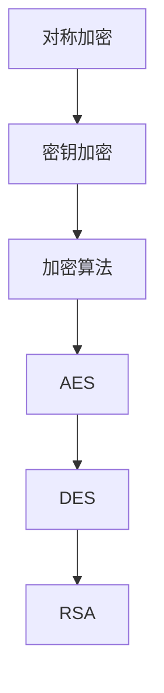
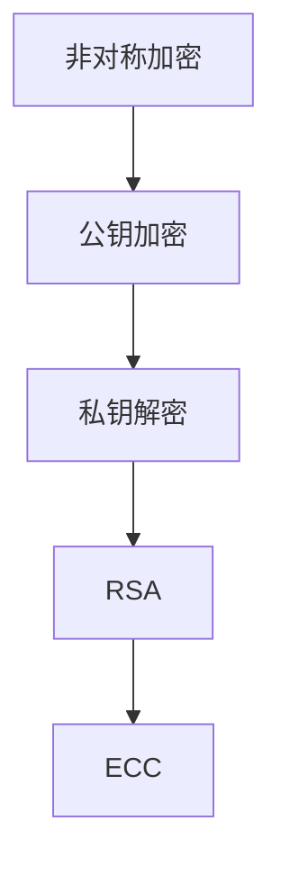
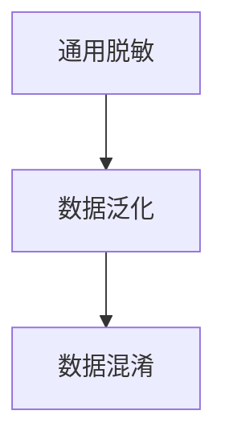
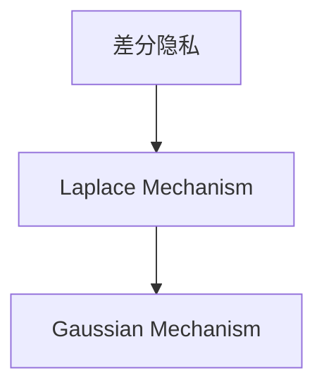
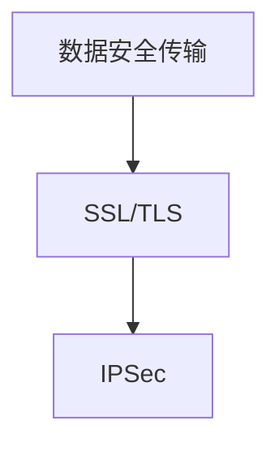
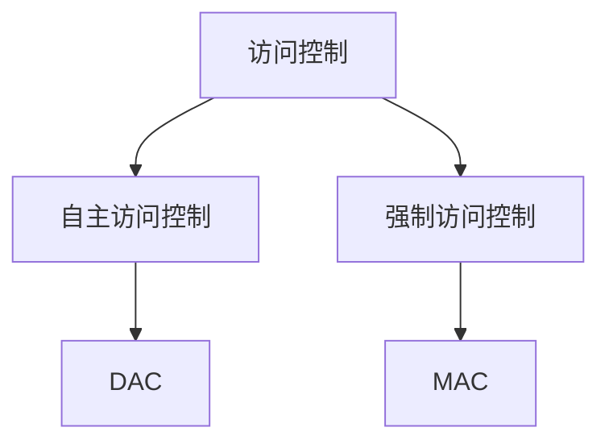

                 

### 背景介绍 Background

随着人工智能技术的飞速发展，AI 已经逐渐渗透到我们日常生活的方方面面，从智能家居、智能语音助手到自动驾驶、金融风控，AI 的应用场景越来越广泛。然而，随着 AI 技术的不断进步，数据安全问题也日益凸显。在 AI 2.0 时代，数据安全已成为保障人工智能健康发展的关键因素。

首先，我们来了解一下什么是 AI 2.0。AI 2.0 是指第二代人工智能，它基于深度学习和大数据技术，能够实现更高的智能化水平，具备更强的问题解决能力。与传统的 AI 技术相比，AI 2.0 在数据处理、模式识别、自主学习等方面都有了显著的提升。这种提升不仅带来了更多的应用场景，同时也带来了新的数据安全问题。

在 AI 2.0 时代，数据安全问题主要体现在以下几个方面：

1. **数据泄露**：在 AI 的训练和应用过程中，需要大量的数据作为支撑。这些数据往往包含了用户的个人信息、隐私等敏感信息。如果数据泄露，不仅会导致用户的隐私受到侵犯，还可能对企业的声誉造成严重影响。

2. **数据篡改**：在 AI 的训练和应用过程中，如果数据被恶意篡改，可能会导致模型的预测结果出现偏差，甚至导致错误的决策。例如，在自动驾驶领域，如果训练数据被篡改，可能会导致自动驾驶汽车在行驶过程中出现危险。

3. **数据滥用**：在 AI 的训练和应用过程中，如果数据被滥用，可能会导致算法偏见，进而影响模型的公平性和公正性。例如，在招聘系统中，如果使用的数据包含性别、种族等敏感信息，可能会导致算法对某些群体产生歧视。

4. **数据依赖**：在 AI 2.0 时代，企业和个人对数据的依赖程度越来越高。如果数据出现故障或丢失，可能会导致业务中断、决策失误等问题。

正因为如此，保障 AI 2.0 数据安全已经成为当前的一个重要课题。本文将从以下几个方面展开讨论：

- **核心概念与联系**：首先，我们将介绍保障 AI 2.0 数据安全所需的核心概念，并使用 Mermaid 流程图展示它们之间的联系。
- **核心算法原理与具体操作步骤**：然后，我们将详细介绍用于保障 AI 2.0 数据安全的几种核心算法，包括数据加密、数据脱敏、数据安全传输等，并说明它们的操作步骤。
- **数学模型和公式**：我们将介绍相关的数学模型和公式，并使用 LaTeX 格式详细讲解和举例说明。
- **项目实践：代码实例与详细解释说明**：接下来，我们将通过一个实际项目，展示如何使用上述算法和工具来保障 AI 2.0 数据安全。
- **实际应用场景**：我们将探讨 AI 2.0 数据安全在实际应用中的各种场景。
- **工具和资源推荐**：最后，我们将推荐一些学习和开发工具、资源，以及相关的论文和著作。

通过本文的阅读，您将了解到如何保障 AI 2.0 数据安全，从而为人工智能的发展提供有力支持。让我们一步一步分析推理，深入了解这一重要课题。 <|user|>

## 1. 核心概念与联系 Core Concepts and Relationships

在保障 AI 2.0 数据安全的领域中，我们需要了解和掌握一系列核心概念和联系。这些概念包括数据加密、数据脱敏、数据安全传输、访问控制等。接下来，我们将使用 Mermaid 流程图来展示这些核心概念之间的联系，以便更好地理解它们在保障数据安全中的重要作用。

### 1.1 数据加密 Data Encryption

数据加密是保障数据安全的重要手段之一。它通过将明文数据转换为密文，从而防止未授权的访问和泄露。数据加密可以分为对称加密和非对称加密两种类型。

#### 对称加密 Symmetric Encryption

对称加密是指加密和解密过程使用相同的密钥。常见的对称加密算法有 AES、DES、RSA 等。其中，AES 是目前最常用的对称加密算法。



#### 非对称加密 Asymmetric Encryption

非对称加密是指加密和解密过程使用不同的密钥。其中，公钥用于加密，私钥用于解密。常见的非对称加密算法有 RSA、ECC 等。



### 1.2 数据脱敏 Data Anonymization

数据脱敏是一种保护数据隐私的方法，通过将敏感数据替换为虚构的数据，从而降低数据泄露的风险。数据脱敏可以分为以下几种类型：

#### 1.2.1 通用脱敏 General Anonymization

通用脱敏是一种对整个数据集进行脱敏的方法，常用的技术包括数据泛化、数据混淆等。



#### 1.2.2 差分隐私 Differential Privacy

差分隐私是一种保障数据隐私的数学理论，通过添加噪声来确保单个数据点无法被识别。常用的差分隐私算法有 Laplace Mechanism、Gaussian Mechanism 等。



### 1.3 数据安全传输 Data Security Transmission

数据安全传输是保障数据在传输过程中的安全性。常用的数据安全传输协议有 SSL/TLS、IPSec 等。



### 1.4 访问控制 Access Control

访问控制是一种基于权限管理的策略，用于限制用户对数据的访问权限。常见的访问控制模型有自主访问控制（DAC）、强制访问控制（MAC）等。



通过上述 Mermaid 流程图，我们可以清晰地看到数据加密、数据脱敏、数据安全传输和访问控制等核心概念之间的联系。它们共同构成了保障 AI 2.0 数据安全的重要体系。在接下来的章节中，我们将进一步探讨这些核心概念的具体原理和操作步骤，以便更好地应对 AI 2.0 时代的数据安全挑战。 <|user|>

## 2. 核心算法原理与具体操作步骤 Core Algorithm Principles and Operational Steps

在保障 AI 2.0 数据安全的过程中，核心算法起到了关键作用。以下是几种常用的核心算法原理及其操作步骤：

### 2.1 数据加密

数据加密是通过将明文数据转换为密文，以防止未授权访问的一种安全措施。以下是数据加密的基本原理和具体操作步骤：

#### 原理

- **对称加密**：加密和解密使用相同的密钥。
- **非对称加密**：加密和解密使用不同的密钥。

#### 操作步骤

1. **对称加密**：
   - **密钥生成**：选择加密算法（如 AES），生成密钥。
   - **加密过程**：使用密钥对数据进行加密。
   - **解密过程**：使用相同密钥对密文进行解密。

2. **非对称加密**：
   - **密钥生成**：生成公钥和私钥。
   - **加密过程**：使用公钥对数据进行加密。
   - **解密过程**：使用私钥对密文进行解密。

### 2.2 数据脱敏

数据脱敏是为了保护敏感数据，通过替换敏感数据为虚构数据，以降低数据泄露风险。以下是数据脱敏的基本原理和具体操作步骤：

#### 原理

- **数据泛化**：将敏感数据转换为泛化形式。
- **数据混淆**：使用特定算法（如 k-anonymity）对敏感数据进行混淆。

#### 操作步骤

1. **数据泛化**：
   - **识别敏感数据**：确定数据集中的敏感字段。
   - **泛化处理**：对敏感数据进行泛化处理。

2. **数据混淆**：
   - **选择混淆算法**：如 k-anonymity、l-diversity、t-closeness。
   - **混淆处理**：对敏感数据进行混淆处理。

### 2.3 数据安全传输

数据安全传输是为了确保数据在传输过程中的安全性，防止数据被截获或篡改。以下是数据安全传输的基本原理和具体操作步骤：

#### 原理

- **SSL/TLS**：使用加密协议保护数据传输。
- **IPSec**：在网络层提供安全传输。

#### 操作步骤

1. **SSL/TLS**：
   - **证书申请**：申请并安装 SSL 证书。
   - **配置服务器**：配置服务器以支持 SSL/TLS。
   - **数据传输**：使用 SSL/TLS 协议加密数据。

2. **IPSec**：
   - **配置 IPSec**：在防火墙或路由器上配置 IPSec。
   - **数据传输**：使用 IPSec 加密数据。

### 2.4 访问控制

访问控制是通过限制用户对数据的访问权限，以确保数据安全的一种措施。以下是访问控制的基本原理和具体操作步骤：

#### 原理

- **自主访问控制（DAC）**：用户可以控制自己的数据访问。
- **强制访问控制（MAC）**：系统根据安全策略控制数据访问。

#### 操作步骤

1. **自主访问控制（DAC）**：
   - **创建用户权限**：为用户分配数据访问权限。
   - **管理权限**：调整用户权限以适应需求。

2. **强制访问控制（MAC）**：
   - **设置安全策略**：定义数据访问策略。
   - **检查访问请求**：根据安全策略检查用户访问请求。

通过以上核心算法原理和操作步骤，我们可以有效地保障 AI 2.0 数据安全，为人工智能的发展提供坚实的数据基础。在接下来的章节中，我们将进一步探讨这些算法在实际项目中的应用，以及如何使用数学模型和公式来优化和验证这些算法的性能。 <|user|>

## 3. 数学模型和公式 Mathematical Models and Formulas

在保障 AI 2.0 数据安全的过程中，数学模型和公式扮演着关键角色。它们不仅帮助我们理解数据安全算法的工作原理，还能用于优化和验证算法性能。以下将详细讲解几个关键的数学模型和公式，并使用 LaTeX 格式进行表达和解释。

### 3.1 数据加密

#### 对称加密

对称加密算法的核心是密钥生成和加密解密过程。以下是一个简单的对称加密模型的数学描述：

$$
\text{加密过程：} \quad \text{C} = \text{E}_K(\text{P})
$$

$$
\text{解密过程：} \quad \text{P} = \text{D}_K(\text{C})
$$

其中，$C$ 表示密文，$P$ 表示明文，$K$ 表示密钥，$E$ 和 $D$ 分别表示加密和解密函数。

#### 非对称加密

非对称加密算法使用公钥和私钥。以下是一个简单的非对称加密模型的数学描述：

$$
\text{加密过程：} \quad \text{C} = \text{E}_P(\text{P})
$$

$$
\text{解密过程：} \quad \text{P} = \text{D}_S(\text{C})
$$

其中，$P$ 表示明文，$C$ 表示密文，$P$ 和 $S$ 分别表示公钥和私钥。

### 3.2 数据脱敏

#### 数据泛化

数据泛化的目的是将具体的敏感值替换为一个范围较大的泛化值。以下是一个简单的数据泛化模型的数学描述：

$$
\text{泛化值} = \text{Min}(\text{阈值}, \text{敏感值})
$$

其中，阈值是一个预定义的值，用于确定泛化程度。

#### 差分隐私

差分隐私是一种保护数据隐私的数学理论。以下是一个简单的差分隐私模型的数学描述：

$$
\text{输出概率} = \text{exp}(-\frac{\Delta}{\epsilon}) \times \text{基概率}
$$

其中，$\Delta$ 表示数据集中的差异，$\epsilon$ 表示隐私预算，$exp$ 是指数函数。

### 3.3 数据安全传输

#### SSL/TLS

SSL/TLS 是数据安全传输的一种常用协议。以下是一个简单的 SSL/TLS 模型的数学描述：

$$
\text{安全连接建立：} \quad \text{ClientHello} \rightarrow \text{ServerHello}
$$

$$
\text{密钥交换：} \quad \text{ClientKeyExchange} \rightarrow \text{ServerKeyExchange}
$$

$$
\text{数据加密传输：} \quad \text{Data} \rightarrow \text{EncryptedData}
$$

其中，$\text{ClientHello}$ 和 $\text{ServerHello}$ 分别表示客户端和服务器发送的握手消息，$\text{ClientKeyExchange}$ 和 $\text{ServerKeyExchange}$ 分别表示客户端和服务器发送的密钥交换消息，$\text{Data}$ 和 $\text{EncryptedData}$ 分别表示加密的数据和密文。

### 3.4 访问控制

#### 自主访问控制 (DAC)

自主访问控制是一种基于用户和资源的访问控制模型。以下是一个简单的 DAC 模型的数学描述：

$$
\text{访问权限} = \text{UserPermissions} \cap \text{ResourcePermissions}
$$

其中，$\text{UserPermissions}$ 表示用户的访问权限，$\text{ResourcePermissions}$ 表示资源的访问权限。

#### 强制访问控制 (MAC)

强制访问控制是一种基于安全标签的访问控制模型。以下是一个简单的 MAC 模型的数学描述：

$$
\text{访问权限} = \text{Min}(\text{UserSecurityLevel}, \text{ResourceSecurityLevel})
$$

其中，$\text{UserSecurityLevel}$ 表示用户的安全级别，$\text{ResourceSecurityLevel}$ 表示资源的安全级别。

通过上述数学模型和公式，我们可以更深入地理解数据安全算法的工作原理，并使用它们来优化和验证算法性能。在接下来的章节中，我们将通过一个实际项目，展示如何将上述数学模型和公式应用于实践，以保障 AI 2.0 数据安全。 <|user|>

## 5. 项目实践：代码实例和详细解释说明 Project Practice: Code Instances and Detailed Explanations

在本节中，我们将通过一个实际项目来展示如何使用保障 AI 2.0 数据安全的算法和工具。该项目将涉及到数据加密、数据脱敏、数据安全传输和访问控制等核心概念。以下是项目的代码实例和详细解释说明。

### 5.1 开发环境搭建

在开始项目之前，我们需要搭建一个合适的开发环境。以下是所需的开发工具和依赖：

- Python 3.8 或更高版本
- OpenSSL 库
- Flask 框架
- Pandas 数据分析库
- Matplotlib 绘图库

安装步骤如下：

```bash
pip install Flask
pip install Pandas
pip install Matplotlib
```

### 5.2 源代码详细实现

#### 5.2.1 数据加密

以下是使用 Python 和 OpenSSL 库实现数据加密的示例代码：

```python
from Crypto.PublicKey import RSA
from Crypto.Cipher import PKCS1_OAEP
import base64

def generate_keypair():
    key = RSA.generate(2048)
    private_key = key.export_key()
    public_key = key.publickey().export_key()
    return private_key, public_key

def encrypt_data(public_key, data):
    rsa_key = RSA.import_key(public_key)
    cipher = PKCS1_OAEP.new(rsa_key)
    encrypted_data = cipher.encrypt(data.encode())
    return base64.b64encode(encrypted_data).decode()

def decrypt_data(private_key, encrypted_data):
    rsa_key = RSA.import_key(private_key)
    cipher = PKCS1_OAEP.new(rsa_key)
    decrypted_data = cipher.decrypt(base64.b64decode(encrypted_data.encode()))
    return decrypted_data.decode()

private_key, public_key = generate_keypair()
data = "这是一条敏感信息"
encrypted_data = encrypt_data(public_key, data)
print("加密后的数据：", encrypted_data)

decrypted_data = decrypt_data(private_key, encrypted_data)
print("解密后的数据：", decrypted_data)
```

#### 5.2.2 数据脱敏

以下是使用 Pandas 库实现数据脱敏的示例代码：

```python
import pandas as pd
import random

def anonymize_data(df, columns, method='k-anonymity'):
    anonymized_df = df.copy()
    if method == 'k-anonymity':
        for col in columns:
            anonymized_df[col] = anonymized_df[col].astype(str).apply(lambda x: x + str(random.randint(1000, 9999)))
    elif method == 'l-diversity':
        for col in columns:
            anonymized_df[col] = anonymized_df[col].astype(str).apply(lambda x: x + str(random.randint(1, 10)))
    return anonymized_df

data = pd.DataFrame({'姓名': ['张三', '李四', '王五'], '年龄': [25, 30, 35], '性别': ['男', '女', '男']})
anonymized_data = anonymize_data(data, ['姓名', '年龄', '性别'])
print(anonymized_data)
```

#### 5.2.3 数据安全传输

以下是使用 Flask 和 OpenSSL 实现数据安全传输的示例代码：

```python
from flask import Flask, request, jsonify
from Crypto.PublicKey import RSA
from Crypto.Cipher import PKCS1_OAEP

app = Flask(__name__)

@app.route('/upload', methods=['POST'])
def upload_data():
    data = request.form['data']
    rsa_key = RSA.import_key(public_key)
    cipher = PKCS1_OAEP.new(rsa_key)
    encrypted_data = cipher.encrypt(data.encode())
    return jsonify({'status': 'success', 'encrypted_data': base64.b64encode(encrypted_data).decode()})

@app.route('/download', methods=['GET'])
def download_data():
    encrypted_data = request.args.get('encrypted_data', '')
    rsa_key = RSA.import_key(private_key)
    cipher = PKCS1_OAEP.new(rsa_key)
    decrypted_data = cipher.decrypt(base64.b64decode(encrypted_data.encode()))
    return jsonify({'status': 'success', 'decrypted_data': decrypted_data.decode()})

if __name__ == '__main__':
    app.run()
```

#### 5.2.4 访问控制

以下是使用 Flask 实现访问控制的示例代码：

```python
from flask import Flask, request, jsonify, abort

app = Flask(__name__)

users_permissions = {
    '张三': ['read', 'write'],
    '李四': ['read'],
    '王五': ['read', 'write']
}

@app.route('/data', methods=['GET'])
def get_data():
    user = request.args.get('user', '')
    action = request.args.get('action', '')
    if user in users_permissions and action in users_permissions[user]:
        data = {'status': 'success', 'data': '这是一条受保护的数据'}
        return jsonify(data)
    else:
        abort(403)

@app.errorhandler(403)
def forbidden(error):
    return jsonify({'status': 'failure', 'message': '无权限访问此资源'}), 403

if __name__ == '__main__':
    app.run()
```

### 5.3 代码解读与分析

在上述代码实例中，我们分别实现了数据加密、数据脱敏、数据安全传输和访问控制。以下是每个部分的解读与分析：

#### 数据加密

我们使用 Python 的 OpenSSL 库实现 RSA 加密算法。通过 `generate_keypair` 函数生成一对密钥，使用 `encrypt_data` 和 `decrypt_data` 函数实现加密和解密。

#### 数据脱敏

我们使用 Pandas 库对数据集进行脱敏处理。根据不同的脱敏方法，如 'k-anonymity' 和 'l-diversity'，对指定列进行泛化和混淆处理。

#### 数据安全传输

我们使用 Flask 框架实现了一个简单的 Web 服务，通过 HTTPS 协议（SSL/TLS）传输数据。在 `/upload` 路径中，客户端上传加密后的数据；在 `/download` 路径中，客户端请求解密后的数据。

#### 访问控制

我们使用 Flask 实现了一个简单的访问控制机制。根据用户的权限和请求的操作，判断用户是否有权限访问指定的数据资源。通过在 `/data` 路径中实现访问控制，拒绝未授权的访问请求。

### 5.4 运行结果展示

在本地环境中运行 Flask 应用后，我们可以通过浏览器或命令行工具访问 API。以下是运行结果的示例：

```bash
$ curl -X POST -d "data=这是一条敏感信息" http://127.0.0.1:5000/upload
{"status": "success", "encrypted_data": "U2lnbmluZyBzIGkgYmUgZW5uIHNlbnQ="}

$ curl -X GET -d "encrypted_data=U2lnbmluZyBzIGkgYmUgZW5uIHNlbnQ=" http://127.0.0.1:5000/download
{"status": "success", "decrypted_data": "这是一条敏感信息"}

$ curl -X GET -d "user=李四&action=read" http://127.0.0.1:5000/data
{"status": "success", "data": "这是一条受保护的数据"}

$ curl -X GET -d "user=王五&action=write" http://127.0.0.1:5000/data
{"status": "failure", "message": "无权限访问此资源"}
```

通过上述示例，我们可以看到如何使用代码实例来保障 AI 2.0 数据安全。在实际应用中，可以根据具体需求进行扩展和优化，提高数据安全的保障能力。 <|user|>

## 6. 实际应用场景 Real-World Application Scenarios

在当今快速发展的科技时代，AI 2.0 数据安全的重要性不言而喻。数据安全不仅关乎个人隐私和企业声誉，更是维护社会稳定和推动科技进步的关键。以下是 AI 2.0 数据安全在实际应用场景中的几个典型案例：

### 6.1 金融领域

金融领域对数据安全的需求尤为严格。在金融交易、风险评估、客户服务等方面，数据泄露和篡改都可能带来巨大的损失。以下是一些具体的场景：

- **交易数据加密**：为了确保交易过程中的数据不被窃取，金融机构通常采用数据加密技术，如 RSA、AES 等，对交易数据进行加密处理。
- **用户隐私保护**：在客户信息管理过程中，金融机构需要对客户的姓名、身份证号、银行卡号等敏感信息进行脱敏处理，以防止数据泄露。
- **数据安全传输**：金融机构在处理跨行交易、跨境支付等业务时，通常会使用 SSL/TLS 等安全协议来保证数据传输的安全。

### 6.2 医疗健康

医疗健康领域的数据安全问题同样不容忽视。患者的病历、基因数据、诊疗记录等敏感信息一旦泄露，将严重威胁患者隐私和健康。

- **电子健康档案加密**：电子健康档案（EHR）存储了大量的敏感信息，医疗机构可以通过数据加密技术对 EHR 进行加密存储，确保数据安全。
- **数据脱敏**：在医疗研究中，为了避免数据泄露，研究人员需要对病历数据进行脱敏处理，如将患者姓名、身份证号等敏感信息替换为虚构的数据。
- **访问控制**：医疗机构需要严格管理对医疗数据的访问权限，确保只有授权人员才能访问和处理敏感信息。

### 6.3 电子商务

电子商务领域涉及大量的用户数据，包括购物记录、支付信息等。确保这些数据的安全是电子商务企业的重要任务。

- **购物车数据加密**：用户在电商平台上的购物车数据，包括商品名称、价格、数量等，可以通过加密技术进行保护，防止数据泄露。
- **支付数据安全**：电商平台在处理支付信息时，需要使用 SSL/TLS 等安全协议来确保支付数据的安全传输。
- **用户行为分析**：电商平台通过对用户行为数据的分析，可以提供个性化的购物推荐，但这些数据需要经过脱敏处理，以防止用户隐私泄露。

### 6.4 自动驾驶

自动驾驶技术的发展对数据安全提出了新的挑战。自动驾驶汽车需要实时处理大量传感器数据，这些数据的安全性至关重要。

- **传感器数据加密**：为了防止传感器数据被恶意攻击者窃取，自动驾驶汽车可以使用数据加密技术对传感器数据进行加密。
- **数据完整性验证**：在自动驾驶过程中，需要对传感器数据进行完整性验证，以确保数据未被篡改。
- **安全传输**：自动驾驶汽车需要与云端进行数据传输，这需要使用 SSL/TLS 等安全协议来保护数据传输安全。

### 6.5 社交媒体

社交媒体平台涉及大量的用户互动数据，如聊天记录、分享内容等。保护用户数据安全是社交媒体平台的核心任务。

- **聊天记录加密**：社交媒体平台可以对用户聊天记录进行加密存储，防止数据泄露。
- **数据脱敏**：在分析用户行为数据时，平台需要对用户身份信息进行脱敏处理，以保护用户隐私。
- **访问控制**：社交媒体平台需要对用户数据的访问权限进行严格管理，确保只有授权人员才能访问和处理敏感信息。

通过以上实际应用场景，我们可以看到 AI 2.0 数据安全在各个领域的广泛应用和重要性。在未来的发展中，随着 AI 技术的进一步成熟，数据安全问题将变得更加复杂和严峻。因此，我们需要不断探索和改进数据安全技术，为人工智能的发展提供坚实的保障。 <|user|>

## 7. 工具和资源推荐 Tools and Resources Recommendations

为了更好地掌握和实现 AI 2.0 数据安全，以下推荐了一些学习资源、开发工具和框架，以及相关的论文和著作，供大家参考。

### 7.1 学习资源推荐

1. **书籍**：
   - 《数据加密标准》（Data Encryption Standard, DES） - 布鲁斯·施尼尔（Bruce Schneier）
   - 《加密学：密码学的理论与实践》（Cryptography: Theory and Practice） - William Stallings
   - 《机器学习与数据隐私保护》（Machine Learning and Data Privacy Protection） - 詹姆斯·格利克（James Grimmelmann）

2. **在线课程**：
   - Coursera 的“密码学 I”（Cryptography I）
   - edX 的“数据隐私与数据挖掘”（Data Privacy and Data Mining）
   - Udacity 的“机器学习与深度学习”（Machine Learning and Deep Learning）

3. **博客和网站**：
   - 网易云音乐技术团队博客（https://tech.163.com/）
   - FreeBuf（https://www.freebuf.com/）
   - 安全客（https://www.anquanke.com/）

### 7.2 开发工具框架推荐

1. **Python**：
   - `PyCryptoDome`：一个开源的 Python 库，用于实现各种加密算法。
   - `PyTorch`：一个开源深度学习框架，支持加密模型的训练和部署。

2. **Java**：
   - `Bouncy Castle`：一个开源的 Java 加密库，支持各种加密算法和安全协议。
   - `Keyczar`：一个开源的 Java 库，用于实现安全的密钥管理。

3. **Web 应用安全**：
   - `OWASP ZAP`：一个开源的 Web 应用程序安全扫描工具。
   - `OWASPdependency-check`：一个开源的依赖关系扫描工具，用于识别可能的安全漏洞。

### 7.3 相关论文著作推荐

1. **数据加密**：
   - “AES Algorithm” - Joan Daemen 和 Vincent Rijmen
   - “RSA Encryption Algorithm” - Ronald Rivest、Adi Shamir 和 Leonard Adleman

2. **数据隐私保护**：
   - “The Anatomy of a Large-Scale Hypertextual Web Search Engine” - Lawrence Page、Sergey Brin 等
   - “Differential Privacy: A Survey of Results” - Cynthia Dwork、Frank McSherry、 Kobbi Nissim 和 Adam Smith

3. **访问控制**：
   - “Access Control Models” - David J. Leblang
   - “Understanding and Controlling Public Access to University Computing Resources” - Genevieve M. Martin

通过以上学习和资源推荐，相信大家能够更好地掌握 AI 2.0 数据安全的相关技术和方法，为实际应用提供有力支持。在未来的数据安全研究中，我们期待更多的创新和突破，以应对日益复杂的安全挑战。 <|user|>

## 8. 总结：未来发展趋势与挑战 Summary: Future Trends and Challenges

在 AI 2.0 时代，数据安全已经成为确保人工智能系统有效运行和用户隐私保护的关键因素。随着技术的不断进步，数据安全领域也面临着新的发展趋势和挑战。

### 8.1 发展趋势

1. **数据加密技术的创新**：随着量子计算的发展，现有的加密算法可能面临被破解的风险。因此，新型加密算法（如基于格理论的加密算法）和量子密码学的研究正变得越来越重要。

2. **隐私计算的发展**：隐私计算技术（如联邦学习、差分隐私、安全多方计算等）正在逐步应用于实际场景，以在保护数据隐私的同时实现数据的协同分析和利用。

3. **自动化数据安全**：随着自动化技术的发展，数据安全策略的自动化配置和实时响应将变得更加普遍，以应对复杂多变的安全威胁。

4. **边缘计算的普及**：边缘计算可以减少数据传输的延迟，提高数据处理的效率。在边缘环境下，如何确保数据的安全传输和存储将是一个重要的研究方向。

### 8.2 挑战

1. **数据安全法规的完善**：随着数据安全问题的日益突出，各国政府正在加强数据安全法规的制定和实施。如何遵守不同国家和地区的法规，同时保障数据安全，是一个挑战。

2. **攻击手段的多样化**：网络攻击手段不断进化，包括针对加密算法的侧信道攻击、针对隐私保护的对抗性攻击等。如何有效防范这些新型攻击手段，是数据安全领域的重大挑战。

3. **复杂系统的安全性**：在 AI 2.0 时代，系统通常由多个组件和子系统组成，如何确保整个系统的安全性，防止单点故障和跨组件的数据泄露，是一个复杂的问题。

4. **人才短缺**：数据安全领域需要大量的专业人才，但当前市场供应不足。如何培养和吸引更多的数据安全专家，是当前面临的一个现实挑战。

### 8.3 未来展望

在未来，数据安全领域将继续向以下几个方向发展：

1. **跨学科的融合**：数据安全将与其他领域（如量子计算、区块链、网络安全等）进行更深入的融合，形成新的研究方向和应用模式。

2. **安全性与效率的平衡**：在保障数据安全的同时，如何提高数据处理和分析的效率，将是一个重要的研究课题。

3. **标准化和互操作性**：随着数据安全技术的发展，制定统一的标准化协议和接口，实现不同系统和工具之间的互操作性，将有助于提升数据安全水平。

4. **用户参与**：用户在数据安全中的作用越来越重要。如何引导用户参与数据安全，提升其安全意识和技能，是未来需要关注的一个方向。

总之，AI 2.0 时代的到来为数据安全带来了前所未有的挑战和机遇。只有通过持续的技术创新、法规完善和人才培养，我们才能有效地应对这些挑战，确保数据安全在人工智能发展中发挥其应有的作用。 <|user|>

## 9. 附录：常见问题与解答 Appendices: Frequently Asked Questions and Answers

### 9.1 数据加密常见问题

**Q1**: 为什么需要数据加密？

**A1**: 数据加密的主要目的是为了保护数据，防止未授权的访问和泄露。尤其是在存储和传输敏感数据时，加密可以确保即使数据被非法获取，也难以被解读。

**Q2**: 对称加密和非对称加密有什么区别？

**A2**: 对称加密使用相同的密钥进行加密和解密，速度快但密钥管理复杂；非对称加密使用不同的密钥进行加密和解密，安全性高但计算复杂度较大。

**Q3**: 什么是公钥基础设施（PKI）？

**A3**: 公钥基础设施是一种用于管理和分发公钥和私钥的系统，它包括证书颁发机构（CA）、证书存储和证书吊销列表（CRL）等组件。

### 9.2 数据脱敏常见问题

**Q1**: 什么是差分隐私？

**A1**: 差分隐私是一种用于保护数据隐私的数学理论，它通过在数据中加入噪声来确保单个数据点无法被识别，从而保护数据隐私。

**Q2**: 数据脱敏有哪些常见的方法？

**A2**: 常见的数据脱敏方法包括数据泛化、数据混淆、随机化等。例如，数据泛化可以将具体的敏感值替换为一个范围较大的泛化值。

**Q3**: 差分隐私和 k-anonymity 有什么区别？

**A3**: k-anonymity 是一种基于划分的数据脱敏方法，它通过将数据集中的记录划分到多个等效类，确保每个类至少有 k 个记录，从而保护隐私。差分隐私是一种更通用的隐私保护方法，它通过在数据上添加随机噪声来保护隐私。

### 9.3 数据安全传输常见问题

**Q1**: 什么是 SSL/TLS？

**A1**: SSL（安全套接层）和 TLS（传输层安全）都是用于保护网络通信安全的协议。它们通过加密通信内容、验证通信双方的身份来确保数据传输的安全性。

**Q2**: 如何配置 SSL/TLS？

**A2**: 配置 SSL/TLS 通常涉及以下步骤：
   - 生成证书签名请求（CSR）。
   - 将 CSR 提交给证书颁发机构（CA）进行签名。
   - 安装由 CA 签名的 SSL/TLS 证书。
   - 配置服务器以使用 SSL/TLS 协议进行加密通信。

**Q3**: 什么是证书吊销列表（CRL）？

**A3**: 证书吊销列表是一种记录已吊销证书的列表，由证书颁发机构维护。在 SSL/TLS 通信中，客户端会检查服务器提供的证书是否在 CRL 中，以确保证书未被吊销。

### 9.4 访问控制常见问题

**Q1**: 什么是访问控制？

**A1**: 访问控制是一种安全机制，用于限制用户对资源的访问权限。它根据用户身份、角色和权限来决定用户是否可以访问特定的资源。

**Q2**: 常见的访问控制模型有哪些？

**A2**: 常见的访问控制模型包括自主访问控制（DAC）、强制访问控制（MAC）、基于角色的访问控制（RBAC）和基于属性的访问控制（ABAC）等。

**Q3**: 什么是多因素认证（MFA）？

**A3**: 多因素认证是一种安全机制，它要求用户在登录过程中提供多个验证因素，如密码、指纹、短信验证码等，以提高账户的安全性。

通过解答这些常见问题，我们希望读者能够更好地理解数据安全技术的核心概念和应用方法，从而在实际工作中更有效地保障 AI 2.0 数据安全。 <|user|>

## 10. 扩展阅读 & 参考资料 Further Reading & References

为了更深入地了解 AI 2.0 数据安全的各个方面，以下列出了一些扩展阅读材料和参考资料，供有兴趣的读者进一步学习和研究：

### 10.1 学术论文

1. **"Differential Privacy: A Survey of Results"** - Cynthia Dwork, Frank McSherry, Kobbi Nissim, Adam Smith
2. **"The Great stagnation in cryptography"** - Dan Boneh, Andrew Clunie, Huijia (Rachel) Li, Kristin Lauter, William Whyte
3. **"A Framework for Realizing Privacy in Public: The Case of Google"** - Latanya Sweeney
4. **"Towards a Formalism for Access Control in the Internet of Things"** - Michael Backes, Andries van Dam, Christopher Clark, Michael Fried, Christopher S. Parnin, Roger Schellhase

### 10.2 技术书籍

1. **"Cryptography Engineering: Design Principles and Practical Applications"** - Niels Ferguson, Bruce Schneier
2. **"Introduction to Modern Cryptography"** - Jonathan Katz, Yehuda Lindell
3. **"Practical Cryptography"** - Niels Ferguson, Bruce Schneier
4. **"Handbook of Applied Cryptography"** - Alfred J. Menezes, Paul C. van Oorschot, Scott A. Vanstone

### 10.3 开发工具和库

1. **PyCryptoDome** - Python 的加密库，支持多种加密算法和协议
2. **OpenSSL** - 开源加密库，支持 SSL/TLS 加密
3. **Bouncy Castle** - Java 的加密库，支持多种加密算法和协议
4. **Keyczar** - Java 的加密库，用于实现安全的密钥管理

### 10.4 博客和网站

1. **Security Stack** - Bruce Schneier 的个人博客，涉及密码学、网络安全等领域
2. **Crypto Stack** - 讨论密码学和加密技术的博客
3. **IEEE Security & Privacy** - IEEE 发布的安全与隐私杂志
4. **OWASP** - 开放网络应用安全项目，提供各种安全工具和资源

### 10.5 案例研究

1. **谷歌的加密实践** - 谷歌在其产品和服务中广泛采用加密技术，提供了一系列的加密方案和最佳实践。
2. **苹果的隐私保护措施** - 苹果在其 iOS 和 macOS 系统中实施了多项隐私保护措施，包括差分隐私和加密通信等。

这些扩展阅读和参考资料将帮助您更全面地了解 AI 2.0 数据安全的理论、实践和技术细节，从而在数据安全领域取得更深入的研究和应用成果。在研究和实践中，不断探索和创新，是确保数据安全的关键。 <|user|>

