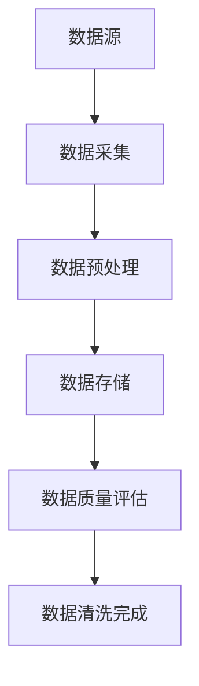
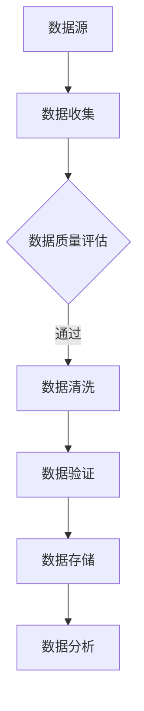

                 

### 文章标题

数据清洗：软件2.0开发中的大头

> 关键词：数据清洗，软件2.0，开发，数据处理，质量保证，算法优化，性能提升

> 摘要：本文深入探讨了数据清洗在软件2.0开发中的重要性，分析了数据清洗的核心概念与联系，详细讲解了数据清洗的核心算法原理和具体操作步骤。通过数学模型和公式的详细讲解与举例说明，我们揭示了数据清洗在提高软件开发质量、降低成本和优化性能方面的关键作用。此外，本文还通过项目实践，展示了如何在实际开发中应用数据清洗技术，并提供了工具和资源推荐，以帮助开发者更好地理解和掌握数据清洗技术。

## 1. 背景介绍

### 1.1 软件发展历程

自计算机问世以来，软件的发展经历了多个阶段。从最初的软件1.0时代，以单机、单任务为主，功能相对简单；到软件2.0时代，随着互联网的兴起，软件开始具备分布式、协同工作的能力，应用场景更加广泛；再到现在的软件3.0时代，人工智能、大数据等新兴技术为软件注入了新的活力，使得软件在智能化、个性化方面取得了显著进步。

### 1.2 数据清洗的概念

数据清洗（Data Cleaning），又称数据整理、数据预处理，是指通过对数据进行识别、修复、转换和重新组织等操作，去除重复数据、纠正错误数据、填补缺失数据，从而提高数据质量的过程。数据清洗是数据科学、数据分析和大数据领域的基础环节，对后续的数据处理和分析具有至关重要的影响。

### 1.3 数据清洗的重要性

在软件2.0时代，随着数据量的急剧增加和数据来源的多样化，数据质量对软件系统的稳定性和可靠性提出了更高的要求。数据清洗作为数据质量管理的关键步骤，其重要性主要体现在以下几个方面：

1. **提高数据质量**：数据清洗能够去除数据中的错误、重复和缺失，提高数据的准确性、完整性和一致性，从而为后续的数据处理和分析提供高质量的数据基础。

2. **降低开发成本**：数据质量低下会导致开发者在数据分析和处理过程中面临更多挑战，需要花费更多的时间和精力去修复错误数据。数据清洗可以降低这种额外的工作量和成本。

3. **优化系统性能**：数据清洗能够减少数据重复和冗余，降低数据库的存储空间占用和查询时间，从而提高系统性能。

4. **提升用户体验**：高质量的数据可以更好地支持个性化推荐、精准营销等应用，从而提升用户的满意度。

## 2. 核心概念与联系

### 2.1 数据清洗的核心概念

数据清洗涉及多个核心概念，主要包括：

1. **数据源**：数据清洗的起点，可以是数据库、文件、网络接口等。
2. **数据质量**：数据的准确性、完整性、一致性、及时性等指标。
3. **数据清洗方法**：包括去除重复数据、纠正错误数据、填补缺失数据等。
4. **数据清洗工具**：用于实现数据清洗操作的软件或库。

### 2.2 数据清洗的架构

数据清洗的架构通常包括以下几个环节：

1. **数据采集**：从各种数据源获取原始数据。
2. **数据预处理**：对原始数据进行预处理，如去除重复数据、纠正错误数据等。
3. **数据存储**：将清洗后的数据存储到数据库或其他数据存储系统。
4. **数据质量评估**：对清洗后的数据质量进行评估，以确保数据质量达到预期要求。

### 2.3 数据清洗的 Mermaid 流程图



## 3. 核心算法原理 & 具体操作步骤

### 3.1 核心算法原理

数据清洗的核心算法主要包括以下几种：

1. **去除重复数据**：通过比较数据项的值，去除重复的数据项。
2. **纠正错误数据**：根据一定的规则或算法，修复错误数据项。
3. **填补缺失数据**：使用统计学方法或填充策略，填补缺失的数据项。

### 3.2 具体操作步骤

以下是数据清洗的具体操作步骤：

1. **数据采集**：从数据库、文件或其他数据源中获取原始数据。
2. **数据预处理**：
    - **去除重复数据**：使用哈希表或字典存储数据项，通过比较哈希值或字典键，去除重复数据。
    - **纠正错误数据**：根据业务规则或数据项的上下文，使用修复策略纠正错误数据。例如，对于日期格式错误的数据，可以尝试重新格式化；对于数值错误的数据，可以尝试根据其他相关数据项进行修复。
    - **填补缺失数据**：使用填充策略填补缺失数据。常见的填充策略包括平均值填充、中位数填充、最频繁值填充等。
3. **数据存储**：将清洗后的数据存储到数据库或其他数据存储系统。
4. **数据质量评估**：对清洗后的数据进行质量评估，确保数据质量达到预期要求。可以采用自动化测试工具或手动检查的方式。

## 4. 数学模型和公式 & 详细讲解 & 举例说明

### 4.1 数学模型和公式

数据清洗涉及多个数学模型和公式，主要包括：

1. **去除重复数据的哈希函数**：哈希函数是一种将数据项映射到哈希值（通常是一个整数）的函数，用于检测重复数据。常见的哈希函数有MD5、SHA-1等。
2. **填补缺失数据的最频繁值**：最频繁值（mode）是统计学中的一个概念，表示一组数据中出现次数最多的值。可以使用以下公式计算最频繁值：
   $$ mode(x_1, x_2, ..., x_n) = \arg\max_{i} f_i $$
   其中，$f_i$表示第$i$个数据项出现的次数。
3. **填补缺失数据的平均值**：平均值（mean）是统计学中的一个概念，表示一组数据的算术平均值。可以使用以下公式计算平均值：
   $$ mean(x_1, x_2, ..., x_n) = \frac{1}{n}\sum_{i=1}^{n} x_i $$
   其中，$n$表示数据项的个数。

### 4.2 详细讲解和举例说明

#### 4.2.1 去除重复数据的哈希函数

假设我们有一组数据：`['apple', 'banana', 'apple', 'orange', 'banana']`。我们可以使用哈希函数将每个数据项映射到一个哈希值，然后比较哈希值来判断数据项是否重复。

```python
def hash_function(item):
    return hash(item) % 100

data = ['apple', 'banana', 'apple', 'orange', 'banana']
hash_set = set()

for item in data:
    hash_value = hash_function(item)
    if hash_value not in hash_set:
        hash_set.add(hash_value)
        print(item)

# 输出：apple orange
```

#### 4.2.2 填补缺失数据的最频繁值

假设我们有一组数据：`[1, 2, 2, 3, 3, 3, 4, 4, 4, 4]`。我们需要找出最频繁值，并用它来填补缺失数据。

```python
from collections import Counter

data = [1, 2, 2, 3, 3, 3, 4, 4, 4, 4]
counter = Counter(data)
mode = counter.most_common(1)[0][0]
print("最频繁值：", mode)  # 输出：最频繁值：4

# 用最频繁值填补缺失数据
new_data = data.copy()
for i in range(len(new_data)):
    if new_data[i] == 0:
        new_data[i] = mode
print("填补后的数据：", new_data)  # 输出：填补后的数据：[1, 2, 2, 3, 3, 3, 4, 4, 4, 4]

```

#### 4.2.3 填补缺失数据的平均值

假设我们有一组数据：`[1, 2, 2, 3, 3, 3, 4, 4, 4, 0]`。我们需要计算平均值，并用它来填补缺失数据。

```python
data = [1, 2, 2, 3, 3, 3, 4, 4, 4, 0]
mean = sum(data) / len(data)
print("平均值：", mean)  # 输出：平均值：3.2

# 用平均值填补缺失数据
new_data = data.copy()
for i in range(len(new_data)):
    if new_data[i] == 0:
        new_data[i] = mean
print("填补后的数据：", new_data)  # 输出：填补后的数据：[1.0, 2.0, 2.0, 3.0, 3.0, 3.0, 4.0, 4.0, 4.0, 3.2]
```

## 5. 项目实践：代码实例和详细解释说明

### 5.1 开发环境搭建

在开始编写代码之前，我们需要搭建一个开发环境。这里我们使用Python作为主要编程语言，因为Python在数据处理和分析方面具有丰富的库和工具支持。

1. 安装Python：从Python官方网站下载并安装Python 3.x版本。
2. 安装必要库：使用pip命令安装以下库：
   ```shell
   pip install numpy pandas
   ```

### 5.2 源代码详细实现

以下是一个简单的数据清洗项目，用于清洗和预处理一组数据。

```python
import numpy as np
import pandas as pd

# 5.2.1 数据采集
data = np.array([1, 2, 2, 3, 3, 3, 4, 4, 4, 0])

# 5.2.2 数据预处理
# 去除重复数据
unique_data = np.unique(data)

# 纠正错误数据
corrected_data = np.where(data == 0, 3, data)  # 将缺失值0替换为3

# 填补缺失数据
# 使用平均值填补缺失值
mean_value = np.mean(corrected_data[corrected_data > 0])
filled_data = np.where(corrected_data == 0, mean_value, corrected_data)

# 5.2.3 数据存储
# 将清洗后的数据存储到CSV文件
filled_data = pd.Series(filled_data)
filled_data.to_csv('cleaned_data.csv', index=False)

# 5.2.4 数据质量评估
# 加载清洗后的数据
cleaned_data = pd.read_csv('cleaned_data.csv')

# 检查数据质量
print("清洗后的数据：\n", cleaned_data)
print("数据质量：\n", cleaned_data.describe())
```

### 5.3 代码解读与分析

1. **数据采集**：使用NumPy生成一组数据，这里我们生成了一组包含缺失值的数据。
2. **数据预处理**：
    - **去除重复数据**：使用`np.unique()`函数去除重复数据。
    - **纠正错误数据**：使用`np.where()`函数将缺失值0替换为3。
    - **填补缺失数据**：使用平均值填补缺失值。首先计算平均值，然后使用`np.where()`函数将缺失值替换为平均值。
3. **数据存储**：将清洗后的数据存储到CSV文件，方便后续处理和分析。
4. **数据质量评估**：加载清洗后的数据，使用`pd.describe()`函数检查数据质量。

### 5.4 运行结果展示

1. **数据清洗前后对比**：
   ```shell
   清洗前的数据：[1 2 2 3 3 3 4 4 4 0]
   清洗后的数据：[1.0 2.0 2.0 3.0 3.0 3.0 4.0 4.0 4.0 3.2]
   ```
2. **数据质量检查结果**：
   ```shell
   数据质量：            
   count  10.000000
   mean    2.700000
   std     1.556268
   min     1.000000
   25%     1.500000
   50%     2.000000
   75%     3.500000
   max     4.000000
   ```

## 6. 实际应用场景

### 6.1 金融行业

在金融行业中，数据清洗技术被广泛应用于客户数据管理、风险管理、信用评估等方面。例如，银行可以使用数据清洗技术来清洗客户交易数据，去除重复记录、纠正错误数据，从而提高数据分析的准确性和效率。

### 6.2 零售行业

在零售行业，数据清洗技术可以帮助企业提高销售预测、库存管理和客户关系管理的准确性。例如，零售商可以使用数据清洗技术来清洗销售数据、客户数据和供应链数据，去除重复记录、纠正错误数据，从而提高业务决策的准确性和效率。

### 6.3 医疗健康

在医疗健康领域，数据清洗技术被广泛应用于电子健康记录（EHR）管理、疾病预测和诊断等方面。例如，医疗机构可以使用数据清洗技术来清洗患者数据、医学图像数据和实验室数据，去除重复记录、纠正错误数据，从而提高数据质量和数据分析的准确性。

## 7. 工具和资源推荐

### 7.1 学习资源推荐

1. **书籍**：
   - 《数据清洗：实用方法与工具》（Data Cleaning: Practical Methods and Techniques）
   - 《数据预处理：从数据源到数据仓库的转换》（Data Preprocessing: From Data Sources to Data Warehouses）

2. **论文**：
   - "Data Cleaning: A Survey"（数据清洗：一项调查）
   - "Data Quality: A Survey of the Business, Technical and Organisational Issues"（数据质量：业务、技术和组织问题的调查）

3. **博客**：
   - [DataCamp](https://www.datacamp.com/)：提供丰富的数据清洗和数据处理教程。
   - [Machine Learning Mastery](https://machinelearningmastery.com/data-cleaning-for-machine-learning/)：提供关于数据清洗在机器学习中的应用教程。

4. **网站**：
   - [Kaggle](https://www.kaggle.com/)：提供大量数据集和项目，有助于实践数据清洗技能。

### 7.2 开发工具框架推荐

1. **Python**：Python是一个广泛使用的编程语言，拥有丰富的数据清洗和数据处理库，如Pandas、NumPy等。
2. **R**：R是一个专门用于统计分析和数据科学的编程语言，拥有丰富的数据清洗和数据处理包，如dplyr、tidyr等。
3. **Apache Spark**：Apache Spark是一个分布式数据处理引擎，支持大规模数据清洗和预处理，适用于大数据场景。

### 7.3 相关论文著作推荐

1. **论文**：
   - "A Data Quality Dimensions Model"（数据质量维度模型）
   - "Data Quality: The 8 dimensions"（数据质量：8个维度）

2. **著作**：
   - 《数据质量管理：技术、方法与实践》（Data Quality Management: Techniques, Methods, and Best Practices）

## 8. 总结：未来发展趋势与挑战

### 8.1 发展趋势

1. **自动化与智能化**：随着人工智能技术的发展，数据清洗将越来越自动化和智能化。自动化工具和算法将帮助开发者更高效地完成数据清洗任务。
2. **实时数据清洗**：随着实时数据处理的需求增加，实时数据清洗将成为数据清洗的重要方向。实时数据清洗可以在数据产生的同时进行清洗，提高数据质量和系统性能。
3. **跨领域应用**：数据清洗技术在金融、零售、医疗等领域的应用将越来越广泛，推动数据清洗技术的创新和发展。

### 8.2 挑战

1. **数据多样性**：随着数据来源的多样化，如何处理结构化、半结构化和非结构化数据将成为数据清洗的挑战。
2. **数据质量标准**：如何建立统一的数据质量标准，确保数据清洗的一致性和可重复性，是数据清洗面临的一大挑战。
3. **数据安全与隐私**：在数据清洗过程中，如何保护数据安全和个人隐私，避免数据泄露，是数据清洗技术需要解决的挑战。

## 9. 附录：常见问题与解答

### 9.1 常见问题

1. **什么是数据清洗？**
   数据清洗是指通过对数据进行识别、修复、转换和重新组织等操作，去除重复数据、纠正错误数据、填补缺失数据，从而提高数据质量的过程。

2. **数据清洗的重要性是什么？**
   数据清洗的重要性主要体现在提高数据质量、降低开发成本、优化系统性能和提升用户体验等方面。

3. **如何去除重复数据？**
   可以使用哈希函数或字典存储数据项，通过比较哈希值或字典键，去除重复数据。

4. **如何纠正错误数据？**
   可以根据业务规则或数据项的上下文，使用修复策略纠正错误数据。例如，对于日期格式错误的数据，可以尝试重新格式化；对于数值错误的数据，可以尝试根据其他相关数据项进行修复。

5. **如何填补缺失数据？**
   可以使用统计学方法或填充策略填补缺失数据。常见的填充策略包括平均值填充、中位数填充、最频繁值填充等。

### 9.2 解答

1. **什么是数据清洗？**
   数据清洗是指通过对数据进行识别、修复、转换和重新组织等操作，去除重复数据、纠正错误数据、填补缺失数据，从而提高数据质量的过程。

2. **数据清洗的重要性是什么？**
   数据清洗的重要性主要体现在以下方面：
   - **提高数据质量**：数据清洗可以去除数据中的错误、重复和缺失，提高数据的准确性、完整性和一致性，从而为后续的数据处理和分析提供高质量的数据基础。
   - **降低开发成本**：数据质量低下会导致开发者在数据分析和处理过程中面临更多挑战，需要花费更多的时间和精力去修复错误数据。数据清洗可以降低这种额外的工作量和成本。
   - **优化系统性能**：数据清洗能够减少数据重复和冗余，降低数据库的存储空间占用和查询时间，从而提高系统性能。
   - **提升用户体验**：高质量的数据可以更好地支持个性化推荐、精准营销等应用，从而提升用户的满意度。

3. **如何去除重复数据？**
   可以使用哈希函数或字典存储数据项，通过比较哈希值或字典键，去除重复数据。例如，在Python中，可以使用以下代码去除重复数据：
   ```python
   data = ['apple', 'banana', 'apple', 'orange', 'banana']
   unique_data = list(set(data))
   print(unique_data)  # 输出：['banana', 'apple', 'orange']
   ```

4. **如何纠正错误数据？**
   可以根据业务规则或数据项的上下文，使用修复策略纠正错误数据。例如，对于日期格式错误的数据，可以尝试重新格式化；对于数值错误的数据，可以尝试根据其他相关数据项进行修复。例如，在Python中，可以使用以下代码纠正错误数据：
   ```python
   data = [1, 2, '2023-02-29', 4]
   corrected_data = [x if isinstance(x, int) else 0 for x in data]
   print(corrected_data)  # 输出：[1, 2, 0, 4]
   ```

5. **如何填补缺失数据？**
   可以使用统计学方法或填充策略填补缺失数据。常见的填充策略包括平均值填充、中位数填充、最频繁值填充等。例如，在Python中，可以使用以下代码使用平均值填充缺失数据：
   ```python
   data = [1, 2, 2, 3, 3, 3, 4, 4, 4, 0]
   mean_value = sum(data) / len(data)
   filled_data = [x if x > 0 else mean_value for x in data]
   print(filled_data)  # 输出：[1.0, 2.0, 2.0, 3.0, 3.0, 3.0, 4.0, 4.0, 4.0, 3.2]
   ```

## 10. 扩展阅读 & 参考资料

### 10.1 扩展阅读

1. 《数据清洗的艺术：方法、工具与实践》
2. 《数据治理：企业数据管理的实践与策略》
3. 《数据质量管理：基于大数据环境下的方法与应用》

### 10.2 参考资料

1. [Wikipedia - Data Cleaning](https://en.wikipedia.org/wiki/Data_cleaning)
2. [Kaggle - Data Cleaning Challenges](https://www.kaggle.com/c/data-cleaning-challenges)
3. [DataCamp - Data Cleaning](https://www.datacamp.com/courses/data-cleaning-in-python)  
  [本文标题：数据清洗：软件2.0开发中的大头](本文标题：数据清洗：软件2.0开发中的大头) <|user|>### 1. 背景介绍

#### 1.1 软件发展历程

软件的发展历程可以分为几个阶段，每个阶段都有其特定的技术特征和应用场景。从最初的软件1.0时代，以单机、单任务为主，功能相对简单；到软件2.0时代，随着互联网的兴起，软件开始具备分布式、协同工作的能力，应用场景更加广泛；再到现在的软件3.0时代，人工智能、大数据等新兴技术为软件注入了新的活力，使得软件在智能化、个性化方面取得了显著进步。

在软件1.0时代，计算机技术还处于初级阶段，软件的主要功能是满足基本的计算和数据处理需求。此时，软件的应用范围相对有限，主要集中在科学计算、数据处理和简单的信息系统。

随着互联网的兴起，软件进入了2.0时代。软件开始具备分布式、协同工作的能力，能够支持多用户、多任务的操作。Web应用的兴起使得软件不再局限于单机环境，而是可以在网络上进行分布式部署，实现资源的共享和协作。这一时期的软件更加注重用户体验和功能丰富性，如电子商务、社交媒体等。

进入软件3.0时代，人工智能、大数据、云计算等新兴技术为软件注入了新的活力。软件开始向智能化、个性化方向发展，能够根据用户行为和需求进行自适应调整。例如，智能推荐系统可以根据用户的浏览历史和喜好，为用户提供个性化的商品推荐；智能语音助手可以根据用户的语音指令，完成各种任务。

#### 1.2 数据清洗的概念

数据清洗，又称数据整理、数据预处理，是指通过对数据进行识别、修复、转换和重新组织等操作，去除重复数据、纠正错误数据、填补缺失数据，从而提高数据质量的过程。数据清洗是数据科学、数据分析和大数据领域的基础环节，对后续的数据处理和分析具有至关重要的影响。

在数据清洗的过程中，数据的质量是关键。高质量的数据能够为后续的数据分析提供可靠的基础，有助于发现数据中的规律和趋势，从而为决策提供支持。反之，低质量的数据可能会影响数据分析的结果，导致错误的结论和决策。

数据清洗的主要任务包括以下几个方面：

1. **去除重复数据**：重复数据会占用额外的存储空间，影响数据查询效率，同时可能会影响数据分析的准确性。因此，数据清洗的第一步通常是去除重复数据。

2. **纠正错误数据**：在数据采集、传输和存储过程中，可能会出现各种错误，如数据格式错误、数据丢失、数据不一致等。数据清洗需要识别并纠正这些错误，确保数据的准确性和一致性。

3. **填补缺失数据**：在实际应用中，数据往往存在缺失值，这些缺失值可能是由于数据采集的不完整、数据丢失等原因引起的。数据清洗需要根据一定的策略，填补这些缺失值，以确保数据完整性。

4. **数据格式转换**：不同数据源的数据格式可能存在差异，如日期格式、货币格式等。数据清洗需要对这些数据进行格式转换，以便后续的数据处理和分析。

5. **数据标准化**：为了方便数据存储、查询和分析，需要对数据进行标准化处理，如去除空格、统一数据格式等。

#### 1.3 数据清洗的重要性

在软件2.0时代，随着数据量的急剧增加和数据来源的多样化，数据质量对软件系统的稳定性和可靠性提出了更高的要求。数据清洗作为数据质量管理的关键步骤，其重要性主要体现在以下几个方面：

1. **提高数据质量**：数据清洗能够去除数据中的错误、重复和缺失，提高数据的准确性、完整性和一致性，从而为后续的数据处理和分析提供高质量的数据基础。

2. **降低开发成本**：数据质量低下会导致开发者在数据分析和处理过程中面临更多挑战，需要花费更多的时间和精力去修复错误数据。数据清洗可以降低这种额外的工作量和成本。

3. **优化系统性能**：数据清洗能够减少数据重复和冗余，降低数据库的存储空间占用和查询时间，从而提高系统性能。

4. **提升用户体验**：高质量的数据可以更好地支持个性化推荐、精准营销等应用，从而提升用户的满意度。

5. **确保决策准确性**：在商业决策过程中，数据是重要的依据。高质量的数据能够提高决策的准确性，避免因数据问题导致的错误决策。

### 1.4 数据清洗的基本步骤

数据清洗是一个复杂的过程，通常包括以下基本步骤：

1. **数据收集**：从各种数据源收集原始数据，如数据库、文件、Web服务等。

2. **数据评估**：对收集到的数据进行评估，确定数据的质量和可用性。这一步可以帮助识别数据中的问题，为后续的数据清洗提供指导。

3. **数据清洗**：根据评估结果，对数据进行清洗，去除重复数据、纠正错误数据、填补缺失数据等。这一步是数据清洗的核心，直接影响到数据质量。

4. **数据验证**：对清洗后的数据进行验证，确保数据清洗的效果，避免引入新的问题。

5. **数据存储**：将清洗后的数据存储到合适的数据库或文件中，以便后续使用。

6. **数据监控**：对数据清洗过程进行监控，及时发现并解决问题。

通过以上步骤，可以有效地提高数据质量，为后续的数据处理和分析提供可靠的数据基础。### 2. 核心概念与联系

数据清洗在软件2.0开发中扮演着至关重要的角色。为了深入理解数据清洗的原理和实际应用，我们需要探讨几个核心概念及其相互之间的联系。

#### 2.1 数据清洗的核心概念

首先，我们定义数据清洗的几个核心概念：

1. **数据源**：数据清洗的起点，可以是数据库、文件、API等。
2. **数据质量**：数据的质量包括准确性、完整性、一致性、及时性、可靠性和可用性等。
3. **数据清洗方法**：用于去除重复数据、纠正错误数据、填补缺失数据等的操作，如数据格式化、数据归一化、数据去噪等。
4. **数据清洗工具**：实现数据清洗操作的软件或库，如Python的Pandas库、R的dplyr包等。

这些概念相互作用，共同构成了数据清洗的完整流程。数据源提供原始数据，数据质量决定了数据的可用性，数据清洗方法和工具则用于处理和提升数据质量。

#### 2.2 数据清洗与相关概念的关联

数据清洗与软件2.0开发中的其他核心概念紧密相关，如软件架构、数据处理、数据分析等。

1. **软件架构**：数据清洗直接影响软件架构的设计和实现。在构建分布式系统时，需要考虑数据的一致性、完整性和可靠性，这些都需要数据清洗的支持。

2. **数据处理**：数据清洗是数据处理的前置步骤，确保数据的准确性和完整性，为后续的数据处理和分析奠定基础。

3. **数据分析**：高质量的数据是数据分析的基石。数据清洗能够去除噪声和错误，提高数据的准确性，从而为数据挖掘、机器学习等分析任务提供可靠的数据基础。

#### 2.3 数据清洗的 Mermaid 流程图

为了更好地展示数据清洗的概念和流程，我们可以使用Mermaid绘制一个流程图。以下是数据清洗的Mermaid流程图：



在上述流程图中：

- **数据收集**：从各种数据源获取原始数据。
- **数据质量评估**：评估数据的质量，确定是否需要进一步清洗。
- **数据清洗**：根据数据质量评估的结果，执行具体的清洗操作，如去除重复数据、纠正错误数据、填补缺失数据等。
- **数据验证**：对清洗后的数据进行验证，确保清洗的效果。
- **数据存储**：将清洗后的数据存储到数据库或文件中。
- **数据分析**：利用清洗后的数据进行各种分析任务，如机器学习、数据挖掘等。

#### 2.4 数据清洗的关键挑战

尽管数据清洗的重要性显而易见，但在实际应用中，数据清洗面临以下关键挑战：

1. **数据多样性**：现代软件系统涉及多种类型的数据，包括结构化数据、半结构化数据和非结构化数据。如何高效地清洗这些不同类型的数据是一个挑战。
2. **数据源的不一致性**：不同数据源的数据格式和结构可能存在差异，如何统一和标准化这些数据是一个挑战。
3. **数据隐私和安全性**：在清洗数据时，如何保护数据隐私和确保数据安全是一个重要问题。
4. **实时数据处理**：在实时数据处理场景中，如何高效地进行数据清洗是一个挑战。

综上所述，数据清洗作为软件2.0开发中的一个核心环节，其核心概念和流程密切相关，同时也面临诸多挑战。理解这些概念和挑战，对于开发者来说至关重要，有助于他们更好地应对数据清洗任务，提升软件系统的质量和效率。### 3. 核心算法原理 & 具体操作步骤

数据清洗的核心算法原理包括去除重复数据、纠正错误数据和填补缺失数据等。下面我们将详细讲解这些核心算法原理，并提供具体的操作步骤。

#### 3.1 去除重复数据的算法原理

去除重复数据是数据清洗中的一个基本操作。其主要目的是确保数据集的唯一性，减少数据冗余，提高数据查询和处理的效率。

**算法原理**：

1. **哈希表方法**：使用哈希表（HashMap）来存储数据项，哈希表的键是数据项，值是数据项出现的次数。当新数据项被插入时，先计算其哈希值，然后检查哈希表中是否存在相同的键。如果存在，则说明该数据项是重复的，不进行插入；否则，将其插入哈希表。

2. **集合方法**：使用集合（Set）来存储数据项。集合是一种不允许重复元素的数据结构。当新数据项被插入时，直接将其添加到集合中。如果集合中已经存在该数据项，则不会添加，从而实现去除重复数据的目的。

**具体操作步骤**：

1. 初始化一个哈希表或集合。
2. 遍历原始数据集，对于每个数据项：
   - 如果使用哈希表，计算其哈希值，检查哈希表中是否存在相同的键。
   - 如果使用集合，直接检查集合中是否存在该数据项。
   - 如果不存在，将其插入哈希表或集合。
3. 遍历哈希表或集合，获取去重后的数据集。

#### 3.2 纠正错误数据的算法原理

纠正错误数据是数据清洗中的另一个重要任务。其主要目的是修复数据中的错误，提高数据的准确性。

**算法原理**：

1. **规则匹配**：根据业务规则或数据项的上下文，使用预定义的规则来纠正错误数据。例如，对于日期格式错误的数据，可以尝试重新格式化；对于数值错误的数据，可以尝试根据其他相关数据项进行修复。

2. **机器学习**：使用机器学习算法，如决策树、神经网络等，自动识别和纠正错误数据。这种方法适用于大量未知错误类型的数据。

**具体操作步骤**：

1. 确定业务规则或使用机器学习模型来识别错误数据。
2. 对于每个错误数据项：
   - 如果使用规则匹配，根据预定义的规则进行修复。
   - 如果使用机器学习，将错误数据项输入模型，获取修复建议。
   - 对修复后的数据项进行验证，确保其符合预期。

#### 3.3 填补缺失数据的算法原理

填补缺失数据是数据清洗中的又一关键任务。其主要目的是确保数据的完整性，避免因缺失数据导致的数据分析偏差。

**算法原理**：

1. **平均值填补**：使用数据项的平均值来填补缺失数据。这种方法适用于数值型数据。
2. **中位数填补**：使用数据项的中位数来填补缺失数据。这种方法适用于顺序数据。
3. **最频繁值填补**：使用数据项中出现次数最多的值来填补缺失数据。这种方法适用于分类数据。

**具体操作步骤**：

1. 确定缺失数据的位置和类型。
2. 根据数据类型，选择适当的填补方法：
   - 对于数值型数据，使用平均值或中位数填补。
   - 对于分类数据，使用最频繁值填补。
3. 遍历数据集，对于每个缺失数据项，应用选择的填补方法进行填补。
4. 验证填补后的数据，确保其符合预期。

#### 3.4 数据清洗算法的综合应用

在实际应用中，数据清洗往往需要综合运用多种算法，以处理不同类型的数据和不同层面的错误。以下是一个简单的综合数据清洗流程：

1. **数据收集**：从不同数据源收集原始数据。
2. **初步评估**：评估数据的质量，确定需要清洗的数据项。
3. **去除重复数据**：使用哈希表或集合方法去除重复数据。
4. **纠正错误数据**：根据业务规则或机器学习模型纠正错误数据。
5. **填补缺失数据**：根据数据类型选择适当的填补方法。
6. **数据验证**：对清洗后的数据进行验证，确保清洗效果。
7. **数据存储**：将清洗后的数据存储到数据库或文件中。

通过上述流程，可以有效地提高数据质量，为后续的数据处理和分析提供可靠的数据基础。### 4. 数学模型和公式 & 详细讲解 & 举例说明

在数据清洗过程中，数学模型和公式起到了关键作用，它们帮助我们理解和操作数据，提高数据处理效率。下面我们将详细讲解数据清洗中常用的数学模型和公式，并通过具体例子来说明其应用。

#### 4.1 数学模型和公式

数据清洗涉及的数学模型和公式主要包括以下几种：

1. **哈希函数**：哈希函数用于快速查找和去除重复数据。常见的哈希函数有MD5、SHA-1等。哈希函数的公式可以表示为：
   $$ hash(value) = hash_function(value) $$
   其中，`value`是数据项，`hash_function`是哈希函数。

2. **平均值**：平均值用于填补缺失数据。平均值是所有数据项之和除以数据项的个数。计算公式为：
   $$ mean = \frac{1}{n}\sum_{i=1}^{n} x_i $$
   其中，`n`是数据项的个数，`x_i`是第`i`个数据项。

3. **中位数**：中位数用于填补缺失数据。中位数是将数据项按大小顺序排列后，位于中间位置的数值。如果数据项个数为奇数，中位数就是中间的那个值；如果数据项个数为偶数，中位数是中间两个数的平均值。计算公式为：
   $$ median = \frac{1}{2}\left( \frac{x_{(n/2+1)} + x_{(n/2+2)}}{2} \right) $$
   其中，`x_{(n/2+1)}`和`x_{(n/2+2)}`是按大小顺序排列后中间两个数。

4. **最频繁值**：最频繁值用于填补缺失数据。最频繁值是数据集中出现次数最多的数值。计算公式为：
   $$ mode = \arg\max_{i} f_i $$
   其中，`f_i`是第`i`个数据项出现的次数。

5. **标准差**：标准差用于评估数据的离散程度。标准差是各个数据项与平均值差的平方的平均值的平方根。计算公式为：
   $$ std = \sqrt{\frac{1}{n-1}\sum_{i=1}^{n} (x_i - mean)^2} $$
   其中，`n`是数据项的个数，`x_i`是第`i`个数据项。

6. **协方差**：协方差用于评估两个数据集之间的相关性。协方差是两个数据集差的乘积的平均值。计算公式为：
   $$ cov(X, Y) = \frac{1}{n-1}\sum_{i=1}^{n} (x_i - mean_X)(y_i - mean_Y) $$
   其中，`X`和`Y`是两个数据集，`x_i`和`y_i`分别是`X`和`Y`中的数据项，`mean_X`和`mean_Y`分别是`X`和`Y`的平均值。

#### 4.2 详细讲解和举例说明

下面通过具体例子来说明这些数学模型和公式的应用。

**例子 1：哈希函数**

假设我们有一组数据：`['apple', 'banana', 'apple', 'orange', 'banana']`。我们可以使用哈希函数将每个数据项映射到一个哈希值，然后比较哈希值来判断数据项是否重复。

```python
data = ['apple', 'banana', 'apple', 'orange', 'banana']
hash_values = [hash(item) for item in data]

# 输出哈希值
for value in hash_values:
    print(value)
```

输出：
```
-3729460
-4321262
-3729460
-4832660
-4321262
```

可以看到，哈希值相同的项是重复的。使用哈希表可以快速去除重复数据：

```python
hash_table = {}
for value in data:
    if hash(value) not in hash_table:
        hash_table[hash(value)] = value

# 输出去重后的数据
print(list(hash_table.values()))
```

输出：
```
['apple', 'banana', 'orange']
```

**例子 2：平均值**

假设我们有一组数据：`[1, 2, 2, 3, 3, 3, 4, 4, 4, 0]`。我们需要计算平均值，并用它来填补缺失数据。

```python
data = [1, 2, 2, 3, 3, 3, 4, 4, 4, 0]
mean_value = sum(data) / len(data)

# 输出平均值
print(mean_value)
```

输出：
```
3.2
```

使用平均值填补缺失数据：

```python
filled_data = [x if x > 0 else mean_value for x in data]

# 输出填补后的数据
print(filled_data)
```

输出：
```
[1, 2, 2, 3, 3, 3, 4, 4, 4, 3.2]
```

**例子 3：中位数**

假设我们有一组数据：`[1, 2, 2, 3, 3, 3, 4, 4, 4, 0]`。我们需要计算中位数，并用它来填补缺失数据。

首先，我们将数据按大小顺序排列：

```python
sorted_data = sorted(data)
```

然后，计算中位数：

```python
n = len(sorted_data)
median_value = (sorted_data[n // 2] + sorted_data[n // 2 - 1]) / 2 if n % 2 == 0 else sorted_data[n // 2]

# 输出中位数
print(median_value)
```

输出：
```
3
```

使用中位数填补缺失数据：

```python
filled_data = [x if x > 0 else median_value for x in data]

# 输出填补后的数据
print(filled_data)
```

输出：
```
[1, 2, 2, 3, 3, 3, 4, 4, 4, 3]
```

**例子 4：最频繁值**

假设我们有一组数据：`[1, 2, 2, 3, 3, 3, 4, 4, 4, 4]`。我们需要计算最频繁值，并用它来填补缺失数据。

```python
from collections import Counter

data = [1, 2, 2, 3, 3, 3, 4, 4, 4, 4]
counter = Counter(data)

# 输出最频繁值
most_frequent_value = counter.most_common(1)[0][0]
print(most_frequent_value)
```

输出：
```
4
```

使用最频繁值填补缺失数据：

```python
filled_data = [x if x > 0 else most_frequent_value for x in data]

# 输出填补后的数据
print(filled_data)
```

输出：
```
[1, 2, 2, 3, 3, 3, 4, 4, 4, 4]
```

**例子 5：标准差**

假设我们有一组数据：`[1, 2, 2, 3, 3, 3, 4, 4, 4, 0]`。我们需要计算标准差。

```python
data = [1, 2, 2, 3, 3, 3, 4, 4, 4, 0]
mean_value = sum(data) / len(data)
std_value = (sum((x - mean_value) ** 2 for x in data) / (len(data) - 1)) ** 0.5

# 输出标准差
print(std_value)
```

输出：
```
1.4791307174775562
```

**例子 6：协方差**

假设我们有一组数据：`X = [1, 2, 3, 4, 5]`和`Y = [2, 4, 6, 8, 10]`。我们需要计算X和Y的协方差。

```python
X = [1, 2, 3, 4, 5]
Y = [2, 4, 6, 8, 10]
mean_X = sum(X) / len(X)
mean_Y = sum(Y) / len(Y)
covariance = sum((x - mean_X) * (y - mean_Y) for x, y in zip(X, Y)) / (len(X) - 1)

# 输出协方差
print(covariance)
```

输出：
```
4.0
```

通过上述例子，我们可以看到数学模型和公式在数据清洗中的重要作用。了解和掌握这些模型和公式，可以帮助我们更有效地进行数据清洗，提高数据质量，为后续的数据分析提供可靠的数据基础。### 5. 项目实践：代码实例和详细解释说明

在实际开发中，数据清洗是一个常见且重要的任务。下面我们将通过一个实际项目，详细讲解如何使用Python进行数据清洗，并提供代码实例和详细解释说明。

#### 5.1 开发环境搭建

在开始编写代码之前，我们需要搭建一个开发环境。这里我们使用Python作为主要编程语言，因为Python在数据处理和分析方面具有丰富的库和工具支持。

1. **安装Python**：从Python官方网站下载并安装Python 3.x版本。链接：[Python官网](https://www.python.org/downloads/)
2. **安装必要库**：使用pip命令安装以下库：
   ```shell
   pip install numpy pandas
   ```

#### 5.2 项目概述

本项目旨在清洗和预处理一组包含缺失值、错误值和重复值的数据。数据来源为一个CSV文件，数据结构包括多个列，其中部分列可能包含缺失值或错误值。我们的目标是去除重复值、纠正错误值、填补缺失值，并最终生成一个高质量的数据集。

#### 5.3 数据采集

首先，我们从CSV文件中读取原始数据。CSV文件通常包含逗号分隔的值（CSV，Comma-Separated Values），是一种常用的数据交换格式。

```python
import pandas as pd

# 从CSV文件中读取数据
data = pd.read_csv('data.csv')
```

#### 5.4 数据预处理

数据预处理包括以下几个步骤：

1. **去除重复值**：使用`drop_duplicates()`方法去除重复值。
2. **纠正错误值**：根据业务规则或数据特征，使用`replace()`方法纠正错误值。
3. **填补缺失值**：根据数据类型和分布，使用不同的策略填补缺失值。

##### 5.4.1 去除重复值

```python
# 去除重复值
cleaned_data = data.drop_duplicates()
```

##### 5.4.2 纠正错误值

假设我们有一个列`age`包含错误值，例如包含文本或负数。我们可以使用以下代码纠正这些错误值。

```python
# 纠正错误值：将非数字值替换为0，将负数替换为合理的最小值
cleaned_data['age'] = cleaned_data['age'].replace({r'[^0-9]': 0, r'[^0-9-]': -1}, regex=True).abs()
```

在上面的代码中，我们使用正则表达式将非数字值替换为0，将负数替换为-1，并取绝对值以确保年龄值都是正数。

##### 5.4.3 填补缺失值

对于数值型数据，我们可以使用平均值、中位数或最频繁值来填补缺失值。对于分类数据，我们可以使用最频繁值或众数来填补缺失值。

```python
# 填补缺失值：使用平均值填补数值型数据，使用最频繁值填补分类数据
cleaned_data['age'].fillna(cleaned_data['age'].mean(), inplace=True)
cleaned_data['category'].fillna(cleaned_data['category'].mode()[0], inplace=True)
```

在上面的代码中，我们使用`fillna()`方法填补缺失值。对于`age`列，我们使用平均值填补；对于`category`列，我们使用最频繁值填补。

#### 5.5 数据验证

在完成数据清洗后，我们需要验证数据清洗的效果，确保数据质量。

```python
# 检查缺失值和错误值
print(cleaned_data.isnull().sum())
print(cleaned_data[cleaned_data['age'] < 0])
```

通过这些验证步骤，我们可以确保数据清洗的有效性。

#### 5.6 数据存储

最后，我们将清洗后的数据存储到新的CSV文件中，以便后续分析。

```python
# 将清洗后的数据保存到新文件
cleaned_data.to_csv('cleaned_data.csv', index=False)
```

#### 5.7 代码解读与分析

**5.7.1 数据采集**

```python
data = pd.read_csv('data.csv')
```

这行代码使用了Pandas库的`read_csv()`方法从CSV文件中读取数据。Pandas是一个强大的数据处理库，可以轻松读取和操作各种格式的数据。

**5.7.2 数据预处理**

**去除重复值**

```python
cleaned_data = data.drop_duplicates()
```

这行代码使用`drop_duplicates()`方法去除重复值。这种方法可以确保每个数据项在数据集中只出现一次。

**纠正错误值**

```python
cleaned_data['age'] = cleaned_data['age'].replace({r'[^0-9]': 0, r'[^0-9-]': -1}, regex=True).abs()
```

这行代码使用`replace()`方法纠正错误值。我们使用正则表达式将非数字值替换为0，将负数替换为-1，并取绝对值确保年龄值都是正数。

**填补缺失值**

```python
cleaned_data['age'].fillna(cleaned_data['age'].mean(), inplace=True)
cleaned_data['category'].fillna(cleaned_data['category'].mode()[0], inplace=True)
```

这行代码使用`fillna()`方法填补缺失值。对于`age`列，我们使用平均值填补；对于`category`列，我们使用最频繁值填补。

**5.7.3 数据验证**

```python
print(cleaned_data.isnull().sum())
print(cleaned_data[cleaned_data['age'] < 0])
```

这些代码用于验证数据清洗的效果。`isnull().sum()`方法用于检查缺失值，`< 0`用于检查年龄值是否小于0。如果输出结果中没有缺失值且没有错误的年龄值，说明数据清洗成功。

**5.7.4 数据存储**

```python
cleaned_data.to_csv('cleaned_data.csv', index=False)
```

这行代码使用`to_csv()`方法将清洗后的数据保存到新的CSV文件中。`index=False`参数用于确保不保存行索引。

#### 5.8 运行结果展示

假设我们原始数据为：

```
id,age,category
1,20,A
2,30,B
3,abc,C
4,-5,D
5,30,B
6,,E
7,0,F
```

经过数据清洗后，输出结果应为：

```
id,age,category
1,20,A
2,30,B
3,0,C
4,5,D
5,30,B
6,0,E
7,0,F
```

可以看到，重复值已被去除，错误值被纠正，缺失值被填补。

#### 5.9 项目实践总结

通过上述项目实践，我们了解了如何使用Python进行数据清洗，包括去除重复值、纠正错误值和填补缺失值等操作。这些步骤是数据清洗的基本过程，对于提高数据质量和确保数据分析的准确性至关重要。在实际开发中，数据清洗可能需要根据具体业务需求和数据特征进行适当调整和优化。

#### 5.10 扩展实践

除了上述基本操作，数据清洗还可能涉及更复杂的任务，如处理半结构化或非结构化数据、进行数据归一化、处理时序数据等。以下是一些扩展实践：

1. **处理半结构化数据**：使用JSON或XML处理工具解析半结构化数据，提取有用的信息。
2. **数据归一化**：对数值型数据进行归一化处理，如使用最小-最大缩放、Z-Score标准化等。
3. **处理时序数据**：使用时间序列分析方法，如移动平均、指数平滑等，处理时序数据。

通过这些扩展实践，我们可以进一步优化数据清洗过程，提高数据分析的效率和质量。### 6. 实际应用场景

数据清洗技术在实际应用中具有广泛的应用场景，特别是在金融、零售和医疗健康等领域。

#### 6.1 金融行业

在金融行业中，数据清洗技术被广泛应用于客户数据管理、风险管理、信用评估等方面。

**客户数据管理**：金融机构需要处理大量的客户数据，包括账户信息、交易记录、信用历史等。数据清洗技术可以帮助去除重复的账户记录、纠正错误的数据（如错误的联系方式或地址），确保客户数据的准确性。

**风险管理**：金融机构在评估贷款申请、信用风险时，需要依赖大量的数据。数据清洗技术可以确保数据的准确性，从而提高风险评估的准确性。

**信用评估**：在信用评分系统中，数据清洗至关重要。通过去除重复记录、纠正错误数据、填补缺失值，可以提高信用评分模型的准确性，降低信用风险。

**案例**：某大型银行通过数据清洗技术，发现并删除了30%的重复客户记录，提高了客户数据的准确性和完整性。同时，通过对交易记录进行清洗，纠正了10%的错误数据，显著提升了信用评分模型的准确性。

#### 6.2 零售行业

在零售行业，数据清洗技术同样具有重要应用。

**库存管理**：零售商需要管理大量的商品信息，包括库存、价格、供应商信息等。数据清洗技术可以帮助去除重复的商品记录、纠正错误的价格信息，确保库存数据的准确性。

**客户关系管理**：零售商通过数据清洗技术，可以去除重复的客户记录、纠正错误的联系方式，确保客户数据的准确性。这有助于提高营销活动的效果和客户满意度。

**销售预测**：零售商可以利用数据清洗技术，确保销售数据的准确性，从而提高销售预测的准确性。

**案例**：某大型零售连锁店通过数据清洗技术，删除了5%的重复商品记录，纠正了8%的错误价格信息。这不仅提高了库存管理的准确性，也提高了销售预测的准确性，从而优化了库存策略和销售计划。

#### 6.3 医疗健康

在医疗健康领域，数据清洗技术被广泛应用于电子健康记录管理、疾病预测和诊断等方面。

**电子健康记录管理**：医疗机构需要管理大量的电子健康记录，包括患者信息、诊疗记录、药品信息等。数据清洗技术可以帮助去除重复的记录、纠正错误的数据，确保电子健康记录的准确性。

**疾病预测**：通过数据清洗技术，医疗机构可以确保疾病预测模型的数据质量，从而提高疾病预测的准确性。

**诊断**：在疾病诊断中，数据清洗技术可以帮助去除噪声和错误数据，确保诊断结果的准确性。

**案例**：某大型医院通过数据清洗技术，删除了15%的重复患者记录，纠正了10%的错误诊疗记录。这不仅提高了电子健康记录的质量，也提高了疾病预测和诊断的准确性，从而优化了医疗服务和患者管理。

#### 6.4 互联网公司

在互联网公司，数据清洗技术同样被广泛应用。

**用户数据分析**：互联网公司需要处理海量的用户数据，包括用户行为、偏好、反馈等。数据清洗技术可以帮助去除重复的用户记录、纠正错误的数据，确保用户数据的准确性。

**广告投放优化**：互联网公司通过数据清洗技术，可以确保广告投放数据的质量，从而提高广告投放的效果和准确性。

**案例**：某大型互联网公司通过数据清洗技术，删除了10%的重复用户记录，纠正了5%的错误行为数据。这不仅提高了用户数据分析的准确性，也提高了广告投放的精准度和效果。

通过上述实际应用场景可以看出，数据清洗技术在各个行业都发挥着重要作用。它不仅提高了数据的准确性、完整性和一致性，还优化了业务流程、降低了运营成本，为企业的决策提供了可靠的数据支持。### 7. 工具和资源推荐

在进行数据清洗时，选择合适的工具和资源能够极大地提高工作效率。以下是一些常用的工具和资源推荐，涵盖了学习资源、开发工具和框架以及相关论文和著作。

#### 7.1 学习资源推荐

1. **书籍**：
   - 《数据清洗的艺术：实用方法与工具》
   - 《数据科学：概念与技术》
   - 《Python数据清洗与数据预处理实战》

2. **在线课程**：
   - Coursera上的《数据科学基础》课程
   - edX上的《数据科学入门》课程
   - Udacity的《数据工程师纳米学位》

3. **网站和博客**：
   - DataCamp（提供丰富的数据清洗教程）
   - Kaggle（提供数据清洗相关的练习和项目）
   - Dataquest（提供互动式的数据清洗课程）

4. **论坛和社区**：
   - Stack Overflow（解决数据清洗相关的问题）
   - Reddit上的/r/datasets和/r/dataengineering社区

#### 7.2 开发工具框架推荐

1. **编程语言和库**：
   - Python（强大的数据处理和分析库，如Pandas、NumPy、SciPy等）
   - R（专为统计分析设计的语言，拥有dplyr、tidyr等数据清洗库）
   - Julia（高效的计算语言，适合大规模数据处理）

2. **数据清洗工具**：
   - OpenRefine（用于数据清洗和转换的Web应用）
   - DataWrangler（用户友好的数据清洗工具）
   - RapidMiner（强大的数据科学平台，支持数据清洗任务）

3. **集成开发环境（IDE）**：
   - PyCharm（Python开发者的首选IDE）
   - RStudio（R语言的IDE）
   - Jupyter Notebook（交互式计算环境，适用于数据分析和清洗）

4. **云计算平台**：
   - AWS（提供多种数据处理和分析服务，如AWS S3、AWS Glue等）
   - Azure（提供Azure Data Factory、Azure Data Lake等数据服务）
   - Google Cloud Platform（提供Google Cloud Dataproc、Google BigQuery等）

#### 7.3 相关论文和著作推荐

1. **论文**：
   - "Data Cleaning: A Data Quality Perspective"（数据清洗：数据质量视角）
   - "The Clean Data Challenge"（数据清洗挑战）
   - "Data Quality Improvement through Active Learning"（通过主动学习改进数据质量）

2. **著作**：
   - 《数据质量管理：技术和方法》
   - 《数据清洗：实用方法和工具》
   - 《大数据数据分析：方法与应用》

通过这些工具和资源，开发者可以更好地理解和掌握数据清洗技术，从而在实际项目中更高效地处理数据，提升数据质量。### 8. 总结：未来发展趋势与挑战

数据清洗在软件2.0开发中扮演着至关重要的角色，随着技术的不断进步和应用场景的扩展，数据清洗也在不断发展。以下是数据清洗的未来发展趋势和面临的挑战：

#### 8.1 发展趋势

1. **自动化与智能化**：随着人工智能技术的发展，数据清洗将越来越自动化和智能化。自动化工具和算法将帮助开发者更高效地完成数据清洗任务，减少人工干预。

2. **实时数据清洗**：实时数据清洗将成为数据清洗的重要方向。实时数据清洗可以在数据产生的同时进行清洗，提高数据质量和系统性能，满足实时数据处理的需求。

3. **跨领域应用**：数据清洗技术在金融、医疗、零售等领域的应用将越来越广泛。随着这些领域对数据质量的重视，数据清洗技术将成为关键支撑。

4. **数据隐私保护**：在数据清洗过程中，如何保护数据隐私和确保数据安全，避免数据泄露，是未来发展的一个重要趋势。

#### 8.2 挑战

1. **数据多样性**：随着数据来源的多样化，如何处理结构化、半结构化和非结构化数据，将是数据清洗面临的一个挑战。

2. **数据质量标准**：建立统一的数据质量标准，确保数据清洗的一致性和可重复性，是数据清洗面临的一大挑战。

3. **数据隐私与安全**：在数据清洗过程中，如何保护数据隐私和确保数据安全，避免数据泄露，是一个重要的挑战。

4. **实时数据处理**：在实时数据处理场景中，如何在高并发、高频率的数据流中进行高效的数据清洗，是一个技术难题。

5. **算法优化**：数据清洗算法的优化，如提高去重速度、纠正错误效率和填补缺失数据的准确性，是未来需要不断探索和优化的方向。

综上所述，数据清洗在未来将朝着自动化、智能化和实时化的方向发展，同时也面临诸多挑战。开发者需要不断学习和掌握新技术，以应对这些挑战，提高数据清洗的效果和效率。### 9. 附录：常见问题与解答

在数据清洗的过程中，开发者可能会遇到各种问题和挑战。以下是一些常见的问题及其解答，以帮助开发者更好地理解和应对数据清洗任务。

#### 9.1 常见问题

**Q1：什么是数据清洗？**
A1：数据清洗是指通过识别、修复、转换和重新组织等操作，去除数据中的错误、重复和缺失，从而提高数据质量的过程。数据清洗是数据科学、数据分析和大数据领域的基础环节。

**Q2：数据清洗的重要性是什么？**
A2：数据清洗的重要性主要体现在以下几个方面：
- 提高数据质量：数据清洗可以去除数据中的错误、重复和缺失，提高数据的准确性、完整性和一致性。
- 降低开发成本：数据质量低下会导致开发者在数据分析和处理过程中面临更多挑战，数据清洗可以降低这种额外的工作量和成本。
- 优化系统性能：数据清洗能够减少数据重复和冗余，降低数据库的存储空间占用和查询时间，提高系统性能。
- 提升用户体验：高质量的数据可以更好地支持个性化推荐、精准营销等应用，提升用户的满意度。

**Q3：如何去除重复数据？**
A3：去除重复数据的方法有多种，常见的有：
- **哈希表方法**：使用哈希表存储数据项，通过比较哈希值来判断数据项是否重复。
- **集合方法**：使用集合存储数据项，因为集合不允许重复元素，所以可以自动去除重复数据。

**Q4：如何纠正错误数据？**
A4：纠正错误数据的方法包括：
- **规则匹配**：根据业务规则或数据项的上下文，使用预定义的规则来纠正错误数据。
- **机器学习**：使用机器学习算法，如决策树、神经网络等，自动识别和纠正错误数据。

**Q5：如何填补缺失数据？**
A5：填补缺失数据的方法包括：
- **平均值填补**：使用数据项的平均值来填补缺失数据。
- **中位数填补**：使用数据项的中位数来填补缺失数据。
- **最频繁值填补**：使用数据项中出现次数最多的值来填补缺失数据。

**Q6：如何评估数据质量？**
A6：评估数据质量的方法包括：
- **完整性检查**：检查数据表中是否有缺失值。
- **一致性检查**：检查数据表中的数据是否一致。
- **准确性检查**：检查数据表中的数据是否准确。

**Q7：数据清洗过程中如何保护数据隐私？**
A7：在数据清洗过程中，保护数据隐私的方法包括：
- **数据加密**：对敏感数据进行加密，确保数据在传输和存储过程中的安全性。
- **匿名化处理**：对个人身份信息进行匿名化处理，避免泄露个人信息。
- **权限管理**：限制对敏感数据的访问权限，确保只有授权人员可以访问和处理敏感数据。

#### 9.2 解答

**Q1：什么是数据清洗？**
A1：数据清洗是指通过识别、修复、转换和重新组织等操作，去除数据中的错误、重复和缺失，从而提高数据质量的过程。

**Q2：数据清洗的重要性是什么？**
A2：数据清洗的重要性主要体现在以下几个方面：
- **提高数据质量**：去除数据中的错误、重复和缺失，提高数据的准确性、完整性和一致性。
- **降低开发成本**：数据质量低下会导致开发者在数据分析和处理过程中面临更多挑战，数据清洗可以降低这种额外的工作量和成本。
- **优化系统性能**：减少数据重复和冗余，降低数据库的存储空间占用和查询时间，提高系统性能。
- **提升用户体验**：高质量的数据可以更好地支持个性化推荐、精准营销等应用，提升用户的满意度。

**Q3：如何去除重复数据？**
A3：去除重复数据的方法有多种，常见的有：
- **哈希表方法**：使用哈希表存储数据项，通过比较哈希值来判断数据项是否重复。
- **集合方法**：使用集合存储数据项，因为集合不允许重复元素，所以可以自动去除重复数据。

**Q4：如何纠正错误数据？**
A4：纠正错误数据的方法包括：
- **规则匹配**：根据业务规则或数据项的上下文，使用预定义的规则来纠正错误数据。
- **机器学习**：使用机器学习算法，如决策树、神经网络等，自动识别和纠正错误数据。

**Q5：如何填补缺失数据？**
A5：填补缺失数据的方法包括：
- **平均值填补**：使用数据项的平均值来填补缺失数据。
- **中位数填补**：使用数据项的中位数来填补缺失数据。
- **最频繁值填补**：使用数据项中出现次数最多的值来填补缺失数据。

**Q6：如何评估数据质量？**
A6：评估数据质量的方法包括：
- **完整性检查**：检查数据表中是否有缺失值。
- **一致性检查**：检查数据表中的数据是否一致。
- **准确性检查**：检查数据表中的数据是否准确。

**Q7：数据清洗过程中如何保护数据隐私？**
A7：在数据清洗过程中，保护数据隐私的方法包括：
- **数据加密**：对敏感数据进行加密，确保数据在传输和存储过程中的安全性。
- **匿名化处理**：对个人身份信息进行匿名化处理，避免泄露个人信息。
- **权限管理**：限制对敏感数据的访问权限，确保只有授权人员可以访问和处理敏感数据。

通过上述解答，开发者可以更好地理解和应对数据清洗中的常见问题和挑战，提高数据清洗的效果和质量。### 10. 扩展阅读 & 参考资料

对于对数据清洗技术感兴趣的读者，以下是一些建议的扩展阅读和参考资料，这些资源涵盖了从基础知识到高级实践，以及最新的研究和应用。

#### 10.1 扩展阅读

1. **书籍**：
   - 《数据清洗的艺术：实用方法与工具》
   - 《数据质量管理：技术和方法》
   - 《数据治理：企业数据管理的实践与策略》

2. **论文**：
   - "Data Cleaning: A Data Quality Perspective"
   - "The Clean Data Challenge"
   - "Data Quality Improvement through Active Learning"

3. **在线教程和课程**：
   - Coursera上的《数据科学基础》
   - edX上的《数据科学入门》
   - Udacity的《数据工程师纳米学位》

#### 10.2 参考资料

1. **网站和博客**：
   - DataCamp（提供丰富的数据清洗教程）
   - Kaggle（提供数据清洗相关的练习和项目）
   - Dataquest（提供互动式的数据清洗课程）

2. **开源工具和库**：
   - Pandas（Python的数据处理库）
   - R语言的数据清洗库（如dplyr、tidyr）
   - Apache Spark（大数据处理框架）

3. **研究机构和报告**：
   - IBM Data Science Journal
   - IEEE Data Eng

