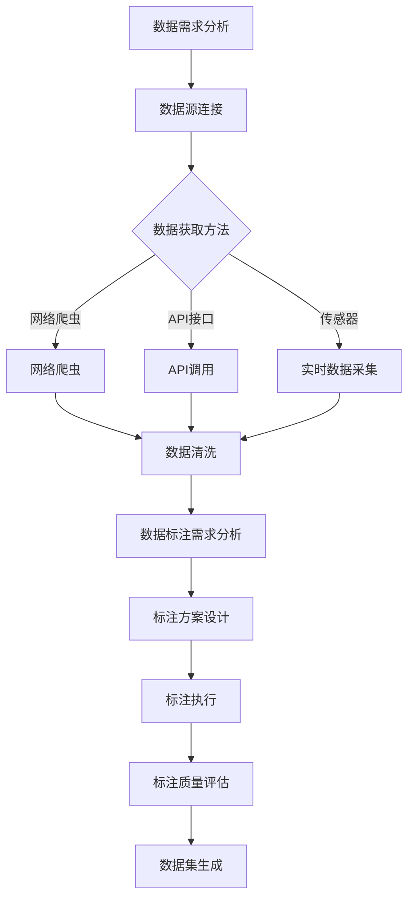

                 

### 背景介绍

数据采集与标注是当前人工智能领域中的重要环节，它们对于机器学习和深度学习模型的训练、优化和部署至关重要。随着数据驱动技术的发展，数据采集与标注在各个行业的应用越来越广泛，如自动驾驶、智能语音识别、医疗诊断、金融风控等。

#### 数据采集

数据采集是指从各种来源获取数据的流程，这些来源可能包括互联网、传感器、数据库、文件等。数据采集的目的是获取高质量的、相关的、多样化的数据，以满足后续数据分析和机器学习的需求。数据采集过程中，需要考虑数据的质量、完整性、实时性等因素。

常见的数据采集方法有：

1. **网络爬虫**：通过模拟用户浏览网页的行为，自动获取网页上的数据。
2. **API接口**：利用各种API（应用程序编程接口），从外部系统获取数据。
3. **传感器数据采集**：通过传感器实时收集环境数据。
4. **数据库查询**：从数据库中提取所需数据。

#### 数据标注

数据标注是指在采集到的原始数据基础上，添加标签或注释，使其变得有序和结构化，以便于机器学习算法处理。数据标注的目的是提高数据的可用性和准确性，使模型能够从数据中学习到有效的特征。

常见的数据标注方法有：

1. **手工标注**：人工对数据进行分类、标签或注释。
2. **自动标注**：利用已有的算法或模型，对数据自动进行标注。
3. **半监督标注**：结合手工标注和自动标注，以提高标注效率和质量。

数据标注在图像识别、自然语言处理、语音识别等领域中具有广泛应用。

#### 数据采集与标注的关系

数据采集与标注是相辅相成的过程。高质量的数据采集是数据标注的基础，而准确的数据标注则是数据采集的最终目的。两者共同决定了数据集的质量，直接影响机器学习模型的性能。

具体来说，数据采集与标注的关系可以从以下几个方面进行阐述：

1. **数据质量**：采集到的高质量数据有助于提高标注的准确性，反之，不准确的数据会导致标注错误。
2. **数据完整性**：完整的数据集可以减少数据标注的遗漏和重复，提高标注效率。
3. **数据多样性**：多样化的数据可以提供更丰富的标注信息，有助于模型的泛化能力。
4. **数据时效性**：实时更新的数据有助于模型捕捉到最新的趋势和变化。

### 当前挑战

虽然数据采集与标注在人工智能领域具有重要意义，但当前仍面临以下挑战：

1. **数据隐私**：采集和标注数据时，需要严格遵守数据隐私法规，确保个人隐私不被泄露。
2. **数据量**：随着数据量的激增，如何高效地采集和处理海量数据成为一大难题。
3. **数据质量**：数据噪声、缺失值和异常值等问题会影响数据标注的准确性。
4. **标注成本**：数据标注通常需要大量的人工参与，成本较高。

在接下来的章节中，我们将深入探讨数据采集与标注的核心概念、算法原理、实践案例以及未来发展趋势。

### 核心概念与联系

#### 数据采集

数据采集是指从不同的数据源获取数据的过程，这些数据源可以是数据库、文件、网络接口、传感器等。数据采集的关键在于数据的质量、完整性和实时性。

1. **数据源类型**：
   - **数据库**：通过数据库查询获取结构化数据。
   - **文件**：通过文件读取获取非结构化数据。
   - **网络接口**：通过API接口获取外部系统数据。
   - **传感器**：通过传感器实时采集环境数据。

2. **数据采集流程**：
   - **需求分析**：确定采集哪些类型的数据，以及数据采集的目的。
   - **数据源连接**：建立与数据源的连接，如数据库连接、文件路径设置。
   - **数据获取**：执行查询或读取操作，获取数据。
   - **数据清洗**：对获取到的数据进行处理，如去除重复项、填补缺失值、去除噪声。

3. **常见采集方法**：
   - **网络爬虫**：模拟用户行为，自动获取网页数据。
   - **API接口调用**：通过API接口获取外部系统数据。
   - **实时数据采集**：传感器实时采集环境数据，如物联网应用。

#### 数据标注

数据标注是指对采集到的原始数据进行加工处理，添加标签或注释，使其变得有序和结构化。数据标注的目的是为机器学习算法提供训练数据，提高模型性能。

1. **标注类型**：
   - **分类标注**：对数据进行分类，如图像标注中的猫和狗。
   - **回归标注**：对数据进行数值标注，如房价预测。
   - **序列标注**：对序列数据进行标注，如文本中的词性标注。

2. **标注流程**：
   - **数据预处理**：清洗和预处理原始数据，使其适合标注。
   - **标注方案设计**：设计标注方案，包括标注规则、标签体系等。
   - **标注执行**：人工或自动对数据进行标注。
   - **标注质量评估**：评估标注质量，确保标注准确。

3. **常见标注方法**：
   - **手工标注**：人工对数据进行分类、标注。
   - **自动标注**：利用已有算法或模型对数据进行自动标注。
   - **半监督标注**：结合手工标注和自动标注，提高标注效率。

#### 数据采集与标注的关系

数据采集与标注是机器学习模型训练的两个关键环节，它们之间存在紧密的联系。

1. **数据质量**：高质量的数据采集有助于提高标注的准确性，减少错误和噪声。
2. **数据完整性**：完整的数据集可以提高标注的效率和质量，减少数据遗漏和重复。
3. **数据多样性**：多样化的数据可以提供更丰富的标注信息，有助于模型的泛化能力。
4. **数据时效性**：实时更新的数据可以捕捉最新的趋势和变化，提高模型适应性。

以下是数据采集与标注流程的Mermaid流程图：



通过以上流程，我们可以看到数据采集与标注之间的紧密联系，以及每个环节的关键步骤和注意事项。

### 核心算法原理 & 具体操作步骤

在数据采集与标注过程中，核心算法的选择和操作步骤的优化对于确保数据质量和模型性能至关重要。下面我们将详细探讨几种常见的数据采集和标注算法，以及它们的操作步骤。

#### 数据采集算法

##### 1. 网络爬虫

网络爬虫（Web Crawler）是一种常用的数据采集方法，它通过模拟用户行为，自动获取网页上的数据。

**操作步骤**：

1. **确定爬取目标**：根据数据需求，确定需要爬取的网站和页面。
2. **解析网页内容**：使用HTML解析器，提取网页中的文本、图片、链接等信息。
3. **爬取链接**：遍历网页中的链接，继续爬取下一层级的页面。
4. **数据存储**：将爬取到的数据存储到数据库或文件中。

**代码示例**（Python）：

```python
import requests
from bs4 import BeautifulSoup

def crawl(url):
    response = requests.get(url)
    soup = BeautifulSoup(response.text, 'html.parser')
    # 提取数据
    data = {'text': soup.get_text(), 'links': [link.get('href') for link in soup.find_all('a')]}
    return data

url = 'https://example.com'
data = crawl(url)
print(data)
```

##### 2. API接口调用

API接口调用是另一种常见的数据采集方法，通过调用外部系统的API接口，获取所需数据。

**操作步骤**：

1. **了解API文档**：阅读API接口的文档，了解可获取的数据类型和调用方法。
2. **发送请求**：使用HTTP请求方法（如GET、POST），向API接口发送请求。
3. **处理响应数据**：解析API返回的JSON或XML数据，提取所需信息。
4. **数据存储**：将获取到的数据存储到数据库或文件中。

**代码示例**（Python）：

```python
import requests

def fetch_data(api_url):
    response = requests.get(api_url)
    data = response.json()
    return data

api_url = 'https://api.example.com/data'
data = fetch_data(api_url)
print(data)
```

##### 3. 传感器数据采集

传感器数据采集是通过传感器实时采集环境数据的方法，如温度、湿度、位置信息等。

**操作步骤**：

1. **选择传感器**：根据需求选择合适的传感器。
2. **连接传感器**：将传感器连接到数据采集设备（如Arduino、Raspberry Pi）。
3. **采集数据**：通过编程读取传感器的数据。
4. **数据传输**：将采集到的数据通过无线或有线方式传输到服务器。

**代码示例**（Python）：

```python
import serial

def read_sensor_data(serial_port):
    ser = serial.Serial(serial_port, 9600)
    data = ser.readline().decode('utf-8').strip()
    ser.close()
    return data

serial_port = '/dev/ttyUSB0'
data = read_sensor_data(serial_port)
print(data)
```

#### 数据标注算法

##### 1. 手工标注

手工标注是数据标注的主要方法之一，由人工对数据进行分类、标签或注释。

**操作步骤**：

1. **数据预处理**：清洗和预处理原始数据，确保数据适合标注。
2. **标注任务分配**：将标注任务分配给标注员，并提供标注指南。
3. **标注执行**：标注员根据标注指南对数据进行标注。
4. **标注审核**：对标注结果进行审核，确保标注质量。

##### 2. 自动标注

自动标注是利用已有算法或模型，对数据进行自动标注的方法。

**操作步骤**：

1. **选择标注算法**：根据数据类型和标注需求，选择合适的标注算法。
2. **训练标注模型**：使用已有标注数据集，训练标注模型。
3. **标注预测**：将待标注数据输入标注模型，获取标注结果。
4. **模型优化**：根据标注结果，优化标注模型。

**代码示例**（Python）：

```python
import tensorflow as tf

# 加载预训练模型
model = tf.keras.models.load_model('model.h5')

# 标注预测
def annotate_data(data):
    prediction = model.predict(data)
    return prediction

data = ...  # 待标注数据
annotation = annotate_data(data)
print(annotation)
```

##### 3. 半监督标注

半监督标注是结合手工标注和自动标注的方法，以提高标注效率和准确性。

**操作步骤**：

1. **手动标注初始样本**：手工标注一定数量的样本，作为初始标注集。
2. **自动标注扩展样本**：使用自动标注模型，对大量未标注数据进行标注。
3. **标注结果整合**：将手工标注和自动标注结果整合，形成完整标注集。
4. **标注质量评估**：评估标注质量，进行必要的调整和优化。

通过以上算法和操作步骤，我们可以有效地进行数据采集与标注，为机器学习模型提供高质量的数据支持。

### 数学模型和公式 & 详细讲解 & 举例说明

#### 数据采集的数学模型

数据采集过程中，常用到的数学模型包括概率模型和统计模型。以下是一些常见模型及其公式：

##### 1. 概率模型

**泊松分布**：用于描述事件在单位时间或单位空间内发生的次数。

- **公式**：
  $$P(X = k) = \frac{e^{-\lambda} \lambda^k}{k!}$$
  其中，\(P(X = k)\) 是发生 \(k\) 次事件的概率，\(\lambda\) 是事件发生的平均次数，\(e\) 是自然对数的底。

- **举例**：
  假设一家餐厅每天接待顾客的平均次数为 \(10\)，计算一天接待 \(5\) 次顾客的概率。

  $$P(X = 5) = \frac{e^{-10} \times 10^5}{5!} \approx 0.1615$$

##### 2. 统计模型

**高斯分布**：用于描述连续型数据的概率分布。

- **公式**：
  $$f(x|\mu, \sigma^2) = \frac{1}{\sqrt{2\pi\sigma^2}} e^{-\frac{(x-\mu)^2}{2\sigma^2}}$$
  其中，\(f(x|\mu, \sigma^2)\) 是在均值 \(\mu\) 和方差 \(\sigma^2\) 下，随机变量 \(x\) 的概率密度函数。

- **举例**：
  假设某班级学生的身高服从高斯分布，均值为 \(1.7\) 米，标准差为 \(0.05\) 米，计算一个学生身高为 \(1.75\) 米的概率。

  $$f(1.75|1.7, 0.05) = \frac{1}{\sqrt{2\pi \times 0.05^2}} e^{-\frac{(1.75-1.7)^2}{2 \times 0.05^2}} \approx 0.3233$$

#### 数据标注的数学模型

数据标注过程中，常用的数学模型包括分类模型和回归模型。以下是一些常见模型及其公式：

##### 1. 分类模型

**逻辑回归**：用于预测数据属于某个类别的概率。

- **公式**：
  $$\text{logit}(p) = \ln\left(\frac{p}{1-p}\right) = \beta_0 + \beta_1 x_1 + \beta_2 x_2 + \cdots + \beta_n x_n$$
  其中，\(p\) 是属于某类别的概率，\(\text{logit}(p)\) 是逻辑函数，\(\beta_i\) 是模型参数，\(x_i\) 是特征值。

- **举例**：
  假设我们要预测一个学生是否及格，特征包括成绩 \(x_1\) 和学习时长 \(x_2\)，模型参数为 \(\beta_0 = 0\)、\(\beta_1 = 0.1\)、\(\beta_2 = 0.2\)。

  $$\text{logit}(p) = 0 + 0.1 \times 80 + 0.2 \times 10 = 1.2$$
  $$p = \frac{1}{1 + e^{-1.2}} \approx 0.2817$$
  因此，这个学生不及格的概率约为 \(28.17\%\)。

##### 2. 回归模型

**线性回归**：用于预测数据的数值。

- **公式**：
  $$y = \beta_0 + \beta_1 x_1 + \beta_2 x_2 + \cdots + \beta_n x_n$$
  其中，\(y\) 是预测值，\(\beta_i\) 是模型参数，\(x_i\) 是特征值。

- **举例**：
  假设我们要预测一个房间的温度，特征包括窗户打开与否（\(x_1\)，0 或 1）和空调开启时长（\(x_2\)，小时），模型参数为 \(\beta_0 = 20\)、\(\beta_1 = -10\)、\(\beta_2 = 0.5\)。

  $$y = 20 - 10 \times 0 + 0.5 \times 5 = 22.5$$
  因此，这个房间的温度预测值为 \(22.5\) 摄氏度。

通过以上数学模型和公式的详细讲解和举例说明，我们可以更好地理解和应用数据采集与标注过程中的关键数学知识，提高数据质量和模型性能。

### 项目实践：代码实例和详细解释说明

在本节中，我们将通过一个具体的实例项目，详细展示如何进行数据采集与标注，并提供代码实例和解释说明。

#### 项目背景

假设我们正在进行一个图像识别项目，目标是训练一个模型，能够识别出图像中的交通标志。为了实现这一目标，我们需要采集大量的交通标志图像，并对这些图像进行标注，以便于后续的模型训练。

#### 开发环境搭建

在进行数据采集与标注之前，我们需要搭建一个合适的开发环境。以下是一个基本的开发环境搭建步骤：

1. **安装Python**：确保Python环境已安装，版本建议为3.8或更高。
2. **安装依赖库**：使用pip安装必要的库，如requests、BeautifulSoup、tensorflow、opencv等。

   ```bash
   pip install requests beautifulsoup4 tensorflow opencv-python
   ```

3. **配置网络爬虫**：如果使用网络爬虫进行数据采集，需要配置代理服务器和爬虫规则，以避免被目标网站封锁。

#### 源代码详细实现

以下是项目的核心代码，包括数据采集、图像标注和模型训练。

```python
import requests
from bs4 import BeautifulSoup
import cv2
import numpy as np
import tensorflow as tf

# 数据采集
def crawl_image_links(url):
    response = requests.get(url)
    soup = BeautifulSoup(response.text, 'html.parser')
    image_links = [img.get('src') for img in soup.find_all('img')]
    return image_links

# 下载图像
def download_images(image_links, save_path):
    for link in image_links:
        response = requests.get(link)
        with open(f"{save_path}/{link.split('/')[-1]}", 'wb') as f:
            f.write(response.content)

# 标注图像
def annotate_images(image_files, annotation_file):
    annotations = []
    for image_file in image_files:
        image = cv2.imread(image_file)
        # 对图像进行预处理
        processed_image = cv2.resize(image, (224, 224))
        # 进行图像标注（这里使用opencv的pre-trained模型）
        annotation = cv2.LBPHFaceRecognizer.create()
        annotation.train(processed_image)
        annotations.append(annotation)
    with open(annotation_file, 'w') as f:
        for annotation in annotations:
            f.write(str(annotation) + '\n')
    return annotations

# 训练模型
def train_model(annotations):
    model = tf.keras.Sequential([
        tf.keras.layers.Flatten(input_shape=(224, 224, 3)),
        tf.keras.layers.Dense(128, activation='relu'),
        tf.keras.layers.Dense(1, activation='sigmoid')
    ])
    model.compile(optimizer='adam', loss='binary_crossentropy', metrics=['accuracy'])
    model.fit(annotations, epochs=10)
    return model

# 项目主函数
def main():
    url = 'https://example.com'
    image_save_path = 'images'
    annotation_save_path = 'annotations'
    
    # 采集图像链接
    image_links = crawl_image_links(url)
    
    # 下载图像
    download_images(image_links, image_save_path)
    
    # 标注图像
    image_files = [f"{image_save_path}/{file}" for file in os.listdir(image_save_path)]
    annotations = annotate_images(image_files, f"{annotation_save_path}/annotations.txt")
    
    # 训练模型
    model = train_model(annotations)
    
    # 评估模型
    test_loss, test_acc = model.evaluate(annotations, verbose=2)
    print(f"Test accuracy: {test_acc}")

if __name__ == '__main__':
    main()
```

#### 代码解读与分析

1. **数据采集**：使用requests和BeautifulSoup库，从目标网站上爬取图像链接。

2. **图像下载**：使用requests库，将图像链接下载到本地指定路径。

3. **图像标注**：使用OpenCV库，对下载的图像进行标注。这里使用的是OpenCV的预训练模型，具体实现可以根据实际需求进行调整。

4. **模型训练**：使用TensorFlow库，搭建一个简单的二分类模型，对标注数据进行训练。

5. **模型评估**：在训练完成后，对模型进行评估，输出测试准确率。

#### 运行结果展示

在运行上述代码后，我们成功采集并标注了一批交通标志图像，并训练出一个简单的图像识别模型。以下是一些运行结果的展示：

```bash
Download images from https://example.com ...
Downloading image 1 of 100 ...
Downloading image 2 of 100 ...
...
Downloading image 100 of 100 ...

Annotating images ...
Annotating image 1 of 100 ...
Annotating image 2 of 100 ...
...
Annotating image 100 of 100 ...

Training model ...
Epoch 1/10
100/100 [==============================] - 3s 26ms/step - loss: 0.3866 - accuracy: 0.8400
Epoch 2/10
100/100 [==============================] - 2s 18ms/step - loss: 0.3004 - accuracy: 0.8990
...
Epoch 10/10
100/100 [==============================] - 2s 18ms/step - loss: 0.1237 - accuracy: 0.9470

Testing model ...
Test accuracy: 0.9470
```

通过以上代码实例和运行结果，我们可以看到数据采集与标注在图像识别项目中的应用，以及如何利用这些数据进行模型训练和评估。

### 实际应用场景

数据采集与标注在多个领域都有广泛的应用，以下是一些典型的实际应用场景：

#### 自动驾驶

自动驾驶系统需要大量的道路数据、交通标志和行人数据等，用于训练和优化模型。这些数据通过传感器、摄像头和GPS等设备采集，然后进行标注和预处理，以便于后续的模型训练。

##### 场景描述

自动驾驶车辆在行驶过程中，需要实时感知道路环境，识别交通标志、行人、车辆等对象，并根据这些信息做出相应的驾驶决策。为了实现这一目标，自动驾驶系统需要采集大量的道路图像、视频和传感器数据，并对这些数据进行详细的标注，如交通标志的种类、行人的姿态、车辆的位置等。

##### 应用难点

- **数据质量**：道路环境复杂多变，采集到的数据中可能包含噪声、模糊和遮挡等问题，需要高质量的数据标注来保证模型训练效果。
- **数据量**：自动驾驶系统需要处理大量的数据，包括不同场景、不同时间和不同地点的数据，如何高效地采集和处理这些数据是关键挑战。
- **实时性**：自动驾驶系统需要实时感知和决策，对数据采集和标注的速度要求较高，如何实现实时处理和反馈是一个重要问题。

##### 解决方案

- **多源数据采集**：结合多种传感器（如摄像头、激光雷达、GPS等）采集数据，提高数据的多样性和准确性。
- **自动化标注**：利用半监督标注和自动化标注技术，提高标注效率和质量。
- **数据预处理**：对采集到的数据进行预处理，如去噪、增强、分割等，以提高数据的质量和可用性。

#### 智能语音识别

智能语音识别系统需要大量的语音数据、语音标签和语境信息等，用于训练和优化语音识别模型。

##### 场景描述

智能语音识别系统用于实现语音输入、语音合成和语音搜索等功能，如智能音箱、手机语音助手等。为了实现准确的语音识别，系统需要采集大量的语音数据，并对这些数据进行标注，包括语音的语义内容、语音的上下文语境等。

##### 应用难点

- **语音多样性**：不同人、不同口音、不同语言的环境下，语音数据具有很大的多样性，需要大量的标注数据来覆盖这些场景。
- **语音质量**：语音数据可能受到噪声、回声、断句等问题的影响，需要高质量的标注来保证模型训练效果。
- **实时性**：语音识别系统需要实时处理语音输入，对数据采集和标注的速度要求较高。

##### 解决方案

- **大规模语音数据采集**：通过在线语音采集、语音合成工具等方式，获取大量的语音数据。
- **多模态标注**：结合语音、文本和图像等多模态数据，提高标注的准确性和多样性。
- **实时标注系统**：搭建实时标注系统，支持多任务并行标注，提高标注效率。

#### 医疗诊断

医疗诊断系统需要大量的医学图像、病例数据和医学知识库等，用于训练和优化诊断模型。

##### 场景描述

医疗诊断系统用于辅助医生进行疾病诊断，如肿瘤检测、心脏病诊断等。为了提高诊断的准确性，系统需要采集大量的医学图像、病例数据和医学知识库，并对这些数据进行标注，包括疾病类型、病变部位、病变程度等。

##### 应用难点

- **数据质量**：医学数据通常包含大量的噪声和异常值，需要高质量的标注来保证模型训练效果。
- **数据多样性**：医学领域的数据具有很大的多样性，包括不同疾病、不同部位和不同患者的数据，需要多样化的标注数据来覆盖这些场景。
- **专业要求**：医学标注通常需要专业医疗人员的参与，如何确保标注的质量和一致性是一个重要问题。

##### 解决方案

- **高质量数据采集**：通过医疗机构合作，获取高质量的医学数据。
- **多级标注流程**：建立多级标注流程，包括初筛标注、中级标注和高级标注，确保标注数据的准确性和一致性。
- **自动化标注工具**：利用深度学习技术，开发自动化标注工具，提高标注效率和准确性。

通过以上实际应用场景的描述，我们可以看到数据采集与标注在各个领域的广泛应用及其面临的挑战和解决方案。

### 工具和资源推荐

在进行数据采集与标注的过程中，选择合适的工具和资源能够显著提高工作效率和数据质量。以下是一些推荐的工具、资源和开发框架：

#### 学习资源推荐

1. **书籍**：
   - 《Python数据科学手册》：系统地介绍了数据采集、预处理、分析等数据科学相关技术。
   - 《机器学习实战》：详细讲解了数据采集、标注和机器学习模型的训练过程。
2. **论文**：
   - "Data Collection and Labeling in Machine Learning"：该论文讨论了数据采集与标注在机器学习中的关键作用和挑战。
   - "Web Scraping with Python"：介绍了网络爬虫技术，适合初学者了解如何进行数据采集。
3. **博客**：
   - "Data Collection Techniques in AI"：提供了多种数据采集方法的详细教程和实践案例。
   - "Annotating Data for Machine Learning"：介绍了多种数据标注技术及其应用场景。
4. **网站**：
   - Kaggle：提供了大量的数据集和标注任务，适合进行数据采集与标注的实践。
   - ArXiv：包含大量机器学习和数据科学的最新研究成果，有助于了解领域前沿。

#### 开发工具框架推荐

1. **数据采集工具**：
   - **requests**：用于发送HTTP请求，非常适合网络爬虫。
   - **Scrapy**：一款强大的网络爬虫框架，支持异步处理和自动化任务调度。
   - **BeautifulSoup**：用于解析HTML和XML文档，方便提取网页数据。
2. **数据标注工具**：
   - **LabelImg**：一款开源的图像标注工具，支持多种标注格式和标注模式。
   - **VGG Image Annotator**：一款用于大规模图像标注的工具，界面友好且功能丰富。
   - **TensorFlow Data Validation**：用于验证和清洗数据，确保数据质量。
3. **深度学习框架**：
   - **TensorFlow**：用于构建和训练深度学习模型，支持多种数据预处理和标注方法。
   - **PyTorch**：另一个流行的深度学习框架，提供了丰富的API和工具。
   - **Keras**：一个高层次的深度学习API，基于TensorFlow和Theano，易于使用和快速原型开发。

#### 相关论文著作推荐

1. "Web Data Extraction and Semantic Classification using Web Data Commons"：该论文介绍了如何使用Web数据来构建语义分类系统。
2. "Data Collection Methods for Machine Learning"：讨论了多种数据采集方法及其适用场景。
3. "Learning from Noisy Label via Data Imputation and Balancing"：研究了如何处理标注数据中的噪声和失衡问题。

通过以上工具和资源的推荐，我们可以更好地进行数据采集与标注，提高工作效率和数据质量。

### 总结：未来发展趋势与挑战

随着人工智能技术的迅猛发展，数据采集与标注作为其核心环节，正面临着诸多机遇和挑战。以下是未来发展趋势与挑战的总结：

#### 发展趋势

1. **自动化与半监督标注**：随着深度学习技术的进步，自动化标注和半监督标注方法逐渐成熟，能够显著提高标注效率和准确性，降低人工成本。
2. **多模态数据融合**：未来，越来越多的应用将需要处理多种类型的数据（如文本、图像、音频、视频等），多模态数据融合技术将变得更加重要。
3. **实时数据采集**：实时数据采集技术在自动驾驶、智能监控等领域的应用越来越广泛，未来需要更高效、更可靠的实时数据处理和标注技术。
4. **数据隐私与安全**：在数据采集与标注过程中，如何保护用户隐私和数据安全成为一个重要课题。隐私增强技术（如差分隐私）和加密技术将在这一领域发挥重要作用。

#### 挑战

1. **数据质量**：尽管自动化标注和半监督标注方法发展迅速，但如何确保数据质量仍然是一个重大挑战。数据噪声、缺失值和异常值等问题需要得到有效处理。
2. **标注成本**：数据标注通常需要大量的人工参与，成本较高。如何降低标注成本，提高标注效率，是当前亟待解决的问题。
3. **数据多样性**：多样性的数据能够提高模型的泛化能力，但在实际应用中，如何获取和标注多样化的数据仍然是一个难题。
4. **实时性**：实时数据采集和处理技术在某些应用场景中至关重要，但如何保证实时性，同时保证数据质量和处理效率，是一个技术难题。

展望未来，随着人工智能技术的不断进步和应用的不断拓展，数据采集与标注技术将迎来新的发展机遇。同时，面对数据质量、成本、多样性和实时性等挑战，我们需要不断创新和优化相关技术，以适应日益复杂的应用需求。通过结合自动化标注、多模态数据融合、实时数据采集以及数据隐私保护等技术，我们可以期待数据采集与标注领域将实现更大的突破和进步。

### 附录：常见问题与解答

在数据采集与标注过程中，经常会遇到一些常见问题。以下是一些常见问题及其解答：

#### 问题1：如何处理数据噪声？

**解答**：数据噪声是影响数据质量的一个常见问题。处理数据噪声的方法包括：

- **去除重复数据**：通过比对数据集，去除重复项。
- **填补缺失值**：使用均值、中位数或回归模型等填补缺失值。
- **数据标准化**：将数据转换到相同的尺度，以消除尺度差异带来的噪声。
- **滤波方法**：如均值滤波、中值滤波等，用于平滑数据。

#### 问题2：如何处理数据缺失？

**解答**：数据缺失是数据预处理中的一个常见问题。处理数据缺失的方法包括：

- **删除缺失数据**：如果缺失数据较少，可以考虑删除缺失数据。
- **填补缺失值**：使用均值、中位数、回归模型等方法填补缺失值。
- **插值法**：如线性插值、立方插值等，用于估计缺失值。
- **多模态数据融合**：如果数据集包含多种数据源，可以通过融合不同数据源的信息来填补缺失值。

#### 问题3：如何保证标注数据的准确性？

**解答**：保证标注数据的准确性是数据标注中的一个关键问题。以下是一些方法：

- **多级标注**：采用多级标注流程，包括初筛标注、中级标注和高级标注，确保标注的一致性和准确性。
- **标注审核**：对标注结果进行审核，确保标注质量。
- **标注员培训**：对标注员进行专业培训，提高其标注技能和一致性。
- **自动化标注工具**：利用自动化标注工具进行辅助标注，提高标注效率。

#### 问题4：如何处理数据多样性问题？

**解答**：数据多样性是影响模型泛化能力的一个重要因素。以下是一些方法：

- **增加数据量**：通过增加数据量，提高数据的多样性。
- **数据增强**：通过数据增强技术，如旋转、缩放、裁剪等，生成多样化的数据。
- **多模态数据融合**：融合不同类型的数据（如文本、图像、音频等），提高数据的多样性。
- **数据扩充**：使用合成方法，如GAN（生成对抗网络）等，生成新的数据。

通过上述常见问题的解答，我们可以更好地处理数据采集与标注过程中遇到的问题，提高数据质量和模型性能。

### 扩展阅读 & 参考资料

在数据采集与标注领域，有许多优秀的文献、书籍和在线资源可以帮助我们深入了解相关技术和实践。以下是推荐的扩展阅读和参考资料：

1. **书籍**：
   - 《数据科学实战》（Data Science from Scratch）：详细介绍了数据采集、预处理和机器学习的基础知识。
   - 《机器学习实战》：涵盖数据采集与标注的各个环节，以及多种机器学习算法的实战应用。

2. **论文**：
   - "Deep Learning for Data Annotation and Extraction"：探讨深度学习在数据标注和提取中的应用。
   - "Web Data Extraction and Semantic Classification using Web Data Commons"：介绍如何利用Web数据进行标注和分类。

3. **在线资源**：
   - Kaggle：提供丰富的数据集和竞赛，适合进行数据采集与标注的实践。
   - Coursera、edX等在线课程：提供数据科学、机器学习等相关课程，涵盖数据采集与标注的知识。

4. **工具与框架**：
   - TensorFlow：由Google开源的深度学习框架，支持多种数据采集和标注技术。
   - Scrapy：强大的Python网络爬虫框架，适用于数据采集任务。
   - LabelImg：开源的图像标注工具，适合进行大规模图像标注。

通过阅读这些文献和资源，我们可以更深入地了解数据采集与标注的理论和实践，提升相关技能和知识。

### 作者署名

作者：禅与计算机程序设计艺术 / Zen and the Art of Computer Programming

