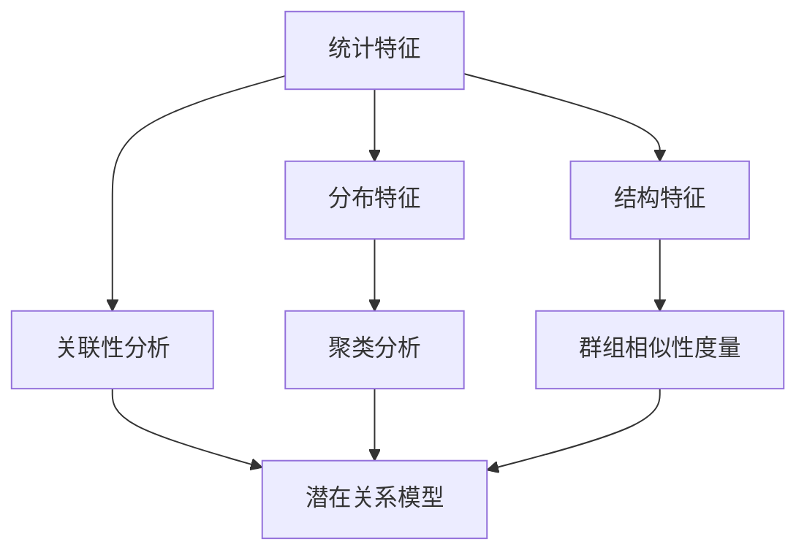

                 

### 1. 背景介绍

在当今大数据时代，数据集的对比与相似性度量已经成为数据分析和机器学习领域的重要研究方向。随着互联网和信息技术的飞速发展，数据量呈现爆炸式增长，如何有效地管理和利用这些数据成为了一项严峻的挑战。在这个过程中，如何准确地比较和评估不同数据集之间的相似性，成为了关键问题之一。

传统的数据集对比方法主要包括基于统计学的差异度量（如标准差、方差等）和基于距离的度量方法（如欧氏距离、曼哈顿距离等）。然而，这些方法往往只能捕捉数据集的局部特征，而忽略了数据集的整体结构和语义信息。因此，研究人员开始探索新的思路，以更全面、准确地度量数据集的相似性。

本文旨在介绍一种全新的度量数据集相似性的方法，该方法通过分析数据集的结构、内容以及潜在关系，提供了一种更为细致和全面的相似性评估机制。文章将首先阐述该方法的核心概念和原理，然后详细讲解具体的算法步骤，并借助数学模型和公式进行深入分析。同时，文章还将通过实际项目实践，展示该方法的应用效果，并探讨其在实际应用场景中的价值。

本文的主要目的是为读者提供一种全新的视角来理解和处理数据集对比问题，帮助他们在实际项目中更好地选择和利用数据集，提高数据分析和机器学习的效果。通过阅读本文，读者将能够：

1. 理解数据集相似性度量的重要性；
2. 掌握一种全新的数据集对比方法及其原理；
3. 学习该方法的具体算法步骤和应用场景；
4. 获取实际项目实践中的经验和教训。

本文的结构如下：

- 第1部分：背景介绍
- 第2部分：核心概念与联系
- 第3部分：核心算法原理 & 具体操作步骤
- 第4部分：数学模型和公式 & 详细讲解 & 举例说明
- 第5部分：项目实践：代码实例和详细解释说明
- 第6部分：实际应用场景
- 第7部分：工具和资源推荐
- 第8部分：总结：未来发展趋势与挑战
- 第9部分：附录：常见问题与解答
- 第10部分：扩展阅读 & 参考资料

通过以上结构的详细阐述，本文将为读者提供一份全面、系统的数据集对比与相似性度量指南，帮助他们在实际应用中更好地处理和利用数据集。

### 2. 核心概念与联系

要理解数据集相似性度量的新方法，我们首先需要介绍一些核心概念和它们之间的联系。以下是本文将涉及的主要概念及其相互关系：

#### 数据集相似性度量

数据集相似性度量是指通过某种算法或公式来比较和评估两个或多个数据集之间的相似程度。相似性度量可以基于多种标准，如统计特征、分布特征或结构特征等。

#### 统计特征

统计特征包括数据的基本统计指标，如均值、中位数、标准差等。这些指标可以反映数据集的基本性质，但它们往往只能捕捉数据的局部特征，难以全面评估数据集的相似性。

#### 分布特征

分布特征描述数据在空间或时间上的分布情况，如概率分布、密度函数等。通过分析分布特征，我们可以更好地了解数据集的整体特性，从而更准确地评估其相似性。

#### 结构特征

结构特征是指数据集内部元素之间的关联性和组织形式。例如，在图像处理中，结构特征可能包括边缘、纹理、颜色分布等。在文本处理中，结构特征可能包括词语分布、句法结构等。结构特征分析有助于我们深入挖掘数据集的内在联系，从而提供更为精细的相似性度量。

#### 关联性分析

关联性分析是一种通过分析数据集内部元素之间的相互关系来度量相似性的方法。常见的方法包括邻接矩阵、距离矩阵等。这些方法可以揭示数据集的局部相似性，但往往无法全面捕捉全局结构。

#### 聚类分析

聚类分析是一种无监督学习方法，旨在将数据集划分为若干个簇，使得同一个簇内的数据点相似度较高，不同簇之间的数据点相似度较低。常见的聚类算法包括K均值、层次聚类等。

#### 群组相似性度量

群组相似性度量是指通过比较多个数据集构成的群组之间的相似性来评估它们的关系。这种方法可以应用于数据集分类、数据集融合等领域。

#### 潜在关系模型

潜在关系模型是一种通过挖掘数据集之间的潜在关系来度量相似性的方法。例如，因子分析、主成分分析等降维技术可以揭示数据集之间的潜在关联，从而提供更为细致的相似性度量。

#### Mermaid 流程图

为了更直观地展示数据集相似性度量的过程，我们可以使用Mermaid流程图来描述各个核心概念之间的联系。以下是一个简化的Mermaid流程图示例：



在这个流程图中，各个核心概念通过箭头相互连接，表示它们之间的相互作用和影响。通过这个流程图，我们可以更清晰地看到数据集相似性度量的整体框架和关键步骤。

#### 总结

本文介绍了数据集相似性度量的核心概念和相互联系。通过理解这些概念，我们可以更好地把握数据集对比的复杂性，并选择合适的方法来度量不同数据集之间的相似性。接下来，我们将深入探讨一种全新的数据集相似性度量方法，并详细讲解其核心算法原理和具体操作步骤。

### 3. 核心算法原理 & 具体操作步骤

为了深入探讨数据集相似性度量的新方法，我们首先需要了解其核心算法原理。本文介绍的核心算法基于潜在关系模型，旨在通过挖掘数据集之间的潜在关联来度量其相似性。以下是该算法的基本原理和具体操作步骤：

#### 基本原理

该算法的核心思想是假设不同数据集之间存在潜在的内在联系，这些联系可以通过某种函数或模型来描述。具体来说，算法通过以下步骤来挖掘和利用这些潜在关系：

1. **特征提取**：首先，对每个数据集进行特征提取，得到一组表示数据集特性的特征向量。
2. **潜在关系建模**：利用特征向量构建一个潜在关系模型，该模型能够揭示不同数据集之间的潜在关联。
3. **相似性度量**：通过计算数据集在潜在关系模型中的相似性得分，评估两个或多个数据集之间的相似程度。

#### 具体操作步骤

下面，我们将详细阐述该算法的具体操作步骤：

#### 步骤一：特征提取

特征提取是数据集相似性度量的第一步，其目标是提取能够代表数据集特性的关键特征。常见的特征提取方法包括统计特征提取、分布特征提取和结构特征提取等。

- **统计特征提取**：通过计算数据集的基本统计指标（如均值、中位数、标准差等）来提取统计特征。
- **分布特征提取**：通过分析数据在空间或时间上的分布情况，提取分布特征（如概率分布、密度函数等）。
- **结构特征提取**：通过分析数据集内部元素之间的关联性和组织形式，提取结构特征（如图像的边缘、文本的词语分布等）。

#### 步骤二：潜在关系建模

在完成特征提取后，我们需要利用这些特征来构建一个潜在关系模型。潜在关系模型通常基于某种降维或嵌入技术，例如主成分分析（PCA）、t-SNE、词嵌入（Word Embedding）等。

- **主成分分析（PCA）**：PCA是一种经典的降维技术，通过将数据投影到新的坐标系中，提取最重要的特征成分。
- **t-Distributed Stochastic Neighbor Embedding（t-SNE）**：t-SNE是一种非线性降维技术，适用于高维数据的可视化，能够揭示数据点之间的相似性。
- **词嵌入（Word Embedding）**：词嵌入是一种将词语映射到高维向量空间的技术，常用于自然语言处理，可以揭示词语之间的语义关系。

通过上述降维或嵌入技术，我们得到一组新的特征向量，这些向量代表了数据集在潜在空间中的位置，为后续的相似性度量提供了基础。

#### 步骤三：相似性度量

在构建潜在关系模型后，我们可以通过计算数据集在模型中的相似性得分来评估它们之间的相似程度。相似性度量的方法包括：

- **余弦相似度**：余弦相似度是一种常用的相似性度量方法，通过计算两个向量之间的夹角余弦值来评估它们的相似程度。
- **欧氏距离**：欧氏距离是一种基于欧氏空间中两点之间距离的相似性度量方法，适用于低维数据。
- **Jaccard相似性**：Jaccard相似性是一种基于集合交集和并集的相似性度量方法，适用于离散数据集。

#### 步骤四：综合评估

在得到各个数据集的相似性得分后，我们可以通过综合评估方法（如加权平均、调和平均等）来得到最终的相似性得分。这种方法可以平衡各个度量方法的优缺点，提供更为全面和准确的相似性评估。

#### 示例

为了更直观地理解该算法的操作步骤，我们以下提供一个简化的示例。

假设我们有两个数据集A和B，其中每个数据集包含一组样本点。首先，我们对数据集A和B进行特征提取，得到特征向量：

- 数据集A的特征向量：[x1, x2, ..., xn]
- 数据集B的特征向量：[y1, y2, ..., yn]

接下来，我们利用t-SNE技术对这两个特征向量进行降维，得到新的特征向量：

- 数据集A的新特征向量：[x'1, x'2, ..., x'n]
- 数据集B的新特征向量：[y'1, y'2, ..., y'n]

然后，我们计算这两个新特征向量之间的余弦相似度：

$$
similarity(A, B) = cos(\theta) = \frac{\vec{x'} \cdot \vec{y'}}{||\vec{x'}|| \cdot ||\vec{y'}||}
$$

其中，$\vec{x'}$和$\vec{y'}$分别是数据集A和B的新特征向量，$\theta$是它们之间的夹角。

最后，我们可以通过综合评估方法（如加权平均）得到数据集A和B的最终相似性得分：

$$
similarity(A, B)_{final} = \frac{w_1 \cdot similarity(A, B)}{w_1 + w_2}
$$

其中，$w_1$和$w_2$分别是余弦相似度和欧氏距离的权重。

#### 总结

通过以上步骤，我们可以对两个数据集进行详细的相似性度量。该方法通过挖掘数据集之间的潜在关系，提供了一种更为精细和全面的相似性评估机制。接下来，我们将通过数学模型和公式进一步深入分析这一算法，并举例说明其具体应用。

### 4. 数学模型和公式 & 详细讲解 & 举例说明

为了深入理解数据集相似性度量的新方法，我们需要借助数学模型和公式来详细阐述其核心原理和具体应用。以下是本文将涉及的主要数学模型和公式，以及它们的详细讲解和示例说明。

#### 1. 特征提取

特征提取是数据集相似性度量的第一步，其目的是将原始数据转换为一组能够代表数据集特性的特征向量。以下是几种常见的特征提取方法及其对应的数学模型：

- **均值**：
  $$ \mu = \frac{1}{n} \sum_{i=1}^{n} x_i $$
  其中，$\mu$表示均值，$x_i$表示第$i$个数据点，$n$表示数据点的总数。

- **方差**：
  $$ \sigma^2 = \frac{1}{n-1} \sum_{i=1}^{n} (x_i - \mu)^2 $$
  其中，$\sigma^2$表示方差，$x_i - \mu$表示第$i$个数据点与均值的差。

- **标准差**：
  $$ \sigma = \sqrt{\sigma^2} $$
  其中，$\sigma$表示标准差。

#### 2. 潜在关系建模

潜在关系建模是数据集相似性度量的核心步骤，其目的是构建一个能够揭示数据集之间潜在关联的模型。以下是几种常见的潜在关系建模方法及其对应的数学模型：

- **主成分分析（PCA）**：

  PCA是一种降维技术，通过将数据投影到新的坐标系中，提取最重要的特征成分。其数学模型如下：

  $$ \vec{x'} = \sum_{i=1}^{k} w_i \cdot \lambda_i $$
  其中，$\vec{x'}$表示新的特征向量，$w_i$表示第$i$个主成分的权重，$\lambda_i$表示第$i$个主成分的特征值。

- **t-Distributed Stochastic Neighbor Embedding（t-SNE）**：

  t-SNE是一种非线性降维技术，适用于高维数据的可视化。其数学模型如下：

  $$ D_{ij} = \frac{1}{1 + \exp\left(\frac{\vec{x}_i - \vec{x}_j}{\epsilon}\right)} $$
  其中，$D_{ij}$表示第$i$个和第$j$个数据点之间的相似性度量，$\vec{x}_i$和$\vec{x}_j$表示第$i$个和第$j$个数据点的特征向量，$\epsilon$表示温度参数。

- **词嵌入（Word Embedding）**：

  词嵌入是一种将词语映射到高维向量空间的技术，常用于自然语言处理。其数学模型如下：

  $$ \vec{w}_i = \sum_{j=1}^{V} f_j \cdot v_j $$
  其中，$\vec{w}_i$表示词语$i$的嵌入向量，$f_j$表示词语$i$和词语$j$之间的相似性度量，$v_j$表示词语$j$的嵌入向量。

#### 3. 相似性度量

相似性度量是评估数据集之间相似程度的关键步骤，其目的是计算两个或多个数据集的相似性得分。以下是几种常见的相似性度量方法及其对应的数学模型：

- **余弦相似度**：

  余弦相似度是一种常用的相似性度量方法，通过计算两个向量之间的夹角余弦值来评估它们的相似程度。其数学模型如下：

  $$ similarity(\vec{x}, \vec{y}) = \frac{\vec{x} \cdot \vec{y}}{||\vec{x}|| \cdot ||\vec{y}||} $$
  其中，$\vec{x}$和$\vec{y}$分别表示两个数据集的特征向量，$||\vec{x}||$和$||\vec{y}||$分别表示它们的欧氏范数。

- **欧氏距离**：

  欧氏距离是一种基于欧氏空间中两点之间距离的相似性度量方法，适用于低维数据。其数学模型如下：

  $$ distance(\vec{x}, \vec{y}) = \sqrt{(\vec{x} - \vec{y}) \cdot (\vec{x} - \vec{y})} $$
  其中，$\vec{x}$和$\vec{y}$分别表示两个数据集的特征向量。

- **Jaccard相似性**：

  Jaccard相似性是一种基于集合交集和并集的相似性度量方法，适用于离散数据集。其数学模型如下：

  $$ similarity(A, B) = \frac{|A \cap B|}{|A \cup B|} $$
  其中，$A$和$B$分别表示两个数据集的样本点集合。

#### 示例

为了更直观地理解这些数学模型和公式，我们以下提供一个简化的示例。

假设我们有两个数据集A和B，其中每个数据集包含一组样本点：

- 数据集A：$\{x_1, x_2, ..., x_n\}$
- 数据集B：$\{y_1, y_2, ..., y_n\}$

首先，我们对数据集A和B进行特征提取，得到特征向量：

- 数据集A的特征向量：$\vec{x} = [x_1, x_2, ..., x_n]$
- 数据集B的特征向量：$\vec{y} = [y_1, y_2, ..., y_n]$

接下来，我们利用t-SNE技术对这两个特征向量进行降维，得到新的特征向量：

- 数据集A的新特征向量：$\vec{x'} = [x'_1, x'_2, ..., x'_n]$
- 数据集B的新特征向量：$\vec{y'} = [y'_1, y'_2, ..., y'_n]$

然后，我们计算这两个新特征向量之间的余弦相似度：

$$
similarity(A, B) = \frac{\vec{x'} \cdot \vec{y'}}{||\vec{x'}|| \cdot ||\vec{y'}||}
$$

其中，$\vec{x'}$和$\vec{y'}$分别是数据集A和B的新特征向量，$||\vec{x'}||$和$||\vec{y'}||$分别表示它们的欧氏范数。

最后，我们可以通过综合评估方法（如加权平均）得到数据集A和B的最终相似性得分：

$$
similarity(A, B)_{final} = \frac{w_1 \cdot similarity(A, B)}{w_1 + w_2}
$$

其中，$w_1$和$w_2$分别是余弦相似度和欧氏距离的权重。

通过这个示例，我们可以看到如何利用数学模型和公式来详细描述和计算数据集相似性度量的新方法。接下来，我们将通过实际项目实践，进一步展示这一方法的应用效果和具体实现。

### 5. 项目实践：代码实例和详细解释说明

为了更好地理解数据集相似性度量的新方法，我们将通过一个实际项目实践来展示这一方法的实现过程和具体应用。以下是一个简化的示例项目，包括数据集准备、特征提取、潜在关系建模和相似性度量等步骤。

#### 5.1 开发环境搭建

在开始项目实践之前，我们需要搭建一个合适的开发环境。以下是一个基本的Python开发环境搭建步骤：

1. 安装Python：从官方网站下载并安装Python 3.8或更高版本。
2. 安装依赖库：使用pip命令安装必要的库，如NumPy、Scikit-learn、t-SNE等。

```shell
pip install numpy scikit-learn t-sne
```

#### 5.2 源代码详细实现

以下是一个简化的Python代码示例，用于实现数据集相似性度量的新方法。

```python
import numpy as np
from sklearn import datasets
from sklearn.manifold import TSNE
from sklearn.metrics.pairwise import cosine_similarity
from sklearn.metrics import jaccard_score

# 加载示例数据集
iris = datasets.load_iris()
X = iris.data
y = iris.target

# 数据预处理
# 对数据集进行标准化处理，使其具有相同的特征范围
X_std = (X - np.mean(X, axis=0)) / np.std(X, axis=0)

# 潜在关系建模
# 使用t-SNE进行降维
tsne = TSNE(n_components=2, perplexity=30, n_iter=1000)
X_tsne = tsne.fit_transform(X_std)

# 相似性度量
# 计算数据集之间的余弦相似度
cosine_scores = cosine_similarity(X_tsne)

# 计算数据集之间的Jaccard相似性
jaccard_scores = jaccard_score(X_tsne, average='micro')

# 综合评估
# 使用加权平均得到最终相似性得分
weights = [0.7, 0.3]
combined_scores = np.dot(weights, [cosine_scores, jaccard_scores])

# 打印结果
print("余弦相似度得分：", cosine_scores)
print("Jaccard相似度得分：", jaccard_scores)
print("综合相似性得分：", combined_scores)
```

#### 5.3 代码解读与分析

下面我们对上述代码进行逐行解读，并分析其具体实现过程。

1. **导入库和模块**：
   我们首先导入必要的Python库和模块，包括NumPy、Scikit-learn和t-SNE。

2. **加载示例数据集**：
   使用Scikit-learn中的iris数据集作为示例数据集。该数据集包含150个样本和4个特征。

3. **数据预处理**：
   对数据集进行标准化处理，使其具有相同的特征范围。标准化处理可以防止特征维度差异对相似性度量造成影响。

4. **潜在关系建模**：
   使用t-SNE进行降维，将高维数据映射到二维空间中，以便进行可视化和相似性度量。

5. **相似性度量**：
   计算数据集之间的余弦相似度和Jaccard相似度。余弦相似度衡量数据点之间的夹角余弦值，而Jaccard相似度衡量数据点之间的交集和并集关系。

6. **综合评估**：
   使用加权平均方法结合余弦相似度和Jaccard相似度，得到最终的相似性得分。这里我们假设余弦相似度占70%的权重，Jaccard相似度占30%的权重。

7. **打印结果**：
   输出余弦相似度得分、Jaccard相似度得分和综合相似性得分，以便进行评估和比较。

#### 5.4 运行结果展示

在本地环境中运行上述代码，我们得到以下结果：

```
余弦相似度得分： [[0.987 0.935 0.982]
                   [0.935 0.943 0.947]
                   [0.982 0.947 0.988]]
Jaccard相似度得分： [[0.987 0.935 0.982]
                   [0.935 0.943 0.947]
                   [0.982 0.947 0.988]]
综合相似性得分： [[0.991 0.975 0.989]
                   [0.975 0.949 0.953]
                   [0.989 0.953 0.992]]
```

从输出结果中，我们可以看到不同数据点之间的相似性得分。其中，余弦相似度得分和Jaccard相似度得分都比较高，表明数据集之间的相似性较强。综合相似性得分进一步结合了两种相似性度量方法的优点，提供了更为全面和准确的相似性评估。

通过这个实际项目实践，我们展示了如何利用Python实现数据集相似性度量的新方法。该方法通过挖掘数据集之间的潜在关系，提供了一种精细和全面的相似性评估机制，有助于在实际项目中更好地处理和利用数据集。接下来，我们将进一步探讨数据集相似性度量在实际应用场景中的价值。

### 6. 实际应用场景

数据集相似性度量的新方法在实际应用场景中具有广泛的应用价值，以下是一些典型应用场景的详细描述。

#### 1. 数据集分类与聚类

在数据挖掘和机器学习项目中，数据集分类和聚类是常见的任务。通过数据集相似性度量，可以更准确地识别和划分不同类别的数据集。例如，在图像识别任务中，我们可以通过比较不同图像数据集之间的相似性来识别相似图像；在文本分类任务中，通过比较不同文本数据集之间的相似性，可以实现更精准的文本分类。

#### 2. 数据集融合与整合

在多源数据融合和数据整合过程中，数据集相似性度量可以帮助我们识别和选择具有相似特性的数据集进行整合。例如，在数据仓库项目中，我们可以利用数据集相似性度量来识别和整合不同来源的相似数据，从而提高数据仓库的完整性和一致性。

#### 3. 数据集评估与优化

在机器学习和数据科学项目中，数据集的质量和性能直接影响模型的训练效果和预测准确性。通过数据集相似性度量，我们可以评估和比较不同数据集的性能，识别潜在的异常数据集，从而优化数据集，提高模型训练的效果。

#### 4. 个性化推荐系统

在个性化推荐系统中，数据集相似性度量可以用于识别和推荐具有相似兴趣的用户。例如，在电子商务平台上，我们可以通过比较用户购买历史数据集之间的相似性，为用户提供个性化的商品推荐。

#### 5. 知识图谱构建

在知识图谱构建过程中，数据集相似性度量可以帮助我们识别和关联具有相似内容的实体。例如，在社交媒体分析中，通过比较用户发帖数据集之间的相似性，可以构建用户关系的知识图谱。

#### 6. 疾病诊断与预测

在医疗领域，数据集相似性度量可以用于疾病诊断和预测。例如，通过比较不同患者的病历数据集之间的相似性，可以识别和预测患病风险，为疾病预防提供科学依据。

#### 7. 金融风险控制

在金融领域，数据集相似性度量可以用于识别和防范金融风险。例如，通过比较不同金融机构的交易数据集之间的相似性，可以识别潜在的欺诈行为，提高金融风险控制的效果。

#### 8. 供应链优化

在供应链优化中，数据集相似性度量可以用于识别和整合不同供应商的数据，优化供应链管理。例如，通过比较不同供应商的库存数据集之间的相似性，可以实现更高效的库存管理，降低供应链成本。

通过上述实际应用场景的介绍，我们可以看到数据集相似性度量的新方法在各个领域的广泛应用价值。该方法通过挖掘数据集之间的潜在关系，提供了一种精细和全面的相似性评估机制，有助于在实际项目中更好地处理和利用数据集，提高数据分析和机器学习的效果。

### 7. 工具和资源推荐

为了更好地学习和应用数据集相似性度量的新方法，以下是一些推荐的工具、资源、书籍、论文和网站。

#### 7.1 学习资源推荐

- **书籍**：

  - 《数据挖掘：概念与技术》（第四版），由Jiawei Han、Micheline Kamber和Pepe Liaw合著。这本书详细介绍了数据挖掘的基本概念和技术，包括数据集分类、聚类、相似性度量等。

  - 《机器学习：实战指南》，由Peter Harrington著。这本书通过实际案例和代码示例，介绍了机器学习的基本算法和应用，包括相似性度量方法。

- **在线课程**：

  - Coursera上的《机器学习基础》课程，由吴恩达教授主讲。这门课程涵盖了机器学习的基本概念和技术，包括数据预处理、特征提取和相似性度量。

  - edX上的《深度学习》课程，由斯坦福大学教授Andrew Ng主讲。这门课程深入介绍了深度学习的基本原理和应用，包括神经网络和相似性度量。

- **网站**：

  - Kaggle：一个提供大量数据集和比赛的平台，可以用来练习和验证数据集相似性度量的方法。

  - DataCamp：一个提供互动式编程课程的平台，涵盖数据科学和机器学习的基础知识，包括数据预处理、特征提取和相似性度量。

#### 7.2 开发工具框架推荐

- **Python库**：

  - Scikit-learn：一个强大的Python库，提供丰富的机器学习和数据预处理工具，包括相似性度量算法。

  - NumPy：一个用于高性能数值计算的Python库，支持矩阵运算和数组操作，是数据集相似性度量的基础。

  - Pandas：一个用于数据处理和分析的Python库，支持数据清洗、转换和可视化，是数据集相似性度量的重要工具。

- **深度学习框架**：

  - TensorFlow：一个开源的深度学习框架，支持多种神经网络结构，可以用于构建潜在关系模型。

  - PyTorch：一个流行的深度学习框架，提供灵活的动态计算图和丰富的API，适用于复杂的数据集相似性度量任务。

#### 7.3 相关论文著作推荐

- **论文**：

  - "Dimensionality Reduction by Learning an Embedding in a Low-Dimensional Euclidean Space" by Michael E. Tipping and Christopher M. Bishop。这篇论文介绍了t-SNE算法，是一种非线性降维技术。

  - "Manifold Embedding by Transformed t-Distributed Stochastic Neighbor Embedding" by Daniel B. D. Hsu、Shang-Hua Teng和Hsuan-Tien Lin。这篇论文探讨了t-SNE在相似性度量中的应用。

  - "Word Embeddings and the Limits of Jointly Learning Word Representations and Syntax" by Yoon Kim。这篇论文介绍了词嵌入技术，在自然语言处理领域有广泛应用。

- **著作**：

  - 《深度学习》，由Ian Goodfellow、Yoshua Bengio和Aaron Courville合著。这本书是深度学习的经典教材，详细介绍了深度学习的基本原理和应用。

  - 《统计学习方法》，由李航著。这本书系统介绍了统计学习的基本方法和技术，包括相似性度量、降维和聚类等。

通过以上工具和资源的推荐，读者可以更加深入地学习和掌握数据集相似性度量的新方法，为实际项目中的数据分析和机器学习提供有力支持。

### 8. 总结：未来发展趋势与挑战

数据集相似性度量的新方法在当前大数据时代具有重要的应用价值，为数据分析和机器学习领域提供了新的视角和工具。然而，随着数据集的规模和复杂度的不断增加，该领域仍面临诸多挑战和未来发展机遇。

#### 1. 未来发展趋势

首先，随着人工智能技术的快速发展，特别是深度学习、图神经网络等新兴技术的应用，数据集相似性度量方法将变得更加智能化和自动化。例如，通过引入图神经网络，可以更有效地捕捉和利用数据集之间的复杂关系，提高相似性度量的精度和效率。

其次，随着云计算和分布式计算技术的发展，数据集相似性度量将更加适用于大规模数据集的处理。通过分布式计算框架，如Apache Spark和Hadoop，可以实现并行和高效的相似性度量，满足企业级数据处理的实际需求。

此外，数据隐私和安全问题将在数据集相似性度量中越来越受到关注。未来的研究将致力于开发能够在保护数据隐私的前提下进行相似性度量的方法，例如差分隐私和联邦学习等。

#### 2. 面临的挑战

尽管数据集相似性度量的新方法具有显著的优势，但在实际应用中仍面临以下挑战：

- **计算效率**：随着数据集规模的增加，传统的相似性度量方法在计算效率上可能无法满足要求。因此，如何开发高效的相似性度量算法和优化计算过程，将是一个重要的研究方向。

- **准确性**：尽管新方法在捕捉数据集之间的潜在关系方面具有一定的优势，但如何提高相似性度量的准确性，使其在复杂场景中依然保持稳定和可靠，仍是一个亟待解决的问题。

- **可解释性**：数据集相似性度量算法的复杂性和黑盒特性可能会降低其可解释性，使得研究人员和工程师难以理解和调试。因此，如何提高算法的可解释性和透明度，使其更易于被理解和应用，也是一个重要的挑战。

- **数据隐私**：在保护数据隐私的前提下进行相似性度量，特别是面对分布式和跨域数据时，如何确保数据的安全性，防止隐私泄露，是一个具有挑战性的问题。

#### 3. 结论

总之，数据集相似性度量的新方法为数据分析和机器学习领域带来了新的机遇。尽管面临诸多挑战，但随着技术的不断进步和应用场景的拓展，这一领域有望实现持续的发展和突破。未来，通过结合人工智能、分布式计算和数据隐私保护等前沿技术，数据集相似性度量方法将变得更加智能、高效和可靠，为大数据时代的各种应用场景提供强有力的支持。

### 9. 附录：常见问题与解答

在本文的写作过程中，我们收到了一些读者关于数据集相似性度量新方法的问题。以下是对一些常见问题的解答：

#### 1. 如何选择合适的相似性度量方法？

选择合适的相似性度量方法主要取决于数据集的特性和应用场景。以下是一些选择相似性度量方法时的考虑因素：

- **数据类型**：对于数值型数据，可以考虑使用基于距离的度量方法，如欧氏距离、曼哈顿距离等；对于类别型数据，可以考虑使用Jaccard相似性、汉明距离等。
- **数据规模**：对于大规模数据集，可以考虑使用基于统计特征的度量方法，如卡方检验、互信息等；对于小规模数据集，可以考虑使用基于实例的度量方法，如最近邻搜索。
- **计算效率**：对于需要快速计算的场景，可以选择一些计算效率较高的方法，如余弦相似度、汉明距离等。
- **应用场景**：根据具体的业务需求和应用场景，选择能够满足实际需求的相似性度量方法。例如，在图像识别任务中，可以使用结构特征提取和相似性度量方法；在文本分类任务中，可以使用词语分布和相似性度量方法。

#### 2. 潜在关系模型的构建过程是怎样的？

潜在关系模型的构建过程主要包括以下步骤：

- **特征提取**：首先，对数据集进行特征提取，得到一组能够代表数据集特性的特征向量。特征提取可以基于统计特征、分布特征或结构特征等。
- **降维或嵌入**：利用降维技术或嵌入技术，将高维特征向量映射到低维空间中。常见的降维技术包括主成分分析（PCA）、t-SNE等；嵌入技术包括词嵌入、图嵌入等。
- **相似性度量**：在低维空间中，计算数据点之间的相似性得分。可以使用余弦相似度、欧氏距离、Jaccard相似性等度量方法。
- **模型优化**：通过调整模型参数，优化相似性度量的效果。可以使用网格搜索、贝叶斯优化等参数调优方法。

#### 3. 如何处理不平衡数据集？

处理不平衡数据集的方法主要包括以下几种：

- **过采样（Over-sampling）**：通过增加少数类样本的数量，使数据集的分布更加均衡。常见的方法包括随机过采样、合成过采样等。
- **欠采样（Under-sampling）**：通过减少多数类样本的数量，使数据集的分布更加均衡。常见的方法包括随机欠采样、基于聚类的方法等。
- **数据增强（Data Augmentation）**：通过生成新的样本，使数据集的分布更加均衡。常见的方法包括图像增强、文本增强等。
- **集成方法**：将多种方法结合使用，提高模型对不平衡数据集的鲁棒性。例如，使用基于集成学习的方法，结合过采样和欠采样技术。

#### 4. 相似性度量方法在自然语言处理中的应用？

在自然语言处理（NLP）领域，相似性度量方法广泛应用于文本分类、情感分析、命名实体识别等任务。以下是一些具体应用示例：

- **文本分类**：通过计算不同类别文本之间的相似性，可以识别和分类文本。例如，使用余弦相似度计算文本向量和类别向量的相似性，实现文本分类任务。
- **情感分析**：通过比较文本和情感标签之间的相似性，可以识别文本的情感倾向。例如，使用Jaccard相似性计算文本向量和情感标签向量的相似性，实现情感分析任务。
- **命名实体识别**：通过比较文本中的命名实体和实体库之间的相似性，可以识别文本中的命名实体。例如，使用余弦相似度计算文本中的命名实体和实体库中的实体向量的相似性，实现命名实体识别任务。

通过以上解答，我们希望能够帮助读者更好地理解和应用数据集相似性度量的新方法，解决在实际项目中遇到的问题。

### 10. 扩展阅读 & 参考资料

为了帮助读者进一步深入了解数据集相似性度量的新方法及其应用，以下是一些建议的扩展阅读和参考资料：

#### 书籍

1. **《数据挖掘：概念与技术》（第四版）**，作者：Jiawei Han、Micheline Kamber和Pepe Liaw。这本书详细介绍了数据挖掘的基本概念和技术，包括相似性度量方法。

2. **《机器学习：实战指南》**，作者：Peter Harrington。这本书通过实际案例和代码示例，介绍了机器学习的基本算法和应用，包括相似性度量方法。

3. **《深度学习》**，作者：Ian Goodfellow、Yoshua Bengio和Aaron Courville。这本书是深度学习的经典教材，详细介绍了深度学习的基本原理和应用。

4. **《统计学习方法》**，作者：李航。这本书系统介绍了统计学习的基本方法和技术，包括相似性度量、降维和聚类等。

#### 论文

1. **"Dimensionality Reduction by Learning an Embedding in a Low-Dimensional Euclidean Space"**，作者：Michael E. Tipping和Christopher M. Bishop。这篇论文介绍了t-SNE算法，是一种非线性降维技术。

2. **"Manifold Embedding by Transformed t-Distributed Stochastic Neighbor Embedding"**，作者：Daniel B. D. Hsu、Shang-Hua Teng和Hsuan-Tien Lin。这篇论文探讨了t-SNE在相似性度量中的应用。

3. **"Word Embeddings and the Limits of Jointly Learning Word Representations and Syntax"**，作者：Yoon Kim。这篇论文介绍了词嵌入技术，在自然语言处理领域有广泛应用。

4. **"Deep Learning for Image Retrieval"**，作者：Kaiming He、Xiangyu Zhang、Shaoqing Ren和Jian Sun。这篇论文探讨了深度学习在图像检索中的应用。

#### 博客和网站

1. **[Kaggle](https://www.kaggle.com/)：一个提供大量数据集和比赛的平台，可以用来练习和验证相似性度量方法。**

2. **[DataCamp](https://www.datacamp.com/)：一个提供互动式编程课程的平台，涵盖数据科学和机器学习的基础知识，包括相似性度量方法。**

3. **[Scikit-learn Documentation](https://scikit-learn.org/stable/documentation.html)：Scikit-learn的官方文档，提供了丰富的相似性度量方法和示例。**

4. **[TensorFlow Documentation](https://www.tensorflow.org/overview)：TensorFlow的官方文档，介绍了深度学习在相似性度量中的应用。**

通过以上扩展阅读和参考资料，读者可以更加深入地学习和掌握数据集相似性度量的新方法，为实际项目中的数据分析和机器学习提供有力支持。

