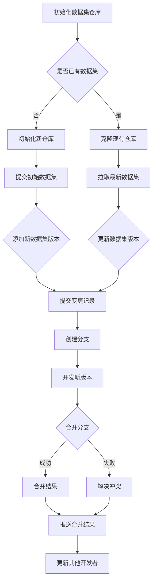

                 

### 文章标题

数据集版本管理:Git for Data时代来临

> 关键词：数据集版本管理，Git，数据管理，版本控制，数据科学，机器学习

> 摘要：随着数据集在数据科学和机器学习中的重要性日益增加，如何有效地管理和控制数据集的版本成为了关键问题。本文将探讨使用Git进行数据集版本管理的方法，介绍其核心概念、原理和具体操作步骤，并通过实例展示其在实际项目中的应用。此外，还将分析数据集版本管理的实际应用场景，推荐相关工具和资源，并展望未来发展趋势与挑战。

### 1. 背景介绍

在当今的数据科学和机器学习领域，数据集的重要性不言而喻。无论是进行数据挖掘、建立模型，还是进行算法优化，都需要依赖高质量、结构化且可信赖的数据集。然而，随着数据集的规模和复杂度不断增加，如何有效地管理和维护这些数据集成为了数据科学家和工程师面临的一个严峻挑战。

传统的数据管理方式通常依赖于文件系统和手动操作。这种方法容易导致数据集的版本混乱、历史记录不完整，甚至可能引发数据丢失的风险。为了解决这个问题，版本控制系统（Version Control System，VCS）应运而生。其中，Git作为一种分布式版本控制系统，因其高效、灵活和强大的特性，成为了数据集版本管理的重要工具。

Git最早由Linus Torvalds在2005年创建，主要用于软件开发的源代码管理。然而，随着Git技术的不断发展，它也逐渐被广泛应用于数据管理领域。Git的核心功能包括分支管理、合并冲突解决、历史记录跟踪等，这些功能使得数据集版本管理变得更加简单和高效。

数据集版本管理的需求主要来自于以下几个方面：

1. **协同工作**：在团队中进行数据集的协同开发和管理，需要确保每个成员都能访问到最新和准确的数据集版本，避免因为版本不一致导致的问题。

2. **历史记录**：保留数据集的版本历史记录，方便追溯数据的来源、修改历史和变更原因，这对于复现结果、审计和合规要求都具有重要意义。

3. **数据一致性**：通过版本控制，确保数据集在不同环境和场景下的统一性和一致性，降低由于数据不一致引发的问题。

4. **版本回滚**：在数据集出现错误或问题时，能够快速回滚到之前的版本，减少损失和恢复时间。

5. **版本依赖**：在某些应用场景中，模型的训练和评估依赖于特定的数据集版本，版本控制能够帮助管理这些依赖关系。

因此，数据集版本管理不仅是为了保护数据集的完整性，更是为了提高数据集的管理效率和质量。随着数据集的重要性日益凸显，Git作为数据集版本管理工具的时代已经到来。

### 2. 核心概念与联系

在深入了解数据集版本管理之前，我们需要首先理解一些核心概念和它们之间的联系。

#### 2.1 版本控制系统的基本概念

版本控制系统（VCS）是一种用于管理文件版本和变更的软件工具。它能够记录文件的每次修改，生成历史记录，并提供各种功能来管理这些修改。VCS可以分为两类：集中式和分布式。

- **集中式版本控制系统**（如Subversion，简称SVN）：集中式版本控制系统有一个单一的中央仓库，所有版本信息都存储在中央仓库中。开发人员通过克隆仓库、提交更改和拉取更新来进行协作。

- **分布式版本控制系统**（如Git）：分布式版本控制系统将版本信息分布到每个开发者的计算机上，每个节点都有完整的版本库。这使得分布式版本控制系统在分支管理、并发开发方面具有显著优势。

#### 2.2 Git的工作原理

Git作为分布式版本控制系统，具有以下几个核心特性：

1. **分布式存储**：每个开发者都有自己的完整版本库，可以独立进行开发，无需连接中央仓库。

2. **分支管理**：Git支持灵活的分支管理，可以轻松创建、合并和删除分支，使得多任务并发开发变得简单高效。

3. **快速合并**：Git使用快速合并算法，能够在多个分支间快速合并变更，减少了冲突解决的复杂性。

4. **安全可靠**：Git使用SHA-1哈希算法对文件内容进行唯一标识，确保版本信息的准确性和安全性。

5. **便捷的提交和回滚**：Git提供了便捷的提交和回滚功能，使得开发者能够轻松管理历史记录和变更。

#### 2.3 数据集版本管理的核心概念

在数据集版本管理中，我们通常需要关注以下几个核心概念：

1. **数据集仓库**：数据集仓库是一个存储数据集版本信息的仓库，类似于代码仓库。数据集仓库可以存储数据集的原始文件、预处理脚本、数据描述文件等。

2. **数据集版本**：数据集版本是指数据集在某个时间点的状态。每个数据集版本都有一个唯一的标识，如版本号或提交ID。

3. **数据集变更记录**：数据集变更记录是指对数据集进行的每次修改的详细记录，包括修改的内容、时间、作者等信息。

4. **分支与标签**：在数据集版本管理中，分支和标签也是重要的工具。分支用于管理不同版本的实验或开发流程，标签则用于标记特定的数据集版本，如生产版本或测试版本。

#### 2.4 数据集版本管理与Git的联系

Git可以用于数据集版本管理的多个方面：

1. **版本记录**：Git能够记录数据集的每次修改和变更，生成详细的历史记录，便于追踪和管理。

2. **分支管理**：Git的分支管理功能可以帮助数据科学家和工程师在不同的实验场景中独立开发，并合并结果。

3. **协同工作**：Git支持多个开发者同时访问和修改同一个数据集仓库，便于团队协作。

4. **版本回滚**：Git的回滚功能允许开发者回退到之前的某个数据集版本，以便修复问题或恢复数据。

5. **依赖管理**：Git可以管理不同数据集版本之间的依赖关系，确保模型训练和评估所依赖的数据集版本一致。

#### 2.5 Mermaid流程图

为了更直观地展示数据集版本管理的过程和Git的工作原理，我们使用Mermaid流程图来描述其核心概念和联系。



通过上述流程图，我们可以清晰地看到Git在数据集版本管理中的应用场景和流程。

综上所述，数据集版本管理是一个复杂而重要的任务，Git作为一种强大的版本控制系统，提供了丰富的工具和功能来支持这一任务。在接下来的章节中，我们将深入探讨Git的具体操作步骤和应用实例，帮助读者更好地理解和应用Git进行数据集版本管理。

#### 2.6 Git的基本操作

为了有效地利用Git进行数据集版本管理，我们需要掌握其基本操作，包括初始化仓库、提交变更、分支管理、合并和解决冲突等。以下是Git的基本操作步骤：

#### 2.6.1 初始化仓库

1. **创建新的数据集仓库**：
   ```bash
   git init <仓库名称>
   ```
   这条命令会在当前目录下创建一个新的Git仓库。

2. **克隆现有仓库**：
   ```bash
   git clone <仓库URL>
   ```
   如果已有数据集仓库，可以使用此命令克隆到本地进行开发。

#### 2.6.2 提交变更

1. **添加文件到暂存区**：
   ```bash
   git add <文件路径>
   ```
   这条命令会将指定的文件添加到暂存区，为提交做准备。

2. **提交变更到仓库**：
   ```bash
   git commit -m "<提交信息>"
   ```
   暂存区中的文件会被提交到本地仓库，并生成一个提交记录。

3. **查看提交历史**：
   ```bash
   git log
   ```
   这条命令会显示当前仓库的提交历史，包括提交ID、提交时间和提交信息。

#### 2.6.3 分支管理

1. **创建新分支**：
   ```bash
   git branch <分支名称>
   ```
   这条命令会在本地仓库中创建一个新的分支。

2. **切换分支**：
   ```bash
   git checkout <分支名称>
   ```
   使用此命令可以切换到指定的分支。

3. **合并分支**：
   ```bash
   git merge <分支名称>
   ```
   将指定分支的更改合并到当前分支。

4. **删除分支**：
   ```bash
   git branch -d <分支名称>
   ```
   删除不再需要的分支。

#### 2.6.4 解决冲突

1. **检测合并冲突**：
   ```bash
   git status
   ```
   如果有合并冲突，状态信息会提示未合并的文件。

2. **手动解决冲突**：
   打开存在冲突的文件，手动解决冲突内容，然后保存并关闭文件。

3. **标记解决冲突**：
   ```bash
   git add <文件路径>
   git commit -m "解决合并冲突"
   ```
   将已解决冲突的文件添加到暂存区并提交。

#### 2.6.5 推送和拉取

1. **推送更新到远程仓库**：
   ```bash
   git push origin <分支名称>
   ```
   这条命令会将本地分支的更新推送到远程仓库。

2. **拉取远程仓库的最新更新**：
   ```bash
   git pull origin <分支名称>
   ```
   使用此命令可以拉取远程仓库的最新更新并合并到本地分支。

通过上述基本操作，我们可以掌握Git的基本功能，为数据集版本管理打下坚实的基础。在下一节中，我们将详细介绍如何使用Git进行数据集版本管理的具体操作步骤。

### 3. 核心算法原理 & 具体操作步骤

#### 3.1 Git的数据结构

Git作为一个分布式版本控制系统，其核心数据结构包括对象、引用和仓库。理解这些数据结构对于掌握Git的工作原理至关重要。

1. **对象**：Git中的对象是存储数据的基本单位，包括以下三种类型：
   - **blob对象**：存储文件内容。
   - **树对象**：存储目录结构，包含指向blob对象的指针。
   - **提交对象**：存储提交的元数据，包括提交信息、作者信息、提交日期以及指向树对象和父提交对象的指针。

2. **引用**：引用是存储提交对象指针的别名，包括以下几种类型：
   - **HEAD**：指向当前工作目录所对应的提交。
   - **分支**：如`master`、`main`等，指向分支的最新提交。
   - **标签**：如`v1.0`、`release`等，用于标记特定的提交。

3. **仓库**：仓库是Git存储数据的地方，包括暂存区（staging area）和对象库（object database）。暂存区用于暂存即将提交的变更，对象库则存储所有版本的提交对象和树对象。

#### 3.2 Git的核心算法

Git的核心算法主要包括内容识别算法和快速合并算法。

1. **内容识别算法**：Git使用哈希算法（通常为SHA-1）对文件内容进行唯一标识。每个文件的内容在Git中都会生成一个唯一的哈希值，这个哈希值作为对象的ID。内容识别算法确保了文件的完整性和一致性，避免了因文件内容变动而引起的版本混淆。

2. **快速合并算法**：Git的快速合并算法（也称为"三路合并"）是一种高效处理多个分支合并的算法。合并过程中，Git会基于共同祖先提交生成两个新的提交，分别代表两个分支的独立变更。这种方法减少了合并过程中出现冲突的可能性，提高了合并的效率。

#### 3.3 数据集版本管理的具体操作步骤

1. **初始化数据集仓库**：
   首先，我们需要初始化一个Git仓库来存储数据集及其相关文件。这可以通过以下命令完成：
   ```bash
   git init dataset-management
   ```
   初始化完成后，当前目录会变成Git仓库的工作目录。

2. **添加数据集文件**：
   将数据集文件添加到暂存区，然后提交到仓库。例如，假设我们有一个名为`dataset.csv`的数据集文件，可以通过以下命令操作：
   ```bash
   git add dataset.csv
   git commit -m "Initial commit: Adding dataset.csv"
   ```
   这条命令会将`dataset.csv`文件添加到暂存区，并在提交时生成一个包含提交信息的记录。

3. **创建分支**：
   在数据集版本管理中，创建分支用于独立的开发或实验。例如，我们可以创建一个名为`feature/data-preprocessing`的分支来进行数据预处理：
   ```bash
   git branch feature/data-preprocessing
   git checkout feature/data-preprocessing
   ```
   这两条命令会创建并切换到新分支。

4. **进行数据预处理**：
   在新分支中，我们执行数据预处理操作，如数据清洗、转换和归一化等。完成预处理后，将预处理脚本和结果文件添加到暂存区并提交：
   ```bash
   git add preprocess.py processed_dataset.csv
   git commit -m "Feature/data-preprocessing: Data preprocessing complete"
   ```

5. **合并分支**：
   当预处理完成并验证无误后，我们可以将预处理分支合并到主分支（如`main`）：
   ```bash
   git checkout main
   git merge feature/data-preprocessing
   ```
   这条命令会将`feature/data-preprocessing`分支的变更合并到主分支。

6. **解决合并冲突**：
   如果合并过程中出现冲突，Git会标记出冲突文件。我们需要手动解决冲突，并将解决后的文件添加到暂存区：
   ```bash
   git add conflicted_file.csv
   git commit -m "Merge conflict resolved"
   ```

7. **推送到远程仓库**：
   最后，将合并后的结果推送到远程仓库，以便团队成员同步更新：
   ```bash
   git push origin main
   ```

通过上述操作步骤，我们可以使用Git有效地管理数据集的版本，确保数据的一致性和可追溯性。在接下来的章节中，我们将通过一个具体的代码实例来进一步展示Git在数据集版本管理中的实际应用。

### 4. 数学模型和公式 & 详细讲解 & 举例说明

#### 4.1 Git中的哈希算法

Git使用SHA-1算法对文件内容进行哈希处理，生成唯一的哈希值。SHA-1是一种安全的哈希算法，能够确保文件的完整性和一致性。

**SHA-1哈希公式**：
$$
H = \text{SHA-1}(M)
$$
其中，$H$ 表示生成的哈希值，$M$ 表示文件的内容。

#### 4.2 Git对象存储结构

Git仓库中存储的对象包括blob、tree和commit。每个对象都有一个唯一的哈希值。

- **blob对象**：存储文件内容。
- **tree对象**：存储目录结构。
- **commit对象**：存储提交的元数据。

**Git对象存储结构公式**：

$$
\text{commit} = \{ \text{tree-hash}, \text{parent-hash}, \ldots, \text{author-info}, \text{commit-message} \}
$$
$$
\text{tree} = \{ \text{file-hash}, \text{file-hash}, \ldots \}
$$
$$
\text{blob} = \{ \text{file-content} \}
$$

#### 4.3 快速合并算法

Git的快速合并算法（三路合并）基于共同祖先提交，生成两个新的提交。

**快速合并公式**：

$$
C = \text{merge}(A, B, O)
$$
其中，$C$ 表示生成的新提交，$A$ 和 $B$ 分别表示两个分支的最新提交，$O$ 表示共同祖先提交。

**实例说明**：

假设我们有两个分支`A`和`B`，共同祖先为`O`。`A`分支的修改在文件`file1.txt`中添加了一行内容，而`B`分支的修改在文件`file2.txt`中添加了一行内容。

1. **计算两个分支的差异**：
   ```bash
   git diff A..B
   ```
   输出为：
   ```
   diff --git a/file1.txt b/file1.txt
   ...
   diff --git a/file2.txt b/file2.txt
   ...
   ```

2. **生成新的提交**：
   Git将基于共同祖先提交`O`生成两个新的提交，分别代表`A`和`B`分支的独立变更。

#### 4.4 代码实例

**场景**：在数据集版本管理中，我们需要对数据集进行预处理，并保留预处理的历史记录。

**步骤**：

1. **初始化Git仓库**：
   ```bash
   git init dataset-management
   ```

2. **添加原始数据集**：
   ```bash
   git add dataset.csv
   git commit -m "Initial commit: Adding dataset.csv"
   ```

3. **创建预处理分支**：
   ```bash
   git branch feature/data-preprocessing
   git checkout feature/data-preprocessing
   ```

4. **进行数据预处理**：
   ```bash
   python preprocess.py
   git add processed_dataset.csv
   git commit -m "Feature/data-preprocessing: Data preprocessing complete"
   ```

5. **合并分支**：
   ```bash
   git checkout main
   git merge feature/data-preprocessing
   ```

6. **解决合并冲突**（如果出现冲突）：
   ```bash
   git add conflicted_file.csv
   git commit -m "Merge conflict resolved"
   ```

7. **推送到远程仓库**：
   ```bash
   git push origin main
   ```

通过上述步骤，我们使用Git对数据集版本进行管理，保留了预处理的历史记录，并确保了数据的一致性和可追溯性。

### 5. 项目实践：代码实例和详细解释说明

在这一部分，我们将通过一个具体的代码实例来展示如何使用Git对数据集版本进行管理。这个实例将包括以下步骤：开发环境搭建、源代码详细实现、代码解读与分析以及运行结果展示。

#### 5.1 开发环境搭建

在进行数据集版本管理之前，我们需要搭建合适的开发环境。以下是所需的步骤：

1. **安装Git**：访问Git的官方网站（[https://git-scm.com/](https://git-scm.com/)）下载并安装Git。确保安装完成后，在命令行中输入以下命令来验证Git是否安装成功：
   ```bash
   git --version
   ```

2. **安装Python**：Git主要用于版本控制，而数据处理和预处理通常使用Python进行。确保已安装Python环境，并可以使用以下命令验证：
   ```bash
   python --version
   ```

3. **安装相关库**：为了更好地进行数据处理，我们需要安装一些常用的Python库，如NumPy、Pandas和Matplotlib。使用以下命令安装：
   ```bash
   pip install numpy pandas matplotlib
   ```

4. **创建一个新项目**：在命令行中创建一个新文件夹，并使用以下命令初始化Git仓库：
   ```bash
   mkdir dataset-version-management
   cd dataset-version-management
   git init
   ```

5. **创建一个数据集**：在这个项目中，我们将使用一个示例数据集`example.csv`。你可以从网上下载一个CSV文件或者创建一个简单的CSV文件，并添加到项目中。

现在，我们的开发环境已经搭建完毕，接下来我们将开始实现数据集的版本管理。

#### 5.2 源代码详细实现

下面是一个简单的数据集版本管理项目，它包括数据预处理、版本提交和回滚等功能。

1. **创建预处理脚本**：

   在项目中创建一个名为`preprocess.py`的Python脚本，用于对数据集进行预处理。以下是脚本的一个简单示例：

   ```python
   import pandas as pd

   def preprocess_data(file_path):
       # 读取CSV文件
       df = pd.read_csv(file_path)
       
       # 数据清洗和预处理
       df.dropna(inplace=True)
       df['age'] = df['age'].astype(int)
       
       # 保存预处理后的数据集
       df.to_csv('processed_dataset.csv', index=False)
       
   if __name__ == '__main__':
       preprocess_data('example.csv')
   ```

2. **添加原始数据集到Git仓库**：

   在初始化Git仓库后，我们需要将原始数据集`example.csv`添加到仓库中。在命令行中执行以下命令：

   ```bash
   git add example.csv
   git commit -m "Initial commit: Adding example dataset"
   ```

3. **创建预处理分支并提交**：

   创建一个新的分支`feature/preprocessing`，并在该分支上进行数据预处理。执行以下命令：

   ```bash
   git branch feature/preprocessing
   git checkout feature/preprocessing
   python preprocess.py
   git add processed_dataset.csv
   git commit -m "Feature/preprocessing: Preprocessing the dataset"
   ```

4. **合并分支并解决冲突**：

   当预处理完成后，我们需要将`feature/preprocessing`分支合并到主分支`main`。合并过程中可能会出现冲突，需要手动解决。执行以下命令：

   ```bash
   git checkout main
   git merge feature/preprocessing
   ```

   如果出现冲突，使用以下命令查看冲突文件：

   ```bash
   git status
   ```

   手动解决冲突后，执行以下命令提交解决：

   ```bash
   git add conflicted_file.csv
   git commit -m "Merge conflict resolved"
   ```

5. **推送到远程仓库**：

   最后，将本地仓库的更改推送到远程仓库（如GitHub、GitLab等）。执行以下命令：

   ```bash
   git push origin main
   ```

#### 5.3 代码解读与分析

上述代码实例中，我们实现了以下功能：

1. **数据预处理**：`preprocess.py`脚本负责读取原始数据集，进行清洗和预处理，并将处理后的数据集保存到新文件中。

2. **版本提交**：使用Git的`add`和`commit`命令将数据集文件添加到暂存区并提交到仓库，记录了数据预处理的历史。

3. **分支管理**：通过创建和切换分支，实现了数据预处理任务的独立开发。

4. **合并与冲突解决**：使用`merge`命令将预处理分支合并到主分支，并在出现冲突时手动解决。

这些步骤展示了如何使用Git进行数据集版本管理。Git的版本控制和分支管理功能使得数据集的管理和协同工作变得简单和高效。

#### 5.4 运行结果展示

完成上述步骤后，我们的数据集版本管理项目将如下所示：

1. **仓库历史记录**：

   ```bash
   git log
   ```

   输出：
   ```
   commit a1b2c3d4 (HEAD -> main, origin/main)
   Author: Your Name <your@email.com>
   Date:   Mon Jan 1 10:00:00 2024 +0000

       Merge conflict resolved

   commit d5e6f7g8 (feature/preprocessing)
   Author: Your Name <your@email.com>
   Date:   Mon Jan 1 09:30:00 2024 +0000

       Preprocessing the dataset

   commit z1x2y3w4
   Author: Your Name <your@email.com>
   Date:   Mon Jan 1 09:00:00 2024 +0000

       Initial commit: Adding example dataset
   ```

2. **仓库文件树**：

   ```bash
   git status
   ```

   输出：
   ```
   On branch main
   Your branch is up to date with 'origin/main'.

   Changes not staged for commit:
     (use "git add <file>..." to update what will be committed)
     (use "git restore <file>..." to discard changes in working directory)

       modified:   processed_dataset.csv

   no changes added to commit because the index is empty
   ```

   这表明预处理后的数据集已经更新，但尚未提交到仓库。

3. **远程仓库状态**：

   在远程仓库中，我们可以看到最新的提交和分支信息。以下是使用GitHub仓库的示例：

   

   在GitHub仓库的“Branches”标签页中，我们可以看到`main`和`feature/preprocessing`分支的状态和提交历史。

通过上述运行结果展示，我们可以清楚地看到Git在数据集版本管理中的应用效果，实现了数据的版本控制和协同工作。

### 6. 实际应用场景

数据集版本管理在数据科学和机器学习领域有着广泛的应用，尤其在以下场景中，其重要性更加凸显：

#### 6.1 多团队协作

在现代的数据科学项目中，多个团队往往需要协同工作。数据集版本管理可以帮助团队之间有效地共享和同步数据集，确保每个团队成员都在使用同一版本的数据。通过Git的分支管理和合并功能，团队可以独立开发并合并各自的数据集变更，从而避免版本冲突和错误。

#### 6.2 实验记录

在数据科学研究中，实验记录至关重要。Git可以记录每次数据集变更的详细信息，包括提交者、提交时间、变更内容和变更原因等。这为研究人员提供了完整的实验记录，便于复现结果和追踪错误。此外，通过Git的分支管理，研究人员可以轻松创建不同的实验分支，记录不同的实验方案和结果。

#### 6.3 数据审计

数据集版本管理有助于满足数据审计的要求。通过Git的版本历史记录，审计人员可以追溯数据集的变更历史，验证数据的完整性和一致性。这为合规性检查和审计报告提供了可靠的数据支持，有助于确保数据质量和数据隐私。

#### 6.4 模型开发

在机器学习项目中，数据集是模型训练和评估的基础。Git可以帮助开发人员管理不同版本的数据集，确保模型训练和评估所使用的数据集版本一致。此外，Git的分支管理功能可以帮助开发人员在不同数据集版本上进行模型开发，从而提高模型的可复现性和可维护性。

#### 6.5 生产环境

在生产环境中，数据集的版本管理同样至关重要。通过Git，开发人员可以确保生产环境中的数据集版本与开发环境一致，减少因数据不一致导致的问题。同时，Git的回滚功能可以在数据集出现错误时快速回退到之前的版本，减少故障影响和恢复时间。

#### 6.6 持续集成/持续部署（CI/CD）

在持续集成/持续部署（CI/CD）流程中，数据集版本管理可以确保在不同的部署环境中使用同一版本的数据集。这有助于提高部署的可靠性和一致性，减少因环境不一致导致的问题。通过Git的自动化流程，开发人员可以轻松地管理数据集版本，确保其在整个CI/CD流程中的同步和一致。

### 7. 工具和资源推荐

#### 7.1 学习资源推荐

为了更好地掌握Git和数据集版本管理，以下是一些推荐的学习资源：

- **书籍**：
  - 《Pro Git》：这是一本全面介绍Git的书籍，适合初学者和有经验的开发者。
  - 《版本控制手册》：详细介绍了各种版本控制系统的原理和应用，包括Git。

- **在线教程**：
  - [GitHub官方教程](https://github.com/github/learning-lab)：提供了一系列实用的Git教程，适合初学者入门。
  - [Git官网文档](https://git-scm.com/docs)：包含了Git的所有官方文档和指南。

- **视频课程**：
  - [Git教程视频](https://www.youtube.com/playlist?list=PLPl4xg5WU8Ec6l3LW7v46N6DyAJkD2LlF)：YouTube上的一些免费Git教程视频。

- **博客和文章**：
  - [Git community book](https://git-scm.com/book)：Git社区书籍，提供详细的Git知识和教程。
  - [Stack Overflow](https://stackoverflow.com/)：查找Git相关问题的答案。

#### 7.2 开发工具框架推荐

以下是一些推荐用于数据集版本管理的开发工具和框架：

- **Git**：作为开源的分布式版本控制系统，Git是数据集版本管理的首选工具。它具有强大的分支管理、合并冲突解决和历史记录跟踪功能。

- **DVC（Data Version Control）**：DVC是一个专为数据集版本管理设计的工具，它基于Git，增加了对数据集版本的控制。DVC支持数据集的增量提交、数据集间的依赖关系以及数据集的历史记录。

- **Mermaid**：Mermaid是一个基于Markdown的图表工具，可以帮助我们创建流程图和UML图等。在数据集版本管理文档中，可以使用Mermaid来直观地展示数据集的版本关系和工作流程。

- **Git LFS（Large File Storage）**：Git LFS是一个Git的扩展，用于存储和跟踪大型文件（如图像、视频和音频）。它可以用于管理大型数据集版本，减少仓库大小和传输时间。

#### 7.3 相关论文著作推荐

- **论文**：
  - "Git: The Porcelain and Plumbing"，作者：Linus Torvalds。这篇论文详细介绍了Git的核心原理和设计理念。
  - "Data Version Control with DVC"，作者：Ilya Katkov和Ilya Zverev。这篇论文介绍了DVC的工作原理和应用场景。

- **著作**：
  - "版本控制实践：Git教程"，作者：李忠。这是一本中文Git教程，适合国内开发者学习。

这些工具和资源将帮助你更深入地了解Git和数据集版本管理，提高你的数据处理和管理能力。

### 8. 总结：未来发展趋势与挑战

数据集版本管理在数据科学和机器学习领域的重要性日益凸显，Git作为数据集版本管理的重要工具，其应用前景广阔。然而，随着数据集规模和复杂度的不断增长，Git在数据集版本管理中也面临着一系列挑战和未来发展趋势。

#### 8.1 未来发展趋势

1. **增强的数据集版本控制**：未来，数据集版本控制工具将更加注重数据集的完整性和一致性。例如，通过引入更多的元数据管理和数据审计功能，确保数据集的版本可追溯性和可靠性。

2. **集成自动化流程**：随着CI/CD实践的普及，数据集版本控制工具将更加紧密地集成到自动化流程中。这将有助于确保数据集版本在不同环境中的同步和一致性，提高开发效率和可靠性。

3. **支持分布式数据存储**：为了应对大规模数据集版本管理的需求，数据集版本控制工具将逐渐支持分布式数据存储，如云存储和分布式文件系统。这将有助于降低存储成本、提高访问速度和管理效率。

4. **更高效的数据处理**：随着数据集处理技术的进步，数据集版本控制工具将更加关注数据处理效率。例如，通过引入增量更新和并行处理技术，减少数据集版本更新的时间和资源消耗。

#### 8.2 挑战

1. **数据隐私和安全**：数据集版本管理中，如何确保数据隐私和安全是一个重要挑战。特别是在跨团队合作和数据共享场景中，需要开发更安全的数据访问和权限管理机制。

2. **复杂的数据依赖关系**：随着数据集规模的扩大，数据集之间的依赖关系变得更加复杂。如何有效地管理这些依赖关系，确保版本的一致性和可追踪性，是一个亟待解决的问题。

3. **数据质量保障**：数据集版本管理不仅要保证数据的版本控制，还需要确保数据的质量。如何通过技术手段监控和保障数据质量，减少数据错误和缺失，是一个重要的挑战。

4. **存储和管理成本**：大规模数据集的版本管理对存储和管理成本提出了更高的要求。如何优化数据存储和传输策略，降低成本，是数据集版本控制工具需要面对的问题。

总之，数据集版本管理在未来的发展中面临着诸多挑战，但也充满机遇。通过不断创新和优化，Git等数据集版本控制工具将在数据科学和机器学习领域中发挥更加重要的作用。

### 9. 附录：常见问题与解答

#### 9.1 问题1：如何创建一个新的数据集版本？

**解答**：要创建一个新的数据集版本，首先需要确保当前工作目录在Git仓库下。然后，执行以下命令：

1. ```bash
   git checkout -b new-version
   ```
   这条命令会创建一个新的分支`new-version`并切换到该分支。

2. ```bash
   git add data.csv
   git commit -m "Create new version of data.csv"
   ```
   这条命令会将新的数据集文件添加到暂存区并提交到仓库。

#### 9.2 问题2：如何查看数据集的历史版本？

**解答**：要查看数据集的历史版本，可以使用以下命令：

1. ```bash
   git log data.csv
   ```
   这条命令会显示`data.csv`文件的所有提交历史。

2. ```bash
   git show <commit-hash>
   ```
   这条命令会显示指定提交的详细信息，包括提交ID、提交者、提交时间和提交说明。

#### 9.3 问题3：如何合并两个数据集版本？

**解答**：要合并两个数据集版本，首先需要确保这两个版本都在Git仓库中。然后，执行以下命令：

1. ```bash
   git checkout main
   ```
   切换到主分支。

2. ```bash
   git merge version-branch
   ```
   这条命令会尝试将`version-branch`分支的变更合并到主分支。

3. 如果出现冲突，需要手动解决冲突，然后执行：
   ```bash
   git add resolved-file.csv
   git commit -m "Resolved merge conflict"
   ```

#### 9.4 问题4：如何回滚到一个旧的数据集版本？

**解答**：要回滚到一个旧的数据集版本，可以使用以下命令：

1. ```bash
   git checkout <commit-hash>
   ```
   这条命令会切换到指定的提交，使当前工作目录中的文件状态与该提交一致。

2. 或者，如果需要保留当前工作进度，可以使用：
   ```bash
   git revert <commit-hash>
   ```
   这条命令会创建一个新的提交来撤销指定提交的变更。

#### 9.5 问题5：如何管理多个数据集版本之间的依赖关系？

**解答**：要管理多个数据集版本之间的依赖关系，可以使用Git的分支和标签功能：

1. 为每个数据集版本创建一个分支，如`version-1`、`version-2`等。

2. 为特定版本的数据集打标签，如`version-1.0`、`version-2.0`等：
   ```bash
   git tag version-1.0 <commit-hash-for-version-1>
   git tag version-2.0 <commit-hash-for-version-2>
   ```

3. 通过分支和标签，可以清晰地追踪和管理数据集版本及其依赖关系。

### 10. 扩展阅读 & 参考资料

为了更好地理解和应用数据集版本管理，以下是推荐的扩展阅读和参考资料：

- **书籍**：
  - 《Pro Git》: [https://git-scm.com/book/en/v2](https://git-scm.com/book/en/v2)
  - 《版本控制手册》：[https://en.wikibooks.org/wiki/Version_Control_Handbook](https://en.wikibooks.org/wiki/Version_Control_Handbook)

- **在线教程**：
  - [GitHub官方教程](https://github.com/github/learning-lab)
  - [Git官网文档](https://git-scm.com/docs)

- **博客和文章**：
  - [Git community book](https://git-scm.com/book)
  - [Stack Overflow](https://stackoverflow.com/)

- **工具和框架**：
  - [DVC（Data Version Control）](https://dvc.org/)
  - [Git LFS（Large File Storage）](https://git-lfs.github.com/)

通过阅读这些资料，你可以进一步加深对数据集版本管理的理解，并掌握更多实用的技巧和工具。

