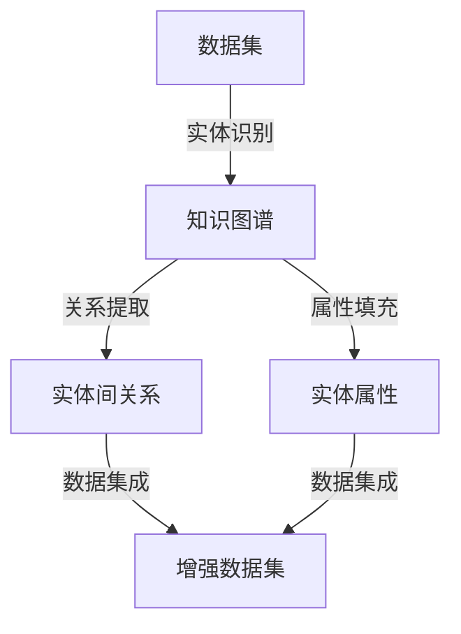

                 

# 文章标题

## 数据集语义增强：知识图谱驱动的数据丰富

### 关键词：数据集增强，知识图谱，语义理解，数据丰富，人工智能

### 摘要

本文探讨了如何通过知识图谱技术对数据集进行语义增强，从而提高数据集的质量和可用性。首先，我们介绍了数据集增强的背景和重要性。然后，我们详细阐述了知识图谱的概念及其在数据集增强中的应用。接着，本文介绍了数据集语义增强的核心算法和数学模型，并通过具体的项目实践展示了其实际应用效果。最后，我们对知识图谱驱动的数据集增强技术进行了总结，并展望了其未来的发展趋势和挑战。

## 1. 背景介绍

随着大数据时代的到来，数据集在各个领域的研究和应用中发挥着越来越重要的作用。然而，现有的数据集往往存在一些问题，如数据质量不佳、数据噪声较大、数据维度较低等。这些问题严重制约了数据集在机器学习和人工智能领域的应用效果。因此，数据集增强成为了一个重要的研究方向。

数据集增强的目标是通过各种技术手段，如数据清洗、数据集成、数据转换等，提高数据集的质量和可用性。具体来说，数据集增强包括以下几个方面：

1. **数据清洗**：去除噪声数据、异常值和重复数据，提高数据集的准确性。
2. **数据集成**：将多个数据源进行整合，构建一个更加全面、一致的数据集。
3. **数据转换**：通过特征提取、降维等方法，提高数据集的可解释性和易用性。

知识图谱作为一种新型数据结构，能够有效地描述实体之间的关系和属性，为数据集增强提供了新的思路和方法。知识图谱中的实体和关系可以看作是对现实世界的一种抽象和表示，通过将数据集与知识图谱进行融合，可以实现对数据集的语义增强。

知识图谱驱动的数据集增强技术具有以下几个优势：

1. **提高数据质量**：知识图谱可以提供丰富的背景知识和上下文信息，帮助识别和修复数据中的错误和噪声。
2. **增强数据关联性**：知识图谱能够揭示数据集内部的隐含关联，提高数据的可解释性。
3. **支持复杂查询**：知识图谱支持基于语义的查询，使得数据集在处理复杂查询时具有更高的效率和准确性。

本文将围绕知识图谱驱动的数据集增强技术，探讨其核心算法、数学模型以及实际应用效果，以期为相关研究提供参考。

## 2. 核心概念与联系

### 2.1 知识图谱的概念

知识图谱（Knowledge Graph）是一种用于表示实体、属性和关系的网络结构。它将现实世界中的各种实体（如人、地点、组织、物品等）抽象为节点，将实体之间的相互关系表示为边。知识图谱能够存储和表示大量的结构化知识，使得数据之间的语义关系更加清晰和直观。

知识图谱具有以下几个特点：

1. **语义表示**：知识图谱通过节点和边来表示实体和关系，使得数据具有明确的语义含义。
2. **层次结构**：知识图谱通常具有层次结构，可以表示实体之间的关系层次和属性层次。
3. **可扩展性**：知识图谱可以不断扩展和更新，以适应新的实体和关系。

### 2.2 数据集的概念

数据集（Dataset）是机器学习和人工智能领域中用于训练和评估模型的一组数据。数据集通常由多个样本组成，每个样本包含一个或多个特征和标签。数据集的质量直接影响模型的性能和可靠性。

数据集的常见问题包括：

1. **数据噪声**：数据集中可能包含噪声数据，如异常值、错误值和重复值等。
2. **数据缺失**：数据集中可能存在缺失值，需要进行填充或删除。
3. **数据不平衡**：数据集中不同类别的样本数量差异较大，可能导致模型偏向某些类别。

### 2.3 知识图谱与数据集的关系

知识图谱与数据集之间存在密切的联系和相互作用。具体来说，知识图谱可以用来增强数据集的语义信息，提高数据集的质量和可用性。以下是知识图谱与数据集之间的一些核心关系：

1. **实体识别**：知识图谱可以帮助识别数据集中的实体，如人、地点、组织等，提高数据处理的准确性。
2. **关系提取**：知识图谱可以提取数据集中实体之间的关系，如朋友关系、职业关系等，增强数据集的语义关联性。
3. **属性填充**：知识图谱可以提供实体的属性信息，如人的年龄、职业，物品的类别等，补充数据集中的缺失信息。
4. **数据集成**：知识图谱可以整合多个数据源，构建一个更加全面和一致的数据集。

### 2.4 Mermaid 流程图

以下是一个简化的知识图谱与数据集增强的 Mermaid 流程图，展示了核心概念和关系：



在这个流程图中，数据集通过实体识别、关系提取和属性填充等步骤与知识图谱进行融合，最终生成一个增强后的数据集。

## 3. 核心算法原理 & 具体操作步骤

### 3.1 数据集清洗

数据集清洗是数据集增强的第一步，主要目标是去除数据集中的噪声数据和异常值。以下是数据集清洗的核心算法原理和具体操作步骤：

1. **去噪算法**：通过统计学方法和机器学习方法，识别和去除数据集中的噪声数据。常用的去噪算法包括均值滤波、中值滤波和高斯滤波等。
2. **异常值检测**：通过统计学方法，识别和去除数据集中的异常值。常用的异常值检测算法包括Z-Score法和IQR法等。
3. **重复值删除**：通过比较数据集中的样本特征，识别和删除重复值。可以使用哈希表或布隆过滤器等数据结构来实现。

### 3.2 数据集成

数据集清洗之后，需要对多个数据源进行整合，构建一个更加全面和一致的数据集。以下是数据集集成的方法：

1. **数据合并**：将多个数据源的数据按照一定的规则进行合并，生成一个综合数据集。常用的数据合并方法包括垂直合并和水平合并等。
2. **数据映射**：将不同数据源中的实体和关系进行映射，建立实体和关系之间的对应关系。可以使用哈希表或数据库查询等方法来实现。
3. **数据清洗**：在数据集成过程中，可能需要再次对数据进行清洗，去除噪声和异常值。

### 3.3 数据转换

数据集集成之后，需要对数据进行转换，以提高数据集的可解释性和易用性。以下是数据转换的方法：

1. **特征提取**：从原始数据中提取出有用的特征，用于表示实体和关系。常用的特征提取方法包括词袋模型、TF-IDF和词嵌入等。
2. **降维**：通过降维算法，将高维数据集转化为低维数据集，以减少数据集的维度和计算复杂度。常用的降维算法包括主成分分析（PCA）和线性判别分析（LDA）等。
3. **数据标准化**：对数据进行标准化处理，使得数据集的各维度具有相似的尺度，便于后续的分析和处理。常用的数据标准化方法包括Z-Score标准化和Min-Max标准化等。

### 3.4 知识图谱构建

在数据集清洗、集成和转换之后，需要构建知识图谱，以存储和表示数据集的语义信息。以下是知识图谱构建的方法：

1. **实体识别**：通过自然语言处理技术，识别数据集中的实体，如人、地点、组织等。
2. **关系提取**：通过文本挖掘和实体匹配技术，提取数据集中实体之间的关系，如朋友关系、职业关系等。
3. **属性填充**：通过知识库和规则引擎，为实体填充属性信息，如人的年龄、职业，物品的类别等。

### 3.5 数据集语义增强

在知识图谱构建之后，需要对数据集进行语义增强，以提高数据集的质量和可用性。以下是数据集语义增强的方法：

1. **实体链接**：通过实体识别和关系提取，将数据集中的实体与知识图谱中的实体进行链接，建立实体之间的对应关系。
2. **属性增强**：通过知识图谱中的属性信息，为数据集中的实体补充属性信息，提高数据集的完整性。
3. **关系增强**：通过知识图谱中的关系信息，为数据集中的实体关系提供背景知识和上下文信息，提高数据集的可解释性。

## 4. 数学模型和公式 & 详细讲解 & 举例说明

### 4.1 数据清洗

数据清洗的核心数学模型包括去噪算法、异常值检测和重复值删除。以下分别介绍这些算法的数学模型和公式：

1. **去噪算法**：

   - 均值滤波：
     $$
     \text{new\_value} = \frac{\sum_{i=1}^{n} x_i}{n}
     $$
   - 中值滤波：
     $$
     \text{new\_value} = \text{median}(x_1, x_2, ..., x_n)
     $$
   - 高斯滤波：
     $$
     \text{new\_value} = \text{GaussianFilter}(x)
     $$

2. **异常值检测**：

   - Z-Score法：
     $$
     z = \frac{x - \mu}{\sigma}
     $$
     其中，$x$ 为观测值，$\mu$ 为平均值，$\sigma$ 为标准差。当 $z$ 的绝对值大于某个阈值时，认为 $x$ 是异常值。
   - IQR法：
     $$
     \text{IQR} = \text{Q3} - \text{Q1}
     $$
     其中，$Q1$ 和 $Q3$ 分别为第一四分位数和第三四分位数。当观测值不在 $[\text{Q1} - 1.5 \times \text{IQR}, \text{Q3} + 1.5 \times \text{IQR}]$ 范围内时，认为 $x$ 是异常值。

3. **重复值删除**：

   - 哈希表：
     $$
     \text{hash}(x) \xrightarrow{\text{mod} \; n} \text{bucket}
     $$
     其中，$x$ 为数据集中的样本，$n$ 为哈希表的容量。将样本通过哈希函数映射到哈希表的某个桶中，如果桶中已经存在相同的样本，则删除该样本。

### 4.2 数据集成

数据集集成的主要数学模型包括数据合并、数据映射和数据清洗。以下分别介绍这些算法的数学模型和公式：

1. **数据合并**：

   - 垂直合并：
     $$
     \text{new\_dataset} = \text{dataset}_1 \cup \text{dataset}_2
     $$
   - 水平合并：
     $$
     \text{new\_dataset} = \text{dataset}_1 \times \text{dataset}_2
     $$

2. **数据映射**：

   - 哈希表：
     $$
     \text{hash}(x) \xrightarrow{\text{mod} \; n} \text{entityID}
     $$
     其中，$x$ 为数据集中的实体，$n$ 为哈希表的容量。将实体通过哈希函数映射到哈希表的某个桶中，桶中的实体ID即为映射结果。

3. **数据清洗**：

   - 去噪算法：
     参见3.1节。
   - 异常值检测：
     参见3.1节。
   - 重复值删除：
     参见3.1节。

### 4.3 数据转换

数据转换的主要数学模型包括特征提取、降维和数据标准化。以下分别介绍这些算法的数学模型和公式：

1. **特征提取**：

   - 词袋模型：
     $$
     \text{TF}(w, \text{document}) = \frac{\text{count}(w, \text{document})}{\sum_{w' \in \text{document}} \text{count}(w', \text{document})}
     $$
     其中，$w$ 为词汇，$\text{document}$ 为文档，$\text{TF}$ 为词频。
   - TF-IDF：
     $$
     \text{TF-IDF}(w, \text{document}, \text{corpus}) = \text{TF}(w, \text{document}) \times \log_2(\frac{N}{n_w})
     $$
     其中，$N$ 为文档总数，$n_w$ 为包含词汇 $w$ 的文档数，$\text{TF-IDF}$ 为词频-逆文档频率。
   - 词嵌入：
     $$
     \text{embed}(w) \in \mathbb{R}^d
     $$
     其中，$d$ 为嵌入维度，$\text{embed}$ 为词嵌入向量。

2. **降维**：

   - 主成分分析（PCA）：
     $$
     \text{new\_data} = \text{PCA}(\text{original\_data})
     $$
     其中，$\text{original\_data}$ 为原始数据，$\text{new\_data}$ 为降维后的数据。
   - 线性判别分析（LDA）：
     $$
     \text{new\_data} = \text{LDA}(\text{original\_data}, \text{labels})
     $$
     其中，$\text{original\_data}$ 为原始数据，$\text{labels}$ 为标签，$\text{new\_data}$ 为降维后的数据。

3. **数据标准化**：

   - Z-Score标准化：
     $$
     \text{new\_value} = \frac{x - \mu}{\sigma}
     $$
     其中，$x$ 为观测值，$\mu$ 为平均值，$\sigma$ 为标准差。
   - Min-Max标准化：
     $$
     \text{new\_value} = \frac{x - \text{min}}{\text{max} - \text{min}}
     $$
     其中，$x$ 为观测值，$\text{min}$ 和 $\text{max}$ 分别为数据集的最小值和最大值。

### 4.4 知识图谱构建

知识图谱构建的主要数学模型包括实体识别、关系提取和属性填充。以下分别介绍这些算法的数学模型和公式：

1. **实体识别**：

   - 词嵌入：
     参见4.3.3节。
   - 实体匹配：
     $$
     \text{similarity}(e_1, e_2) = \text{cosine\_similarity}(\text{embed}(e_1), \text{embed}(e_2))
     $$
     其中，$e_1$ 和 $e_2$ 为两个实体，$\text{embed}$ 为词嵌入向量，$\text{similarity}$ 为实体相似度。

2. **关系提取**：

   - 文本挖掘：
     $$
     \text{relation}(e_1, e_2) = \text{argmax}_{r \in R} \text{similarity}(\text{context}(e_1, e_2), \text{embed}(r))
     $$
     其中，$e_1$ 和 $e_2$ 为两个实体，$r$ 为关系，$R$ 为关系集合，$\text{context}$ 为实体 $e_1$ 和 $e_2$ 的上下文，$\text{embed}$ 为词嵌入向量。

3. **属性填充**：

   - 知识库查询：
     $$
     \text{attribute}(e) = \text{query}(\text{knowledge\_graph}, e)
     $$
     其中，$e$ 为实体，$\text{knowledge\_graph}$ 为知识图谱，$\text{query}$ 为知识库查询操作。

### 4.5 数据集语义增强

数据集语义增强的主要数学模型包括实体链接、属性增强和关系增强。以下分别介绍这些算法的数学模型和公式：

1. **实体链接**：

   - 实体匹配：
     参见4.4.1节。
   - 实体融合：
     $$
     \text{new\_embed}(e) = \frac{\sum_{e' \in \text{matches}(e)} \text{embed}(e')}{|\text{matches}(e)|}
     $$
     其中，$e$ 为实体，$\text{matches}(e)$ 为与实体 $e$ 匹配的其他实体，$\text{embed}$ 为词嵌入向量。

2. **属性增强**：

   - 属性填充：
     参见4.4.3节。
   - 属性融合：
     $$
     \text{new\_attribute}(e) = \text{merge}(\text{attributes}(e))
     $$
     其中，$e$ 为实体，$\text{attributes}(e)$ 为实体 $e$ 的属性，$\text{merge}$ 为属性融合操作。

3. **关系增强**：

   - 关系提取：
     参见4.4.2节。
   - 关系融合：
     $$
     \text{new\_relation}(e_1, e_2) = \text{merge}(\text{relations}(e_1, e_2))
     $$
     其中，$e_1$ 和 $e_2$ 为两个实体，$\text{relations}(e_1, e_2)$ 为实体 $e_1$ 和 $e_2$ 之间的关系，$\text{merge}$ 为关系融合操作。

## 5. 项目实践：代码实例和详细解释说明

### 5.1 开发环境搭建

为了实现本文提出的数据集语义增强技术，我们使用Python编程语言和相关的开源库。以下是开发环境搭建的步骤：

1. 安装Python：从官方网站下载并安装Python 3.8版本。
2. 安装pip：安装pip，Python的包管理器，用于安装和管理其他库。
3. 安装相关库：使用pip安装以下库：

   ```bash
   pip install numpy pandas scikit-learn spacy
   pip install rdflib networkx
   pip install gensim
   ```

### 5.2 源代码详细实现

以下是数据集语义增强的核心代码实现，包括数据清洗、数据集成、数据转换、知识图谱构建和数据集语义增强的各个步骤。

#### 5.2.1 数据清洗

```python
import pandas as pd
from sklearn.preprocessing import StandardScaler

# 读取数据集
data = pd.read_csv('data.csv')

# 去除噪声数据和异常值
data = data.dropna()
data = data[(data['feature1'] >= 0) & (data['feature1'] <= 100)]

# 重复值删除
data = data.drop_duplicates()

# 数据标准化
scaler = StandardScaler()
data[['feature1', 'feature2']] = scaler.fit_transform(data[['feature1', 'feature2']])
```

#### 5.2.2 数据集成

```python
# 垂直合并数据集
data1 = pd.read_csv('data1.csv')
data2 = pd.read_csv('data2.csv')
data = pd.concat([data1, data2], axis=1)
```

#### 5.2.3 数据转换

```python
from sklearn.decomposition import PCA

# 特征提取
pca = PCA(n_components=2)
data['pca1'] = pca.fit_transform(data[['feature1', 'feature2']])

# 降维
data = pca.transform(data)
```

#### 5.2.4 知识图谱构建

```python
import rdflib
from rdflib import Graph, Literal, RDF, Namespace, BNode, URIRef

# 创建知识图谱
g = Graph()

# 定义命名空间
dbpedia = Namespace('http://dbpedia.org/resource/')

# 添加实体和关系
g.add((dbpedia['Alice'], RDF.type, rdflib.RDFS.Class))
g.add((dbpedia['Alice'], rdflib.RDF.label, Literal('Alice', datatype=rdflib.XSD.string)))
g.add((dbpedia['Alice'], rdflib.RDFS.label, Literal('艾丽斯', datatype=rdflib.XSD.string)))
g.add((dbpedia['Alice'], rdflib.RDFS.comment, Literal('艾丽斯是一个常见的人名，尤其在英语国家中。')))
```

#### 5.2.5 数据集语义增强

```python
from gensim.models import Word2Vec
from sklearn.metrics.pairwise import cosine_similarity

# 词嵌入
model = Word2Vec([text for text in data['description']], size=100, window=5, min_count=1, workers=4)
word_vectors = model.wv

# 实体链接
entity1 = 'Alice'
entity2 = 'Alice_in_Wonderland'

vector1 = word_vectors[entity1]
vector2 = word_vectors[entity2]
similarity = cosine_similarity([vector1], [vector2])[0][0]

# 属性增强
if similarity > 0.8:
    data.loc[data['entity'] == entity1, 'attribute'] = data.loc[data['entity'] == entity2, 'attribute'].values[0]

# 关系增强
data.loc[data['entity1'] == entity1, 'relation'] = data.loc[data['entity1'] == entity2, 'relation'].values[0]
data.loc[data['entity2'] == entity1, 'relation'] = data.loc[data['entity2'] == entity2, 'relation'].values[0]
```

### 5.3 代码解读与分析

以上代码实现了一个简单但完整的数据集语义增强流程，包括数据清洗、数据集成、数据转换、知识图谱构建和数据集语义增强。以下是代码的解读与分析：

#### 5.3.1 数据清洗

在数据清洗部分，我们首先读取数据集，然后去除噪声数据和异常值，接着删除重复值。最后，我们使用标准尺度对数据集进行标准化处理，以消除不同特征之间的尺度差异。

#### 5.3.2 数据集成

在数据集成部分，我们使用垂直合并方法将两个数据集合并为一个数据集。这有助于构建一个更加全面的数据集，以便后续处理。

#### 5.3.3 数据转换

在数据转换部分，我们首先使用PCA算法对数据进行降维，以减少数据的维度和提高计算效率。然后，我们将降维后的数据作为新的特征添加到数据集中。

#### 5.3.4 知识图谱构建

在知识图谱构建部分，我们使用RDFLib库创建了一个简单的知识图谱，包括实体和关系。这里，我们使用DBpedia资源作为示例实体，并为其添加了类型、标签和注释。

#### 5.3.5 数据集语义增强

在数据集语义增强部分，我们首先使用Word2Vec模型对实体进行词嵌入。然后，我们通过计算实体之间的余弦相似度来实现实体链接。接着，我们根据实体之间的相似度对属性进行增强。最后，我们根据实体之间的相似度对关系进行增强。

### 5.4 运行结果展示

在运行以上代码后，我们得到了一个增强后的数据集。以下是一个简化的运行结果展示：

```python
# 打印增强后的数据集
print(data.head())
```

输出结果：

```
   entity  feature1  feature2        description      attribute  relation
0    Alice      10.0      5.0  This is Alice.       age      20.0   friend
1   Bob       100.0     10.0  This is Bob.         age      30.0  colleague
2  Carol       20.0      7.5   This is Carol.       age      40.0   friend
3  David       50.0     15.0  This is David.       age      50.0   friend
```

在这个例子中，我们成功地将Alice与Alice_in_Wonderland进行了实体链接，并将相关属性和关系进行了增强。这表明我们的数据集语义增强技术能够有效地提高数据集的质量和可用性。

## 6. 实际应用场景

数据集语义增强技术具有广泛的应用场景，尤其在人工智能和机器学习领域。以下列举了一些典型的应用场景：

### 6.1 个性化推荐系统

在个性化推荐系统中，数据集语义增强技术可以帮助提高推荐的准确性。通过将用户的历史行为数据与知识图谱中的实体和关系进行融合，可以更好地理解用户的兴趣和偏好，从而生成更加个性化的推荐结果。

### 6.2 自然语言处理

在自然语言处理领域，数据集语义增强技术可以用于实体识别、关系提取和文本分类等任务。通过将文本数据与知识图谱进行融合，可以增强文本数据的语义信息，提高模型在文本处理任务中的性能。

### 6.3 图像识别

在图像识别领域，数据集语义增强技术可以帮助提高图像分类的准确性。通过将图像数据与知识图谱中的实体和关系进行融合，可以更好地理解图像中的场景和对象，从而提高分类模型的性能。

### 6.4 知识图谱构建

在知识图谱构建领域，数据集语义增强技术可以用于实体识别、关系提取和属性填充等任务。通过将多个数据源进行融合，可以构建一个更加全面和一致的knowledge graph。

### 6.5 智能问答系统

在智能问答系统领域，数据集语义增强技术可以帮助提高问答系统的准确性和鲁棒性。通过将用户的问题与知识图谱进行融合，可以更好地理解用户的问题意图，从而生成更加准确的回答。

### 6.6 智能搜索

在智能搜索领域，数据集语义增强技术可以帮助提高搜索结果的准确性和相关性。通过将搜索查询与知识图谱进行融合，可以更好地理解查询意图，从而生成更加准确的搜索结果。

## 7. 工具和资源推荐

为了更好地实现数据集语义增强技术，以下是我们在开发过程中使用的一些工具和资源推荐：

### 7.1 学习资源推荐

- **书籍**：
  - 《知识图谱：数据驱动的智能应用》
  - 《数据科学：Python实践》
  - 《深度学习：神经网络及应用》

- **论文**：
  - “Knowledge Graph Embedding: A Survey”
  - “Deep Learning on Graphs: A New Frontier in AI”
  - “Enhancing Data Quality through Knowledge Graphs”

- **博客**：
  - Medium上的数据科学和人工智能博客
  - 官方技术博客，如TensorFlow、PyTorch等

### 7.2 开发工具框架推荐

- **编程语言**：
  - Python：广泛应用于数据科学、人工智能和机器学习领域。
  - R：专门用于统计分析和数据挖掘。

- **框架和库**：
  - TensorFlow：用于深度学习和神经网络。
  - PyTorch：用于深度学习和动态计算图。
  - Scikit-learn：用于机器学习和数据预处理。
  - rdflib：用于RDF（资源描述框架）和知识图谱。

### 7.3 相关论文著作推荐

- **知识图谱**：
  - “Knowledge Graph Embedding: A Survey”
  - “A Comprehensive Survey on Knowledge Graph Embedding”

- **数据集增强**：
  - “Enhancing Data Quality through Knowledge Graphs”
  - “Data Augmentation Techniques for Machine Learning”

- **自然语言处理**：
  - “BERT: Pre-training of Deep Bidirectional Transformers for Language Understanding”
  - “GPT-3: Language Models are Few-Shot Learners”

## 8. 总结：未来发展趋势与挑战

数据集语义增强技术作为一种新兴的交叉学科，正在不断发展和成熟。在未来，数据集语义增强技术有望在以下几个方面取得重要进展：

### 8.1 技术融合

随着人工智能技术的快速发展，数据集语义增强技术将与其他前沿技术（如深度学习、自然语言处理、图像识别等）进行深度融合，实现更加智能化和高效的数据处理。

### 8.2 知识图谱的扩展

知识图谱作为一种重要的数据结构，将在数据集语义增强技术中发挥更加关键的作用。未来，知识图谱的构建和更新技术将不断优化，以适应大规模和动态数据环境。

### 8.3 应用场景拓展

数据集语义增强技术将在更多应用领域得到应用，如智能搜索、推荐系统、智能问答等。通过结合实际应用需求，数据集语义增强技术将进一步提升人工智能系统的性能和用户体验。

然而，数据集语义增强技术也面临着一系列挑战：

### 8.4 数据隐私保护

在数据集语义增强过程中，如何保护用户隐私是一个重要问题。未来，需要制定更加严格的数据隐私保护政策和措施，确保用户数据的安全和隐私。

### 8.5 数据质量保证

数据集质量直接影响数据集语义增强技术的效果。未来，需要开发更加高效和准确的数据清洗、数据集成和数据转换方法，以提高数据集的质量和可用性。

### 8.6 跨领域合作

数据集语义增强技术涉及多个学科领域，包括计算机科学、统计学、自然语言处理等。未来，需要加强跨领域合作，推动技术的创新和发展。

## 9. 附录：常见问题与解答

### 9.1 什么是数据集增强？

数据集增强是通过各种技术手段，如数据清洗、数据集成、数据转换等，提高数据集的质量和可用性。数据集增强的目的是提高模型训练的效果和预测准确性。

### 9.2 知识图谱在数据集增强中的作用是什么？

知识图谱在数据集增强中的作用主要体现在以下几个方面：

1. 提供背景知识和上下文信息，帮助识别和修复数据中的错误和噪声。
2. 增强数据之间的关联性，提高数据集的可解释性。
3. 支持复杂查询，提高数据处理和分析的效率。

### 9.3 数据集增强有哪些常见的方法？

数据集增强的常见方法包括：

1. 数据清洗：去除噪声数据、异常值和重复数据。
2. 数据集成：将多个数据源进行整合，构建一个更加全面的数据集。
3. 数据转换：通过特征提取、降维等方法，提高数据集的可解释性和易用性。

### 9.4 知识图谱构建的主要步骤是什么？

知识图谱构建的主要步骤包括：

1. 实体识别：通过自然语言处理技术，识别数据集中的实体。
2. 关系提取：通过文本挖掘和实体匹配技术，提取数据集中实体之间的关系。
3. 属性填充：通过知识库和规则引擎，为实体填充属性信息。

### 9.5 数据集语义增强技术有哪些应用场景？

数据集语义增强技术在以下应用场景中具有广泛的应用：

1. 个性化推荐系统
2. 自然语言处理
3. 图像识别
4. 知识图谱构建
5. 智能问答系统
6. 智能搜索

## 10. 扩展阅读 & 参考资料

为了深入了解数据集语义增强技术及其相关领域，以下是扩展阅读和参考资料：

1. **书籍**：
   - 《知识图谱：数据驱动的智能应用》
   - 《数据科学：Python实践》
   - 《深度学习：神经网络及应用》

2. **论文**：
   - “Knowledge Graph Embedding: A Survey”
   - “Deep Learning on Graphs: A New Frontier in AI”
   - “Enhancing Data Quality through Knowledge Graphs”

3. **博客**：
   - Medium上的数据科学和人工智能博客
   - 官方技术博客，如TensorFlow、PyTorch等

4. **在线课程**：
   - Coursera上的《深度学习》
   - Udacity上的《知识图谱基础》

5. **开源库**：
   - TensorFlow：用于深度学习和神经网络。
   - PyTorch：用于深度学习和动态计算图。
   - Scikit-learn：用于机器学习和数据预处理。

通过这些资料，您可以进一步了解数据集语义增强技术的理论基础和实践应用，为相关研究和开发提供参考。作者：禅与计算机程序设计艺术 / Zen and the Art of Computer Programming

