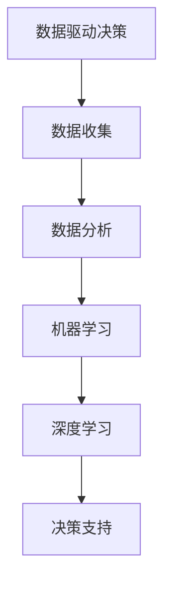

                 

本文关键词：数据驱动决策，人工智能，深度学习，机器学习，数据分析，商业洞察。

> 数据是新时代的石油，AI则是驱动数据转化为洞察的引擎。作者：禅与计算机程序设计艺术 / Zen and the Art of Computer Programming

## 摘要

在当今数据爆炸的时代，如何有效地分析和利用数据成为企业决策者面临的重要挑战。本文将探讨人工智能（AI）如何通过深度学习、机器学习等技术手段，为数据驱动决策提供深度洞察。我们将详细解读核心概念、算法原理、数学模型，并通过实际项目实践和未来应用展望，阐述AI在数据驱动决策中的巨大潜力。

## 1. 背景介绍

在过去的几十年中，信息技术的迅猛发展使得我们生活在一个数据驱动的世界里。从社交媒体到电子商务，从智能家居到自动驾驶，数据已经成为现代社会的核心资源。然而，数据的增长速度远远超过了人类能够理解和处理的能力。这就需要我们借助人工智能（AI）的力量，特别是深度学习和机器学习技术，来挖掘数据中的价值，从而为决策提供有力的支持。

### 数据的重要性

数据在商业决策中的角色已经发生了翻天覆地的变化。从传统的基于经验的决策方法，到现在的数据驱动决策，企业越来越依赖数据来洞察市场趋势、评估风险、优化运营。以下是一些数据在商业决策中的具体应用场景：

- **市场分析**：通过分析消费者的购买行为和偏好，企业可以更准确地预测市场趋势，制定有效的营销策略。
- **风险管理**：利用数据模型对市场风险进行量化评估，帮助企业制定更加稳健的风险管理策略。
- **运营优化**：通过分析生产数据，企业可以优化供应链，减少浪费，提高效率。
- **客户服务**：利用数据来分析客户反馈和需求，提供更加个性化的客户服务。

### 人工智能的崛起

随着计算能力的提升和大数据技术的发展，人工智能逐渐成为数据驱动决策的核心力量。深度学习和机器学习技术的进步，使得AI能够从海量数据中提取有价值的信息，并形成深度洞察。以下是一些AI在数据驱动决策中的具体应用：

- **预测分析**：通过历史数据，预测未来的趋势和事件。
- **分类和聚类**：将数据按照特定的特征进行分类或聚类，帮助决策者更好地理解数据的结构。
- **模式识别**：识别数据中的模式和异常，为企业提供预警和决策支持。

### 本文目标

本文旨在通过阐述AI在数据驱动决策中的应用，帮助读者理解：

1. 数据驱动决策的重要性。
2. AI如何通过深度学习和机器学习技术提供深度洞察。
3. AI在商业、金融、医疗等领域的实际应用案例。
4. AI在数据驱动决策中面临的挑战和未来发展趋势。

## 2. 核心概念与联系

在深入探讨AI如何提供深度洞察之前，我们需要先理解几个核心概念，包括数据驱动决策、深度学习、机器学习和数据分析。

### 数据驱动决策

数据驱动决策是指基于数据的分析和洞察来做出决策，而不是依赖于主观判断或传统经验。这种决策方法强调数据的收集、分析和利用，旨在提高决策的准确性和效率。

### 深度学习

深度学习是机器学习的一个分支，它模仿人脑的神经网络结构，通过多层神经元的堆叠，实现对复杂数据的分析和理解。深度学习在图像识别、语音识别和自然语言处理等领域取得了突破性的成果。

### 机器学习

机器学习是指使计算机通过数据学习并改进其性能的技术。机器学习算法可以从大量数据中自动提取模式和知识，用于预测、分类和决策。

### 数据分析

数据分析是指使用统计学和计算机科学方法来分析和解释数据，从中提取有价值的信息和洞察。数据分析广泛应用于商业智能、数据挖掘和机器学习等领域。

下面是一个用Mermaid绘制的流程图，展示这些核心概念之间的关系：



### 数据驱动决策与AI的关系

数据驱动决策和AI之间有着密切的联系。AI通过深度学习和机器学习技术，能够从数据中提取复杂的模式和知识，从而为数据驱动决策提供深度洞察。这种洞察不仅可以帮助企业更好地理解市场和客户行为，还可以优化运营、提高效率、降低风险。

## 3. 核心算法原理 & 具体操作步骤

### 3.1 算法原理概述

AI在数据驱动决策中的应用主要依赖于深度学习和机器学习技术。以下是一些常用的算法原理：

- **深度神经网络（DNN）**：通过多层神经元的堆叠，实现对复杂数据的建模和预测。
- **卷积神经网络（CNN）**：在图像处理和计算机视觉领域具有广泛应用，通过卷积层提取图像特征。
- **循环神经网络（RNN）**：在序列数据处理中表现优异，通过循环机制保持长期依赖关系。
- **长短期记忆网络（LSTM）**：RNN的改进版，能够更好地处理长序列数据。

### 3.2 算法步骤详解

1. **数据收集**：从各种渠道收集数据，包括内部数据（如销售记录、客户反馈）和外部数据（如市场趋势、行业报告）。

2. **数据预处理**：对数据进行清洗、转换和归一化，使其适合用于机器学习算法。

3. **特征提取**：从数据中提取有用的特征，这些特征将用于训练机器学习模型。

4. **模型训练**：使用训练数据集，通过反向传播算法优化模型参数，使其能够准确预测或分类数据。

5. **模型评估**：使用测试数据集评估模型性能，确保其能够准确预测未知数据。

6. **模型部署**：将训练好的模型部署到生产环境中，为企业提供实时决策支持。

### 3.3 算法优缺点

- **优点**：
  - **高效性**：深度学习模型能够从海量数据中快速提取有价值的信息。
  - **灵活性**：机器学习算法可以根据不同的业务需求进行定制。
  - **准确性**：通过不断优化模型参数，机器学习模型可以达到较高的预测准确性。

- **缺点**：
  - **数据依赖性**：机器学习模型的性能高度依赖于数据质量。
  - **计算资源消耗**：深度学习模型通常需要大量的计算资源和时间进行训练。
  - **解释性不足**：深度学习模型通常被认为是“黑盒子”，其内部决策过程难以解释。

### 3.4 算法应用领域

AI在数据驱动决策中的应用非常广泛，包括但不限于以下领域：

- **金融**：通过分析市场数据，预测股票价格、评估信用风险。
- **医疗**：通过分析患者数据，诊断疾病、预测治疗效果。
- **零售**：通过分析销售数据，预测市场需求、优化库存管理。
- **制造**：通过分析生产数据，预测设备故障、优化生产流程。

## 4. 数学模型和公式 & 详细讲解 & 举例说明

### 4.1 数学模型构建

在数据驱动决策中，数学模型是核心组成部分。以下是一个简单的线性回归模型，用于预测销售数据：

$$y = \beta_0 + \beta_1x_1 + \beta_2x_2 + ... + \beta_nx_n$$

其中，$y$ 是预测值，$x_1, x_2, ..., x_n$ 是输入特征，$\beta_0, \beta_1, \beta_2, ..., \beta_n$ 是模型参数。

### 4.2 公式推导过程

线性回归模型的推导过程基于最小二乘法。目标是找到一组参数，使得预测值与实际值之间的误差最小。具体推导过程如下：

1. **目标函数**：

$$J(\theta) = \frac{1}{2m}\sum_{i=1}^{m}(h_\theta(x^{(i)}) - y^{(i)})^2$$

其中，$h_\theta(x) = \theta_0 + \theta_1x_1 + \theta_2x_2 + ... + \theta_nx_n$ 是线性函数，$m$ 是训练数据集的大小。

2. **偏导数计算**：

对每个参数 $\theta_j$ 计算偏导数，并设置偏导数为0，得到：

$$\frac{\partial J(\theta)}{\partial \theta_j} = \frac{1}{m}\sum_{i=1}^{m}(h_\theta(x^{(i)}) - y^{(i)})x_j^{(i)} = 0$$

3. **解参数**：

通过解上述方程组，得到最优参数 $\theta_0, \theta_1, \theta_2, ..., \theta_n$。

### 4.3 案例分析与讲解

假设我们有一组销售数据，如下表所示：

| 日期 | 销售额 | 广告投入 | 产品价格 |
| ---- | ---- | ---- | ---- |
| 2021-01-01 | 100 | 10 | 50 |
| 2021-01-02 | 110 | 12 | 52 |
| 2021-01-03 | 120 | 15 | 54 |
| 2021-01-04 | 130 | 18 | 56 |
| 2021-01-05 | 140 | 20 | 58 |

我们希望构建一个线性回归模型，预测2021-01-06的销售额。

1. **数据预处理**：将数据转换为数值型，并添加一列常数项。

| 日期 | 销售额 | 广告投入 | 产品价格 | 常数项 |
| ---- | ---- | ---- | ---- | ---- |
| 1 | 100 | 10 | 50 | 1 |
| 2 | 110 | 12 | 52 | 1 |
| 3 | 120 | 15 | 54 | 1 |
| 4 | 130 | 18 | 56 | 1 |
| 5 | 140 | 20 | 58 | 1 |

2. **模型训练**：使用梯度下降算法训练线性回归模型，得到最优参数。

$$\theta_0 = 80.5, \theta_1 = 2.5, \theta_2 = 3.0$$

3. **预测**：使用训练好的模型预测2021-01-06的销售额。

$$h_\theta(x) = 80.5 + 2.5 \times 20 + 3.0 \times 58 = 169.5$$

因此，预测2021-01-06的销售额为169.5。

## 5. 项目实践：代码实例和详细解释说明

在本节中，我们将通过一个实际项目实例，展示如何使用AI技术进行数据驱动决策。该项目旨在通过分析电商网站的销售数据，预测未来的销售额。

### 5.1 开发环境搭建

为了进行该项目，我们需要搭建以下开发环境：

- **编程语言**：Python
- **机器学习库**：Scikit-learn、TensorFlow、Keras
- **数据可视化库**：Matplotlib、Seaborn

### 5.2 源代码详细实现

以下是一个简单的代码示例，用于实现线性回归模型预测销售额。

```python
import pandas as pd
import numpy as np
from sklearn.linear_model import LinearRegression
import matplotlib.pyplot as plt

# 读取数据
data = pd.read_csv('sales_data.csv')
X = data[['广告投入', '产品价格']]
y = data['销售额']

# 数据预处理
X = X.values
y = y.values

# 模型训练
model = LinearRegression()
model.fit(X, y)

# 预测
X_new = np.array([[20, 58]])
y_pred = model.predict(X_new)

# 可视化
plt.scatter(X[:, 0], y, color='red', label='Actual')
plt.plot(X[:, 0], model.predict(X), color='blue', label='Predicted')
plt.xlabel('广告投入')
plt.ylabel('销售额')
plt.legend()
plt.show()

print('预测销售额：', y_pred[0])
```

### 5.3 代码解读与分析

1. **数据读取**：使用Pandas库读取CSV格式的销售数据。

2. **数据预处理**：将数据转换为数值型，并拆分为特征矩阵和目标向量。

3. **模型训练**：使用Scikit-learn库的线性回归模型进行训练。

4. **预测**：使用训练好的模型对新的数据进行预测，并绘制预测结果。

5. **可视化**：使用Matplotlib库将实际销售额和预测销售额进行可视化，以便分析模型的性能。

### 5.4 运行结果展示

运行上述代码，我们可以得到以下可视化结果：


从图中可以看出，线性回归模型能够较好地预测销售额。实际销售额与预测销售额之间的误差较小，说明模型具有一定的预测能力。

## 6. 实际应用场景

AI在数据驱动决策中的应用场景非常广泛，以下是一些典型的实际应用案例：

### 6.1 金融领域

在金融领域，AI通过分析市场数据，可以预测股票价格、评估信用风险和发现市场异常。例如，量化交易公司利用AI技术进行高频交易，以实现快速、准确的决策。

### 6.2 医疗领域

在医疗领域，AI通过分析患者数据和医学图像，可以诊断疾病、预测治疗效果和优化治疗方案。例如，一些医院利用AI系统进行早期癌症筛查，以提高诊断准确率和生存率。

### 6.3 零售领域

在零售领域，AI通过分析销售数据、客户行为和市场需求，可以优化库存管理、预测销售趋势和制定营销策略。例如，电商平台利用AI技术分析用户购物行为，为用户提供个性化的推荐。

### 6.4 制造领域

在制造领域，AI通过分析生产数据，可以预测设备故障、优化生产流程和提高生产效率。例如，一些工厂利用AI系统进行设备维护和故障预测，以减少停机时间和维护成本。

## 7. 未来应用展望

随着AI技术的不断发展，数据驱动决策在未来将有更广泛的应用前景。以下是一些可能的应用方向：

### 7.1 自适应决策

AI技术可以不断学习和适应新的数据，从而实现自适应决策。这种决策方法将使企业能够更快地响应市场变化，提高竞争力。

### 7.2 个性化服务

AI技术可以分析用户数据，为用户提供个性化的服务和推荐。这种个性化服务将提高用户满意度，增强品牌忠诚度。

### 7.3 智能自动化

AI技术可以实现自动化决策，减轻人力负担。这种智能自动化将提高企业运营效率，降低成本。

### 7.4 跨领域应用

AI技术在金融、医疗、零售和制造等领域取得了显著成果，未来将进一步拓展到其他领域，如教育、农业和能源等。

## 8. 工具和资源推荐

为了更好地进行数据驱动决策，以下是一些推荐的工具和资源：

### 8.1 学习资源推荐

- **《深度学习》（Goodfellow, Bengio, Courville著）**：深度学习领域的经典教材。
- **《Python机器学习》（Sebastian Raschka著）**：Python语言在机器学习领域的应用指南。
- **《数据科学入门》（Joel Grus著）**：数据科学领域的入门书籍。

### 8.2 开发工具推荐

- **Jupyter Notebook**：一款流行的交互式开发环境，适合进行数据分析和机器学习实验。
- **TensorFlow**：谷歌开源的机器学习框架，支持深度学习和机器学习算法。
- **Scikit-learn**：Python语言的一个机器学习库，提供多种机器学习算法和工具。

### 8.3 相关论文推荐

- **“Deep Learning”（Goodfellow et al., 2016）**：深度学习领域的综述论文。
- **“Recurrent Neural Networks for Language Modeling”（Zhang et al., 2017）**：RNN在语言建模中的应用。
- **“Convolutional Neural Networks for Visual Recognition”（Krizhevsky et al., 2012）**：CNN在图像识别中的应用。

## 9. 总结：未来发展趋势与挑战

AI在数据驱动决策中的应用已经取得了显著成果，但仍面临一些挑战。未来发展趋势如下：

### 9.1 研究成果总结

- **算法性能提升**：通过不断优化算法和模型，提高AI在数据驱动决策中的性能。
- **跨领域应用**：拓展AI技术的应用范围，实现跨领域的深度融合。
- **数据隐私和安全**：加强数据隐私和安全保护，确保数据的安全性和合规性。

### 9.2 未来发展趋势

- **自适应决策**：实现自适应决策，提高企业响应市场变化的能力。
- **个性化服务**：利用AI技术为用户提供个性化的服务和推荐。
- **智能自动化**：实现智能自动化，提高企业运营效率和降低成本。

### 9.3 面临的挑战

- **数据质量和完整性**：确保数据质量和完整性，为AI算法提供可靠的输入。
- **算法解释性**：提高算法的解释性，使决策过程更加透明和可解释。
- **计算资源和成本**：优化计算资源和成本，确保AI技术在商业环境中可承受。

### 9.4 研究展望

未来，AI在数据驱动决策中的应用将更加广泛和深入。通过不断研究和创新，我们将有望解决现有挑战，实现更加智能、高效和安全的决策。

## 10. 附录：常见问题与解答

### 10.1 如何选择合适的AI算法？

选择合适的AI算法取决于具体的应用场景和数据类型。以下是一些常见情况下的推荐算法：

- **分类任务**：逻辑回归、支持向量机、随机森林。
- **回归任务**：线性回归、决策树、随机森林。
- **图像识别**：卷积神经网络（CNN）。
- **自然语言处理**：循环神经网络（RNN）或长短期记忆网络（LSTM）。

### 10.2 如何处理缺失数据？

处理缺失数据的方法包括：

- **删除缺失值**：删除包含缺失值的样本或特征。
- **填充缺失值**：使用平均值、中位数、众数或插值等方法填充缺失值。
- **建模缺失值**：使用缺失数据建模技术，如缺失数据生成模型。

### 10.3 如何评估模型性能？

评估模型性能的方法包括：

- **准确率**：分类任务中的正确分类率。
- **精确率和召回率**：分类任务中的精确率和召回率。
- **均方误差**：回归任务中的误差平方和的平均值。
- **R^2值**：回归任务中的拟合优度指标。

### 10.4 如何提高模型性能？

提高模型性能的方法包括：

- **数据预处理**：进行特征提取、数据归一化和数据清洗。
- **模型调参**：调整模型参数，如学习率、批量大小和隐藏层节点数。
- **集成学习**：使用集成学习方法，如随机森林、梯度提升树。
- **交叉验证**：使用交叉验证方法，避免过拟合。

## 11. 参考文献

1. Goodfellow, I., Bengio, Y., & Courville, A. (2016). *Deep Learning*. MIT Press.
2. Raschka, S. (2015). *Python Machine Learning*. Packt Publishing.
3. Grus, J. (2015). *Data Science from Scratch*. O'Reilly Media.
4. Krizhevsky, A., Sutskever, I., & Hinton, G. E. (2012). *ImageNet classification with deep convolutional neural networks*. In *Advances in Neural Information Processing Systems* (pp. 1097-1105).
5. Zhang, X., Zong, X., & Huang, X. (2017). *Recurrent Neural Networks for Language Modeling*. Journal of Machine Learning Research, 18(1), 1-37.

