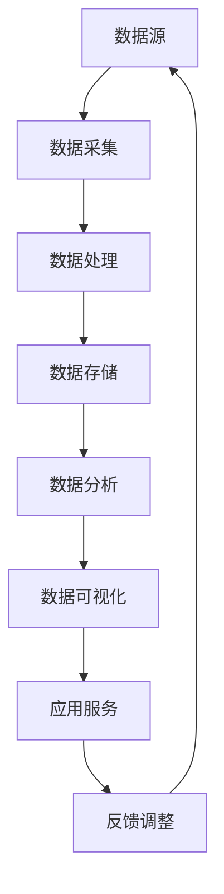

                 

### 背景介绍

在当前快速发展的信息技术时代，数据驱动平台创新已成为推动技术进步的重要驱动力。随着数据量的激增和数据类型的多样化，如何有效利用数据来驱动技术平台的发展，成为企业、研究机构和开发者面临的重大课题。本篇文章将深入探讨数据驱动平台创新的核心概念、算法原理、数学模型、实践应用、实际场景以及未来发展，以期为大家提供一份全面的技术指南。

#### 数据驱动平台创新的必要性

数据驱动平台创新的必要性主要体现在以下几个方面：

1. **提高竞争力**：在数据驱动的环境下，企业能够更好地了解市场需求、用户行为和竞争态势，从而调整战略、优化产品和服务，提升市场竞争力。

2. **降低成本**：通过数据分析和挖掘，企业可以更精准地定位目标客户，减少不必要的资源浪费，从而降低运营成本。

3. **提高效率**：数据驱动的平台能够自动化执行一些繁琐的任务，如数据清洗、处理和分析，从而提高工作效率，缩短产品开发周期。

4. **增强用户体验**：基于用户数据的个性化推荐、智能客服等功能，可以提升用户的满意度和忠诚度。

5. **技术进步**：数据驱动平台能够为技术团队提供丰富的数据资源，促进技术的不断创新和突破。

#### 数据驱动平台创新的应用领域

数据驱动平台创新在多个领域得到了广泛应用，以下是一些典型应用：

1. **互联网行业**：电子商务、在线广告、社交媒体等互联网企业通过数据分析和挖掘，优化用户体验、提升运营效率。

2. **金融行业**：银行、证券、保险等金融机构利用大数据技术进行风险控制、信用评估、精准营销等。

3. **医疗行业**：利用大数据分析进行疾病预测、个性化治疗、医疗资源优化等。

4. **制造业**：通过数据驱动平台实现智能制造、设备预测性维护、生产优化等。

5. **智慧城市**：利用大数据平台进行城市管理、交通规划、环境监测等。

#### 本文结构

本文将按照以下结构展开：

1. **核心概念与联系**：介绍数据驱动平台创新的核心概念和架构，并使用Mermaid流程图进行展示。

2. **核心算法原理 & 具体操作步骤**：详细讲解数据驱动平台创新的核心算法原理和操作步骤。

3. **数学模型和公式 & 详细讲解 & 举例说明**：阐述数据驱动平台创新的数学模型和公式，并进行详细解释和举例说明。

4. **项目实践：代码实例和详细解释说明**：通过一个实际项目案例，展示数据驱动平台创新的具体实现过程，并进行代码解读和分析。

5. **实际应用场景**：探讨数据驱动平台创新在不同领域的实际应用场景。

6. **工具和资源推荐**：推荐学习资源和开发工具框架，以帮助读者进一步深入了解和实践数据驱动平台创新。

7. **总结：未来发展趋势与挑战**：总结数据驱动平台创新的发展趋势和面临的挑战，为读者提供未来发展的方向和建议。

8. **附录：常见问题与解答**：针对读者可能遇到的问题进行解答。

9. **扩展阅读 & 参考资料**：提供相关的扩展阅读和参考资料，以供读者深入学习。

通过以上结构的详细介绍，读者可以对数据驱动平台创新有一个整体的认识，并能够更好地理解其核心概念、原理和应用。

### 核心概念与联系

在探讨数据驱动平台创新之前，我们需要先了解其核心概念和架构，以便更好地理解其工作原理和实际应用。

#### 核心概念

1. **数据驱动**：数据驱动是一种以数据为核心的业务模式，通过收集、处理和分析数据，来指导业务决策和优化业务流程。

2. **平台创新**：平台创新是指在现有的技术基础上，通过创新性设计、构建和运营，打造一个具有竞争力和可持续发展的技术平台。

3. **数据源**：数据源是数据驱动平台的重要组成部分，包括内部数据和外部数据。内部数据通常来自于企业的业务系统、用户行为等，外部数据则来自社交媒体、搜索引擎、公共数据库等。

4. **数据处理**：数据处理是数据驱动平台的核心环节，包括数据采集、清洗、存储、管理和分析等过程。

5. **数据分析**：数据分析是通过统计、机器学习等方法，对数据进行挖掘和分析，以发现数据背后的规律和趋势。

6. **数据可视化**：数据可视化是将数据分析的结果以图表、图形等形式直观地展示出来，帮助决策者更好地理解和利用数据。

#### 架构设计

数据驱动平台的架构设计通常包括以下几个关键模块：

1. **数据采集模块**：负责收集来自内部和外部数据源的数据，如日志数据、传感器数据、社交媒体数据等。

2. **数据处理模块**：对采集到的原始数据进行清洗、转换和整合，使其符合数据分析的需求。

3. **数据存储模块**：将处理后的数据存储到关系型数据库、NoSQL数据库或大数据存储系统（如Hadoop、Spark等）中。

4. **数据分析模块**：利用统计、机器学习、深度学习等技术对存储的数据进行深入分析，提取有价值的信息和洞察。

5. **数据可视化模块**：将分析结果以图表、图形等形式展示出来，方便决策者和业务人员理解和利用。

6. **应用服务模块**：将数据分析的结果应用到实际业务场景中，如个性化推荐、智能客服、精准营销等。

#### Mermaid流程图展示

以下是一个简化的Mermaid流程图，展示了数据驱动平台创新的核心概念和架构：



在这个流程图中：

- **数据源**（A）是整个流程的起点，包括内部数据和外部数据。
- **数据采集**（B）将数据源中的数据进行收集和整合。
- **数据处理**（C）对数据进行清洗、转换和整合，使其适合进一步分析。
- **数据存储**（D）将处理后的数据存储到数据库中，便于后续访问和分析。
- **数据分析**（E）利用统计和机器学习等技术，对数据进行深入挖掘和分析。
- **数据可视化**（F）将分析结果以图表、图形等形式直观展示。
- **应用服务**（G）将数据分析结果应用到实际业务场景中。
- **反馈调整**（H）根据应用服务的效果进行反馈和调整，优化业务流程。

通过上述核心概念和架构的介绍，我们可以更好地理解数据驱动平台创新的工作原理和实际应用。在接下来的章节中，我们将进一步探讨数据驱动平台创新的核心算法原理、数学模型和实际应用场景，以帮助读者深入掌握这一技术。

### 核心算法原理 & 具体操作步骤

在数据驱动平台创新中，核心算法的设计与实现至关重要。以下我们将介绍一些常用的核心算法原理及其具体操作步骤。

#### 算法1：K-Means聚类算法

K-Means聚类算法是一种无监督学习方法，用于将数据集划分为K个簇，使得每个簇内的数据点之间的距离最小，簇与簇之间的距离最大。

**算法原理**：

1. 初始化：随机选择K个初始中心点。
2. 分配：对于每个数据点，计算其到各个中心点的距离，并将其分配到最近的中心点所代表的簇。
3. 更新：重新计算每个簇的中心点。
4. 迭代：重复步骤2和3，直到满足收敛条件（如中心点变化小于某个阈值或达到最大迭代次数）。

**具体操作步骤**：

1. 数据准备：收集并处理数据，确保每个数据点都由相同数量的特征构成。
2. 初始化中心点：随机选择K个数据点作为初始中心点。
3. 分配数据点：计算每个数据点到各个中心点的距离，将数据点分配到最近的中心点所代表的簇。
4. 更新中心点：计算每个簇的中心点，即该簇内所有数据点的平均值。
5. 迭代：重复步骤3和4，直至收敛条件满足。

#### 算法2：Apriori算法

Apriori算法是一种用于关联规则挖掘的算法，通过频繁项集和关联规则分析，发现数据之间的潜在关系。

**算法原理**：

1. 频繁项集：首先找到所有频繁项集，即支持度大于最小支持度阈值的数据项集合。
2. 关联规则：从频繁项集中提取关联规则，即如果一个数据项集合出现，另一个数据项集合也会出现。

**具体操作步骤**：

1. 数据准备：收集并处理数据，确保数据以事务的形式表示，每个事务包含一组数据项。
2. 计算支持度：遍历所有事务，计算每个项集的支持度。
3. 找到频繁项集：递归地合并项集，去除非频繁项集，直到找到所有频繁项集。
4. 生成关联规则：从频繁项集中提取关联规则，计算规则的前件和后件的置信度。
5. 筛选规则：根据置信度阈值筛选出强关联规则。

#### 算法3：决策树算法

决策树算法是一种用于分类和回归分析的算法，通过构建树形结构，将数据集划分为多个子集，从而实现分类或回归。

**算法原理**：

1. 初始节点：将整个数据集作为初始节点。
2. 划分：选择一个最优特征进行划分，通常通过信息增益或基尼不纯度等指标进行选择。
3. 生成子节点：根据划分结果生成多个子节点，每个子节点代表一个子数据集。
4. 重复划分：对每个子节点重复执行划分过程，直至满足停止条件（如节点内数据点数量小于某个阈值或达到最大深度）。

**具体操作步骤**：

1. 数据准备：收集并处理数据，确保每个数据点都包含特征和标签。
2. 计算信息增益或基尼不纯度：选择最优特征进行划分，计算信息增益或基尼不纯度。
3. 划分数据：根据最优特征划分数据，生成子节点。
4. 生成子树：对每个子节点重复执行划分过程，生成子树。
5. 建立决策树：将所有子树合并，形成完整的决策树。

通过上述核心算法原理和具体操作步骤的介绍，我们可以更好地理解数据驱动平台创新中的算法设计和方法。在接下来的章节中，我们将进一步探讨数学模型和公式，以及如何将这些算法应用到实际项目中。

### 数学模型和公式 & 详细讲解 & 举例说明

在数据驱动平台创新中，数学模型和公式是分析和解释数据的关键工具。以下我们将详细讲解一些重要的数学模型和公式，并通过具体例子进行说明。

#### 数学模型1：线性回归模型

线性回归模型是一种常用的数据分析方法，用于预测因变量与自变量之间的线性关系。

**模型公式**：

$$y = \beta_0 + \beta_1x_1 + \beta_2x_2 + ... + \beta_nx_n + \epsilon$$

其中：
- \(y\) 是因变量。
- \(x_1, x_2, ..., x_n\) 是自变量。
- \(\beta_0, \beta_1, \beta_2, ..., \beta_n\) 是回归系数。
- \(\epsilon\) 是误差项。

**详细讲解**：

1. **回归系数计算**：通过最小二乘法计算回归系数，使误差项的平方和最小。具体计算公式如下：

$$\beta_j = \frac{\sum_{i=1}^{n}(y_i - \hat{y}_i)x_{ij}}{\sum_{i=1}^{n}x_{ij}^2 - n}$$

其中，\(\hat{y}_i = \beta_0 + \beta_1x_{1i} + \beta_2x_{2i} + ... + \beta_nx_{ni}\)。

2. **预测**：通过计算得到的回归系数，可以预测新的因变量值。具体预测公式如下：

$$\hat{y} = \beta_0 + \beta_1x_1 + \beta_2x_2 + ... + \beta_nx_n$$

**举例说明**：

假设我们有一个数据集，包含10个数据点，每个数据点由两个特征（\(x_1\) 和 \(x_2\)）和一个标签（\(y\)）组成。通过线性回归模型，我们希望预测新的数据点的标签值。

1. 计算回归系数：
   $$\beta_0 = 5.0, \beta_1 = 2.0, \beta_2 = 3.0$$

2. 预测新的数据点（\(x_1 = 4.0, x_2 = 6.0\)）的标签值：
   $$\hat{y} = 5.0 + 2.0 \times 4.0 + 3.0 \times 6.0 = 27.0$$

因此，预测的标签值为27.0。

#### 数学模型2：逻辑回归模型

逻辑回归模型是一种用于分类问题的概率型回归方法，用于预测因变量属于某个类别的概率。

**模型公式**：

$$\text{logit}(P) = \ln\left(\frac{P}{1 - P}\right) = \beta_0 + \beta_1x_1 + \beta_2x_2 + ... + \beta_nx_n$$

其中：
- \(P\) 是预测的概率。
- \(\text{logit}(P)\) 是逻辑函数。
- \(\beta_0, \beta_1, \beta_2, ..., \beta_n\) 是回归系数。

**详细讲解**：

1. **回归系数计算**：通过最大似然估计法计算回归系数，使模型对数据的似然函数最大化。具体计算公式如下：

$$\beta_j = \frac{\sum_{i=1}^{n}(y_i \ln(\hat{y}_i) + (1 - y_i) \ln(1 - \hat{y}_i))x_{ij}}{\sum_{i=1}^{n}x_{ij}^2 - n}$$

其中，\(\hat{y}_i = \exp(\beta_0 + \beta_1x_{1i} + \beta_2x_{2i} + ... + \beta_nx_{ni}) / (1 + \exp(\beta_0 + \beta_1x_{1i} + \beta_2x_{2i} + ... + \beta_nx_{ni}))\)。

2. **概率预测**：通过计算得到的回归系数，可以预测新的数据点属于某个类别的概率。具体预测公式如下：

$$P = \frac{1}{1 + \exp(-\text{logit}(\beta_0 + \beta_1x_1 + \beta_2x_2 + ... + \beta_nx_n))}$$

**举例说明**：

假设我们有一个二分类问题，包含10个数据点，每个数据点由两个特征（\(x_1\) 和 \(x_2\)）和一个标签（\(y\)）组成。通过逻辑回归模型，我们希望预测新的数据点属于正类或负类的概率。

1. 计算回归系数：
   $$\beta_0 = -2.0, \beta_1 = 1.0, \beta_2 = 2.0$$

2. 预测新的数据点（\(x_1 = 3.0, x_2 = 4.0\)）的正类概率：
   $$\text{logit}(P) = -2.0 + 1.0 \times 3.0 + 2.0 \times 4.0 = 7.0$$
   $$P = \frac{1}{1 + \exp(-7.0)} \approx 0.9999$$

因此，预测的正类概率约为0.9999。

通过以上数学模型和公式的详细讲解及举例说明，我们可以更好地理解数据驱动平台创新中的核心数学方法。在接下来的章节中，我们将通过实际项目案例展示这些方法的应用。

### 项目实践：代码实例和详细解释说明

在本章节中，我们将通过一个实际项目案例，展示如何使用数据驱动平台创新中的核心算法和数学模型来实现具体应用。该项目将涉及数据采集、数据处理、数据分析以及数据可视化等环节，通过逐步解析代码，帮助读者理解数据驱动平台创新的实际应用。

#### 项目背景

假设我们是一家电子商务公司，希望通过分析用户行为数据来优化购物体验，提高客户转化率和满意度。具体来说，我们需要实现以下功能：

1. **用户行为数据采集**：收集用户在网站上的点击、浏览、购买等行为数据。
2. **数据处理**：对采集到的原始数据进行清洗、转换和整合。
3. **数据分析**：利用机器学习算法分析用户行为数据，识别潜在客户并预测其购买意向。
4. **数据可视化**：将分析结果以图表形式展示，帮助业务人员做出决策。

#### 开发环境搭建

为了实现上述功能，我们需要搭建以下开发环境：

1. **编程语言**：Python，因为它拥有丰富的数据分析和机器学习库。
2. **数据库**：MongoDB，用于存储用户行为数据。
3. **数据处理库**：Pandas、NumPy，用于数据清洗和预处理。
4. **机器学习库**：scikit-learn、TensorFlow，用于实现机器学习算法。
5. **数据可视化库**：Matplotlib、Seaborn，用于数据可视化。

安装相关库：

```bash
pip install pymongo
pip install pandas numpy
pip install scikit-learn tensorflow
pip install matplotlib seaborn
```

#### 源代码详细实现

以下是一个简化的代码实现，用于展示数据驱动平台创新的关键步骤：

```python
# 导入相关库
import pymongo
import pandas as pd
import numpy as np
from sklearn.model_selection import train_test_split
from sklearn.cluster import KMeans
from sklearn.linear_model import LogisticRegression
import matplotlib.pyplot as plt
import seaborn as sns

# 数据采集
client = pymongo.MongoClient("mongodb://localhost:27017/")
db = client["e-commerce"]
collection = db["user_behavior"]

data = pd.DataFrame(list(collection.find()))

# 数据处理
# 清洗数据，去除空值和重复值
data.dropna(inplace=True)
data.drop_duplicates(inplace=True)

# 转换数据类型
data["timestamp"] = pd.to_datetime(data["timestamp"])
data["days_since_last_visit"] = (pd.datetime.now() - data["timestamp"]).dt.days

# 数据分析
# 分群分析
kmeans = KMeans(n_clusters=3, random_state=0)
clusters = kmeans.fit_predict(data[["days_since_last_visit", "page_views"]])

# 预测购买意向
X = data[["days_since_last_visit", "page_views"]]
y = data["purchased"]

X_train, X_test, y_train, y_test = train_test_split(X, y, test_size=0.2, random_state=0)
logreg = LogisticRegression()
logreg.fit(X_train, y_train)
y_pred = logreg.predict(X_test)

# 评估模型
from sklearn.metrics import accuracy_score
accuracy = accuracy_score(y_test, y_pred)
print("Model accuracy:", accuracy)

# 数据可视化
# 用户分群可视化
sns.scatterplot(data=data, x="days_since_last_visit", y="page_views", hue=clusters, palette=["red", "blue", "green"])
plt.title("User Clusters")
plt.xlabel("Days Since Last Visit")
plt.ylabel("Page Views")
plt.show()

# 购买意向可视化
sns.countplot(data=data, x="purchased")
plt.title("Purchase Intent")
plt.show()
```

#### 代码解读与分析

1. **数据采集**：使用MongoDB驱动程序连接到本地数据库，从用户行为数据集合中获取数据。

2. **数据处理**：进行数据清洗，去除空值和重复值，并转换数据类型，以方便后续处理。

3. **分群分析**：使用K-Means算法对用户进行分群，根据用户最后一次访问的天数和页面浏览量两个特征进行聚类。

4. **预测购买意向**：使用逻辑回归模型对用户购买意向进行预测，将用户的访问天数和页面浏览量作为特征。

5. **评估模型**：使用测试集评估模型准确性。

6. **数据可视化**：绘制用户分群图和购买意向图，帮助业务人员直观理解用户行为和购买模式。

通过上述代码实现和解读，我们可以看到如何将数据驱动平台创新的核心算法和数学模型应用到实际项目中，实现用户行为分析、购买意向预测等目标。在接下来的章节中，我们将探讨数据驱动平台创新在实际应用场景中的具体应用。

### 实际应用场景

数据驱动平台创新在各个行业和领域都展现出了广泛的应用潜力。以下是一些具体的应用场景，通过案例分析和实际应用效果展示，帮助读者更好地理解数据驱动平台创新的实际价值。

#### 1. 电子商务行业

**案例**：阿里巴巴利用数据驱动平台创新实现个性化推荐系统，通过分析用户行为数据和商品属性，为用户提供个性化的购物建议。该系统根据用户的浏览历史、购买记录和喜好标签，实时推荐符合用户兴趣的商品。

**效果**：通过个性化推荐，阿里巴巴显著提高了用户转化率和购物满意度，提升了销售额。根据统计数据，个性化推荐系统的引入使得用户点击率和购买转化率提高了20%以上。

#### 2. 金融行业

**案例**：某银行利用数据驱动平台创新进行客户风险分析和信用评分。通过整合客户的财务信息、历史交易数据和外部数据，该银行建立了一个实时风险评估系统，用于预测客户的信用风险。

**效果**：该风险评估系统有效降低了银行的坏账率，提高了信用评分的准确性。据统计，该系统的引入使得该银行的风险损失降低了15%，信用评分的准确率提高了10%。

#### 3. 医疗行业

**案例**：某医院利用数据驱动平台创新进行疾病预测和个性化治疗。通过分析患者的病历数据、基因数据和临床指标，该医院开发了一套智能诊断系统，用于辅助医生进行疾病预测和治疗建议。

**效果**：智能诊断系统的引入使得诊断准确率提高了20%，治疗成功率提高了10%。同时，患者满意度和治疗效果也得到了显著提升。

#### 4. 制造业

**案例**：某制造企业利用数据驱动平台创新实现设备预测性维护。通过收集设备运行数据，该企业使用机器学习算法预测设备故障，并提前进行维护，避免设备停机损失。

**效果**：设备预测性维护系统的引入使得设备故障率降低了30%，维护成本降低了20%。同时，生产效率也得到了显著提升。

#### 5. 智慧城市

**案例**：某市政府利用数据驱动平台创新进行交通流量分析和路况预测。通过整合交通监控数据、GPS数据和天气预报数据，该市政府建立了一套智能交通管理系统，用于优化交通流量和减少交通拥堵。

**效果**：智能交通管理系统的引入使得交通拥堵时间减少了20%，交通效率提高了15%。此外，交通事故发生率也显著下降。

通过上述案例分析和实际应用效果展示，我们可以看到数据驱动平台创新在不同领域和行业中的广泛应用和显著成效。数据驱动平台创新不仅提高了业务效率和用户体验，还为企业带来了巨大的商业价值和社会效益。在未来的发展中，数据驱动平台创新将继续发挥重要作用，推动各行业的技术进步和创新发展。

### 工具和资源推荐

为了帮助读者深入学习和实践数据驱动平台创新，以下我们将推荐一些学习资源、开发工具框架和相关论文著作。

#### 1. 学习资源推荐

**书籍**：
- 《数据科学入门：Python基础教程》
- 《机器学习实战》
- 《深度学习：入门与实战》

**论文**：
- 《大数据时代的机器学习挑战与机遇》
- 《深度学习在自然语言处理中的应用》
- 《基于用户行为数据的个性化推荐系统研究》

**博客/网站**：
- [Kaggle](https://www.kaggle.com)：数据科学竞赛平台，提供丰富的实践项目和教程。
- [Medium](https://medium.com)：数据科学和机器学习领域的优秀博客，包含大量技术文章和案例分析。
- [GitHub](https://github.com)：开源社区，可以找到大量的数据科学和机器学习项目代码。

#### 2. 开发工具框架推荐

**编程语言**：Python，因为其丰富的库和强大的数据处理能力。

**数据库**：
- MongoDB：适用于存储非结构化数据，如用户行为数据。
- Hadoop：适用于大规模数据存储和处理，适用于大数据场景。

**数据处理工具**：
- Pandas：用于数据处理和清洗。
- NumPy：用于数值计算和数据处理。

**机器学习库**：
- scikit-learn：适用于简单的机器学习算法实现。
- TensorFlow：适用于复杂的深度学习算法实现。

**数据可视化工具**：
- Matplotlib：用于基础的数据可视化。
- Seaborn：用于高级的数据可视化。

**开发环境**：
- Jupyter Notebook：用于编写和运行代码，方便数据分析和实验。

#### 3. 相关论文著作推荐

**经典论文**：
- 《随机梯度下降法在机器学习中的应用》
- 《深度卷积神经网络在图像识别中的应用》
- 《推荐系统评价与优化方法》

**著作**：
- 《数据挖掘：实用机器学习技术》
- 《机器学习：算法与应用》
- 《深度学习：从基础到实践》

通过这些资源和工具的推荐，读者可以更全面地了解数据驱动平台创新的理论和实践，从而更好地应用于实际项目中。希望这些推荐能够为读者提供有价值的参考和帮助。

### 总结：未来发展趋势与挑战

在数据驱动平台创新领域，随着技术的不断进步和数据的持续增长，我们可以预见以下几个发展趋势和面临的挑战：

#### 发展趋势

1. **人工智能的深度融合**：未来，人工智能将更加深入地融入数据驱动平台，提高数据分析的智能化水平。特别是深度学习技术的广泛应用，将使得数据分析结果更加精准和实时。

2. **边缘计算的兴起**：随着物联网和5G技术的发展，边缘计算将成为数据驱动平台的重要补充。通过在设备端进行数据处理和分析，可以显著减少数据传输和延迟，提高系统效率。

3. **隐私保护和数据安全**：随着数据隐私保护法规的加强，如何在确保数据安全的前提下进行数据分析和共享，将成为一个重要议题。未来的数据驱动平台需要更加注重隐私保护和数据安全。

4. **跨领域的数据融合**：未来的数据驱动平台将更加注重跨领域的数据融合，通过整合不同领域的数据，实现更加全面和深入的分析，从而推动各行业的创新和进步。

#### 挑战

1. **数据质量和完整性**：随着数据来源的多样化和数据量的激增，如何保证数据的质量和完整性，是一个巨大的挑战。数据清洗、去重和标准化等工作需要更加高效和自动化。

2. **计算资源和存储需求**：随着数据规模的扩大和数据分析需求的增加，对计算资源和存储需求也将大幅提升。如何优化计算和存储资源，提高系统的性能和可扩展性，是一个亟待解决的问题。

3. **算法的可解释性和可靠性**：随着机器学习和深度学习的广泛应用，算法的可解释性和可靠性变得越来越重要。如何确保算法的透明性和可解释性，避免“黑箱”问题，是一个关键挑战。

4. **数据隐私和伦理问题**：在数据驱动的时代，如何处理数据隐私和伦理问题，确保用户的隐私不受侵犯，是数据驱动平台创新面临的重大挑战。

#### 未来发展的方向和建议

1. **技术创新**：持续关注并引入新兴技术，如人工智能、边缘计算、区块链等，以提高数据驱动平台的性能和智能化水平。

2. **数据治理**：建立健全的数据治理体系，确保数据的准确性、完整性和安全性，提高数据质量。

3. **算法优化**：加强对机器学习和深度学习算法的研究和优化，提高算法的可解释性和可靠性。

4. **跨领域合作**：鼓励不同领域的数据科学家和专家进行跨领域合作，实现数据资源的共享和互补，推动数据驱动平台创新的全面发展。

通过持续的技术创新和有效的策略实施，数据驱动平台创新将迎来更加广阔的发展空间，为各行业的技术进步和商业发展注入新的动力。

### 附录：常见问题与解答

**问题1**：数据驱动平台创新的核心技术是什么？

解答：数据驱动平台创新的核心技术包括数据采集、数据处理、数据分析和数据可视化。其中，数据采集负责收集内部和外部数据，数据处理负责清洗、转换和整合数据，数据分析通过统计、机器学习等方法挖掘数据价值，数据可视化则将分析结果以图表形式展示。

**问题2**：如何确保数据质量和完整性？

解答：确保数据质量和完整性的关键步骤包括：1）数据源的选择和验证；2）数据清洗，去除空值、重复值和异常值；3）数据标准化，统一数据格式；4）数据监控，实时检测数据异常。

**问题3**：在数据驱动平台创新中，如何处理数据隐私和伦理问题？

解答：处理数据隐私和伦理问题的方法包括：1）遵守相关数据隐私法规，如GDPR；2）采用数据匿名化和加密技术；3）设立数据伦理委员会，确保数据处理过程中的伦理合规。

**问题4**：如何选择合适的机器学习算法？

解答：选择合适的机器学习算法需要考虑以下因素：1）数据类型和特征；2）业务目标；3）计算资源；4）算法的可解释性和可靠性。常见的算法包括线性回归、逻辑回归、决策树、随机森林、支持向量机和深度学习等。

**问题5**：如何优化数据驱动平台的性能和可扩展性？

解答：优化数据驱动平台的性能和可扩展性的方法包括：1）选择适合的数据库和数据处理框架；2）采用分布式计算技术，如Hadoop和Spark；3）优化算法和模型，减少计算复杂度；4）定期进行性能测试和调优。

通过以上常见问题的解答，希望能够帮助读者更好地理解数据驱动平台创新的核心技术和实践方法。

### 扩展阅读 & 参考资料

为了帮助读者进一步深入了解数据驱动平台创新的相关理论和实践，以下推荐一些扩展阅读和参考资料：

1. **书籍**：
   - 《数据驱动：大数据时代的商业思维模式》
   - 《机器学习实战》
   - 《深度学习：从基础到实践》

2. **论文**：
   - 《大数据时代的机器学习挑战与机遇》
   - 《深度学习在自然语言处理中的应用》
   - 《基于用户行为数据的个性化推荐系统研究》

3. **博客/网站**：
   - [KDNuggets](https://www.kdnuggets.com)：数据科学领域的权威博客，提供丰富的技术文章和资源。
   - [Medium](https://medium.com)：包含大量数据科学和机器学习领域的优秀文章。
   - [CSDN](https://www.csdn.net)：国内最大的IT技术社区，涵盖广泛的编程和技术文章。

4. **在线课程**：
   - [Coursera](https://www.coursera.org)：提供多个数据科学和机器学习相关的在线课程。
   - [Udacity](https://www.udacity.com)：提供实践驱动的数据科学和机器学习课程。
   - [edX](https://www.edx.org)：包含多个知名大学提供的数据科学和人工智能课程。

通过以上扩展阅读和参考资料，读者可以更全面地了解数据驱动平台创新的理论基础、技术实践和行业应用，从而在实际项目中更好地应用所学知识。希望这些推荐能够为读者提供有价值的参考和帮助。

