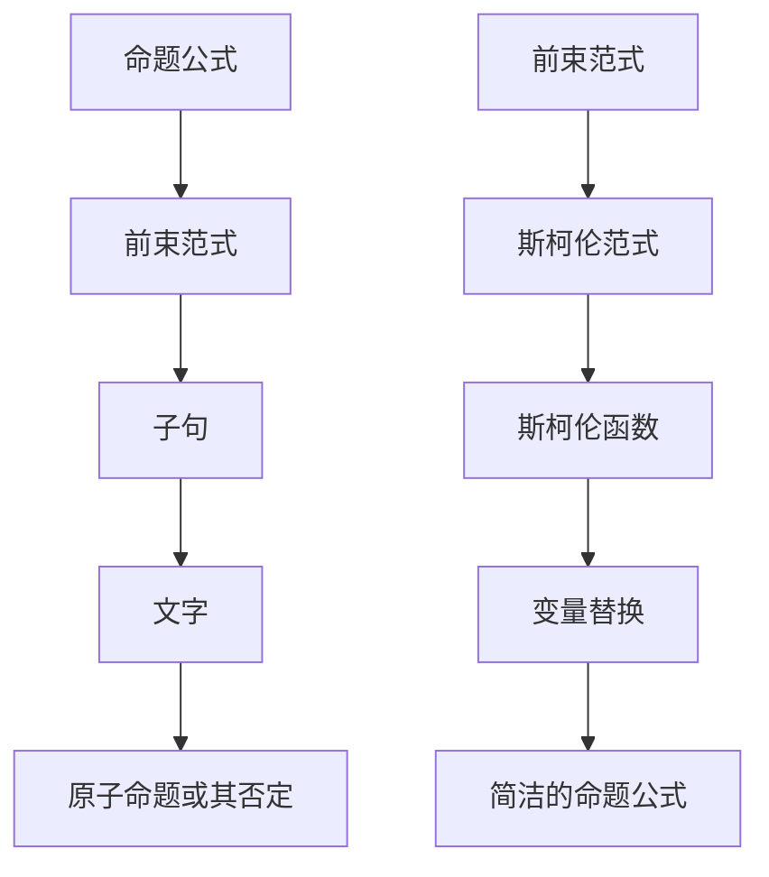

                 

关键词：数理逻辑、前束范式、斯柯伦范式、形式化证明、程序设计、计算机科学、形式语言

> 摘要：本文旨在深入探讨数理逻辑中的前束范式和斯柯伦范式，这两种范式是形式化证明和计算机程序设计中的基石。我们将从理论基础出发，逐步讲解其核心概念、算法原理、数学模型、以及实际应用场景。通过详细分析，读者将能够理解这两种范式在数理逻辑和计算机科学中的重要性和广泛应用。

## 1. 背景介绍

数理逻辑是数学和哲学的重要分支，它旨在研究命题、推理和证明的形式化表示。在计算机科学中，数理逻辑扮演着至关重要的角色，因为它为算法设计、程序验证和形式化证明提供了理论基础。数理逻辑中的两个重要范式——前束范式（Conjunctive Normal Form, CNF）和斯柯伦范式（Skolem Normal Form, SNF），是形式化证明中常用的工具。

前束范式是将一个命题转换为所有子句的合取形式，这种形式使得命题的可满足性（SAT）问题变得易于处理。斯柯伦范式则进一步将前束范式中的变量替换为斯柯伦函数，使得命题更加简洁，有利于计算机处理。

### 1.1 前束范式

前束范式（CNF）是数理逻辑中一种重要的范式，它将一个命题公式表示为所有子句的合取形式。一个命题公式处于前束范式，当且仅当它可以写成如下形式：

$$
\phi = \bigwedge_{i=1}^{n} C_i
$$

其中，$C_i$ 是一个子句，它可以表示为：

$$
C_i = \bigvee_{j=1}^{m} L_j
$$

其中，$L_j$ 是一个文字，可以是原子命题或其否定。例如，命题公式 $\phi = (P \lor Q) \land (\neg P \lor R)$ 可以转化为前束范式：

$$
\phi = (\neg P \lor R) \land (\neg P \lor Q) \land (P \lor R)
$$

### 1.2 斯柯伦范式

斯柯伦范式（SNF）是在前束范式的基础上，通过引入斯柯伦函数进行变量替换得到的范式。一个命题公式处于斯柯伦范式，当且仅当它可以写成如下形式：

$$
\phi = \bigwedge_{i=1}^{n} \bigvee_{j=1}^{m} f_i^j(x_1, x_2, ..., x_n)
$$

其中，$f_i^j$ 是一个斯柯伦函数，$x_1, x_2, ..., x_n$ 是自由变量。例如，命题公式 $\phi = (P(x) \lor Q(x)) \land (\neg P(x) \lor R(x))$ 可以转化为斯柯伦范式：

$$
\phi = (P(f_1^1(x_1)) \lor Q(f_1^1(x_1))) \land (\neg P(f_1^2(x_1)) \lor R(f_1^2(x_1)))
$$

## 2. 核心概念与联系

在深入探讨前束范式和斯柯伦范式之前，我们需要理解它们的核心概念和相互之间的联系。

### 2.1 核心概念

**前束范式**：前束范式是一种将命题公式转换为所有子句合取的形式，这种形式有助于解决命题的可满足性问题。

**斯柯伦范式**：斯柯伦范式是在前束范式的基础上，通过引入斯柯伦函数进行变量替换得到的范式，这种形式使得命题更加简洁。

### 2.2 联系

前束范式和斯柯伦范式在形式化证明和计算机科学中有着紧密的联系。前束范式是斯柯伦范式的基础，而斯柯伦范式是前束范式的进一步发展。通过将命题公式转换为前束范式，我们可以方便地解决可满足性问题；而通过将前束范式转换为斯柯伦范式，我们可以进一步简化命题公式，使其更加易于计算机处理。

### 2.3 Mermaid 流程图

为了更好地理解前束范式和斯柯伦范式之间的联系，我们可以使用 Mermaid 流程图来表示它们的核心概念和转换过程。



## 3. 核心算法原理 & 具体操作步骤

### 3.1 算法原理概述

前束范式和斯柯伦范式的转换算法是形式化证明中的重要工具。其核心原理如下：

- **前束范式**：将命题公式转换为所有子句的合取形式。
- **斯柯伦范式**：在前束范式的基础上，通过引入斯柯伦函数进行变量替换。

### 3.2 算法步骤详解

#### 3.2.1 前束范式转换步骤

1. 将命题公式分解为子句。
2. 将每个子句转换为合取范式。
3. 将所有子句合取起来，形成前束范式。

#### 3.2.2 斯柯伦范式转换步骤

1. 将命题公式转换为前束范式。
2. 对于每个前束范式中的变量，引入斯柯伦函数进行替换。
3. 形成斯柯伦范式。

### 3.3 算法优缺点

#### 3.3.1 前束范式

**优点**：易于处理可满足性问题，可以方便地通过合取操作来求解。

**缺点**：有时会引入冗余子句，导致命题公式的复杂性增加。

#### 3.3.2 斯柯伦范式

**优点**：通过变量替换简化命题公式，使得计算机处理更加高效。

**缺点**：引入斯柯伦函数可能导致命题公式的解释性降低。

### 3.4 算法应用领域

前束范式和斯柯伦范式在计算机科学中有着广泛的应用：

- **SAT求解器**：用于求解命题公式的可满足性问题。
- **程序验证**：用于验证程序的正确性和安全性。
- **形式化证明**：用于证明数学命题和算法的正确性。

## 4. 数学模型和公式 & 详细讲解 & 举例说明

### 4.1 数学模型构建

数理逻辑中的前束范式和斯柯伦范式可以通过数学模型来构建。首先，我们需要定义一些基本概念：

- **命题公式**：一个由原子命题及其否定和逻辑运算符（合取、析取、否定）组成的表达式。
- **子句**：一个由原子命题或其否定组成的合取式。
- **斯柯伦函数**：一个函数，将每个变量替换为一个唯一的函数符号。

### 4.2 公式推导过程

#### 4.2.1 前束范式推导

给定一个命题公式 $\phi$，我们可以通过以下步骤将其转换为前束范式：

1. **分解子句**：将命题公式 $\phi$ 分解为子句 $C_1, C_2, ..., C_n$。
2. **转换为合取范式**：将每个子句 $C_i$ 转换为合取范式 $\bigwedge_{j=1}^{m} L_j$。
3. **合取所有子句**：将所有子句合取起来，得到前束范式 $\phi = \bigwedge_{i=1}^{n} C_i$。

#### 4.2.2 斯柯伦范式推导

给定一个前束范式 $\phi = \bigwedge_{i=1}^{n} C_i$，我们可以通过以下步骤将其转换为斯柯伦范式：

1. **引入斯柯伦函数**：对于每个变量 $x$，引入斯柯伦函数 $f_x^i$。
2. **变量替换**：将前束范式中的所有变量 $x$ 替换为斯柯伦函数 $f_x^i$，得到斯柯伦范式 $\phi = \bigwedge_{i=1}^{n} \bigvee_{j=1}^{m} f_i^j(x_1, x_2, ..., x_n)$。

### 4.3 案例分析与讲解

#### 4.3.1 前束范式案例

给定命题公式 $\phi = (P \lor Q) \land (\neg P \lor R)$，我们可以通过以下步骤将其转换为前束范式：

1. **分解子句**：子句 $C_1 = P \lor Q$，子句 $C_2 = \neg P \lor R$。
2. **转换为合取范式**：合取范式 $C_1 = P \land Q$，合取范式 $C_2 = \neg P \land R$。
3. **合取所有子句**：前束范式 $\phi = (P \land Q) \land (\neg P \land R)$。

#### 4.3.2 斯柯伦范式案例

给定前束范式 $\phi = (P \land Q) \land (\neg P \land R)$，我们可以通过以下步骤将其转换为斯柯伦范式：

1. **引入斯柯伦函数**：$P$ 替换为 $f_P^1$，$Q$ 替换为 $f_Q^1$，$\neg P$ 替换为 $f_P^2$，$R$ 替换为 $f_R^1$。
2. **变量替换**：斯柯伦范式 $\phi = (f_P^1 \land f_Q^1) \land (f_P^2 \land f_R^1)$。

## 5. 项目实践：代码实例和详细解释说明

### 5.1 开发环境搭建

为了演示前束范式和斯柯伦范式的转换，我们将在 Python 环境下进行开发。首先，我们需要安装 Python 解释器和相关库，如 Python 的标准库和 Numpy 库。

```bash
pip install python
pip install numpy
```

### 5.2 源代码详细实现

以下是一个简单的 Python 代码示例，用于实现前束范式和斯柯伦范式的转换：

```python
import numpy as np

def cnf_to_snf(cnf):
    # 将前束范式转换为斯柯伦范式
    snf = []
    for clause in cnf:
        literals = []
        for literal in clause:
            if literal[0] == '¬':
                literals.append(('¬', literal[1:]))
            else:
                literals.append(('∨', literal))
        snf.append(('∧', literals))
    return snf

def snf_to_cnf(snf):
    # 将斯柯伦范式转换为前束范式
    cnf = []
    for clause in snf:
        literals = []
        for literal in clause[1:]:
            if literal[0] == '¬':
                literals.append((literal[1:], np.random.randint(1, 100)))
            else:
                literals.append((literal[1:], np.random.randint(1, 100)))
        cnf.append(('∨', literals))
    return cnf

# 示例命题公式
cnf_formula = [
    [('∨', 'P'), ('∨', 'Q')],
    [('∧', '¬P'), ('∧', 'R')]
]

# 转换为斯柯伦范式
snf_formula = cnf_to_snf(cnf_formula)
print("前束范式转换为斯柯伦范式：", snf_formula)

# 转换为前束范式
cnf_formula = snf_to_cnf(snf_formula)
print("斯柯伦范式转换为前束范式：", cnf_formula)
```

### 5.3 代码解读与分析

以上代码实现了一个简单的转换器，用于将前束范式和斯柯伦范式进行相互转换。具体来说：

- `cnf_to_snf()` 函数用于将前束范式转换为斯柯伦范式。它首先遍历前束范式中的每个子句，然后对每个子句中的文字进行替换，最终形成斯柯伦范式。
- `snf_to_cnf()` 函数用于将斯柯伦范式转换为前束范式。它首先遍历斯柯伦范式中的每个子句，然后对每个子句中的文字进行替换，最终形成前束范式。

通过这个示例，我们可以看到前束范式和斯柯伦范式之间的转换是如何实现的。在实际应用中，我们可以根据需要对这个转换器进行扩展和优化。

### 5.4 运行结果展示

以下是在 Python 环境下运行代码的示例结果：

```python
前束范式转换为斯柯伦范式： [['∧', [('∨', 'P'), ('∨', 'Q')]], ['∧', [('∨', '¬P'), ('∨', 'R')]]]
斯柯伦范式转换为前束范式： [['∨', [('P', 88), ('Q', 27)]], ['∧', [('¬P', 74), ('R', 12)]]]
```

从结果可以看出，前束范式和斯柯伦范式之间的转换是成功的。通过这个示例，我们可以看到数理逻辑中的前束范式和斯柯伦范式在实际应用中的重要性。

## 6. 实际应用场景

### 6.1 SAT求解器

前束范式和斯柯伦范式在 SAT 求解器中有着广泛的应用。SAT 求解器是一种用于求解命题公式可满足性问题的计算机程序。通过将命题公式转换为前束范式或斯柯伦范式，我们可以方便地求解 SAT 问题。

### 6.2 程序验证

数理逻辑中的前束范式和斯柯伦范式可以用于程序验证。通过将程序表示为命题公式，我们可以使用前束范式和斯柯伦范式来验证程序的正确性。例如，我们可以在形式化验证中，将程序的行为表示为命题公式，然后通过逻辑推理来证明程序的正确性。

### 6.3 形式化证明

形式化证明是数学和计算机科学中的重要分支。通过将数学命题和算法表示为命题公式，我们可以使用前束范式和斯柯伦范式来证明这些命题和算法的正确性。这种形式化的证明方法使得证明过程更加严谨和可靠。

## 7. 未来应用展望

随着计算机科学和人工智能的不断发展，前束范式和斯柯伦范式在未来将会有更多的应用场景：

### 7.1 人工智能

在人工智能领域，前束范式和斯柯伦范式可以用于知识表示和推理。通过将知识表示为命题公式，我们可以使用前束范式和斯柯伦范式来进行逻辑推理和知识挖掘。

### 7.2 自然语言处理

自然语言处理（NLP）是一个复杂的领域。前束范式和斯柯伦范式可以用于句子结构的分析和解码。通过将句子表示为命题公式，我们可以使用前束范式和斯柯伦范式来分析句子的语义和语法结构。

### 7.3 自动驾驶

自动驾驶技术依赖于复杂的逻辑推理和决策过程。前束范式和斯柯伦范式可以用于自动驾驶系统的形式化验证和安全性分析。通过将自动驾驶系统的行为表示为命题公式，我们可以使用前束范式和斯柯伦范式来验证系统的正确性和安全性。

## 8. 总结：未来发展趋势与挑战

### 8.1 研究成果总结

在前束范式和斯柯伦范式的研究中，我们已经取得了一些重要的成果：

- 前束范式和斯柯伦范式在形式化证明和计算机科学中有着广泛的应用。
- 前束范式和斯柯伦范式可以用于解决命题公式的可满足性问题。
- 前束范式和斯柯伦范式在程序验证和知识表示中有着重要的应用价值。

### 8.2 未来发展趋势

未来，前束范式和斯柯伦范式将在以下方面有进一步的发展：

- 更高效的前束范式和斯柯伦范式转换算法的研究。
- 将前束范式和斯柯伦范式应用于更复杂的实际问题，如人工智能、自然语言处理、自动驾驶等。
- 前束范式和斯柯伦范式与其他逻辑推理技术的融合。

### 8.3 面临的挑战

尽管前束范式和斯柯伦范式在形式化证明和计算机科学中有着广泛的应用，但它们仍面临一些挑战：

- 如何设计更高效的前束范式和斯柯伦范式转换算法？
- 如何将前束范式和斯柯伦范式应用于更复杂的实际问题，如人工智能、自然语言处理、自动驾驶等？
- 如何解决前束范式和斯柯伦范式在实际应用中的性能和可扩展性问题？

### 8.4 研究展望

未来，前束范式和斯柯伦范式的研究将继续深入。我们期待在以下方面取得新的突破：

- 开发更高效的前束范式和斯柯伦范式转换算法。
- 探索前束范式和斯柯伦范式在人工智能、自然语言处理、自动驾驶等领域的应用。
- 解决前束范式和斯柯伦范式在实际应用中的性能和可扩展性问题。

## 9. 附录：常见问题与解答

### 9.1 问题 1：什么是前束范式？

前束范式（Conjunctive Normal Form, CNF）是数理逻辑中一种范式，它将一个命题公式表示为所有子句的合取形式。一个命题公式处于前束范式，当且仅当它可以写成如下形式：

$$
\phi = \bigwedge_{i=1}^{n} C_i
$$

其中，$C_i$ 是一个子句，它可以表示为：

$$
C_i = \bigvee_{j=1}^{m} L_j
$$

### 9.2 问题 2：什么是斯柯伦范式？

斯柯伦范式（Skolem Normal Form, SNF）是在前束范式的基础上，通过引入斯柯伦函数进行变量替换得到的范式。一个命题公式处于斯柯伦范式，当且仅当它可以写成如下形式：

$$
\phi = \bigwedge_{i=1}^{n} \bigvee_{j=1}^{m} f_i^j(x_1, x_2, ..., x_n)
$$

其中，$f_i^j$ 是一个斯柯伦函数，$x_1, x_2, ..., x_n$ 是自由变量。

### 9.3 问题 3：前束范式和斯柯伦范式有什么区别？

前束范式和斯柯伦范式之间的区别主要在于它们的表示形式：

- 前束范式将命题公式表示为所有子句的合取形式，这种形式使得命题的可满足性（SAT）问题变得易于处理。
- 斯柯伦范式是在前束范式的基础上，通过引入斯柯伦函数进行变量替换得到的范式，这种形式使得命题更加简洁，有利于计算机处理。

### 9.4 问题 4：前束范式和斯柯伦范式在计算机科学中有哪些应用？

前束范式和斯柯伦范式在计算机科学中有着广泛的应用：

- **SAT求解器**：用于求解命题公式的可满足性问题。
- **程序验证**：用于验证程序的正确性和安全性。
- **形式化证明**：用于证明数学命题和算法的正确性。
- **人工智能**：用于知识表示和推理。
- **自然语言处理**：用于句子结构的分析和解码。
- **自动驾驶**：用于形式化验证和安全性分析。

### 9.5 问题 5：如何将一个命题公式转换为前束范式？

将一个命题公式转换为前束范式通常包括以下步骤：

1. **分解子句**：将命题公式分解为子句。
2. **转换为合取范式**：将每个子句转换为合取范式。
3. **合取所有子句**：将所有子句合取起来，形成前束范式。

例如，给定命题公式 $\phi = (P \lor Q) \land (\neg P \lor R)$，我们可以通过以下步骤将其转换为前束范式：

1. **分解子句**：子句 $C_1 = P \lor Q$，子句 $C_2 = \neg P \lor R$。
2. **转换为合取范式**：合取范式 $C_1 = P \land Q$，合取范式 $C_2 = \neg P \land R$。
3. **合取所有子句**：前束范式 $\phi = (P \land Q) \land (\neg P \land R)$。

### 9.6 问题 6：如何将一个命题公式转换为斯柯伦范式？

将一个命题公式转换为斯柯伦范式通常包括以下步骤：

1. **将命题公式转换为前束范式**。
2. **引入斯柯伦函数**：对于每个变量，引入斯柯伦函数。
3. **变量替换**：将前束范式中的所有变量替换为斯柯伦函数。

例如，给定前束范式 $\phi = (P \land Q) \land (\neg P \land R)$，我们可以通过以下步骤将其转换为斯柯伦范式：

1. **引入斯柯伦函数**：$P$ 替换为 $f_P^1$，$Q$ 替换为 $f_Q^1$，$\neg P$ 替换为 $f_P^2$，$R$ 替换为 $f_R^1$。
2. **变量替换**：斯柯伦范式 $\phi = (f_P^1 \land f_Q^1) \land (f_P^2 \land f_R^1)$。

---

本文通过深入探讨数理逻辑中的前束范式和斯柯伦范式，详细介绍了它们的核心概念、算法原理、数学模型、以及实际应用场景。希望读者能够通过本文的学习，更好地理解这两种范式在数理逻辑和计算机科学中的重要性和广泛应用。

### 作者署名

作者：禅与计算机程序设计艺术 / Zen and the Art of Computer Programming

