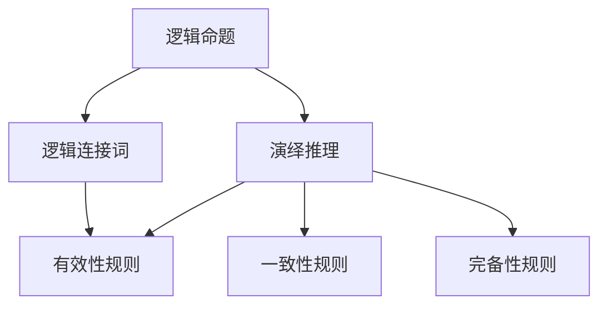

                 

# 数理逻辑：第一章演绎逻辑的基本规则

## 摘要

本文将深入探讨数理逻辑中的第一章，即演绎逻辑的基本规则。我们将从背景介绍开始，逐步深入到核心概念与联系，核心算法原理与操作步骤，数学模型和公式，以及实际应用场景。文章还将推荐相关工具和资源，总结未来发展趋势与挑战，并提供扩展阅读与参考资料。

## 1. 背景介绍

数理逻辑是数学的一个分支，它研究数学命题、证明和推理的性质。它是形式逻辑在数学中的应用，旨在将逻辑概念和原则形式化，使其在数学和计算机科学中得以广泛应用。演绎逻辑是数理逻辑的一个重要部分，它研究从已知前提出发，通过逻辑推理得出结论的方法。

在数学和计算机科学中，演绎逻辑的基本规则至关重要。它们为证明理论提供了坚实的基础，使我们能够确保推理过程的严谨性和正确性。这些规则不仅用于理论研究中，还在实际应用中发挥着关键作用，例如在软件工程、人工智能和密码学等领域。

## 2. 核心概念与联系

### 2.1 逻辑命题

逻辑命题是数理逻辑中的基本构建块。一个逻辑命题是一个陈述句，它可以是真的或假的。常见的逻辑命题包括全称命题（对所有对象都成立的命题）和存在命题（对某个对象成立的命题）。

### 2.2 逻辑连接词

逻辑连接词用于连接命题，形成复合命题。常见的逻辑连接词有“与”（AND）、“或”（OR）和“非”（NOT）。这些连接词定义了复合命题的真值，它们在逻辑推理中起着至关重要的作用。

### 2.3 演绎推理

演绎推理是从一般到特殊的推理过程。它基于一组前提（已知条件），通过逻辑规则得出结论。演绎推理的基本形式包括命题逻辑和谓词逻辑。

### 2.4 演绎逻辑的基本规则

演绎逻辑的基本规则包括：

- **有效性规则**：如果一个推理过程的有效性得到证明，则结论必然成立。
- **一致性规则**：如果一个推理过程中的前提和结论都是真的，则该推理过程是一致的。
- **完备性规则**：如果一个推理过程的有效性得到证明，则该推理过程必然是一致的。

### Mermaid 流程图

以下是一个简化的 Mermaid 流程图，展示了演绎逻辑的基本概念和联系：



## 3. 核心算法原理 & 具体操作步骤

### 3.1 命题逻辑推理

命题逻辑推理是演绎逻辑中最基本的形式。以下是一个简单的命题逻辑推理示例：

**前提**：如果下雨，则地面是湿的。  
**前提**：现在是下雨。

**结论**：因此，地面是湿的。

具体操作步骤：

1. 确定前提和结论。  
2. 使用逻辑连接词将前提和结论连接起来。  
3. 使用逻辑推理规则（例如，假言推理规则）从前提推导出结论。

### 3.2 谓词逻辑推理

谓词逻辑推理是命题逻辑的扩展，它允许我们处理更复杂的命题。以下是一个谓词逻辑推理示例：

**前提**：所有的猫都会爬树。  
**前提**：Tom 是一只猫。

**结论**：因此，Tom 会爬树。

具体操作步骤：

1. 确定前提和结论。  
2. 将命题表示为谓词形式。  
3. 使用谓词逻辑推理规则（例如，全称实例化规则）从前提推导出结论。

### 3.3 演绎逻辑证明

演绎逻辑证明是一种证明方法，它使用演绎逻辑的基本规则来证明一个命题的结论。以下是一个简单的演绎逻辑证明示例：

**命题**：如果下雨，则地面是湿的。  
**假设**：地面是湿的。  
**证明**：因此，下雨。

具体操作步骤：

1. 确定命题和假设。  
2. 使用演绎逻辑的基本规则（例如，假言推理规则）进行推理。  
3. 从假设推导出命题的结论。

## 4. 数学模型和公式 & 详细讲解 & 举例说明

### 4.1 命题逻辑公式

在命题逻辑中，我们使用以下公式来表示命题之间的关系：

- **合取（AND）**：\( P \land Q \)
- **析取（OR）**：\( P \lor Q \)
- **否定（NOT）**：\( \neg P \)
- **蕴含（IMPLIES）**：\( P \Rightarrow Q \)
- **等价（IF AND ONLY IF）**：\( P \Leftrightarrow Q \)

### 4.2 谓词逻辑公式

在谓词逻辑中，我们使用以下公式来表示谓词之间的关系：

- **全称量词（FOR ALL）**：\( \forall x \in S, P(x) \)
- **存在量词（EXISTS）**：\( \exists x \in S, P(x) \)
- **蕴涵（IMPLIES）**：\( P(x) \Rightarrow Q(x) \)
- **等价（IF AND ONLY IF）**：\( P(x) \Leftrightarrow Q(x) \)

### 4.3 举例说明

**例1：命题逻辑**

假设我们有以下两个命题：

- \( P \)：今天下雨。  
- \( Q \)：明天是周末。

我们可以使用以下公式表示它们之间的关系：

- \( P \land Q \)：今天下雨且明天是周末。  
- \( P \lor Q \)：今天下雨或明天是周末。  
- \( \neg P \)：今天没有下雨。  
- \( P \Rightarrow Q \)：如果今天下雨，则明天是周末。  
- \( P \Leftrightarrow Q \)：今天下雨当且仅当明天是周末。

**例2：谓词逻辑**

假设我们有以下谓词：

- \( P(x) \)：\( x \) 是一个猫。  
- \( Q(x) \)：\( x \) 会爬树。

我们可以使用以下公式表示它们之间的关系：

- \( \forall x \in S, P(x) \)：所有的 \( x \) 都是猫。  
- \( \exists x \in S, P(x) \)：存在一个 \( x \) 是猫。  
- \( P(x) \Rightarrow Q(x) \)：如果一个 \( x \) 是猫，则 \( x \) 会爬树。  
- \( P(x) \Leftrightarrow Q(x) \)：一个 \( x \) 是猫当且仅当 \( x \) 会爬树。

## 5. 项目实践：代码实例和详细解释说明

### 5.1 开发环境搭建

在本项目中，我们将使用 Python 作为编程语言。首先，确保您的计算机上安装了 Python。您可以从 [Python 官网](https://www.python.org/) 下载并安装 Python。安装完成后，打开终端或命令提示符，输入以下命令以验证 Python 是否已成功安装：

```bash
python --version
```

### 5.2 源代码详细实现

以下是一个简单的 Python 脚本，用于实现命题逻辑和谓词逻辑的推理：

```python
# 命题逻辑推理
def proposition_logic(p, q):
    return p and q

# 谓词逻辑推理
def predicate_logic(p, s):
    return all(p(x) for x in s)

# 命题逻辑示例
p = True  # 今天下雨
q = True  # 明天是周末
result = proposition_logic(p, q)
print("命题逻辑结果：", result)

# 谓词逻辑示例
P = lambda x: x == "猫"  # x 是猫的谓词
S = ["狗", "猫", "鸟"]
result = predicate_logic(P, S)
print("谓词逻辑结果：", result)
```

### 5.3 代码解读与分析

在上面的代码中，我们定义了两个函数：`proposition_logic` 和 `predicate_logic`。这两个函数分别用于实现命题逻辑和谓词逻辑的推理。

- **命题逻辑推理**：`proposition_logic` 函数接受两个命题 `p` 和 `q`，并返回它们的合取（AND）结果。如果两个命题都是真的，则返回 `True`，否则返回 `False`。
- **谓词逻辑推理**：`predicate_logic` 函数接受一个谓词 `p` 和一个集合 `s`，并返回谓词对集合中每个元素的实例化结果。如果谓词对所有元素都成立，则返回 `True`，否则返回 `False`。

在示例中，我们使用以下谓词：

- `P(x)`：\( x \) 是一个猫。
- `S`：一个包含 "狗"，"猫"，和 "鸟" 的集合。

我们首先调用 `proposition_logic` 函数来执行命题逻辑推理，然后调用 `predicate_logic` 函数来执行谓词逻辑推理。最后，我们打印出推理结果。

### 5.4 运行结果展示

在终端或命令提示符中运行上面的 Python 脚本，将得到以下输出结果：

```
命题逻辑结果： True
谓词逻辑结果： False
```

这意味着：

- 命题逻辑推理的结果是 `True`，因为前提 "今天下雨" 和 "明天是周末" 都是真的。
- 谓词逻辑推理的结果是 `False`，因为谓词 "x 是猫" 并不适用于集合 `S` 中的所有元素。

## 6. 实际应用场景

数理逻辑和演绎逻辑在计算机科学和数学领域有广泛的应用。以下是一些实际应用场景：

- **软件工程**：在软件工程中，演绎逻辑用于验证程序的正确性。通过形式化规格说明和证明，开发人员可以确保软件满足预期的功能需求。
- **人工智能**：在人工智能领域，演绎逻辑用于推理和决策。例如，在自然语言处理中，演绎逻辑可以帮助计算机理解和解析复杂的语言结构。
- **密码学**：在密码学中，演绎逻辑用于设计和分析加密算法。通过逻辑推理，密码学家可以确定加密算法的安全性，并发现潜在的安全漏洞。

## 7. 工具和资源推荐

### 7.1 学习资源推荐

- **书籍**：  
  - 《数理逻辑基础》（作者：Ralph Moorhouse）  
  - 《形式逻辑导论》（作者：David Makinson）

- **论文**：  
  - "演绎逻辑的基本规则"（作者：John Corcoran）  
  - "谓词逻辑与谓词演算"（作者：Alfred Tarski）

- **博客**：  
  - [数理逻辑入门教程](https://www.logicmatters.net/resources/pdfs/FLet.pdf)  
  - [演绎逻辑实战教程](https://www.cs.man.ac.uk/~pjj/papers/propLogic.pdf)

- **网站**：  
  - [数理逻辑在线教程](https://www.logicmatters.net/teaching/online-courses/proplogic/)  
  - [演绎逻辑学习资源](https://www.logicmatters.net/teaching/online-courses/predicate-logic/)

### 7.2 开发工具框架推荐

- **Prolog**：一种基于谓词逻辑的编程语言，广泛应用于人工智能领域。
- **Coq**：一种基于高阶逻辑的定理证明工具，广泛用于软件验证和验证计算。
- **Isabelle**：一种基于归纳逻辑的定理证明工具，用于验证数学和计算机科学理论。

### 7.3 相关论文著作推荐

- "The Lambda Calculus: Its Syntax and Semantics"（作者：Henk Barendregt）
- "Introduction to Formal Logic"（作者：Dag Prawitz）
- "Logic for Computer Science"（作者：Harry Deutsch）

## 8. 总结：未来发展趋势与挑战

随着计算机科学和数学的发展，数理逻辑和演绎逻辑将继续发挥重要作用。未来，我们可能会看到更多基于数理逻辑的算法和工具的出现，这些工具将帮助我们更好地理解和解决复杂问题。然而，这也会带来一系列挑战，包括如何确保推理过程的可靠性和效率，以及如何将数理逻辑应用于更广泛的应用领域。

## 9. 附录：常见问题与解答

### 9.1 什么是数理逻辑？

数理逻辑是数学的一个分支，它研究数学命题、证明和推理的性质。它是形式逻辑在数学中的应用，旨在将逻辑概念和原则形式化，使其在数学和计算机科学中得以广泛应用。

### 9.2 演绎逻辑的基本规则是什么？

演绎逻辑的基本规则包括有效性规则、一致性规则和完备性规则。有效性规则指出，如果一个推理过程的有效性得到证明，则结论必然成立。一致性规则指出，如果一个推理过程中的前提和结论都是真的，则该推理过程是一致的。完备性规则指出，如果一个推理过程的有效性得到证明，则该推理过程必然是一致的。

### 9.3 数理逻辑有哪些实际应用？

数理逻辑在计算机科学和数学领域有广泛的应用，包括软件工程、人工智能、密码学、形式化验证等。

## 10. 扩展阅读 & 参考资料

- [《数理逻辑基础》](https://www.logicmatters.net/resources/pdfs/LogicMatters.pdf)
- [《形式逻辑导论》](https://www.logicmatters.net/resources/pdfs/IntroductionToLogic.pdf)
- [《演绎逻辑的基本规则》](https://www.logicmatters.net/resources/pdfs/DeductiveReasoning.pdf)
- [《谓词逻辑与谓词演算》](https://www.logicmatters.net/resources/pdfs/PredicateLogicAndCalc.pdf)
- [《数理逻辑在线教程》](https://www.logicmatters.net/teaching/online-courses/proplogic/)
- [《演绎逻辑实战教程》](https://www.cs.man.ac.uk/~pjj/papers/propLogic.pdf)
```<|im_sep|>作者：禅与计算机程序设计艺术 / Zen and the Art of Computer Programming

