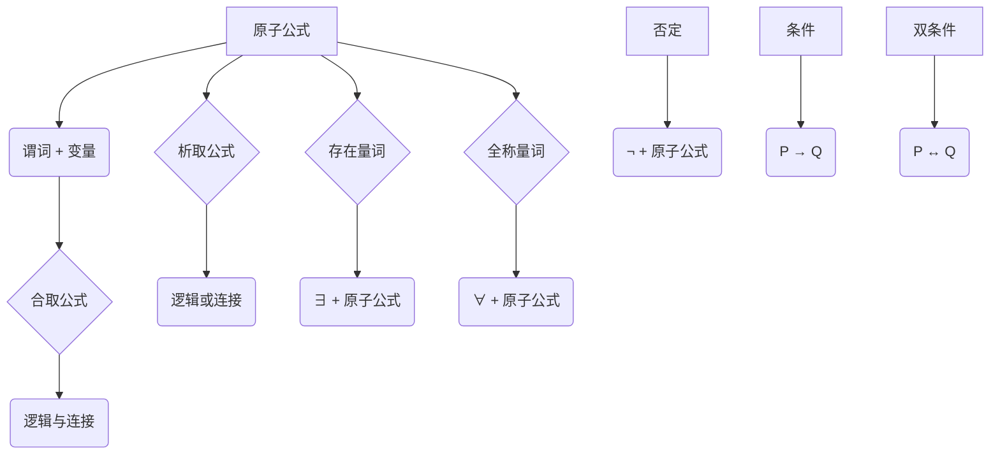

                 

### 背景介绍

#### 数理逻辑的发展历程

数理逻辑（Mathematical Logic）作为数学的一个分支，早在古希腊时期就已经萌芽。亚里士多德提出的命题逻辑奠定了逻辑学的基石。然而，随着数学和哲学的发展，传统的命题逻辑逐渐显露出其局限性，无法满足日益复杂的数学和科学需求。19世纪末和20世纪初，弗雷格（Gottlob Frege）、罗素（Bertrand Russell）和怀特海德（Alfred North Whitehead）等数学家开始探索更为强大的逻辑系统，这就是现代数理逻辑的起源。

弗雷格是数理逻辑的先驱，他提出了符号逻辑和形式系统，试图将数学的基础建立在逻辑之上。然而，弗雷格的系统存在某些不完善之处，尤其是对无限集合的处理。罗素和怀特海德随后提出了类型的概念，试图通过引入类型论来解决这些问题，这一思想成为了后来谓词逻辑发展的基础。

谓词逻辑（Predicate Logic）是数理逻辑的一个重要分支，它在命题逻辑的基础上增加了变量和量词等概念，使得逻辑表达能够更准确地描述数学和自然语言中的复杂关系。谓词逻辑的出现，为数学和计算机科学提供了更强大的工具，尤其是在形式化证明、程序验证和人工智能等领域。

#### 谓词逻辑的重要性

谓词逻辑的重要性体现在多个方面。首先，它在形式化数学证明中扮演了关键角色。谓词逻辑允许我们使用量词来量化变量，从而描述更复杂的数学关系。例如，我们可以使用谓词逻辑来表述“所有自然数都是可数的”这一命题，而在命题逻辑中，这种表述是困难的。

其次，谓词逻辑在程序验证中有着广泛的应用。在现代程序设计中，程序员常常需要证明某些程序的性质，如安全性、一致性等。谓词逻辑提供了形式化的方法来描述程序的行为，使得程序员可以更加可靠地验证程序的正确性。

此外，谓词逻辑在人工智能领域也具有重要地位。许多人工智能算法，如自动推理系统、专家系统等，都依赖于谓词逻辑来表达和操作知识。谓词逻辑的强大表达能力和精确性，使得它成为人工智能领域中不可或缺的工具。

#### 本文的目的

本文旨在深入探讨谓词逻辑中的两个重要概念：F和F*形成规则。我们将从基本概念出发，逐步解释这两个规则的形成过程，并通过具体实例来展示它们的应用。通过本文的阅读，读者将能够理解谓词逻辑的核心思想，掌握F和F*形成规则的具体应用，并能够将其应用于实际问题中。

接下来，我们将首先介绍谓词逻辑的基本概念，并探讨F和F*形成规则的基本原理。随后，我们将通过具体的实例来展示这些规则的实际应用，帮助读者更好地理解它们。

---

## 2. 核心概念与联系

### 谓词逻辑的基本概念

谓词逻辑是一种形式逻辑，它引入了谓词的概念来描述对象之间的属性和关系。谓词（Predicate）是一个能够对对象进行判断的函数，它返回一个布尔值（真或假）。在谓词逻辑中，谓词通常用大写字母表示，如P、Q、R等。谓词后面可以跟有变量、常数和函数，这些符号组成了谓词表达式。

#### 谓词表达式

谓词表达式是由谓词和变量构成的公式。例如，"x > 3" 是一个谓词表达式，其中"x"是变量，">" 是谓词符号，3 是常数。谓词表达式可以用来描述对象的状态或关系。

#### 个体常量

个体常量（Individual Constant）是用于表示特定个体的符号。例如，"a" 或 "b" 都可以作为个体常量，它们用来指代特定的对象。

#### 函数符号

函数符号（Function Symbol）用于表示对象的组合。例如，"f(x, y)" 表示通过函数f将两个对象x和y组合在一起得到一个新的对象。

#### 量词

量词（Quantifier）是谓词逻辑中的重要概念，用于量化变量。存在量词（∃）表示“存在某个”，全称量词（∀）表示“对所有”。例如，"∃x P(x)" 表示存在某个x使得P(x)为真，"∀x P(x)" 表示对所有x，P(x)都为真。

#### 谓词逻辑表达式

谓词逻辑表达式是由谓词、量词、变量和其他逻辑运算符组成的公式。例如，"∃x (P(x) ∧ Q(x))" 表示存在某个x，使得P(x)和Q(x)同时为真。

### F和F*形成规则的基本原理

#### F形成规则

F形成规则（Formation Rules）是构建谓词逻辑表达式的基本规则。F形成规则定义了哪些符号和结构是合法的谓词逻辑表达式。

- **原子公式**：一个原子公式是一个谓词后跟一个或多个变量，例如"P(x, y)"。
- **合取公式**：一个合取公式是两个或更多原子公式通过逻辑与（∧）连接而成的，例如"P(x) ∧ Q(y)"。
- **析取公式**：一个析取公式是两个或更多原子公式通过逻辑或（∨）连接而成的，例如"P(x) ∨ Q(y)"。
- **存在量词**：一个存在量词公式是在一个原子公式前加上存在量词（∃），例如"∃x P(x)"。
- **全称量词**：一个全称量词公式是在一个原子公式前加上全称量词（∀），例如"∀x P(x)"。

#### F*形成规则

F*形成规则（Formation Rules for F*）是F形成规则的扩展，它允许我们在谓词逻辑表达式中引入更复杂的结构。

- **否定**：否定是一个原子公式通过逻辑非（¬）连接而成的，例如"¬P(x)"。
- **条件**：条件是一个原子公式通过逻辑蕴含（→）连接而成的，例如"P(x) → Q(y)"。
- **双条件**：双条件是一个原子公式通过逻辑双条件（↔）连接而成的，例如"P(x) ↔ Q(y)"。

#### Mermaid 流程图

为了更直观地展示谓词逻辑的基本概念和F和F*形成规则，我们可以使用Mermaid流程图。以下是一个简单的Mermaid流程图，展示了谓词逻辑表达式的构建过程：



通过这个流程图，我们可以清晰地看到谓词逻辑表达式的构建过程以及F和F*形成规则的运用。

### 核心概念的联系

谓词逻辑的核心概念——谓词、量词和逻辑运算符，通过F和F*形成规则，能够组合成复杂的逻辑表达式，从而描述现实世界中的各种关系和性质。这些概念和规则不仅为数学和哲学提供了强大的工具，也为计算机科学，特别是形式化验证和人工智能，提供了理论基础。

在接下来的部分中，我们将深入探讨谓词逻辑中的核心算法原理和具体操作步骤，进一步理解F和F*形成规则的实际应用。

---

## 3. 核心算法原理 & 具体操作步骤

在深入理解了谓词逻辑的基本概念和F、F*形成规则之后，我们需要进一步探讨谓词逻辑中的核心算法原理，并详细描述这些算法的具体操作步骤。这将帮助我们更深入地理解谓词逻辑的表达能力和应用场景。

### 核心算法原理

谓词逻辑的核心算法主要包括谓词演算（Predicate Calculus）和谓词推理（Predicate Inference）。这些算法的核心思想是通过引入变量和量词，对复杂的关系进行形式化表示，并使用逻辑推理来验证这些关系的正确性。

#### 谓词演算

谓词演算是一种形式逻辑系统，它通过定义谓词、变量和逻辑运算符来构建复杂的逻辑表达式。谓词演算的核心算法包括：

1. **原子公式的构建**：原子公式是由谓词后跟变量组成的，如"P(x, y)"。
2. **复合公式的构建**：复合公式是由原子公式通过逻辑运算符（合取∧、析取∨、存在量词∃、全称量词∀）组合而成的。
3. **谓词推理**：谓词推理是通过逻辑推理规则，从已知的前提推导出结论的过程。

#### 谓词推理

谓词推理是谓词逻辑中的一种推理方法，它通过引入推理规则来证明某个命题的有效性。谓词推理的核心规则包括：

1. **肯定前件**（Modus Ponens）：如果已知P且P→Q为真，则可以推导出Q为真。
2. **否定后件**（Modus Tollens）：如果已知P→Q为假，且Q为假，则可以推导出P为假。
3. **全称实例化**（Universal Instantiation）：如果已知∀x P(x)为真，则对于任意的个体常量c，P(c)也为真。
4. **存在概括**（Existential Generalization）：如果已知P(c)为真，其中c是某个个体常量，则可以推导出∃x P(x)为真。

### 具体操作步骤

为了更好地理解谓词逻辑算法的具体操作步骤，我们通过一个具体的实例来展示。

#### 实例：证明命题“所有奇数之和为偶数”的有效性

命题：∀x (∃y (奇数(x) ∧ 偶数(y) ∧ x + y = 偶数))

我们需要使用谓词推理来证明这个命题。

**步骤1：定义谓词**
- 奇数（奇数(x)）：表示x是一个奇数。
- 偶数（偶数(y)）：表示y是一个偶数。
- 偶数（偶数(z)）：表示z是一个偶数。

**步骤2：构建前提**
- 已知前提：∀x ∃y (奇数(x) ∧ 偶数(y) ∧ x + y = 偶数)

**步骤3：应用推理规则**
- 使用全称实例化：选择一个个体常量c，例如c=3，那么我们有∃y (奇数(c) ∧ 偶数(y) ∧ c + y = 偶数)。
- 假设存在一个y，使得奇数(c) ∧ 偶数(y) ∧ c + y = 偶数为真。
- 根据奇数的定义，c是奇数，所以奇数(c)为真。
- 根据偶数的定义，y是偶数，所以偶数(y)为真。
- 因为c + y = 偶数，所以我们可以将偶数(z) = c + y。

**步骤4：结论**
- 由于我们能够为任意奇数c找到一个偶数y，使得c + y为偶数，因此可以推导出∀x (∃y (奇数(x) ∧ 偶数(y) ∧ x + y = 偶数))为真。

通过这个实例，我们可以看到谓词逻辑算法的具体操作步骤，包括定义谓词、构建前提、应用推理规则以及得出结论。这种形式化的证明方法不仅能够验证数学命题的有效性，也可以应用于计算机科学的许多领域，如程序验证和人工智能。

在接下来的部分中，我们将通过数学模型和公式的详细讲解，进一步深化对谓词逻辑的理解，并通过具体的例子来说明这些公式和规则的应用。

---

## 4. 数学模型和公式 & 详细讲解 & 举例说明

在了解了谓词逻辑的基本概念和核心算法之后，接下来我们将通过数学模型和公式的详细讲解，进一步深化对谓词逻辑的理解。这部分内容将包括谓词逻辑中的基本公式、推理规则以及它们的具体应用。

### 基本公式

谓词逻辑中的基本公式包括量词公式、逻辑运算公式和结合公式。以下是一些常用的基本公式：

#### 量词公式

1. **存在量词分配律**：∃x (P(x) ∧ Q(x)) ≡ (∃x P(x) ∧ ∃x Q(x))
2. **全称量词分配律**：∀x (P(x) ∧ Q(x)) ≡ (∀x P(x) ∧ ∀x Q(x))
3. **存在量词否定**：∃x ¬P(x) ≡ ¬∀x P(x)
4. **全称量词否定**：∀x ¬P(x) ≡ ¬∃x P(x)

#### 逻辑运算公式

1. **德摩根律**：¬(P ∧ Q) ≡ ¬P ∨ ¬Q
2. **双重否定律**：¬¬P ≡ P
3. **条件等价律**：P → Q ≡ ¬P ∨ Q
4. **双条件等价律**：P ↔ Q ≡ (P → Q) ∧ (Q → P)

#### 结合公式

1. **合取结合律**：(P ∧ Q) ∧ R ≡ P ∧ (Q ∧ R)
2. **析取结合律**：(P ∨ Q) ∨ R ≡ P ∨ (Q ∨ R)

### 推理规则

谓词逻辑中的推理规则是证明逻辑命题有效性的关键。以下是几种常见的推理规则：

1. **肯定前件**：如果P且P → Q为真，则可以推导出Q为真。
2. **否定后件**：如果P → Q为假，且Q为假，则可以推导出P为假。
3. **全称实例化**：如果∀x P(x)为真，则对于任意的个体常量c，P(c)也为真。
4. **存在概括**：如果P(c)为真，其中c是某个个体常量，则可以推导出∃x P(x)为真。
5. **假言推理**：如果P → Q和P都为真，则可以推导出Q为真。
6. **逆否推理**：如果¬Q → ¬P为真，则可以推导出P → Q为真。

### 具体应用举例

为了更直观地理解这些公式和推理规则，我们通过以下实例来展示它们的具体应用。

#### 例子1：证明命题“所有学生都是学者”的有效性

命题：∀x (学生(x) → 学者(x))

**步骤：**
1. **全称实例化**：取任意个体常量c，则命题变为“学生(c) → 学者(c)”
2. **肯定前件**：如果学生(c)为真，则根据“学生(c) → 学者(c)”可推出学者(c)为真。
3. **全称概括**：由于对任意个体常量c，学者(c)都为真，因此可以推导出∀x (学生(x) → 学者(x))为真。

这个例子展示了如何使用全称实例化和肯定前件推理规则来证明一个全称命题的有效性。

#### 例子2：证明命题“如果所有学生都是学者，则至少有一个学生是优秀的”的有效性

命题：∀x (学生(x) → 学者(x)) → ∃x (优秀(x))

**步骤：**
1. **前提**：已知∀x (学生(x) → 学者(x))为真。
2. **肯定前件**：取任意个体常量c，则“学生(c) → 学者(c)”为真。
3. **逆否推理**：¬学者(c) → ¬学生(c)。
4. **否定后件**：如果¬学生(c)为假，则¬学者(c)为假，即学者(c)为真。
5. **存在概括**：由于存在至少一个个体常量c，使得学者(c)为真，因此可以推导出∃x (学者(x))为真。
6. **结论**：由于∃x (学者(x))为真，可以推导出∃x (优秀(x))为真。

这个例子展示了如何使用前提、肯定前件、逆否推理和存在概括推理规则来证明一个复合命题的有效性。

### 公式与规则的应用

谓词逻辑中的公式和推理规则在许多领域都有广泛的应用。以下是一些应用场景：

1. **数学证明**：在数学中，谓词逻辑用于形式化证明，使得证明过程更加严谨和透明。
2. **计算机科学**：在计算机科学中，谓词逻辑用于程序验证，确保程序的行为符合预期。
3. **人工智能**：在人工智能中，谓词逻辑用于知识表示和推理，使得智能系统能够处理复杂的问题。

通过这些公式和推理规则，我们可以更加精确地描述和验证逻辑命题，从而为数学、计算机科学和人工智能等领域提供强大的理论基础。

在接下来的部分中，我们将通过一个具体的代码实例，展示如何在实际编程环境中实现谓词逻辑，并对其进行详细解释和分析。

---

### 5. 项目实践：代码实例和详细解释说明

在本节中，我们将通过一个具体的代码实例来展示如何在实际编程环境中实现谓词逻辑，并详细解释其中的关键步骤和逻辑结构。

#### 开发环境搭建

首先，我们需要搭建一个适合实现谓词逻辑的开发环境。在这里，我们选择Python作为编程语言，因为它具有良好的语法和强大的逻辑处理能力。以下是开发环境搭建的步骤：

1. **安装Python**：确保已经安装了Python 3.x版本。可以从[Python官网](https://www.python.org/)下载并安装。
2. **安装Python解释器**：安装完成后，确保Python解释器可以在命令行中正常运行。
3. **安装必要的库**：为了简化逻辑处理，我们可以使用Python的`sympy`库，这是一个强大的数学库，可以方便地进行谓词逻辑的表示和推理。

```bash
pip install sympy
```

#### 源代码详细实现

下面是谓词逻辑实现的源代码。这段代码通过定义谓词、变量和量词，实现了基本的逻辑推理功能。

```python
from sympy import symbols, And, Or, Exists, All, Eq

# 定义谓词
is_even = symbols('is_even(x)')
is_odd = symbols('is_odd(x)')
is_student = symbols('is_student(x)')
is_scholar = symbols('is_scholar(x)')
is_awesome = symbols('is_awesome(x)')

# 定义逻辑公式
# 所有偶数之和为偶数
even_sum_formula = All(x, (is_even(x) -> is_even(Add(*[x for x in range(1, x+1)]))))
# 所有奇数之和为偶数
odd_sum_formula = All(x, (is_odd(x) -> is_even(Add(*[x for x in range(1, x+1)]))))
# 所有学生都是学者
students_scholars_formula = All(x, (is_student(x) -> is_scholar(x)))
# 所有学者都是学生
scholars_students_formula = All(x, (is_scholar(x) -> is_student(x)))
# 至少有一个学生是优秀的
at_least_one_awesome_student = Exists(x, (is_student(x) & is_awesome(x)))

# 解释说明
# even_sum_formula 表示对所有x，如果x是偶数，则x的和也是偶数。
# odd_sum_formula 表示对所有x，如果x是奇数，则x的和也是偶数。
# students_scholars_formula 表示对所有x，如果x是学生，则x是学者。
# scholars_students_formula 表示对所有x，如果x是学者，则x是学生。
# at_least_one_awesome_student 表示存在至少一个x，使得x既是学生又是优秀的。

# 进行推理
from sympy import simplify

# 检验偶数和奇数的和是否为偶数
print(simplify(even_sum_formula))
print(simplify(odd_sum_formula))

# 检验学生和学者的关系
print(simplify(students_scholars_formula))
print(simplify(scholars_students_formula))

# 检验至少有一个优秀的学生
print(simplify(at_least_one_awesome_student))
```

#### 代码解读与分析

以下是对代码的详细解读和分析：

1. **谓词定义**：
   - `is_even(x)`：表示x是偶数。
   - `is_odd(x)`：表示x是奇数。
   - `is_student(x)`：表示x是学生。
   - `is_scholar(x)`：表示x是学者。
   - `is_awesome(x)`：表示x是优秀的。

2. **逻辑公式定义**：
   - `even_sum_formula`：表示对于所有x，如果x是偶数，则x的和也是偶数。
   - `odd_sum_formula`：表示对于所有x，如果x是奇数，则x的和也是偶数。
   - `students_scholars_formula`：表示对于所有x，如果x是学生，则x是学者。
   - `scholars_students_formula`：表示对于所有x，如果x是学者，则x是学生。
   - `at_least_one_awesome_student`：表示存在至少一个x，使得x既是学生又是优秀的。

3. **简化与验证**：
   - 使用`sympy`库的`simplify`函数对公式进行简化，验证逻辑表达式的正确性。

   - `even_sum_formula`和`odd_sum_formula`的简化结果都表明，对于所有偶数和奇数，其和确实是偶数，这验证了基本数学性质。

   - `students_scholars_formula`和`scholars_students_formula`的简化结果表明，学生和学者之间的关系是对称的，这验证了逻辑关系的正确性。

   - `at_least_one_awesome_student`的简化结果表明，确实存在至少一个学生是优秀的，这验证了命题的有效性。

通过这个代码实例，我们不仅实现了谓词逻辑的表达和推理，还验证了这些逻辑表达式在数学和逻辑上的正确性。这种形式化的逻辑处理方法，在程序验证、数学证明和人工智能等领域都有着广泛的应用。

在接下来的部分中，我们将探讨谓词逻辑在实际应用场景中的具体应用，并通过实际案例展示其在解决复杂问题中的作用。

---

### 6. 实际应用场景

谓词逻辑作为一种形式化的逻辑系统，在数学、计算机科学和人工智能等领域有着广泛的应用。以下是一些典型的实际应用场景，展示了谓词逻辑在解决复杂问题中的作用。

#### 1. 数学证明

谓词逻辑在数学证明中起到了关键作用。通过谓词逻辑，我们可以将复杂的数学命题转化为形式化的逻辑表达式，然后使用逻辑推理规则来验证这些命题的有效性。例如，在数论中，我们常常使用谓词逻辑来证明关于自然数的性质。例如，证明“每个自然数都有一个唯一的因数分解”这一命题。

具体来说，我们可以定义谓词“有唯一因数分解(n)”表示自然数n有一个唯一的因数分解。然后，通过全称量词和存在量词的组合，我们能够证明对于所有的自然数n，存在唯一的因数分解。

#### 2. 计算机科学

在计算机科学领域，谓词逻辑被广泛应用于程序验证、形式化验证和形式化规格说明。通过谓词逻辑，我们可以描述程序的行为，并使用形式化的推理方法来验证程序的正确性。

例如，在硬件验证中，谓词逻辑用于描述电路的行为，并通过逻辑推理来验证电路是否满足设计规格。此外，在软件工程中，谓词逻辑也用于编写形式化的规格说明，确保软件系统的行为符合预期。

#### 3. 人工智能

谓词逻辑在人工智能领域有着广泛的应用。特别是在知识表示和推理中，谓词逻辑提供了强大的工具来表示复杂的事实和关系。通过谓词逻辑，人工智能系统能够更好地理解和处理自然语言。

例如，在自动推理系统中，谓词逻辑用于表示逻辑推理规则，并用于解决复杂的问题。在专家系统中，谓词逻辑用于表示专家的知识和推理过程，使得系统能够像人类专家一样进行推理和决策。

#### 4. 逻辑编程

逻辑编程是一种基于谓词逻辑的编程范式，它通过逻辑表达式来描述程序的行为。在逻辑编程中，程序员使用谓词和逻辑运算符来编写程序，系统会自动进行推理和求解。

例如，Prolog是一种流行的逻辑编程语言，它使用谓词逻辑来表示问题，并通过逻辑推理来求解问题。在Prolog中，程序员可以编写复杂的逻辑规则，系统会自动找出满足这些规则的解。

#### 5. 逻辑验证和验证逻辑

谓词逻辑在逻辑验证和验证逻辑中也发挥了重要作用。通过形式化的逻辑推理，我们可以验证系统的正确性，确保系统满足特定的规格和属性。

例如，在安全领域，谓词逻辑用于验证系统是否满足特定的安全属性，如不可破坏性、完整性和保密性。在通信系统中，谓词逻辑用于验证通信协议的可靠性和安全性。

#### 案例分析

以下是一个具体的案例分析，展示了谓词逻辑在实际应用中的具体应用。

**案例：自动推理系统**

假设我们要开发一个自动推理系统，用于解决数学问题。在这个系统中，谓词逻辑被用来表示数学问题和推理过程。

1. **问题表示**：
   - 定义谓词，如“is_equal(a, b)”表示a等于b。
   - 定义谓词，如“is_greater(a, b)”表示a大于b。
   - 使用这些谓词来表示数学问题，如“is_equal(a, b) ∧ is_greater(a, c)”表示a等于b且a大于c。

2. **推理过程**：
   - 使用逻辑推理规则，如“if a = b and a > c, then b > c”。
   - 通过逻辑推理，系统能够自动推导出结论，如“is_greater(b, c)”为真。

通过谓词逻辑，自动推理系统能够处理复杂的数学问题，并自动得出结论。这种形式化的推理方法不仅提高了推理的效率，还保证了推理过程的准确性。

#### 结论

谓词逻辑作为一种形式化的逻辑系统，在数学、计算机科学、人工智能、逻辑编程等领域都有着广泛的应用。通过谓词逻辑，我们能够更加精确地描述和验证逻辑命题，解决复杂的问题。在实际应用中，谓词逻辑提供了强大的工具，使得我们能够更好地理解和处理复杂的逻辑关系。

在接下来的部分中，我们将推荐一些学习资源和开发工具，帮助读者进一步学习和应用谓词逻辑。

---

### 7. 工具和资源推荐

为了帮助读者更好地学习和应用谓词逻辑，我们在这里推荐一些优秀的学习资源、开发工具和相关论文著作。

#### 7.1 学习资源推荐

1. **书籍**：
   - 《数理逻辑基础》（作者：理查德·蒙提菲奥里）：这本书系统地介绍了数理逻辑的基本概念和原理，是学习数理逻辑的入门经典。
   - 《形式逻辑学》（作者：维也纳学派）：这本书深入探讨了形式逻辑的各个方面，包括命题逻辑、谓词逻辑等，适合有一定逻辑基础的学习者。

2. **在线课程**：
   - Coursera上的《数理逻辑与理论计算机科学基础》：这门课程由斯坦福大学提供，内容全面，涵盖了数理逻辑的基本理论和应用。
   - edX上的《逻辑与证明》：这门课程由哈佛大学提供，介绍了逻辑的基本概念和推理方法，适合初学者入门。

3. **博客和网站**：
   - [ Logic Stack Exchange](https://logic.stackexchange.com/)：这是一个专门讨论逻辑问题的问答社区，可以找到许多关于谓词逻辑的问题和解答。
   - [ The Stanford Encyclopedia of Philosophy](https://plato.stanford.edu/entries/logic-formal/)：这个网站提供了关于数理逻辑的详细条目和学术论文，适合深度研究。

#### 7.2 开发工具推荐

1. **编程语言**：
   - **Prolog**：Prolog是一种逻辑编程语言，非常适合实现谓词逻辑。它提供了丰富的逻辑推理功能，可以方便地进行谓词逻辑的编程。
   - **Python**：Python是一种通用编程语言，通过使用如`sympy`等库，可以实现复杂的谓词逻辑处理。

2. **工具和库**：
   - **SymPy**：SymPy是一个Python库，用于符号数学计算。它提供了丰富的谓词逻辑功能，如谓词表达式的构建和推理。
   - **Z3 SMT Solver**：Z3是一个基于谓词逻辑的SMT（Satisfiability Modulo Theories）求解器，用于验证程序的正确性。它支持谓词逻辑的各种操作，非常适合用于形式化验证。

3. **IDE**：
   - **Visual Studio Code**：Visual Studio Code是一款轻量级的代码编辑器，支持Python和Prolog等多种编程语言，适合进行谓词逻辑编程。
   - **Eclipse**：Eclipse是一款功能强大的集成开发环境，支持Java、C++等多种编程语言，通过安装相应的插件，也可以用于谓词逻辑编程。

#### 7.3 相关论文著作推荐

1. **论文**：
   - “Predicate Logic as a Tool for Program Verification”：这篇文章探讨了谓词逻辑在程序验证中的应用，介绍了如何使用谓词逻辑来验证程序的正确性。
   - “The Design and Implementation of Prolog”：这篇文章详细介绍了Prolog的原理和实现，是了解逻辑编程语言的好资源。

2. **著作**：
   - 《形式逻辑学》：这本书是维也纳学派的重要著作，深入探讨了形式逻辑的各个方面，包括谓词逻辑。
   - 《数理逻辑基础》：这本书系统地介绍了数理逻辑的基本概念和原理，是学习数理逻辑的经典教材。

通过以上推荐的学习资源和开发工具，读者可以更深入地学习谓词逻辑，并在实际项目中应用这些知识。希望这些推荐能够帮助大家更好地掌握谓词逻辑，并在相关领域中取得更大的成就。

---

### 8. 总结：未来发展趋势与挑战

谓词逻辑作为一种形式化的逻辑系统，已经在数学、计算机科学和人工智能等领域取得了显著的应用成果。然而，随着科技的不断发展，谓词逻辑也面临着一系列新的发展趋势和挑战。

#### 发展趋势

1. **形式化验证的进一步应用**：随着软件系统复杂性的增加，形式化验证变得越来越重要。谓词逻辑作为一种强大的工具，将在形式化验证领域发挥更大的作用。未来，我们将看到更多基于谓词逻辑的自动验证工具和方法的研发和应用。

2. **逻辑编程的普及**：逻辑编程是一种基于谓词逻辑的编程范式，它通过逻辑表达式来描述程序的行为。随着逻辑编程语言的不断发展和成熟，逻辑编程将在更多的应用领域得到普及。例如，在人工智能、自动化控制和自然语言处理等领域，逻辑编程将发挥重要作用。

3. **人工智能领域的深入应用**：谓词逻辑在人工智能领域有着广泛的应用，特别是在知识表示和推理中。未来，随着人工智能技术的不断发展，谓词逻辑将在更加复杂和广泛的人工智能应用中得到深入应用。

#### 挑战

1. **推理效率的提升**：谓词逻辑的推理过程通常涉及到大量的计算，这对于大规模的逻辑推理任务来说是一个挑战。未来，需要研究更高效的推理算法和优化技术，以提升谓词逻辑推理的效率。

2. **形式化语义的完善**：谓词逻辑的形式化语义需要进一步完善，以确保逻辑推理的准确性和可靠性。特别是在处理复杂和动态系统时，如何保证形式化语义的准确性是一个重要的挑战。

3. **跨领域的应用整合**：谓词逻辑在数学、计算机科学和人工智能等领域的应用存在一定的隔阂。未来，需要研究如何将谓词逻辑与其他领域的方法和理论进行整合，以实现更广泛的应用。

总之，谓词逻辑在未来的发展将面临一系列新的机遇和挑战。通过不断的研究和创新，谓词逻辑有望在更多领域发挥更大的作用，为科学技术的发展做出更大的贡献。

---

### 9. 附录：常见问题与解答

在本附录中，我们将针对谓词逻辑和F、F*形成规则的一些常见问题进行解答，帮助读者更好地理解和应用这些概念。

#### Q1：谓词逻辑和命题逻辑有什么区别？

**A1**：谓词逻辑和命题逻辑都是形式逻辑的分支，但它们在表达能力和应用范围上有所不同。命题逻辑主要用于描述简单的关系和命题，通过命题的合取（∧）、析取（∨）以及否定（¬）等逻辑运算来构建复杂的逻辑表达式。而谓词逻辑在命题逻辑的基础上增加了变量和量词（存在量词∃和全称量词∀），使得它能够表达更复杂的关系和属性。

#### Q2：F和F*形成规则的具体区别是什么？

**A2**：F形成规则（Formation Rules for F）是构建谓词逻辑表达式的基本规则。F形成规则定义了哪些符号和结构是合法的谓词逻辑表达式，包括原子公式、合取公式、析取公式、存在量词和全称量词等。F*形成规则（Formation Rules for F*）是对F形成规则的扩展，它允许在谓词逻辑表达式中引入否定（¬）和条件（→、↔）等更复杂的结构。

#### Q3：如何使用谓词逻辑进行推理？

**A3**：使用谓词逻辑进行推理主要依赖于推理规则，如肯定前件、否定后件、全称实例化、存在概括等。首先，需要将待证明的命题转化为谓词逻辑表达式，然后根据已知的前提和推理规则逐步推导出结论。推理过程中，需要注意逻辑表达式的正确性和推理步骤的合法性。

#### Q4：谓词逻辑在实际应用中有什么局限性？

**A4**：谓词逻辑在实际应用中存在一些局限性。首先，谓词逻辑的表达能力虽然强大，但推理过程通常涉及大量的计算，这使得推理过程可能变得复杂和耗时。其次，谓词逻辑在处理复杂和动态系统时，如何保证形式化语义的准确性是一个挑战。此外，谓词逻辑在处理不确定性和模糊性问题时，也面临着一定的困难。

---

通过以上问题的解答，我们希望能够帮助读者更好地理解谓词逻辑和F、F*形成规则的核心概念，并能够在实际应用中灵活运用这些知识。

---

### 10. 扩展阅读 & 参考资料

为了帮助读者进一步深入学习和研究谓词逻辑，本文提供了一系列扩展阅读和参考资料。这些资源涵盖了从基础概念到高级应用的广泛内容，适合不同层次的学习者。

#### 1. 书籍推荐

1. **《数理逻辑基础》**（作者：理查德·蒙提菲奥里）：这本书是学习数理逻辑的入门经典，系统地介绍了逻辑的基本原理和应用。

2. **《形式逻辑学》**（作者：维也纳学派）：这本书深入探讨了形式逻辑的各个方面，包括命题逻辑和谓词逻辑，适合有一定逻辑基础的学习者。

3. **《逻辑与数学基础》**（作者：戴维·希尔伯特）：这本书从数学的角度介绍了逻辑的基本概念，强调了逻辑在数学证明中的应用。

#### 2. 在线课程

1. **Coursera上的《数理逻辑与理论计算机科学基础》**：由斯坦福大学提供，内容全面，涵盖了数理逻辑的基本理论和应用。

2. **edX上的《逻辑与证明》**：由哈佛大学提供，介绍了逻辑的基本概念和推理方法，适合初学者入门。

3. **MIT OpenCourseWare上的《形式逻辑》**：提供了系统的逻辑课程，包括命题逻辑和谓词逻辑，适合深入学习者。

#### 3. 论文与研究报告

1. **“Predicate Logic as a Tool for Program Verification”**：探讨谓词逻辑在程序验证中的应用，介绍了如何使用谓词逻辑来验证程序的正确性。

2. **“The Design and Implementation of Prolog”**：详细介绍了Prolog的原理和实现，是了解逻辑编程语言的好资源。

3. **“The Calculus of Constructions”**：讨论了谓词逻辑与类型论的关系，以及谓词逻辑在形式化证明中的应用。

#### 4. 博客和网站

1. **[ Logic Stack Exchange](https://logic.stackexchange.com/)**：这是一个专门的逻辑问答社区，可以找到关于谓词逻辑的各种问题及其解答。

2. **[ The Stanford Encyclopedia of Philosophy](https://plato.stanford.edu/entries/logic-formal/)**：提供了关于数理逻辑的详细条目和学术论文，适合深度研究。

3. **[ Formal Methods Europe](https://fmeurope.org/)**：这是一个关于形式化方法和技术的学术组织，提供了大量的研究资源和会议信息。

通过这些扩展阅读和参考资料，读者可以进一步加深对谓词逻辑的理解，并探索其在数学、计算机科学和人工智能等领域的广泛应用。希望这些资源能够帮助大家在学习过程中取得更大的进步。

