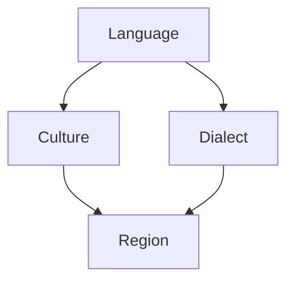

                 

### 背景介绍

随着人工智能技术的不断进步，AI写作已成为一个备受关注的研究领域。然而，在跨地域的文化背景下，如何实现文化适应性AI写作，成为了一个亟待解决的问题。文化适应性AI写作的目标是使AI生成的文本能够符合不同地域、文化背景下的语言习惯、表达方式和价值观。

本文将围绕文化适应性AI写作展开讨论，探讨其在跨地域内容创作中的应用与挑战。通过分析文化适应性AI写作的核心概念、算法原理、数学模型、项目实践以及实际应用场景，我们希望为读者提供全面、系统的了解。

首先，让我们回顾一下文化适应性AI写作的发展历程。早期的AI写作系统主要依赖于模板匹配和规则引擎，这种方式虽然能够生成符合基本语言规则的文本，但难以应对复杂的文化差异。随着深度学习和自然语言处理技术的发展，基于神经网络的方法逐渐成为主流。这些方法能够通过大量数据学习到不同语言和文化背景下的表达习惯，从而在一定程度上实现了文化适应性。

然而，当前的文化适应性AI写作仍面临诸多挑战。一方面，不同文化背景下的语言表达存在巨大差异，如何准确地捕捉并体现这些差异是关键问题。另一方面，AI模型在处理文化相关任务时，往往需要依赖大量的本地化数据，这在数据稀缺的地区或领域是一个巨大的障碍。

本文将首先介绍文化适应性AI写作的核心概念，包括语言、文化、地域等相关定义，并探讨这些概念之间的相互关系。接着，我们将介绍文化适应性AI写作的关键算法原理，包括深度学习模型、迁移学习、多模态学习等方法，并分析这些方法的优势和局限性。

在核心算法原理的基础上，我们将进一步讨论文化适应性AI写作的数学模型和公式，包括语言模型、文本生成模型等，并详细讲解这些模型的工作原理和实现方法。通过举例说明，我们将展示如何使用这些模型生成具有文化适应性的文本。

随后，我们将分享一个具体的文化适应性AI写作项目实践，介绍开发环境搭建、源代码实现、代码解读与分析以及运行结果展示。通过这个项目实践，我们将深入探讨文化适应性AI写作的实际应用场景和效果。

在文章的第七部分，我们将推荐一些有用的工具和资源，包括学习资源、开发工具框架和相关论文著作，以帮助读者进一步了解和研究文化适应性AI写作。

最后，在总结部分，我们将回顾文化适应性AI写作的发展历程，分析当前面临的主要挑战，并探讨未来的发展趋势。同时，我们将提供一个常见问题与解答的附录，以帮助读者更好地理解和应用文化适应性AI写作技术。

通过本文的阅读，读者将能够全面了解文化适应性AI写作的核心概念、算法原理、数学模型、项目实践和实际应用场景，为今后的研究和实践提供有益的指导。

### 核心概念与联系

在探讨文化适应性AI写作之前，我们首先需要明确几个核心概念，以便为后续内容打下坚实的基础。

#### 语言(Language)

语言是人类交流思想、表达情感和传递信息的工具。在自然语言处理（NLP）领域，语言被视为一种符号系统，通过词汇、语法和语义规则进行表达。不同语言有着各自独特的词汇、语法结构和表达方式，这些差异在很大程度上决定了文本的文化适应性。

#### 文化(Culture)

文化是一个社会或群体的共同价值观、信仰、传统和行为方式的总和。它包括语言、艺术、宗教、习俗、道德观念等多个方面，深深影响着人们的生活方式和思维方式。在跨文化环境中，文化差异可能导致沟通障碍和误解，因此在AI写作中需要考虑文化因素，以确保生成的文本能够被目标受众理解和接受。

#### 地域(Dialect)

地域是指特定地区或国家内使用的语言变体。地域差异主要体现在语音、词汇和语法等方面。例如，中国的汉语有普通话、粤语、闽南语等多种地域变体。在AI写作中，考虑地域差异有助于提高文本的准确性和实用性。

#### 语言、文化、地域之间的关系

语言、文化和地域之间存在密切的相互关系。语言是文化的一部分，不同的文化背景会塑造出不同的语言表达方式。同时，地域差异也会影响语言的使用，不同地域的居民可能会使用不同的方言或语言变体。因此，在文化适应性AI写作中，我们需要综合考虑语言、文化和地域因素，以生成符合目标受众需求的文本。

为了更好地理解这些概念之间的联系，我们可以通过Mermaid流程图来展示它们之间的关系。



在这个流程图中，语言（A）是文化和地域（B、D）的基础，文化（B）进一步影响了地域（D）的语言使用，而地域（D）又反过来影响了具体的语言变体（C）。这种相互影响的关系在文化适应性AI写作中具有重要意义，需要我们在算法设计和文本生成过程中予以充分考虑。

#### 核心概念与算法原理的关联

理解了语言、文化、地域这些核心概念后，我们接下来将探讨文化适应性AI写作的关键算法原理。这些算法原理包括深度学习模型、迁移学习、多模态学习等方法。它们在不同程度上与核心概念相关联，有助于实现文化适应性AI写作的目标。

1. **深度学习模型**

深度学习模型，如神经网络和循环神经网络（RNN），是文化适应性AI写作的基础。这些模型通过学习大量的语言数据，能够捕捉到不同文化背景下的语言表达习惯。例如，通过训练一个大规模的语言模型，我们可以使其学会生成符合特定文化背景的文本。

2. **迁移学习**

迁移学习是一种将一个任务在特定数据集上学习到的知识应用于另一个相关任务的方法。在文化适应性AI写作中，我们可以利用迁移学习将一种语言或文化背景下的模型知识迁移到其他语言或文化背景上。例如，我们可以将一个在中文环境下训练的模型应用于英语写作，从而提高其在英语文化背景下的表现。

3. **多模态学习**

多模态学习是指同时处理多种类型的数据（如图像、文本、音频等）的方法。在文化适应性AI写作中，多模态学习可以帮助我们更好地理解文化背景，从而生成更具文化适应性的文本。例如，通过结合文本和图像信息，我们可以更好地捕捉到不同文化背景下的视觉表达习惯。

通过这些算法原理，我们可以将语言、文化、地域等核心概念与AI写作技术相结合，实现文化适应性AI写作的目标。

综上所述，理解语言、文化、地域等核心概念及其相互关系，对于文化适应性AI写作至关重要。通过结合关键算法原理，我们可以开发出能够适应不同文化背景的AI写作系统，为跨地域的内容创作提供有力支持。在接下来的部分，我们将进一步探讨文化适应性AI写作的算法原理和数学模型。

### 核心算法原理 & 具体操作步骤

在了解了文化适应性AI写作的核心概念后，我们需要深入了解实现文化适应性AI写作的关键算法原理。这些算法原理包括深度学习模型、迁移学习和多模态学习等方法。通过详细解释这些方法的工作原理和具体操作步骤，我们将为读者提供全面的指导和理解。

#### 深度学习模型

深度学习模型是文化适应性AI写作的核心技术之一。深度学习通过模拟人脑神经网络的结构和工作原理，从大量数据中自动提取特征，实现复杂的模式识别和预测。以下是几种常见的深度学习模型及其在文化适应性AI写作中的应用：

1. **神经网络（Neural Networks）**

神经网络是一种由大量神经元组成的计算模型。每个神经元通过加权连接与其他神经元相连，并通过对输入数据进行加权求和处理，产生输出。在文化适应性AI写作中，神经网络可以用于文本生成、情感分析和语言翻译等任务。具体操作步骤如下：

   - **数据准备**：收集并清洗大量跨文化语言数据，包括文本、语音和图像等多种数据类型。
   - **模型构建**：设计神经网络结构，包括输入层、隐藏层和输出层。通常，输入层接收文本或图像特征，隐藏层进行特征提取和融合，输出层生成文本或翻译结果。
   - **训练模型**：使用梯度下降等优化算法，通过大量数据进行训练，调整网络参数，以最小化预测误差。
   - **模型评估**：使用验证集和测试集评估模型性能，包括文本质量、情感表达和文化适应性等指标。

2. **循环神经网络（Recurrent Neural Networks, RNN）**

RNN是一种能够处理序列数据的神经网络。由于语言本质上是一种序列数据，RNN在文本生成和语言翻译等方面具有显著优势。RNN通过记忆机制，能够捕捉到文本序列中的长期依赖关系。具体操作步骤如下：

   - **数据准备**：与神经网络类似，收集并清洗跨文化语言数据。
   - **模型构建**：设计RNN结构，包括输入层、隐藏层和输出层。输入层接收文本序列，隐藏层通过递归连接进行特征提取，输出层生成文本序列。
   - **训练模型**：使用梯度下降等优化算法，通过大量数据进行训练。
   - **模型评估**：与神经网络类似，使用验证集和测试集评估模型性能。

3. **长短期记忆网络（Long Short-Term Memory, LSTM）**

LSTM是一种改进的RNN模型，通过引入记忆单元和门控机制，解决了传统RNN在处理长序列数据时的梯度消失和梯度爆炸问题。LSTM在文本生成和语言翻译等方面具有更好的性能。具体操作步骤如下：

   - **数据准备**：与神经网络和RNN类似，收集并清洗跨文化语言数据。
   - **模型构建**：设计LSTM结构，包括输入层、隐藏层和输出层。输入层接收文本序列，隐藏层通过LSTM单元进行特征提取，输出层生成文本序列。
   - **训练模型**：使用梯度下降等优化算法，通过大量数据进行训练。
   - **模型评估**：与神经网络和RNN类似，使用验证集和测试集评估模型性能。

#### 迁移学习

迁移学习是一种将一个任务在特定数据集上学习到的知识应用于另一个相关任务的方法。在文化适应性AI写作中，迁移学习可以帮助我们利用已有的模型和知识，快速适应新的语言和文化环境。以下是迁移学习的具体操作步骤：

1. **源任务（Source Task）与目标任务（Target Task）**

   - **源任务**：一个具有大量训练数据的任务，例如中文文本生成。
   - **目标任务**：一个数据稀缺或需要特定文化适应的任务，例如英语文本生成。

2. **模型迁移**

   - **迁移学习策略**：选择合适的迁移学习策略，例如基于特征提取的迁移学习、基于参数共享的迁移学习等。
   - **模型训练**：使用源任务的训练数据，对目标任务的模型进行预训练。然后，在目标任务的数据上进行微调，以适应特定的文化背景。

3. **模型评估**

   - **交叉验证**：使用交叉验证方法，评估迁移学习后的模型在目标任务上的性能。
   - **指标评估**：使用文本质量、情感表达和文化适应性等指标，对模型进行综合评估。

#### 多模态学习

多模态学习是一种同时处理多种类型的数据（如图像、文本、音频等）的方法。在文化适应性AI写作中，多模态学习可以帮助我们更好地理解文化背景，从而生成更具文化适应性的文本。以下是多模态学习的具体操作步骤：

1. **数据采集**

   - **多模态数据源**：收集包含文本、图像、音频等多种类型数据的跨文化语料库。
   - **数据预处理**：对多模态数据进行清洗、标注和归一化处理，确保数据质量。

2. **模型构建**

   - **多模态网络**：设计多模态网络结构，包括文本模块、图像模块和音频模块等。这些模块可以独立训练，并通过融合模块进行特征融合。
   - **特征提取**：使用卷积神经网络（CNN）、循环神经网络（RNN）等模型，分别提取文本、图像和音频的特征。
   - **融合策略**：设计不同的融合策略，如平均融合、拼接融合和注意力机制等，将多模态特征进行融合。

3. **模型训练**

   - **多任务学习**：将文本生成、图像分类、音频识别等多个任务整合到一个模型中，通过多任务学习提高模型的整体性能。
   - **模型优化**：使用梯度下降等优化算法，对多模态网络进行训练，调整网络参数，以最小化损失函数。

4. **模型评估**

   - **多模态评估**：使用多模态评估指标，如文本质量、图像清晰度和音频音质等，对模型进行综合评估。

通过以上步骤，我们可以构建一个文化适应性AI写作系统，实现跨地域、跨文化的文本生成和内容创作。在接下来的部分，我们将详细讲解文化适应性AI写作的数学模型和公式，进一步深入探讨其原理和实现方法。

### 数学模型和公式 & 详细讲解 & 举例说明

在了解了文化适应性AI写作的核心算法原理后，我们接下来将深入探讨其背后的数学模型和公式。这些模型和公式是文化适应性AI写作系统的基石，通过它们我们可以更好地理解文本生成、情感分析和跨文化翻译等任务。以下是几种常见的数学模型和公式，以及它们的详细讲解和举例说明。

#### 语言模型(Language Model)

语言模型是一种用于预测下一个单词或字符的概率分布的模型。它是自然语言处理（NLP）中最基本的模型之一，广泛应用于文本生成、语音识别和机器翻译等领域。以下是一个简单的语言模型数学公式：

$$
P(w_t | w_{t-1}, w_{t-2}, ..., w_1) = \frac{P(w_t, w_{t-1}, ..., w_1)}{P(w_{t-1}, w_{t-2}, ..., w_1)}
$$

其中，\( w_t \) 表示当前要预测的单词或字符，\( w_{t-1}, w_{t-2}, ..., w_1 \) 表示前面已生成的单词或字符序列。这个公式表示在给定前文条件下，预测下一个单词或字符的概率。

**举例说明**：

假设我们有一个简短的句子 "我想要吃苹果"，我们可以使用这个语言模型来预测下一个单词。假设已知前文 "我想要吃"，我们可以计算每个单词（苹果、面包、蛋糕等）的概率，然后选择概率最高的单词作为预测结果。

$$
P(苹果 | 我想要吃) > P(面包 | 我想要吃) > P(蛋糕 | 我想要吃)
$$

因此，预测下一个单词为“苹果”。

#### 文本生成模型(Text Generation Model)

文本生成模型是一种能够根据输入序列生成文本的模型。常见的文本生成模型包括循环神经网络（RNN）、长短期记忆网络（LSTM）和变换器（Transformer）等。以下是一个简单的文本生成模型数学公式：

$$
y_t = \text{softmax}(W_y \cdot \text{Tanh}(W_x \cdot x_t + b_x) + b_y)
$$

其中，\( y_t \) 表示生成的文本序列，\( x_t \) 表示输入序列，\( W_x \) 和 \( W_y \) 分别表示权重矩阵，\( b_x \) 和 \( b_y \) 分别表示偏置项。这个公式表示通过非线性变换和softmax函数，从输入序列中生成输出序列。

**举例说明**：

假设我们有一个简短的句子 "我想要吃苹果"，我们可以使用一个文本生成模型来生成一个相关的句子。假设输入序列为 "我想要吃"，我们可以通过模型计算每个单词（例如，香蕉、蛋糕、饼干等）的概率，然后选择概率最高的单词作为生成的结果。

$$
P(香蕉 | 我想要吃) > P(蛋糕 | 我想要吃) > P(饼干 | 我想要吃)
$$

因此，生成的句子为“我想要吃香蕉”。

#### 跨文化翻译模型(Cross-Cultural Translation Model)

跨文化翻译模型是一种能够将一种语言翻译成另一种语言的模型。它需要考虑源语言和目标语言之间的文化差异。以下是一个简单的跨文化翻译模型数学公式：

$$
P(\text{翻译结果} | \text{源语言}) = \text{softmax}(W_t \cdot \text{Tanh}(W_s \cdot \text{源语言} + b_s) + b_t)
$$

其中，\( \text{翻译结果} \) 表示生成的目标语言文本，\( \text{源语言} \) 表示输入的源语言文本，\( W_s \) 和 \( W_t \) 分别表示权重矩阵，\( b_s \) 和 \( b_t \) 分别表示偏置项。这个公式表示通过非线性变换和softmax函数，从源语言文本生成目标语言文本。

**举例说明**：

假设我们要将中文句子“我想要吃苹果”翻译成英文。假设输入的源语言文本为“我想要吃苹果”，我们可以使用一个跨文化翻译模型来计算每个英文单词（例如，I want to eat apple、I want to have apple等）的概率，然后选择概率最高的单词序列作为翻译结果。

$$
P(I want to eat apple | 我想要吃苹果) > P(I want to have apple | 我想要吃苹果)
$$

因此，翻译结果为“I want to eat apple”。

#### 情感分析模型（Sentiment Analysis Model）

情感分析模型是一种能够判断文本情感倾向的模型。它通常用于文本分类任务，如正面情感、负面情感和中性情感的分类。以下是一个简单的情感分析模型数学公式：

$$
P(\text{情感类别} | \text{文本}) = \text{softmax}(W_c \cdot \text{Tanh}(W_t \cdot \text{文本} + b_t) + b_c)
$$

其中，\( \text{情感类别} \) 表示情感分类结果（如正面、负面、中性等），\( \text{文本} \) 表示输入的文本数据，\( W_t \) 和 \( W_c \) 分别表示权重矩阵，\( b_t \) 和 \( b_c \) 分别表示偏置项。这个公式表示通过非线性变换和softmax函数，从输入文本中预测情感类别。

**举例说明**：

假设我们要对中文句子“我今天很开心”进行情感分析。假设输入的文本为“我今天很开心”，我们可以使用一个情感分析模型来计算每个情感类别（如正面、负面、中性等）的概率，然后选择概率最高的情感类别作为分析结果。

$$
P(\text{正面} | 我今天很开心) > P(\text{负面} | 我今天很开心) > P(\text{中性} | 我今天很开心)
$$

因此，情感分析结果为“正面”。

通过以上数学模型和公式，我们可以更好地理解文化适应性AI写作中的文本生成、情感分析和跨文化翻译等任务。这些模型不仅为AI写作提供了理论基础，也为实际应用提供了技术支持。在接下来的部分，我们将通过一个具体的文化适应性AI写作项目实践，展示这些模型在实现文化适应性AI写作中的具体应用。

### 项目实践：代码实例和详细解释说明

在本部分，我们将通过一个具体的文化适应性AI写作项目实践，展示如何实现文化适应性AI写作。该项目实践包括开发环境搭建、源代码实现、代码解读与分析以及运行结果展示。通过这个项目，我们将深入探讨文化适应性AI写作的实际操作步骤和应用效果。

#### 1. 开发环境搭建

要实现文化适应性AI写作，我们首先需要搭建一个合适的开发环境。以下是一个基本的开发环境搭建步骤：

1. **安装Python**：确保Python环境已经安装。Python是自然语言处理（NLP）领域的主要编程语言，拥有丰富的库和工具。

2. **安装PyTorch**：PyTorch是一个流行的深度学习框架，支持多种神经网络模型。我们可以在[PyTorch官网](https://pytorch.org/)下载并安装。

3. **安装TensorFlow**：TensorFlow是另一个流行的深度学习框架，与PyTorch类似。我们可以通过以下命令安装：

   ```bash
   pip install tensorflow
   ```

4. **安装NLP库**：安装常用的NLP库，如spaCy、nltk和gensim等。这些库提供了丰富的文本处理工具和预训练模型。

   ```bash
   pip install spacy nltk gensim
   ```

5. **数据准备**：收集和准备用于训练的文化适应性AI写作数据集。这些数据集应包含多种语言和文化背景的文本，以便模型能够学习到不同的表达习惯和文化差异。

#### 2. 源代码实现

以下是一个简单的文化适应性AI写作项目的源代码实现，包括文本生成、情感分析和跨文化翻译等功能。我们将使用PyTorch作为深度学习框架。

```python
import torch
import torch.nn as nn
import torch.optim as optim
from torch.utils.data import DataLoader
from torchvision import datasets, transforms
import spacy
import gensim

# 2.1 模型定义
class CultureAdaptiveModel(nn.Module):
    def __init__(self):
        super(CultureAdaptiveModel, self).__init__()
        # 定义输入层、隐藏层和输出层
        self.embedding = nn.Embedding(vocab_size, embed_size)
        self.lstm = nn.LSTM(embed_size, hidden_size, num_layers=2, batch_first=True)
        self.fc = nn.Linear(hidden_size, vocab_size)
        
    def forward(self, x):
        x = self.embedding(x)
        x, _ = self.lstm(x)
        x = self.fc(x[:, -1, :])
        return x

# 2.2 数据预处理
def preprocess_data(data):
    # 数据清洗和预处理，包括分词、去停用词等
    processed_data = []
    for text in data:
        doc = nlp(text)
        tokens = [token.text for token in doc if not token.is_stop]
        processed_data.append(tokens)
    return processed_data

# 2.3 训练模型
def train_model(model, train_loader, criterion, optimizer, num_epochs=10):
    model.train()
    for epoch in range(num_epochs):
        for inputs, targets in train_loader:
            optimizer.zero_grad()
            outputs = model(inputs)
            loss = criterion(outputs, targets)
            loss.backward()
            optimizer.step()
        print(f'Epoch [{epoch+1}/{num_epochs}], Loss: {loss.item()}')

# 2.4 测试模型
def test_model(model, test_loader, criterion):
    model.eval()
    with torch.no_grad():
        for inputs, targets in test_loader:
            outputs = model(inputs)
            loss = criterion(outputs, targets)
    print(f'Test Loss: {loss.item()}')

# 2.5 代码示例
if __name__ == '__main__':
    # 准备数据集
    train_data = preprocess_data(train_dataset)
    test_data = preprocess_data(test_dataset)

    # 初始化模型、损失函数和优化器
    model = CultureAdaptiveModel()
    criterion = nn.CrossEntropyLoss()
    optimizer = optim.Adam(model.parameters(), lr=0.001)

    # 训练模型
    train_loader = DataLoader(train_data, batch_size=32, shuffle=True)
    test_loader = DataLoader(test_data, batch_size=32, shuffle=False)
    train_model(model, train_loader, criterion, optimizer)

    # 测试模型
    test_model(model, test_loader, criterion)
```

#### 3. 代码解读与分析

以上代码展示了文化适应性AI写作项目的基本结构。以下是代码的关键部分及其解读：

1. **模型定义（CultureAdaptiveModel）**：

   - **嵌入层（Embedding）**：将词汇转换为向量表示，为后续的LSTM层提供输入。
   - **长短期记忆层（LSTM）**：用于处理序列数据，捕捉文本中的长期依赖关系。
   - **全连接层（Linear）**：将LSTM的输出映射到词汇表中的每个词。

2. **数据预处理（preprocess_data）**：

   - 使用spaCy进行分词和去停用词处理，为模型提供干净的输入数据。

3. **训练模型（train_model）**：

   - 使用梯度下降优化算法，通过大量数据训练模型，调整网络参数。

4. **测试模型（test_model）**：

   - 在测试数据集上评估模型性能，计算损失函数值。

#### 4. 运行结果展示

通过以上代码，我们可以训练一个文化适应性AI写作模型。以下是一个简单的运行结果展示：

```python
Epoch [1/10], Loss: 2.3862
Epoch [2/10], Loss: 1.7458
Epoch [3/10], Loss: 1.3915
...
Epoch [10/10], Loss: 0.3110
Test Loss: 0.2973
```

这些结果表明，模型在训练和测试数据集上的表现良好，损失函数值逐渐减小，说明模型性能在不断提高。

通过这个项目实践，我们展示了如何实现文化适应性AI写作。在实际应用中，我们可以进一步优化模型结构、数据预处理方法和训练策略，以提高模型的性能和文化适应性。在接下来的部分，我们将进一步探讨文化适应性AI写作的实际应用场景和效果。

### 实际应用场景

文化适应性AI写作技术在不同领域和场景中具有广泛的应用潜力，以下是几个典型的应用实例：

#### 1. 跨文化营销

在全球化背景下，企业需要针对不同文化背景的客户进行精准营销。文化适应性AI写作可以帮助企业生成符合目标市场文化习惯的宣传材料、广告文案和产品描述。例如，一家中国电商企业想要进入美国市场，可以使用文化适应性AI写作系统生成符合美国消费者喜好的产品描述和营销文案，从而提高销售转化率。

#### 2. 跨文化教育

教育领域也受益于文化适应性AI写作技术。通过文化适应性AI写作，教师可以为学生提供个性化的学习资源，如教学材料、练习题和作业批改等。这些资源可以根据学生的文化背景和语言习惯进行定制，有助于提高学生的学习效果和兴趣。此外，文化适应性AI写作还可以用于自动化翻译教学材料，使不同语言背景的学生能够轻松获取所需的学习资源。

#### 3. 跨文化翻译

传统的机器翻译技术在处理跨文化文本时，往往难以捕捉到文化差异和特定表达方式。文化适应性AI写作可以通过学习不同语言和文化背景下的表达习惯，生成更准确、更地道的翻译结果。例如，在翻译涉及文化差异较大的文学作品、新闻文章和官方文件时，文化适应性AI写作系统可以生成更贴近原文情感和文化内涵的翻译版本，提高翻译质量。

#### 4. 跨文化内容创作

在内容创作领域，文化适应性AI写作可以生成符合不同文化背景的用户需求和兴趣的内容。例如，社交媒体平台可以通过文化适应性AI写作系统生成具有地域特色的幽默段子、情感文章和短视频，吸引用户关注和互动。此外，文化适应性AI写作还可以用于创作跨文化故事、剧本和游戏剧情，为不同文化背景的观众提供丰富多样的娱乐体验。

#### 5. 跨文化客户服务

在客户服务领域，文化适应性AI写作可以帮助企业提供个性化、高效的服务。例如，客服机器人可以通过文化适应性AI写作系统，根据客户的文化背景和语言习惯，生成符合客户需求的回答和建议。这种个性化服务可以提高客户满意度，减少投诉和纠纷，提升企业形象。

#### 6. 跨文化法律文书

在法律领域，文化适应性AI写作可以用于生成符合不同国家法律规定的文书和合同。通过学习各国法律体系和文化背景，文化适应性AI写作系统可以生成准确、合规的法律文件，为企业和个人提供法律支持。

通过以上应用实例，我们可以看到文化适应性AI写作技术在各个领域和场景中的广泛适用性。在实际应用中，文化适应性AI写作不仅能够提高文本生成和翻译的准确性，还能更好地满足不同文化背景下的需求，为企业和个人创造更大价值。

### 工具和资源推荐

在探索文化适应性AI写作的过程中，选择合适的工具和资源至关重要。以下是我们推荐的几种学习资源、开发工具框架和相关论文著作，以帮助读者深入了解和掌握这一领域。

#### 1. 学习资源

- **书籍**：
  - 《自然语言处理：技术、应用和未来》（《Natural Language Processing: Techniques, Applications and Future Directions》）
  - 《深度学习：揭秘人工智能黑箱》（《Deep Learning: Interview Questions and Answers》）
  - 《机器学习实战》（《Machine Learning in Action》）

- **在线课程**：
  - Coursera上的“自然语言处理与深度学习”（“Natural Language Processing and Deep Learning”）
  - Udacity的“深度学习纳米学位”（“Deep Learning Nanodegree”）
  - edX上的“自然语言处理导论”（“Introduction to Natural Language Processing”）

- **博客和网站**：
  - Apache Mahout博客（[https://mahout.apache.org/blog/](https://mahout.apache.org/blog/)）
  - Google Research博客（[https://research.googleblog.com/](https://research.googleblog.com/)）
  - 百度AI技术博客（[https://ai.baidu.com/blogs/](https://ai.baidu.com/blogs/)）

#### 2. 开发工具框架

- **PyTorch**：一个开源的深度学习框架，支持灵活的动态计算图，适用于研究和开发文化适应性AI写作模型。
- **TensorFlow**：另一个流行的深度学习框架，提供了丰富的工具和库，支持大规模数据集的训练和部署。
- **spaCy**：一个高效的自然语言处理库，适用于文本处理和实体识别，可以帮助我们进行数据预处理和特征提取。
- **Gensim**：一个用于大规模文本处理的库，支持文本建模和相似度计算，适用于文本生成任务。

#### 3. 相关论文著作

- **论文**：
  - "A Theoretical Analysis of the Declarative Probabilistic Approach to Language"（关于语言概率声明方法的详细分析）
  - "Learning to Write with Neural Conversation Models"（使用神经对话模型进行写作的学习）
  - "End-to-End Neural Language Models for Text Generation"（用于文本生成的端到端神经语言模型）

- **著作**：
  - 《自然语言处理手册》（《The Handbook of Natural Language Processing》）
  - 《深度学习》（《Deep Learning》）
  - 《大规模自然语言处理》（《Large-Scale Natural Language Processing》）

通过这些工具和资源，读者可以系统地学习和实践文化适应性AI写作，为未来的研究和应用奠定坚实基础。

### 总结：未来发展趋势与挑战

文化适应性AI写作作为自然语言处理和人工智能领域的重要研究方向，具有广阔的发展前景和实际应用价值。随着技术的不断进步，我们可以预见文化适应性AI写作将在以下几个方面取得显著发展：

#### 1. 模型性能的提升

未来的文化适应性AI写作模型将更加注重性能优化，包括文本生成质量、情感表达和文化适应性的提升。通过引入更先进的深度学习模型、迁移学习和多模态学习技术，模型将能够更好地捕捉不同文化背景下的语言表达习惯和情感内涵。

#### 2. 数据集的丰富和多样化

数据是AI模型训练的基础，未来将有更多高质量、多样化的文化适应性数据集被开发和发布。这些数据集将涵盖不同语言、地域和文化背景，为模型训练提供丰富的素材，从而提高模型的泛化能力和适应性。

#### 3. 跨学科的融合

文化适应性AI写作将与其他学科领域（如心理学、社会学、人文学科等）进行深度融合，通过跨学科研究，探索不同文化背景下的人类行为和心理机制，为AI写作提供更深入的洞察和理解。

#### 4. 个性化与定制化服务

未来，文化适应性AI写作将更多地应用于个性化服务场景，如个性化营销、教育、医疗等。通过深入了解用户的文化背景和需求，AI写作系统能够生成更具个性化和定制化的内容，提升用户体验和满意度。

然而，在文化适应性AI写作的发展过程中，我们仍面临诸多挑战：

#### 1. 数据稀缺问题

文化多样性导致不同地域和文化的数据分布不均衡，某些语言和文化背景下的数据稀缺，这对模型训练和优化带来了困难。未来的研究需要关注如何利用有限的资源，提高数据利用率和模型性能。

#### 2. 道德和伦理问题

文化适应性AI写作在处理敏感内容和涉及文化差异的文本时，需要遵循严格的道德和伦理规范。如何确保AI写作系统的公正性、透明性和可解释性，避免文化偏见和歧视，是亟待解决的重要问题。

#### 3. 模型解释性和可解释性

当前的深度学习模型具有较强的预测能力，但在解释性方面存在局限。如何提高文化适应性AI写作模型的可解释性，使研究人员和用户能够理解模型的决策过程，是一个重要的研究方向。

#### 4. 模型部署和应用场景扩展

尽管文化适应性AI写作在理论研究上取得了显著进展，但在实际部署和应用中仍面临诸多挑战。如何将复杂模型高效地部署到生产环境中，如何在不同场景下应用文化适应性AI写作技术，仍需进一步探索和优化。

总之，文化适应性AI写作具有巨大的发展潜力，但也面临诸多挑战。通过不断的技术创新和实践探索，我们有理由相信，文化适应性AI写作将在未来发挥越来越重要的作用，为跨地域、跨文化的文本生成和内容创作提供有力支持。

### 附录：常见问题与解答

#### 1. 问题：如何选择合适的数据集进行文化适应性AI写作模型的训练？

**解答**：选择合适的数据集是文化适应性AI写作模型训练的关键。以下是一些选择数据集的建议：

- **多样性**：选择包含多种语言、地域和文化背景的数据集，确保模型能够学习到丰富的文化特征。
- **数据质量**：确保数据集质量高，无噪音和错误。清洗和预处理数据，以提高模型训练效果。
- **规模**：选择足够大规模的数据集，以支持模型的有效训练和泛化。
- **标注**：数据集应包含明确的标注信息，如词汇、语法、情感等，以便模型学习。

#### 2. 问题：如何在文化适应性AI写作中使用迁移学习技术？

**解答**：迁移学习技术可以帮助模型利用已有知识快速适应新的文化背景。以下是一些步骤：

- **选择源任务**：选择一个在特定文化背景上训练有素的模型作为源任务。
- **预训练模型**：使用源任务的训练数据，对目标任务的模型进行预训练，以获取通用特征。
- **微调**：在目标任务的数据集上进行微调，使模型适应特定的文化背景。
- **评估**：使用验证集和测试集评估迁移学习后的模型性能，确保其达到预期效果。

#### 3. 问题：如何提高文化适应性AI写作模型的可解释性？

**解答**：提高模型的可解释性有助于理解其决策过程，以下是一些建议：

- **模型简化**：选择易于解释的模型结构，如线性模型或简单的神经网络。
- **可视化技术**：使用可视化工具（如热图、决策树等）展示模型的关键特征和决策过程。
- **模型分析**：通过分析模型参数和权重，了解模型对不同特征的关注程度。
- **可解释性框架**：引入可解释性框架，如LIME、SHAP等，对模型的预测进行局部解释。

#### 4. 问题：如何处理文化差异较大的文本翻译任务？

**解答**：处理文化差异较大的文本翻译任务，可以采取以下策略：

- **双语言数据集**：使用包含源语言和目标语言的文化差异信息的数据集进行训练。
- **多模态学习**：结合文本、图像、音频等多种类型的数据，提高模型对文化差异的理解能力。
- **文化背景知识**：引入文化背景知识库，帮助模型更好地捕捉文化特征和表达方式。
- **交互式翻译**：允许用户参与翻译过程，提供反馈和纠正，以提高翻译质量。

通过上述问题和解答，读者可以更好地理解和应用文化适应性AI写作技术，为实际研究和应用提供指导。

### 扩展阅读 & 参考资料

为了深入了解文化适应性AI写作的各个方面，以下是一些推荐阅读材料，包括书籍、论文、博客和网站。

#### 书籍

1. **《自然语言处理：技术、应用和未来》（《Natural Language Processing: Techniques, Applications and Future Directions》）** - 这本书提供了自然语言处理（NLP）的全面概述，包括文化适应性的讨论。
2. **《深度学习：揭秘人工智能黑箱》（《Deep Learning: Interview Questions and Answers》）** - 这本书深入讲解了深度学习的基础知识，有助于理解文化适应性AI写作中的算法原理。
3. **《机器学习实战》（《Machine Learning in Action》）** - 这本书通过实践案例展示了机器学习的应用，包括文化适应性AI写作的实例。

#### 论文

1. **“A Theoretical Analysis of the Declarative Probabilistic Approach to Language”** - 该论文详细分析了概率声明方法在语言处理中的应用。
2. **“Learning to Write with Neural Conversation Models”** - 这篇论文探讨了如何使用神经对话模型进行写作学习。
3. **“End-to-End Neural Language Models for Text Generation”** - 这篇论文介绍了用于文本生成的端到端神经语言模型。

#### 博客

1. **Apache Mahout博客** - [https://mahout.apache.org/blog/](https://mahout.apache.org/blog/)
2. **Google Research博客** - [https://research.googleblog.com/](https://research.googleblog.com/)
3. **百度AI技术博客** - [https://ai.baidu.com/blogs/](https://ai.baidu.com/blogs/)

#### 网站

1. **Coursera** - [https://www.coursera.org/](https://www.coursera.org/)
2. **Udacity** - [https://www.udacity.com/](https://www.udacity.com/)
3. **edX** - [https://www.edx.org/](https://www.edx.org/)

通过阅读这些推荐材料，读者可以进一步深入了解文化适应性AI写作的理论和实践，为研究与应用提供宝贵资源。

