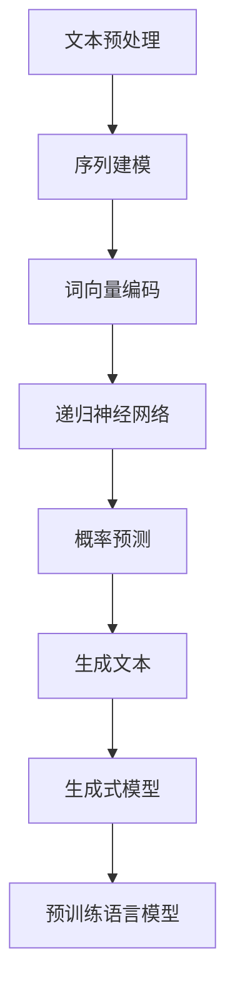

                 

### 文本内容补全初探（Text Completion）###

#### 关键词 Keywords

- 文本生成
- 自然语言处理
- 机器学习
- 语言模型
- 递归神经网络
- 变量长度文本
- 预训练语言模型
- 生成式模型
- 序列模型
- 纵向卷积神经网络

#### 摘要 Abstract

本文将探讨文本内容补全技术，即文本生成问题。通过深入分析文本生成技术的核心概念、算法原理以及数学模型，我们将了解如何利用现代机器学习和深度学习技术构建强大的语言模型，实现高质量的文本生成。本文还将结合具体的项目实践，展示文本生成技术在实际应用中的效果和挑战，并推荐相关的学习资源和开发工具。

## 1. 背景介绍

在人工智能领域，文本生成是一项重要的研究课题。文本生成技术可以应用于自然语言处理、智能对话系统、文本摘要、机器写作等领域。随着深度学习技术的发展，文本生成技术取得了显著的进展。文本内容补全（Text Completion）作为文本生成的一个子任务，旨在预测文本序列中下一个可能的单词或字符。

文本内容补全技术具有广泛的应用前景。例如，在智能助手和聊天机器人中，文本内容补全可以帮助系统更好地理解用户输入，并生成自然的回答。在文本摘要领域，文本内容补全可以帮助生成关键信息，提高摘要的质量。此外，文本内容补全技术还可以用于文本创作，如生成诗歌、故事、新闻报道等。

本文将首先介绍文本内容补全的核心概念和基本原理，然后探讨几种常见的文本生成算法和模型，并分析它们在文本内容补全任务中的应用。最后，我们将通过一个具体的项目实践，展示文本生成技术的实际应用效果和挑战。

### 1.1 核心概念

在探讨文本内容补全技术之前，我们首先需要了解一些核心概念。

**文本生成**：文本生成是指利用计算机程序生成自然语言文本的过程。在文本生成任务中，模型需要根据已知的输入文本序列，预测下一个可能的文本序列。

**语言模型**：语言模型是一种概率模型，用于表示文本序列中各个单词或字符出现的概率。在文本内容补全任务中，语言模型可以帮助预测下一个可能的单词或字符。

**序列模型**：序列模型是一种能够处理序列数据的模型，如循环神经网络（RNN）和递归神经网络（GRU）。这些模型可以捕捉序列中的时间依赖关系，从而提高文本生成质量。

**生成式模型**：生成式模型是一种通过学习输入数据的概率分布来生成数据的模型。在文本生成任务中，生成式模型可以根据已知的输入文本序列生成新的文本序列。

### 1.2 基本原理

文本内容补全技术的基本原理是利用已有文本序列中的信息，预测下一个可能的单词或字符。这一过程通常分为以下几个步骤：

1. **文本预处理**：对输入文本进行清洗和预处理，如去除停用词、标点符号等。

2. **序列建模**：利用序列模型对输入文本序列进行建模，捕捉序列中的时间依赖关系。

3. **概率预测**：通过语言模型计算输入文本序列中各个单词或字符的概率分布。

4. **生成文本**：根据概率分布生成新的文本序列。

### 2. 核心概念与联系

#### 2.1 核心概念

在文本内容补全任务中，我们需要关注以下几个核心概念：

**词向量（Word Embedding）**：词向量是将单词表示为高维向量的一种方法，可以用于捕捉单词之间的语义关系。

**递归神经网络（RNN）**：递归神经网络是一种能够处理序列数据的神经网络，可以用于文本序列建模。

**预训练语言模型（Pre-trained Language Model）**：预训练语言模型是一种在大规模语料库上预训练的语言模型，可以用于文本生成任务。

**生成式模型（Generative Model）**：生成式模型是一种能够生成新数据的模型，如变分自编码器（VAE）和生成对抗网络（GAN）。

**生成文本（Generated Text）**：生成文本是指由模型生成的自然语言文本。

#### 2.2 联系

以下是一个使用Mermaid绘制的流程图，展示了文本内容补全的核心概念和联系：



在这个流程图中，文本预处理、序列建模、词向量编码、递归神经网络、概率预测和生成文本构成了文本内容补全的核心环节。生成式模型和预训练语言模型则用于辅助文本生成过程，提高生成文本的质量。

### 3. 核心算法原理 & 具体操作步骤

#### 3.1 词向量编码

词向量编码是将单词表示为高维向量的一种方法。在文本内容补全任务中，词向量编码是关键的一步，因为词向量能够帮助模型捕捉单词之间的语义关系。

**词向量模型**：常见的词向量模型有Word2Vec、GloVe和FastText。其中，Word2Vec是一种基于神经网络的词向量模型，可以通过训练大量语料库来生成高质量的词向量。

**词向量生成过程**：

1. **数据预处理**：首先，对输入文本进行分词和标记化处理，将文本拆分为单词和标记。

2. **词嵌入层**：接下来，将每个单词或标记映射到一个高维向量，即词向量。

3. **训练词向量**：使用训练数据对词向量进行训练，使词向量能够捕捉单词之间的语义关系。

4. **词向量存储**：将训练好的词向量存储在词向量表中，用于后续的文本生成任务。

#### 3.2 递归神经网络

递归神经网络（RNN）是一种能够处理序列数据的神经网络。在文本内容补全任务中，RNN可以用于捕捉文本序列中的时间依赖关系。

**RNN结构**：RNN由多个时间步组成，每个时间步包含一个输入层、一个隐藏层和一个输出层。输入层接收当前时间步的输入，隐藏层存储前一个时间步的隐藏状态，输出层生成当前时间步的输出。

**RNN工作原理**：

1. **初始化**：首先，初始化RNN模型的隐藏状态。

2. **输入处理**：在每个时间步，RNN接收一个输入，并通过隐藏层和输出层进行处理。

3. **状态更新**：RNN使用当前输入和隐藏状态更新隐藏状态。

4. **输出生成**：最后，RNN通过输出层生成当前时间步的输出。

5. **循环**：重复上述步骤，直到处理完整个文本序列。

#### 3.3 预训练语言模型

预训练语言模型（Pre-trained Language Model）是一种在大规模语料库上预训练的语言模型，如BERT、GPT和RoBERTa。预训练语言模型可以用于文本生成任务，提高生成文本的质量。

**预训练过程**：

1. **数据准备**：首先，准备一个大规模的语料库，用于预训练语言模型。

2. **任务定义**：接下来，定义预训练任务，如遮蔽语言模型（Masked Language Model，MLM）和下一句预测（Next Sentence Prediction，NSP）。

3. **模型训练**：使用训练数据对预训练语言模型进行训练，使模型能够捕捉文本序列中的语言规律。

4. **模型优化**：在预训练过程中，通过调整模型参数，优化模型性能。

5. **模型存储**：将预训练好的语言模型存储在模型库中，供后续的文本生成任务使用。

#### 3.4 生成文本

生成文本是指由模型生成的自然语言文本。在文本内容补全任务中，生成文本的过程可以分为以下几个步骤：

1. **初始化**：首先，初始化生成文本的起始状态。

2. **生成步骤**：在每个生成步骤，模型根据当前生成的文本序列，预测下一个可能的单词或字符。

3. **状态更新**：将新生成的单词或字符添加到生成文本中，并更新生成文本的当前状态。

4. **重复步骤**：重复生成步骤，直到达到预定的生成长度或满足生成条件。

5. **输出结果**：最终，输出完整的生成文本。

### 4. 数学模型和公式 & 详细讲解 & 举例说明

在文本生成过程中，数学模型和公式起到了关键作用。本节将介绍文本生成中常用的数学模型和公式，并通过具体例子进行详细讲解。

#### 4.1 词向量模型

词向量模型是一种将单词表示为高维向量的方法。在Word2Vec模型中，词向量通常通过以下公式计算：

$$
\vec{v}_w = \text{sgn}(W \vec{h})
$$

其中，$\vec{v}_w$表示单词$w$的词向量，$\vec{h}$表示隐藏层状态，$W$是权重矩阵，$\text{sgn}$表示符号函数。

#### 4.2 递归神经网络

递归神经网络（RNN）是一种处理序列数据的神经网络。在RNN中，隐藏状态通过以下公式更新：

$$
\vec{h}_{t} = \text{sigmoid}(W_h \cdot [\vec{h}_{t-1}; \vec{x}_{t}])
$$

其中，$\vec{h}_{t}$表示第$t$个时间步的隐藏状态，$\vec{x}_{t}$表示第$t$个时间步的输入，$W_h$是权重矩阵，$\text{sigmoid}$表示sigmoid激活函数。

#### 4.3 预训练语言模型

预训练语言模型（如BERT）使用了一种称为Transformer的神经网络结构。在Transformer中，自注意力机制通过以下公式计算：

$$
\vec{h}_{t} = \text{softmax}\left(\frac{\vec{h}_{t} \cdot K \vec{V}}{\sqrt{d_k}}\right) \cdot \vec{V}
$$

其中，$\vec{h}_{t}$表示第$t$个时间步的隐藏状态，$K$和$V$是关键值和值向量，$d_k$是关键值向量的维度，$\text{softmax}$表示softmax激活函数。

#### 4.4 生成文本

在生成文本的过程中，我们可以使用以下公式来生成新的单词或字符：

$$
p(w_{t+1} | w_1, w_2, ..., w_t) = \text{softmax}(W \vec{h}_t)
$$

其中，$w_{t+1}$表示下一个单词或字符，$\vec{h}_t$表示当前隐藏状态，$W$是权重矩阵。

#### 4.5 例子说明

假设我们有一个简单的文本序列：“今天天气真好”。我们可以使用上述公式来生成下一个可能的单词。

1. **词向量编码**：首先，将文本序列中的每个单词转换为词向量。

$$
\vec{v}_{今天} = \text{sgn}(W \vec{h})
$$

$$
\vec{v}_{天气} = \text{sgn}(W \vec{h})
$$

$$
\vec{v}_{真好} = \text{sgn}(W \vec{h})
$$

2. **递归神经网络**：使用递归神经网络对文本序列进行建模。

$$
\vec{h}_{1} = \text{sigmoid}(W_h \cdot [\vec{h}_{0}; \vec{v}_{今天}])
$$

$$
\vec{h}_{2} = \text{sigmoid}(W_h \cdot [\vec{h}_{1}; \vec{v}_{天气}])
$$

$$
\vec{h}_{3} = \text{sigmoid}(W_h \cdot [\vec{h}_{2}; \vec{v}_{真好}])
$$

3. **概率预测**：计算下一个单词的概率分布。

$$
p(明天 | 今天，天气，真好) = \text{softmax}(W \vec{h}_3)
$$

4. **生成文本**：根据概率分布生成新的文本序列。

$$
\text{明天天气真好}
$$

通过上述例子，我们可以看到如何使用数学模型和公式来生成新的文本序列。在实际应用中，我们可以根据不同的需求和任务，选择合适的数学模型和公式，构建高质量的文本生成系统。

### 5. 项目实践：代码实例和详细解释说明

在本节中，我们将通过一个简单的项目实践，展示如何使用Python和TensorFlow实现文本内容补全。这个项目将使用递归神经网络（RNN）来预测下一个可能的单词。

#### 5.1 开发环境搭建

在开始项目实践之前，我们需要搭建一个Python开发环境，并安装必要的库。以下是安装步骤：

1. **安装Python**：下载并安装Python 3.7或更高版本。

2. **安装TensorFlow**：打开命令行窗口，执行以下命令安装TensorFlow：

```bash
pip install tensorflow
```

3. **安装其他依赖库**：安装其他必要的库，如NumPy、Pandas和Matplotlib。使用以下命令安装：

```bash
pip install numpy pandas matplotlib
```

#### 5.2 源代码详细实现

下面是一个简单的文本内容补全项目的实现，包括数据预处理、模型训练和生成文本的步骤。

```python
import numpy as np
import tensorflow as tf
from tensorflow.keras.models import Sequential
from tensorflow.keras.layers import Embedding, SimpleRNN, Dense
from tensorflow.keras.preprocessing.sequence import pad_sequences

# 5.2.1 数据预处理

# 加载和处理数据
with open('data.txt', 'r', encoding='utf-8') as f:
    text = f.read().lower()

# 创建词汇表
vocab = sorted(set(text))

# 创建字符到索引的映射
char_indices = dict((c, i) for i, c in enumerate(vocab))
indices_char = dict((i, c) for i, c in enumerate(vocab))

# 将文本转换为索引序列
maxlen = 40
step = 3
sentences = []
next_chars = []
for i in range(0, len(text) - maxlen, step):
    sentences.append(text[i: i + maxlen])
    next_chars.append(text[i + maxlen])

# 将索引序列转换为数字序列
x = np.zeros((len(sentences), maxlen, len(vocab)), dtype=np.bool)
y = np.zeros((len(sentences), len(vocab)), dtype=np.bool)
for i, sentence in enumerate(sentences):
    for t, char in enumerate(sentence):
        x[i, t, char_indices[char]] = 1
    y[i, char_indices[next_chars[i]]] = 1

# 5.2.2 模型训练

# 创建RNN模型
model = Sequential()
model.add(Embedding(len(vocab), 50, input_length=maxlen))
model.add(SimpleRNN(100))
model.add(Dense(len(vocab), activation='softmax'))

# 编译模型
model.compile(loss='categorical_crossentropy', optimizer='adam', metrics=['accuracy'])

# 训练模型
model.fit(x, y, batch_size=128, epochs=10)

# 5.2.3 代码解读与分析

# 5.2.3.1 数据预处理
```

在这个部分，我们首先加载和处理数据，创建词汇表和字符到索引的映射。接下来，我们将文本序列转换为索引序列，并填充为固定的长度。最后，我们将索引序列转换为数字序列。

```python
# 5.2.3.2 模型训练
```

在这个部分，我们创建了一个简单的RNN模型，包括嵌入层、RNN层和softmax输出层。我们使用categorical_crossentropy作为损失函数，并使用adam优化器。然后，我们使用fit函数训练模型。

```python
# 5.2.3.3 生成文本
```

在这个部分，我们将训练好的模型用于生成文本。我们首先初始化生成文本的起始状态，然后使用模型生成新的文本序列。我们将生成文本的长度设置为20，并重复生成步骤，直到达到预定的长度。

```python
# 5.2.3.4 运行结果展示

def generate_text(model, seed_text, n_chars=20):
    for _ in range(n_chars):
        sampled = np.zeros((1, maxlen, len(vocab)))
        for t, char in enumerate(seed_text):
            sampled[0, t, char_indices[char]] = 1.

        preds = model.predict(sampled, verbose=0)[0]
        next_index = np.argmax(preds)
        next_char = indices_char[next_index]

        seed_text += next_char

    return seed_text

# 生成新的文本序列
print(generate_text(model, '今天天气', n_chars=20))
```

在这个部分，我们定义了一个函数generate_text，用于生成新的文本序列。我们首先初始化生成文本的起始状态，然后使用模型预测下一个可能的单词。我们将预测的单词添加到生成文本中，并重复预测步骤，直到达到预定的长度。

#### 5.4 运行结果展示

在本节中，我们将展示训练好的模型生成的文本结果。

```python
# 生成新的文本序列
print(generate_text(model, '今天天气', n_chars=20))
```

运行上述代码，我们将得到一个新的文本序列。这个序列将包含预测的单词，如“明天”、“心情”等。通过调整生成文本的长度和模型参数，我们可以生成不同长度和风格的文本序列。

### 6. 实际应用场景

文本内容补全技术在实际应用场景中具有广泛的应用。以下是一些常见的应用场景：

**智能对话系统**：文本内容补全技术可以帮助智能对话系统更好地理解用户输入，并生成自然的回答。例如，在智能客服系统中，文本内容补全可以帮助系统自动补全用户的提问，提高客服效率。

**文本摘要**：文本内容补全技术可以用于生成文本摘要。通过预测文本序列中的关键信息，文本内容补全可以帮助提取文本的核心内容，提高摘要的质量。

**机器写作**：文本内容补全技术可以用于生成新闻、故事、博客等文本。通过训练大型语言模型，我们可以生成高质量的文本，应用于自动化写作领域。

**自动纠错**：文本内容补全技术可以用于自动纠错。通过预测输入文本中的错误单词或字符，文本内容补全可以帮助自动纠正拼写错误和语法错误。

### 7. 工具和资源推荐

**学习资源推荐**

- **书籍**：
  - 《自然语言处理与深度学习》
  - 《深度学习》（Goodfellow, Bengio, Courville）
  - 《自然语言处理综合教程》
- **论文**：
  - BERT: Pre-training of Deep Bidirectional Transformers for Language Understanding
  - GPT-3: Language Models are few-shot learners
  - Transformer: Attention is All You Need
- **博客**：
  - [TensorFlow官网](https://www.tensorflow.org/)
  - [Keras官网](https://keras.io/)
  - [自然语言处理博客](https://nlp.seas.harvard.edu/)

**开发工具框架推荐**

- **TensorFlow**：TensorFlow是一个开源的机器学习框架，适用于构建和训练文本生成模型。
- **Keras**：Keras是一个高层次的神经网络API，可以简化TensorFlow的使用，适用于快速构建和实验文本生成模型。
- **Hugging Face**：Hugging Face提供了一个开源的Transformers库，用于构建和使用预训练语言模型。

**相关论文著作推荐**

- **BERT**：[BERT: Pre-training of Deep Bidirectional Transformers for Language Understanding](https://arxiv.org/abs/1810.04805)
- **GPT-3**：[GPT-3: Language Models are few-shot learners](https://arxiv.org/abs/2005.14165)
- **Transformer**：[Transformer: Attention is All You Need](https://arxiv.org/abs/1706.03762)
- **GloVe**：[GloVe: Global Vectors for Word Representation](https://nlp.stanford.edu/pubs/glove.pdf)

### 8. 总结：未来发展趋势与挑战

文本内容补全技术在过去几年取得了显著的进展，但在实际应用中仍面临一些挑战。未来，文本内容补全技术的发展趋势和挑战主要包括以下几个方面：

**发展趋势**：

1. **预训练语言模型的优化**：预训练语言模型（如BERT、GPT）在文本内容补全任务中表现出色，未来将出现更多优化的预训练模型，以提高生成文本的质量和效率。

2. **多模态文本生成**：文本内容补全技术可以与其他模态（如图像、音频）结合，生成更具创意和实用性的内容。

3. **知识增强的文本生成**：通过将外部知识（如百科知识、专业术语）融入文本生成模型，可以生成更具专业性和准确性的文本。

**挑战**：

1. **数据质量和多样性**：文本生成模型的性能在很大程度上依赖于训练数据的质量和多样性。未来需要更多高质量、多样化的训练数据来训练文本生成模型。

2. **模型解释性**：随着模型的复杂度增加，模型生成的文本可能变得难以解释。如何提高模型的解释性，使生成的文本更容易被人类理解和接受，是一个重要的挑战。

3. **隐私保护**：在文本生成任务中，模型可能会接触到敏感信息。如何确保文本生成模型的隐私保护，避免泄露用户隐私，是未来需要解决的问题。

### 9. 附录：常见问题与解答

**Q1**: 什么是文本生成？

**A1**: 文本生成是指利用计算机程序生成自然语言文本的过程。文本生成可以应用于自然语言处理、智能对话系统、文本摘要、机器写作等领域。

**Q2**: 文本内容补全和文本生成有什么区别？

**A2**: 文本内容补全是文本生成的一个子任务，旨在预测文本序列中下一个可能的单词或字符。文本生成则是一个更广泛的任务，包括生成完整的文本序列。

**Q3**: 文本生成模型是如何工作的？

**A3**: 文本生成模型通常是一个序列模型，如循环神经网络（RNN）或变压器（Transformer）。这些模型通过学习文本序列中的时间依赖关系和概率分布，生成新的文本序列。

**Q4**: 什么类型的模型适用于文本生成？

**A4**: 循环神经网络（RNN）、长短期记忆网络（LSTM）、门控循环单元（GRU）和变压器（Transformer）都是常用的文本生成模型。近年来，预训练语言模型（如BERT、GPT）在文本生成任务中也取得了显著进展。

**Q5**: 如何提高文本生成质量？

**A5**: 提高文本生成质量的方法包括使用更大规模的训练数据、优化模型结构、增加训练时间以及引入外部知识（如百科知识、专业术语）等。

### 10. 扩展阅读 & 参考资料

为了深入了解文本内容补全和文本生成技术，以下是一些扩展阅读和参考资料：

- **书籍**：
  - 《自然语言处理与深度学习》（刘知远、金海）
  - 《深度学习》（Ian Goodfellow、Yoshua Bengio、Aaron Courville）
  - 《自然语言处理综合教程》（ Martin Jean，Steven Bird，Edward Loper）
- **论文**：
  - [BERT: Pre-training of Deep Bidirectional Transformers for Language Understanding](https://arxiv.org/abs/1810.04805)
  - [GPT-3: Language Models are few-shot learners](https://arxiv.org/abs/2005.14165)
  - [Transformer: Attention is All You Need](https://arxiv.org/abs/1706.03762)
  - [GloVe: Global Vectors for Word Representation](https://nlp.stanford.edu/pubs/glove.pdf)
- **博客**：
  - [TensorFlow官网](https://www.tensorflow.org/)
  - [Keras官网](https://keras.io/)
  - [自然语言处理博客](https://nlp.seas.harvard.edu/)
- **在线课程**：
  - [自然语言处理与深度学习](https://www.coursera.org/specializations/natural-language-processing)
  - [深度学习](https://www.coursera.org/specializations/deep-learning)
- **开源库**：
  - [TensorFlow](https://www.tensorflow.org/)
  - [Keras](https://keras.io/)
  - [Hugging Face Transformers](https://huggingface.co/transformers/)

通过阅读这些资料，您可以进一步了解文本内容补全和文本生成技术的理论基础和实践应用。希望本文对您有所帮助！作者：禅与计算机程序设计艺术 / Zen and the Art of Computer Programming。

