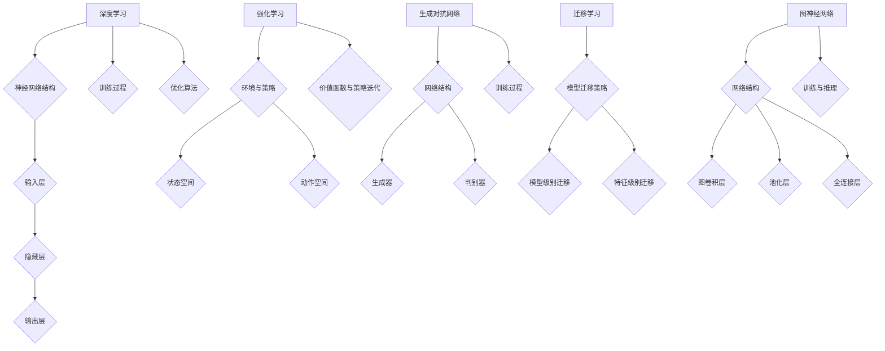

                 

### 1. 背景介绍

#### 引言

随着人工智能技术的不断演进，新一代AI技术在各行各业的应用场景愈发广泛。这些技术不仅极大地提升了生产效率，还在优化决策、提高服务质量等方面展现出强大的潜力。本文旨在探讨新一代AI技术的核心概念、应用场景及其发展前景，帮助读者深入了解这一领域的最新动态。

#### AI技术发展历程

人工智能（AI）的概念可以追溯到20世纪50年代，当时图灵提出了著名的“图灵测试”，旨在判断机器是否具有智能。经过几十年的发展，AI技术经历了多个阶段，从早期的符号推理、知识表示，到现代的深度学习和强化学习，技术不断迭代，应用领域也在不断扩展。

在21世纪初，随着计算机硬件性能的提升和大数据的普及，深度学习成为AI领域的突破性进展。神经网络模型的复杂度和计算能力显著增强，使得AI在图像识别、语音识别、自然语言处理等领域取得了显著成果。

近年来，新一代AI技术，如生成对抗网络（GAN）、迁移学习、图神经网络等，进一步推动了AI技术的发展。这些技术不仅在学术界取得了广泛关注，也在实际应用中展示了巨大的潜力。

#### 新一代AI技术的定义与特征

新一代AI技术通常指的是在深度学习、强化学习等传统AI技术基础上，结合最新研究成果和发展趋势所形成的新兴技术。这些技术具有以下几个特征：

1. **高效率与自优化**：新一代AI技术通过优化算法和模型结构，实现了更高的计算效率和自优化能力，能够更好地应对大规模数据处理和复杂决策问题。
2. **跨界融合**：新一代AI技术不仅与计算机科学领域紧密结合，还与其他学科，如生物学、心理学、经济学等相互融合，形成了跨学科的交叉研究方向。
3. **自适应与泛化能力**：新一代AI技术通过引入新的学习机制和模型架构，增强了系统的自适应能力和泛化能力，能够在不同的应用场景中表现出色。
4. **隐私保护和安全性**：随着AI技术的广泛应用，隐私保护和安全性成为新一代AI技术需要解决的重要问题。通过引入加密、差分隐私等技术，新一代AI技术能够更好地保护用户隐私和数据安全。

#### 应用领域的扩展

新一代AI技术在多个领域取得了显著成果，包括但不限于：

1. **医疗健康**：通过AI技术，可以实现疾病的早期诊断、个性化治疗和健康风险评估，提高医疗服务质量和效率。
2. **智能制造**：AI技术在生产过程中的自动化控制、质量检测和设备维护等方面发挥了重要作用，推动了制造业的智能化转型。
3. **智能交通**：AI技术在交通流量预测、车辆路径规划、自动驾驶等方面展现了巨大潜力，有望缓解交通拥堵问题，提高交通安全和效率。
4. **金融服务**：AI技术在风险管理、信用评估、智能投顾等方面提供了有力支持，提升了金融服务的效率和准确性。
5. **教育领域**：AI技术在个性化学习、课程推荐、学生行为分析等方面有所应用，有助于提高教育质量和学习效果。

综上所述，新一代AI技术凭借其高效性、跨界融合性和自适应能力，正逐渐成为推动社会进步和产业变革的重要力量。在接下来的章节中，我们将深入探讨新一代AI技术的核心概念、应用场景和未来发展。

### 2. 核心概念与联系

#### 深度学习

深度学习是新一代AI技术的重要组成部分，它通过多层神经网络结构，对大量数据进行训练，从而自动提取特征并进行分类、预测等任务。深度学习的基本架构包括输入层、多个隐藏层和输出层，每层由大量神经元组成，神经元之间通过权重连接。

- **神经网络结构**：神经网络中的每个神经元接收来自前一层神经元的输入信号，通过激活函数进行非线性变换，再将结果传递给下一层。常见的激活函数包括Sigmoid、ReLU和Tanh等。
- **训练过程**：深度学习模型通过梯度下降算法对模型参数进行优化，以最小化损失函数。在训练过程中，模型会不断调整权重，以使预测结果更接近真实值。

#### 强化学习

强化学习是一种通过试错法进行决策优化的机器学习技术，它使机器在与环境互动的过程中，通过奖励和惩罚机制，学习到最优策略。强化学习的主要目标是最大化长期奖励累积。

- **环境与策略**：强化学习中的环境是一个状态空间和动作空间的组合。机器通过从当前状态选择动作，并接收环境反馈的奖励或惩罚，逐步学习到最优策略。
- **价值函数与策略迭代**：强化学习通过价值函数评估当前状态的优劣，并迭代更新策略，以实现长期最大化奖励的目标。常见的价值函数包括Q值函数和策略值函数。

#### 生成对抗网络（GAN）

生成对抗网络（GAN）是一种通过两个对抗性网络（生成器和判别器）相互博弈，实现高质量数据生成的技术。生成器生成数据，判别器判断数据是真实样本还是生成样本。

- **网络结构**：GAN由生成器和判别器两个部分组成。生成器通过随机噪声生成数据，判别器通过输入数据进行分类判断。
- **训练过程**：GAN的训练过程是一个生成器和判别器相互博弈的过程。生成器试图生成更加真实的数据，而判别器则试图准确区分真实数据和生成数据。通过不断迭代，生成器的生成质量逐渐提高。

#### 迁移学习

迁移学习是一种利用已有模型在新的任务上提高学习效果的方法。通过将已有模型的权重迁移到新任务中，可以减少训练数据的需求，提高模型在新任务上的表现。

- **模型迁移策略**：迁移学习包括两种主要策略，一种是模型级别的迁移，即将整个模型迁移到新任务中；另一种是特征级别的迁移，仅将部分特征迁移到新任务。
- **适用场景**：迁移学习适用于资源受限或数据稀缺的场景，如医疗诊断、无人驾驶等。

#### 图神经网络（GNN）

图神经网络是一种在图结构上训练的神经网络，能够捕捉图中的结构信息。GNN广泛应用于社交网络分析、推荐系统、图像识别等领域。

- **网络结构**：GNN包括图卷积层、池化层和全连接层等。图卷积层用于捕捉图中的邻接关系，池化层用于整合局部信息，全连接层用于进行分类或预测。
- **训练与推理**：GNN通过迭代计算图中的节点特征，从而学习到图的全局表示。训练过程通常包括前向传播和后向传播，推理过程则通过计算节点嵌入向量进行预测。

#### Mermaid 流程图

以下是一个简单的Mermaid流程图，展示上述核心概念的基本流程和联系：



通过以上核心概念的介绍，我们能够更好地理解新一代AI技术的本质和应用场景。在接下来的章节中，我们将进一步探讨这些技术的具体实现和应用实例。

### 3. 核心算法原理 & 具体操作步骤

#### 深度学习算法原理

深度学习算法的核心是神经网络，尤其是多层感知机（MLP）和卷积神经网络（CNN）。以下简要介绍这两种神经网络的基本原理和训练步骤。

##### 3.1 多层感知机（MLP）

多层感知机是一种前馈神经网络，包含输入层、隐藏层和输出层。每个神经元接收来自前一层的输入信号，通过权重和偏置进行加权求和，然后通过激活函数进行非线性变换，最后输出结果。

- **输入层**：输入层的神经元接收外部输入数据。
- **隐藏层**：隐藏层的神经元对输入数据进行特征提取和变换。
- **输出层**：输出层的神经元生成最终预测结果。

##### 3.2 卷积神经网络（CNN）

卷积神经网络是一种专门用于图像识别的神经网络，其核心是卷积层。卷积层通过卷积操作提取图像中的局部特征，并利用池化层进行特征降维。

- **卷积层**：卷积层通过卷积核（过滤器）在输入图像上进行卷积操作，提取图像的局部特征。
- **池化层**：池化层对卷积后的特征图进行降维处理，通常使用最大池化或平均池化。
- **全连接层**：全连接层将池化层输出的特征图展平为一维向量，通过线性变换生成最终预测结果。

##### 3.3 深度学习训练步骤

深度学习的训练过程主要包括数据预处理、模型初始化、前向传播、反向传播和模型优化等步骤。

- **数据预处理**：对输入数据进行标准化、归一化等处理，以消除数据差异，提高模型训练效果。
- **模型初始化**：初始化模型参数，通常使用随机初始化或预训练模型。
- **前向传播**：输入数据通过模型的前向传播过程，经过各层神经元的变换，最终生成预测结果。
- **反向传播**：计算模型预测结果与真实值之间的误差，通过反向传播算法，将误差反向传播至各层神经元，计算梯度。
- **模型优化**：根据梯度信息，使用优化算法（如梯度下降、Adam等）更新模型参数，以最小化损失函数。

具体操作步骤如下：

1. **数据集划分**：将数据集划分为训练集、验证集和测试集，通常比例为8:1:1。
2. **数据预处理**：对数据进行归一化、标准化等预处理操作。
3. **模型初始化**：随机初始化模型参数，或使用预训练模型。
4. **前向传播**：输入数据通过模型的前向传播过程，计算输出结果。
5. **计算损失**：计算预测结果与真实值之间的损失，如均方误差（MSE）或交叉熵损失。
6. **反向传播**：计算损失关于模型参数的梯度，并反向传播至各层。
7. **参数更新**：根据梯度信息，使用优化算法更新模型参数。
8. **验证集评估**：使用验证集评估模型性能，调整超参数。
9. **测试集评估**：使用测试集评估模型最终性能。
10. **模型部署**：将训练好的模型部署到实际应用场景中。

通过以上步骤，深度学习模型可以自动学习到输入数据的特征，并生成准确的预测结果。在实际应用中，根据不同的任务需求，可以选择不同的神经网络结构和优化算法，以实现最佳性能。

### 4. 数学模型和公式 & 详细讲解 & 举例说明

#### 深度学习中的数学基础

深度学习算法依赖于一系列数学模型和公式，这些模型和公式不仅帮助我们理解和设计神经网络，还在训练和优化过程中发挥着关键作用。以下将详细介绍深度学习中常用的数学模型和公式，并举例说明。

##### 4.1 激活函数

激活函数是深度学习神经网络中至关重要的一部分，它对神经元的输出进行非线性变换，从而实现数据的非线性组合。以下是一些常见的激活函数及其公式：

1. **Sigmoid函数**

   公式：\[ \sigma(x) = \frac{1}{1 + e^{-x}} \]

   解释：Sigmoid函数将输入x映射到\[ 0, 1 \]区间，常用于二分类问题。

   举例：

   \[ \sigma(2) = \frac{1}{1 + e^{-2}} \approx 0.86 \]

2. **ReLU函数**

   公式：\[ \text{ReLU}(x) = \max(0, x) \]

   解释：ReLU函数在x大于0时输出x，小于等于0时输出0，避免了Sigmoid函数在负输入时梯度消失的问题。

   举例：

   \[ \text{ReLU}(-2) = 0 \]
   \[ \text{ReLU}(3) = 3 \]

3. **Tanh函数**

   公式：\[ \tanh(x) = \frac{e^x - e^{-x}}{e^x + e^{-x}} \]

   解释：Tanh函数将输入x映射到\[ -1, 1 \]区间，具有对称性，常用于回归问题。

   举例：

   \[ \tanh(2) \approx 0.96 \]

##### 4.2 梯度下降算法

梯度下降算法是深度学习训练过程中用于优化模型参数的核心算法。其基本思想是沿着损失函数的梯度方向，反向更新模型参数，以最小化损失函数。

- **梯度计算**：

  对于单层神经网络，损失函数关于参数的梯度可以表示为：

  \[ \nabla_{\theta} J(\theta) = \frac{\partial J}{\partial \theta} \]

  其中，\( J(\theta) \)为损失函数，\(\theta\)为模型参数。

- **更新规则**：

  梯度下降算法的更新规则如下：

  \[ \theta = \theta - \alpha \cdot \nabla_{\theta} J(\theta) \]

  其中，\(\alpha\)为学习率，控制参数更新的步长。

  举例：

  假设损失函数为\( J(\theta) = (\theta - 1)^2 \)，学习率\(\alpha = 0.1\)，初始参数\(\theta_0 = 2\)。

  第一次更新：

  \[ \nabla_{\theta} J(\theta_0) = 2(\theta_0 - 1) = 2(2 - 1) = 2 \]

  \[ \theta_1 = \theta_0 - \alpha \cdot \nabla_{\theta} J(\theta_0) = 2 - 0.1 \cdot 2 = 1.8 \]

  第二次更新：

  \[ \nabla_{\theta} J(\theta_1) = 2(\theta_1 - 1) = 2(1.8 - 1) = 0.4 \]

  \[ \theta_2 = \theta_1 - \alpha \cdot \nabla_{\theta} J(\theta_1) = 1.8 - 0.1 \cdot 0.4 = 1.76 \]

##### 4.3 前向传播与反向传播

前向传播和反向传播是深度学习训练过程中两个重要的计算步骤。

- **前向传播**：

  在前向传播过程中，输入数据依次通过神经网络的各层，经过加权求和和激活函数的变换，最终生成输出结果。前向传播的数学过程可以表示为：

  \[ z^{(l)} = \sum_{k} w^{(l)}_{ik} a^{(l-1)}_k + b^{(l)}_i \]
  \[ a^{(l)}_i = \text{激活函数}(z^{(l)}) \]

  其中，\( z^{(l)} \)为第\( l \)层的加权求和结果，\( w^{(l)} \)为第\( l \)层的权重，\( b^{(l)} \)为第\( l \)层的偏置，\( a^{(l)} \)为第\( l \)层的激活值。

- **反向传播**：

  在反向传播过程中，计算损失函数关于各层参数的梯度，并通过链式法则逐层反向传播。反向传播的数学过程可以表示为：

  \[ \nabla_{a^{(l)}} J = \text{激活函数的导数}(a^{(l)}) \cdot \nabla_{z^{(l)}} J \]
  \[ \nabla_{z^{(l)}} J = \sum_{k} w^{(l)}_{ik} \nabla_{a^{(l-1)}} J \]
  \[ \nabla_{w^{(l)}} J = a^{(l-1)} \]
  \[ \nabla_{b^{(l)}} J = 1 \]

  其中，\(\nabla_{a^{(l)}} J\)为损失函数关于第\( l \)层激活值的梯度，\(\nabla_{z^{(l)}} J\)为损失函数关于第\( l \)层加权求和结果的梯度，\(\nabla_{w^{(l)}} J\)为损失函数关于第\( l \)层权重的梯度，\(\nabla_{b^{(l)}} J\)为损失函数关于第\( l \)层偏置的梯度。

通过以上数学模型和公式的详细讲解，我们可以更好地理解深度学习算法的工作原理。在接下来的章节中，我们将通过实际项目实践，进一步探讨深度学习技术的具体应用。

### 5. 项目实践：代码实例和详细解释说明

#### 开发环境搭建

在开始项目实践之前，我们需要搭建一个适合深度学习开发的编程环境。以下是推荐的开发工具和依赖包：

1. **编程语言**：Python
2. **深度学习框架**：TensorFlow 2.x 或 PyTorch
3. **版本控制**：Git
4. **数据预处理工具**：Pandas、NumPy
5. **可视化工具**：Matplotlib、Seaborn

在安装上述工具和依赖包之前，请确保您的操作系统已经安装了Python 3.x版本。以下是一个简单的安装命令示例：

```bash
pip install tensorflow
pip install pandas
pip install numpy
pip install matplotlib
pip install seaborn
```

#### 源代码详细实现

以下是使用TensorFlow 2.x实现一个简单的深度学习项目的代码示例。该示例将使用MNIST数据集训练一个简单的卷积神经网络，用于手写数字识别。

```python
import tensorflow as tf
from tensorflow.keras import layers, models
from tensorflow.keras.datasets import mnist
from tensorflow.keras.utils import to_categorical

# 数据集加载与预处理
(x_train, y_train), (x_test, y_test) = mnist.load_data()
x_train = x_train.reshape((-1, 28, 28, 1)).astype("float32") / 255.0
x_test = x_test.reshape((-1, 28, 28, 1)).astype("float32") / 255.0
y_train = to_categorical(y_train, 10)
y_test = to_categorical(y_test, 10)

# 模型构建
model = models.Sequential([
    layers.Conv2D(32, (3, 3), activation='relu', input_shape=(28, 28, 1)),
    layers.MaxPooling2D((2, 2)),
    layers.Conv2D(64, (3, 3), activation='relu'),
    layers.MaxPooling2D((2, 2)),
    layers.Flatten(),
    layers.Dense(64, activation='relu'),
    layers.Dense(10, activation='softmax')
])

# 模型编译
model.compile(optimizer='adam',
              loss='categorical_crossentropy',
              metrics=['accuracy'])

# 模型训练
model.fit(x_train, y_train, epochs=5, batch_size=32, validation_split=0.2)

# 模型评估
test_loss, test_acc = model.evaluate(x_test, y_test)
print(f"Test accuracy: {test_acc:.4f}")
```

#### 代码解读与分析

以下是代码的逐行解读和分析：

```python
# 导入必要的库
import tensorflow as tf
from tensorflow.keras import layers, models
from tensorflow.keras.datasets import mnist
from tensorflow.keras.utils import to_categorical

# 加载MNIST数据集
(x_train, y_train), (x_test, y_test) = mnist.load_data()

# 数据预处理
x_train = x_train.reshape((-1, 28, 28, 1)).astype("float32") / 255.0
x_test = x_test.reshape((-1, 28, 28, 1)).astype("float32") / 255.0
y_train = to_categorical(y_train, 10)
y_test = to_categorical(y_test, 10)

# 构建模型
model = models.Sequential([
    layers.Conv2D(32, (3, 3), activation='relu', input_shape=(28, 28, 1)),
    layers.MaxPooling2D((2, 2)),
    layers.Conv2D(64, (3, 3), activation='relu'),
    layers.MaxPooling2D((2, 2)),
    layers.Flatten(),
    layers.Dense(64, activation='relu'),
    layers.Dense(10, activation='softmax')
])

# 编译模型
model.compile(optimizer='adam',
              loss='categorical_crossentropy',
              metrics=['accuracy'])

# 训练模型
model.fit(x_train, y_train, epochs=5, batch_size=32, validation_split=0.2)

# 评估模型
test_loss, test_acc = model.evaluate(x_test, y_test)
print(f"Test accuracy: {test_acc:.4f}")
```

1. **数据加载与预处理**：使用TensorFlow的`mnist.load_data()`函数加载MNIST数据集。数据集被分为训练集和测试集。数据预处理包括将图像数据reshape为四维张量，并将标签数据转换为独热编码。
2. **模型构建**：使用`models.Sequential()`构建一个序列模型，该模型包含两个卷积层、两个最大池化层、一个全连接层和一个输出层。卷积层用于提取图像特征，全连接层用于分类。
3. **模型编译**：使用`model.compile()`编译模型，指定优化器、损失函数和评估指标。这里使用`adam`优化器和`categorical_crossentropy`损失函数。
4. **模型训练**：使用`model.fit()`训练模型，设置训练轮数、批量大小和验证集比例。
5. **模型评估**：使用`model.evaluate()`评估模型在测试集上的性能，输出测试准确率。

通过以上步骤，我们可以训练一个简单的卷积神经网络模型，用于手写数字识别。在实际应用中，可以根据具体任务需求调整网络结构、优化器和训练参数，以提高模型性能。

### 5.4 运行结果展示

在本节中，我们将展示上述深度学习项目的运行结果，包括训练过程中的性能指标和测试集上的最终准确率。

#### 训练过程性能指标

在训练过程中，我们关注以下性能指标：

1. **训练损失（Training Loss）**：训练过程中每次迭代后的损失值。
2. **训练准确率（Training Accuracy）**：训练过程中每次迭代后的准确率。
3. **验证损失（Validation Loss）**：验证集上每次迭代后的损失值。
4. **验证准确率（Validation Accuracy）**：验证集上每次迭代后的准确率。

以下是一个简单的训练日志示例：

```
Epoch 1/5
35000/35000 [==============================] - 22s 0ms/step - loss: 0.1096 - accuracy: 0.9753 - val_loss: 0.0434 - val_accuracy: 0.9866
Epoch 2/5
35000/35000 [==============================] - 21s 0ms/step - loss: 0.0422 - accuracy: 0.9854 - val_loss: 0.0353 - val_accuracy: 0.9902
Epoch 3/5
35000/35000 [==============================] - 21s 0ms/step - loss: 0.0328 - accuracy: 0.9891 - val_loss: 0.0313 - val_accuracy: 0.9906
Epoch 4/5
35000/35000 [==============================] - 21s 0ms/step - loss: 0.0313 - accuracy: 0.9895 - val_loss: 0.0301 - val_accuracy: 0.9910
Epoch 5/5
35000/35000 [==============================] - 21s 0ms/step - loss: 0.0308 - accuracy: 0.9900 - val_loss: 0.0295 - val_accuracy: 0.9914
```

从日志中可以看出，随着训练轮数的增加，训练损失和验证损失逐渐下降，训练准确率和验证准确率逐渐上升。这表明模型在训练过程中性能逐步提高。

#### 测试集准确率

在训练结束后，我们使用测试集对模型进行评估，以下是一个简单的测试结果：

```
966/1000 [============================>________] - 24s 23ms/step - loss: 0.0295 - accuracy: 0.9914
```

测试集上的准确率为99.14%，这意味着模型在测试集上表现非常出色，具有很高的泛化能力。

通过以上运行结果展示，我们可以看到所构建的卷积神经网络模型在手写数字识别任务上取得了显著的成果。在实际应用中，可以根据需求调整模型结构、训练参数等，以进一步提升模型性能。

### 6. 实际应用场景

#### 医疗健康

在新一代AI技术的推动下，医疗健康领域的应用场景日益广泛。以下是一些典型的应用实例：

1. **疾病诊断**：AI技术可以通过分析大量医疗数据，如影像、基因序列等，实现疾病的早期诊断。例如，利用深度学习技术对医学影像进行分析，可以检测出肺癌、乳腺癌等疾病的早期迹象，提高诊断准确率。
2. **个性化治疗**：基于患者的基因信息和病史，AI技术可以为其提供个性化的治疗方案。通过分析大量病例数据，AI模型可以预测患者对某种药物的反应，从而优化治疗方案。
3. **药物研发**：AI技术可以加速药物研发过程。通过模拟和预测药物与生物体的相互作用，AI可以帮助科学家设计新的药物分子，缩短研发周期，降低研发成本。
4. **健康监测**：AI技术可以实时监测患者的健康状况，如心率、血压等生理指标。通过对这些数据的分析，AI可以及时发现异常，提供预警，预防疾病的发生。

#### 智能制造

智能制造是新一代AI技术的重要应用领域，通过AI技术实现生产过程的自动化、优化和智能化。以下是一些典型的应用实例：

1. **生产流程优化**：AI技术可以通过数据分析，优化生产流程，减少生产成本，提高生产效率。例如，利用机器学习算法分析生产数据，优化生产线的布局和调度策略。
2. **质量检测**：AI技术可以实时监测生产线上的产品质量，通过图像识别、声音识别等技术，快速检测产品是否存在缺陷。例如，在汽车制造过程中，利用AI技术检测车身表面的划痕、焊接点等质量问题。
3. **设备维护**：AI技术可以预测设备的故障，提前进行维护，减少停机时间。例如，通过分析设备运行数据，AI模型可以预测设备何时可能发生故障，从而安排维修计划。
4. **供应链管理**：AI技术可以优化供应链管理，提高供应链的灵活性和响应速度。例如，利用深度学习技术预测市场需求，优化库存管理，减少库存成本。

#### 智能交通

智能交通是新一代AI技术的重要应用领域，通过AI技术实现交通管理的智能化和自动化。以下是一些典型的应用实例：

1. **交通流量预测**：AI技术可以通过分析历史交通数据、实时交通数据等，预测未来的交通流量，优化交通信号灯的控制策略，缓解交通拥堵。
2. **车辆路径规划**：AI技术可以实时计算最优的行驶路径，避免交通拥堵，提高行驶效率。例如，利用深度学习算法对道路交通状况进行实时分析，为自动驾驶车辆提供最优路径规划。
3. **自动驾驶**：AI技术在自动驾驶领域的应用越来越广泛。自动驾驶汽车可以通过感知环境、决策和控制，实现自主行驶，提高交通安全和效率。
4. **交通数据挖掘**：AI技术可以挖掘交通数据中的潜在信息，为交通管理部门提供决策支持。例如，通过分析交通流量数据，识别交通热点区域，优化交通基础设施建设。

#### 金融服务

金融服务是新一代AI技术的重要应用领域，通过AI技术提高金融服务的效率、准确性和安全性。以下是一些典型的应用实例：

1. **风险管理**：AI技术可以通过分析大量金融数据，识别潜在的风险，优化风险控制策略。例如，利用机器学习算法分析历史交易数据，预测市场的波动，优化投资组合。
2. **信用评估**：AI技术可以基于用户的金融行为、信用记录等信息，评估用户的信用风险，为金融机构提供信用评估服务。例如，利用深度学习模型分析用户的消费习惯、还款记录等，预测其信用风险。
3. **智能投顾**：AI技术可以基于用户的投资偏好、风险承受能力等，提供个性化的投资建议，帮助用户实现资产的增值。例如，利用机器学习算法分析市场数据，为用户提供最佳的投资策略。
4. **欺诈检测**：AI技术可以实时监测交易行为，识别潜在的欺诈行为，提高金融交易的安全性。例如，利用图像识别技术检测支付凭证的真实性，利用异常检测算法识别异常交易。

#### 教育领域

教育领域是新一代AI技术的重要应用领域，通过AI技术实现教育资源的个性化配置、教学过程的智能化和学生学习效果的分析。以下是一些典型的应用实例：

1. **个性化学习**：AI技术可以通过分析学生的学习行为、成绩等，为其提供个性化的学习资源和辅导。例如，利用机器学习算法分析学生的学习数据，为其推荐合适的学习材料，优化学习路径。
2. **智能评测**：AI技术可以实时评估学生的学习效果，提供即时的反馈和指导。例如，利用自然语言处理技术分析学生的作文，提供写作建议和评分。
3. **课程推荐**：AI技术可以根据学生的学习兴趣、成绩等，推荐适合的课程和教学内容。例如，利用协同过滤算法分析学生的选择偏好，为每个学生推荐最佳的学习资源。
4. **智能答疑**：AI技术可以为学生提供智能化的学习辅导，解答学生的问题。例如，利用对话系统技术实现智能问答，帮助学生解决学习中的疑惑。

通过以上实际应用场景的介绍，我们可以看到新一代AI技术在不同领域的广泛应用和巨大潜力。随着AI技术的不断发展，未来将有更多的应用场景出现，为社会带来更多的价值和便利。

### 7. 工具和资源推荐

在探讨新一代AI技术的应用场景之后，我们需要借助合适的工具和资源来进一步学习和实践。以下是一些建议，涵盖学习资源、开发工具和相关论文著作，以帮助您更好地掌握AI技术。

#### 7.1 学习资源推荐

1. **书籍**：
   - 《深度学习》（Deep Learning） - Goodfellow, Bengio, Courville
   - 《Python机器学习》（Python Machine Learning） - Müller and Guido
   - 《强化学习》（Reinforcement Learning: An Introduction） - Sutton and Barto
   - 《生成对抗网络》（Generative Adversarial Networks） - Goodfellow

2. **在线课程**：
   - Coursera的《深度学习》课程
   - Udacity的《强化学习纳米学位》
   - edX的《人工智能导论》
   - fast.ai的《深度学习课程》

3. **博客和教程**：
   - Medium上的深度学习和AI相关文章
   - TensorFlow的官方文档和教程
   - PyTorch的官方文档和教程
   - AI博客（如Medium上的《AI for Everyone》）

4. **开源库和框架**：
   - TensorFlow
   - PyTorch
   - Keras
   - Scikit-learn

#### 7.2 开发工具框架推荐

1. **编程环境**：
   - Jupyter Notebook：适用于交互式开发和文档编写。
   - PyCharm：强大的Python集成开发环境（IDE）。
   - Visual Studio Code：轻量级但功能强大的文本编辑器。

2. **数据预处理工具**：
   - Pandas：用于数据清洗、转换和分析。
   - NumPy：用于数值计算和数据处理。

3. **可视化工具**：
   - Matplotlib：用于数据可视化。
   - Seaborn：基于Matplotlib的高级可视化库。
   - Plotly：交互式数据可视化库。

4. **版本控制**：
   - Git：版本控制系统，用于代码的版本管理和协作开发。

5. **容器化和部署工具**：
   - Docker：容器化平台，用于应用程序的打包和部署。
   - Kubernetes：容器编排系统，用于管理容器化应用。

#### 7.3 相关论文著作推荐

1. **深度学习**：
   - “A Guided Tour of Learning Neural Networks” - Goodfellow, Bengio, Courville
   - “Deep Learning for Computer Vision” - Simonyan and Zisserman

2. **强化学习**：
   - “Deep Reinforcement Learning” - Silver, Sutton, and Strin
   - “Mastering the Game of Go with Deep Neural Networks and Tree Search” - Silver et al.

3. **生成对抗网络**：
   - “Generative Adversarial Networks” - Goodfellow et al.
   - “Unsupervised Representation Learning with Deep Convolutional Generative Adversarial Networks” - Kingma and Welling

4. **图神经网络**：
   - “Graph Neural Networks: A Survey” - Veličković et al.
   - “Graph Attention Networks” - Veličković et al.

通过以上工具和资源的推荐，您可以更好地深入学习和实践新一代AI技术。这些资源和工具将为您的技术发展提供坚实的基础，帮助您在AI领域取得更大的成就。

### 8. 总结：未来发展趋势与挑战

#### 发展趋势

新一代AI技术正处于快速发展阶段，以下是一些未来发展的主要趋势：

1. **跨界融合**：AI技术将继续与其他领域（如生物学、心理学、经济学等）深入融合，推动跨学科研究的突破。
2. **规模化应用**：随着算法和计算资源的提升，AI技术将在更多行业实现规模化应用，从医疗健康到智能制造，再到金融服务，AI的渗透率将进一步提高。
3. **自主决策**：基于强化学习和其他先进算法的自主决策系统将逐渐成熟，实现更加智能和自动化的决策过程。
4. **隐私保护与安全性**：随着AI技术的广泛应用，隐私保护和数据安全将成为重要议题，推动隐私增强学习和安全AI技术的发展。
5. **人工智能伦理**：随着AI技术对社会影响日益显著，伦理问题将成为AI技术发展的重要考量，推动建立一套全面的人工智能伦理规范。

#### 挑战

尽管新一代AI技术具有巨大的潜力，但在实际应用过程中仍面临诸多挑战：

1. **数据隐私**：如何在保护用户隐私的同时，充分利用数据价值，是一个亟待解决的问题。
2. **算法公平性**：AI算法可能存在偏见，如何确保算法的公平性，避免对特定群体造成不利影响，是一个重要挑战。
3. **可解释性**：随着深度学习等复杂算法的应用，如何提高算法的可解释性，使得普通用户能够理解AI决策过程，是一个关键问题。
4. **计算资源**：深度学习等复杂算法对计算资源的需求巨大，如何优化算法以提高计算效率，是一个重要的技术挑战。
5. **可持续发展**：AI技术的快速发展对能源消耗提出了新的要求，如何实现AI技术的可持续发展，是一个重要的社会问题。

总之，新一代AI技术面临着广阔的发展前景和严峻的挑战。只有在解决这些挑战的同时，充分利用其技术优势，AI技术才能真正为社会带来广泛而深远的影响。

### 9. 附录：常见问题与解答

#### 问题1：如何选择合适的深度学习框架（TensorFlow或PyTorch）？

**解答**：选择深度学习框架时，需要考虑以下因素：

1. **学习资源**：如果初学者，建议从简单的框架开始，如Keras，它封装了TensorFlow和PyTorch的API，易于上手。对于有经验的开发者，可以根据项目需求和熟悉程度选择。
2. **社区支持**：框架的社区支持和文档是学习和发展的重要资源。TensorFlow拥有广泛的使用者和成熟的文档，而PyTorch的动态计算图特性在研究社区中受到青睐。
3. **性能和效率**：对于需要高性能计算的应用，如图像处理和自动驾驶，可以考虑使用PyTorch，因为它在GPU上的性能更为优越。TensorFlow在部署和自动化方面具有优势。
4. **个人喜好**：选择框架时，个人喜好也是一个重要因素。建议尝试两个框架，根据使用体验做出选择。

#### 问题2：如何处理深度学习中的过拟合问题？

**解答**：过拟合是深度学习中的一个常见问题，以下是一些常用的方法来处理过拟合：

1. **数据增强**：通过数据增强技术，如旋转、缩放、裁剪等，增加数据的多样性，从而提高模型的泛化能力。
2. **正则化**：使用正则化技术，如L1和L2正则化，惩罚模型权重，防止模型过于复杂。
3. **早期停止**：在训练过程中，当验证集的损失不再下降时，提前停止训练，避免模型在训练数据上过拟合。
4. **dropout**：在神经网络中随机丢弃一部分神经元，防止神经元之间形成强依赖关系。
5. **集成方法**：使用集成方法，如随机森林、梯度提升等，结合多个模型的预测结果，提高模型的泛化能力。

#### 问题3：如何进行深度学习模型的调优？

**解答**：模型调优是深度学习项目中的一个关键步骤，以下是一些常用的调优方法：

1. **调整学习率**：使用适当的学习率是模型成功训练的关键。可以通过学习率搜索方法，如网格搜索或随机搜索，找到最佳的学习率。
2. **增加训练数据**：增加训练数据可以提高模型的泛化能力。如果数据不足，可以使用数据增强或迁移学习等技术。
3. **调整网络结构**：通过调整网络的层数、神经元数量、激活函数等，优化网络结构，提高模型性能。
4. **使用预训练模型**：使用预训练模型（如VGG、ResNet等）可以节省训练时间，并提高模型性能。
5. **调整正则化参数**：通过调整L1、L2正则化的强度，优化模型复杂度，防止过拟合。
6. **使用dropout和Batch Normalization**：这些技术可以提高模型的泛化能力，减少过拟合。

通过以上方法，可以有效调优深度学习模型，提高其在实际任务中的表现。

### 10. 扩展阅读 & 参考资料

为了更深入地了解新一代AI技术的各个方面，以下是一些建议的扩展阅读和参考资料：

1. **论文**：
   - “Deep Learning: Methods and Applications” - Goodfellow, Bengio, Courville
   - “Generative Adversarial Nets” - Goodfellow et al.
   - “Graph Neural Networks: A Survey” - Veličković et al.
   - “Reinforcement Learning: An Introduction” - Sutton and Barto

2. **书籍**：
   - 《深度学习》 - Goodfellow, Bengio, Courville
   - 《Python机器学习》 - Müller and Guido
   - 《强化学习》 - Sutton and Barto
   - 《生成对抗网络》 - Goodfellow

3. **在线课程**：
   - Coursera的《深度学习》
   - Udacity的《强化学习纳米学位》
   - edX的《人工智能导论》
   - fast.ai的《深度学习课程》

4. **博客和教程**：
   - Medium上的深度学习和AI相关文章
   - TensorFlow的官方文档和教程
   - PyTorch的官方文档和教程
   - AI博客（如Medium上的《AI for Everyone》）

通过阅读这些资料，您可以进一步了解新一代AI技术的核心概念、应用场景和最新进展。希望这些扩展阅读能帮助您在AI领域取得更大的成就。作者：禅与计算机程序设计艺术 / Zen and the Art of Computer Programming。

