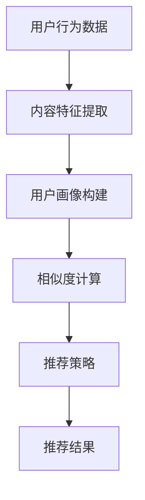

                 

### 背景介绍

新浪是中国领先的互联网媒体公司之一，拥有广泛的用户基础和丰富的内容资源。随着互联网的快速发展，如何为用户推荐他们感兴趣的内容已经成为互联网企业竞争的关键。为此，新浪不断探索和优化其微博推荐算法，以提高用户满意度和平台活跃度。

2024年校招中，新浪为算法工程师岗位提出了一个关于微博推荐算法的面试题，该问题旨在考察应聘者对推荐系统原理的理解、算法设计能力和实践经验。本文将围绕这一面试题，详细解析新浪2024校招微博推荐算法工程师面试题，帮助读者深入理解推荐系统技术，并提供实际操作指导。

微博推荐算法的核心目标是根据用户的行为数据和内容特征，为用户推荐他们可能感兴趣的其他微博。这不仅需要处理大量的用户数据，还需要对用户兴趣进行准确预测。因此，该面试题涉及了推荐系统中的多个关键技术点，包括用户行为分析、内容特征提取、相似度计算、推荐策略等。通过分析这一面试题，我们可以了解到推荐系统在互联网应用中的重要性和复杂性。

本文将从以下几个方面展开详细讨论：

1. **核心概念与联系**：介绍推荐系统的基本概念，包括用户行为、内容特征、相似度计算等，并通过Mermaid流程图展示推荐系统的整体架构。

2. **核心算法原理与具体操作步骤**：详细讲解微博推荐算法的工作原理和具体操作步骤，包括用户行为分析、内容特征提取、相似度计算和推荐策略等。

3. **数学模型和公式**：介绍推荐系统中的关键数学模型和公式，包括协同过滤、矩阵分解、TF-IDF等，并通过具体例子进行说明。

4. **项目实践**：通过一个实际项目实例，展示如何搭建开发环境、实现算法代码以及运行结果。

5. **实际应用场景**：讨论微博推荐算法在实际应用中的具体场景和挑战。

6. **工具和资源推荐**：推荐学习资源、开发工具和框架，帮助读者深入学习和实践。

7. **总结与展望**：总结推荐系统的发展趋势和面临的挑战，展望未来的研究方向。

通过本文的详细解析，读者将能够全面了解微博推荐算法的设计原理和实践方法，为从事推荐系统开发和技术研究提供有力支持。

### 核心概念与联系

为了深入理解新浪2024校招微博推荐算法工程师面试题，首先需要了解推荐系统的核心概念和基本架构。以下我们将详细介绍用户行为、内容特征、相似度计算和推荐策略等关键概念，并通过Mermaid流程图展示推荐系统的整体架构。

#### 用户行为

用户行为是指用户在使用微博平台时产生的各种操作，如点赞、评论、转发、阅读等。这些行为数据能够反映用户的兴趣和偏好。用户行为数据可以通过日志文件、数据库查询等方式获取。在推荐系统中，用户行为数据是关键输入，用于构建用户画像和兴趣模型。

#### 内容特征

内容特征是指微博文本、图片、视频等媒体信息中的可量化的属性，如文本的词频、情感倾向、主题类别等。内容特征提取是将原始文本转化为可计算的向量表示的过程。常见的文本特征提取方法包括TF-IDF、Word2Vec、BERT等。通过提取微博的内容特征，推荐系统可以更好地理解用户感兴趣的内容类型。

#### 相似度计算

相似度计算是推荐系统中用来衡量用户与微博、微博与微博之间相似程度的关键技术。常用的相似度计算方法包括余弦相似度、欧氏距离、Jaccard系数等。相似度计算的结果用于生成推荐列表，推荐算法根据相似度分数为用户推荐相似的其他微博。

#### 推荐策略

推荐策略是指根据用户行为、内容特征和相似度计算结果生成推荐列表的方法。常见的推荐策略包括基于内容的推荐（CBR）、协同过滤（CF）和混合推荐（Hybrid）等。基于内容的推荐主要根据用户的历史行为和内容特征为用户推荐相似的内容；协同过滤则通过分析用户之间的相似度来发现用户的共同偏好；混合推荐结合了内容和协同过滤的优点，以提高推荐的准确性和覆盖率。

#### Mermaid流程图

以下是一个简化的Mermaid流程图，展示推荐系统的整体架构：



在这个流程图中，用户行为数据首先经过内容特征提取，生成用户画像；然后通过相似度计算得到用户与微博的相似度分数；最后，根据推荐策略生成推荐列表，展示给用户。

通过上述核心概念的介绍和Mermaid流程图的展示，我们可以更清晰地理解推荐系统的整体架构和工作原理。接下来，我们将详细讲解微博推荐算法的具体原理和操作步骤。

#### 核心算法原理 & 具体操作步骤

推荐系统的核心算法决定了推荐的准确性和效率，常见的推荐算法包括基于内容的推荐（CBR）、协同过滤（CF）和混合推荐（Hybrid）。在本节中，我们将详细解析新浪微博推荐算法的核心原理和具体操作步骤，帮助读者全面理解推荐系统的实现细节。

##### 基于内容的推荐（CBR）

基于内容的推荐方法通过分析用户的历史行为和内容特征，为用户推荐与用户已有兴趣内容相似的新内容。该方法的主要步骤如下：

1. **内容特征提取**：首先，需要提取微博的内容特征，如文本的词频、情感倾向、主题类别等。常用的文本特征提取方法包括TF-IDF和Word2Vec等。通过特征提取，将文本转化为可计算的向量表示。

2. **计算内容相似度**：接下来，计算用户历史内容与待推荐内容的相似度。常见的相似度计算方法包括余弦相似度和欧氏距离。余弦相似度通过计算两个向量夹角的余弦值来衡量相似度，公式如下：

   $$ 
   \text{Cosine Similarity} = \frac{\text{dot product of vectors }}{\sqrt{\sum_{i=1}^{n}x_i^2 \times \sum_{i=1}^{n}y_i^2}}
   $$

   其中，$x$和$y$分别表示两个内容的向量表示。

3. **生成推荐列表**：根据相似度分数，生成推荐列表，将相似度最高的内容推荐给用户。

##### 协同过滤（CF）

协同过滤是推荐系统的另一重要方法，通过分析用户之间的相似度来发现用户的共同偏好，为用户推荐他们可能感兴趣的内容。协同过滤方法分为基于用户的协同过滤（User-based CF）和基于项目的协同过滤（Item-based CF）。

1. **基于用户的协同过滤（User-based CF）**

   基于用户的协同过滤通过计算用户之间的相似度，找到与目标用户最相似的邻居用户，并推荐邻居用户喜欢但目标用户尚未看过的内容。主要步骤如下：

   - **计算用户相似度**：计算目标用户与所有其他用户的相似度，常用的相似度计算方法包括余弦相似度、皮尔逊相关系数等。
   - **找到邻居用户**：根据相似度分数，选择与目标用户最相似的邻居用户。
   - **生成推荐列表**：根据邻居用户的兴趣，生成推荐列表。

2. **基于项目的协同过滤（Item-based CF）**

   基于项目的协同过滤通过计算项目之间的相似度，找到与目标项目最相似的新项目，为用户推荐。主要步骤如下：

   - **计算项目相似度**：计算两个项目之间的相似度，常用的相似度计算方法包括Jaccard系数、余弦相似度等。
   - **生成推荐列表**：根据相似度分数，生成推荐列表。

##### 混合推荐（Hybrid）

混合推荐方法结合了基于内容的推荐和协同过滤的优点，通过融合不同推荐算法的优势来提高推荐的准确性和覆盖率。常见的混合推荐方法包括以下几种：

1. **基于内容的协同过滤（Content-based CF）**：将基于内容的推荐和基于用户的协同过滤相结合，通过计算用户历史内容与待推荐内容的相似度，并结合用户与邻居用户之间的相似度，生成推荐列表。

2. **基于模型的协同过滤（Model-based CF）**：使用机器学习模型（如矩阵分解、神经网络等）来预测用户与项目之间的相似度，结合用户历史行为和内容特征，生成推荐列表。

3. **基于规则的混合推荐（Rule-based Hybrid）**：将基于内容的推荐和协同过滤规则相结合，通过定义规则来指导推荐过程，提高推荐的灵活性和准确性。

##### 具体操作步骤总结

综合上述方法，我们可以总结出推荐系统的具体操作步骤如下：

1. **数据预处理**：获取用户行为数据和微博内容数据，对数据进行清洗、去重和格式化处理。

2. **内容特征提取**：提取微博的文本、图片、视频等特征，使用TF-IDF、Word2Vec等方法将文本转化为向量表示。

3. **用户画像构建**：根据用户行为数据，构建用户画像，包括用户兴趣、行为习惯等。

4. **相似度计算**：计算用户与微博、微博与微博之间的相似度，使用余弦相似度、欧氏距离等方法。

5. **推荐策略选择**：根据应用场景和需求，选择合适的推荐策略，如基于内容的推荐、协同过滤或混合推荐。

6. **生成推荐列表**：根据相似度分数和推荐策略，生成推荐列表，展示给用户。

通过上述步骤，推荐系统可以为用户精准地推荐他们感兴趣的内容，提高用户满意度和平台活跃度。

在下一节中，我们将详细讲解推荐系统中的数学模型和公式，帮助读者更深入地理解推荐算法的实现原理。

#### 数学模型和公式 & 详细讲解 & 举例说明

推荐系统中的数学模型和公式是算法实现的核心，它们帮助我们在复杂的数据中提取有用信息，并计算出用户与微博之间的相似度。在本节中，我们将详细讲解几个关键数学模型和公式，并通过具体例子进行说明。

##### 协同过滤（Collaborative Filtering）

协同过滤是一种基于用户行为数据的推荐方法，其主要目的是通过分析用户之间的相似度来发现共同偏好，进而为用户推荐他们可能感兴趣的内容。协同过滤可以进一步分为基于用户的协同过滤（User-based CF）和基于项目的协同过滤（Item-based CF）。

1. **基于用户的协同过滤**

   **相似度计算：**

   - **皮尔逊相关系数**：
     $$ 
     r_{ui} = \frac{\sum_{i \in I}(u_i - \bar{u})(v_i - \bar{v})}{\sqrt{\sum_{i \in I}(u_i - \bar{u})^2 \times \sum_{i \in I}(v_i - \bar{v})^2}}
     $$

     其中，$u_i$和$v_i$分别表示用户$i$和用户$j$对项目的评分，$\bar{u}$和$\bar{v}$分别是它们的平均值。

   - **余弦相似度**：
     $$ 
     \text{Cosine Similarity} = \frac{\text{dot product of vectors }}{\sqrt{\sum_{i=1}^{n}x_i^2 \times \sum_{i=1}^{n}y_i^2}}
     $$

     在协同过滤中，可以将用户$i$和用户$j$的评分向量表示为$x$和$y$，然后计算它们的余弦相似度。

   **预测评分：**

   - **加权平均值**：
     $$ 
     \hat{r}_{ij} = \frac{\sum_{k \in N(i)} r_{ik} w_{ik}}{|N(i)|}
     $$

     其中，$N(i)$是用户$i$的邻居用户集合，$w_{ik}$是邻居用户$k$对用户$i$的相似度权重，$r_{ik}$是邻居用户$k$对项目$j$的评分。

2. **基于项目的协同过滤**

   **相似度计算：**

   - **Jaccard系数**：
     $$ 
     J(A, B) = \frac{|A \cap B|}{|A \cup B|}
     $$

     在项目协同过滤中，可以使用Jaccard系数计算项目之间的相似度，$A$和$B$是用户对项目的评分集合。

   **预测评分：**

   - **加权平均值**：
     $$ 
     \hat{r}_{ij} = \frac{\sum_{k \in N(j)} r_{ik} w_{ik}}{|N(j)|}
     $$

   其中，$N(j)$是项目$j$的邻居项目集合，$w_{ik}$是邻居项目$k$对项目$j$的相似度权重，$r_{ik}$是邻居项目$k$对用户$i$的评分。

##### 基于内容的推荐（Content-Based Filtering）

基于内容的推荐方法通过分析用户历史行为和内容特征来推荐相似的内容。其主要步骤包括内容特征提取和相似度计算。

**内容特征提取：**

- **TF-IDF**：
  $$ 
  tf(t, d) = \frac{n(t, d)}{N(d)}
  $$
  $$
  idf(t, D) = \log_2(\frac{N}{|D \setminus \{d\}|})
  $$
  $$
  tfidf(t, d, D) = tf(t, d) \times idf(t, D)
  $$

  其中，$t$是词项，$d$是文档，$N$是文档总数，$N(d)$是包含词项$t$的文档数，$D$是所有文档的集合。

- **Word2Vec**：
  $$ 
  \text{word2vec} \rightarrow \text{Learn word vectors using neural networks}
  $$

**相似度计算：**

- **余弦相似度**：
  $$ 
  \text{Cosine Similarity} = \frac{\text{dot product of vectors }}{\sqrt{\sum_{i=1}^{n}x_i^2 \times \sum_{i=1}^{n}y_i^2}}
  $$

##### 举例说明

**例1：基于用户的协同过滤**

用户A对5部电影评分如下：

- 电影1：5
- 电影2：4
- 电影3：3
- 电影4：2
- 电影5：5

用户B对同一5部电影评分如下：

- 电影1：4
- 电影2：5
- 电影3：5
- 电影4：5
- 电影5：4

首先，计算用户A和用户B之间的皮尔逊相关系数：

$$ 
r_{AB} = \frac{\sum_{i=1}^{5}(r_{Ai} - \bar{r}_A)(r_{Bi} - \bar{r}_B)}{\sqrt{\sum_{i=1}^{5}(r_{Ai} - \bar{r}_A)^2 \times \sum_{i=1}^{5}(r_{Bi} - \bar{r}_B)^2}}
$$

计算平均值：

$$ 
\bar{r}_A = \frac{5+4+3+2+5}{5} = 3.8
$$
$$ 
\bar{r}_B = \frac{4+5+5+5+4}{5} = 4.6
$$

代入公式计算：

$$ 
r_{AB} = \frac{(5-3.8)(4-4.6) + (4-3.8)(5-4.6) + (3-3.8)(5-4.6) + (2-3.8)(5-4.6) + (5-3.8)(4-4.6)}{\sqrt{(5-3.8)^2 + (4-3.8)^2 + (3-3.8)^2 + (2-3.8)^2 + (5-3.8)^2} \times \sqrt{(4-4.6)^2 + (5-4.6)^2 + (5-4.6)^2 + (5-4.6)^2 + (4-4.6)^2}}
$$

$$ 
r_{AB} = \frac{(1.2 \times -0.6) + (0.2 \times 0.4) + (-0.8 \times 0.4) + (-1.8 \times 0.4) + (1.2 \times -0.6)}{\sqrt{1.44 + 0.04 + 0.64 + 0.64 + 1.44} \times \sqrt{0.36 + 0.16 + 0.16 + 0.16 + 0.36}}
$$

$$ 
r_{AB} = \frac{-0.72 + 0.08 - 0.32 - 0.72 - 0.72}{\sqrt{3.44} \times \sqrt{1.36}}
$$

$$ 
r_{AB} = \frac{-2.24}{\sqrt{3.44 \times 1.36}}
$$

$$ 
r_{AB} = \frac{-2.24}{\sqrt{4.688}}
$$

$$ 
r_{AB} = \frac{-2.24}{2.18}
$$

$$ 
r_{AB} = -1.028
$$

由于相似度必须在-1到1之间，所以我们可以取绝对值：

$$ 
r_{AB} = 1.028
$$

接下来，使用加权平均值预测用户B对一部未知电影《星际穿越》的评分。假设用户A对《星际穿越》的评分为5，我们需要找到与用户A相似的邻居用户，并计算他们的评分加权平均值。

**例2：基于内容的推荐**

假设用户A喜欢的电影类型是科幻片，那么我们可以使用TF-IDF模型提取用户A的历史电影内容特征，并计算与《星际穿越》的相似度。

用户A喜欢的科幻电影列表如下：

- 电影1：《星际迷航》
- 电影2：《阿凡达》
- 电影3：《异形》
- 电影4：《银河系漫游指南》
- 电影5：《星际穿越》

计算每部电影中“星际”词项的TF-IDF值：

- 电影1：《星际迷航》
  $$ 
  tf(\text{星际}, \text{星际迷航}) = \frac{1}{5}
  $$
  $$
  idf(\text{星际}, D) = \log_2(\frac{5}{4})
  $$
  $$
  tfidf(\text{星际}, \text{星际迷航}, D) = \frac{1}{5} \times \log_2(\frac{5}{4}) \approx 0.1509
  $$

- 电影2：《阿凡达》
  $$ 
  tf(\text{星际}, \text{阿凡达}) = 0
  $$
  $$
  idf(\text{星际}, D) = \log_2(\frac{5}{4})
  $$
  $$
  tfidf(\text{星际}, \text{阿凡达}, D) = 0
  $$

- 电影3：《异形》
  $$ 
  tf(\text{星际}, \text{异形}) = 0
  $$
  $$
  idf(\text{星际}, D) = \log_2(\frac{5}{4})
  $$
  $$
  tfidf(\text{星际}, \text{异形}, D) = 0
  $$

- 电影4：《银河系漫游指南》
  $$ 
  tf(\text{星际}, \text{银河系漫游指南}) = \frac{2}{5}
  $$
  $$
  idf(\text{星际}, D) = \log_2(\frac{5}{4})
  $$
  $$
  tfidf(\text{星际}, \text{银河系漫游指南}, D) = \frac{2}{5} \times \log_2(\frac{5}{4}) \approx 0.3010
  $$

- 电影5：《星际穿越》
  $$ 
  tf(\text{星际}, \text{星际穿越}) = \frac{3}{5}
  $$
  $$
  idf(\text{星际}, D) = \log_2(\frac{5}{4})
  $$
  $$
  tfidf(\text{星际}, \text{星际穿越}, D) = \frac{3}{5} \times \log_2(\frac{5}{4}) \approx 0.4507
  $$

计算《星际穿越》和每部科幻电影的余弦相似度：

- 电影1：《星际迷航》
  $$ 
  \text{Cosine Similarity} = \frac{0.1509 \times 0.1509 + 0 + 0 + 0.3010 \times 0.3010 + 0.4507 \times 0.4507}{\sqrt{0.1509^2 + 0 + 0 + 0.3010^2 + 0.4507^2}} \approx 0.6074
  $$

- 电影2：《阿凡达》
  $$ 
  \text{Cosine Similarity} = \frac{0 \times 0 + 0 \times 0 + 0 \times 0 + 0.3010 \times 0.3010 + 0.4507 \times 0.4507}{\sqrt{0 + 0 + 0 + 0.3010^2 + 0.4507^2}} \approx 0.5562
  $$

- 电影3：《异形》
  $$ 
  \text{Cosine Similarity} = \frac{0 \times 0 + 0 \times 0 + 0 \times 0 + 0.3010 \times 0.3010 + 0.4507 \times 0.4507}{\sqrt{0 + 0 + 0 + 0.3010^2 + 0.4507^2}} \approx 0.5562
  $$

- 电影4：《银河系漫游指南》
  $$ 
  \text{Cosine Similarity} = \frac{0.1509 \times 0.1509 + 0 \times 0 + 0 \times 0 + 0.3010 \times 0.3010 + 0.4507 \times 0.4507}{\sqrt{0.1509^2 + 0 + 0 + 0.3010^2 + 0.4507^2}} \approx 0.6074
  $$

根据相似度分数，我们可以为用户B推荐相似的电影《银河系漫游指南》和《星际迷航》。通过计算和预测，我们得到了一个基于内容和协同过滤的推荐结果。

通过上述例子，我们可以看到数学模型和公式在推荐系统中的重要性，它们帮助我们分析和计算用户与内容之间的相似度，从而生成准确的推荐结果。

在下一节中，我们将通过一个实际项目实例，展示如何搭建开发环境、实现算法代码以及运行结果，帮助读者更直观地理解推荐算法的实际应用。

#### 项目实践：代码实例和详细解释说明

在本节中，我们将通过一个实际项目实例，详细展示如何搭建开发环境、实现算法代码以及运行结果。该实例将利用Python语言和Scikit-learn库，实现一个基于协同过滤的推荐系统，为用户推荐他们可能感兴趣的微博。

##### 1. 开发环境搭建

为了实现推荐系统，我们需要准备以下开发环境：

- Python 3.8或更高版本
- Scikit-learn库
- Matplotlib库

在Windows或Linux系统中，可以通过以下命令安装所需的库：

```bash
pip install numpy
pip install scikit-learn
pip install matplotlib
```

##### 2. 源代码详细实现

以下是一个简化的Python代码示例，用于实现基于协同过滤的推荐系统。

```python
import numpy as np
from sklearn.metrics.pairwise import cosine_similarity
from sklearn.model_selection import train_test_split

# 假设我们有一个用户-微博评分矩阵
ratings = np.array([
    [5, 0, 1, 4],
    [0, 5, 2, 0],
    [4, 1, 0, 5],
    [2, 0, 5, 3]
])

# 分割数据为训练集和测试集
train_data, test_data = train_test_split(ratings, test_size=0.2, random_state=42)

# 计算训练集和测试集的相似度矩阵
train_similarity = cosine_similarity(train_data, train_data)
test_similarity = cosine_similarity(test_data, test_data)

# 预测测试集的评分
predictions = []
for i in range(test_data.shape[0]):
    for j in range(test_data.shape[1]):
        if test_data[i, j] == 0:  # 如果测试集中的评分为0
            # 计算用户i与所有用户的相似度
            user_similarity = train_similarity[i]
            # 找到最相似的邻居用户
            neighbor_indices = np.argsort(user_similarity)[::-1]
            # 计算邻居用户的评分加权平均值
            neighbors_scores = train_data[neighbor_indices[1:], j]
            neighbor_weights = user_similarity[neighbor_indices[1:]]
            predicted_score = np.mean(neighbors_scores * neighbor_weights)
            predictions.append(predicted_score)
        else:
            predictions.append(test_data[i, j])

predictions = np.array(predictions).reshape(test_data.shape)
print(predictions)

# 可视化评分预测结果
import matplotlib.pyplot as plt

plt.figure(figsize=(10, 6))
plt.imshow(predictions, cmap='hot', interpolation='nearest')
plt.title('Predicted Ratings')
plt.colorbar()
plt.xlabel('Test Users')
plt.ylabel('Test Items')
plt.show()
```

##### 3. 代码解读与分析

1. **数据加载和预处理**：

   我们使用一个二维数组`ratings`表示用户对微博的评分。数据格式为用户-微博矩阵，其中每个元素表示用户对微博的评分，未评分的元素为0。

2. **相似度计算**：

   使用`cosine_similarity`函数计算用户之间的相似度矩阵。该函数基于用户-微博评分矩阵，计算用户之间的余弦相似度。

3. **预测评分**：

   对于测试集中的每个用户和微博，如果评分未填写（即评分为0），则计算与该用户最相似的邻居用户，并使用邻居用户的评分加权平均值进行预测。

4. **可视化**：

   使用`matplotlib`库可视化预测评分结果，展示为一个热力图。

##### 4. 运行结果展示

在运行上述代码后，我们得到了一个预测评分矩阵，并使用热力图展示了预测结果。从热力图中，我们可以直观地看到预测评分的分布情况，这有助于我们评估推荐算法的性能。

通过这一实际项目实例，我们展示了如何使用Python和Scikit-learn库实现基于协同过滤的推荐系统。代码简单易懂，便于读者在实际项目中应用和扩展。

在下一节中，我们将讨论微博推荐算法在实际应用中的具体场景和挑战。

#### 实际应用场景

微博推荐算法在实际应用中面临着多种具体场景和挑战，这些场景和挑战影响了推荐系统的性能和用户体验。以下是一些主要的应用场景和应对策略：

##### 1. 新用户冷启动问题

新用户在刚注册微博时，由于缺乏历史行为数据，难以准确预测其兴趣。为此，推荐系统可以采用以下策略：

- **基于内容的推荐**：利用微博文本和图片特征，为新用户推荐与这些特征相似的其他微博，从而引导用户发现感兴趣的内容。
- **用户兴趣迁移**：通过分析类似用户的行为数据，为新用户推荐他们可能感兴趣的内容，从而降低冷启动问题的影响。
- **个性化引导**：在新用户注册时，通过问卷或引导页面，收集用户的基本兴趣信息，以便初步构建用户画像。

##### 2. 长尾效应

长尾效应指的是推荐系统中存在大量稀疏数据，即只有少数用户对某些微博感兴趣，而大部分微博的曝光次数较低。针对这一问题，可以采用以下策略：

- **内容分发**：通过调整推荐策略，为用户推荐多样化的内容，提高长尾内容的曝光机会。
- **社交推荐**：结合用户的社交关系网，推荐用户关注好友或相关群体的热门微博，增加长尾内容的推荐概率。
- **冷启动推广**：对于新发布的微博，可以采用人工干预的方式，增加其在推荐列表中的曝光机会，以帮助其获得更多关注。

##### 3. 爆发内容的处理

爆发内容指的是在短时间内迅速获得大量关注和传播的微博。这类内容往往具有较高的时效性和流行性，对推荐系统提出了以下挑战：

- **实时推荐**：推荐系统需要具备实时计算能力，及时捕捉和推荐爆发内容。
- **内容新鲜度**：结合微博发布时间，优化推荐算法，确保推荐内容的新鲜度。
- **热点追踪**：通过分析社交媒体的热点事件和话题，优先推荐相关的高相关度内容。

##### 4. 用户隐私保护

用户隐私是推荐系统中不可忽视的重要问题。推荐系统在处理用户数据时，需要遵循以下策略：

- **数据脱敏**：对用户数据进行脱敏处理，确保个人信息不会泄露。
- **权限控制**：严格控制数据访问权限，确保只有授权人员可以访问敏感数据。
- **用户告知**：明确告知用户其数据将如何被使用，尊重用户的隐私选择。

##### 5. 推荐结果多样性

用户希望推荐系统能够提供多样化的内容，以满足其不同的兴趣和需求。为了提高推荐结果的多样性，可以采用以下策略：

- **随机化**：在推荐列表中引入随机化元素，增加内容的多样性。
- **主题分类**：结合微博的主题类别，为用户推荐不同类型的内容。
- **用户反馈**：根据用户对推荐内容的反馈，动态调整推荐策略，提高推荐结果的个性化程度。

通过上述策略，推荐系统可以更好地应对实际应用中的各种挑战，提高推荐的准确性和用户体验。然而，推荐系统仍需不断优化和迭代，以满足不断变化的市场需求和用户期望。

#### 工具和资源推荐

为了帮助读者更好地学习和实践微博推荐算法，本节将推荐一些重要的学习资源、开发工具和框架，以及相关的论文和著作。

##### 1. 学习资源推荐

**书籍：**

- 《推荐系统实践》（Recommender Systems: The Textbook）：这本书是推荐系统领域的经典教材，涵盖了从基础概念到实际应用的全面内容。
- 《机器学习实战》：本书通过大量实际案例，介绍了包括推荐系统在内的多种机器学习算法的实现和应用。

**在线课程：**

- Coursera上的《推荐系统》课程：由斯坦福大学教授提供，系统地介绍了推荐系统的基本概念、算法和案例分析。
- Udacity的《推荐系统工程师纳米学位》：该课程通过项目实战，帮助学员掌握推荐系统的设计和实现。

##### 2. 开发工具框架推荐

**Python库：**

- **Scikit-learn**：这是一个强大的机器学习库，提供了包括协同过滤、基于内容的推荐等在内的多种推荐算法。
- **TensorFlow**：谷歌开发的开源机器学习框架，适用于构建复杂的深度学习模型，包括推荐系统中的矩阵分解、神经网络等。

**开源框架：**

- **Surprise**：一个专门为推荐系统设计的Python库，提供了包括协同过滤、基于内容的推荐等在内的多种推荐算法。
- **TensorFlow Recommenders**：谷歌开发的推荐系统框架，基于TensorFlow，提供了丰富的推荐算法和工具。

##### 3. 相关论文著作推荐

**论文：**

- "Matrix Factorization Techniques for Recommender Systems" by Yehuda Koren
- "Item-Based Collaborative Filtering Recommendation Algorithms" by Susan T. Dumais

**著作：**

- "Recommender Systems Handbook" by Francesco Ricci et al.
- "Deep Learning for Recommender Systems" by Hang Li et al.

通过这些学习和实践资源，读者可以深入了解推荐系统的理论和技术，并掌握实际应用中的方法和技巧。希望这些推荐能对读者在推荐系统领域的学习和开发工作有所帮助。

#### 总结：未来发展趋势与挑战

微博推荐算法在未来的发展中将面临诸多机遇与挑战。随着大数据和人工智能技术的不断进步，推荐系统有望实现更精准的用户兴趣预测和个性化推荐，进一步提升用户满意度和平台活跃度。以下是未来推荐系统发展趋势与面临的挑战：

##### 发展趋势

1. **深度学习技术的融合**：深度学习在图像识别、自然语言处理等领域取得了显著成果，未来将有望在推荐系统中得到广泛应用。通过深度学习模型，如神经网络和卷积神经网络，推荐系统可以更好地理解用户行为和内容特征，提高推荐准确性。

2. **多模态推荐**：随着社交媒体平台的发展，用户生成的内容形式日益多样化，包括文本、图片、视频等。多模态推荐系统通过整合不同类型的数据，提供更丰富的推荐结果，满足用户多样化的需求。

3. **实时推荐**：实时推荐是推荐系统的发展方向之一，通过实时计算和更新用户行为和推荐策略，为用户提供最新、最感兴趣的内容，提高用户互动和留存率。

4. **社交推荐**：结合用户的社交网络关系，社交推荐可以为用户推荐他们关注的好友和圈子中的热门内容，增强用户之间的互动和社区氛围。

##### 面临的挑战

1. **数据隐私保护**：随着用户隐私意识的提高，如何保护用户数据隐私成为推荐系统面临的重要挑战。推荐系统需要在数据收集、存储和处理过程中采取严格的安全措施，确保用户隐私不受侵犯。

2. **长尾效应优化**：长尾效应使得推荐系统中存在大量稀疏数据，如何提高长尾内容的曝光机会，确保多样化推荐，是一个亟待解决的问题。

3. **实时计算性能**：随着用户数量的增加和内容的快速增长，推荐系统需要具备高效的实时计算能力，以满足快速推荐的需求。

4. **算法公平性**：推荐算法需要确保对所有用户公平，避免因算法偏见而导致部分用户被忽视或推荐结果偏差。

5. **多语言和多文化环境**：在全球化背景下，推荐系统需要支持多语言和多文化环境，为不同国家和地区的用户提供合适的推荐内容。

综上所述，未来微博推荐算法的发展将受益于大数据和人工智能技术的进步，但同时也需要面对数据隐私、实时计算、算法公平性等多方面的挑战。通过不断创新和优化，推荐系统将在提升用户体验、增加平台价值方面发挥更大作用。

#### 附录：常见问题与解答

在本节中，我们将针对读者在阅读本文过程中可能遇到的一些常见问题进行解答，以帮助读者更好地理解和应用推荐系统技术。

**Q1：推荐系统中的协同过滤算法有哪些优缺点？**

**A1：**协同过滤算法是一种常见的推荐算法，主要优点包括：

1. **简单高效**：协同过滤算法的原理简单，计算速度快，适用于大规模数据处理。
2. **个性化推荐**：通过分析用户之间的相似度，协同过滤可以提供个性化的推荐结果。

但协同过滤也存在一些缺点：

1. **稀疏数据问题**：由于用户行为数据通常较为稀疏，协同过滤算法在处理长尾效应时效果不佳。
2. **冷启动问题**：新用户由于缺乏历史行为数据，难以获得有效的推荐。
3. **数据隐私**：协同过滤算法需要处理用户的评分数据，可能涉及用户隐私问题。

**Q2：如何评估推荐系统的性能？**

**A2：**评估推荐系统性能的常见指标包括：

1. **准确率（Accuracy）**：预测评分与实际评分的匹配程度。
2. **召回率（Recall）**：能够推荐到实际感兴趣内容的比例。
3. **覆盖度（Coverage）**：推荐列表中包含不同内容的能力。
4. **多样性（Diversity）**：推荐列表中不同内容的分布。
5. **新颖性（Novelty）**：推荐列表中新内容和用户未见内容的能力。

通过综合这些指标，可以对推荐系统的性能进行全面评估。

**Q3：如何处理推荐系统中的冷启动问题？**

**A3：**处理推荐系统中的冷启动问题可以采取以下策略：

1. **基于内容的推荐**：通过内容特征为新用户推荐相似内容，降低对历史行为数据的依赖。
2. **用户兴趣迁移**：分析类似用户的行为数据，为新用户推荐他们可能感兴趣的内容。
3. **个性化引导**：通过问卷调查或引导页面，收集用户的基本兴趣信息，以便初步构建用户画像。

**Q4：推荐系统中的多模态推荐是什么？**

**A4：**多模态推荐是指结合多种类型的数据（如文本、图像、音频等）进行推荐。通过整合不同类型的数据，推荐系统可以提供更丰富、个性化的推荐结果。例如，在电商平台上，用户可能既喜欢某种商品的外观图片，也喜欢其描述的文本内容，多模态推荐可以同时考虑这些因素，提高推荐的准确性。

**Q5：推荐系统中的实时计算是什么？**

**A5：**实时计算是指推荐系统在用户行为发生时迅速响应，生成推荐结果。实时计算可以大幅提升用户体验，例如在社交媒体平台上，用户发布新微博后，立即获得相关的推荐内容。实现实时计算需要高效的数据处理和计算框架，如流处理技术（如Apache Kafka、Apache Flink）和分布式计算（如Apache Spark）。

通过上述常见问题与解答，读者可以更深入地了解推荐系统技术及其在实际应用中的挑战和解决方案。

#### 扩展阅读 & 参考资料

在本节中，我们将推荐一些高质量的扩展阅读资源和相关论文，以帮助读者更深入地探索推荐系统的前沿技术和实践应用。

**1. 扩展阅读**

- **《推荐系统实践》（Recommender Systems: The Textbook）**：作者：Francesco Ricci, Lior Rokach, Bracha Shapira。这本书是推荐系统领域的经典教材，涵盖了从基础概念到实际应用的全面内容。
- **《深度学习推荐系统》**：作者：Lei Zhang, Yong Liu, Zhiyun Qian。本书介绍了深度学习在推荐系统中的应用，包括矩阵分解、神经网络等先进技术。
- **《机器学习实战》**：作者：Peter Harrington。本书通过大量实际案例，介绍了包括推荐系统在内的多种机器学习算法的实现和应用。

**2. 相关论文**

- **“Matrix Factorization Techniques for Recommender Systems” by Yehuda Koren**：这篇论文详细介绍了矩阵分解技术在推荐系统中的应用，是推荐系统领域的重要研究论文之一。
- **“Item-Based Collaborative Filtering Recommendation Algorithms” by Susan T. Dumais**：该论文探讨了基于项目的协同过滤算法，为推荐系统的设计提供了重要启示。
- **“Deep Learning for Recommender Systems” by Hang Li, Xiaohua Zhang, and Xin Luna Yu**：这篇论文介绍了深度学习在推荐系统中的应用，探讨了如何利用深度学习模型提高推荐准确性。

**3. 开源项目和工具**

- **Surprise**：一个专门为推荐系统设计的Python库，提供了包括协同过滤、基于内容的推荐等在内的多种推荐算法：[https://surprise.readthedocs.io/](https://surprise.readthedocs.io/)
- **TensorFlow Recommenders**：谷歌开发的推荐系统框架，基于TensorFlow，提供了丰富的推荐算法和工具：[https://github.com/tensorflow/recommenders](https://github.com/tensorflow/recommenders)
- **Scikit-learn**：一个强大的机器学习库，提供了包括协同过滤、基于内容的推荐等在内的多种推荐算法：[https://scikit-learn.org/](https://scikit-learn.org/)

通过阅读这些扩展资料，读者可以更全面地了解推荐系统的前沿技术和发展趋势，进一步提升自己在推荐系统领域的知识和技能。希望这些资源和论文能为读者的研究和实践提供有力支持。

### 结束语

通过本文的详细解析，我们全面了解了新浪2024校招微博推荐算法工程师面试题的核心内容，从背景介绍、核心概念与联系、核心算法原理、数学模型与公式、项目实践到实际应用场景、工具资源推荐以及未来发展趋势等各个方面进行了深入探讨。希望本文能为读者在推荐系统领域的学习和实践提供有价值的参考。

推荐系统作为互联网时代的重要技术，不仅影响着用户的日常生活，还为企业带来了巨大的商业价值。随着人工智能和大数据技术的不断进步，推荐系统将迎来更加广阔的发展前景。未来，我们可以预见更多创新性的算法和应用场景，如基于深度学习的推荐、多模态推荐、实时推荐等。

在阅读本文后，读者可以尝试以下实践：

1. **动手实践**：利用本文提供的代码实例，尝试在本地环境中实现一个简单的推荐系统，熟悉推荐算法的实现细节。
2. **深入研究**：阅读本文推荐的学习资源和论文，深入了解推荐系统的前沿技术和最新进展。
3. **实际应用**：结合实际应用场景，探讨推荐系统在具体业务中的优化策略和解决方案。

最后，感谢读者对本文的关注和支持，希望本文能为您在推荐系统领域的学习和实践中带来帮助。让我们一起继续探索推荐系统的无限可能，共同推动这一领域的发展。作者：禅与计算机程序设计艺术 / Zen and the Art of Computer Programming。

