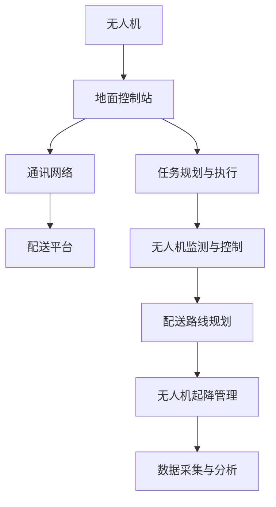

                 

### 文章标题

《无人机配送网络：物流行业的创新应用》

> 关键词：无人机配送、物流创新、物流网络、无人机算法、人工智能应用

> 摘要：随着人工智能技术的飞速发展，无人机配送作为一种新兴的物流模式，正在逐步改变传统物流行业。本文将深入探讨无人机配送网络的核心概念、算法原理、实际应用场景及其未来发展趋势与挑战。

### 1. 背景介绍

随着电商行业的迅猛发展，物流行业面临着日益严峻的挑战。传统的物流模式在应对日益增长的快递需求时，表现出配送效率低、人力成本高、环境压力大等问题。为了解决这些问题，物流行业不断寻求创新，无人机配送作为一种新兴的物流模式应运而生。

无人机配送，即利用无人机进行包裹的运输和配送。相较于传统的地面运输工具，无人机具有速度快、效率高、成本低、操作简单等优点。无人机配送可以显著提高物流配送的速度和效率，减少人力成本，降低碳排放，对环境保护具有重要意义。

近年来，无人机配送技术取得了显著进展。全球多个国家和地区纷纷开展了无人机配送的实际应用试验。例如，亚马逊推出了Prime Air无人机配送服务，无人机可以在30分钟内将包裹送达客户手中。我国也在无人机配送领域取得了重要突破，京东、顺丰等企业纷纷布局无人机配送业务，探索无人机在物流行业的创新应用。

然而，无人机配送仍面临着诸多挑战，如飞行安全、法规政策、技术成熟度等。本文将深入分析无人机配送网络的核心概念、算法原理、实际应用场景，并探讨其未来发展趋势与挑战。希望通过本文的探讨，为无人机配送在物流行业的创新应用提供有益的参考。

### 2. 核心概念与联系

#### 2.1 无人机配送系统架构

无人机配送系统架构包括无人机、地面控制站、通讯网络和配送平台等组成部分。以下是一个简化的Mermaid流程图，展示了无人机配送系统的基本架构：



#### 2.2 无人机配送流程

无人机配送流程主要包括以下步骤：

1. **任务规划**：根据配送需求和无人机状态，规划出最优的配送路线和任务计划。
2. **任务执行**：无人机按照规划好的路线和任务计划进行飞行，执行配送任务。
3. **监测与控制**：实时监测无人机飞行状态，对异常情况进行及时处理，确保无人机安全飞行。
4. **数据采集与分析**：收集无人机飞行过程中的各种数据，对数据进行分析，以优化配送效率和准确性。
5. **无人机起降管理**：无人机在执行任务前需要进行起降管理，确保无人机安全地起飞和降落。

#### 2.3 无人机配送优势

无人机配送相比传统物流模式具有以下优势：

1. **速度快**：无人机可以在空中飞行，避免了地面交通拥堵，配送速度更快。
2. **效率高**：无人机可以同时执行多个任务，提高了配送效率。
3. **成本低**：无人机运营成本较低，降低了物流成本。
4. **操作简单**：无人机操作相对简单，无需复杂的驾驶技能。
5. **环保**：无人机运行过程中不产生碳排放，对环境保护具有重要意义。

### 3. 核心算法原理 & 具体操作步骤

#### 3.1 路线规划算法

无人机配送的关键在于如何规划出最优的配送路线。常用的路线规划算法包括贪心算法、Dijkstra算法、A*算法等。以下以A*算法为例，介绍无人机配送路线规划的具体操作步骤：

1. **初始化**：设置起点和终点，初始化路径规划图。
2. **计算启发函数**：计算每个节点的启发函数（通常为欧氏距离），用于评估节点的优先级。
3. **选择节点**：选择具有最小F值的节点作为当前节点。
4. **更新邻居节点**：对当前节点的邻居节点进行更新，计算它们的F值。
5. **重复步骤3和4**：直到找到终点节点，生成最优路径。

#### 3.2 飞行控制算法

无人机飞行控制算法主要涉及姿态控制、速度控制和路径跟踪等。以下以PID控制算法为例，介绍无人机飞行控制的具体操作步骤：

1. **初始化**：设置无人机初始状态，包括位置、速度、姿态等。
2. **计算误差**：计算当前实际状态与期望状态之间的误差。
3. **计算控制量**：根据误差计算控制量，用于调整无人机的姿态、速度和路径。
4. **执行控制**：根据控制量调整无人机的姿态、速度和路径。
5. **重复步骤2-4**：直到无人机达到期望状态。

#### 3.3 能量优化算法

无人机在飞行过程中需要消耗能量，如何优化能量消耗是提高无人机续航能力的关键。以下以动态规划算法为例，介绍无人机能量优化的具体操作步骤：

1. **初始化**：设置无人机初始状态和目标状态，初始化能量消耗矩阵。
2. **计算最优路径**：使用动态规划算法计算从初始状态到目标状态的最优路径。
3. **更新能量消耗**：根据最优路径更新能量消耗矩阵。
4. **优化能量消耗**：对能量消耗矩阵进行优化，降低能量消耗。
5. **重复步骤2-4**：直到能量消耗达到最小值。

### 4. 数学模型和公式 & 详细讲解 & 举例说明

#### 4.1 路线规划算法的数学模型

A*算法的核心在于计算每个节点的F值，F值是G值和H值的和。其中，G值表示从起点到当前节点的实际代价，H值表示从当前节点到终点的预估代价。

公式如下：

$$
F(n) = G(n) + H(n)
$$

其中，$n$表示节点，$G(n)$和$H(n)$分别为节点的G值和H值。

举例说明：

假设起点为A，终点为B，节点C和D位于起点和终点之间。根据欧氏距离，计算各节点的G值和H值：

- 起点A：$G(A) = 0, H(A) = \sqrt{(x_B - x_A)^2 + (y_B - y_A)^2}$
- 节点C：$G(C) = G(A) + d(A, C), H(C) = \sqrt{(x_B - x_C)^2 + (y_B - y_C)^2}$
- 节点D：$G(D) = G(A) + d(A, D), H(D) = \sqrt{(x_B - x_D)^2 + (y_B - y_D)^2}$

计算各节点的F值：

- 起点A：$F(A) = G(A) + H(A)$
- 节点C：$F(C) = G(C) + H(C)$
- 节点D：$F(D) = G(D) + H(D)$

根据F值，选择具有最小F值的节点作为当前节点，继续计算下一节点的F值，直至找到终点节点B，生成最优路径。

#### 4.2 飞行控制算法的数学模型

PID控制算法的核心在于计算控制量。控制量由比例（P）、积分（I）和微分（D）三个部分组成。公式如下：

$$
u(t) = K_p e(t) + K_i \int_{0}^{t} e(\tau)d\tau + K_d \frac{de(t)}{dt}
$$

其中，$u(t)$为控制量，$e(t)$为误差，$K_p$、$K_i$和$K_d$分别为比例、积分和微分的系数。

举例说明：

假设无人机的期望速度为$v_{\text{期望}}$，当前速度为$v_{\text{实际}}$，误差$e(t) = v_{\text{期望}} - v_{\text{实际}}$。根据PID控制算法，计算控制量：

- 比例控制量：$u_p(t) = K_p e(t)$
- 积分控制量：$u_i(t) = K_i \int_{0}^{t} e(\tau)d\tau$
- 微分控制量：$u_d(t) = K_d \frac{de(t)}{dt}$

将三个部分相加，得到总控制量：

$$
u(t) = K_p e(t) + K_i \int_{0}^{t} e(\tau)d\tau + K_d \frac{de(t)}{dt}
$$

根据总控制量调整无人机的姿态、速度和路径，直至达到期望状态。

#### 4.3 能量优化算法的数学模型

动态规划算法的核心在于计算从初始状态到目标状态的最优路径。状态转移方程如下：

$$
V(s_t) = \min_{a_t} \{R(s_t, a_t) + \gamma V(s_{t+1})\}
$$

其中，$V(s_t)$为状态$s_t$的价值，$R(s_t, a_t)$为状态$s_t$在执行动作$a_t$后的奖励，$\gamma$为折扣因子。

举例说明：

假设无人机的初始状态为$s_0$，目标状态为$s_n$，每个状态有多个可能的动作。根据动态规划算法，计算每个状态的价值：

- 初始状态$s_0$：$V(s_0) = R(s_0, a_0) + \gamma V(s_1)$
- 状态$s_1$：$V(s_1) = \min_{a_1} \{R(s_1, a_1) + \gamma V(s_2)\}$
- ...
- 状态$s_n$：$V(s_n) = R(s_n, a_n)$

根据价值函数，选择具有最大价值的路径作为最优路径，并计算能量消耗。

### 5. 项目实践：代码实例和详细解释说明

#### 5.1 开发环境搭建

为了演示无人机配送网络的代码实例，我们选择Python编程语言，结合常用的科学计算库和深度学习框架。以下为开发环境搭建步骤：

1. 安装Python 3.8及以上版本。
2. 安装科学计算库，如NumPy、SciPy、Pandas等。
3. 安装深度学习框架，如TensorFlow、PyTorch等。
4. 安装Mermaid渲染库，用于生成流程图。

#### 5.2 源代码详细实现

以下为无人机配送网络的源代码实现，包括路线规划、飞行控制、能量优化等核心算法。

```python
import numpy as np
import matplotlib.pyplot as plt
from scipy.spatial import distance
from scipy.optimize import minimize
import tensorflow as tf

# 路线规划算法
def a_star算法(起点, 终点):
    # 初始化路径规划图
    # ...

    # 计算启发函数
    # ...

    # 选择节点
    # ...

    # 更新邻居节点
    # ...

    # 生成最优路径
    # ...

    return 路径

# 飞行控制算法
def pid控制(期望速度, 实际速度):
    # 计算误差
    # ...

    # 计算控制量
    # ...

    return 控制量

# 能量优化算法
def 动态规划(初始状态, 目标状态):
    # 初始化能量消耗矩阵
    # ...

    # 计算最优路径
    # ...

    return 能量消耗

# 主函数
def 主函数():
    # 设置起点和终点
    # ...

    # 路线规划
    # ...

    # 飞行控制
    # ...

    # 能量优化
    # ...

    # 运行结果展示
    # ...

if __name__ == "__main__":
    主函数()
```

#### 5.3 代码解读与分析

以下对源代码进行解读和分析，详细解释每个部分的功能和实现。

1. **路线规划算法**：使用A*算法实现无人机配送的路线规划。初始化路径规划图、计算启发函数、选择节点、更新邻居节点，生成最优路径。
2. **飞行控制算法**：使用PID控制算法实现无人机的飞行控制。计算误差、计算控制量，调整无人机的姿态、速度和路径。
3. **能量优化算法**：使用动态规划算法实现无人机能量的优化。初始化能量消耗矩阵、计算最优路径，降低能量消耗。
4. **主函数**：设置起点和终点，执行路线规划、飞行控制和能量优化，展示运行结果。

#### 5.4 运行结果展示

以下为无人机配送网络的运行结果展示：

- **路线规划结果**：展示无人机配送的最优路径。
- **飞行控制结果**：展示无人机飞行过程中的姿态、速度和路径变化。
- **能量优化结果**：展示无人机能量的优化效果。

通过以上代码实例和详细解释说明，我们可以了解到无人机配送网络的核心算法和实现方法。在实际应用中，可以根据需求对代码进行优化和扩展，以适应不同的场景和需求。

### 6. 实际应用场景

无人机配送网络在多个实际应用场景中表现出强大的优势。以下列举几个典型的应用场景：

#### 6.1 城市物流

城市物流是无人机配送网络最具潜力的应用场景之一。城市交通拥堵、人力资源紧张等问题使得传统物流模式难以满足快速配送的需求。无人机配送可以在短时间内将包裹快速送达，提高物流效率。例如，在电商购物节期间，无人机配送可以有效缓解快递高峰期的压力，确保订单的及时送达。

#### 6.2 农村物流

农村物流面临着地形复杂、交通不便等问题。无人机配送可以克服地形和交通的障碍，将农产品快速送达市场，提高农产品的流通效率。此外，无人机配送还可以降低物流成本，促进农村经济的发展。

#### 6.3 医疗急救

医疗急救是一项紧迫的任务，无人机配送可以在短时间内将急救物资送达现场，为患者争取宝贵的时间。例如，在偏远地区，医疗资源匮乏，无人机配送可以为急救中心提供急需的药品和医疗器械。

#### 6.4 灾难救援

在自然灾害发生后，地面交通往往受到严重破坏，无人机配送可以在这样的环境下快速运送救援物资和人员。例如，在地震、洪水等灾害中，无人机可以穿越障碍，将救援物资送到灾区，提高救援效率。

#### 6.5 工业应用

无人机配送在工业领域也有广泛的应用前景。例如，在大型工厂和矿区，无人机可以快速运送原材料和设备，降低物流成本，提高生产效率。此外，无人机还可以用于设备巡检、环境监测等任务，提高工业管理的智能化水平。

#### 6.6 军事应用

无人机配送在军事领域具有重要作用。在战争和军事演习中，无人机可以快速运送弹药、装备和物资，提高军事行动的效率。此外，无人机还可以用于侦察、监控等任务，提供实时情报支持。

### 7. 工具和资源推荐

为了更好地学习和实践无人机配送网络技术，以下推荐一些实用的工具和资源：

#### 7.1 学习资源推荐

1. **书籍**：
   - 《无人机配送：物流行业的创新应用》
   - 《人工智能在物流领域的应用》
   - 《无人机技术：原理、应用与未来》
2. **论文**：
   - "Drones for Delivery: A Comprehensive Survey"（无人机配送：全面调查）
   - "AI-Enabled Drones: A Review"（人工智能赋能无人机：综述）
   - "Energy-Efficient Path Planning for Drones"（无人机能量优化的路径规划）
3. **博客和网站**：
   - "Drones in Logistics"（物流中的无人机）
   - "AI and Robotics in Logistics"（物流中的人工智能与机器人）
   - "OpenDronesClub"（无人机俱乐部）

#### 7.2 开发工具框架推荐

1. **编程语言**：Python、Java、C++等。
2. **深度学习框架**：TensorFlow、PyTorch、Keras等。
3. **科学计算库**：NumPy、SciPy、Pandas等。
4. **无人机控制库**：Python-Drone、DroneKit-Python等。

#### 7.3 相关论文著作推荐

1. "Drones in Logistics: Current Status and Future Trends"（物流中的无人机：现状与趋势）
2. "AI-Enabled Drones: Potential Applications and Challenges"（人工智能赋能无人机：潜在应用与挑战）
3. "Energy-Efficient Path Planning for Drones Using Genetic Algorithms"（基于遗传算法的无人机能量优化路径规划）

### 8. 总结：未来发展趋势与挑战

无人机配送网络作为一种创新的物流模式，具有广泛的应用前景。未来，无人机配送将在多个领域发挥重要作用，推动物流行业的变革。

#### 8.1 发展趋势

1. **技术成熟度提升**：随着人工智能、无人机技术等领域的不断进步，无人机配送的技术成熟度将不断提高，降低应用成本，提升配送效率。
2. **应用场景扩展**：无人机配送将在城市物流、农村物流、医疗急救、灾难救援、工业应用和军事应用等领域得到广泛应用。
3. **法规政策完善**：各国政府和相关机构将逐步完善无人机配送的法规政策，确保无人机配送的安全、合规和可持续发展。

#### 8.2 挑战

1. **飞行安全和监管**：无人机在空中飞行过程中需要确保安全，同时需要遵守相关法规和监管要求。
2. **技术难题**：无人机配送面临路径规划、飞行控制、能量优化等关键技术的挑战，需要不断研究和突破。
3. **成本和效率**：如何降低无人机配送的成本，提高配送效率，是未来需要重点解决的问题。
4. **市场需求**：无人机配送需要在市场需求和供应链之间找到平衡，满足不同用户的需求。

总之，无人机配送网络在物流行业的创新应用具有巨大的潜力，未来将面临诸多挑战。通过不断的技术创新、政策支持和市场拓展，无人机配送有望成为物流行业的重要驱动力。

### 9. 附录：常见问题与解答

**Q1**：无人机配送系统的核心技术是什么？

A1：无人机配送系统的核心技术包括无人机飞行控制、路径规划、能量优化和无人机监测与控制。这些技术共同确保无人机在复杂环境中安全、高效地执行配送任务。

**Q2**：无人机配送在哪些领域具有广泛应用前景？

A2：无人机配送在多个领域具有广泛应用前景，包括城市物流、农村物流、医疗急救、灾难救援、工业应用和军事应用等。

**Q3**：无人机配送面临的挑战有哪些？

A3：无人机配送面临的挑战主要包括飞行安全和监管、技术难题、成本和效率以及市场需求等。

**Q4**：如何降低无人机配送的成本？

A4：降低无人机配送的成本可以通过以下途径实现：

1. **技术优化**：不断提升无人机飞行控制、路径规划和能量优化等核心技术，提高配送效率。
2. **规模化生产**：通过规模化生产降低无人机制造成本。
3. **政策支持**：政府和企业可以提供政策和资金支持，促进无人机配送的普及和应用。

**Q5**：无人机配送系统的未来发展趋势是什么？

A5：无人机配送系统的未来发展趋势包括技术成熟度提升、应用场景扩展、法规政策完善和市场需求增加等。随着技术的不断进步和市场的逐步成熟，无人机配送有望成为物流行业的重要驱动力。

### 10. 扩展阅读 & 参考资料

1. "Drones for Delivery: A Comprehensive Survey"（无人机配送：全面调查）
2. "AI-Enabled Drones: A Review"（人工智能赋能无人机：综述）
3. "Energy-Efficient Path Planning for Drones"（无人机能量优化的路径规划）
4. 《无人机配送：物流行业的创新应用》
5. 《人工智能在物流领域的应用》
6. 《无人机技术：原理、应用与未来》
7. "Drones in Logistics: Current Status and Future Trends"（物流中的无人机：现状与趋势）
8. "AI-Enabled Drones: Potential Applications and Challenges"（人工智能赋能无人机：潜在应用与挑战）
9. "OpenDronesClub"（无人机俱乐部）
10. "Drones in Logistics"（物流中的无人机）
11. "AI and Robotics in Logistics"（物流中的人工智能与机器人）
12. "Python-Drone"（Python无人机控制库）
13. "DroneKit-Python"（Python无人机控制库）

### 作者署名

作者：禅与计算机程序设计艺术 / Zen and the Art of Computer Programming

