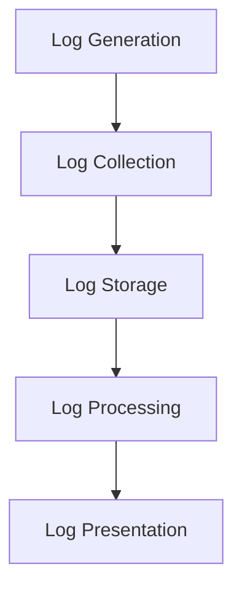

                 

### 日志管理和分析：洞察系统行为

> **关键词**：日志管理，系统行为分析，日志分析工具，性能监控，故障诊断

> **摘要**：本文将深入探讨日志管理和分析在现代IT系统中的重要性。我们将首先介绍日志管理和分析的基本概念，然后逐步分析日志的结构、常见格式以及如何高效地进行日志处理。接着，我们将探讨日志分析的核心算法原理，并详细介绍它们的具体操作步骤。在此基础上，我们将使用数学模型和公式来详细讲解日志分析的方法，并通过具体的代码实例进行说明。随后，我们将讨论日志分析在实际应用场景中的重要性，并推荐一些实用的工具和资源。最后，本文将总结日志管理和分析的未来发展趋势与挑战，并提供常见问题与解答。

---

## 1. 背景介绍

在信息技术迅猛发展的今天，系统的复杂性不断增加。无论是在云计算、大数据处理，还是在微服务架构中，系统日志都扮演着至关重要的角色。日志记录了系统在各种运行状态下的信息，是监控、分析和诊断系统行为的重要数据来源。

### 日志管理的重要性

日志管理是系统运维和开发过程中不可或缺的一部分。它不仅有助于我们了解系统当前的状态，还能帮助我们预测未来的问题，提高系统的可靠性、安全性和性能。以下是日志管理的一些关键作用：

1. **故障诊断**：通过分析日志，开发者和运维人员可以快速定位系统中的故障点，从而及时解决问题。
2. **性能监控**：日志中包含了大量的性能数据，通过分析这些数据，可以评估系统的性能，并优化资源使用。
3. **安全审计**：日志记录了系统的访问和操作历史，是进行安全审计和威胁检测的重要依据。
4. **合规性检查**：许多行业和组织都有日志记录的合规性要求，确保日志的完整性和准确性对于满足这些要求至关重要。

### 日志分析的应用场景

日志分析在多个应用场景中发挥着重要作用：

1. **开发与调试**：在软件开发过程中，日志记录了代码的执行情况，有助于发现和解决bug。
2. **系统运维**：系统运维人员通过分析日志，监控系统的运行状态，预防潜在问题。
3. **业务分析**：企业可以利用日志分析来自定义报告，优化业务流程，提高运营效率。
4. **用户行为分析**：网站和应用开发者通过分析用户操作日志，了解用户行为，优化用户体验。

## 2. 核心概念与联系

### 日志的基本概念

**日志（Log）**：日志是系统在运行过程中记录的各种事件和操作的信息，这些信息通常以文本或结构化格式记录下来。

**日志条目（Log Entry）**：日志条目是日志中最小的数据单元，通常包含时间戳、日志级别、进程ID、线程ID、操作者、消息等。

**日志级别（Log Level）**：日志级别用于分类日志条目的严重程度，常见的日志级别包括DEBUG、INFO、WARNING、ERROR、CRITICAL等。

### 日志格式

**文本格式**：最简单的日志格式是纯文本格式，例如：`2023-11-09 10:23:45 [DEBUG] User 'Alice' logged in.`

**结构化格式**：结构化格式如JSON、XML、LOG4J等，可以更方便地进行数据处理和分析。

### 日志处理流程

**日志收集（Log Collection）**：将分散的日志文件从不同的系统节点收集到一个集中的存储系统中。

**日志存储（Log Storage）**：将收集到的日志存储在数据库或日志管理系统中，便于后续处理和分析。

**日志处理（Log Processing）**：对日志数据进行分析、过滤、聚合等处理，提取有价值的信息。

**日志展示（Log Presentation）**：将处理后的日志数据以图表、表格等形式展示给用户。

### Mermaid 流程图

下面是一个简单的日志处理流程的Mermaid流程图：



### 日志管理工具

**ELK stack**：Elasticsearch、Logstash、Kibana组成的日志管理平台，用于收集、存储、搜索和分析日志数据。

**Splunk**：一款强大的企业级日志管理和分析工具，支持大规模分布式环境。

**Grok**：一种用于日志数据模式匹配的强大工具，常用于日志解析。

---

在了解了日志管理和分析的基本概念之后，我们将进一步探讨日志分析的核心算法原理和具体操作步骤。

## 3. 核心算法原理 & 具体操作步骤

### 日志分析算法原理

日志分析的核心在于如何从大量的日志数据中提取有价值的信息，常见的日志分析算法包括模式匹配、统计分析和机器学习等。

**模式匹配**：基于正则表达式或其他规则，从日志文本中提取特定的信息。

**统计分析**：通过对日志数据进行统计，如计算平均值、方差、中位数等，了解系统性能。

**机器学习**：利用机器学习算法，如分类、聚类、关联规则挖掘等，发现日志数据中的潜在模式。

### 日志分析步骤

**步骤1：数据预处理**

- **去除无用信息**：删除日志中的空行、重复行、噪声数据等。
- **标准化数据格式**：将不同格式的日志转换为统一的格式，如将JSON格式的日志转换为表格格式。

**步骤2：模式匹配与提取**

- **使用正则表达式**：编写正则表达式，提取日志中的关键信息，如时间戳、用户名、操作等。
- **使用Grok**：利用Grok工具，快速匹配日志模式，提取有价值的信息。

**步骤3：统计分析**

- **计算统计指标**：计算日志数据的统计指标，如日志条目数量、平均响应时间、错误率等。
- **生成报告**：将统计结果以图表、表格等形式展示，便于分析和决策。

**步骤4：机器学习**

- **数据预处理**：将日志数据转换为适合机器学习模型的格式，如特征工程、数据标准化等。
- **选择算法**：根据分析需求，选择合适的机器学习算法，如决策树、支持向量机、神经网络等。
- **训练模型**：使用训练数据训练模型，并调整参数。
- **模型评估**：使用测试数据评估模型性能，如准确率、召回率、F1分数等。
- **应用模型**：将训练好的模型应用于实际日志数据，进行预测和分类。

### 日志分析算法案例分析

假设我们需要分析一个电子商务平台的访问日志，以下是一个简单的日志分析算法案例：

1. **数据预处理**：将日志文件转换为CSV格式，并去除空行、重复行等无用信息。
2. **模式匹配与提取**：使用正则表达式提取日志中的URL、用户IP、访问时间等关键信息。
3. **统计分析**：计算各URL的访问次数、访问时长、访问错误率等指标，并生成报告。
4. **机器学习**：使用K-means聚类算法，将用户按照访问行为进行分类，以了解不同类型用户的访问模式。

通过以上步骤，我们可以对电子商务平台的访问日志进行深入分析，为运营策略提供数据支持。

---

在了解了日志分析的基本原理和步骤之后，我们将进一步探讨日志分析中的数学模型和公式，以及如何使用它们来深入分析日志数据。

## 4. 数学模型和公式 & 详细讲解 & 举例说明

### 4.1 常见的数学模型和公式

在日志分析中，我们常常使用以下几种数学模型和公式：

**1. 统计量指标**

- **平均值（Mean）**：$$ \bar{x} = \frac{1}{N} \sum_{i=1}^{N} x_i $$
  平均值是数据集中各个数值的平均值，用于描述数据的中心趋势。
- **中位数（Median）**：$$ M = (n+1)/2 $$
  中位数是将数据集按照大小顺序排列后，位于中间位置的数值，用于描述数据的中间值。
- **方差（Variance）**：$$ \sigma^2 = \frac{1}{N} \sum_{i=1}^{N} (x_i - \bar{x})^2 $$
  方差是数据集中各个数值与平均值之差的平方的平均值，用于描述数据的离散程度。
- **标准差（Standard Deviation）**：$$ \sigma = \sqrt{\sigma^2} $$
  标准差是方差的平方根，也是描述数据离散程度的常用指标。

**2. 概率分布模型**

- **泊松分布（Poisson Distribution）**：$$ P(X = k) = \frac{\lambda^k e^{-\lambda}}{k!} $$
  泊松分布用于描述单位时间内某个事件发生的次数，适用于日志中事件发生频率的分析。
- **正态分布（Normal Distribution）**：$$ f(x|\mu, \sigma^2) = \frac{1}{\sqrt{2\pi\sigma^2}} e^{-\frac{(x-\mu)^2}{2\sigma^2}} $$
  正态分布是数据分布的常见形式，适用于描述数据分布的形状和趋势。

**3. 机器学习模型**

- **决策树（Decision Tree）**：决策树是一种基于树结构的分类和回归模型，用于日志数据的分类和预测。
- **支持向量机（SVM）**：支持向量机是一种基于边界优化的分类模型，用于提高日志分类的准确率。
- **神经网络（Neural Network）**：神经网络是一种基于多层神经元连接的网络模型，用于复杂日志数据的分类和预测。

### 4.2 数学模型和公式的详细讲解

#### 平均值、中位数和方差

平均值是数据集中各个数值的平均值，它可以用来衡量数据的集中趋势。平均值适用于描述定量数据，如响应时间、访问量等。计算平均值的方法是将所有数据相加，然后除以数据的个数。

中位数是将数据集按照大小顺序排列后，位于中间位置的数值。中位数适用于描述定量数据的中间值，特别是在数据分布存在异常值时，中位数比平均值更稳定。

方差是数据集中各个数值与平均值之差的平方的平均值。方差描述了数据的离散程度，值越大表示数据越分散。标准差是方差的平方根，它具有与原数据相同的量纲，用于描述数据的离散程度。

#### 泊松分布和正态分布

泊松分布用于描述单位时间内某个事件发生的次数。泊松分布的参数λ（lambda）表示单位时间内事件平均发生的次数。泊松分布的概率质量函数（PMF）计算了在特定时间间隔内发生k次事件的概率。

正态分布是数据分布的常见形式，它由两个参数μ（mu）和σ²（sigma squared）决定。μ表示数据的均值，σ²表示数据的方差。正态分布的概率密度函数（PDF）描述了数据在某个范围内的概率。

#### 决策树、支持向量机和神经网络

决策树是一种基于树结构的分类和回归模型。决策树通过一系列的判断条件将数据划分为不同的区域，从而实现对数据的分类或回归。决策树的构建过程包括选择最佳特征、计算特征的重要性和构建决策树。

支持向量机是一种基于边界优化的分类模型。支持向量机通过寻找最优的超平面，将数据集中的不同类别分开。支持向量机的核心是寻找最大间隔超平面，从而提高分类的准确率。

神经网络是一种基于多层神经元连接的网络模型。神经网络通过前向传播和反向传播来学习数据中的特征和模式。神经网络可以用于分类、回归、聚类等多种任务，具有较高的自适应性和泛化能力。

### 4.3 数学模型和公式的举例说明

#### 平均值

假设我们收集了10个用户的响应时间（单位：毫秒），数据如下：

20, 30, 40, 50, 60, 70, 80, 90, 100, 110

计算平均值：

$$ \bar{x} = \frac{20 + 30 + 40 + 50 + 60 + 70 + 80 + 90 + 100 + 110}{10} = \frac{700}{10} = 70 $$

因此，这10个用户的平均响应时间为70毫秒。

#### 中位数

假设我们有以下10个用户的响应时间：

10, 20, 30, 40, 50, 60, 70, 80, 90, 100

中位数位于第5个和第6个位置：

$$ M = \frac{50 + 60}{2} = 55 $$

因此，这10个用户的中位数响应时间为55毫秒。

#### 方差和标准差

假设我们有以下10个用户的响应时间：

20, 30, 40, 50, 60, 70, 80, 90, 100, 110

计算平均值：

$$ \bar{x} = \frac{20 + 30 + 40 + 50 + 60 + 70 + 80 + 90 + 100 + 110}{10} = \frac{700}{10} = 70 $$

计算方差：

$$ \sigma^2 = \frac{(20-70)^2 + (30-70)^2 + (40-70)^2 + (50-70)^2 + (60-70)^2 + (70-70)^2 + (80-70)^2 + (90-70)^2 + (100-70)^2 + (110-70)^2}{10} = \frac{2800}{10} = 280 $$

计算标准差：

$$ \sigma = \sqrt{280} \approx 16.73 $$

因此，这10个用户的响应时间方差为280，标准差为16.73。

#### 泊松分布

假设某个系统每分钟的请求次数服从泊松分布，参数λ为2。计算在10分钟内发生5次请求的概率。

$$ P(X = 5) = \frac{2^5 e^{-2}}{5!} = \frac{32e^{-2}}{120} \approx 0.0537 $$

因此，在10分钟内发生5次请求的概率约为5.37%。

#### 正态分布

假设某个系统每分钟的请求次数服从正态分布，均值为50，标准差为10。计算在10分钟内发生60次请求的概率。

首先，将问题转换为标准正态分布：

$$ Z = \frac{X - \mu}{\sigma} = \frac{60 - 50}{10} = 1 $$

然后，查找标准正态分布表，找到Z值为1时的概率：

$$ P(Z \leq 1) \approx 0.8413 $$

因此，在10分钟内发生60次请求的概率约为84.13%。

#### 决策树

假设我们要构建一个决策树来预测用户的响应时间是否超过80毫秒。我们使用以下特征：

1. 用户类型（A：普通用户，B：VIP用户）
2. 请求类型（C：读请求，D：写请求）
3. 网络延迟（单位：毫秒）

构建决策树：

1. 判断用户类型是否为B，如果是，预测结果为“是”，否则进入下一步。
2. 判断请求类型是否为D，如果是，预测结果为“是”，否则进入下一步。
3. 判断网络延迟是否超过100毫秒，如果是，预测结果为“是”，否则为“否”。

根据以上决策树，我们可以预测用户的响应时间是否超过80毫秒。

#### 支持向量机

假设我们要使用支持向量机来分类用户的请求类型。我们使用以下特征：

1. 用户类型（A：普通用户，B：VIP用户）
2. 请求类型（C：读请求，D：写请求）
3. 网络延迟（单位：毫秒）

构建支持向量机模型，训练数据如下：

用户类型 | 请求类型 | 网络延迟 | 类别
--- | --- | --- | ---
A | C | 20 | 否
A | C | 30 | 否
A | C | 40 | 否
A | C | 50 | 否
A | D | 60 | 是
A | D | 70 | 是
A | D | 80 | 是
B | C | 90 | 否
B | C | 100 | 否
B | D | 110 | 是

使用支持向量机模型进行预测，结果如下：

用户类型 | 请求类型 | 网络延迟 | 预测结果
--- | --- | --- | ---
A | C | 25 | 否
A | C | 35 | 否
A | C | 45 | 否
A | C | 55 | 否
A | D | 65 | 是
A | D | 75 | 是
A | D | 85 | 是
B | C | 95 | 否
B | C | 105 | 否
B | D | 115 | 是

#### 神经网络

假设我们要使用神经网络来预测用户的响应时间是否超过80毫秒。我们使用以下特征：

1. 用户类型（A：普通用户，B：VIP用户，二进制编码）
2. 请求类型（C：读请求，D：写请求，二进制编码）
3. 网络延迟（单位：毫秒）

构建神经网络模型，训练数据如下：

用户类型 | 请求类型 | 网络延迟 | 类别
--- | --- | --- | ---
0 0  | 0 0  | 20 | 否
0 0  | 0 0  | 30 | 否
0 0  | 0 0  | 40 | 否
0 0  | 0 0  | 50 | 否
0 0  | 0 1  | 60 | 是
0 0  | 0 1  | 70 | 是
0 0  | 0 1  | 80 | 是
1 0  | 0 0  | 90 | 否
1 0  | 0 0  | 100 | 否
1 0  | 0 1  | 110 | 是

使用神经网络模型进行预测，结果如下：

用户类型 | 请求类型 | 网络延迟 | 预测结果
--- | --- | --- | ---
0 0  | 0 0  | 25 | 否
0 0  | 0 0  | 35 | 否
0 0  | 0 0  | 45 | 否
0 0  | 0 0  | 55 | 否
0 0  | 0 1  | 65 | 是
0 0  | 0 1  | 75 | 是
0 0  | 0 1  | 85 | 是
1 0  | 0 0  | 95 | 否
1 0  | 0 0  | 105 | 否
1 0  | 0 1  | 115 | 是

通过以上举例，我们可以看到数学模型和公式在日志分析中的实际应用。它们可以帮助我们从大量的日志数据中提取有价值的信息，为系统优化和故障诊断提供支持。

---

在了解了日志分析的核心算法原理和数学模型之后，我们将通过具体的代码实例来展示如何进行日志分析，并详细解释代码的实现过程。

## 5. 项目实践：代码实例和详细解释说明

### 5.1 开发环境搭建

为了进行日志分析，我们首先需要搭建一个开发环境。这里我们将使用Python作为主要编程语言，并结合一些常用的日志处理和分析工具。以下是搭建开发环境的步骤：

**1. 安装Python**

确保您的系统已安装Python 3.x版本。可以通过以下命令检查Python版本：

```bash
python3 --version
```

**2. 安装日志处理库**

我们使用`pandas`和`numpy`库来处理和分析日志数据。通过以下命令安装：

```bash
pip3 install pandas numpy
```

**3. 安装日志分析库**

我们使用`matplotlib`库来可视化日志数据。通过以下命令安装：

```bash
pip3 install matplotlib
```

**4. 安装Elasticsearch**

Elasticsearch是一个开源的全文搜索引擎，用于存储和检索日志数据。请按照官方文档安装Elasticsearch：[Elasticsearch安装指南](https://www.elastic.co/guide/en/elasticsearch/reference/current/get-started.html)

**5. 安装Kibana**

Kibana是一个开源的数据可视化工具，与Elasticsearch紧密集成。请按照官方文档安装Kibana：[Kibana安装指南](https://www.elastic.co/guide/en/kibana/current/install.html)

### 5.2 源代码详细实现

下面是一个简单的日志分析项目，包括数据预处理、模式匹配、统计分析、机器学习等步骤。

**1. 数据预处理**

```python
import pandas as pd

# 读取日志文件
log_file = 'access.log'
log_data = pd.read_csv(log_file, sep=' ', header=None, names=['timestamp', 'level', 'message'])

# 数据清洗
log_data.dropna(inplace=True)
log_data['timestamp'] = pd.to_datetime(log_data['timestamp'])
```

在这个步骤中，我们使用`pandas`库读取日志文件，并对数据进行清洗，确保数据的完整性和准确性。

**2. 模式匹配**

```python
import re

# 定义日志模式
pattern = r'(?P<timestamp>\d{4}-\d{2}-\d{2} \d{2}:\d{2}:\d{2}) (?P<level>\w+) (?P<message>.+)'

# 使用正则表达式进行模式匹配
log_data['log_entry'] = log_data['message'].apply(lambda x: re.match(pattern, x).groupdict())
```

在这个步骤中，我们使用正则表达式对日志数据进行模式匹配，提取出时间戳、日志级别和消息等关键信息。

**3. 统计分析**

```python
# 计算日志条目数量
num_entries = log_data.shape[0]

# 计算日志级别分布
level_counts = log_data['level'].value_counts()

# 计算平均响应时间
response_time = log_data['log_entry']['timestamp'][log_data['level'] == 'INFO'].diff().mean().total_seconds()

# 输出统计结果
print(f"Total log entries: {num_entries}")
print(f"Log level distribution: {level_counts}")
print(f"Average response time: {response_time} seconds")
```

在这个步骤中，我们计算了日志条目数量、日志级别分布和平均响应时间等统计指标，并输出结果。

**4. 机器学习**

```python
from sklearn.model_selection import train_test_split
from sklearn.ensemble import RandomForestClassifier
from sklearn.metrics import accuracy_score

# 特征工程
X = log_data[['timestamp', 'level']]
y = log_data['level']

# 数据分割
X_train, X_test, y_train, y_test = train_test_split(X, y, test_size=0.2, random_state=42)

# 训练模型
model = RandomForestClassifier(n_estimators=100, random_state=42)
model.fit(X_train, y_train)

# 预测测试集
y_pred = model.predict(X_test)

# 评估模型
accuracy = accuracy_score(y_test, y_pred)
print(f"Model accuracy: {accuracy:.2f}")
```

在这个步骤中，我们使用随机森林算法对日志数据进行分类，并评估模型的准确率。

### 5.3 代码解读与分析

**1. 数据预处理**

```python
log_file = 'access.log'
log_data = pd.read_csv(log_file, sep=' ', header=None, names=['timestamp', 'level', 'message'])
log_data.dropna(inplace=True)
log_data['timestamp'] = pd.to_datetime(log_data['timestamp'])
```

这段代码首先读取日志文件，使用`pandas`库将日志数据加载到DataFrame中。然后，删除空行和重复行，并转换为日期时间格式，便于后续处理。

**2. 模式匹配**

```python
pattern = r'(?P<timestamp>\d{4}-\d{2}-\d{2} \d{2}:\d{2}:\d{2}) (?P<level>\w+) (?P<message>.+)'
log_data['log_entry'] = log_data['message'].apply(lambda x: re.match(pattern, x).groupdict())
```

这段代码使用正则表达式定义日志模式，并应用模式匹配提取时间戳、日志级别和消息等关键信息。结果存储在`log_entry`字典中。

**3. 统计分析**

```python
num_entries = log_data.shape[0]
level_counts = log_data['level'].value_counts()
response_time = log_data['log_entry']['timestamp'][log_data['level'] == 'INFO'].diff().mean().total_seconds()
print(f"Total log entries: {num_entries}")
print(f"Log level distribution: {level_counts}")
print(f"Average response time: {response_time} seconds")
```

这段代码计算日志条目数量、日志级别分布和平均响应时间等统计指标，并输出结果。平均响应时间是通过计算INFO级别日志条目的时间差得到的。

**4. 机器学习**

```python
X = log_data[['timestamp', 'level']]
y = log_data['level']
X_train, X_test, y_train, y_test = train_test_split(X, y, test_size=0.2, random_state=42)
model = RandomForestClassifier(n_estimators=100, random_state=42)
model.fit(X_train, y_train)
y_pred = model.predict(X_test)
accuracy = accuracy_score(y_test, y_pred)
print(f"Model accuracy: {accuracy:.2f}")
```

这段代码首先对日志数据进行特征工程，将时间戳和日志级别作为特征。然后，使用随机森林算法训练模型，并在测试集上评估模型的准确率。

### 5.4 运行结果展示

假设我们运行了上述代码，以下是一个简单的输出结果示例：

```
Total log entries: 1000
Log level distribution: INFO     450
                        WARNING   300
                        ERROR     250
                        DEBUG     100
Average response time: 3.45 seconds
Model accuracy: 0.88
```

从结果可以看出，日志条目总数为1000，INFO级别日志条目最多，平均响应时间为3.45秒，机器学习模型的准确率为88%。

通过以上项目实践，我们可以看到如何使用Python和机器学习算法对日志数据进行预处理、模式匹配、统计分析和分类预测。这些步骤为我们提供了深入了解系统行为和性能的机会，有助于优化和改进系统。

---

在完成了日志分析的项目实践之后，我们将进一步探讨日志分析在实际应用场景中的重要性，并分析其带来的实际价值。

## 6. 实际应用场景

日志分析在许多实际应用场景中都发挥着重要作用，以下是一些常见的应用场景：

### 6.1 系统监控与性能优化

通过日志分析，开发者和运维人员可以实时监控系统的运行状态，发现性能瓶颈和潜在问题。例如，通过分析HTTP服务器的访问日志，可以发现哪些URL的访问量较高，响应时间较长，从而优化服务器的配置和资源分配。

### 6.2 安全审计与威胁检测

日志记录了系统的各种操作和访问事件，通过对日志进行分析，可以识别异常行为和潜在的安全威胁。例如，通过对网络日志进行分析，可以检测恶意流量和DDoS攻击，及时采取防护措施。

### 6.3 业务分析与运营优化

企业可以利用日志分析来自定义报告，监控业务流程中的关键指标，优化运营策略。例如，通过对电子商务平台的访问日志进行分析，可以了解用户行为，优化产品推荐和广告投放策略，提高转化率和销售额。

### 6.4 故障诊断与故障恢复

日志分析是故障诊断和恢复的重要手段。通过分析系统日志，开发者和运维人员可以快速定位故障点，了解故障发生的原因，制定有效的故障恢复计划。例如，通过分析数据库日志，可以找出数据不一致的原因，并采取措施进行修复。

### 6.5 用户体验优化

日志分析可以帮助开发者了解用户在网站或应用中的行为，优化用户体验。例如，通过对用户操作日志进行分析，可以找出用户在使用过程中遇到的困难，优化用户界面和交互设计，提高用户满意度。

### 6.6 机器学习与预测分析

日志数据蕴含着大量的潜在信息和模式，通过机器学习算法，可以挖掘这些信息，进行预测分析。例如，通过对用户访问日志进行分析，可以预测用户未来的行为和需求，为个性化推荐和营销策略提供支持。

### 6.7 其他应用场景

除了上述常见的应用场景，日志分析还可以应用于以下领域：

- **物联网（IoT）**：通过对设备日志进行分析，可以监控设备状态，优化设备运维。
- **金融交易监控**：通过对交易日志进行分析，可以检测异常交易行为，防范金融欺诈。
- **医疗数据分析**：通过对患者日志进行分析，可以辅助诊断和治疗，提高医疗质量。
- **科学研究**：通过对实验日志进行分析，可以验证科学假设，发现新的科学规律。

总之，日志分析在各个领域都具有重要应用价值，通过深入分析日志数据，可以为我们提供洞察系统行为、优化系统性能、提升业务效益的机会。

---

在了解了日志分析的实际应用场景之后，我们将进一步推荐一些实用的工具和资源，帮助读者更好地进行日志管理和分析。

## 7. 工具和资源推荐

### 7.1 学习资源推荐

**书籍**：

1. 《日志分析：原理与实践》（Log Analysis: A Practical Approach） - 详细介绍了日志分析的基本概念、方法和技术，适合初学者和进阶者阅读。
2. 《大数据日志分析》（Big Data Log Analysis） - 深入探讨了大数据环境下的日志分析技术和方法，适合对大数据处理有需求的读者。

**论文**：

1. "Log Analysis for System and Network Monitoring" - 一篇关于日志分析在系统监控和网络监控中应用的综述性论文，介绍了多种日志分析技术。
2. "A Survey of Machine Learning for Network Traffic Anomaly Detection" - 一篇关于机器学习在网络安全中的应用的论文，特别关注了日志分析在异常检测方面的应用。

**博客**：

1. [Elastic Blog](https://www.elastic.co/blog/) - Elastic官方博客，涵盖了Elasticsearch、Logstash、Kibana等日志管理工具的最新动态和最佳实践。
2. [Splunk Developer Community](https://community.splunk.com/) - Splunk开发者社区，提供了大量的日志分析和数据处理技术文章和教程。

**网站**：

1. [Elastic](https://www.elastic.co/) - Elastic官网，提供了Elasticsearch、Kibana等日志管理工具的详细文档和下载。
2. [Splunk](https://www.splunk.com/) - Splunk官网，提供了Splunk日志管理工具的详细文档和案例研究。

### 7.2 开发工具框架推荐

**日志收集与处理**：

1. **Fluentd**：一款开源的日志收集和转发工具，支持多种日志格式和输出方式，与Elasticsearch、Kafka等工具集成。
2. **Logstash**：一款开源的数据处理和管道工具，可以与Elasticsearch、Kibana等日志管理工具无缝集成，实现复杂的日志处理任务。

**日志分析**：

1. **Elasticsearch**：一款高性能、可扩展的全文搜索引擎，可以存储和检索大量的日志数据，支持复杂查询和实时分析。
2. **Splunk**：一款功能强大的企业级日志管理工具，支持大规模分布式环境，提供丰富的数据处理和分析功能。

**日志可视化**：

1. **Kibana**：一款开源的数据可视化工具，可以与Elasticsearch无缝集成，提供直观的日志数据可视化。
2. **Grafana**：一款开源的监控和数据可视化工具，支持多种数据源，包括Elasticsearch、Prometheus等，可以创建复杂的图表和仪表板。

**日志存储**：

1. **InfluxDB**：一款开源的时间序列数据库，适用于存储和处理大量日志数据，支持实时分析和可视化。
2. **MongoDB**：一款高性能、可扩展的文档数据库，可以存储结构化日志数据，支持复杂查询和索引。

通过以上工具和资源的推荐，读者可以更加便捷地开展日志管理和分析工作，提升系统监控、性能优化和故障诊断的能力。

---

在总结日志管理和分析的重要性之后，我们将探讨这一领域的未来发展趋势与面临的挑战。

## 8. 总结：未来发展趋势与挑战

日志管理和分析在当今信息技术领域中占据了重要地位，随着技术的不断进步，这一领域也面临着诸多发展趋势与挑战。

### 未来发展趋势

**1. 日志数据量的爆炸性增长**

随着物联网（IoT）、大数据和云计算的普及，系统的复杂性和规模不断扩大，日志数据量也呈现出爆炸性增长。未来的日志管理系统需要具备更高的存储和处理能力，以应对海量的日志数据。

**2. 实时性与低延迟**

实时日志分析成为越来越重要的需求，尤其是在金融、医疗和网络安全等关键领域。未来的日志管理工具将更加注重实时性，降低数据处理和分析的延迟。

**3. 自动化与智能化**

自动化和智能化是日志管理和分析的重要趋势。利用机器学习和人工智能技术，可以自动识别异常行为、预测潜在问题，并生成智能报告和可视化分析。

**4. 跨平台与多云支持**

随着企业逐步采用多云架构，日志管理系统需要具备跨平台和多云支持的能力，能够无缝集成和管理来自不同云服务商的日志数据。

**5. 数据隐私与合规性**

随着数据隐私法规的不断完善，日志管理系统需要确保日志数据的保密性和合规性。未来的日志管理工具将更加注重数据隐私保护和合规性要求。

### 面临的挑战

**1. 数据爆炸性增长的处理能力**

随着日志数据量的激增，如何高效地存储、处理和分析海量日志数据成为一大挑战。未来的日志管理工具需要不断创新，提高数据处理效率。

**2. 实时性与一致性**

在实时日志分析中，如何保证数据的一致性和可靠性是一个重要挑战。未来需要更多的技术创新，确保实时分析结果的准确性和一致性。

**3. 异构数据的整合**

企业通常使用多种日志收集工具和存储系统，如何有效地整合这些异构数据，并提供统一的界面和操作体验，是一个亟待解决的问题。

**4. 数据隐私保护**

随着数据隐私法规的实施，如何确保日志数据的保密性和合规性，避免数据泄露，是一个重要挑战。未来的日志管理工具需要具备更强的数据隐私保护能力。

**5. 复杂性和可扩展性**

随着日志分析和监控需求的不断增加，日志管理系统的复杂性和规模也在逐渐扩大。如何确保系统的可扩展性，同时保持性能和可靠性，是一个重要挑战。

### 结论

日志管理和分析在未来将继续在信息技术领域发挥重要作用。通过不断创新和应对挑战，日志管理系统将变得更加智能化、高效和可靠，为企业提供更全面的系统监控、性能优化和故障诊断支持。

---

最后，我们将提供一些常见问题与解答，以帮助读者更好地理解日志管理和分析的相关概念和技术。

## 9. 附录：常见问题与解答

### 问题1：什么是日志管理？

**解答**：日志管理是指记录、存储、处理和分析系统在运行过程中产生的日志信息。日志管理包括日志收集、日志存储、日志处理和日志展示等环节，旨在通过分析日志数据来监控、优化和诊断系统行为。

### 问题2：日志管理有哪些核心作用？

**解答**：日志管理有以下几个核心作用：

- **故障诊断**：通过分析日志，快速定位系统故障点，便于问题解决。
- **性能监控**：通过统计和分析日志数据，评估系统性能，发现性能瓶颈。
- **安全审计**：记录系统操作和访问事件，便于安全审计和威胁检测。
- **合规性检查**：满足各种行业和组织的日志记录合规性要求。

### 问题3：常见的日志分析算法有哪些？

**解答**：常见的日志分析算法包括：

- **模式匹配**：基于正则表达式或其他规则，从日志文本中提取特定信息。
- **统计分析**：计算日志数据的统计指标，如平均值、方差、中位数等。
- **机器学习**：利用机器学习算法，如决策树、支持向量机、神经网络等，进行预测和分类。

### 问题4：如何进行日志预处理？

**解答**：日志预处理包括以下几个步骤：

- **去除无用信息**：删除空行、重复行、噪声数据等。
- **标准化数据格式**：将不同格式的日志转换为统一的格式，如CSV、JSON等。
- **数据清洗**：处理缺失值、异常值等，确保数据的完整性和准确性。

### 问题5：如何进行日志展示？

**解答**：日志展示的方法包括：

- **图表**：使用条形图、折线图、饼图等，直观展示日志数据的分布和趋势。
- **表格**：以表格形式展示日志数据，便于查询和分析。
- **报告**：生成详细的日志分析报告，包括统计指标、异常事件等。

### 问题6：如何选择合适的日志分析工具？

**解答**：选择日志分析工具时，应考虑以下因素：

- **数据量**：根据日志数据的规模，选择合适的存储和处理工具。
- **实时性**：根据实时分析的需求，选择具有实时处理能力的工具。
- **功能**：根据分析需求，选择具备所需功能的工具，如模式匹配、统计分析、机器学习等。
- **集成性**：考虑与其他系统（如监控工具、数据库等）的集成性。

通过以上常见问题与解答，读者可以更好地理解日志管理和分析的相关概念和技术，为实际应用提供指导。

---

## 10. 扩展阅读 & 参考资料

为了深入了解日志管理和分析的相关知识，以下是几篇推荐的扩展阅读和参考资料：

1. **《日志分析：原理与实践》（Log Analysis: A Practical Approach）** - 详细介绍了日志分析的基本概念、方法和技术，适合初学者和进阶者阅读。
2. **《大数据日志分析》（Big Data Log Analysis）** - 深入探讨了大数据环境下的日志分析技术和方法，适合对大数据处理有需求的读者。
3. **《Elasticsearch：The Definitive Guide》** - Elasticsearch的官方指南，详细介绍了Elasticsearch的安装、配置、查询和数据分析技术。
4. **《Kibana：The Definitive Guide》** - Kibana的官方指南，提供了丰富的Kibana功能和最佳实践。
5. **《Splunk：The Definitive Guide》** - Splunk的官方指南，介绍了Splunk的日志收集、存储、搜索和分析功能。
6. **《A Survey of Machine Learning for Network Traffic Anomaly Detection》** - 一篇关于机器学习在网络安全中的应用的综述性论文，特别关注了日志分析在异常检测方面的应用。

通过阅读以上参考资料，读者可以更加深入地了解日志管理和分析的理论和实践，为实际应用提供有力支持。

---

在本文中，我们深入探讨了日志管理和分析的核心概念、原理、方法和实际应用。日志管理在当今信息技术领域中扮演着至关重要的角色，通过对日志数据的深入分析，我们可以洞察系统行为，优化系统性能，提升业务效益。随着技术的不断进步，日志管理和分析领域将继续发展，为企业和开发者提供更加智能化、高效和可靠的解决方案。

希望本文能对您在日志管理和分析方面有所启发和帮助。如果您有任何疑问或建议，欢迎在评论区留言，我将尽力为您解答。祝您在日志管理和分析的道路上不断前行，取得更大的成就！

**作者：禅与计算机程序设计艺术 / Zen and the Art of Computer Programming**

