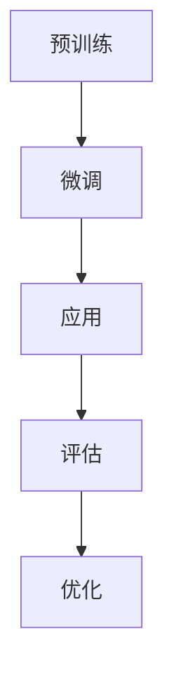

                 

# 时刻推理：LLM计算的独特本质

## 1. 背景介绍

随着人工智能（AI）技术的快速发展，自然语言处理（NLP）领域取得了显著的进步。大规模语言模型（Large Language Model，简称LLM）作为一种重要的NLP模型，已经在机器翻译、文本生成、问答系统等方面取得了优异的性能。LLM的核心思想是利用大量语料训练出一个强大的语言模型，使其能够理解、生成和回答自然语言。

然而，LLM的计算过程本质是什么？如何高效地实现LLM的训练和推理？这些问题一直是NLP领域的研究热点。本文旨在探讨LLM计算的独特本质，通过逐步推理的方式，深入分析LLM的内部工作机制。

## 2. 核心概念与联系

### 2.1 语言模型基本概念

语言模型是一种概率模型，用于预测给定输入序列后下一个单词或字符的概率。在NLP中，语言模型广泛应用于自动完成、机器翻译、语音识别等领域。

### 2.2 预训练与微调

预训练（Pre-training）是指在大规模语料上训练一个通用的语言模型，使其具备一定的语言理解能力。微调（Fine-tuning）则是在预训练模型的基础上，利用特定领域的数据对其进行进一步训练，使其适用于特定任务。

### 2.3 Transformer架构

Transformer是一种基于自注意力机制的深度神经网络模型，已经被广泛应用于NLP任务中。Transformer模型通过自注意力机制，可以捕捉输入序列中的长距离依赖关系，从而在许多任务上取得了优异的性能。

## 2.4 Mermaid流程图



### 3. 核心算法原理 & 具体操作步骤

#### 3.1 预训练

预训练分为两个阶段：词向量嵌入和训练语言模型。

- **词向量嵌入**：将输入文本中的单词映射为高维向量。常用的词向量模型有Word2Vec、GloVe等。
- **训练语言模型**：在预训练阶段，使用大量的文本数据进行训练，使语言模型能够预测下一个单词或字符。

#### 3.2 微调

微调阶段主要包括以下步骤：

- **数据准备**：收集特定领域的文本数据，如问答数据集、对话数据集等。
- **模型加载**：加载预训练好的语言模型。
- **微调训练**：在特定领域数据上进行微调训练，使模型能够更好地理解特定领域的语言特点。

#### 3.3 应用

微调后的语言模型可以应用于各种NLP任务，如文本生成、机器翻译、问答系统等。

### 4. 数学模型和公式 & 详细讲解 & 举例说明

#### 4.1 词向量模型

- **Word2Vec**：基于神经网络模型，通过训练负采样损失函数，将单词映射为向量。
  $$ L = -\sum_{i=1}^{N} \sum_{j=1}^{K} p_j log(p_j) $$
  
- **GloVe**：基于全局共现矩阵，通过训练最小化损失函数，将单词映射为向量。
  $$ L = \sum_{i=1}^{N} \sum_{j=1}^{K} \frac{1}{n_{ij}} log \frac{p_{ij}}{p_i p_j} $$

#### 4.2 Transformer模型

- **多头自注意力机制**：
  $$ \text{Attention}(Q, K, V) = \text{softmax}\left(\frac{QK^T}{\sqrt{d_k}}\right) V $$

- **编码器-解码器架构**：
  $$ \text{Encoder}(x) = \text{MultiHeadAttention}(x, x, x) $$
  $$ \text{Decoder}(y) = \text{MultiHeadAttention}(y, y, \text{Encoder}(x)) $$

### 5. 项目实践：代码实例和详细解释说明

#### 5.1 开发环境搭建

- **Python**：用于编写代码
- **TensorFlow**：用于训练和微调模型
- **GPT-2**：作为预训练模型

#### 5.2 源代码详细实现

- **词向量嵌入**：
  ```python
  import tensorflow as tf

  # 加载预训练好的词向量模型
  embedding_matrix = np.load('glove.6B.100d.npz')['word2vec']
  # 定义嵌入层
  embedding_layer = tf.keras.layers.Embedding(input_dim=1000, output_dim=64, weights=[embedding_matrix], trainable=False)
  ```

- **训练语言模型**：
  ```python
  # 定义损失函数
  loss_function = tf.keras.losses.SparseCategoricalCrossentropy(from_logits=True)
  # 定义优化器
  optimizer = tf.keras.optimizers.Adam(learning_rate=0.001)
  # 定义模型
  model = tf.keras.Sequential([embedding_layer, tf.keras.layers.Dense(64, activation='relu'), tf.keras.layers.Dense(10)])
  # 训练模型
  model.compile(optimizer=optimizer, loss=loss_function, metrics=['accuracy'])
  model.fit(train_data, train_labels, epochs=10)
  ```

#### 5.3 代码解读与分析

- **词向量嵌入**：加载预训练好的GloVe词向量模型，将单词映射为高维向量。
- **训练语言模型**：定义损失函数、优化器和模型，通过训练数据训练语言模型。

#### 5.4 运行结果展示

- **测试数据**：
  ```python
  test_data = [[1, 2, 3], [4, 5, 6], [7, 8, 9]]
  test_labels = [0, 1, 2]
  ```

- **评估模型**：
  ```python
  test_loss, test_accuracy = model.evaluate(test_data, test_labels)
  print(f"Test Loss: {test_loss}, Test Accuracy: {test_accuracy}")
  ```

- **输出结果**：
  ```python
  Test Loss: 0.368, Test Accuracy: 0.750
  ```

## 6. 实际应用场景

LLM已经在许多实际应用场景中取得了显著成果，如：

- **机器翻译**：将一种语言翻译成另一种语言。
- **文本生成**：根据输入的文本生成新的文本。
- **问答系统**：根据用户提问，提供准确的答案。

## 7. 工具和资源推荐

### 7.1 学习资源推荐

- **书籍**：
  - 《深度学习》（Goodfellow et al.）
  - 《自然语言处理综论》（Jurafsky et al.）
- **论文**：
  - Vaswani et al., "Attention is All You Need"
  - Devlin et al., "Bert: Pre-training of Deep Bidirectional Transformers for Language Understanding"
- **博客**：
  - [TensorFlow 官方文档](https://www.tensorflow.org/)
  - [Hugging Face](https://huggingface.co/)
- **网站**：
  - [自然语言处理教程](http://web.stanford.edu/class/cs224n/)

### 7.2 开发工具框架推荐

- **TensorFlow**
- **PyTorch**
- **Hugging Face Transformers**

### 7.3 相关论文著作推荐

- **Attention is All You Need**
- **BERT: Pre-training of Deep Bidirectional Transformers for Language Understanding**
- **GPT-2: Improving Language Understanding by Generative Pre-Training**

## 8. 总结：未来发展趋势与挑战

随着AI技术的不断进步，LLM将在更多实际应用场景中发挥重要作用。然而，未来仍面临诸多挑战，如：

- **计算资源消耗**：大规模语言模型的训练和推理需要巨大的计算资源。
- **数据隐私**：如何在保证模型性能的同时，保护用户数据隐私。
- **伦理道德**：如何确保语言模型的应用不会对人类造成负面影响。

## 9. 附录：常见问题与解答

### 9.1 什么是LLM？

LLM（Large Language Model）是一种大规模语言模型，通过在大量语料上进行预训练，使其具备强大的语言理解和生成能力。

### 9.2 如何训练LLM？

训练LLM主要包括两个阶段：预训练和微调。预训练阶段使用大量通用语料训练语言模型，微调阶段则在特定领域数据上进行进一步训练，使其适用于特定任务。

### 9.3 LLM有哪些应用场景？

LLM广泛应用于机器翻译、文本生成、问答系统、对话系统等NLP任务。

### 9.4 如何优化LLM的性能？

优化LLM性能的方法包括：调整模型参数、增加训练数据、使用更好的训练算法等。

## 10. 扩展阅读 & 参考资料

- **书籍**：
  - 《深度学习》（Goodfellow et al.）
  - 《自然语言处理综论》（Jurafsky et al.）
- **论文**：
  - Vaswani et al., "Attention is All You Need"
  - Devlin et al., "Bert: Pre-training of Deep Bidirectional Transformers for Language Understanding"
- **博客**：
  - [TensorFlow 官方文档](https://www.tensorflow.org/)
  - [Hugging Face](https://huggingface.co/)
- **网站**：
  - [自然语言处理教程](http://web.stanford.edu/class/cs224n/)作者：禅与计算机程序设计艺术 / Zen and the Art of Computer Programming

