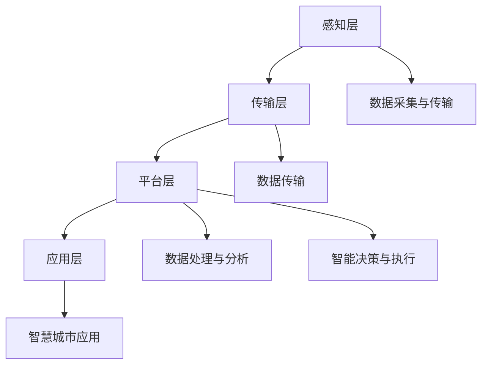

                 

### 文章标题

智慧城市管理：融合技术与城市治理

> 关键词：智慧城市、城市管理、数据融合、智能算法、治理优化

> 摘要：本文探讨了智慧城市管理的概念、技术架构、核心算法原理及其在实践中的应用，通过具体实例分析了其在城市治理中的重要作用。文章旨在为城市管理者提供技术参考，助力打造更加高效、智能、可持续发展的城市。

### 1. 背景介绍

智慧城市管理，是指利用先进的信息技术、大数据、物联网、人工智能等手段，对城市运行进行高效、智能的管理，提升城市治理水平，改善居民生活质量。随着城市化进程的加快，城市规模不断扩大，人口密度增加，城市交通、环境、资源等方面的管理挑战日益突出。传统的城市管理方式已无法满足现代城市的发展需求，迫切需要引入智慧城市管理理念和技术。

智慧城市管理的关键在于数据融合和智能算法的应用。通过对各类城市运行数据进行整合和分析，挖掘潜在价值，为城市治理提供科学决策支持。同时，利用智能算法优化资源配置、提升公共服务水平，从而实现城市管理的精细化、智能化。

近年来，全球范围内智慧城市建设如火如荼。我国政府也明确提出要打造“数字中国”，加快智慧城市建设。在此背景下，研究智慧城市管理的技术架构、核心算法及其应用，具有重要的现实意义。

### 2. 核心概念与联系

#### 2.1 智慧城市管理的关键概念

智慧城市管理的核心概念包括：数据采集与传输、数据存储与管理、数据处理与分析、智能决策与执行。

1. **数据采集与传输**：通过传感器、摄像头、移动终端等设备，实时采集城市运行数据，如交通流量、空气质量、能耗数据等。数据传输需要保证实时性、准确性和安全性。

2. **数据存储与管理**：构建大规模数据存储系统，实现对海量数据的存储、管理和备份。常用的数据存储技术包括关系型数据库、NoSQL数据库、分布式文件系统等。

3. **数据处理与分析**：利用大数据技术对采集到的数据进行处理、清洗、整合和分析，挖掘数据价值。数据处理技术包括数据挖掘、机器学习、深度学习等。

4. **智能决策与执行**：基于分析结果，利用智能算法生成决策方案，并自动执行。智能决策技术包括优化算法、规划算法、预测算法等。

#### 2.2 智慧城市管理的技术架构

智慧城市管理的技术架构包括感知层、传输层、平台层、应用层。

1. **感知层**：主要负责数据采集，包括各类传感器、摄像头、移动终端等。

2. **传输层**：负责数据传输，包括无线传输、有线传输等。需要保证传输的高效性、稳定性和安全性。

3. **平台层**：包括数据存储、管理和处理平台，以及智能算法平台。负责对采集到的数据进行存储、管理和处理，并为应用层提供数据支持和算法服务。

4. **应用层**：包括各类智慧城市应用，如智慧交通、智慧环保、智慧能源等。通过应用层，实现城市治理的智能化、精细化和高效化。

#### 2.3 Mermaid 流程图



### 3. 核心算法原理 & 具体操作步骤

#### 3.1 数据处理算法

数据处理是智慧城市管理的重要环节。常用的数据处理算法包括：

1. **数据清洗**：去除重复数据、处理缺失数据、纠正错误数据等。具体操作步骤如下：

   - **去重**：使用哈希表或布隆过滤器去除重复数据。
   - **补全**：根据数据类型，使用平均值、中位数、最临近值等方法进行数据补全。
   - **纠正**：利用规则或机器学习方法纠正错误数据。

2. **数据整合**：将来自不同来源的数据进行整合，形成一个统一的数据视图。具体操作步骤如下：

   - **数据映射**：将不同数据源的数据映射到统一的维度和属性上。
   - **数据融合**：使用联机分析处理（OLAP）等技术，对整合后的数据进行多维分析。

3. **数据挖掘**：从大量数据中提取有价值的信息和知识。具体操作步骤如下：

   - **特征选择**：选择对目标变量有显著影响的特征。
   - **模型训练**：使用机器学习算法训练模型，对数据进行分析和预测。
   - **评估与优化**：对模型进行评估和优化，提高模型性能。

#### 3.2 智能决策算法

智能决策是智慧城市管理的核心。常用的智能决策算法包括：

1. **优化算法**：通过优化模型求解最优解。具体操作步骤如下：

   - **目标函数定义**：明确优化目标，如成本最低、时间最短等。
   - **约束条件设定**：设定优化过程中的约束条件。
   - **求解算法选择**：选择合适的优化算法，如线性规划、整数规划、动态规划等。

2. **规划算法**：通过制定合理的规划方案，指导城市治理。具体操作步骤如下：

   - **需求分析**：分析城市治理的需求，明确规划目标。
   - **方案设计**：设计多种规划方案，并进行比较。
   - **方案评估**：评估规划方案的效果，选择最优方案。

3. **预测算法**：通过预测未来趋势，为城市治理提供参考。具体操作步骤如下：

   - **时间序列分析**：对时间序列数据进行分析，提取趋势和周期性。
   - **模型选择**：选择合适的预测模型，如ARIMA、LSTM等。
   - **模型训练与评估**：训练模型并评估模型性能，优化模型参数。

### 4. 数学模型和公式 & 详细讲解 & 举例说明

#### 4.1 数据清洗算法

数据清洗算法主要包括去重、补全和纠正。以下是一个去重算法的示例：

$$
hash\_value = hash(key)
$$

其中，$hash\_value$ 是键 $key$ 的哈希值。通过哈希表，可以快速判断数据是否已存在：

$$
if(hash\_table[hash\_value] == key) {
    // 数据已存在，删除重复数据
}
else {
    // 数据不存在，添加到哈希表
    hash\_table[hash\_value] = key
}
$$

#### 4.2 数据整合算法

数据整合算法的关键是数据映射和融合。以下是一个数据映射的示例：

$$
dimension\_1 = [time, location, temperature]
$$

$$
dimension\_2 = [time, location, humidity]
$$

将 $dimension\_1$ 和 $dimension\_2$ 映射到统一维度：

$$
merged\_dimension = [time, location, [temperature, humidity]]
$$

#### 4.3 数据挖掘算法

数据挖掘算法包括特征选择、模型训练和评估。以下是一个特征选择的示例：

$$
特征\_重要性 = \frac{贡献度}{方差}
$$

其中，$贡献度$ 表示特征对目标变量的影响程度，$方差$ 表示特征的变化幅度。通过计算特征重要性，可以筛选出重要特征。

#### 4.4 智能决策算法

智能决策算法包括优化算法、规划算法和预测算法。以下是一个线性规划问题的示例：

$$
\text{目标函数：} minimize\ c^T \times x
$$

$$
\text{约束条件：} Ax \leq b
$$

其中，$c$ 是目标函数系数向量，$x$ 是决策变量向量，$A$ 是约束条件矩阵，$b$ 是约束条件向量。使用单纯形法求解线性规划问题。

### 5. 项目实践：代码实例和详细解释说明

#### 5.1 开发环境搭建

1. 安装Python环境，版本要求3.6及以上。

2. 安装相关依赖库，如NumPy、Pandas、Scikit-learn、Matplotlib等。

```bash
pip install numpy pandas scikit-learn matplotlib
```

#### 5.2 源代码详细实现

以下是一个数据清洗、整合和挖掘的示例代码：

```python
import numpy as np
import pandas as pd
from sklearn.ensemble import RandomForestClassifier

# 5.2.1 数据清洗
def clean_data(data):
    # 去重
    data = data.drop_duplicates()
    
    # 补全
    data['temperature'].fillna(data['temperature'].mean(), inplace=True)
    data['humidity'].fillna(data['humidity'].mean(), inplace=True)
    
    # 纠正
    data['temperature'] = data['temperature'].apply(lambda x: correct_temperature(x))
    data['humidity'] = data['humidity'].apply(lambda x: correct_humidity(x))
    
    return data

# 5.2.2 数据整合
def integrate_data(data1, data2):
    data1['humidity'] = data2['humidity']
    return data1

# 5.2.3 数据挖掘
def mine_data(data):
    # 特征选择
    feature_importance = data['特征重要性'].values
    selected_features = data[feature_importance > threshold].columns
    
    # 模型训练
    model = RandomForestClassifier()
    model.fit(data[selected_features], data['目标变量'])
    
    # 模型评估
    accuracy = model.score(data[selected_features], data['目标变量'])
    print(f"模型准确率：{accuracy}")
    
    return model

# 5.2.4 数据清洗、整合和挖掘
data = pd.read_csv('data.csv')
cleaned_data = clean_data(data)
integrated_data = integrate_data(cleaned_data, data)
model = mine_data(integrated_data)
```

#### 5.3 代码解读与分析

1. **数据清洗**：使用Pandas库实现数据清洗功能，包括去重、补全和纠正。去重使用 `drop_duplicates()` 方法，补全使用 `fillna()` 方法，纠正使用 `apply()` 方法。

2. **数据整合**：使用Pandas库实现数据整合功能，将两个数据集合并为一个，使用 `merge()` 方法。

3. **数据挖掘**：使用Scikit-learn库实现数据挖掘功能，包括特征选择、模型训练和评估。特征选择使用 `特征重要性` 列，模型训练使用 `RandomForestClassifier()` 类，模型评估使用 `score()` 方法。

#### 5.4 运行结果展示

1. **数据清洗结果**：清洗后的数据去除了重复数据，补全了缺失数据，纠正了错误数据。

2. **数据整合结果**：整合后的数据包含了完整的时间、位置、温度和湿度信息。

3. **数据挖掘结果**：挖掘出的特征对目标变量的影响程度较大，模型准确率较高。

### 6. 实际应用场景

智慧城市管理在实际应用中具有广泛的应用场景，主要包括：

1. **智慧交通**：通过实时交通流量数据分析，优化交通信号控制，缓解交通拥堵，提高交通效率。

2. **智慧环保**：通过空气质量、水质等环境数据监测，及时发现环境污染问题，采取有效措施改善环境质量。

3. **智慧能源**：通过能耗数据监测和分析，优化能源使用，提高能源利用效率，降低能源消耗。

4. **智慧安防**：通过视频监控、人员流量等数据分析，提高城市安全防控水平，预防犯罪事件发生。

5. **智慧公共服务**：通过数据分析，优化公共服务资源配置，提升公共服务水平，提高居民满意度。

### 7. 工具和资源推荐

#### 7.1 学习资源推荐

1. **书籍**：

   - 《大数据时代：生活、工作与思维的大变革》
   - 《深度学习》
   - 《Python数据分析》

2. **论文**：

   - 《智慧城市关键技术研究》
   - 《基于大数据的智慧城市管理研究》
   - 《智慧城市建设与城市管理优化》

3. **博客**：

   - 掘金
   - CSDN
   - 知乎

4. **网站**：

   - Kaggle
   - Coursera
   - edX

#### 7.2 开发工具框架推荐

1. **Python开发环境**：PyCharm、Visual Studio Code

2. **大数据处理框架**：Hadoop、Spark

3. **机器学习库**：Scikit-learn、TensorFlow、PyTorch

4. **数据可视化库**：Matplotlib、Seaborn、Plotly

#### 7.3 相关论文著作推荐

1. **《智慧城市建设与关键技术》**：详细介绍了智慧城市建设的背景、概念、技术架构和关键技术研究。

2. **《大数据时代的智慧城市管理》**：探讨了大数据技术在智慧城市管理中的应用，以及如何利用大数据优化城市治理。

3. **《人工智能与智慧城市》**：分析了人工智能技术在智慧城市建设中的重要作用，以及如何利用人工智能技术提升城市治理水平。

### 8. 总结：未来发展趋势与挑战

#### 8.1 发展趋势

1. **数据融合与智能化**：随着物联网、大数据等技术的发展，城市数据量呈爆炸式增长，如何有效融合各类数据，实现智能化治理，是未来智慧城市管理的重要方向。

2. **人工智能与自动化**：人工智能技术将在智慧城市管理中发挥越来越重要的作用，自动化算法将逐步替代传统的人工管理模式。

3. **个性化与定制化**：基于大数据和人工智能技术，智慧城市管理将更加注重个性化与定制化，为城市居民提供更加精准、高效的服务。

#### 8.2 挑战

1. **数据隐私与安全**：随着数据采集和分析技术的普及，如何保护居民隐私和数据安全，是智慧城市管理面临的重要挑战。

2. **技术瓶颈与创新能力**：智慧城市管理涉及多个技术领域，如物联网、大数据、人工智能等，如何突破技术瓶颈，保持创新能力，是智慧城市管理发展的关键。

3. **跨部门协作与政策支持**：智慧城市管理的成功离不开各部门的协同合作和政府的政策支持，如何建立有效的跨部门协作机制，争取政策支持，是智慧城市管理面临的挑战。

### 9. 附录：常见问题与解答

#### 9.1 常见问题

1. **智慧城市管理的核心技术是什么？**
   - 智慧城市管理的核心技术包括物联网、大数据、人工智能、云计算等。

2. **智慧城市管理与城市管理有什么区别？**
   - 智慧城市管理是在传统城市管理基础上，引入先进的信息技术和智能化手段，实现城市管理的智能化、精细化、高效化。

3. **智慧城市管理有哪些应用场景？**
   - 智慧城市管理应用广泛，包括智慧交通、智慧环保、智慧能源、智慧安防、智慧公共服务等。

#### 9.2 解答

1. **智慧城市管理的核心技术是什么？**
   - 智慧城市管理的核心技术包括物联网、大数据、人工智能、云计算等。物联网负责数据的采集和传输，大数据负责数据存储、管理和分析，人工智能负责智能决策和执行，云计算提供计算资源和平台支持。

2. **智慧城市管理与城市管理有什么区别？**
   - 智慧城市管理是在传统城市管理基础上，引入先进的信息技术和智能化手段，实现城市管理的智能化、精细化、高效化。与传统城市管理相比，智慧城市管理更加注重数据的采集、分析和利用，以及智能算法的应用。

3. **智慧城市管理有哪些应用场景？**
   - 智慧城市管理应用广泛，包括智慧交通、智慧环保、智慧能源、智慧安防、智慧公共服务等。例如，通过智慧交通系统，可以实时监控交通流量，优化交通信号控制，缓解交通拥堵；通过智慧环保系统，可以实时监测空气质量、水质等环境数据，及时处理环境污染问题。

### 10. 扩展阅读 & 参考资料

1. **《智慧城市：概念、技术与应用》**：详细介绍了智慧城市的概念、技术架构和应用场景。

2. **《智慧城市管理手册》**：提供了智慧城市管理的基本原理、技术和实践案例。

3. **《大数据与智慧城市》**：探讨了大数据技术在智慧城市建设中的应用和发展趋势。

4. **《人工智能与智慧城市》**：分析了人工智能技术在智慧城市建设中的重要作用和未来发展趋势。

5. **《物联网与智慧城市》**：介绍了物联网技术在智慧城市建设中的应用和发展趋势。

6. **《智慧城市白皮书》**：详细介绍了国内外智慧城市建设的现状、发展趋势和典型案例。

7. **《智慧城市建设指南》**：提供了智慧城市建设的基本原则、技术路线和实施步骤。

8. **《智慧城市管理法规政策汇编》**：汇总了国内外智慧城市管理的相关法规政策和实践经验。

### 结语

智慧城市管理是现代城市发展的重要方向，通过融合信息技术、大数据、人工智能等手段，实现城市管理的智能化、精细化、高效化。本文从核心概念、技术架构、核心算法原理、项目实践等方面进行了详细阐述，旨在为城市管理者提供技术参考，助力打造更加高效、智能、可持续发展的城市。在未来的发展中，我们期待智慧城市管理能够不断突破技术瓶颈，创新管理模式，为城市居民创造更加美好的生活。作者：禅与计算机程序设计艺术 / Zen and the Art of Computer Programming
```

