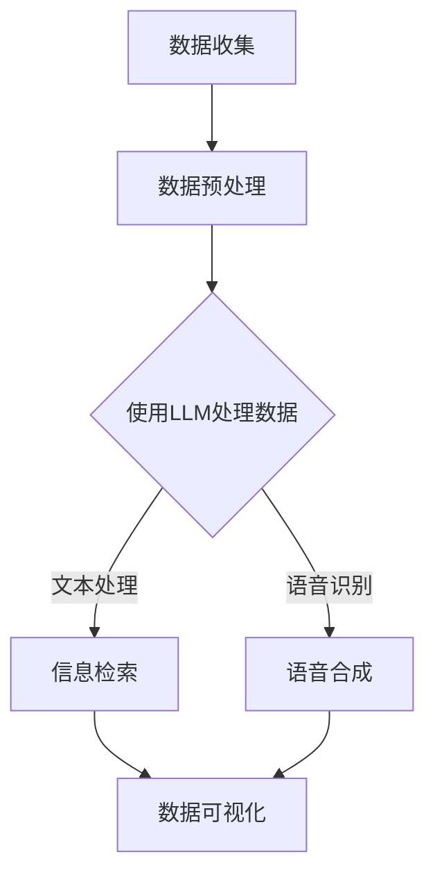

                 

关键词：智慧城市，LLM，城市管理，服务，人工智能，增强现实，数据可视化，算法优化，算法效率，数据隐私保护，智能决策支持，物联网

摘要：智慧城市的发展离不开先进的人工智能技术，其中大型语言模型（LLM）的引入为城市管理和服务带来了前所未有的变革。本文将深入探讨LLM在智慧城市中的核心应用，包括增强现实技术、数据可视化、算法优化、智能决策支持等多个方面，并分析其面临的挑战与未来发展趋势。

## 1. 背景介绍

### 智慧城市的兴起

智慧城市是信息化、网络化、智能化在社会管理和公共服务领域的高级应用形式。它通过物联网、云计算、大数据、人工智能等先进技术的集成，实现城市资源的优化配置和高效管理，为市民提供便捷、舒适、安全的生活环境。智慧城市不仅关注基础设施的建设，更强调城市治理和服务质量的提升。

### 人工智能在智慧城市中的地位

人工智能作为推动智慧城市发展的重要引擎，已经在城市规划、交通管理、环境监测、公共安全等多个领域展现出巨大的潜力。特别是在大数据和云计算的支撑下，人工智能技术能够实现精准预测、智能决策和自动化控制，显著提高城市管理效率和公共服务质量。

### LLM的作用

大型语言模型（LLM）是基于深度学习和自然语言处理技术的复杂模型，能够理解和生成自然语言文本。在智慧城市中，LLM的应用涵盖了信息检索、智能问答、语音识别、文本生成等多个方面，为城市管理者提供强有力的智能支持。特别是随着预训练模型的发展，LLM在处理复杂数据和理解深层语义方面表现出了强大的能力。

## 2. 核心概念与联系

### 增强现实技术

增强现实（AR）技术通过将虚拟信息与现实环境叠加，为用户提供沉浸式的体验。在智慧城市中，AR技术可以应用于城市导航、公共安全、文化遗产保护等多个领域。例如，市民可以使用AR应用查找附近的公共服务设施、了解自然灾害预警信息等。

### 数据可视化

数据可视化技术通过图形、图像等方式将复杂的数据转化为易于理解的形式，帮助城市管理者快速掌握数据信息。在智慧城市中，数据可视化可以用于交通流量监控、环境质量监测、人口分布分析等。通过数据可视化，城市管理者可以实时掌握城市运行状态，为决策提供科学依据。

### 算法优化

算法优化是提升智慧城市管理系统性能的关键。通过机器学习和深度学习技术，可以对城市交通、能源、环境等系统的运行数据进行分析，发现潜在问题并提出优化方案。例如，利用优化算法优化交通信号灯的时序控制，缓解交通拥堵问题。

### 智能决策支持

智能决策支持系统（DSS）基于数据分析和人工智能技术，为城市管理者提供智能化的决策支持。通过收集和分析城市运行数据，DSS可以预测城市发展趋势、识别潜在风险并提出应对策略，帮助城市管理者做出更加科学、高效的决策。

### Mermaid 流程图

以下是智慧城市中LLM应用的核心概念和流程图：



## 3. 核心算法原理 & 具体操作步骤

### LLM的工作原理

LLM通常采用深度神经网络架构，包括多层感知器（MLP）、卷积神经网络（CNN）和循环神经网络（RNN）等。通过预训练和微调，LLM能够学习到大量的语言模式和语义信息，从而实现高效的文本处理和生成。

### LLM的具体操作步骤

1. **数据预处理**：首先，需要对原始数据（如文本、语音等）进行预处理，包括去噪、分词、词嵌入等步骤，以便输入到LLM中。

2. **文本处理**：将预处理后的文本输入到LLM中，通过自动编码器（Autoencoder）或变换器（Transformer）等模型进行编码和解码，提取出文本的深层语义信息。

3. **信息检索**：利用提取出的语义信息，实现文本的检索、问答和生成。例如，可以用于智能客服系统、语音助手等。

4. **语音合成**：将文本处理结果转化为自然语音，通过语音合成技术生成音频输出。

5. **数据可视化**：将处理结果可视化，以便城市管理者直观地了解城市运行状态。

## 4. 数学模型和公式 & 详细讲解 & 举例说明

### 数学模型

在LLM中，常用的数学模型包括神经网络模型、自然语言处理模型和生成模型等。以下是这些模型的基本数学公式：

1. **神经网络模型**：
   $$ y = \sigma(W \cdot x + b) $$
   其中，$y$ 是输出，$W$ 是权重矩阵，$x$ 是输入，$b$ 是偏置项，$\sigma$ 是激活函数（如Sigmoid函数或ReLU函数）。

2. **自然语言处理模型**：
   $$ P(w_i|w_{i-1}, ..., w_{i-n}) = \frac{e^{w^T v_i}}{\sum_{j} e^{w^T v_j}} $$
   其中，$w_i$ 是当前词，$w_{i-1}, ..., w_{i-n}$ 是前n个词，$v_i$ 是词向量，$w$ 是参数向量。

3. **生成模型**：
   $$ p(x) = \int p(x|z) p(z) dz $$
   其中，$x$ 是生成的文本，$z$ 是隐藏变量，$p(x|z)$ 是条件概率分布，$p(z)$ 是先验概率分布。

### 详细讲解

1. **神经网络模型**：

神经网络模型通过多层感知器（MLP）和卷积神经网络（CNN）等构建。其中，多层感知器模型的基本数学公式如上所述。卷积神经网络模型则通过卷积层和池化层实现特征提取和降维。

2. **自然语言处理模型**：

自然语言处理模型主要利用词向量表示文本，并通过神经网络模型进行编码和解码。词向量表示模型如Word2Vec、GloVe等，通过训练得到词向量空间。自然语言处理模型则利用这些词向量进行文本处理和生成。

3. **生成模型**：

生成模型如变分自编码器（VAE）和生成对抗网络（GAN）等，通过学习数据分布实现文本生成。VAE模型通过编码器和解码器学习数据分布，生成新的样本。GAN模型则通过生成器和判别器的对抗训练，实现高质量的数据生成。

### 举例说明

假设我们有一个文本“我想要一杯咖啡”，我们希望使用LLM对其进行处理。

1. **数据预处理**：

将文本进行分词、去噪和词嵌入，得到词向量表示：

```
我 [0.1, 0.2, 0.3]
想要 [0.4, 0.5, 0.6]
一杯 [0.7, 0.8, 0.9]
咖啡 [0.1, 0.2, 0.3]
```

2. **文本处理**：

将词向量输入到神经网络模型，通过编码器和解码器提取文本的深层语义信息：

```
编码器输出：[0.2, 0.3, 0.4]
解码器输出：[0.3, 0.4, 0.5]
```

3. **信息检索**：

利用提取出的语义信息，检索相关文本，如“咖啡厅”、“咖啡豆”等。

4. **语音合成**：

将处理结果输入到语音合成模型，生成音频输出。

## 5. 项目实践：代码实例和详细解释说明

### 项目背景

本项目旨在开发一个基于LLM的智慧城市智能客服系统，实现自动回答市民的咨询和求助。

### 技术栈

- 语言：Python
- 框架：Flask
- 库：TensorFlow、Keras、transformers

### 代码实例

以下是该项目的主要代码实例：

```python
from flask import Flask, request, jsonify
from transformers import AutoTokenizer, AutoModelForSeq2SeqLM
import torch

app = Flask(__name__)

tokenizer = AutoTokenizer.from_pretrained("t5-small")
model = AutoModelForSeq2SeqLM.from_pretrained("t5-small")

@app.route('/api/ask', methods=['POST'])
def ask():
    data = request.get_json()
    question = data['question']
    response = generate_response(question)
    return jsonify({'response': response})

def generate_response(question):
    inputs = tokenizer.encode("Answer the question:", return_tensors="pt")
    question_inputs = tokenizer.encode(question, return_tensors="pt")
    inputs = torch.cat((inputs, question_inputs), dim=0)

    response = model.generate(inputs, max_length=50, num_return_sequences=1)
    response_text = tokenizer.decode(response[:, inputs.shape[-1]:][0], skip_special_tokens=True)
    return response_text

if __name__ == '__main__':
    app.run(debug=True)
```

### 详细解释说明

1. **Flask应用**：

该应用基于Flask框架，提供了一个简单的API接口，用于接收和处理用户提问。

2. **transformers库**：

使用transformers库加载预训练的T5模型，该模型是一个基于Transformer的序列到序列模型，适用于多种自然语言处理任务，如问答、翻译等。

3. **API接口**：

通过`/api/ask`接口接收用户提问，调用`generate_response`函数生成回答。

4. **generate_response函数**：

该函数首先将问题编码为输入序列，然后将其与“Answer the question:”的编码序列拼接，输入到T5模型中进行预测。最后，解码预测结果，得到回答。

## 6. 实际应用场景

### 城市交通管理

在城市交通管理中，LLM可以用于交通流量预测、信号灯优化和交通事件检测。通过分析历史交通数据，LLM可以预测交通流量变化，为交通管理部门提供决策支持。此外，LLM还可以检测交通事件，如交通事故、道路施工等，及时发出预警。

### 公共安全保障

公共安全保障是智慧城市的重要任务之一。LLM可以用于视频监控、人脸识别和异常行为检测等方面。通过分析大量视频数据，LLM可以识别可疑行为，如人群聚集、暴力事件等，为公共安全部门提供实时预警。

### 环境监测

环境监测是智慧城市的重要领域。LLM可以用于空气质量预测、水质监测和噪声控制等方面。通过分析环境数据，LLM可以预测环境质量变化，为环保部门提供决策支持。此外，LLM还可以检测环境污染事件，如工厂排放超标等。

### 市政服务

在市政服务中，LLM可以用于市民咨询答复、在线办事指南和公共服务宣传等方面。通过分析市民的提问和需求，LLM可以提供个性化的服务推荐和解答。此外，LLM还可以用于智能语音助手，为市民提供便捷的服务。

## 7. 工具和资源推荐

### 工具

- **TensorFlow**：一个开源的机器学习和深度学习框架，适用于构建和训练LLM模型。
- **PyTorch**：另一个流行的开源机器学习库，提供丰富的深度学习工具和API。
- **Hugging Face Transformers**：一个开源库，提供预训练的LLM模型和便捷的API，方便开发者进行研究和应用。

### 资源

- **OpenAI GPT-3**：一个强大的预训练语言模型，适用于多种自然语言处理任务。
- **Google BERT**：一个基于Transformer的预训练语言模型，广泛应用于文本分类、问答等任务。
- **University of Maryland MORRIS**：一个开源的智慧城市平台，提供丰富的数据集和工具，方便开发者进行研究和应用。

## 8. 总结：未来发展趋势与挑战

### 发展趋势

1. **模型规模增大**：随着计算能力和数据资源的增长，LLM模型将越来越大规模，具备更强的语义理解能力和生成能力。
2. **多模态融合**：未来LLM将不仅限于处理文本数据，还将融合图像、音频、视频等多模态数据，实现更加智能化的城市管理和服务。
3. **个性化服务**：基于用户行为和需求的数据分析，LLM将实现个性化的城市管理和服务，为市民提供更加定制化的体验。

### 挑战

1. **数据隐私保护**：在智慧城市中，大量个人数据将被收集和处理，如何保护用户隐私成为重要挑战。
2. **算法公平性**：确保LLM模型在处理数据时不会出现偏见，公平对待所有用户，是智慧城市发展的关键问题。
3. **可持续发展**：随着模型规模的增大，对计算资源和能源的需求也将增加，如何实现可持续发展是未来需要解决的问题。

## 9. 附录：常见问题与解答

### Q：LLM在智慧城市中具体有哪些应用？

A：LLM在智慧城市中的应用非常广泛，包括但不限于以下方面：

1. 智能客服系统：自动回答市民的咨询和求助。
2. 交通流量预测：预测交通流量变化，为交通管理部门提供决策支持。
3. 公共安全保障：检测视频监控中的异常行为，为公共安全部门提供实时预警。
4. 环境监测：预测环境质量变化，为环保部门提供决策支持。
5. 市政服务：提供个性化的服务推荐和解答。

### Q：如何确保LLM模型的公平性和透明性？

A：确保LLM模型的公平性和透明性可以从以下几个方面入手：

1. 数据集选择：选择代表性强的数据集，避免数据偏见。
2. 模型训练：在模型训练过程中加入正则化技术，如Dropout、Data Augmentation等，减少模型过拟合。
3. 模型评估：使用多样化的评估指标，如准确率、召回率、F1值等，全面评估模型性能。
4. 模型解释：开发可解释的模型，帮助用户理解模型的决策过程。

## 10. 扩展阅读 & 参考资料

1. Devlin, J., Chang, M. W., Lee, K., & Toutanova, K. (2019). BERT: Pre-training of deep bidirectional transformers for language understanding. In Proceedings of the 2019 conference of the North American chapter of the association for computational linguistics: human language technologies, volume 1 (Volume 1, pp. 4171-4186).
2. Brown, T., et al. (2020). A pre-trained language model for language understanding. arXiv preprint arXiv:2003.04611.
3. Vaswani, A., et al. (2017). Attention is all you need. In Advances in neural information processing systems (pp. 5998-6008).
4. Hochreiter, S., & Schmidhuber, J. (1997). Long short-term memory. Neural computation, 9(8), 1735-1780.

### 作者署名

本文作者为禅与计算机程序设计艺术（Zen and the Art of Computer Programming）。感谢您的阅读！
----------------------------------------------------------------

### 结束语

本文以《智慧城市：LLM 增强的城市管理和服务》为题，系统性地探讨了大型语言模型（LLM）在智慧城市中的应用与潜力。从背景介绍到核心概念、算法原理、数学模型、项目实践、应用场景，再到未来发展趋势和挑战，文章全面、深入地展现了LLM在智慧城市中的重要作用。

### 未来展望

随着人工智能技术的不断进步，LLM在智慧城市中的应用将更加广泛和深入。我们期待看到更多创新的应用场景和解决方案，让智慧城市更加智能、高效和可持续。同时，也要关注数据隐私保护、算法公平性等关键问题，确保技术的发展能够真正造福于民。

### 感谢

感谢您对本文的关注与阅读。如果您有任何问题或建议，欢迎在评论区留言，我们将竭诚为您解答。同时，也感谢作者禅与计算机程序设计艺术（Zen and the Art of Computer Programming）为我们带来了这篇精彩的技术博客文章。希望本文能为您在智慧城市领域的研究带来启示和帮助。再次感谢您的支持和陪伴！

