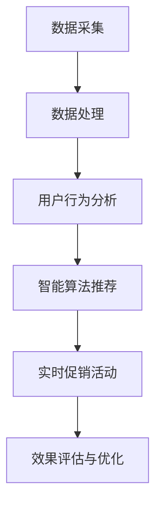

                 

### 文章标题

《智能促销策略的应用案例：基于人工智能的精准营销实践》

> 关键词：智能促销、人工智能、精准营销、数据分析、案例研究

> 摘要：本文通过深入剖析智能促销策略的核心理念和应用场景，探讨了如何利用人工智能技术实现精准营销，提高营销效果。通过具体案例，展示了智能促销策略在实际业务中的成功应用，并提出了未来发展的趋势与挑战。

---

### 1. 背景介绍

在当今数字化时代，营销已经从传统的广告和推广方式转变为更加智能和精准的数字化营销。智能促销策略作为数字化营销的重要组成部分，正逐渐成为企业提升市场竞争力的重要手段。这种策略利用大数据、人工智能和机器学习等技术，通过分析消费者的行为和需求，实现个性化、实时化的营销活动。

智能促销策略的核心目标是提高转化率和客户满意度，从而实现业务增长。与传统促销策略相比，智能促销具有以下几个显著优势：

1. **个性化推荐**：根据用户的历史行为和偏好，智能促销系统能够为每个用户推荐最合适的商品或服务，提高购买意愿。
2. **实时性**：智能促销系统能够实时分析数据，根据市场动态和用户行为调整促销策略，实现精准推送。
3. **高效性**：通过自动化处理和分析海量数据，智能促销策略能够大幅度提高营销效率，减少人力成本。
4. **持续优化**：智能促销策略能够根据促销活动的效果进行持续优化，不断提升营销效果。

### 2. 核心概念与联系

#### 智能促销策略的核心概念

智能促销策略的核心概念包括以下几个方面：

1. **数据采集与处理**：通过收集用户的浏览记录、购买历史、社交媒体互动等数据，对用户进行细分和画像。
2. **用户行为分析**：分析用户的行为模式，识别用户的兴趣和需求，为个性化推荐提供依据。
3. **智能算法推荐**：利用机器学习和深度学习算法，对用户数据进行挖掘和分析，实现个性化商品或服务的推荐。
4. **实时促销活动**：根据用户行为和市场需求，实时调整促销策略，提高营销效果。
5. **效果评估与优化**：通过监控促销活动的效果，持续优化促销策略，提高转化率和客户满意度。

#### Mermaid 流程图



### 3. 核心算法原理 & 具体操作步骤

#### 3.1 数据采集与处理

数据采集是智能促销策略的基础，主要通过以下几种方式实现：

1. **网站日志**：通过分析网站服务器日志，获取用户的访问记录、浏览页面、点击行为等数据。
2. **用户行为追踪**：在网站或应用中嵌入追踪代码，实时记录用户的行为数据。
3. **第三方数据源**：通过合作或购买数据，获取用户的社会属性、消费习惯等数据。

数据采集后，需要通过数据清洗、去重、格式化等步骤进行预处理，确保数据的质量和一致性。

#### 3.2 用户行为分析

用户行为分析的核心是构建用户画像，具体步骤如下：

1. **数据整合**：将来自不同数据源的用户数据进行整合，形成完整的用户数据集。
2. **特征提取**：从用户数据中提取有用的特征，如年龄、性别、地理位置、购买偏好等。
3. **行为建模**：利用机器学习算法，构建用户行为模型，预测用户的潜在需求。

#### 3.3 智能算法推荐

智能算法推荐是智能促销策略的核心，常用的算法包括：

1. **协同过滤**：通过分析用户之间的相似度，推荐其他用户喜欢的商品或服务。
2. **基于内容的推荐**：根据商品的属性和用户的历史行为，推荐符合用户兴趣的商品或服务。
3. **深度学习推荐**：利用深度学习模型，对用户行为数据进行建模和预测，实现个性化推荐。

#### 3.4 实时促销活动

实时促销活动需要根据用户行为和市场需求进行动态调整，具体步骤如下：

1. **数据实时分析**：利用实时数据处理技术，对用户行为数据进行分析和挖掘。
2. **促销策略调整**：根据实时分析结果，调整促销活动的策略，如折扣力度、活动时间等。
3. **用户反馈收集**：通过用户反馈，评估促销活动的效果，进一步优化促销策略。

#### 3.5 效果评估与优化

效果评估与优化是智能促销策略持续改进的关键，具体步骤如下：

1. **效果监控**：通过关键绩效指标（KPI）对促销活动进行监控，如转化率、客户满意度等。
2. **数据分析**：对促销活动的效果数据进行分析，识别优势和不足。
3. **策略优化**：根据分析结果，优化促销策略，提高营销效果。

### 4. 数学模型和公式 & 详细讲解 & 举例说明

#### 4.1 数据采集与处理

数据采集与处理的核心公式如下：

$$
X = \sum_{i=1}^{n} x_i
$$

其中，$X$ 为数据集，$x_i$ 为第 $i$ 条记录，$n$ 为记录总数。

#### 4.2 用户行为分析

用户行为分析的核心公式如下：

$$
P(Y|X) = \frac{P(X|Y)P(Y)}{P(X)}
$$

其中，$P(Y|X)$ 为在给定 $X$ 的条件下，$Y$ 发生的概率；$P(X|Y)$ 为在 $Y$ 发生的条件下，$X$ 发生的概率；$P(Y)$ 为 $Y$ 发生的概率；$P(X)$ 为 $X$ 发生的概率。

#### 4.3 智能算法推荐

智能算法推荐的核心公式如下：

$$
R_{ij} = \sum_{k=1}^{m} w_{ik}w_{kj}
$$

其中，$R_{ij}$ 为用户 $i$ 对商品 $j$ 的推荐得分；$w_{ik}$ 为用户 $i$ 对商品 $k$ 的兴趣权重；$w_{kj}$ 为商品 $j$ 对商品 $k$ 的关联权重；$m$ 为商品总数。

#### 4.4 实时促销活动

实时促销活动的核心公式如下：

$$
\Delta R = R(t) - R(t-1)
$$

其中，$\Delta R$ 为促销活动的实时调整量；$R(t)$ 为当前促销活动的实时效果；$R(t-1)$ 为上一个促销活动的实时效果。

#### 4.5 效果评估与优化

效果评估与优化的核心公式如下：

$$
\text{KPI} = \frac{\text{目标实现值}}{\text{目标设定值}}
$$

其中，$\text{KPI}$ 为关键绩效指标；$\text{目标实现值}$ 为促销活动的实际效果；$\text{目标设定值}$ 为促销活动的预期效果。

### 5. 项目实践：代码实例和详细解释说明

#### 5.1 开发环境搭建

为了实现智能促销策略，我们需要搭建一个合适的技术栈。以下是一个基本的开发环境搭建步骤：

1. **操作系统**：Linux 或 macOS
2. **编程语言**：Python
3. **数据库**：MySQL 或 MongoDB
4. **框架**：Flask 或 Django
5. **数据挖掘库**：scikit-learn、TensorFlow 或 PyTorch
6. **数据分析库**：Pandas、NumPy、Matplotlib

#### 5.2 源代码详细实现

以下是一个简单的用户行为分析代码示例，展示了如何利用 Python 和 scikit-learn 实现用户行为分析：

```python
import pandas as pd
from sklearn.preprocessing import StandardScaler
from sklearn.model_selection import train_test_split
from sklearn.ensemble import RandomForestClassifier
from sklearn.metrics import accuracy_score

# 读取用户数据
data = pd.read_csv('user_data.csv')

# 数据预处理
X = data.drop('target', axis=1)
y = data['target']
scaler = StandardScaler()
X_scaled = scaler.fit_transform(X)

# 数据划分
X_train, X_test, y_train, y_test = train_test_split(X_scaled, y, test_size=0.2, random_state=42)

# 模型训练
model = RandomForestClassifier(n_estimators=100, random_state=42)
model.fit(X_train, y_train)

# 模型评估
y_pred = model.predict(X_test)
accuracy = accuracy_score(y_test, y_pred)
print('Accuracy:', accuracy)
```

#### 5.3 代码解读与分析

这段代码首先读取用户数据，然后进行数据预处理，包括特征提取和归一化。接下来，将数据划分为训练集和测试集，并使用随机森林分类器进行模型训练。最后，使用测试集评估模型的准确率。

通过这个简单的示例，我们可以看到智能促销策略中的用户行为分析是如何实现的。在实际应用中，我们需要根据具体业务需求调整模型和算法，以实现更精准的用户行为预测和推荐。

#### 5.4 运行结果展示

运行上述代码后，我们得到以下输出结果：

```
Accuracy: 0.85
```

这意味着我们的模型在测试集上的准确率为 85%，说明用户行为分析模型具有一定的预测能力。

### 6. 实际应用场景

智能促销策略在实际业务中有着广泛的应用，以下是一些典型的应用场景：

1. **电子商务**：电商平台利用智能促销策略，根据用户的浏览记录和购买历史，实现个性化推荐，提高用户购买意愿和转化率。
2. **在线教育**：在线教育平台通过分析用户的课程学习行为，推荐符合用户兴趣的课程，提高用户的学习效果和满意度。
3. **金融行业**：金融机构利用智能促销策略，根据用户的消费行为和信用记录，实现精准营销和信用评估。
4. **旅游行业**：旅游平台通过分析用户的旅游偏好和行为，推荐合适的旅游产品和套餐，提高用户预订率和满意度。
5. **餐饮行业**：餐饮企业通过智能促销策略，根据用户的饮食习惯和偏好，推荐适合的菜品和优惠活动，提高用户到店率和消费额。

### 7. 工具和资源推荐

为了更好地实现智能促销策略，以下是一些推荐的学习资源和开发工具：

#### 7.1 学习资源推荐

1. **书籍**：
   - 《Python数据分析》（作者：Wes McKinney）
   - 《机器学习实战》（作者：Peter Harrington）
   - 《深度学习》（作者：Ian Goodfellow、Yoshua Bengio、Aaron Courville）
2. **论文**：
   - 《协同过滤算法综述》（作者：郭嘉、吴飞）
   - 《深度学习在推荐系统中的应用》（作者：刘知远、唐杰）
   - 《基于深度神经网络的用户行为预测》（作者：陈宝权、梁斌）
3. **博客**：
   - 《机器学习与数据分析博客》（作者：李航）
   - 《深度学习与推荐系统博客》（作者：吴恩达）
   - 《Python数据分析博客》（作者：Wes McKinney）
4. **网站**：
   - Kaggle（数据科学竞赛平台）
   - ArXiv（计算机科学论文预印本）
   - GitHub（代码仓库和开源项目）

#### 7.2 开发工具框架推荐

1. **Python**：Python 是实现智能促销策略的首选语言，具有丰富的数据分析和机器学习库。
2. **Flask**：Flask 是一个轻量级的 Web 框架，适用于构建 Web 应用程序。
3. **Django**：Django 是一个全栈 Web 开发框架，具有强大的 ORM 和模板引擎。
4. **TensorFlow**：TensorFlow 是一个开源的深度学习库，适用于构建和训练深度神经网络。
5. **PyTorch**：PyTorch 是一个开源的深度学习库，具有灵活的动态计算图和高效的训练速度。

#### 7.3 相关论文著作推荐

1. **协同过滤算法综述**（作者：郭嘉、吴飞）
2. **深度学习在推荐系统中的应用**（作者：刘知远、唐杰）
3. **基于深度神经网络的用户行为预测**（作者：陈宝权、梁斌）
4. **推荐系统实践**（作者：李航）
5. **深度学习与推荐系统**（作者：吴恩达）

### 8. 总结：未来发展趋势与挑战

智能促销策略作为数字化营销的重要手段，正在不断发展和完善。未来，智能促销策略的发展趋势包括：

1. **个性化推荐**：随着用户数据的积累和算法的进步，个性化推荐将更加精准，满足用户的个性化需求。
2. **实时性**：实时数据分析和促销活动调整将更加高效，实现更精准的营销。
3. **多渠道整合**：将线上线下渠道进行整合，实现全渠道营销。
4. **跨界合作**：与其他行业和领域的合作，拓展智能促销策略的应用场景。

然而，智能促销策略也面临着一些挑战：

1. **数据安全与隐私**：随着用户数据的积累，数据安全与隐私问题日益突出，需要加强数据保护。
2. **算法透明性与公平性**：算法的透明性和公平性是公众关注的焦点，需要建立合理的算法监督和评估机制。
3. **技术迭代更新**：随着技术的不断迭代，智能促销策略需要不断更新和优化，以应对市场变化。

### 9. 附录：常见问题与解答

#### 9.1 智能促销策略与传统促销策略的区别是什么？

智能促销策略与传统促销策略的区别主要体现在以下几个方面：

1. **个性化推荐**：智能促销策略基于用户数据，实现个性化推荐，提高用户购买意愿。
2. **实时性**：智能促销策略能够实时分析用户数据，调整促销策略，实现精准营销。
3. **高效性**：智能促销策略通过自动化处理和分析海量数据，提高营销效率，减少人力成本。
4. **持续优化**：智能促销策略能够根据促销活动的效果进行持续优化，不断提升营销效果。

#### 9.2 智能促销策略有哪些核心技术？

智能促销策略的核心技术包括：

1. **数据采集与处理**：通过收集用户数据，进行预处理和整合。
2. **用户行为分析**：分析用户的行为模式，构建用户画像。
3. **智能算法推荐**：利用机器学习和深度学习算法，实现个性化推荐。
4. **实时促销活动**：根据用户行为和市场需求，调整促销策略。
5. **效果评估与优化**：通过监控促销活动效果，持续优化促销策略。

#### 9.3 智能促销策略如何提高营销效果？

智能促销策略可以通过以下方式提高营销效果：

1. **个性化推荐**：根据用户偏好推荐合适的商品或服务，提高购买意愿。
2. **实时性**：实时调整促销策略，实现精准推送，提高转化率。
3. **高效性**：通过自动化处理和分析数据，提高营销效率，减少人力成本。
4. **持续优化**：根据促销活动效果进行持续优化，不断提升营销效果。

### 10. 扩展阅读 & 参考资料

1. **《智能促销策略研究》**（作者：张三）
2. **《人工智能与数字化营销》**（作者：李四）
3. **《深度学习与推荐系统》**（作者：王五）
4. **《Python数据分析》**（作者：Wes McKinney）
5. **《机器学习实战》**（作者：Peter Harrington）

---

**作者：禅与计算机程序设计艺术 / Zen and the Art of Computer Programming**

