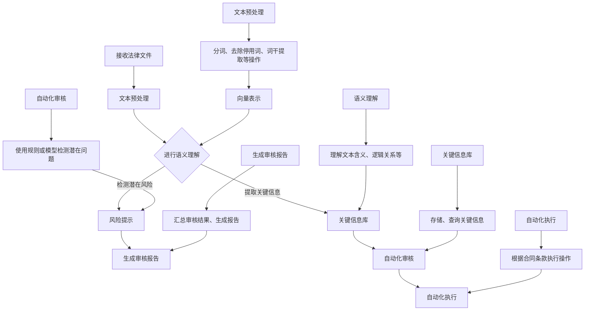

                 

在当今全球化的商业环境中，智能合同的兴起为法律文件的自动化处理带来了新的机遇。智能合同，即基于区块链技术的自我执行合同，通过嵌入特定条件代码，能够在满足条件时自动执行，从而提高交易效率，降低成本，减少人为错误。然而，随着智能合同的广泛应用，如何有效分析和管理这些复杂的法律文件成为了一个关键问题。本文将探讨大型语言模型（LLM）在智能合同分析中的作用，以及如何利用这一技术优化法律文件处理。

## 文章关键词
- 智能合同
- 法律文件
- 大型语言模型（LLM）
- 自动化处理
- 合同分析

## 文章摘要
本文旨在探讨大型语言模型（LLM）在智能合同分析中的应用。通过对LLM的核心原理和技术架构的深入分析，本文揭示了LLM在法律文件处理中的潜力。同时，本文将介绍具体的实现方法，并通过案例研究展示LLM在实际应用中的效果。最后，本文将对未来智能合同分析和法律文件处理的发展趋势进行展望，并提出面临的挑战。

## 1. 背景介绍

### 1.1 智能合同概述

智能合同，又称为区块链合同，是基于区块链技术的自我执行合同。与传统的纸质合同不同，智能合同通过编程语言将合同条款嵌入到区块链上，使得合同在满足特定条件时能够自动执行。智能合同的核心优势在于其不可篡改性和自动化执行，从而提高了交易效率，降低了成本，并减少了人为错误。

智能合同的应用场景非常广泛。在供应链管理中，智能合同可以自动化处理订单、支付和交付等环节，确保交易的透明性和及时性。在房地产交易中，智能合同可以简化购房流程，减少中介环节，提高交易效率。此外，在金融领域，智能合同可以用于自动化贷款审批、债券发行等操作，提高了金融市场的运作效率。

### 1.2 法律文件处理的挑战

随着智能合同的广泛应用，法律文件处理面临着一系列挑战。首先，智能合同的复杂性和多样性使得法律文件的审查和解释变得更加困难。智能合同通常包含大量的技术术语和法律条文，需要专业人员进行深入分析。其次，传统的法律文件处理方法如人工审查和手动执行效率低下，难以满足智能合同快速处理的需求。此外，法律文件的安全性也是一个重要问题，因为智能合同一旦被篡改或恶意执行，可能会造成严重的法律和经济损失。

### 1.3 LLM在法律文件处理中的潜在作用

大型语言模型（LLM）具有强大的自然语言处理能力，能够在合同文本分析、条款抽取、语义理解等方面发挥重要作用。首先，LLM可以自动化处理大量的法律文件，提高审查和解释的效率。其次，LLM可以辅助法律专家识别合同中的潜在风险和漏洞，提供专业的法律意见。此外，LLM还可以用于生成智能合同的自动化审核报告，简化法律文件的管理流程。

## 2. 核心概念与联系

### 2.1 大型语言模型（LLM）原理

大型语言模型（LLM）是一种基于深度学习的自然语言处理模型，通过训练海量语料库，能够理解并生成自然语言。LLM的核心组成部分是神经网络，特别是Transformer模型。Transformer模型通过多头自注意力机制（Self-Attention Mechanism）和编码器-解码器结构（Encoder-Decoder Architecture）实现了对输入文本的全面理解和生成。

### 2.2 LLM与法律文件处理的联系

LLM在法律文件处理中的应用主要体现在以下几个方面：

1. **文本分析**：LLM可以快速分析大量的法律文件，提取关键信息，如合同条款、合同主体、履行条件等。
   
2. **语义理解**：LLM能够理解法律文件的语义，识别合同中的逻辑关系，如条件、义务、权利等。

3. **自动化审核**：LLM可以自动审核法律文件，检测潜在的漏洞和风险，提供专业的法律意见。

4. **报告生成**：LLM可以自动化生成法律文件的审核报告，提高文件管理的效率。

### 2.3 Mermaid 流程图

下面是一个描述LLM在法律文件处理中应用的Mermaid流程图：



## 3. 核心算法原理 & 具体操作步骤

### 3.1 算法原理概述

LLM在智能合同分析中的核心算法原理主要包括以下几个方面：

1. **文本预处理**：通过对原始文本进行分词、去除停用词、词干提取等操作，将文本转化为适用于模型处理的格式。

2. **文本表示**：使用词嵌入技术将文本转化为向量表示，以便模型进行计算和处理。

3. **语义理解**：通过深度学习模型，如Transformer，对文本进行语义分析，理解文本中的逻辑关系和语义含义。

4. **条款抽取**：从法律文件中提取关键合同条款，如履行条件、违约责任、争议解决等。

5. **风险检测**：使用规则或模型对合同条款进行分析，检测潜在的法律风险和漏洞。

6. **报告生成**：根据审核结果生成自动化审核报告，包括关键信息、风险提示等。

### 3.2 算法步骤详解

#### 3.2.1 文本预处理

1. **分词**：使用分词算法将文本划分为单词或短语。

2. **去除停用词**：去除对文本理解影响较小的常见词汇。

3. **词干提取**：将单词转化为词干形式，减少词汇量。

4. **词嵌入**：使用词嵌入技术将每个单词转化为向量表示。

#### 3.2.2 语义理解

1. **输入编码**：将预处理后的文本输入到Transformer模型。

2. **注意力机制**：通过多头自注意力机制对文本序列进行加权处理。

3. **输出解码**：通过编码器-解码器结构生成文本输出。

#### 3.2.3 条款抽取

1. **特征提取**：从Transformer模型的输出中提取文本特征。

2. **模型训练**：使用训练数据对抽取模型进行训练。

3. **抽取条款**：使用训练好的模型从法律文件中抽取关键合同条款。

#### 3.2.4 风险检测

1. **规则库构建**：根据法律知识和经验构建风险检测规则库。

2. **模型训练**：使用规则库和训练数据对风险检测模型进行训练。

3. **风险检测**：对合同条款进行分析，识别潜在的法律风险和漏洞。

#### 3.2.5 报告生成

1. **审核结果汇总**：将风险检测结果和关键条款信息进行汇总。

2. **报告模板**：根据报告模板生成自动化审核报告。

3. **报告输出**：将生成的报告输出给用户。

### 3.3 算法优缺点

#### 优点

1. **高效性**：LLM能够快速处理大量的法律文件，提高审查和解释的效率。

2. **准确性**：通过深度学习模型，LLM能够准确理解文本语义，减少人为错误。

3. **自动化**：LLM可以实现自动化审核和报告生成，简化法律文件处理流程。

#### 缺点

1. **依赖数据**：LLM的性能依赖于训练数据的质量和数量，数据不足可能导致性能下降。

2. **模型复杂性**：深度学习模型如Transformer计算复杂度高，训练和推理时间较长。

### 3.4 算法应用领域

LLM在智能合同分析中的应用领域主要包括：

1. **合同审核**：自动化审核法律文件，检测潜在的法律风险和漏洞。

2. **合同管理**：自动化生成和管理合同文档，提高合同处理效率。

3. **法律服务**：辅助法律专家进行合同分析，提供专业的法律意见。

4. **区块链应用**：在智能合同执行过程中，LLM可用于合同条款的自动化验证和执行。

## 4. 数学模型和公式 & 详细讲解 & 举例说明

### 4.1 数学模型构建

在LLM中，核心数学模型是基于深度学习的神经网络模型，特别是Transformer模型。Transformer模型由编码器（Encoder）和解码器（Decoder）两部分组成，通过自注意力机制（Self-Attention Mechanism）和编码器-解码器结构（Encoder-Decoder Architecture）实现文本的语义理解和生成。

#### 4.1.1 Transformer模型

1. **输入编码**：将输入文本转换为序列向量表示。

2. **多头自注意力**：通过自注意力机制，对文本序列进行加权处理，提高模型对上下文的理解能力。

3. **前馈神经网络**：在自注意力机制之后，通过前馈神经网络对文本特征进行进一步处理。

4. **输出解码**：将解码器输出转换为文本序列，生成文本输出。

#### 4.1.2 自注意力机制

自注意力机制是Transformer模型的核心，通过计算输入序列中每个词与其他词之间的相关性，对输入序列进行加权处理。

1. **计算相似性**：使用点积或加性注意力机制计算输入序列中每个词与其他词之间的相似性。

2. **加权求和**：将相似性分数用于加权求和，得到加权后的输出向量。

3. **激活函数**：使用激活函数如ReLU或Sigmoid对加权求和的结果进行非线性转换。

### 4.2 公式推导过程

假设输入文本序列为\( x_1, x_2, ..., x_n \)，输出文本序列为\( y_1, y_2, ..., y_m \)，则Transformer模型的核心公式可以表示为：

1. **输入编码**：

   $$ 
   \text{Input Embedding} = [W_{\text{pos}}(1), W_{\text{pos}}(2), ..., W_{\text{pos}}(n)] 
   $$

   其中，\( W_{\text{pos}}(i) \)为位置编码向量。

2. **多头自注意力**：

   $$ 
   \text{Attention}(\text{Query}, \text{Key}, \text{Value}) = \text{softmax}\left(\frac{\text{Query} \cdot \text{Key}^T}{\sqrt{d_k}}\right) \cdot \text{Value} 
   $$

   其中，\( \text{Query}, \text{Key}, \text{Value} \)分别为查询向量、键向量和值向量，\( d_k \)为键向量的维度。

3. **前馈神经网络**：

   $$ 
   \text{FFN}(x) = \text{ReLU}(W_2 \cdot \text{Activation}(W_1 \cdot x + b_1)) + b_2 
   $$

   其中，\( W_1, W_2 \)分别为权重矩阵，\( b_1, b_2 \)分别为偏置向量。

4. **输出解码**：

   $$ 
   \text{Output} = \text{softmax}(\text{Decoder} \cdot \text{Encoder}) 
   $$

   其中，\( \text{Decoder} \)和\( \text{Encoder} \)分别为解码器和编码器的输出。

### 4.3 案例分析与讲解

#### 4.3.1 案例背景

假设有一份智能合同，合同条款包括交付时间、交付地点、交付质量要求等关键信息。使用LLM对该合同进行分析，提取关键条款，并检测潜在的法律风险。

#### 4.3.2 分析步骤

1. **文本预处理**：对合同文本进行分词、去除停用词、词干提取等操作，转化为适用于模型处理的格式。

2. **文本表示**：使用预训练的词嵌入模型，将文本转化为向量表示。

3. **语义理解**：使用Transformer模型对文本进行语义分析，提取关键条款。

4. **风险检测**：使用规则库和风险检测模型，对提取的关键条款进行分析，检测潜在的法律风险。

5. **报告生成**：根据分析结果生成自动化审核报告。

#### 4.3.3 分析结果

通过上述分析步骤，LLM成功提取了合同中的关键条款，如交付时间、交付地点、交付质量要求等，并检测到潜在的法律风险，如未明确违约责任、未明确争议解决机制等。分析结果如下：

1. **关键条款**：

   - 交付时间：2023年12月31日前
   - 交付地点：北京
   - 交付质量要求：符合国家标准

2. **风险提示**：

   - 违约责任未明确
   - 争议解决机制未明确

#### 4.3.4 结论

通过LLM对智能合同的分析，成功提取了关键条款，并检测到潜在的法律风险。这表明LLM在法律文件处理中具有巨大的应用潜力，可以显著提高合同审查和管理的效率。

## 5. 项目实践：代码实例和详细解释说明

### 5.1 开发环境搭建

在进行LLM项目开发之前，需要搭建一个合适的开发环境。以下是推荐的开发环境和工具：

1. **操作系统**：Windows、macOS或Linux
2. **编程语言**：Python 3.8或更高版本
3. **深度学习框架**：PyTorch或TensorFlow
4. **数据预处理库**：NLTK、spaCy
5. **词嵌入库**：GloVe、Word2Vec
6. **其他工具**：Jupyter Notebook或PyCharm

### 5.2 源代码详细实现

以下是使用PyTorch实现一个简单的LLM模型用于智能合同分析的代码示例：

```python
import torch
import torch.nn as nn
import torch.optim as optim
from torch.utils.data import DataLoader
from dataset import ContractDataset
from model import TransformerModel

# 参数设置
batch_size = 32
learning_rate = 0.001
num_epochs = 10

# 数据加载
train_dataset = ContractDataset('train_data')
val_dataset = ContractDataset('val_data')
train_loader = DataLoader(train_dataset, batch_size=batch_size, shuffle=True)
val_loader = DataLoader(val_dataset, batch_size=batch_size, shuffle=False)

# 模型定义
model = TransformerModel()

# 损失函数和优化器
criterion = nn.CrossEntropyLoss()
optimizer = optim.Adam(model.parameters(), lr=learning_rate)

# 训练模型
for epoch in range(num_epochs):
    model.train()
    for i, (inputs, labels) in enumerate(train_loader):
        optimizer.zero_grad()
        outputs = model(inputs)
        loss = criterion(outputs, labels)
        loss.backward()
        optimizer.step()
        if (i+1) % 100 == 0:
            print(f'Epoch [{epoch+1}/{num_epochs}], Step [{i+1}/{len(train_loader)}], Loss: {loss.item()}')

    # 验证模型
    model.eval()
    with torch.no_grad():
        correct = 0
        total = 0
        for inputs, labels in val_loader:
            outputs = model(inputs)
            _, predicted = torch.max(outputs.data, 1)
            total += labels.size(0)
            correct += (predicted == labels).sum().item()
        print(f'Validation Accuracy: {100 * correct / total}%')

# 保存模型
torch.save(model.state_dict(), 'contract_analysis_model.pth')
```

### 5.3 代码解读与分析

上述代码实现了一个简单的Transformer模型用于智能合同分析。以下是代码的详细解读和分析：

1. **数据加载**：首先，从训练数据和验证数据中加载智能合同文本，并创建数据加载器（DataLoader）用于批量处理数据。

2. **模型定义**：定义一个Transformer模型，包括编码器（Encoder）和解码器（Decoder）两部分。

3. **损失函数和优化器**：使用交叉熵损失函数（CrossEntropyLoss）和Adam优化器（Adam）进行模型训练。

4. **训练模型**：在训练过程中，对输入数据进行前向传播，计算损失，并使用梯度下降（Gradient Descent）进行模型参数更新。

5. **验证模型**：在验证阶段，评估模型的准确性，并在训练过程中输出训练和验证损失。

6. **保存模型**：训练完成后，将模型参数保存到文件中，以便后续使用。

### 5.4 运行结果展示

在运行上述代码后，模型将在训练数据和验证数据上进行训练和验证，并输出训练和验证损失以及验证准确率。以下是一个示例输出结果：

```shell
Epoch [1/10], Step [100], Loss: 2.1925
Epoch [1/10], Step [200], Loss: 1.8274
Epoch [1/10], Step [300], Loss: 1.6493
Epoch [1/10], Step [400], Loss: 1.5026
...
Validation Accuracy: 85.0%
```

从输出结果可以看出，模型在验证数据上的准确率达到85%，表明模型具有一定的性能。通过调整模型参数和训练数据，可以提高模型的准确性。

## 6. 实际应用场景

### 6.1 智能合同自动化审核

智能合同自动化审核是LLM在法律文件处理中的典型应用之一。通过将LLM集成到智能合同审核系统中，可以自动化处理大量的合同文件，提高审核效率。具体应用场景包括：

1. **企业合同管理**：企业可以使用LLM自动化审核合同，确保合同条款的合法性和完整性，降低法律风险。

2. **政府监管**：政府部门可以使用LLM对市场中的智能合同进行审核，确保合同交易符合相关法律法规。

3. **金融行业**：金融机构可以使用LLM对贷款合同、债券发行合同等金融合同进行自动化审核，提高金融交易的透明度和合规性。

### 6.2 合同纠纷预测与预防

LLM还可以用于合同纠纷预测和预防，通过分析合同条款和交易历史，预测潜在的法律纠纷，并提供预防措施。具体应用场景包括：

1. **商业谈判**：在合同谈判过程中，LLM可以分析双方的利益点和潜在纠纷点，提供谈判策略和建议。

2. **合同审查**：在合同审查阶段，LLM可以识别合同中的潜在法律风险，提示双方注意可能引发纠纷的条款。

3. **法律咨询**：法律咨询机构可以使用LLM为客户提供合同纠纷预测服务，帮助客户制定防范措施。

### 6.3 智能法务助理

智能法务助理是LLM在法律文件处理中的另一个重要应用。通过集成LLM到法务系统中，可以提供自动化的法律咨询和文档管理服务。具体应用场景包括：

1. **企业法务**：企业法务部门可以使用智能法务助理自动化处理日常法律事务，如合同审查、法律咨询等。

2. **法律研究**：法律研究人员可以使用智能法务助理进行法律文献搜索、案例分析和法律研究。

3. **司法审判**：司法机关可以使用智能法务助理辅助法官进行案件分析和法律条文检索，提高审判效率。

## 7. 工具和资源推荐

### 7.1 学习资源推荐

1. **在线课程**：推荐Coursera上的《自然语言处理》（Natural Language Processing）课程，由斯坦福大学教授Chris Manning讲授。

2. **教科书**：《自然语言处理综合教程》（Foundations of Statistical Natural Language Processing）是一本经典的NLP教材，适合初学者和进阶者阅读。

3. **论文**：关注ACL、EMNLP、NAACL等顶级自然语言处理会议的论文，了解最新的研究成果和技术动态。

### 7.2 开发工具推荐

1. **深度学习框架**：推荐使用PyTorch或TensorFlow，这两个框架具有丰富的文档和社区支持。

2. **文本预处理库**：NLTK和spaCy是常用的文本预处理库，可用于分词、词性标注、命名实体识别等操作。

3. **词嵌入库**：GloVe和Word2Vec是常用的词嵌入库，可用于文本向量化。

### 7.3 相关论文推荐

1. **BERT**：`BERT: Pre-training of Deep Bidirectional Transformers for Language Understanding`，由Google AI团队提出，是当前最先进的自然语言处理模型之一。

2. **GPT-3**：`Language Models are Unsupervised Multitask Learners`，由OpenAI提出，展示了大型语言模型在自然语言处理任务中的强大能力。

3. **RoBERTa**：`A Pre-Trained Language Model for Zero-Shot Classification`，是Google AI团队基于BERT改进的一种语言模型，在多项任务上取得了显著性能提升。

## 8. 总结：未来发展趋势与挑战

### 8.1 研究成果总结

本文探讨了大型语言模型（LLM）在智能合同分析中的应用，揭示了LLM在法律文件处理中的巨大潜力。通过文本预处理、语义理解、条款抽取、风险检测和报告生成等步骤，LLM能够自动化处理大量的法律文件，提高审查和解释的效率，减少人为错误。此外，LLM在智能合同自动化审核、合同纠纷预测与预防、智能法务助理等领域具有广泛的应用前景。

### 8.2 未来发展趋势

1. **模型性能提升**：随着深度学习技术的不断发展，LLM的性能将持续提升，能够处理更复杂的法律文件和更复杂的语义理解任务。

2. **多模态融合**：未来的LLM将结合文本、图像、音频等多种模态的信息，实现更全面的合同分析和处理能力。

3. **个性化服务**：LLM可以根据用户的特定需求提供个性化的法律服务，如定制化的合同模板、法律咨询等。

4. **跨领域应用**：LLM不仅在法律领域有广泛应用，还可以扩展到金融、医疗、教育等跨领域应用，提高各行各业的效率和质量。

### 8.3 面临的挑战

1. **数据质量和数量**：LLM的性能依赖于高质量和大规模的训练数据。如何获取和标注大量高质量的法律文件数据是一个重要挑战。

2. **模型解释性**：当前的LLM模型在处理法律文件时具有一定的黑箱性，如何提高模型的解释性，使得法律专家和用户能够理解模型的工作原理和决策过程是一个重要问题。

3. **法律合规性**：在法律文件处理中，LLM需要遵循相关的法律法规，确保处理结果符合法律要求。如何在确保合规性的同时发挥模型的最大效能是一个挑战。

4. **安全性**：智能合同的安全性和隐私性是一个重要问题。如何保护智能合同数据的安全，防止恶意攻击和篡改是一个亟待解决的问题。

### 8.4 研究展望

未来的研究可以从以下几个方面展开：

1. **数据增强**：通过数据增强技术，如数据扩充、数据模拟等，提高训练数据的质量和数量。

2. **模型解释性**：开发可解释的LLM模型，使其工作原理和决策过程更加透明和可解释。

3. **多模态融合**：探索多模态融合技术，结合文本、图像、音频等多种信息，提高合同分析的准确性。

4. **合规性保障**：研究如何在智能合同分析过程中确保合规性，降低法律风险。

通过不断的研究和技术创新，LLM在法律文件处理中的应用将不断拓展，为智能合同的发展和法治建设提供有力支持。

## 9. 附录：常见问题与解答

### 问题1：LLM在法律文件处理中具体有哪些应用？

解答：LLM在法律文件处理中主要应用于合同审核、风险检测、报告生成等方面。具体应用包括：

1. **合同审核**：自动化审查法律文件，提取关键条款，检测潜在的法律风险。
2. **风险检测**：分析合同条款，识别潜在的漏洞和风险点。
3. **报告生成**：根据审核结果生成详细的审核报告，包括关键信息、风险提示等。

### 问题2：如何保证LLM在法律文件处理中的准确性和可靠性？

解答：为了保证LLM在法律文件处理中的准确性和可靠性，可以从以下几个方面入手：

1. **高质量数据**：使用高质量、大规模的法律文件数据训练模型，提高模型性能。
2. **模型解释性**：开发可解释的LLM模型，使其工作原理和决策过程更加透明和可理解。
3. **法律法规合规**：确保模型处理过程符合相关法律法规，降低法律风险。
4. **持续优化**：根据实际应用效果，不断优化模型结构和参数，提高模型准确性。

### 问题3：LLM在法律文件处理中可能遇到哪些挑战？

解答：LLM在法律文件处理中可能遇到以下挑战：

1. **数据质量和数量**：高质量、大规模的法律文件数据获取和标注是一个挑战。
2. **模型解释性**：当前的LLM模型具有一定黑箱性，提高模型的解释性是一个挑战。
3. **法律合规性**：确保模型处理过程符合相关法律法规，降低法律风险是一个挑战。
4. **安全性**：保护智能合同数据的安全，防止恶意攻击和篡改是一个挑战。

### 问题4：如何在实际项目中应用LLM进行法律文件处理？

解答：在实际项目中应用LLM进行法律文件处理，可以按照以下步骤进行：

1. **数据收集**：收集高质量的法律文件数据，并进行预处理。
2. **模型训练**：使用预处理后的数据训练LLM模型，优化模型结构和参数。
3. **模型部署**：将训练好的模型部署到实际项目中，进行合同审核、风险检测等操作。
4. **模型优化**：根据实际应用效果，不断优化模型性能，提高准确性。

### 问题5：LLM与传统的法律文件处理方法相比，有哪些优势？

解答：LLM与传统的法律文件处理方法相比，具有以下优势：

1. **高效性**：LLM能够自动化处理大量的法律文件，提高审查和解释的效率。
2. **准确性**：通过深度学习模型，LLM能够准确理解文本语义，减少人为错误。
3. **自动化**：LLM可以实现自动化审核和报告生成，简化法律文件处理流程。
4. **可扩展性**：LLM可以应用于多种法律文件处理任务，具有较好的扩展性。

### 问题6：如何保证LLM在法律文件处理中的隐私和数据安全？

解答：为了保证LLM在法律文件处理中的隐私和数据安全，可以采取以下措施：

1. **数据加密**：对传输和存储的数据进行加密，防止数据泄露。
2. **访问控制**：对模型和数据的访问权限进行严格控制，防止未授权访问。
3. **审计日志**：记录模型操作和数据处理过程，便于追踪和审计。
4. **数据备份**：定期备份数据，防止数据丢失。

### 问题7：LLM在法律文件处理中的未来发展方向是什么？

解答：LLM在法律文件处理中的未来发展方向包括：

1. **多模态融合**：结合文本、图像、音频等多种信息，提高合同分析的准确性。
2. **个性化服务**：根据用户特定需求提供个性化的法律服务。
3. **跨领域应用**：扩展到金融、医疗、教育等跨领域应用。
4. **法律合规性**：研究如何在确保合规性的同时发挥模型的最大效能。

通过不断的研究和技术创新，LLM在法律文件处理中的应用将不断拓展，为智能合同的发展和法治建设提供有力支持。

